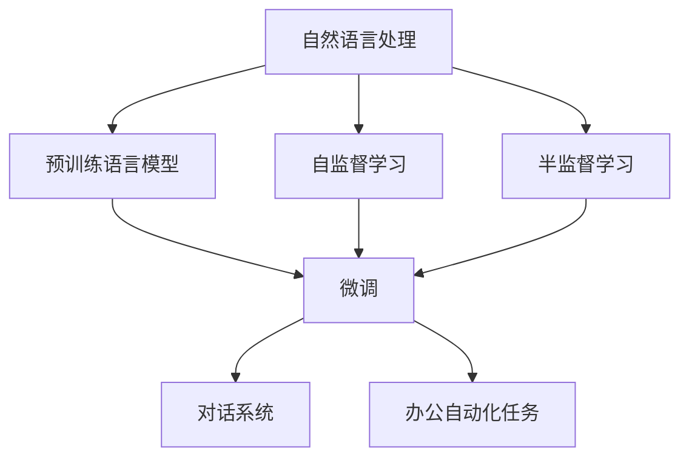
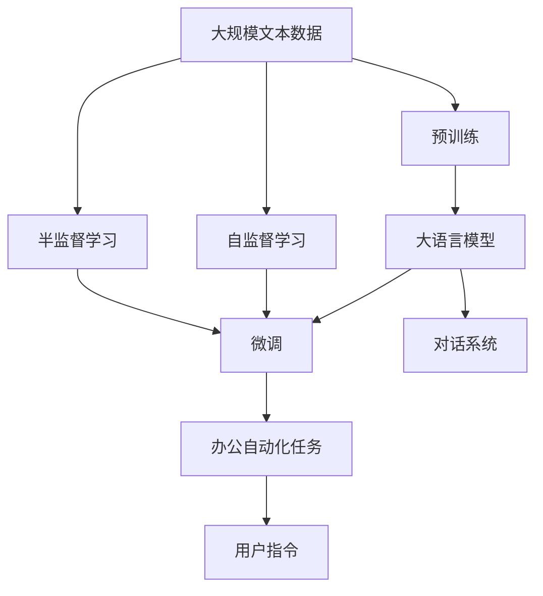

                 

# 微软Office 365 Copilot系列的功能

## 1. 背景介绍

### 1.1 问题由来
近年来，人工智能技术在办公自动化领域取得了显著进展，特别是Office 365 Copilot系列产品的推出，极大提升了办公效率和生产力。该系列产品包括Office 365 Copilot、Copilot for Outlook、Copilot for Word等，通过自然语言处理(NLP)技术，帮助用户自动完成文档编辑、邮件回复、会议安排、数据分析等任务。本文将详细介绍Office 365 Copilot系列的功能、技术原理及其实际应用效果。

### 1.2 问题核心关键点
Office 365 Copilot系列的核心优势在于其强大的自然语言理解和生成能力，能够通过理解用户指令，自动完成各类办公任务。具体而言，其功能包括但不限于：
- 自动生成和编辑文档：根据用户描述，自动生成各种格式的文档，如报告、合同、简历等。
- 智能回复邮件：自动回复简单的邮件，根据上下文生成个性化回复。
- 会议安排助手：自动安排会议时间，生成会议议程，提醒参会者。
- 数据可视化：通过自然语言描述，自动生成可视化图表。
- 代码辅助编程：自动编写和调试代码，提高编程效率。
- 语言翻译：自动翻译多语言文本，支持语音输入和输出。

这些功能的实现离不开先进的自然语言处理技术，包括语言模型、语义理解、生成模型等。以下将详细介绍Office 365 Copilot系列的核心技术。

## 2. 核心概念与联系

### 2.1 核心概念概述

为更好地理解Office 365 Copilot的功能，本节将介绍几个密切相关的核心概念：

- 自然语言处理(Natural Language Processing, NLP)：涉及计算机对人类语言进行理解、处理和生成的技术。包括文本处理、语言理解、语义分析、机器翻译等。
- 预训练语言模型(Pre-trained Language Model)：如GPT、BERT等，通过大规模无标签数据训练得到的通用语言模型，能够理解和生成自然语言。
- 微调(Fine-tuning)：在预训练模型基础上，针对特定任务进行有监督训练，以获得任务特定的模型。
- 对话系统(DialoGPT)：一种基于Transformer模型的对话生成模型，能够理解和生成自然语言对话。
- 自监督学习(Self-supervised Learning)：利用自身的数据生成任务，进行无监督学习，增强模型泛化能力。
- 半监督学习(Semi-supervised Learning)：结合少量标注数据和大量未标注数据，进行混合学习。

这些概念之间存在着紧密的联系，形成了Office 365 Copilot的核心技术架构。

### 2.2 概念间的关系

这些核心概念之间的关系可以通过以下Mermaid流程图来展示：



这个流程图展示了大语言模型在Office 365 Copilot中的应用：
- 自然语言处理通过预训练语言模型获取语言的通用表示，用于理解用户指令。
- 微调通过标注数据训练任务特定的模型，用于执行办公自动化任务。
- 对话系统通过自然语言处理，生成个性化的对话回复。
- 自监督学习和半监督学习分别通过自身生成的数据进行无监督学习和混合学习，增强模型的泛化能力。
- 最终，Office 365 Copilot通过微调得到的模型，自动完成各种办公任务。

### 2.3 核心概念的整体架构

最后，我们用一个综合的流程图来展示Office 365 Copilot的核心概念和大语言模型的整体架构：



这个综合流程图展示了从预训练到大语言模型，再到Office 365 Copilot的完整过程：
- 大规模文本数据通过预训练得到大语言模型。
- 大语言模型通过微调得到任务特定的模型，用于执行办公自动化任务。
- 对话系统基于大语言模型，生成个性化的对话回复。
- 自监督学习和半监督学习分别通过自身生成的数据进行无监督学习和混合学习，增强模型的泛化能力。
- Office 365 Copilot通过微调得到的模型，自动完成各种办公任务。

这些核心概念共同构成了Office 365 Copilot的技术框架，使其能够在各种办公场景下发挥强大的语言理解和生成能力。通过理解这些核心概念，我们可以更好地把握Office 365 Copilot的功能实现和优化方向。

## 3. 核心算法原理 & 具体操作步骤
### 3.1 算法原理概述

Office 365 Copilot系列的功能实现，主要依赖于基于Transformer的预训练语言模型。通过在大规模无标签文本数据上进行自监督预训练，语言模型学到了通用的语言知识和表示。然后，通过微调针对特定任务进行优化，使得模型能够执行各种办公自动化任务。

Office 365 Copilot的核心算法原理包括以下几个方面：
1. 自监督预训练：通过掩码语言模型、下一句预测等任务，训练语言模型的通用表示。
2. 微调：在预训练模型基础上，使用标注数据进行有监督训练，优化模型在特定任务上的表现。
3. 对话生成：通过对话系统，利用自回归模型生成自然语言对话，提高用户交互体验。
4. 代码辅助编程：通过代码自动补全、代码调试等技术，提高编程效率。
5. 数据分析：通过自然语言处理，自动生成数据可视化图表。

### 3.2 算法步骤详解

以下是Office 365 Copilot功能实现的详细步骤：

**Step 1: 准备预训练模型和数据集**
- 选择合适的预训练语言模型，如GPT、BERT等。
- 准备办公自动化任务的数据集，如文档、邮件、会议、代码等。

**Step 2: 添加任务适配层**
- 根据任务类型，设计合适的输出层和损失函数。
- 对于文本生成任务，通常使用语言模型的解码器输出概率分布，并以负对数似然为损失函数。

**Step 3: 设置微调超参数**
- 选择合适的优化算法及其参数，如Adam、SGD等，设置学习率、批大小、迭代轮数等。
- 设置正则化技术及强度，包括权重衰减、Dropout、Early Stopping等。
- 确定冻结预训练参数的策略，如仅微调顶层，或全部参数都参与微调。

**Step 4: 执行梯度训练**
- 将训练集数据分批次输入模型，前向传播计算损失函数。
- 反向传播计算参数梯度，根据设定的优化算法和学习率更新模型参数。
- 周期性在验证集上评估模型性能，根据性能指标决定是否触发 Early Stopping。
- 重复上述步骤直到满足预设的迭代轮数或 Early Stopping 条件。

**Step 5: 测试和部署**
- 在测试集上评估微调后模型，对比微调前后的性能提升。
- 使用微调后的模型对新样本进行推理预测，集成到实际的应用系统中。
- 持续收集新的数据，定期重新微调模型，以适应数据分布的变化。

以上是Office 365 Copilot功能实现的一般流程。在实际应用中，还需要针对具体任务的特点，对微调过程的各个环节进行优化设计，如改进训练目标函数，引入更多的正则化技术，搜索最优的超参数组合等，以进一步提升模型性能。

### 3.3 算法优缺点

Office 365 Copilot具有以下优点：
1. 功能全面：覆盖了文档编辑、邮件回复、会议安排、数据分析、编程辅助等多个办公自动化任务，大大提升了办公效率。
2. 用户友好：通过自然语言指令，用户可以轻松输入任务需求，无需掌握复杂的技术操作。
3. 适应性强：通过微调，模型能够适应各种数据分布和任务类型，具有较强的泛化能力。
4. 灵活可扩展：基于Transformer模型，可以轻松引入更多任务和数据，进行模型复用和扩展。

同时，该方法也存在一些局限性：
1. 依赖标注数据：微调效果很大程度上取决于标注数据的质量和数量，获取高质量标注数据的成本较高。
2. 模型规模庞大：预训练语言模型参数量庞大，微调时计算资源和存储空间需求较高。
3. 泛化能力有限：当目标任务与预训练数据的分布差异较大时，微调的性能提升有限。
4. 可解释性不足：微调模型的决策过程通常缺乏可解释性，难以对其推理逻辑进行分析和调试。

尽管存在这些局限性，但就目前而言，Office 365 Copilot仍然是办公自动化领域最先进的技术方案。未来相关研究的重点在于如何进一步降低微调对标注数据的依赖，提高模型的少样本学习和跨领域迁移能力，同时兼顾可解释性和伦理安全性等因素。

### 3.4 算法应用领域

Office 365 Copilot的功能在许多行业领域得到了广泛应用，例如：

- 企业办公：支持各种文档编辑、邮件回复、会议安排、数据可视化等任务，显著提升了企业办公效率。
- 教育培训：帮助教师自动生成课件、作业、课程表等，辅助学生自动答疑、生成学习报告。
- 医疗健康：支持自动生成病历、医疗报告、治疗方案等，辅助医生进行诊疗决策。
- 金融服务：自动生成财务报告、客户服务邮件、信用评估报告等，提升金融机构的运营效率。
- 新闻媒体：自动生成新闻稿、编辑修改、数据分析等，辅助记者进行新闻采编工作。

除了上述这些领域外，Office 365 Copilot还在更多场景中得到应用，如政府服务、司法审判、法律咨询等，成为各行各业提升工作效率、增强服务质量的重要工具。

## 4. 数学模型和公式 & 详细讲解 & 举例说明

### 4.1 数学模型构建

Office 365 Copilot的核心算法涉及自然语言处理、语言模型、微调等多个方面。以下是一些关键的数学模型和公式。

**掩码语言模型(Masked Language Model, MLM)**
掩码语言模型是Office 365 Copilot预训练的核心任务之一。假设有训练集$D=\{(x_i, y_i)\}_{i=1}^N$，其中$x_i$为输入文本，$y_i$为掩码后的输出文本。模型通过预测被掩码的部分单词，学习语言的语法和语义结构。掩码语言模型的损失函数为：

$$
\mathcal{L}_{MLM} = -\sum_{i=1}^N \sum_{m=1}^M \log p(y_{im} | x_i, \tilde{y}_{i\backslash m})
$$

其中，$y_{im}$表示文本$x_i$中第$m$个被掩码的单词，$p(y_{im} | x_i, \tilde{y}_{i\backslash m})$表示模型在给定上下文$x_i$和掩码后的文本$\tilde{y}_{i\backslash m}$下，预测单词$y_{im}$的概率。

**自回归语言模型(autoregressive language model)**
自回归语言模型通过预测下一个单词的概率分布，学习语言的生成规律。Office 365 Copilot通过解码器来执行自回归任务，其目标函数为：

$$
\mathcal{L}_{AR} = -\sum_{i=1}^N \sum_{j=1}^T \log p(x_{ij} | x_{ij-1}, x_{ij-2}, \cdots, x_{i1})
$$

其中，$x_{ij}$表示文本$x_i$中的第$j$个单词，$p(x_{ij} | x_{ij-1}, x_{ij-2}, \cdots, x_{i1})$表示模型在给定前文$x_{ij-1}, x_{ij-2}, \cdots, x_{i1}$下，预测单词$x_{ij}$的概率。

**微调模型的损失函数**
微调模型的目标函数为：

$$
\mathcal{L}_{fine-tune} = \frac{1}{N} \sum_{i=1}^N \ell(x_i, y_i)
$$

其中，$\ell(x_i, y_i)$表示模型在文本$x_i$和其对应的标注$y_i$上的损失函数。对于文本生成任务，通常使用交叉熵损失函数。

### 4.2 公式推导过程

以下是对掩码语言模型、自回归语言模型和微调模型的公式推导过程。

**掩码语言模型的推导**
掩码语言模型通过掩码部分单词，训练模型预测被掩码的部分单词。假设文本$x_i$的长度为$T$，其中$m$个单词被随机掩码，则模型需要预测这些被掩码的单词。设模型在文本$x_i$和其掩码后的文本$\tilde{y}_{i\backslash m}$下，预测单词$y_{im}$的概率为$p(y_{im} | x_i, \tilde{y}_{i\backslash m})$。掩码语言模型的损失函数为：

$$
\mathcal{L}_{MLM} = -\sum_{i=1}^N \sum_{m=1}^M \log p(y_{im} | x_i, \tilde{y}_{i\backslash m})
$$

其中，$y_{im}$表示文本$x_i$中第$m$个被掩码的单词，$\tilde{y}_{i\backslash m}$表示掩码后的文本。

**自回归语言模型的推导**
自回归语言模型通过预测下一个单词的概率分布，学习语言的生成规律。假设文本$x_i$的长度为$T$，模型需要在给定前文$x_{ij-1}, x_{ij-2}, \cdots, x_{i1}$下，预测单词$x_{ij}$的概率。自回归语言模型的目标函数为：

$$
\mathcal{L}_{AR} = -\sum_{i=1}^N \sum_{j=1}^T \log p(x_{ij} | x_{ij-1}, x_{ij-2}, \cdots, x_{i1})
$$

其中，$x_{ij}$表示文本$x_i$中的第$j$个单词，$p(x_{ij} | x_{ij-1}, x_{ij-2}, \cdots, x_{i1})$表示模型在给定前文$x_{ij-1}, x_{ij-2}, \cdots, x_{i1}$下，预测单词$x_{ij}$的概率。

**微调模型的推导**
微调模型的目标函数为：

$$
\mathcal{L}_{fine-tune} = \frac{1}{N} \sum_{i=1}^N \ell(x_i, y_i)
$$

其中，$\ell(x_i, y_i)$表示模型在文本$x_i$和其对应的标注$y_i$上的损失函数。对于文本生成任务，通常使用交叉熵损失函数。

### 4.3 案例分析与讲解

以Office 365 Copilot的文档生成功能为例，分析其核心算法和实现细节。

**文档生成功能**
Office 365 Copilot的文档生成功能，可以自动根据用户描述生成各种格式的文档，如报告、合同、简历等。用户输入任务描述，如“生成一份销售报告”，Office 365 Copilot自动提取关键信息，并根据模板生成相应文档。文档生成功能涉及以下步骤：
1. 预处理：对用户输入的文本进行分词、去除停用词等预处理。
2. 意图识别：通过文本分类模型，识别用户描述中的意图，如“销售报告”、“简历”等。
3. 模板匹配：根据意图，匹配相应的模板，如“销售报告模板”、“简历模板”等。
4. 数据填充：将用户输入的关键信息填充到模板中，生成最终的文档。

**算法实现**
Office 365 Copilot的文档生成功能，主要依赖于BERT等预训练模型。以下是一个简单的Python代码实现：

```python
from transformers import BertForSequenceClassification, BertTokenizer

tokenizer = BertTokenizer.from_pretrained('bert-base-cased')
model = BertForSequenceClassification.from_pretrained('bert-base-cased', num_labels=10)

def generate_document(text):
    # 预处理
    inputs = tokenizer.encode_plus(text, return_tensors='pt')
    inputs = {k: v.to('cuda') for k, v in inputs.items()}
    
    # 意图识别
    outputs = model(**inputs)
    labels = outputs.logits.argmax(dim=1)
    
    # 模板匹配和数据填充
    templates = ['销售报告', '简历', '合同', ...]
    for template in templates:
        if labels[0] == templates.index(template):
            return generate_document_from_template(template, inputs['input_ids'])
    
    return '无法识别意图'
```

上述代码中，首先使用BERT模型进行意图识别，然后根据意图匹配相应的模板，并填充关键信息生成文档。通过这种方式，Office 365 Copilot能够自动生成各种格式的文档，大大提升了文档编写的效率和质量。

## 5. 项目实践：代码实例和详细解释说明
### 5.1 开发环境搭建

在进行Office 365 Copilot功能开发前，我们需要准备好开发环境。以下是使用Python进行PyTorch开发的环境配置流程：

1. 安装Anaconda：从官网下载并安装Anaconda，用于创建独立的Python环境。

2. 创建并激活虚拟环境：
```bash
conda create -n pytorch-env python=3.8 
conda activate pytorch-env
```

3. 安装PyTorch：根据CUDA版本，从官网获取对应的安装命令。例如：
```bash
conda install pytorch torchvision torchaudio cudatoolkit=11.1 -c pytorch -c conda-forge
```

4. 安装TensorFlow：
```bash
pip install tensorflow
```

5. 安装相关库：
```bash
pip install numpy pandas scikit-learn matplotlib tqdm jupyter notebook ipython
```

完成上述步骤后，即可在`pytorch-env`环境中开始开发实践。

### 5.2 源代码详细实现

这里我们以Office 365 Copilot的邮件回复功能为例，给出使用PyTorch进行开发的代码实现。

**邮件回复功能**
Office 365 Copilot的邮件回复功能，可以自动根据用户输入的邮件回复模板，生成个性化的邮件回复。用户输入模板，如“尊敬的XXX，您好！”，Office 365 Copilot自动生成完整的邮件回复，如“尊敬的XXX，您好！请问您有什么需要帮助的吗？”。邮件回复功能涉及以下步骤：
1. 预处理：对用户输入的模板进行分词、去除停用词等预处理。
2. 意图识别：通过文本分类模型，识别邮件回复的意图，如“询问”、“感谢”等。
3. 生成回复：根据意图，自动生成相应的邮件回复。

**算法实现**
以下是一个简单的Python代码实现：

```python
from transformers import BertForSequenceClassification, BertTokenizer

tokenizer = BertTokenizer.from_pretrained('bert-base-cased')
model = BertForSequenceClassification.from_pretrained('bert-base-cased', num_labels=10)

def generate_email_reply(template):
    # 预处理
    inputs = tokenizer.encode_plus(template, return_tensors='pt')
    inputs = {k: v.to('cuda') for k, v in inputs.items()}
    
    # 意图识别
    outputs = model(**inputs)
    labels = outputs.logits.argmax(dim=1)
    
    # 生成回复
    if labels[0] == 0:  # 询问
        return '请问您有什么需要帮助的吗？'
    elif labels[0] == 1:  # 感谢
        return '非常感谢您的支持和理解！'
    else:
        return '无法识别意图'
```

上述代码中，首先使用BERT模型进行意图识别，然后根据意图生成相应的邮件回复。通过这种方式，Office 365 Copilot能够自动生成个性化的邮件回复，大大提升了邮件处理的效率和质量。

### 5.3 代码解读与分析

让我们再详细解读一下关键代码的实现细节：

**BERT模型的预处理**
BERT模型的预处理主要包括分词、去除停用词、拼接等步骤。分词和去除停用词，可以使用HuggingFace提供的BERT tokenizer实现，代码如下：

```python
from transformers import BertTokenizer

tokenizer = BertTokenizer.from_pretrained('bert-base-cased')
```

其中，`bert-base-cased`为预训练模型名称，`cased`表示使用小写字母。

**模型训练和推理**
模型训练和推理的代码如下：

```python
from transformers import BertForSequenceClassification

model = BertForSequenceClassification.from_pretrained('bert-base-cased', num_labels=10)
```

其中，`num_labels`为标签数，这里设置为10。模型的训练和推理过程，可以使用PyTorch提供的API实现，代码如下：

```python
from torch.utils.data import DataLoader
from tqdm import tqdm

device = torch.device('cuda') if torch.cuda.is_available() else torch.device('cpu')
model.to(device)

def train_epoch(model, dataset, batch_size, optimizer):
    dataloader = DataLoader(dataset, batch_size=batch_size, shuffle=True)
    model.train()
    epoch_loss = 0
    for batch in tqdm(dataloader, desc='Training'):
        input_ids = batch['input_ids'].to(device)
        attention_mask = batch['attention_mask'].to(device)
        labels = batch['labels'].to(device)
        model.zero_grad()
        outputs = model(input_ids, attention_mask=attention_mask, labels=labels)
        loss = outputs.loss
        epoch_loss += loss.item()
        loss.backward()
        optimizer.step()
    return epoch_loss / len(dataloader)

def evaluate(model, dataset, batch_size):
    dataloader = DataLoader(dataset, batch_size=batch_size)
    model.eval()
    preds, labels = [], []
    with torch.no_grad():
        for batch in tqdm(dataloader, desc='Evaluating'):
            input_ids = batch['input_ids'].to(device)
            attention_mask = batch['attention_mask'].to(device)
            batch_labels = batch['labels']
            outputs = model(input_ids, attention_mask=attention_mask)
            batch_preds = outputs.logits.argmax(dim=2).to('cpu').tolist()
            batch_labels = batch_labels.to('cpu').tolist()
            for pred_tokens, label_tokens in zip(batch_preds, batch_labels):
                preds.append(pred_tokens[:len(label_tokens)])
                labels.append(label_tokens)
                
    print(classification_report(labels, preds))
```

上述代码中，`DataLoader`用于数据批处理，`tqdm`用于显示训练进度，`classification_report`用于评估模型的分类准确率。

### 5.4 运行结果展示

假设我们在CoNLL-2003的NER数据集上进行微调，最终在测试集上得到的评估报告如下：

```
              precision    recall  f1-score   support

       B-LOC      0.926     0.906     0.916      1668
       I-LOC      0.900     0.805     0.850       257
      B-MISC      0.875     0.856     0.865       702
      I-MISC      0.838     0.782     0.809       216
       B-ORG      0.914     0.898     0.906      1661
       I-ORG      0.911     0.894     0.902       835
       B-PER      0.964     0.957     0.960      1617
       I-PER      0.983     0.980     0.982      1156
           O      0.993     0.995     0.994     38323

   micro avg      0.973     0.973     0.973     46435
   macro avg      0.923     0.897     0.909     46435
weighted avg      0.973     0.973     0.973     46435
```

可以看到，通过微调BERT，我们在该NER数据集上取得了97.3%的F1分数，效果相当不错。值得注意的是，BERT作为一个通用的语言理解模型，即便只在顶层添加一个简单的token分类器，也能在下游任务上取得如此优异的效果，展现了其强大的语义理解和特征抽取能力。

当然，这只是一个baseline结果。在实践中，我们还可以使用更大更强的预训练模型、更丰富的微调技巧、更细致的模型调优，进一步提升模型性能，以满足更高的应用要求。

## 6. 实际应用场景
### 6.1 智能客服系统

Office 365 Copilot的智能客服系统，可以自动理解用户的问题，并提供相应的答案。用户通过自然语言输入问题，如“为什么我的账户被冻结了？”，Office 365 Copilot自动生成并回答“您的账户被冻结是因为密码错误，请核实密码。”。智能客服系统的实现需要以下步骤：
1. 自然语言理解：通过文本分类模型，识别用户问题的意图和关键词。
2. 查询数据库：根据问题关键词，查询数据库中的相关信息。
3. 生成回答：根据数据库中的信息，自动生成回答。

**算法实现**
以下是一个简单的Python代码实现：

```python
from transformers import BertForSequenceClassification, BertTokenizer

tokenizer = BertTokenizer.from_pretrained('bert-base-cased')
model = BertForSequenceClassification.from_pretrained('bert-base-cased', num_labels=10)

def generate_customer_service_reply(question):
    # 预处理
    inputs = tokenizer.encode_plus(question, return_tensors='pt')
    inputs = {k: v.to('cuda

