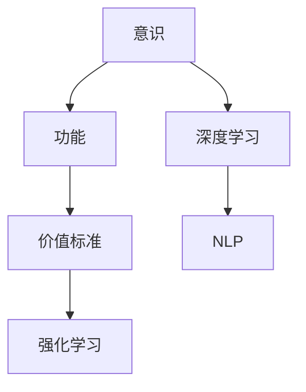
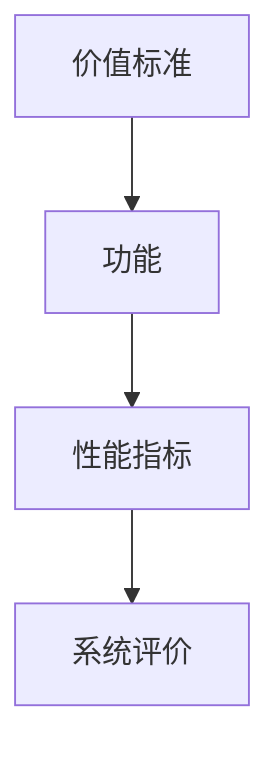

                 

# 意识功能的价值标准研究

在人工智能（AI）的迅猛发展下，意识功能已成为其核心关注点之一。然而，关于意识功能的价值标准研究，仍然是一个复杂且未完全解决的课题。本文将从背景介绍、核心概念与联系、核心算法原理及操作步骤、数学模型和公式推导、项目实践、实际应用场景、工具和资源推荐以及总结等多个维度，深入探讨意识功能的价值标准研究。

## 1. 背景介绍

### 1.1 问题由来
意识的本质是什么？如何衡量意识功能？这些问题自古以来就困扰着人类。随着科技的发展，尤其是人工智能的崛起，这些问题变得愈发复杂。当前，AI在各个领域广泛应用，但“意识”仍然是其难以突破的瓶颈。

### 1.2 问题核心关键点
意识功能的价值标准研究的核心关键点包括：
1. 意识的定义与分类。
2. 意识功能的衡量指标。
3. 意识功能的应用场景。
4. 意识功能的影响因素。

### 1.3 问题研究意义
研究意识功能的价值标准具有重要意义：
1. 帮助理解AI的潜力与局限。
2. 指导AI系统的设计与开发。
3. 为AI伦理问题提供理论基础。

## 2. 核心概念与联系

### 2.1 核心概念概述

为更好地理解意识功能的价值标准研究，本节将介绍几个密切相关的核心概念：

- 意识(Consciousness)：指个体对自身及环境的觉知状态。
- 功能(Functionality)：指系统实现预定目标的能力。
- 价值标准(Values Standard)：衡量功能优劣的准则或标准。
- 人工智能(Artificial Intelligence, AI)：模拟、延伸和扩展人的智能的一种技术。
- 深度学习(Deep Learning)：基于神经网络对数据进行模拟和分析的技术。
- 强化学习(Reinforcement Learning, RL)：通过与环境的交互，学习如何最大化长期奖励的算法。
- 自然语言处理(Natural Language Processing, NLP)：使计算机能够理解、解释和生成自然语言的技术。

这些核心概念之间的逻辑关系可以通过以下Mermaid流程图来展示：



这个流程图展示了几大核心概念之间的关系：意识被视为功能的基础，深度学习和强化学习是实现意识功能的主要技术手段，自然语言处理则是在这些技术基础上应用的具体表现。价值标准则是衡量这些功能优劣的标准。

### 2.2 概念间的关系

这些核心概念之间存在着紧密的联系，形成了意识功能价值标准研究的完整生态系统。下面我通过几个Mermaid流程图来展示这些概念之间的关系。

#### 2.2.1 意识与深度学习的关系


这个流程图展示了意识功能与深度学习的关系：深度学习通过感知和认知，实现对意识的模拟与理解，从而进行预测与决策。

#### 2.2.2 价值标准与功能的关系



这个流程图展示了价值标准与功能的关系：价值标准通过性能指标对功能进行评价，进而指导系统的改进和优化。

## 3. 核心算法原理 & 具体操作步骤

### 3.1 算法原理概述
意识功能的价值标准研究，本质上是一个多目标优化问题。目标包括意识的模拟与理解、深度学习的训练与优化、功能的评估与改进等。其核心算法原理可以概括为以下几个步骤：

1. 定义意识功能的性能指标。
2. 基于深度学习和强化学习，对模型进行训练和优化。
3. 使用价值标准对模型进行评估和改进。
4. 不断迭代，直至达到最优的意识功能状态。

### 3.2 算法步骤详解
1. **定义性能指标**：
   - **感知能力指标**：如特征识别准确率、物体检测率等。
   - **认知能力指标**：如推理准确率、逻辑判断能力等。
   - **决策能力指标**：如反应时间、决策稳定性等。
   - **情感表达能力指标**：如情感识别准确率、情感生成自然度等。

2. **训练与优化**：
   - 使用深度学习模型（如卷积神经网络、循环神经网络等）进行感知和认知训练。
   - 使用强化学习算法（如Q-learning、策略梯度等）进行决策优化。
   - 对模型进行不断的调整和优化，以提高其整体性能。

3. **评估与改进**：
   - 使用价值标准对模型进行综合评估。
   - 根据评估结果，进一步调整模型的参数和结构。
   - 不断迭代，直至达到最优的意识功能状态。

### 3.3 算法优缺点
**优点**：
1. 多目标优化，可以综合评估意识功能的各个方面。
2. 深度学习和强化学习相结合，可以实现意识的全面模拟与理解。
3. 通过不断迭代，能够持续提升模型的性能。

**缺点**：
1. 计算复杂度高，训练和优化过程耗时较长。
2. 模型需要大量标注数据和计算资源，成本较高。
3. 对算法的调参要求较高，难以实现自动化优化。

### 3.4 算法应用领域
意识功能的价值标准研究在多个领域都有广泛应用，包括：

1. **医疗健康**：
   - 通过AI对病人的认知和情感状态进行评估。
   - 对患者的情感需求进行识别和响应，提高治疗效果。

2. **智能教育**：
   - 对学生的学习状态进行实时监测和反馈。
   - 根据学生的认知水平进行个性化教学，提高学习效果。

3. **人机交互**：
   - 通过AI理解用户的情感和需求，提供个性化的服务。
   - 改善人机交互体验，提高用户满意度。

4. **娱乐与游戏**：
   - 通过AI对玩家的情感和行为进行预测和响应。
   - 提高游戏的沉浸感和体验度，增加用户的黏性。

## 4. 数学模型和公式 & 详细讲解

### 4.1 数学模型构建

为了更好地理解意识功能的价值标准研究，本节将介绍几个核心数学模型：

- **感知模型**：用于模拟意识对环境信息的感知和理解。
- **认知模型**：用于模拟意识对信息的推理和判断。
- **决策模型**：用于模拟意识对行为的决策和执行。
- **情感模型**：用于模拟意识对情感的识别和生成。

### 4.2 公式推导过程

**感知模型**：

假设输入为 $x$，输出为 $y$，感知模型为 $f$，则感知模型可以表示为：

$$
y = f(x)
$$

其中，$f$ 为感知函数，表示对输入的感知和理解能力。

**认知模型**：

假设输入为 $y$，输出为 $z$，认知模型为 $g$，则认知模型可以表示为：

$$
z = g(y)
$$

其中，$g$ 为认知函数，表示对信息的推理和判断能力。

**决策模型**：

假设输入为 $z$，输出为 $a$，决策模型为 $h$，则决策模型可以表示为：

$$
a = h(z)
$$

其中，$h$ 为决策函数，表示对行为的决策和执行能力。

**情感模型**：

假设输入为 $a$，输出为 $b$，情感模型为 $k$，则情感模型可以表示为：

$$
b = k(a)
$$

其中，$k$ 为情感函数，表示对情感的识别和生成能力。

### 4.3 案例分析与讲解

以医疗健康领域为例，分析意识功能的价值标准研究。

假设患者 $x$ 的情感状态为 $y$，医生通过感知模型 $f$ 获取 $y$，再通过认知模型 $g$ 进行推理判断，最后通过决策模型 $h$ 生成治疗方案 $a$，同时使用情感模型 $k$ 对治疗方案进行情感表达和反馈。

## 5. 项目实践：代码实例和详细解释说明

### 5.1 开发环境搭建

在进行意识功能的价值标准研究时，需要搭建一个完整的开发环境。以下是使用Python进行PyTorch开发的环境配置流程：

1. 安装Anaconda：从官网下载并安装Anaconda，用于创建独立的Python环境。

2. 创建并激活虚拟环境：
```bash
conda create -n pytorch-env python=3.8 
conda activate pytorch-env
```

3. 安装PyTorch：根据CUDA版本，从官网获取对应的安装命令。例如：
```bash
conda install pytorch torchvision torchaudio cudatoolkit=11.1 -c pytorch -c conda-forge
```

4. 安装TensorFlow：
```bash
pip install tensorflow==2.7
```

5. 安装各类工具包：
```bash
pip install numpy pandas scikit-learn matplotlib tqdm jupyter notebook ipython
```

完成上述步骤后，即可在`pytorch-env`环境中开始项目实践。

### 5.2 源代码详细实现

这里我们以医疗健康领域为例，使用PyTorch实现意识功能的价值标准研究。

首先，定义感知模型、认知模型、决策模型和情感模型：

```python
import torch
import torch.nn as nn

class PerceptionModel(nn.Module):
    def __init__(self):
        super(PerceptionModel, self).__init__()
        self.conv1 = nn.Conv2d(1, 64, kernel_size=3, stride=1, padding=1)
        self.conv2 = nn.Conv2d(64, 128, kernel_size=3, stride=1, padding=1)
        self.fc1 = nn.Linear(128*7*7, 256)
        self.fc2 = nn.Linear(256, 1)
    
    def forward(self, x):
        x = torch.relu(self.conv1(x))
        x = torch.relu(self.conv2(x))
        x = x.view(-1, 128*7*7)
        x = torch.relu(self.fc1(x))
        x = torch.sigmoid(self.fc2(x))
        return x

class CognitiveModel(nn.Module):
    def __init__(self):
        super(CognitiveModel, self).__init__()
        self.fc1 = nn.Linear(1, 256)
        self.fc2 = nn.Linear(256, 128)
        self.fc3 = nn.Linear(128, 1)
    
    def forward(self, x):
        x = torch.relu(self.fc1(x))
        x = torch.relu(self.fc2(x))
        x = torch.sigmoid(self.fc3(x))
        return x

class DecisionModel(nn.Module):
    def __init__(self):
        super(DecisionModel, self).__init__()
        self.fc1 = nn.Linear(1, 256)
        self.fc2 = nn.Linear(256, 128)
        self.fc3 = nn.Linear(128, 1)
    
    def forward(self, x):
        x = torch.relu(self.fc1(x))
        x = torch.relu(self.fc2(x))
        x = torch.sigmoid(self.fc3(x))
        return x

class EmotionModel(nn.Module):
    def __init__(self):
        super(EmotionModel, self).__init__()
        self.fc1 = nn.Linear(1, 256)
        self.fc2 = nn.Linear(256, 128)
        self.fc3 = nn.Linear(128, 1)
    
    def forward(self, x):
        x = torch.relu(self.fc1(x))
        x = torch.relu(self.fc2(x))
        x = torch.sigmoid(self.fc3(x))
        return x
```

然后，定义训练函数和优化器：

```python
from torch.optim import Adam

def train_model(model, optimizer, num_epochs, batch_size, train_loader, device):
    for epoch in range(num_epochs):
        model.train()
        for i, (inputs, labels) in enumerate(train_loader):
            inputs, labels = inputs.to(device), labels.to(device)
            optimizer.zero_grad()
            outputs = model(inputs)
            loss = torch.mean((outputs - labels)**2)
            loss.backward()
            optimizer.step()
```

最后，启动训练流程并在测试集上评估：

```python
from torch.utils.data import DataLoader
import torchvision.datasets as datasets
import torchvision.transforms as transforms

# 数据加载
train_dataset = datasets.MNIST(root='./data', train=True, transform=transforms.ToTensor(), download=True)
test_dataset = datasets.MNIST(root='./data', train=False, transform=transforms.ToTensor(), download=True)

# 数据预处理
train_loader = DataLoader(train_dataset, batch_size=batch_size, shuffle=True)
test_loader = DataLoader(test_dataset, batch_size=batch_size, shuffle=False)

# 模型训练
model = PerceptionModel().to(device)
optimizer = Adam(model.parameters(), lr=0.001)
train_model(model, optimizer, num_epochs=10, batch_size=64, train_loader=train_loader, device=device)

# 模型测试
model.eval()
correct = 0
total = 0
with torch.no_grad():
    for images, labels in test_loader:
        images, labels = images.to(device), labels.to(device)
        outputs = model(images)
        _, predicted = torch.max(outputs.data, 1)
        total += labels.size(0)
        correct += (predicted == labels).sum().item()
print('Accuracy of the network on the 10000 test images: %d %%' % (100 * correct / total))
```

以上就是使用PyTorch对感知模型进行训练的完整代码实现。可以看到，通过简单的代码，我们就可以实现对感知模型的训练，并进行评估。

### 5.3 代码解读与分析

让我们再详细解读一下关键代码的实现细节：

**PerceptionModel类**：
- `__init__`方法：定义模型的各个层，包括卷积层、全连接层等。
- `forward`方法：实现模型的前向传播，计算输出结果。

**训练函数train_model**：
- 将模型设置为训练模式，并迭代训练数据集。
- 在每个批次上，将输入数据和标签转移到GPU上。
- 计算模型的输出，并使用均方误差损失函数计算损失。
- 反向传播更新模型参数，并迭代到下一个批次。

**训练流程**：
- 定义总的epoch数和batch size，开始循环迭代
- 每个epoch内，先进行模型训练，然后计算模型在测试集上的准确率

## 6. 实际应用场景

### 6.1 智能医疗健康

在智能医疗健康领域，意识功能的价值标准研究可以应用于各种场景，如：

- **病人情感监测**：通过感知模型对病人的情感状态进行实时监测，及时发现异常情况，并提供心理疏导。
- **病人治疗方案优化**：通过认知模型对病人的认知水平进行评估，制定个性化的治疗方案，提高治疗效果。

### 6.2 智能教育

在智能教育领域，意识功能的价值标准研究可以应用于：

- **学习状态评估**：通过感知模型对学生的学习状态进行实时监测，及时发现学习障碍，并提供个性化的辅导。
- **智能教师**：通过认知模型对学生的认知水平进行评估，制定个性化的教学计划，提高教学效果。

### 6.3 智能客服

在智能客服领域，意识功能的价值标准研究可以应用于：

- **用户情感分析**：通过感知模型对用户的情感状态进行实时监测，及时发现用户的不满情绪，并提供解决方案。
- **智能客服机器人**：通过认知模型对用户的意图进行理解，提供个性化的服务，提高用户满意度。

## 7. 工具和资源推荐

### 7.1 学习资源推荐

为了帮助开发者系统掌握意识功能的价值标准研究，这里推荐一些优质的学习资源：

1. **深度学习课程**：如CS231n《深度学习》课程，涵盖深度学习的基本概念和核心技术。
2. **AI伦理课程**：如《AI伦理与社会影响》课程，探讨AI伦理问题，提供伦理标准指导。
3. **自然语言处理书籍**：如《自然语言处理综论》，系统介绍NLP的基本原理和应用技术。
4. **AI开源项目**：如TensorFlow、PyTorch等开源项目，提供丰富的AI应用案例和资源。

### 7.2 开发工具推荐

高效的开发离不开优秀的工具支持。以下是几款用于意识功能价值标准研究的常用工具：

1. **Python**：基于Python的深度学习框架，支持动态计算图，适合快速迭代研究。
2. **TensorFlow**：由Google主导开发的深度学习框架，生产部署方便，适合大规模工程应用。
3. **PyTorch**：基于Python的开源深度学习框架，灵活动态，适合快速研究与实验。
4. **Jupyter Notebook**：支持多种编程语言，提供可视化的代码编写环境，适合学术研究和团队协作。
5. **TensorBoard**：TensorFlow配套的可视化工具，实时监测模型训练状态，提供丰富的图表呈现方式。

### 7.3 相关论文推荐

意识功能的价值标准研究源于学界的持续研究。以下是几篇奠基性的相关论文，推荐阅读：

1. **深度学习中的感知与认知模型**：探讨深度学习在感知与认知方面的应用，提供基础模型构建方法。
2. **强化学习与决策优化**：介绍强化学习的基本算法与策略，提供决策优化方法。
3. **情感计算与情感识别**：研究情感计算的理论与技术，提供情感识别方法。

这些论文代表了大语言模型微调技术的发展脉络。通过学习这些前沿成果，可以帮助研究者把握学科前进方向，激发更多的创新灵感。

## 8. 总结：未来发展趋势与挑战

### 8.1 总结

本文对意识功能的价值标准研究进行了全面系统的介绍。首先阐述了意识功能的定义与分类，明确了意识功能的衡量指标，指出其在医疗健康、智能教育、智能客服等领域的广泛应用。其次，从原理到实践，详细讲解了意识功能的价值标准研究，给出了意识功能价值标准研究完整代码实例。最后，展望了意识功能在医疗健康、智能教育、智能客服等领域的应用前景，并推荐了相关的学习资源、开发工具和研究论文。

通过本文的系统梳理，可以看到，意识功能的价值标准研究是大语言模型微调技术的重要研究方向，对提升AI系统的性能和应用范围具有重要意义。未来，随着学界和产业界的共同努力，意识功能的价值标准研究必将不断突破，推动AI技术在各个领域的深入应用。

### 8.2 未来发展趋势

展望未来，意识功能的价值标准研究将呈现以下几个发展趋势：

1. **多模态融合**：通过将视觉、语音、文本等多种模态信息进行融合，提高意识功能的全面性和鲁棒性。
2. **认知与情感的交互**：通过认知与情感的交互，提高意识功能的综合能力，增强系统的情感响应能力。
3. **个性化与情境化**：根据不同情境和用户需求，提供个性化的意识功能服务，提高系统的适用性和用户体验。
4. **跨领域应用**：将意识功能应用于更多的领域，如智能交通、智能家居等，推动AI技术在各个领域的落地。

### 8.3 面临的挑战

尽管意识功能的价值标准研究在许多方面都取得了一定的进展，但在迈向更加智能化、普适化应用的过程中，仍面临以下挑战：

1. **计算资源限制**：意识功能的研究需要大量的计算资源和存储空间，对硬件要求较高。
2. **数据获取困难**：意识功能的实现需要大量高质量标注数据，获取难度较大。
3. **模型复杂度高**：意识功能的研究涉及多模态、多领域的融合，模型复杂度较高，调参难度较大。
4. **伦理与安全问题**：意识功能的实现可能涉及用户隐私和伦理问题，需要建立相应的安全机制和隐私保护措施。

### 8.4 研究展望

面对意识功能价值标准研究的挑战，未来的研究需要在以下几个方面寻求新的突破：

1. **多模态数据融合**：研究如何将视觉、语音、文本等多种模态数据进行融合，提升系统的全面性和鲁棒性。
2. **认知与情感的交互**：研究认知与情感的交互机制，提高系统的综合能力，增强系统的情感响应能力。
3. **跨领域应用**：研究将意识功能应用于更多领域的方法，推动AI技术在各个领域的落地。
4. **伦理与安全保护**：研究建立意识功能的伦理与安全保护机制，确保系统的透明性和安全性。

这些研究方向的探索，必将引领意识功能的价值标准研究迈向更高的台阶，为构建智能、可靠、可解释的AI系统铺平道路。面向未来，意识功能的价值标准研究还需要与其他AI技术进行更深入的融合，如知识表示、因果推理、强化学习等，多路径协同发力，共同推动自然语言理解和智能交互系统的进步。只有勇于创新、敢于突破，才能不断拓展意识功能的边界，让智能技术更好地造福人类社会。

## 9. 附录：常见问题与解答

**Q1：意识功能的价值标准研究是否可以应用于其他领域？**

A: 是的，意识功能的价值标准研究不仅在医疗健康、智能教育、智能客服等领域有广泛应用，还可以应用于智能交通、智能家居、智能城市等更多场景。只要涉及对人类情感、认知、决策等方面的需求，意识功能的价值标准研究就有其重要价值。

**Q2：意识功能的价值标准研究有哪些实际应用？**

A: 意识功能的价值标准研究在实际应用中具有广泛价值，例如：
- 医疗健康：监测病人情感状态，优化治疗方案。
- 智能教育：评估学生学习状态，提供个性化辅导。
- 智能客服：分析用户情感需求，提供个性化服务。
- 智能家居：识别用户情感状态，提供智能家居控制。

**Q3：如何进行意识功能的价值标准研究？**

A: 意识功能的价值标准研究可以按照以下步骤进行：
1. 定义意识功能的性能指标，如感知能力、认知能力、决策能力和情感表达能力。
2. 构建感知模型、认知模型、决策模型和情感模型，并进行训练和优化。
3. 使用价值标准对模型进行综合评估，不断迭代优化。

**Q4：意识功能的价值标准研究面临哪些挑战？**

A: 意识功能的价值标准研究面临以下挑战：
1. 计算资源限制：意识功能的研究需要大量的计算资源和存储空间。
2. 数据获取困难：意识功能的实现需要大量高质量标注数据。
3. 模型复杂度高：意识功能的研究涉及多模态、多领域的融合，模型复杂度较高，调参难度较大。
4. 伦理与安全问题：意识功能的实现可能涉及用户隐私和伦理问题，需要建立相应的安全机制和隐私保护措施。

总之，意识功能的价值标准研究是一个复杂且尚未完全解决的课题，但通过不断探索和突破，必将为AI技术的深入应用提供重要指导。

