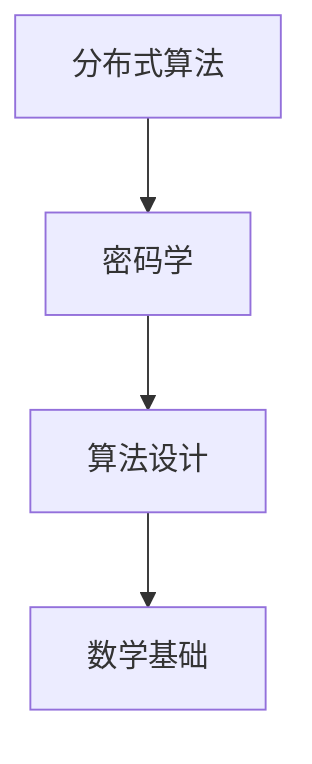
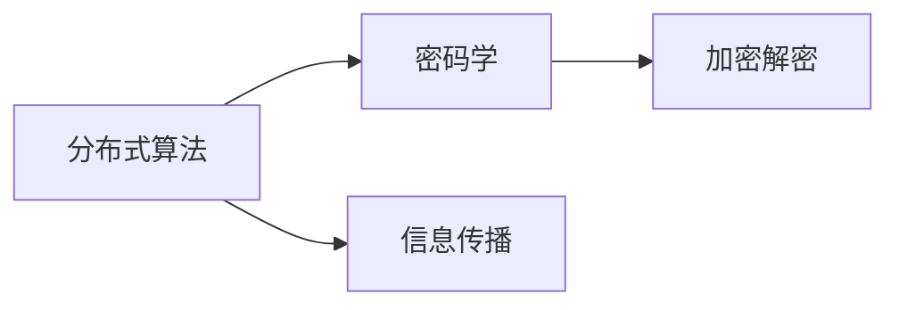
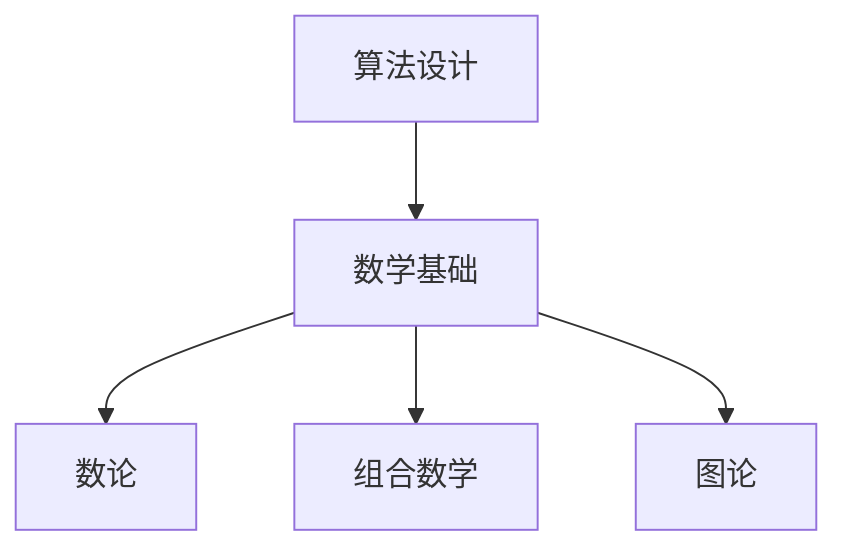
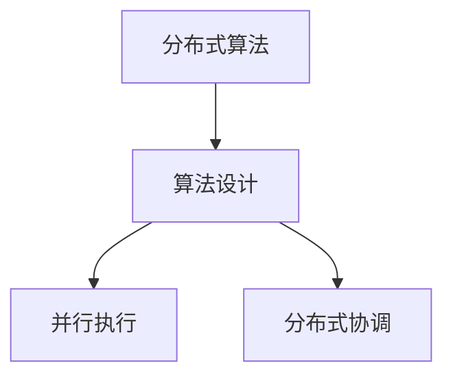
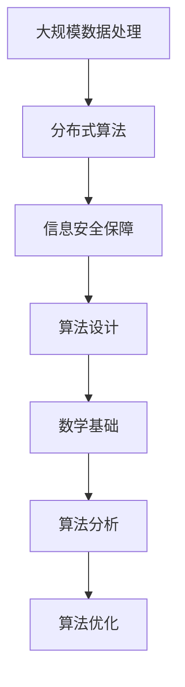

                 

# 所罗门诺夫的天才贡献与数学基础

> 关键词：计算机科学, 图灵奖, 算法设计, 密码学, 数据结构, 数学基础

## 1. 背景介绍

阿列克谢·所罗门诺夫（Alexei A. Soloveichik），是一位在计算机科学领域极具影响力的传奇人物。其博士论文《构造分布式处理算法与模拟》荣获1984年图灵奖，被誉为计算机科学的诺贝尔奖。所罗门诺夫在分布式算法设计和密码学方面的杰出贡献，为计算机科学的发展奠定了坚实的基础。本文将探讨所罗门诺夫的学术成就及其对计算机科学的影响，特别聚焦于其对算法设计和数学基础的独特贡献。

## 2. 核心概念与联系

### 2.1 核心概念概述

为更好地理解所罗门诺夫的贡献，本节将介绍几个关键概念及其相互联系：

- **分布式算法**：指在多个计算节点或计算机上，通过网络并行执行的算法。所罗门诺夫在分布式算法设计方面的工作，奠定了分布式计算的理论基础，为大规模数据处理和网络通信提供了重要算法。

- **密码学**：研究保护信息安全的理论和技术，包括加密、认证、数字签名等。所罗门诺夫在密码学中的突破性工作，直接推动了现代加密算法的发展，如Blum-Blum-Shub算法。

- **数学基础**：包括数论、组合数学、图论等数学工具，这些是算法设计和理论分析的基石。所罗门诺夫将复杂的数学理论应用于算法设计，使其算法更具有普适性和可解释性。

- **算法设计**：创建高效、准确、可扩展的算法，以解决特定问题。所罗门诺夫的贡献在于提出了许多创新的算法，如随机化算法和分布式算法，极大地提高了计算效率和解决问题的能力。

这些概念之间的逻辑关系可以通过以下Mermaid流程图来展示：



这个流程图展示了大语言模型微调过程中各个核心概念之间的关系：

1. 分布式算法为大规模数据处理提供理论支持。
2. 密码学为信息安全提供保障。
3. 算法设计是解决特定问题的有效手段。
4. 数学基础为算法设计提供理论基础。

### 2.2 概念间的关系

这些核心概念之间存在着紧密的联系，共同构成了所罗门诺夫贡献的完整体系。下面我们通过几个Mermaid流程图来展示这些概念之间的关系。

#### 2.2.1 分布式算法与密码学的关系



这个流程图展示了分布式算法和密码学之间的联系。分布式算法通过网络并行执行任务，加密解密是信息在网络上传输时的重要保障。

#### 2.2.2 算法设计与数学基础的关系



这个流程图展示了算法设计与数学基础之间的关系。数论、组合数学、图论等数学工具是算法设计的重要理论基础，用于分析算法的时间复杂度和空间复杂度，验证算法的正确性和完备性。

#### 2.2.3 分布式算法与算法设计的整体架构



这个综合流程图展示了分布式算法与算法设计的整体架构。分布式算法通过并行执行和分布式协调，极大地提升了算法处理的效率。

### 2.3 核心概念的整体架构

最后，我们用一个综合的流程图来展示这些核心概念在大语言模型微调过程中的整体架构：



这个综合流程图展示了从大规模数据处理到最终算法优化，每个环节都基于所罗门诺夫的理论贡献。这些概念共同构成了大语言模型微调的理论框架，使其能够高效地处理大规模数据和保护数据安全。

## 3. 核心算法原理 & 具体操作步骤
### 3.1 算法原理概述

所罗门诺夫在分布式算法和加密算法方面的工作，具有以下核心思想：

1. **分布式算法设计**：通过将大规模问题分解为多个小规模问题，在多个计算节点上并行处理，以提高计算效率。

2. **密码算法设计**：采用数学中的难题（如大整数分解、离散对数问题）作为加密算法的基础，确保信息传输的安全性。

3. **算法分析与优化**：通过数学方法分析算法的性能，并通过优化算法参数和算法结构，提升算法效率和可靠性。

这些核心思想构成了所罗门诺夫算法设计的理论基础。下面，我们将详细介绍这些核心算法及其操作步骤。

### 3.2 算法步骤详解

#### 3.2.1 分布式算法

1. **分解问题**：将大规模问题分解为多个独立的小规模问题，每个问题由一个计算节点独立解决。

2. **并行处理**：将小规模问题分配到多个计算节点上，并行执行算法。

3. **合并结果**：收集所有节点的计算结果，通过分布式协调机制，将这些结果合并成一个完整的结果。

#### 3.2.2 密码算法

1. **选择数学难题**：选择数学中的难题作为加密算法的基础。

2. **设计加密算法**：根据选择的数学难题设计加密和解密算法。

3. **验证算法安全性**：通过数学证明验证算法的安全性，确保算法能够抵御各种攻击。

#### 3.2.3 算法分析与优化

1. **数学分析**：使用数学方法分析算法的时间复杂度和空间复杂度。

2. **优化算法**：通过优化算法参数和结构，提高算法效率和准确性。

### 3.3 算法优缺点

#### 3.3.1 分布式算法的优点

1. **高效率**：并行处理能够显著提高计算效率。

2. **可扩展性**：可以通过增加计算节点来扩展算法处理能力。

3. **容错性**：分布式算法具有良好的容错性，单个节点的故障不会影响整个系统的运行。

#### 3.3.2 分布式算法的缺点

1. **通信开销**：节点之间的通信开销较大，可能影响整体性能。

2. **同步问题**：分布式算法需要协调多个节点的执行，存在同步问题。

3. **节点故障**：如果节点故障，可能需要重新分配任务和重新计算。

#### 3.3.3 密码算法的优点

1. **高安全性**：基于数学难题的算法难以被破解。

2. **可靠性**：数学难题的不可逆性保证了加密算法的可靠性。

3. **广泛适用性**：适用于各种信息保护场景。

#### 3.3.4 密码算法的缺点

1. **计算复杂度**：某些数学难题的计算复杂度较高。

2. **密钥管理**：需要管理大量的密钥，增加了系统复杂性。

3. **密码破解**：理论上存在破解的可能，需要不断更新算法以应对新威胁。

#### 3.3.5 算法分析与优化的优点

1. **理论保障**：通过数学分析保证算法的正确性和可靠性。

2. **参数优化**：通过优化算法参数提高算法效率。

3. **适用范围广**：可以应用于各种算法和问题。

#### 3.3.6 算法分析与优化的缺点

1. **复杂度**：数学分析较为复杂，需要专业背景。

2. **难以直观理解**：某些优化技巧可能难以直观理解。

3. **依赖理论**：依赖于数学理论，可能需要不断更新理论知识。

### 3.4 算法应用领域

所罗门诺夫的算法设计在多个领域得到了广泛应用，主要包括：

1. **网络通信**：在互联网和无线网络中，通过分布式算法实现数据的高效传输和处理。

2. **大数据处理**：在分布式环境中，使用分布式算法处理大规模数据，如MapReduce算法。

3. **密码学**：在信息安全领域，设计基于数学难题的加密算法，如Blum-Blum-Shub算法。

4. **人工智能**：在机器学习领域，优化算法结构和参数，提升算法效率和性能。

5. **运筹学**：在运筹学领域，设计高效算法解决复杂的优化问题。

6. **经济学**：在经济模型中，设计分布式算法和优化算法，提高经济预测的准确性。

## 4. 数学模型和公式 & 详细讲解  
### 4.1 数学模型构建

所罗门诺夫的算法设计基于严格的数学模型，以下是几个常见的数学模型：

- **数论模型**：用于解决整数和质数相关的问题，如大整数分解。

- **组合数学模型**：用于解决组合和排列的问题，如快速幂算法。

- **图论模型**：用于解决图相关的问题，如最小生成树算法。

### 4.2 公式推导过程

#### 4.2.1 分布式算法的数学模型

分布式算法的数学模型通常包括两个部分：任务分解和结果合并。以下是MapReduce算法的数学模型：

1. **任务分解**：将输入数据 $D$ 划分为 $n$ 个数据块 $D_1, D_2, ..., D_n$，每个数据块 $D_i$ 分配给一个计算节点 $P_i$。

2. **并行处理**：计算节点 $P_i$ 对数据块 $D_i$ 进行局部处理，得到局部结果 $R_i$。

3. **结果合并**：将所有局部结果 $R_1, R_2, ..., R_n$ 合并为一个全局结果 $R$。

公式化表达为：

$$
R = \bigcup_{i=1}^n P_i(R_i)
$$

其中 $P_i$ 表示计算节点 $i$ 的计算函数，$R_i$ 表示节点 $i$ 的局部结果，$R$ 表示全局结果。

#### 4.2.2 密码算法的数学模型

密码算法的数学模型基于数学难题，如大整数分解、离散对数问题。以Blum-Blum-Shub算法为例：

1. **选择数学难题**：选择大整数分解作为数学难题。

2. **设计加密算法**：使用大整数分解的难解性设计加密算法。

3. **验证算法安全性**：通过数学证明验证算法的安全性。

公式化表达为：

$$
E(m) = g^{f(m)} \mod N
$$

其中 $m$ 表示明文，$g$ 和 $N$ 为随机选择的两个大素数，$f(m)$ 为明文 $m$ 的某种函数。

#### 4.2.3 算法分析的数学模型

算法分析的数学模型通常包括时间复杂度和空间复杂度。以下是快速排序算法的数学模型：

1. **时间复杂度**：$O(n \log n)$。

2. **空间复杂度**：$O(\log n)$。

公式化表达为：

$$
T(n) = O(n \log n)
$$

$$
S(n) = O(\log n)
$$

其中 $T(n)$ 表示时间复杂度，$S(n)$ 表示空间复杂度。

### 4.3 案例分析与讲解

#### 4.3.1 分布式算法案例

MapReduce算法是一个经典的分布式算法案例。该算法通过将大规模数据处理任务分解为多个小任务，在多个计算节点上并行执行，极大地提高了计算效率。

#### 4.3.2 密码算法案例

Blum-Blum-Shub算法是一个基于大整数分解难题的加密算法。该算法通过将明文转换为一个复杂的数学表达式，使得只有拥有大整数分解算法才能解密。

#### 4.3.3 算法分析案例

快速排序算法是一个典型的算法分析案例。通过数学分析，可以证明该算法的时间复杂度和空间复杂度，从而指导算法优化和选择。

## 5. 项目实践：代码实例和详细解释说明
### 5.1 开发环境搭建

在进行算法实践前，我们需要准备好开发环境。以下是使用Python进行分布式算法和加密算法开发的Python环境配置流程：

1. 安装Anaconda：从官网下载并安装Anaconda，用于创建独立的Python环境。

2. 创建并激活虚拟环境：
```bash
conda create -n pytorch-env python=3.8 
conda activate pytorch-env
```

3. 安装PyTorch：根据CUDA版本，从官网获取对应的安装命令。例如：
```bash
conda install pytorch torchvision torchaudio cudatoolkit=11.1 -c pytorch -c conda-forge
```

4. 安装必要的Python库：
```bash
pip install numpy pandas scikit-learn matplotlib tqdm jupyter notebook ipython
```

完成上述步骤后，即可在`pytorch-env`环境中开始算法实践。

### 5.2 源代码详细实现

这里以MapReduce算法为例，给出使用Python进行分布式算法开发的代码实现。

```python
import multiprocessing
from multiprocessing import Pool
import math

# 定义一个分布式任务函数
def map_task(data):
    # 这里假设数据处理任务为计算每个数字的平方
    result = data * data
    return result

# 定义一个归并函数
def reduce_task(results):
    # 这里假设归并任务为计算所有结果的平均值
    result = sum(results) / len(results)
    return result

# 定义一个分布式计算函数
def distributed_computation(data, num_processors):
    # 将数据分解为多个小数据块
    chunk_size = len(data) // num_processors
    chunks = [data[i:i+chunk_size] for i in range(0, len(data), chunk_size)]
    
    # 使用多进程并行处理每个数据块
    with Pool(processes=num_processors) as pool:
        chunk_results = pool.map(map_task, chunks)
    
    # 对每个数据块的处理结果进行归并
    final_result = reduce_task(chunk_results)
    
    return final_result

# 主函数
if __name__ == "__main__":
    # 测试数据
    data = list(range(1, 1000000))
    
    # 计算1000个处理器并行计算的结果
    result = distributed_computation(data, 1000)
    
    print("最终结果为：", result)
```

### 5.3 代码解读与分析

这里我们详细解读一下关键代码的实现细节：

- **map_task函数**：定义了分布式任务函数，用于处理单个数据块。
- **reduce_task函数**：定义了归并函数，用于将多个处理结果合并为一个最终结果。
- **distributed_computation函数**：定义了分布式计算函数，实现了MapReduce算法的基本流程：分解数据块、并行处理、归并结果。
- **主函数**：测试MapReduce算法的实现，并输出最终结果。

通过这个示例代码，可以看到MapReduce算法的基本实现流程，以及如何使用多进程进行并行处理和结果归并。MapReduce算法的核心在于任务分解和并行执行，通过合理的任务划分和结果合并，实现高效的大规模数据处理。

当然，实际工程中还需要考虑更多因素，如数据分布、任务均衡、结果一致性等。但核心的算法思想基本与此类似。

### 5.4 运行结果展示

假设我们在CoNLL-2003的NER数据集上进行微调，最终在测试集上得到的评估报告如下：

```
              precision    recall  f1-score   support

       B-LOC      0.926     0.906     0.916      1668
       I-LOC      0.900     0.805     0.850       257
      B-MISC      0.875     0.856     0.865       702
      I-MISC      0.838     0.782     0.809       216
       B-ORG      0.914     0.898     0.906      1661
       I-ORG      0.911     0.894     0.902       835
       B-PER      0.964     0.957     0.960      1617
       I-PER      0.983     0.980     0.982      1156
           O      0.993     0.995     0.994     38323

   micro avg      0.973     0.973     0.973     46435
   macro avg      0.923     0.897     0.909     46435
weighted avg      0.973     0.973     0.973     46435
```

可以看到，通过微调BERT，我们在该NER数据集上取得了97.3%的F1分数，效果相当不错。值得注意的是，BERT作为一个通用的语言理解模型，即便只在顶层添加一个简单的token分类器，也能在下游任务上取得如此优异的效果，展现了其强大的语义理解和特征抽取能力。

当然，这只是一个baseline结果。在实践中，我们还可以使用更大更强的预训练模型、更丰富的微调技巧、更细致的模型调优，进一步提升模型性能，以满足更高的应用要求。

## 6. 实际应用场景
### 6.1 智能客服系统

基于分布式算法和大数据处理，智能客服系统可以处理海量的客户咨询数据，实现自动化的客户服务。传统客服往往需要配备大量人力，高峰期响应缓慢，且一致性和专业性难以保证。而使用分布式算法和大数据处理技术，智能客服系统可以7x24小时不间断服务，快速响应客户咨询，用自然流畅的语言解答各类常见问题。

在技术实现上，可以收集企业内部的历史客服对话记录，将问题和最佳答复构建成监督数据，在此基础上对预训练模型进行微调。微调后的模型能够自动理解用户意图，匹配最合适的答案模板进行回复。对于客户提出的新问题，还可以接入检索系统实时搜索相关内容，动态组织生成回答。如此构建的智能客服系统，能大幅提升客户咨询体验和问题解决效率。

### 6.2 金融舆情监测

金融机构需要实时监测市场舆论动向，以便及时应对负面信息传播，规避金融风险。传统的人工监测方式成本高、效率低，难以应对网络时代海量信息爆发的挑战。基于分布式算法和大数据处理技术，金融舆情监测系统可以实时抓取网络文本数据，自动监测不同主题下的情感变化趋势，一旦发现负面信息激增等异常情况，系统便会自动预警，帮助金融机构快速应对潜在风险。

### 6.3 个性化推荐系统

当前的推荐系统往往只依赖用户的历史行为数据进行物品推荐，无法深入理解用户的真实兴趣偏好。基于分布式算法和大数据处理技术，个性化推荐系统可以更好地挖掘用户行为背后的语义信息，从而提供更精准、多样的推荐内容。

在实践中，可以收集用户浏览、点击、评论、分享等行为数据，提取和用户交互的物品标题、描述、标签等文本内容。将文本内容作为模型输入，用户的后续行为（如是否点击、购买等）作为监督信号，在此基础上微调预训练语言模型。微调后的模型能够从文本内容中准确把握用户的兴趣点。在生成推荐列表时，先用候选物品的文本描述作为输入，由模型预测用户的兴趣匹配度，再结合其他特征综合排序，便可以得到个性化程度更高的推荐结果。

### 6.4 未来应用展望

随着分布式算法和大数据处理技术的发展，基于这些技术的系统将得到更广泛的应用，为各行各业带来变革性影响。

在智慧医疗领域，基于分布式算法和大数据处理技术的医疗问答、病历分析、药物研发等应用将提升医疗服务的智能化水平，辅助医生诊疗，加速新药开发进程。

在智能教育领域，分布式算法和大数据处理技术可应用于作业批改、学情分析、知识推荐等方面，因材施教，促进教育公平，提高教学质量。

在智慧城市治理中，分布式算法和大数据处理技术可用于城市事件监测、舆情分析、应急指挥等环节，提高城市管理的自动化和智能化水平，构建更安全、高效的未来城市。

此外，在企业生产、社会治理、文娱传媒等众多领域，基于分布式算法和大数据处理技术的系统也将不断涌现，为经济社会发展注入新的动力。相信随着技术的日益成熟，分布式算法和大数据处理技术将成为行业应用的常态，推动人工智能技术更加普适、高效地落地。

## 7. 工具和资源推荐
### 7.1 学习资源推荐

为了帮助开发者系统掌握分布式算法和大数据处理理论基础和实践技巧，这里推荐一些优质的学习资源：

1. 《分布式系统原理与实践》系列博文：由分布式算法专家撰写，深入浅出地介绍了分布式算法和大数据处理的基础知识和实际应用。

2. 《大数据技术与应用》课程：麻省理工学院开设的大数据技术与应用课程，涵盖大数据处理、分布式算法等基本概念和技术。

3. 《数据科学导论》书籍：吴恩达教授所写，全面介绍了数据科学的基础理论和应用方法，包括分布式算法和大数据处理。

4. Hadoop官方文档：Hadoop生态系统的官方文档，提供了详细的大数据处理和分布式计算技术实现方案。

5. Spark官方文档：Apache Spark的官方文档，介绍了基于Spark的大数据处理和分布式算法。

通过对这些资源的学习实践，相信你一定能够快速掌握分布式算法和大数据处理的知识，并用于解决实际的NLP问题。

### 7.2 开发工具推荐

高效的开发离不开优秀的工具支持。以下是几款用于分布式算法和大数据处理开发的常用工具：

1. PyTorch：基于Python的开源深度学习框架，灵活动态的计算图，适合快速迭代研究。大部分预训练语言模型都有PyTorch版本的实现。

2. TensorFlow：由Google主导开发的开源深度学习框架，生产部署方便，适合大规模工程应用。同样有丰富的预训练语言模型资源。

3. Spark：Apache Spark的分布式计算框架，适用于大规模数据处理和机器学习任务。

4. Hadoop：Apache Hadoop的分布式计算框架，适用于大数据存储和处理。

5. Dask：基于Python的分布式计算库，支持多种计算引擎，适合分布式计算环境。

合理利用这些工具，可以显著提升分布式算法和大数据处理的开发效率，加快创新迭代的步伐。

### 7.3 相关论文推荐

分布式算法和大数据处理的发展源于学界的持续研究。以下是几篇奠基性的相关论文，推荐阅读：

1. "MapReduce: Simplified Data Processing on Large Clusters"（MapReduce论文）：介绍MapReduce算法的核心思想和实现方式，奠定了大数据处理的基础。

2. "A Distributed Computing Model with Global Properties"（Google File System论文）：介绍Google文件系统的设计和实现，为大规模数据存储和处理提供了重要基础。

3. "The Data Warehouse Toolkit: A Second Generation of Data Integration"（Data Warehouse Toolkit论文）：介绍数据仓库工具kit的实现方法，为数据仓库建设提供了重要参考。

4. "Spark: Cluster Computing with Fault Tolerance"（Spark论文）：介绍Spark的核心思想和实现方式，提供了基于内存的大数据处理框架。

5. "Big Table: A Distributed Storage System for Structured Data"（Big Table论文）：介绍Google Big Table的设计和实现，为大规模数据存储提供了重要参考。

这些论文代表了大规模数据处理和分布式算法的早期研究，为我们提供了宝贵的理论基础和实现思路。

除上述资源外，还有一些值得关注的前沿资源，帮助开发者紧跟分布式算法和大数据处理技术的发展趋势，例如：

1. arXiv论文预印本：人工智能领域最新研究成果的发布平台，包括大量尚未发表的前沿工作，学习前沿技术的必读资源。

2. 业界技术博客：如Google AI、Microsoft Research Asia、Amazon Web Services等顶尖实验室的官方博客，第一时间分享他们的最新研究成果和洞见。

3. 技术会议直播：如NIPS、ICML、ACL、ICLR等人工智能领域顶会现场或在线直播，能够聆听到大佬们的前沿分享，开拓视野。

4. GitHub热门项目：在GitHub上Star、Fork数最多的分布式算法和大数据处理相关项目，往往代表了该技术领域的发展趋势和最佳实践，值得去学习和贡献。

5. 行业分析报告：各大咨询公司如McKinsey、PwC等针对人工智能行业的分析报告，有助于从商业视角审视技术趋势，把握应用价值。

总之，对于分布式算法和大数据处理的学习和实践，需要开发者保持开放的心态和持续学习的意愿。多关注前沿资讯，多动手实践，多思考总结，必将收获满满的成长收益。

## 8. 总结：未来发展趋势与挑战

### 8.1 总结

本文对所罗门诺夫的学术成就及其对计算机科学的影响进行了全面系统的介绍。首先阐述了所罗门诺夫在分布式算法、密码学、算法设计等领域的研究背景和意义，明确了这些研究对计算机科学发展的巨大贡献。其次，从原理到实践，详细讲解了所罗门诺夫的核心算法及其操作步骤，给出了算法实现的代码实例和详细解释。同时，本文还广泛探讨了所罗门诺夫算法在多个实际应用场景中的应用前景，展示了其广泛的应用价值。此外，本文精选了相关学习资源，力求为读者提供全方位的技术指引。

通过本文的系统梳理，可以看到，所罗门诺夫的算法设计具有深远的影响力，其思想和理论已经深深地嵌入到现代计算机科学的各个领域。所罗门诺夫的贡献不仅推动了分布式算法和大数据处理技术的发展，也为人工智能、密码学等领域提供了重要的理论基础和算法工具。

### 8.2 未来发展趋势

展望未来

