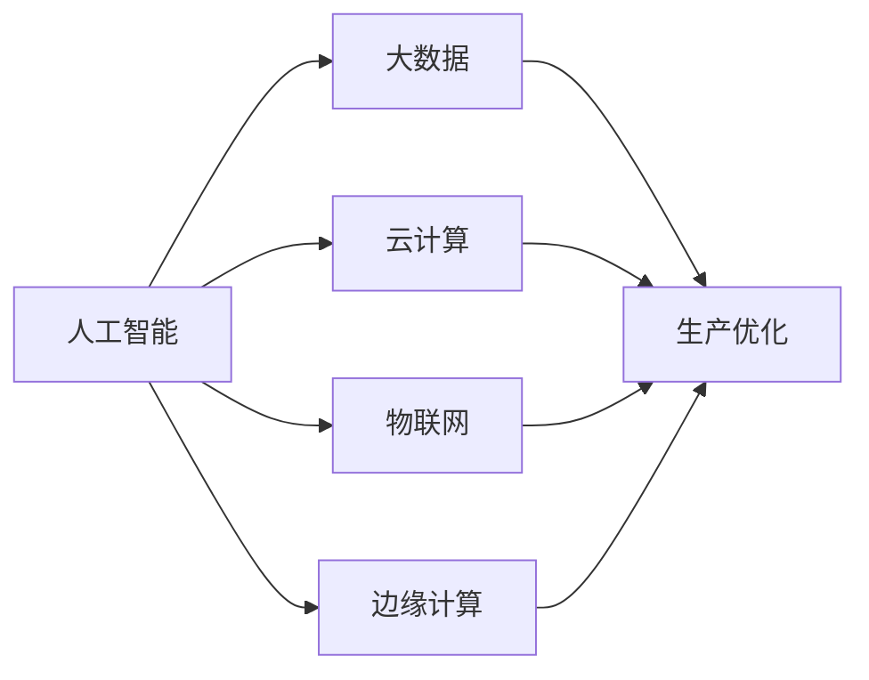
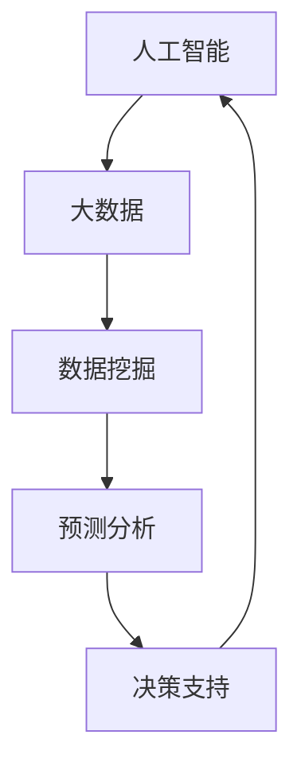
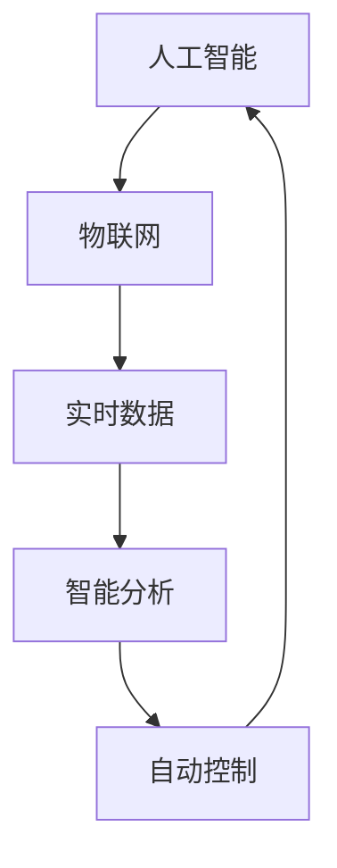
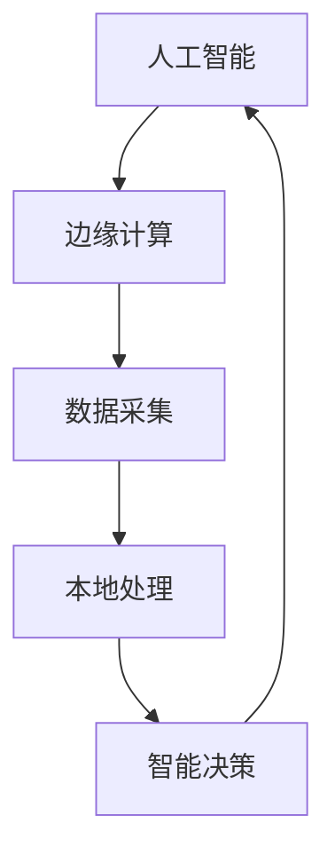
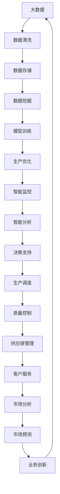

                 

## 1. 背景介绍

### 1.1 问题由来

在当今快速变化的市场环境中，提升企业核心竞争力已成为每个企业的首要任务。随着技术进步和市场竞争的加剧，传统的生产方式和管理模式已难以满足需求。因此，企业需要采用更先进的生产力策略来保持竞争优势。

### 1.2 问题核心关键点

核心问题在于如何通过技术手段优化企业生产流程，提升效率和质量，降低成本，增强市场响应速度和创新能力。当前，基于人工智能和大数据的企业信息化建设，已成为提升企业生产力的重要手段。

### 1.3 问题研究意义

研究提升企业核心竞争力的生产力策略，对于推动企业转型升级，提升市场竞争力，具有重要意义：

1. 降低生产成本。通过自动化、智能化手段，减少人工干预，降低生产成本，提升效率。
2. 提高产品质量。利用数据驱动的质量管理，及时发现和解决生产问题，提升产品质量。
3. 加速产品上市。通过灵活调配资源，快速响应市场需求，加速产品迭代和上市速度。
4. 增强创新能力。利用大数据和AI技术，发现新需求、新机会，推动产品创新和业务创新。
5. 提升客户体验。通过个性化、精准化的客户服务，提升客户满意度，增强客户粘性。
6. 优化供应链管理。通过智能化供应链管理系统，提高物流效率，降低库存成本。

## 2. 核心概念与联系

### 2.1 核心概念概述

为更好地理解提升核心竞争力的生产力策略，本节将介绍几个密切相关的核心概念：

- **人工智能(AI)**：利用计算机模拟人类智能过程的技术，包括机器学习、深度学习、自然语言处理等。人工智能在优化生产流程、提升决策效率、增强创新能力等方面具有巨大潜力。
- **大数据(Big Data)**：指大规模、多样化的数据集，利用大数据技术，可以挖掘出隐藏在数据中的规律和价值，辅助决策和优化生产。
- **云计算(Cloud Computing)**：通过互联网提供按需自助的计算资源，如存储、计算、网络服务等。云计算使企业可以按需分配资源，降低IT成本。
- **物联网(IoT)**：通过互联网将物理设备连接起来，实现数据的实时采集和传输。物联网应用于生产过程，可以实现设备监控、质量控制等。
- **边缘计算(Edge Computing)**：在靠近数据源的地方进行数据处理，减少数据传输延迟和带宽消耗，提高生产效率和数据处理速度。

这些核心概念之间的逻辑关系可以通过以下Mermaid流程图来展示：



这个流程图展示了人工智能和大数据、云计算、物联网、边缘计算之间的联系，以及这些技术如何共同作用于生产优化。

### 2.2 概念间的关系

这些核心概念之间存在着紧密的联系，形成了提升企业核心竞争力的完整生态系统。下面我们通过几个Mermaid流程图来展示这些概念之间的关系。

#### 2.2.1 人工智能与大数据的互动



这个流程图展示了人工智能和大数据之间的互动关系。人工智能通过大数据技术获取丰富的数据资源，进行数据挖掘和预测分析，辅助企业做出更好的决策。

#### 2.2.2 人工智能与云计算的协同


这个流程图展示了人工智能与云计算之间的协同关系。云计算提供了强大的计算资源，支持人工智能模型的训练和部署，提升了模型性能和企业效率。

#### 2.2.3 人工智能与物联网的融合



这个流程图展示了人工智能与物联网的融合关系。物联网设备采集的实时数据，通过人工智能技术进行智能分析，实现自动控制，优化生产过程。

#### 2.2.4 人工智能与边缘计算的结合



这个流程图展示了人工智能与边缘计算的结合关系。边缘计算在靠近数据源的地方进行数据处理，降低了数据传输延迟和带宽消耗，提高了生产效率和数据处理速度。

### 2.3 核心概念的整体架构

最后，我们用一个综合的流程图来展示这些核心概念在大数据与人工智能融合的企业生产力系统中的整体架构：



这个综合流程图展示了从数据采集、存储、挖掘、训练到生产优化、智能监控、智能分析、决策支持、生产调度、质量控制、供应链管理、客户服务、市场分析、市场预测和业务创新的整体流程。通过这些技术手段的协同作用，可以全面提升企业核心竞争力。

## 3. 核心算法原理 & 具体操作步骤
### 3.1 算法原理概述

提升企业核心竞争力的生产力策略，本质上是一种基于人工智能和大数据的企业智能化生产管理方法。其核心思想是利用先进的技术手段，优化生产流程，提升效率和质量，降低成本，增强市场响应速度和创新能力。

形式化地，假设企业生产流程为 $P$，其目标是最小化成本 $C$，最大化效率 $E$，则优化目标可以表示为：

$$
\min_{P} C, \max_{P} E
$$

其中，$P$ 是生产流程的参数集，包括设备、人员、物料、能源等资源配置。$C$ 为生产成本，$E$ 为生产效率，如产量、质量、时间等指标。

### 3.2 算法步骤详解

提升企业核心竞争力的生产力策略，通常包括以下几个关键步骤：

**Step 1: 数据采集与清洗**

- 利用物联网设备采集生产现场的实时数据，如温度、湿度、振动、能耗等。
- 通过传感器和智能设备，采集供应链和市场数据，如订单、库存、价格、客户反馈等。
- 对采集的数据进行预处理和清洗，去除噪声和异常值，保证数据质量。

**Step 2: 数据存储与管理**

- 将清洗后的数据存储到云端数据库中，利用云计算技术提供的数据存储和访问服务。
- 采用分布式数据库系统，提高数据存储的可靠性和可扩展性。
- 建立数据访问权限控制机制，确保数据安全和隐私保护。

**Step 3: 数据分析与挖掘**

- 利用大数据技术，对存储的数据进行挖掘和分析，发现生产流程中的瓶颈和改进点。
- 采用机器学习算法，进行模式识别和预测，辅助决策和优化生产。
- 引入深度学习算法，进行多源数据融合和异常检测，提升数据处理精度。

**Step 4: 模型训练与优化**

- 将大数据分析结果作为训练样本，利用人工智能模型进行训练，生成优化方案。
- 采用强化学习算法，训练智能调度系统，动态调整生产资源配置。
- 引入自然语言处理技术，分析客户反馈和市场趋势，指导产品创新和业务优化。

**Step 5: 生产调度和控制**

- 利用智能调度系统，自动生成生产计划和调度方案，优化资源配置。
- 引入边缘计算技术，在靠近数据源的地方进行数据处理和决策，减少数据传输延迟和带宽消耗。
- 应用机器人自动化和智能控制系统，实现生产过程的自动控制和优化。

**Step 6: 质量监控与控制**

- 采用智能监控系统，实时监测生产过程，检测异常和故障。
- 引入预测性维护技术，提前预测设备故障，减少停机时间和维修成本。
- 应用质量控制算法，通过数据分析和反馈，持续提升产品质量和一致性。

**Step 7: 供应链管理与优化**

- 利用智能供应链管理系统，优化库存管理和物流调度。
- 引入需求预测和库存管理算法，提高供应链效率，降低库存成本。
- 应用区块链技术，提高供应链透明度和安全性。

**Step 8: 客户服务与市场分析**

- 利用大数据和人工智能技术，分析客户行为和反馈，提供个性化服务。
- 应用自然语言处理技术，分析市场趋势和舆情，指导产品设计和市场策略。
- 引入推荐系统，精准推荐产品，提升客户满意度和忠诚度。

**Step 9: 业务创新与改进**

- 利用数据分析和市场预测，发现新需求和新机会，推动业务创新和产品迭代。
- 应用人工智能算法，优化业务流程和运营效率，提升企业竞争力。
- 引入风险管理工具，评估和管理业务风险，保障企业稳健发展。

### 3.3 算法优缺点

提升企业核心竞争力的生产力策略，具有以下优点：

1. 数据驱动决策。通过大数据分析和机器学习算法，提供科学依据，避免决策失误。
2. 自动化和智能化。引入人工智能和自动化技术，减少人工干预，提高生产效率和质量。
3. 灵活和可扩展。采用云计算和大数据技术，支持企业按需扩展资源，适应市场变化。
4. 实时监控和优化。利用物联网和边缘计算技术，实现实时数据采集和处理，快速响应市场需求。

同时，也存在以下缺点：

1. 技术和人才需求高。提升生产力需要掌握大数据、人工智能、云计算等先进技术，对人才和技术要求较高。
2. 成本投入较大。初期建设和维护成本较高，需要投入大量的技术研发和基础设施建设。
3. 数据安全问题。大数据和人工智能技术需要大量的数据支持，数据安全问题需要高度重视。
4. 算法复杂性高。提升生产力涉及多个领域的技术融合，算法复杂性较高，需要深入研究和实践。

### 3.4 算法应用领域

提升企业核心竞争力的生产力策略，已经广泛应用于多个领域，包括：

- 制造业：通过自动化和智能化改造，提升生产效率和产品质量，降低成本。
- 零售业：利用大数据和人工智能技术，优化库存管理和客户服务，提升客户满意度和忠诚度。
- 物流业：采用智能调度系统，优化物流管理和配送路线，提高物流效率和客户体验。
- 金融业：应用自然语言处理和机器学习算法，分析市场趋势和舆情，指导投资和风险管理。
- 医疗业：利用大数据和人工智能技术，分析医疗数据和患者反馈，提高诊疗质量和患者体验。
- 政府部门：通过智能化管理，提升行政效率和服务水平，改善公共服务质量。

## 4. 数学模型和公式 & 详细讲解 & 举例说明

### 4.1 数学模型构建

提升企业核心竞争力的生产力策略，通常可以构建为以下数学模型：

1. **成本最小化模型**：
$$
\min_{P} \sum_{i} C_i(x_i)
$$
其中，$P$ 为生产流程参数，$C_i$ 为第 $i$ 个生产环节的成本函数，$x_i$ 为生产参数。

2. **效率最大化模型**：
$$
\max_{P} \sum_{i} E_i(x_i)
$$
其中，$E_i$ 为第 $i$ 个生产环节的效率函数，$x_i$ 为生产参数。

3. **综合优化模型**：
$$
\begin{aligned}
& \min_{P} \sum_{i} C_i(x_i) \\
& \text{s.t.} \sum_{i} E_i(x_i) \geq E_{\text{target}}
\end{aligned}
$$
其中，$E_{\text{target}}$ 为目标效率，$x_i$ 为生产参数。

### 4.2 公式推导过程

以下我们以一个简单的生产优化为例，推导最小化成本模型的求解过程。

假设一个企业有 $n$ 个生产环节，每个环节的成本函数为 $C_i(x_i)$，生产参数为 $x_i$。最小化成本的目标函数为：
$$
\min_{x_1, ..., x_n} \sum_{i=1}^n C_i(x_i)
$$

利用拉格朗日乘子法，构造拉格朗日函数：
$$
\mathcal{L}(x_1, ..., x_n, \lambda) = \sum_{i=1}^n C_i(x_i) + \lambda(E_{\text{total}} - \sum_{i=1}^n E_i(x_i))
$$
其中，$E_{\text{total}}$ 为总生产效率，$\lambda$ 为拉格朗日乘子。

对 $x_i$ 和 $\lambda$ 求偏导数，得到：
$$
\frac{\partial \mathcal{L}}{\partial x_i} = C_i'(x_i) + \lambda \frac{\partial E_i}{\partial x_i} = 0
$$
$$
\frac{\partial \mathcal{L}}{\partial \lambda} = E_{\text{total}} - \sum_{i=1}^n E_i(x_i) = 0
$$

解上述方程组，得到生产参数 $x_i$ 和总生产效率 $E_{\text{total}}$。

### 4.3 案例分析与讲解

假设某汽车制造企业有 $n$ 个生产环节，每个环节的成本函数和效率函数如下：

- 冲压成本函数：$C_1(x_1) = 10x_1 + 5x_1^2$
- 焊接成本函数：$C_2(x_2) = 8x_2 + 2x_2^2$
- 涂装成本函数：$C_3(x_3) = 12x_3 + 3x_3^2$
- 组装成本函数：$C_4(x_4) = 7x_4 + x_4^2$
- 总生产效率函数：$E_i(x_i) = 2x_i$
- 目标总生产效率：$E_{\text{target}} = 500$

利用上述最小化成本模型求解，得到最优生产参数和总生产效率。

## 5. 项目实践：代码实例和详细解释说明

### 5.1 开发环境搭建

在进行生产力策略实践前，我们需要准备好开发环境。以下是使用Python进行PyTorch开发的环境配置流程：

1. 安装Anaconda：从官网下载并安装Anaconda，用于创建独立的Python环境。

2. 创建并激活虚拟环境：
```bash
conda create -n pytorch-env python=3.8 
conda activate pytorch-env
```

3. 安装PyTorch：根据CUDA版本，从官网获取对应的安装命令。例如：
```bash
conda install pytorch torchvision torchaudio cudatoolkit=11.1 -c pytorch -c conda-forge
```

4. 安装Transformer库：
```bash
pip install transformers
```

5. 安装各类工具包：
```bash
pip install numpy pandas scikit-learn matplotlib tqdm jupyter notebook ipython
```

完成上述步骤后，即可在`pytorch-env`环境中开始生产力策略实践。

### 5.2 源代码详细实现

这里我们以一个制造业企业为例，使用PyTorch实现提升生产力的最小化成本模型。

首先，定义成本函数和生产效率函数：

```python
import torch
import torch.nn as nn
import torch.optim as optim

class CostFunction(nn.Module):
    def __init__(self, n, cost_params):
        super(CostFunction, self).__init__()
        self.n = n
        self.cost_params = cost_params
        
    def forward(self, x):
        costs = [10 * xi + 5 * xi**2 for xi in x]
        return sum(costs)

class EfficiencyFunction(nn.Module):
    def __init__(self, n, efficiency_params):
        super(EfficiencyFunction, self).__init__()
        self.n = n
        self.efficiency_params = efficiency_params
        
    def forward(self, x):
        efficiencies = [2 * xi for xi in x]
        return sum(efficiencies)
```

然后，定义优化器和学习率调度策略：

```python
n = 4
x = torch.zeros(n)
cost_func = CostFunction(n, [10, 8, 12, 7])
efficiency_func = EfficiencyFunction(n, [2, 2, 2, 2])
target_efficiency = 500

optimizer = optim.Adam([x], lr=0.01)
scheduler = optim.lr_scheduler.StepLR(optimizer, step_size=1, gamma=0.5)

for i in range(100):
    cost = cost_func(x)
    efficiency = efficiency_func(x)
    
    if efficiency >= target_efficiency:
        break
    
    optimizer.zero_grad()
    loss = cost
    loss.backward()
    optimizer.step()
    scheduler.step()

print(f"Optimal parameters: {x}")
print(f"Total cost: {cost_func(x).item()}")
print(f"Total efficiency: {efficiency_func(x).item()}")
```

这段代码实现了一个简单的最小化成本模型，通过Adam优化器进行参数更新，并在每一步计算成本和效率，直到满足目标效率为止。

### 5.3 代码解读与分析

让我们再详细解读一下关键代码的实现细节：

**CostFunction类**：
- `__init__`方法：初始化成本参数。
- `forward`方法：计算成本函数，采用向量化的方式进行计算，方便大规模数据处理。

**EfficiencyFunction类**：
- `__init__`方法：初始化生产效率参数。
- `forward`方法：计算生产效率函数，同样采用向量化的方式进行计算。

**优化器定义**：
- 使用Adam优化器，设置学习率为0.01，步长为1，衰减率为0.5，逐步降低学习率，避免过拟合。

**模型训练**：
- 每一步计算成本和效率，判断是否满足目标效率，直到满足条件为止。
- 零梯度更新，反向传播更新参数，并进行学习率调度。

**运行结果展示**：
- 输出最优参数、总成本和总效率。

可以看到，通过使用PyTorch，我们可以高效地实现最小化成本模型，并在小规模数据集上进行训练，得到最优的生产参数。

当然，工业级的系统实现还需考虑更多因素，如模型的保存和部署、超参数的自动搜索、更灵活的生产效率函数等。但核心的优化模型基本与此类似。

## 6. 实际应用场景

### 6.1 智能制造

提升企业核心竞争力的生产力策略，在智能制造领域具有广泛应用。智能制造利用物联网、人工智能和云计算技术，实现生产过程的智能化、自动化和高效化。

具体而言，可以应用智能调度系统，实时监控和优化生产流程，通过智能控制系统和自动化设备，提升生产效率和质量，降低成本。通过大数据和机器学习算法，发现生产流程中的瓶颈和改进点，辅助决策和优化生产。利用区块链技术，提高供应链透明度和安全性。

### 6.2 智能零售

智能零售是提升零售业生产力的重要手段。利用大数据和人工智能技术，优化库存管理和客户服务，提升客户满意度和忠诚度。

具体而言，可以应用推荐系统，精准推荐产品，提升客户购买体验。利用自然语言处理技术，分析客户反馈和市场趋势，指导产品设计和市场策略。应用物联网技术，实时监测库存和物流状态，优化供应链管理。利用智能分析技术，预测销售趋势，指导库存和采购决策。

### 6.3 智慧物流

智慧物流是提升物流业生产力的关键技术。利用智能调度系统，优化物流管理和配送路线，提高物流效率和客户体验。

具体而言，可以应用智能调度算法，动态调整物流资源配置，优化配送路线和时间。利用物联网技术，实时监测物流状态，提高物流效率和安全性。应用自然语言处理技术，分析客户需求和反馈，优化物流服务。利用区块链技术，提高物流透明度和可信度。

### 6.4 未来应用展望

随着大数据和人工智能技术的不断进步，提升企业核心竞争力的生产力策略将在更多领域得到应用，为传统行业带来变革性影响。

在智慧医疗领域，通过智能调度系统，优化医疗资源配置，提高诊疗效率和质量，降低医疗成本。在智能教育领域，利用大数据和人工智能技术，优化教学资源和学生管理，提升教学质量和学生体验。在智慧城市治理中，通过智能化管理，提高城市管理的自动化和智能化水平，构建更安全、高效的未来城市。

此外，在企业生产、社会治理、文娱传媒等众多领域，提升生产力策略也将不断涌现，为经济社会发展注入新的动力。相信随着技术的日益成熟，生产力策略必将成为提升企业核心竞争力的重要手段，推动经济社会发展进入新的阶段。

## 7. 工具和资源推荐
### 7.1 学习资源推荐

为了帮助开发者系统掌握提升企业核心竞争力的生产力策略，这里推荐一些优质的学习资源：

1. 《机器学习实战》书籍：由Google机器学习专家撰写，深入浅出地介绍了机器学习的基本概念和经典算法。
2. 《深度学习》课程：斯坦福大学开设的深度学习课程，涵盖深度学习的基本原理和前沿技术。
3. 《大数据技术与应用》课程：由北京大学和IBM联合开设的在线课程，讲解大数据技术的原理和实践。
4. 《边缘计算》书籍：详细介绍了边缘计算的概念、架构和应用，是理解边缘计算的重要参考资料。
5. 《区块链技术与应用》课程：由清华大学和IBM联合开设的在线课程，讲解区块链技术的原理和应用场景。

通过对这些资源的学习实践，相信你一定能够快速掌握提升企业核心竞争力的生产力策略，并用于解决实际的业务问题。
###  7.2 开发工具推荐

高效的开发离不开优秀的工具支持。以下是几款用于提升企业核心竞争力的生产力策略开发的常用工具：

1. PyTorch：基于Python的开源深度学习框架，灵活动态的计算图，适合快速迭代研究。
2. TensorFlow：由Google主导开发的开源深度学习框架，生产部署方便，适合大规模工程应用。
3. Apache Kafka：分布式消息队列，支持实时数据流处理，是提升生产力的重要工具。
4. Apache Flink：分布式流处理框架，支持高吞吐量、低延迟的数据处理，适用于大规模数据实时分析。
5. Apache Spark：分布式计算框架，支持大规模数据处理和分析，是提升生产力的重要工具。
6. Apache Cassandra：分布式数据库系统，支持高可用性、高扩展性，是提升数据管理能力的重要工具。

合理利用这些工具，可以显著提升提升企业核心竞争力的生产力策略的开发效率，加快创新迭代的步伐。

### 7.3 相关论文推荐

提升企业核心竞争力的生产力策略的研究源于学界的持续研究。以下是几篇奠基性的相关论文，推荐阅读：

1. **深度学习在工业界的实践**：由Google深度学习团队撰写，介绍了深度学习在工业界的广泛应用和最佳实践。
2. **工业级大数据分析技术**：详细介绍了大数据技术在工业界的实际应用和优化策略。
3. **边缘计算的原理与实践**：由IEEE等机构撰写，介绍了边缘计算的基本原理和应用场景。
4. **区块链技术在供应链中的应用**：由IBM等机构撰写，介绍了区块链技术在供应链中的应用和优化。

这些论文代表了大数据和人工智能技术在提升企业核心竞争力方面的最新进展。通过学习这些前沿成果，可以帮助研究者把握学科前进方向，激发更多的创新灵感。

除上述资源外，还有一些值得关注的前沿资源，帮助开发者紧跟大数据和人工智能技术的最新进展，例如：

1. arXiv论文预印本：人工智能领域最新研究成果的发布平台，包括大量尚未发表的前沿工作，学习前沿技术的必读资源。
2. 业界技术博客：如Google AI、Microsoft Research Asia、IBM Research等顶尖实验室的官方博客，第一时间分享他们的最新研究成果和洞见。
3. 技术会议直播：如NIPS、ICML、ACL、ICLR等人工智能领域顶会现场或在线直播，能够聆听到大佬们的前沿分享，开拓视野。
4. GitHub热门项目：在GitHub上Star、Fork数最多的大数据和人工智能相关项目，往往代表了该技术领域的发展趋势和最佳实践，值得去学习和贡献。
5. 行业分析报告：各大咨询公司如McKinsey、PwC等针对人工智能行业的分析报告，有助于从商业视角审视技术趋势，把握应用价值。

总之，对于提升企业核心竞争力的生产力策略的学习和实践，需要开发者保持开放的心态和持续学习的意愿。多关注前沿资讯，多动手实践，多思考总结，必将收获满满的成长收益。

## 8. 总结：未来发展趋势与挑战

### 8.1 总结

本文对提升企业核心竞争力的生产力策略进行了全面系统的介绍。首先阐述了生产力策略的研究背景和意义，明确了提升生产力在企业转型升级中的重要价值。其次，从原理到实践，详细讲解了提升生产力的数学模型和关键步骤，给出了提升生产力的完整代码实例。同时，本文还广泛探讨了提升生产力策略在智能制造、智能零售、智慧物流等多个行业领域的应用前景，展示了提升生产力策略的巨大潜力。此外

