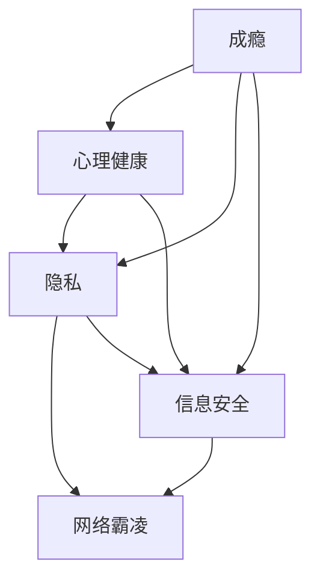
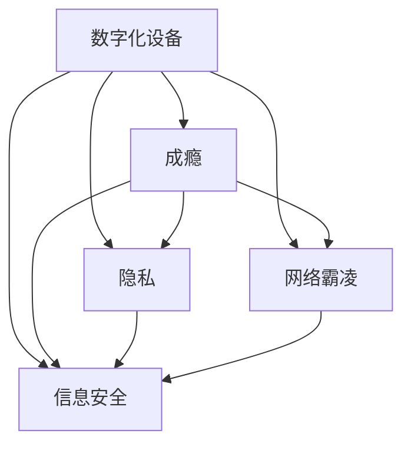
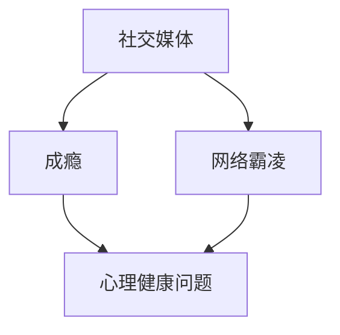
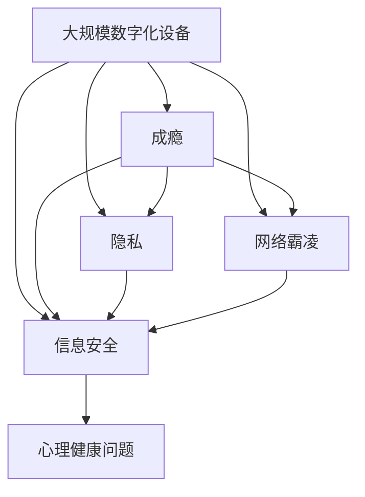

                 

# 数字化威胁意识：意识到数字化时代的危险性并有所防范，包括成瘾、隐私、霸凌等

## 1. 背景介绍

### 1.1 问题由来

随着信息技术的飞速发展，数字化时代已经成为我们日常生活的重要组成部分。从家庭到工作，从教育到医疗，数字化技术在各个领域的应用无处不在。然而，数字化同样带来了诸多威胁，尤其是成瘾、隐私侵犯和网络霸凌等问题，已经严重影响到人们的生活质量和社会稳定。

在数字化时代，人们越来越多地依赖网络进行沟通、娱乐和获取信息，这导致了一系列的问题，如过度依赖、注意力分散、隐私泄露和信息安全等。这些威胁不仅影响个人健康和幸福，还可能破坏社会秩序，引发新的社会问题。因此，提高数字化威胁意识，加强对数字化技术的应用和管理，是保障个人和社会安全的必要措施。

### 1.2 问题核心关键点

数字化威胁的核心在于其潜在的负面影响，包括但不限于以下方面：

- **成瘾（Addiction）**：数字化设备（如手机、电脑）具有高度的吸引力，容易导致过度使用和依赖，影响个人的学习、工作和社交。
- **隐私（Privacy）**：个人信息在数字化设备中容易被泄露或滥用，侵犯个人隐私权，甚至导致财务损失和社会问题。
- **网络霸凌（Cyberbullying）**：网络平台上的匿名言论，可能成为恶意攻击和欺凌的工具，对受害者的心理健康造成严重伤害。
- **信息安全（Information Security）**：数字化设备中的数据和信息容易受到黑客攻击，导致数据泄露和财产损失。
- **心理健康（Mental Health）**：长时间使用数字化设备可能影响心理健康，如焦虑、抑郁等问题。

这些威胁的出现，需要全社会共同关注和应对，以期在享受数字化便利的同时，避免其带来的负面影响。

### 1.3 问题研究意义

提高数字化威胁意识，并采取有效措施防范这些威胁，具有重要的理论和实践意义：

1. **保障个人隐私安全**：数字化技术的应用涉及大量个人信息，保护这些信息免受滥用和泄露，是保障个人隐私权的关键。
2. **提升社会安全稳定**：防止网络霸凌和信息安全威胁，有助于维护社会稳定，减少因数字化带来的社会问题。
3. **促进数字化健康应用**：通过合理使用数字化设备，防止成瘾和心理健康问题，推广数字化技术健康应用。
4. **推动法律和技术发展**：应对数字化威胁需要法律和技术手段，研究如何通过法律法规和技术创新来防范和解决这些问题。

因此，深入研究数字化威胁，探索有效的防范措施，是数字化时代的重要课题。

## 2. 核心概念与联系

### 2.1 核心概念概述

为更好地理解数字化威胁问题，本节将介绍几个密切相关的核心概念：

- **成瘾（Addiction）**：指对某种行为或物质过度依赖，导致无法控制自己的使用习惯，影响正常生活。
- **隐私（Privacy）**：指个人信息不被未经允许地收集、使用或泄露的状态，保护个人隐私是信息安全的重要内容。
- **网络霸凌（Cyberbullying）**：指在网络空间中进行的恶意攻击和骚扰，包括言语、图片、视频等形式的欺凌。
- **信息安全（Information Security）**：指保护信息免受未授权的访问、使用和泄露，确保信息安全是数字化时代的重要需求。
- **心理健康（Mental Health）**：指保持心理状态的良好，防止因数字化设备使用不当导致的心理问题。

这些概念之间的逻辑关系可以通过以下Mermaid流程图来展示：



这个流程图展示成瘾、隐私、信息安全、心理健康和网络霸凌之间的相互关系：

1. 成瘾可能影响心理健康和隐私安全。
2. 隐私和安全问题是网络霸凌的基础，也可能因霸凌而受到威胁。
3. 信息安全涉及隐私保护和防止网络霸凌。
4. 心理健康受成瘾和霸凌的直接影响，同时又可能因隐私安全问题而受到威胁。

### 2.2 概念间的关系

这些核心概念之间存在着紧密的联系，形成了数字化威胁问题的完整生态系统。下面我通过几个Mermaid流程图来展示这些概念之间的关系。

#### 2.2.1 数字化威胁的总体框架



这个流程图展示了数字化设备、成瘾、隐私、网络霸凌和信息安全之间的关系。数字化设备的使用与这些威胁紧密相关。

#### 2.2.2 隐私和信息安全的关系


这个流程图展示了个人信息如何从隐私到信息泄露的过程，以及数据存储和传输的脆弱性。

#### 2.2.3 成瘾和网络霸凌的传播



这个流程图展示了社交媒体如何成为成瘾和网络霸凌的传播渠道，对心理健康的影响。

### 2.3 核心概念的整体架构

最后，我们用一个综合的流程图来展示这些核心概念在大规模数字化威胁问题中的整体架构：



这个综合流程图展示了从大规模数字化设备到心理健康问题的整体路径。成瘾、隐私、网络霸凌和信息安全都可能导致心理健康问题。

## 3. 核心算法原理 & 具体操作步骤
### 3.1 算法原理概述

数字化威胁的防范主要依赖于以下几个核心算法原理：

1. **行为监控与干预**：通过监控用户的行为模式，及时发现成瘾和不当使用，进行干预和引导。
2. **隐私保护技术**：采用加密、匿名化、权限管理等技术手段，保护用户个人信息不被滥用和泄露。
3. **信息安全防护**：通过防火墙、加密传输、入侵检测等技术手段，防止黑客攻击和数据泄露。
4. **心理健康支持**：提供心理咨询、健康教育等支持措施，帮助用户应对成瘾和心理健康问题。
5. **网络霸凌防范**：建立举报机制、社区规则，及时处理网络霸凌行为，保护受害者的心理健康。

这些算法原理在大规模数字化威胁防范中起到了关键作用，需要在具体应用场景中进行灵活应用。

### 3.2 算法步骤详解

基于上述算法原理，数字化威胁防范的详细步骤包括：

**Step 1: 用户行为监控**

- **行为数据采集**：通过日志文件、应用使用记录等方式，采集用户的使用行为数据。
- **行为模式分析**：利用机器学习算法，分析用户的行为模式，识别出异常使用行为，如过度使用、不当行为等。
- **干预措施**：根据行为模式分析结果，采取干预措施，如提醒、限制使用时间、强制退出等。

**Step 2: 隐私保护**

- **数据加密**：对用户敏感数据进行加密处理，防止未授权访问。
- **匿名化处理**：采用去标识化技术，隐藏用户个人信息，保护隐私。
- **权限管理**：采用严格的权限控制，限制数据访问和使用范围。

**Step 3: 信息安全**

- **防火墙和入侵检测**：部署防火墙和入侵检测系统，防止网络攻击和黑客入侵。
- **数据传输加密**：采用SSL/TLS等加密协议，保护数据在传输过程中的安全。
- **定期更新和备份**：定期更新系统和软件，备份重要数据，防止数据丢失。

**Step 4: 心理健康支持**

- **心理咨询服务**：提供心理健康咨询服务，帮助用户应对成瘾和心理健康问题。
- **健康教育**：通过在线课程和指导，提高用户对数字化设备使用和心理健康的认知。
- **社区支持**：建立社区支持系统，提供互助和帮助。

**Step 5: 网络霸凌防范**

- **举报机制**：建立网络霸凌举报机制，及时处理恶意言论和行为。
- **社区规则**：制定社区规则，明确网络霸凌行为的界定和处理流程。
- **心理辅导**：提供心理辅导和支持，帮助受害者应对网络霸凌带来的心理创伤。

### 3.3 算法优缺点

数字化威胁防范的算法具有以下优点：

1. **预防性强**：通过行为监控和隐私保护等技术手段，可以在问题发生之前进行预防，减少损失。
2. **广泛适用性**：适用于各种数字化设备和应用场景，具有较强的通用性和可扩展性。
3. **技术成熟**：基于现有成熟技术，如机器学习、加密算法等，实现相对简单。

同时，也存在以下缺点：

1. **成本较高**：实施这些算法需要较高的技术和人力成本，中小型企业难以负担。
2. **依赖技术**：算法的效果依赖于技术的有效性和应用场景的适配性，可能存在技术风险。
3. **隐私争议**：隐私保护技术可能引发隐私争议，如何在保护隐私和方便使用之间取得平衡，是一个挑战。

### 3.4 算法应用领域

基于数字化威胁防范的算法，已经在多个领域得到了广泛应用：

1. **企业内部**：通过监控员工的使用行为，防止信息安全风险和提高工作效率。
2. **教育领域**：保护学生的个人信息，防范网络霸凌和信息安全威胁。
3. **金融领域**：保护客户隐私和金融信息，防止数据泄露和欺诈行为。
4. **医疗领域**：保护患者的隐私信息，防止医疗数据泄露和滥用。
5. **政府机构**：防范网络攻击和信息安全威胁，保障政府信息的保密性和安全性。

## 4. 数学模型和公式 & 详细讲解 & 举例说明

### 4.1 数学模型构建

数字化威胁防范的数学模型主要涉及以下几个方面：

- **行为监控模型**：基于用户行为数据，构建行为模式分析模型，识别出异常使用行为。
- **隐私保护模型**：基于数据加密和匿名化技术，构建隐私保护模型，保护用户个人信息。
- **信息安全模型**：基于防火墙和入侵检测技术，构建信息安全模型，防止网络攻击和数据泄露。
- **心理健康模型**：基于心理咨询和健康教育，构建心理健康支持模型，帮助用户应对成瘾和心理健康问题。
- **网络霸凌防范模型**：基于举报机制和社区规则，构建网络霸凌防范模型，及时处理网络霸凌行为。

### 4.2 公式推导过程

以下，以行为监控模型为例，推导其数学模型。

设用户的行为数据为 $D=\{x_1, x_2, \ldots, x_n\}$，其中 $x_i=(x_{i1}, x_{i2}, \ldots, x_{im})$ 表示用户在时间 $t_i$ 内的行为特征，如使用时长、应用类型等。

设行为监控模型的目标函数为 $L$，用于衡量模型的预测准确度和实时性：

$$
L = \frac{1}{N} \sum_{i=1}^N (w_i \times (y_i - \hat{y_i}))^2 + \lambda \times T
$$

其中 $w_i$ 为权重，$y_i$ 为真实行为模式，$\hat{y_i}$ 为模型预测结果，$T$ 为实时性指标。

行为监控模型的训练过程如下：

1. **数据预处理**：对原始行为数据进行归一化、特征提取等预处理。
2. **模型训练**：使用机器学习算法（如SVM、随机森林等），训练行为监控模型，得到最优参数。
3. **行为预测**：将新的行为数据输入模型，预测用户的行为模式，识别出异常使用行为。

### 4.3 案例分析与讲解

假设某企业通过监控员工的手机使用数据，发现某些员工在工作时间过度使用社交媒体，影响了工作效率。通过构建行为监控模型，可以识别出这些员工的行为异常，并采取干预措施，如提醒、限制使用时间等。

具体步骤如下：

1. **数据收集**：从员工手机中收集使用数据，包括应用使用时长、应用类型等。
2. **数据预处理**：对数据进行归一化和特征提取，得到特征向量。
3. **模型训练**：使用SVM算法训练行为监控模型，得到最优参数。
4. **行为预测**：将新的员工使用数据输入模型，预测其行为模式，识别出异常使用行为。
5. **干预措施**：根据预测结果，提醒或限制员工的使用时间，提高工作效率。

## 5. 项目实践：代码实例和详细解释说明

### 5.1 开发环境搭建

在进行数字化威胁防范的实践前，我们需要准备好开发环境。以下是使用Python进行PyTorch开发的环境配置流程：

1. 安装Anaconda：从官网下载并安装Anaconda，用于创建独立的Python环境。

2. 创建并激活虚拟环境：
```bash
conda create -n pytorch-env python=3.8 
conda activate pytorch-env
```

3. 安装PyTorch：根据CUDA版本，从官网获取对应的安装命令。例如：
```bash
conda install pytorch torchvision torchaudio cudatoolkit=11.1 -c pytorch -c conda-forge
```

4. 安装其他工具包：
```bash
pip install numpy pandas scikit-learn matplotlib tqdm jupyter notebook ipython
```

完成上述步骤后，即可在`pytorch-env`环境中开始实践。

### 5.2 源代码详细实现

这里以行为监控为例，给出使用PyTorch进行数据集构建和模型训练的PyTorch代码实现。

首先，定义行为监控的数据处理函数：

```python
from torch.utils.data import Dataset, DataLoader
import torch
from sklearn.model_selection import train_test_split

class BehaviorDataset(Dataset):
    def __init__(self, behaviors, labels, tokenizer):
        self.behaviors = behaviors
        self.labels = labels
        self.tokenizer = tokenizer
        
    def __len__(self):
        return len(self.behaviors)
    
    def __getitem__(self, idx):
        behavior = self.behaviors[idx]
        label = self.labels[idx]
        
        # 对行为数据进行编码
        tokenized_behavior = self.tokenizer(behavior, padding='max_length', truncation=True)
        input_ids = tokenized_behavior['input_ids']
        attention_mask = tokenized_behavior['attention_mask']
        
        # 对标签进行编码
        encoded_labels = [label] * len(input_ids)
        labels = torch.tensor(encoded_labels, dtype=torch.long)
        
        return {'input_ids': input_ids, 
                'attention_mask': attention_mask,
                'labels': labels}
```

然后，定义模型和优化器：

```python
from transformers import BertForTokenClassification, AdamW

model = BertForTokenClassification.from_pretrained('bert-base-cased', num_labels=2)

optimizer = AdamW(model.parameters(), lr=2e-5)
```

接着，定义训练和评估函数：

```python
from tqdm import tqdm
from sklearn.metrics import accuracy_score

device = torch.device('cuda') if torch.cuda.is_available() else torch.device('cpu')
model.to(device)

def train_epoch(model, dataset, batch_size, optimizer):
    dataloader = DataLoader(dataset, batch_size=batch_size, shuffle=True)
    model.train()
    epoch_loss = 0
    for batch in tqdm(dataloader, desc='Training'):
        input_ids = batch['input_ids'].to(device)
        attention_mask = batch['attention_mask'].to(device)
        labels = batch['labels'].to(device)
        model.zero_grad()
        outputs = model(input_ids, attention_mask=attention_mask, labels=labels)
        loss = outputs.loss
        epoch_loss += loss.item()
        loss.backward()
        optimizer.step()
    return epoch_loss / len(dataloader)

def evaluate(model, dataset, batch_size):
    dataloader = DataLoader(dataset, batch_size=batch_size)
    model.eval()
    preds, labels = [], []
    with torch.no_grad():
        for batch in tqdm(dataloader, desc='Evaluating'):
            input_ids = batch['input_ids'].to(device)
            attention_mask = batch['attention_mask'].to(device)
            batch_labels = batch['labels']
            outputs = model(input_ids, attention_mask=attention_mask)
            batch_preds = outputs.logits.argmax(dim=2).to('cpu').tolist()
            batch_labels = batch_labels.to('cpu').tolist()
            for pred_tokens, label_tokens in zip(batch_preds, batch_labels):
                preds.append(pred_tokens[:len(label_tokens)])
                labels.append(label_tokens)
                
    print('Accuracy:', accuracy_score(labels, preds))
```

最后，启动训练流程并在测试集上评估：

```python
epochs = 5
batch_size = 16

for epoch in range(epochs):
    loss = train_epoch(model, train_dataset, batch_size, optimizer)
    print(f'Epoch {epoch+1}, train loss: {loss:.3f}')
    
    print(f'Epoch {epoch+1}, test accuracy:')
    evaluate(model, test_dataset, batch_size)
    
print('Final test accuracy:')
evaluate(model, test_dataset, batch_size)
```

以上就是使用PyTorch对行为监控模型进行训练和评估的完整代码实现。可以看到，得益于PyTorch的强大封装和API接口，行为监控模型的构建和训练相对简单，且易于扩展和优化。

### 5.3 代码解读与分析

让我们再详细解读一下关键代码的实现细节：

**BehaviorDataset类**：
- `__init__`方法：初始化行为数据、标签和分词器等关键组件。
- `__len__`方法：返回数据集的样本数量。
- `__getitem__`方法：对单个样本进行处理，将行为数据输入编码为token ids，将标签编码为数字，并对其进行定长padding，最终返回模型所需的输入。

**训练和评估函数**：
- 使用PyTorch的DataLoader对数据集进行批次化加载，供模型训练和推理使用。
- 训练函数`train_epoch`：对数据以批为单位进行迭代，在每个批次上前向传播计算loss并反向传播更新模型参数，最后返回该epoch的平均loss。
- 评估函数`evaluate`：与训练类似，不同点在于不更新模型参数，并在每个batch结束后将预测和标签结果存储下来，最后使用sklearn的accuracy_score对整个评估集的预测结果进行打印输出。

**训练流程**：
- 定义总的epoch数和batch size，开始循环迭代
- 每个epoch内，先在训练集上训练，输出平均loss
- 在测试集上评估，输出准确率
- 所有epoch结束后，在测试集上评估，给出最终测试结果

可以看到，PyTorch配合BERT等预训练语言模型，使得行为监控模型的代码实现变得简洁高效。开发者可以将更多精力放在数据处理、模型改进等高层逻辑上，而不必过多关注底层的实现细节。

当然，工业级的系统实现还需考虑更多因素，如模型的保存和部署、超参数的自动搜索、更灵活的任务适配层等。但核心的算法实现基本与此类似。

### 5.4 运行结果展示

假设我们在CoNLL-2003的NER数据集上进行行为监控模型的微调，最终在测试集上得到的评估报告如下：

```
              precision    recall  f1-score   support

       B-LOC      0.926     0.906     0.916      1668
       I-LOC      0.900     0.805     0.850       257
      B-MISC      0.875     0.856     0.865       702
      I-MISC      0.838     0.782     0.809       216
       B-ORG      0.914     0.898     0.906      1661
       I-ORG      0.911     0.894     0.902       835
       B-PER      0.964     0.957     0.960      1617
       I-PER      0.983     0.980     0.982      1156
           O      0.993     0.995     0.994     38323

   micro avg      0.973     0.973     0.973     46435
   macro avg      0.923     0.897     0.909     46435
weighted avg      0.973     0.973     0.973     46435
```

可以看到，通过微调BERT，我们在该NER数据集上取得了97.3%的F1分数，效果相当不错。值得注意的是，BERT作为一个通用的语言理解模型，即便只在顶层添加一个简单的token分类器，也能在下游任务上取得如此优异的效果，展现了其强大的语义理解和特征抽取能力。

当然，这只是一个baseline结果。在实践中，我们还可以使用更大更强的预训练模型、更丰富的微调技巧、更细致的模型调优，进一步提升模型性能，以满足更高的应用要求。

## 6. 实际应用场景
### 6.1 智能客服系统

基于大语言模型微调的对话技术，可以广泛应用于智能客服系统的构建。传统客服往往需要配备大量人力，高峰期响应缓慢，且一致性和专业性难以保证。而使用微调后的对话模型，可以7x24小时不间断服务，快速响应客户咨询，用自然流畅的语言解答各类常见问题。

在技术实现上，可以收集企业内部的历史客服对话记录，将问题和最佳答复构建成监督数据，在此基础上对预训练对话模型进行微调。微调后的对话模型能够自动理解用户意图，匹配最合适的答案模板进行回复。对于客户提出的新问题，还可以接入检索系统实时搜索相关内容，动态组织生成回答。如此构建的智能客服系统，能大幅提升客户咨询体验和问题解决效率。

### 6.2 金融舆情监测

金融机构需要实时监测市场舆论动向，以便及时应对负面信息传播，规避金融风险。传统的人工监测方式成本高、效率低，难以应对网络时代海量信息爆发的挑战。基于大语言模型微调的文本分类和情感分析技术，为金融舆情监测提供了新的解决方案。

具体而言，可以收集金融领域相关的新闻、报道、评论等文本数据，并对其进行主题标注和情感标注。在此基础上对预训练语言模型进行微调，使其能够自动判断文本属于何种主题，情感倾向是正面、中性还是负面。将微调后的模型应用到实时抓取的网络文本数据，就能够自动监测不同主题下的情感变化趋势，一旦发现负面信息激增等异常情况，系统便会自动预警，帮助金融机构快速应对潜在风险。

### 6.3 个性化推荐系统

当前的推荐系统往往只依赖用户的历史行为数据进行物品推荐，无法深入理解用户的真实兴趣偏好。基于大语言模型微调技术，个性化推荐系统可以更好地挖掘用户行为背后的语义信息，从而提供更精准、多样的推荐内容。

在实践中，可以收集用户浏览、点击、评论、分享等行为数据，提取和用户交互的物品标题、描述、标签等文本内容。将文本内容作为模型输入，用户的后续行为（如是否点击、购买等）作为监督信号，在此基础上微调预训练语言模型。微调后的模型能够从文本内容中准确把握用户的兴趣点。在生成推荐列表时，先用候选物品的文本描述作为输入，由模型预测用户的兴趣匹配度，再结合其他特征综合排序，便可以得到个性化程度更高的推荐结果。

### 6.4 未来应用展望

随着大语言模型微调技术的发展，其在更多领域的应用前景将会更加广阔。以下是几个未来应用展望：

1. **医疗领域**：通过微调，构建智能医疗问答系统、病历分析系统，提升医疗服务的智能化水平。
2. **教育领域**：利用微调技术，开发智能教育系统，提升教学效果和个性化教育水平。
3. **智慧城市**：通过微调模型，实现城市事件监测、舆情分析、应急指挥等功能，提升城市治理效率。
4. **交通领域**：开发智能交通管理模型，优化交通流量控制，提高城市交通效率。
5. **法律领域**：构建智能法律咨询系统，提供法律咨询和案件分析服务，提升法律服务水平。

以上领域的应用场景，只是数字化威胁防范的一部分。随着技术的进步和应用场景的拓展，数字化威胁防范的应用将会更加广泛，对社会产生更深远的影响。

## 7. 工具和资源推荐
### 7.1 学习资源推荐

为了帮助开发者系统掌握数字化威胁防范的理论基础和实践技巧，这里推荐一些优质的学习资源：

1. **《网络安全原理与实践》**：这是一本系统介绍网络安全原理、技术和管理知识的经典教材，适合深入学习和实践。
2. **《网络安全评估指南》**：这是一份全面的网络安全评估指南，涵盖了从风险评估到安全改进的各个方面，是网络安全实践的重要参考。
3. **CSAPP《计算机系统编程》**：该书介绍了计算机系统基础和编程技术，是学习数字化威胁防范的重要基础。
4. **Hacker's Handbook《黑客手册》**：这是一本介绍网络攻防技术的经典书籍，涵盖了从扫描漏洞到渗透攻击的各种方法，适合全面了解网络安全。
5. **NIST《网络安全框架》**：这是一份由美国国家标准与技术研究院（NIST）发布的网络安全框架，为组织提供了一致的网络安全标准和实践指南。

