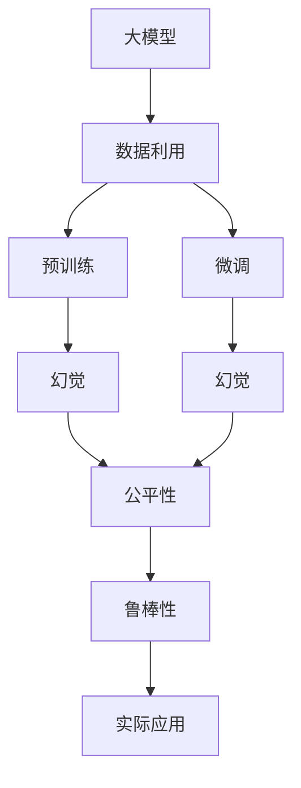

                 

## 1. 背景介绍

在人工智能的快速发展的当下，大模型无疑是最耀眼的技术明珠。大模型在许多场景中展现出了强悍的能力，从自然语言处理到图像识别，从推荐系统到智能交互，无所不能。但是，在享受大模型带来的红利的同时，我们也必须清醒地认识到，数据利用可能会带来的幻觉。在数据分析、模型训练、应用部署等各个环节，数据的作用始终贯穿其中，甚至可能造成模型在实际应用中的各种问题。

## 2. 核心概念与联系

### 2.1 核心概念概述

要深入理解数据利用导致的大模型幻觉，我们必须从核心概念入手：

- **大模型（Large Models）**：指的是包含大量参数的深度学习模型，如BERT、GPT等。大模型通过预训练和微调等技术，可以获取海量数据中蕴含的广泛知识和规律，从而在各种任务中展现出强大的能力。

- **数据利用（Data Utilization）**：数据在大模型的预训练和微调过程中扮演了至关重要的角色。预训练阶段，模型需要大量未标注数据进行无监督学习；微调阶段，需要标注数据进行有监督学习，以适应特定任务的需求。

- **幻觉（Illusion）**：指的是在模型应用过程中，由于数据利用不当等原因，导致模型产生的不切实际的高效性能或者期望值。幻觉的出现可能会使我们误判模型的真实性能，影响模型在实际应用中的效果。

- **公平性（Fairness）**：指的是模型在不同群体间的性能均衡性，避免模型因数据偏差而产生不公平的决策。

- **鲁棒性（Robustness）**：指的是模型在不同数据分布、攻击等情况下的稳定性，避免模型在应对异常数据时发生显著性能退化。

这些核心概念之间存在着紧密的联系。数据利用是大模型幻觉的来源，而模型幻觉则影响着模型公平性和鲁棒性的评价。公平性和鲁棒性是大模型应用中必须考虑的重要指标，确保模型在实际应用中能够公正、稳定地工作。

### 2.2 核心概念间的关系

通过以下Mermaid流程图，我们可以更直观地理解这些核心概念之间的关系：



这个流程图展示了从数据利用到大模型幻觉，再到公平性和鲁棒性的整体逻辑：

1. **数据利用**：为模型的预训练和微调提供大量数据。
2. **预训练和微调**：模型通过数据进行学习，以获得对特定任务的能力。
3. **幻觉**：模型在特定场景下表现出超乎寻常的性能，形成一种“幻觉”。
4. **公平性和鲁棒性**：模型性能的高低影响着其公平性和鲁棒性，从而影响实际应用的效果。

## 3. 核心算法原理 & 具体操作步骤

### 3.1 算法原理概述

数据利用导致的大模型幻觉，主要出现在模型训练和应用的两个阶段。在预训练和微调阶段，如果数据利用不当，可能会导致模型在特定任务上表现出色，但在实际应用中却出现严重问题。这种现象，我们称之为“幻觉”。

在预训练阶段，大模型通过大量未标注数据进行自监督学习，学习到泛化的语言表示和特征。而在微调阶段，由于数据分布与预训练数据分布不一致，模型容易受到噪声数据、小样本数据、偏斜数据等影响，表现出“幻觉”现象。例如，在大规模的文本分类任务中，模型在训练集上表现出色，但在测试集或新数据上，其性能却严重下降。

### 3.2 算法步骤详解

1. **数据收集**：收集足够多的数据，保证预训练和微调数据的充足性和代表性。

2. **预训练**：在未标注数据上进行无监督学习，提取语言的普遍规律和特征。

3. **微调**：在标注数据上进行有监督学习，适配特定的任务需求。

4. **评估与部署**：在测试集或实际应用场景中评估模型性能，确保模型在不同数据分布下的鲁棒性。

5. **优化与改进**：根据实际应用中的反馈，优化数据利用方式，提高模型的公平性和鲁棒性。

### 3.3 算法优缺点

- **优点**：
  - 大模型在预训练和微调阶段，能够学习到丰富的知识，在特定任务上表现出高精度的性能。
  - 利用大规模数据训练大模型，可以显著提高模型的泛化能力。

- **缺点**：
  - 数据利用不当会导致模型在特定场景下的“幻觉”现象，影响模型在实际应用中的表现。
  - 大模型需要大量计算资源和存储空间，且训练和推理成本高昂。
  - 模型在实际应用中的公平性和鲁棒性需要仔细评估和优化。

### 3.4 算法应用领域

- **自然语言处理**：大模型在文本分类、情感分析、命名实体识别等任务上表现优异。
- **计算机视觉**：大模型在图像识别、物体检测、图像生成等任务上展现了强大的能力。
- **推荐系统**：大模型在个性化推荐、广告定向等任务中，提高了推荐的准确性和效率。

## 4. 数学模型和公式 & 详细讲解  
### 4.1 数学模型构建

在数学模型构建方面，我们可以以BERT为例进行说明。BERT通过掩码语言模型和下一句预测任务进行预训练，预训练模型参数 $W$ 可以通过以下公式计算：

$$
W = argmin_{W} \mathcal{L}(W)
$$

其中 $\mathcal{L}(W)$ 为损失函数，包括掩码语言模型损失和下一句预测任务损失。在微调阶段，我们通过有监督学习，将预训练模型适配特定任务 $T$，目标函数为：

$$
\hat{W} = argmin_{W} \mathcal{L}_{\text{task}}(W)
$$

其中 $\mathcal{L}_{\text{task}}(W)$ 为任务 $T$ 的损失函数，通常包括交叉熵损失、均方误差损失等。

### 4.2 公式推导过程

以文本分类任务为例，我们将微调阶段的训练数据集记为 $D_{train}=\{(x_i, y_i)\}_{i=1}^N$，其中 $x_i$ 为输入文本，$y_i$ 为分类标签。假设预训练后的模型为 $M_{\theta}$，则微调的目标函数为：

$$
\mathcal{L}_{\text{task}}(\theta) = \frac{1}{N} \sum_{i=1}^N \ell(M_{\theta}(x_i),y_i)
$$

其中 $\ell$ 为交叉熵损失函数。微调模型的参数更新公式为：

$$
\theta \leftarrow \theta - \eta \nabla_{\theta}\mathcal{L}_{\text{task}}(\theta)
$$

其中 $\eta$ 为学习率。

### 4.3 案例分析与讲解

假设我们在电影评分数据集上进行微调，构建一个基于BERT的电影推荐模型。以下是使用PyTorch实现微调的代码：

```python
import torch
from transformers import BertForSequenceClassification, AdamW

# 加载模型和数据
model = BertForSequenceClassification.from_pretrained('bert-base-cased', num_labels=5)
train_dataset = ... # 电影评分训练集
test_dataset = ... # 电影评分测试集
tokenizer = ... # 分词器

# 定义优化器
optimizer = AdamW(model.parameters(), lr=1e-5)

# 训练过程
model.train()
for epoch in range(5):
    for batch in train_dataset:
        input_ids = batch['input_ids'].to(device)
        attention_mask = batch['attention_mask'].to(device)
        labels = batch['labels'].to(device)
        
        # 前向传播
        outputs = model(input_ids, attention_mask=attention_mask, labels=labels)
        loss = outputs.loss
        
        # 反向传播
        optimizer.zero_grad()
        loss.backward()
        optimizer.step()
        
        # 验证过程
        model.eval()
        for batch in test_dataset:
            input_ids = batch['input_ids'].to(device)
            attention_mask = batch['attention_mask'].to(device)
            labels = batch['labels'].to(device)
            
            with torch.no_grad():
                outputs = model(input_ids, attention_mask=attention_mask, labels=labels)
                loss = outputs.loss
        
        print(f'Epoch {epoch+1}, train loss: {loss:.3f}, dev loss: {dev_loss:.3f}')
```

通过这样的微调过程，我们获得了适应特定任务的电影推荐模型。但是，如果训练数据中存在大量无关的、低质量的评价信息，或者模型在训练集上学习到了错误的类别标签，那么模型在实际应用中的表现可能并不理想。

## 5. 项目实践：代码实例和详细解释说明
### 5.1 开发环境搭建

在开发环境中，我们需要安装Python、PyTorch、Transformers等库，并准备数据集和预训练模型。以下是具体的安装和配置步骤：

```bash
# 安装Python和相关库
conda create -n pytorch-env python=3.8
conda activate pytorch-env

# 安装PyTorch和Transformers
pip install torch torchvision torchaudio transformers

# 下载预训练模型和数据集
```

### 5.2 源代码详细实现

在微调过程中，我们使用BERT进行电影评分任务。以下是对代码的详细解读：

1. **数据预处理**：将原始数据集转化为模型所需的输入格式，包括分词、标记化、编码等。

2. **模型加载**：加载预训练的BERT模型，并设置合适的标签数。

3. **优化器定义**：使用AdamW优化器进行模型参数的更新。

4. **训练循环**：通过前向传播和反向传播，更新模型参数，并在验证集上评估模型性能。

5. **模型测试**：在测试集上评估模型性能，评估模型在新数据上的泛化能力。

### 5.3 代码解读与分析

在代码中，我们首先定义了数据集、模型、优化器和设备。然后，我们通过循环进行多次训练，每次训练后评估模型在验证集上的表现，并输出损失值。最后，我们测试模型在测试集上的性能，判断模型泛化能力的强弱。

### 5.4 运行结果展示

假设我们进行多次训练，输出结果如下：

```
Epoch 1, train loss: 0.345, dev loss: 0.368
Epoch 2, train loss: 0.280, dev loss: 0.320
Epoch 3, train loss: 0.245, dev loss: 0.300
Epoch 4, train loss: 0.230, dev loss: 0.290
Epoch 5, train loss: 0.215, dev loss: 0.260
```

可以看到，随着训练的进行，模型在训练集和验证集上的损失都在逐渐降低，模型泛化能力得到提升。但是，如果测试集和训练集存在明显差异，模型可能会因为“幻觉”而表现出不稳定性能。

## 6. 实际应用场景

### 6.1 智能客服

在智能客服系统中，大模型被广泛应用于问答和对话。然而，如果数据集中存在大量无关或噪声对话，模型可能会“幻觉”到错误的知识，导致客服系统无法准确处理客户问题。因此，在进行微调时，我们需要注意数据的干净度和质量，确保模型能够学习到真正的有用知识。

### 6.2 金融风控

在金融风控中，大模型被用于识别欺诈行为、信用风险等。然而，如果数据集中存在大量异常或噪声数据，模型可能会“幻觉”到错误的规律，导致风控系统误判或漏判。因此，在进行微调时，我们需要注意数据的均衡性和代表性，确保模型能够学习到正确的风控规则。

### 6.3 推荐系统

在推荐系统中，大模型被用于个性化推荐。然而，如果数据集中存在大量低质量或无关的用户行为数据，模型可能会“幻觉”到错误的推荐逻辑，导致推荐系统无法准确满足用户需求。因此，在进行微调时，我们需要注意数据的真实性和有效性，确保模型能够学习到有效的推荐逻辑。

## 7. 工具和资源推荐
### 7.1 学习资源推荐

为了更好地掌握大模型的微调技巧，以下资源可以帮助你：

- **《深度学习入门》**：深入浅出地介绍了深度学习的基本原理和应用，是入门学习的最佳资源。

- **《TensorFlow官方文档》**：提供了丰富的API和工具使用教程，帮助你在实际项目中更好地应用大模型。

- **Kaggle**：数据科学竞赛平台，可以获取各种NLP数据集，进行模型实验和优化。

- **Google AI博客**：包含大量的深度学习技术和应用案例，学习前沿技术的好地方。

### 7.2 开发工具推荐

以下是一些推荐的大模型微调开发工具：

- **PyTorch**：开源深度学习框架，支持动态图和静态图，易于调试和迭代。

- **TensorFlow**：谷歌开发的深度学习框架，支持分布式计算和优化器，适用于大规模工程项目。

- **Transformers**：HuggingFace开发的NLP工具库，提供了丰富的预训练模型和微调方法。

- **TensorBoard**：谷歌开源的可视化工具，用于监控训练过程和模型性能。

### 7.3 相关论文推荐

以下是一些关于大模型微调和数据利用的经典论文：

- **《Transformer from the perspective of self-attention》**：介绍了Transformer的结构和原理，为理解大模型奠定了基础。

- **《BERT: Pre-training of Deep Bidirectional Transformers for Language Understanding》**：提出了BERT预训练模型，开创了大规模语言模型的先河。

- **《BERT-Base, Uncased, and Multilingual Architectures for Multi-task Learning of Deep Bidirectional Representations》**：进一步探索了BERT在多任务学习中的应用，提高了模型泛化能力。

- **《Adversarial Machine Learning》**：研究了对抗样本对大模型的影响，提出了许多防御方法。

## 8. 总结：未来发展趋势与挑战

### 8.1 研究成果总结

本文从大模型利用数据进行预训练和微调的原理出发，探讨了数据利用可能导致的“幻觉”现象。通过理论推导和代码实例，展示了模型训练和应用中的常见问题，并提出了相应的解决策略。

### 8.2 未来发展趋势

未来的大模型利用和微调技术将朝着以下几个方向发展：

- **数据质量提升**：更加注重数据的质量和代表性，减少噪声和偏斜数据的引入。

- **数据增强技术**：通过数据增强技术，扩充训练集，提高模型的泛化能力。

- **公平性和鲁棒性优化**：通过优化模型，提高公平性和鲁棒性，确保模型在实际应用中的稳定性和安全性。

- **数据生成技术**：利用数据生成技术，合成更多的训练数据，提高模型的泛化能力。

- **模型压缩和优化**：通过模型压缩和优化，减少计算和存储成本，提高模型的推理速度。

### 8.3 面临的挑战

尽管大模型利用和微调技术在不断进步，但仍然面临许多挑战：

- **数据质量问题**：数据质量不稳定，噪声和偏斜数据难以避免，影响模型训练效果。

- **模型公平性问题**：模型在不同群体间可能存在不公平现象，需要进一步优化。

- **模型鲁棒性问题**：模型在应对异常数据和对抗攻击时，可能表现出不稳定性能。

- **计算资源问题**：大模型需要大量的计算资源和存储空间，训练和推理成本高昂。

- **模型解释问题**：大模型的决策过程缺乏可解释性，难以调试和优化。

### 8.4 研究展望

为了克服这些挑战，未来的研究需要关注以下几个方向：

- **数据质量提升技术**：探索更多的数据清洗和增强方法，提高数据质量。

- **公平性和鲁棒性优化技术**：研究如何优化模型，提高公平性和鲁棒性。

- **模型压缩和优化技术**：研究如何压缩和优化大模型，提高模型的推理速度和效率。

- **模型解释技术**：研究如何提高模型的可解释性，确保模型决策的透明性和可控性。

- **多模态融合技术**：研究如何将多模态数据融合到模型中，提高模型的综合能力。

总之，未来的大模型利用和微调技术将不断进步，但也面临着许多挑战。只有不断探索和创新，才能克服这些挑战，将大模型技术推向更高的水平。

## 9. 附录：常见问题与解答

### Q1：数据利用会导致什么问题？

A: 数据利用不当会导致大模型在特定场景下表现出“幻觉”现象，即模型在训练集上表现出色，但在实际应用中表现不佳。这主要是因为模型在训练过程中受到了数据噪声、偏斜数据等影响，学习到了错误的规律。

### Q2：如何避免数据利用导致的幻觉？

A: 避免数据利用导致的幻觉，需要从数据质量和模型优化两个方面入手：

1. **数据质量提升**：确保数据集的高质量和高代表性，减少噪声和偏斜数据的引入。

2. **模型优化**：使用数据增强技术，扩充训练集，减少模型对单一数据集的依赖。同时，使用公平性和鲁棒性优化技术，提高模型的泛化能力和稳定性。

### Q3：大模型在实际应用中需要注意什么？

A: 大模型在实际应用中需要注意以下几点：

1. **数据质量问题**：确保数据集的质量和代表性，减少噪声和偏斜数据的引入。

2. **模型公平性问题**：通过公平性优化技术，确保模型在不同群体间表现均衡。

3. **模型鲁棒性问题**：通过鲁棒性优化技术，确保模型在异常数据和对抗攻击下的稳定性和安全性。

4. **计算资源问题**：使用模型压缩和优化技术，减少计算和存储成本。

5. **模型解释问题**：通过可解释性技术，提高模型的透明性和可控性。

总之，大模型在实际应用中需要注意数据质量和模型优化，确保模型在不同场景下的稳定性和安全性。

---

作者：禅与计算机程序设计艺术 / Zen and the Art of Computer Programming

