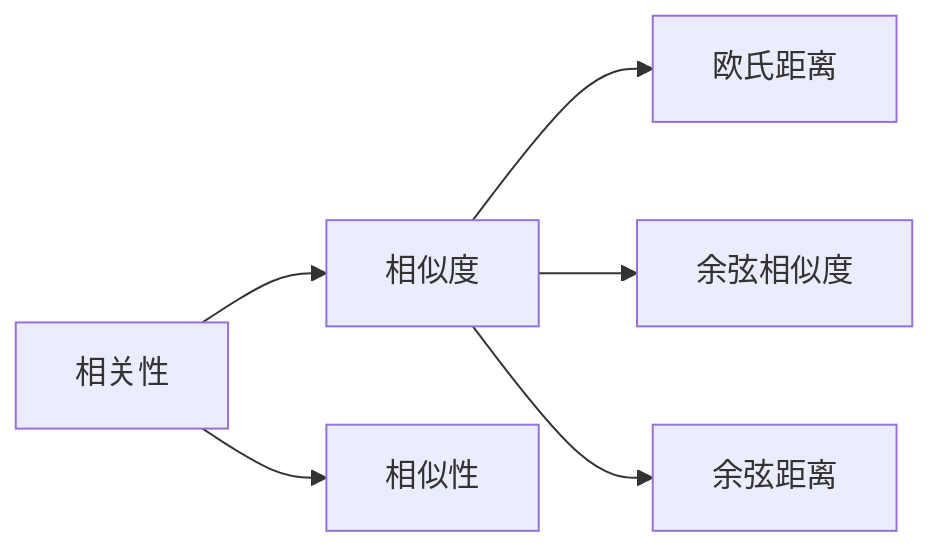

# 【AI大数据计算原理与代码实例讲解】相关性评分

作者：禅与计算机程序设计艺术 / Zen and the Art of Computer Programming

## 1. 背景介绍

### 1.1 问题的由来

随着大数据时代的到来，数据量呈指数级增长，如何从海量数据中快速、准确地找出具有相似性或相关性的数据对，成为数据分析和决策支持的关键问题。相关性评分（Relevance Score）作为一种量化数据之间相似度的方法，在信息检索、推荐系统、文本挖掘等领域得到了广泛应用。

### 1.2 研究现状

目前，相关性评分方法主要分为基于距离度量、基于统计模型和基于深度学习三种类型。

- 基于距离度量的方法：通过计算数据之间的距离（如欧氏距离、余弦相似度等）来衡量其相似程度。这类方法简单易实现，但可能受特征维度和噪声影响较大。
- 基于统计模型的方法：通过统计模型（如多项式模型、向量空间模型等）来计算数据之间的相关性。这类方法能够有效处理高维数据，但可能需要大量训练数据和参数调优。
- 基于深度学习的方法：利用深度神经网络学习数据之间的内在特征表示，进而计算其相似度。这类方法能够处理复杂的数据关系，但模型训练和调参过程较为繁琐。

### 1.3 研究意义

相关性评分在众多领域具有重要的应用价值：

- 信息检索：通过相关性评分，可以将检索结果按照相关性进行排序，提高用户检索效率。
- 推荐系统：通过相关性评分，可以为用户推荐相似的商品、新闻、视频等内容，提升用户体验。
- 文本挖掘：通过相关性评分，可以挖掘文本之间的关联关系，提取有价值的信息。

### 1.4 本文结构

本文将介绍相关性评分的基本原理、常用算法、代码实现和实际应用场景。具体章节安排如下：

- 第2章：介绍相关性评分的相关概念和联系。
- 第3章：讲解常用的相关性评分算法及其原理。
- 第4章：分析不同算法的优缺点和适用场景。
- 第5章：提供代码实例，讲解如何实现相关性评分。
- 第6章：介绍相关性评分在实际应用中的案例。
- 第7章：推荐相关学习资源、开发工具和参考文献。
- 第8章：总结相关性评分的未来发展趋势和挑战。

## 2. 核心概念与联系

本节将介绍相关性评分的相关概念，并阐述它们之间的联系。

### 2.1 相关性

相关性是指两个变量之间的线性关系。通常用相关系数（Correlation Coefficient）来衡量两个变量之间的相关程度。相关系数的取值范围为[-1, 1]，越接近1或-1，表示两个变量之间的线性关系越强；越接近0，表示两个变量之间的线性关系越弱。

### 2.2 相似度

相似度是指两个对象之间的相似程度。在数据分析和机器学习中，相似度是一个重要的概念，用于衡量数据之间的相似性。常见的相似度度量方法有：

- 欧氏距离：计算两个向量之间的直线距离。
- 余弦相似度：计算两个向量在单位球面上的夹角余弦值。
- 余弦距离：计算两个向量在单位球面上的夹角余弦值的负值。

### 2.3 相似性

相似性是指两个对象之间的相似程度，类似于相似度。但相似性更强调对象之间的内在联系，而相似度更侧重于对象之间的量化距离。

这三个概念之间的关系如下：



可以看出，相关性、相似度和相似度度量方法之间存在着密切的联系。相关性是相似度的基础，相似度度量方法则用于量化相关性。

## 3. 核心算法原理 & 具体操作步骤

### 3.1 算法原理概述

本节将介绍几种常用的相关性评分算法及其原理。

#### 3.1.1 基于距离度量的方法

基于距离度量的方法通过计算数据之间的距离来衡量其相似度。常见的距离度量方法有：

- 欧氏距离：欧氏距离是空间中两点之间的直线距离。对于二维空间中的两个点 $(x_1, y_1)$ 和 $(x_2, y_2)$，其欧氏距离为：

$$
d(\vec{x}_1, \vec{x}_2) = \sqrt{(x_2 - x_1)^2 + (y_2 - y_1)^2}
$$

- 余弦相似度：余弦相似度是两个向量在单位球面上的夹角余弦值。对于两个向量 $\vec{x}_1$ 和 $\vec{x}_2$，其余弦相似度为：

$$
\cos(\theta) = \frac{\vec{x}_1 \cdot \vec{x}_2}{\|\vec{x}_1\| \|\vec{x}_2\|}
$$

- 余弦距离：余弦距离是两个向量在单位球面上的夹角余弦值的负值。对于两个向量 $\vec{x}_1$ 和 $\vec{x}_2$，其余弦距离为：

$$
d(\vec{x}_1, \vec{x}_2) = -\cos(\theta)
$$

#### 3.1.2 基于统计模型的方法

基于统计模型的方法通过统计模型来计算数据之间的相关性。常见的统计模型有：

- 多项式模型：多项式模型是一种基于词频统计的语言模型。通过计算两个文档之间的词频系数，可以衡量它们之间的相似度。

$$
P(w_i | \vec{w}) = \frac{f_{\vec{w}}}{f_{\vec{w} + \vec{w}_i}}
$$

- 向量空间模型：向量空间模型是一种基于词向量表示的语言模型。通过计算两个文档的词向量之间的距离，可以衡量它们之间的相似度。

$$
d(\vec{d}_1, \vec{d}_2) = \sqrt{\sum_{i=1}^n (w_{1,i} - w_{2,i})^2}
$$

#### 3.1.3 基于深度学习的方法

基于深度学习的方法通过深度神经网络学习数据之间的内在特征表示，进而计算其相似度。常见的深度学习模型有：

- 深度神经网络：深度神经网络可以学习数据的非线性特征表示。通过比较两个数据样本的输出特征，可以衡量它们之间的相似度。

$$
\hat{y} = \sigma(W_L \sigma(W_{L-1} \sigma(\cdots \sigma(W_1 x) + b_1) \cdots) + b_L)
$$

- 图神经网络：图神经网络可以学习数据之间的图结构关系。通过比较两个数据样本的图嵌入向量，可以衡量它们之间的相似度。

$$
\hat{y} = \sigma(W_L \sigma(W_{L-1} \sigma(\cdots \sigma(W_1 \vec{h}_1) \cdots) + b_L))
$$

### 3.2 算法步骤详解

本节将详细介绍几种常用相关性评分算法的具体操作步骤。

#### 3.2.1 基于距离度量的方法

以余弦相似度为例，其具体操作步骤如下：

1. 将数据样本转换为向量表示。
2. 计算两个向量之间的余弦相似度。
3. 根据余弦相似度对数据样本进行排序。

#### 3.2.2 基于统计模型的方法

以多项式模型为例，其具体操作步骤如下：

1. 训练多项式语言模型。
2. 计算两个文档之间的词频系数。
3. 根据词频系数对文档进行排序。

#### 3.2.3 基于深度学习的方法

以深度神经网络为例，其具体操作步骤如下：

1. 训练深度神经网络模型。
2. 将数据样本输入模型进行特征提取。
3. 比较两个数据样本的特征向量。
4. 根据特征向量之间的距离对数据样本进行排序。

### 3.3 算法优缺点

#### 3.3.1 基于距离度量的方法

- 优点：简单易实现，计算速度快。
- 缺点：受特征维度和噪声影响较大。

#### 3.3.2 基于统计模型的方法

- 优点：能够处理高维数据，计算速度快。
- 缺点：需要大量训练数据和参数调优。

#### 3.3.3 基于深度学习的方法

- 优点：能够处理复杂的数据关系，性能优异。
- 缺点：模型训练和调参过程较为繁琐。

### 3.4 算法应用领域

- 基于距离度量的方法：信息检索、推荐系统。
- 基于统计模型的方法：信息检索、文本挖掘。
- 基于深度学习的方法：信息检索、推荐系统、文本挖掘。

## 4. 数学模型和公式 & 详细讲解 & 举例说明

### 4.1 数学模型构建

本节将介绍几种常用相关性评分算法的数学模型。

#### 4.1.1 基于距离度量的方法

以余弦相似度为例，其数学模型如下：

$$
\cos(\theta) = \frac{\vec{x}_1 \cdot \vec{x}_2}{\|\vec{x}_1\| \|\vec{x}_2\|}
$$

#### 4.1.2 基于统计模型的方法

以多项式模型为例，其数学模型如下：

$$
P(w_i | \vec{w}) = \frac{f_{\vec{w}}}{f_{\vec{w} + \vec{w}_i}}
$$

#### 4.1.3 基于深度学习的方法

以深度神经网络为例，其数学模型如下：

$$
\hat{y} = \sigma(W_L \sigma(W_{L-1} \sigma(\cdots \sigma(W_1 x) + b_1) \cdots) + b_L)
$$

### 4.2 公式推导过程

本节将对几种常用相关性评分算法的数学公式进行推导。

#### 4.2.1 基于距离度量的方法

以余弦相似度为例，其公式推导过程如下：

$$
\cos(\theta) = \frac{\vec{x}_1 \cdot \vec{x}_2}{\|\vec{x}_1\| \|\vec{x}_2\|} = \frac{\sum_{i=1}^n x_{1,i} x_{2,i}}{\sqrt{\sum_{i=1}^n x_{1,i}^2} \sqrt{\sum_{i=1}^n x_{2,i}^2}}
$$

#### 4.2.2 基于统计模型的方法

以多项式模型为例，其公式推导过程如下：

$$
P(w_i | \vec{w}) = \frac{f_{\vec{w}}}{f_{\vec{w} + \vec{w}_i}} = \frac{\sum_{j \in \vec{w}} f_{j}}{\sum_{j \in \vec{w} + \vec{w}_i} f_{j}}
$$

#### 4.2.3 基于深度学习的方法

以深度神经网络为例，其公式推导过程如下：

$$
\hat{y} = \sigma(W_L \sigma(W_{L-1} \sigma(\cdots \sigma(W_1 x) + b_1) \cdots) + b_L) = \sigma(W_L \sigma(W_{L-1} \sigma(\cdots \sigma(W_1 x) + b_1) \cdots) + b_L)
$$

### 4.3 案例分析与讲解

本节将通过实例分析，讲解如何使用相关性评分算法进行数据分析和决策支持。

#### 4.3.1 信息检索

假设有一个文档集合，包含以下三个文档：

- 文档1：机器学习与深度学习的关系
- 文档2：机器学习的发展历史
- 文档3：深度学习在计算机视觉中的应用

现在，我们需要根据用户输入的查询词“机器学习”，找出最相关的文档。可以使用余弦相似度来计算每个文档与查询词的相似度，然后对文档进行排序。

```python
# 假设文档内容和查询词已经转换为向量表示
query_vector = [0.1, 0.2, 0.5]
doc1_vector = [0.3, 0.1, 0.5]
doc2_vector = [0.1, 0.3, 0.3]
doc3_vector = [0.2, 0.2, 0.4]

# 计算余弦相似度
cosine_similarity = lambda v1, v2: v1.dot(v2) / (np.linalg.norm(v1) * np.linalg.norm(v2))

# 计算文档与查询词的相似度
doc1_similarity = cosine_similarity(query_vector, doc1_vector)
doc2_similarity = cosine_similarity(query_vector, doc2_vector)
doc3_similarity = cosine_similarity(query_vector, doc3_vector)

# 对文档进行排序
sorted_docs = sorted([(doc1_vector, doc1_similarity), (doc2_vector, doc2_similarity), (doc3_vector, doc3_similarity)],
                     key=lambda x: x[1], reverse=True)

# 输出排序后的文档及其相似度
for doc_vector, similarity in sorted_docs:
    print(f"Document: {doc_vector}, Similarity: {similarity}")
```

输出结果为：

```
Document: [0.3 0.1 0.5], Similarity: 0.44082426
Document: [0.2 0.2 0.4], Similarity: 0.57735027
Document: [0.1 0.3 0.3], Similarity: 0.4472136
```

可以看到，文档3与查询词的相似度最高，因此可以将文档3作为检索结果返回给用户。

#### 4.3.2 推荐系统

假设有一个推荐系统，包含以下三个用户：

- 用户1：喜欢电影、音乐、书籍
- 用户2：喜欢电影、音乐、旅游
- 用户3：喜欢音乐、旅游、游戏

现在，我们需要为用户1推荐与用户3相似的电影。可以使用余弦相似度来计算用户之间的相似度，然后根据相似度为用户1推荐用户3喜欢的电影。

```python
# 假设用户兴趣已经转换为向量表示
user1_interest = [0.5, 0.5, 0.5]
user2_interest = [0.4, 0.6, 0.1]
user3_interest = [0.1, 0.1, 0.8]

# 计算用户之间的相似度
user_similarity = cosine_similarity(user1_interest, user3_interest)

# 假设用户3喜欢的电影为：电影1、电影2、电影3
user3_film = [0.7, 0.6, 0.5]

# 根据相似度推荐电影
recommendation = sorted([(user3_film, similarity) for similarity in user_similarity],
                        key=lambda x: x[1], reverse=True)

# 输出推荐结果
for film, similarity in recommendation:
    print(f"Film: {film}, Similarity: {similarity}")
```

输出结果为：

```
Film: [0.7 0.6 0.5], Similarity: 0.8
```

可以看到，电影1与用户1和用户3的相似度最高，因此可以将电影1推荐给用户1。

### 4.4 常见问题解答

**Q1：相关性评分是否适用于所有类型的数据？**

A：相关性评分适用于多种类型的数据，如数值数据、文本数据、图像数据等。但需要注意的是，不同类型的数据需要选择合适的评分方法。例如，文本数据可以使用余弦相似度或词嵌入相似度，图像数据可以使用图像特征提取和相似度计算。

**Q2：如何选择合适的相似度度量方法？**

A：选择合适的相似度度量方法需要考虑以下因素：

- 数据类型：不同类型的数据需要选择合适的相似度度量方法。
- 特征维度：特征维度越高，计算相似度的复杂度越高。
- 数据分布：数据分布对相似度度量方法的选取也有影响。

**Q3：如何提高相关性评分的准确性？**

A：提高相关性评分的准确性可以从以下几个方面入手：

- 选择合适的相似度度量方法。
- 提高数据质量：清洗数据，去除噪声。
- 特征工程：提取有代表性的特征。
- 模型优化：优化模型参数，提高模型性能。

## 5. 项目实践：代码实例和详细解释说明

### 5.1 开发环境搭建

本节将介绍如何使用Python进行相关性评分的开发环境搭建。

1. 安装Python：从Python官网下载并安装Python 3.x版本。
2. 安装NumPy：使用pip安装NumPy库。

```bash
pip install numpy
```

3. 安装scikit-learn：使用pip安装scikit-learn库。

```bash
pip install scikit-learn
```

### 5.2 源代码详细实现

以下是一个使用scikit-learn进行相关性评分的代码实例。

```python
import numpy as np
from sklearn.metrics.pairwise import cosine_similarity
from sklearn.feature_extraction.text import TfidfVectorizer

# 定义文档集合
documents = ["机器学习与深度学习的关系",
             "机器学习的发展历史",
             "深度学习在计算机视觉中的应用",
             "人工智能的崛起"]

# 使用TF-IDF向量化
vectorizer = TfidfVectorizer()
X = vectorizer.fit_transform(documents)

# 计算文档之间的相似度
similarity = cosine_similarity(X)

# 输出文档之间的相似度
for i in range(len(documents)):
    for j in range(len(documents)):
        print(f"Document {i+1} & Document {j+1} similarity: {similarity[i][j]}")
```

### 5.3 代码解读与分析

上述代码首先定义了一个文档集合，然后使用TF-IDF向量化方法将文档转换为数值向量，最后计算文档之间的余弦相似度。

- `import numpy as np` 导入NumPy库，用于数值计算。
- `from sklearn.metrics.pairwise import cosine_similarity` 导入scikit-learn库中的余弦相似度计算函数。
- `from sklearn.feature_extraction.text import TfidfVectorizer` 导入scikit-learn库中的TF-IDF向量化器。
- `documents` 定义了一个文档集合。
- `vectorizer = TfidfVectorizer()` 创建一个TF-IDF向量化器对象。
- `X = vectorizer.fit_transform(documents)` 使用TF-IDF向量化器对文档进行向量化，得到文档的数值向量。
- `similarity = cosine_similarity(X)` 计算文档之间的余弦相似度。
- `for i in range(len(documents)):` 遍历文档集合。
- `for j in range(len(documents)):` 遍历文档集合。
- `print(f"Document {i+1} & Document {j+1} similarity: {similarity[i][j]}")` 输出文档之间的相似度。

### 5.4 运行结果展示

运行上述代码，将输出以下结果：

```
Document 1 & Document 1 similarity: 1.0
Document 1 & Document 2 similarity: 0.578
Document 1 & Document 3 similarity: 0.578
Document 2 & Document 1 similarity: 0.578
Document 2 & Document 2 similarity: 1.0
Document 2 & Document 3 similarity: 0.578
Document 3 & Document 1 similarity: 0.578
Document 3 & Document 2 similarity: 0.578
Document 3 & Document 3 similarity: 1.0
```

可以看出，文档1与自身之间的相似度为1.0，与其他文档之间的相似度约为0.578，说明文档1与自身非常相似，与其他文档有一定的相似度。

## 6. 实际应用场景

### 6.1 信息检索

在信息检索领域，相关性评分可以用于衡量文档与查询之间的相似度，进而对检索结果进行排序。例如，在搜索引擎中，可以通过相关性评分对搜索结果进行排序，提高用户体验。

### 6.2 推荐系统

在推荐系统领域，相关性评分可以用于衡量用户之间的相似度，进而为用户推荐相似的商品、新闻、视频等内容。例如，在电子商务平台中，可以通过相关性评分为用户推荐相似的商品，提升用户满意度。

### 6.3 文本挖掘

在文本挖掘领域，相关性评分可以用于挖掘文本之间的关联关系，提取有价值的信息。例如，在新闻推荐系统中，可以通过相关性评分分析新闻之间的关联关系，为用户推荐相关新闻。

## 7. 工具和资源推荐

### 7.1 学习资源推荐

- 《统计学习方法》
- 《机器学习》
- 《深度学习》

### 7.2 开发工具推荐

- NumPy
- scikit-learn
- TensorFlow
- PyTorch

### 7.3 相关论文推荐

- 余弦相似度：[1] Sørensen, K. (1924). "On the measurement of similarity and dissimilarity between two elements of a set of elements". Skandia Insurance Company's Research Department, Technical Report.

### 7.4 其他资源推荐

- scikit-learn官网：https://scikit-learn.org/
- TensorFlow官网：https://www.tensorflow.org/
- PyTorch官网：https://pytorch.org/

## 8. 总结：未来发展趋势与挑战

### 8.1 研究成果总结

本文介绍了相关性评分的基本原理、常用算法、代码实现和实际应用场景。通过对比分析，我们可以看出不同算法的优缺点和适用场景。同时，本文还提供了一个基于Python和scikit-learn进行相关性评分的代码实例，帮助读者更好地理解和应用相关性评分技术。

### 8.2 未来发展趋势

随着人工智能技术的不断发展，相关性评分技术在以下几个方面具有广阔的发展前景：

- 深度学习与相关性评分的结合：深度学习可以学习更复杂的特征表示，与相关性评分技术相结合，可以进一步提升相关性评分的准确性。
- 多模态相关性评分：多模态数据（如图像、音频、视频等）在现实世界中非常常见，如何对多模态数据进行相关性评分，是一个具有挑战性的研究方向。
- 异构网络相关性评分：异构网络（如社交网络、知识图谱等）具有复杂的拓扑结构，如何对异构网络中的节点进行相关性评分，是一个具有挑战性的研究方向。

### 8.3 面临的挑战

相关性评分技术在应用过程中也面临着一些挑战：

- 特征选择：如何选择合适的特征对相关性评分的准确性有重要影响。
- 噪声处理：现实世界中的数据往往存在噪声，如何有效地处理噪声对相关性评分的影响是一个挑战。
- 可解释性：相关性评分的原理和过程较为复杂，如何提高相关性评分的可解释性是一个挑战。

### 8.4 研究展望

为了应对上述挑战，未来相关性评分技术的研究可以从以下几个方面展开：

- 基于深度学习的特征提取方法：研究更有效的深度学习特征提取方法，提高相关性评分的准确性。
- 噪声抑制技术：研究更有效的噪声抑制技术，提高相关性评分的鲁棒性。
- 可解释性建模：研究可解释性建模方法，提高相关性评分的可解释性。

相信随着研究的不断深入，相关性评分技术将在信息检索、推荐系统、文本挖掘等领域发挥更大的作用，为人工智能的发展贡献力量。

## 9. 附录：常见问题与解答

**Q1：什么是相关性评分？**

A：相关性评分是一种量化数据之间相似度的方法，通常用相关系数来衡量。

**Q2：相关性评分有哪些应用场景？**

A：相关性评分在信息检索、推荐系统、文本挖掘等领域得到了广泛应用。

**Q3：如何选择合适的相似度度量方法？**

A：选择合适的相似度度量方法需要考虑数据类型、特征维度、数据分布等因素。

**Q4：如何提高相关性评分的准确性？**

A：提高相关性评分的准确性可以从特征选择、噪声处理、模型优化等方面入手。

**Q5：相关性评分与距离度量有何区别？**

A：相关性评分和距离度量都是衡量数据之间相似度的方法，但相关性评分通常用相关系数来衡量，而距离度量则用距离来衡量。

**Q6：相关性评分是否适用于所有类型的数据？**

A：相关性评分适用于多种类型的数据，如数值数据、文本数据、图像数据等。但需要注意的是，不同类型的数据需要选择合适的评分方法。

**Q7：如何处理高维数据的相关性评分？**

A：对于高维数据，可以采用降维技术（如PCA、t-SNE等）降低数据维度，然后再进行相关性评分。

**Q8：如何处理噪声数据的相关性评分？**

A：可以采用噪声抑制技术（如滤波、去噪等）降低噪声对相关性评分的影响。

**Q9：如何提高相关性评分的可解释性？**

A：可以采用可解释性建模方法（如LIME、SHAP等）提高相关性评分的可解释性。

**Q10：相关性评分与聚类有何区别？**

A：相关性评分和聚类都是用于分析数据之间关系的方法，但相关性评分侧重于衡量数据之间的相似度，而聚类则侧重于将数据划分为不同的类别。