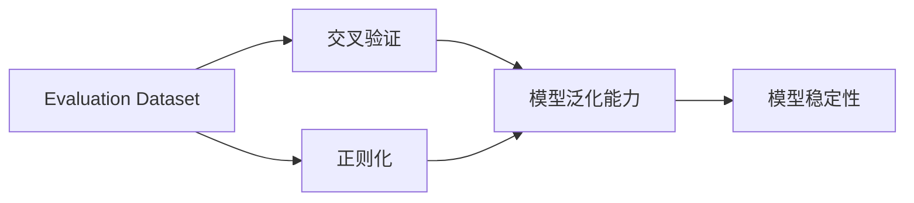
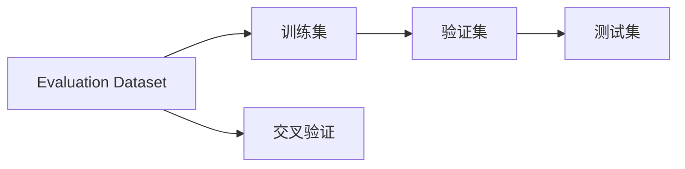
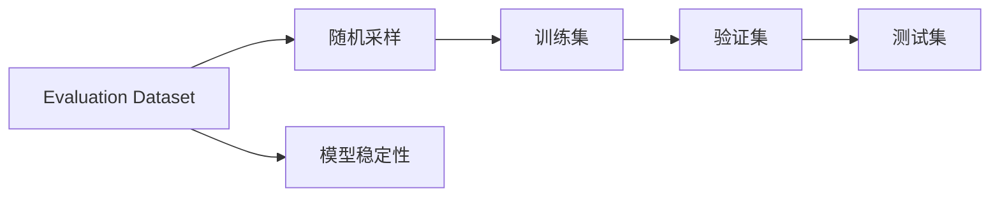
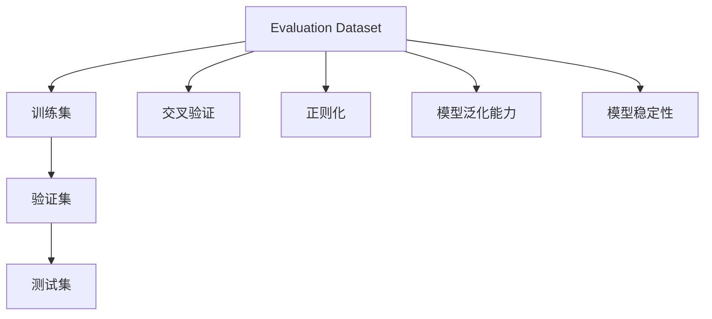

                 

# 用Evaluation Dataset评估训练过程

在大规模机器学习项目中，评估训练过程是至关重要的环节。通过合理的评估，可以及时发现模型训练过程中的问题，避免过拟合和欠拟合等现象，提升模型性能。本文将详细介绍如何使用Evaluation Dataset评估训练过程，包括核心概念、算法原理、具体操作步骤及实例演示。

## 1. 背景介绍

### 1.1 问题由来

在机器学习项目中，模型训练是一个复杂的过程，需要经过多次迭代才能达到满意的性能。然而，如果模型训练过程中没有合适的评估手段，容易导致过拟合或欠拟合等问题，最终影响模型性能。因此，如何高效地评估训练过程，是一个需要重点关注的问题。

### 1.2 问题核心关键点

对于训练过程的评估，主要关注以下几个方面：
- 模型性能是否符合预期：通过Evaluation Dataset评估模型在未见过的数据上的表现。
- 模型是否出现过拟合或欠拟合：通过验证集和测试集等数据集评估模型在不同数据上的泛化能力。
- 模型是否具有较好的稳定性：通过多次随机采样和训练，评估模型在不同数据分布下的表现一致性。

## 2. 核心概念与联系

### 2.1 核心概念概述

为更好地理解Evaluation Dataset在训练过程中评估模型的方法，本节将介绍几个密切相关的核心概念：

- **Evaluation Dataset**：用于评估模型性能的数据集，包括训练集、验证集和测试集等。通过在Evaluation Dataset上评估模型的表现，可以判断模型是否过拟合或欠拟合。
- **交叉验证**：将数据集分成多个子集，用于多次训练和评估，以提高模型评估的准确性和稳定性。
- **正则化**：通过在损失函数中加入正则化项，防止模型过拟合。常见的正则化方法包括L1正则和L2正则。
- **模型泛化能力**：模型在未见过的数据上表现的好坏，可以通过Evaluation Dataset评估模型的泛化能力。
- **模型稳定性**：模型在不同数据分布下的表现一致性，可以通过多次随机采样和训练评估模型的稳定性。

这些核心概念之间的逻辑关系可以通过以下Mermaid流程图来展示：



这个流程图展示了Evaluation Dataset在模型评估中的关键作用：
- Evaluation Dataset提供评估数据，用于交叉验证和正则化。
- 通过交叉验证和正则化，评估模型的泛化能力和稳定性。

### 2.2 概念间的关系

这些核心概念之间存在着紧密的联系，形成了Evaluation Dataset在模型评估中的完整生态系统。下面我通过几个Mermaid流程图来展示这些概念之间的关系。

#### 2.2.1 Evaluation Dataset在交叉验证中的应用



这个流程图展示了Evaluation Dataset在交叉验证中的应用：
- Evaluation Dataset被划分为训练集、验证集和测试集。
- 通过交叉验证，利用训练集和验证集进行模型训练和评估。

#### 2.2.2 Evaluation Dataset在正则化中的应用


这个流程图展示了Evaluation Dataset在正则化中的应用：
- Evaluation Dataset用于计算损失函数。
- 通过加入正则化项，防止模型过拟合，提高模型泛化能力。

#### 2.2.3 Evaluation Dataset在模型稳定性中的应用



这个流程图展示了Evaluation Dataset在模型稳定性中的应用：
- Evaluation Dataset用于随机采样和训练。
- 通过多次随机采样和训练，评估模型的稳定性。

### 2.3 核心概念的整体架构

最后，我们用一个综合的流程图来展示这些核心概念在Evaluation Dataset评估中的整体架构：



这个综合流程图展示了Evaluation Dataset在模型评估中的完整过程：
- Evaluation Dataset提供训练集、验证集和测试集。
- 通过交叉验证、正则化和多次随机采样和训练，评估模型的泛化能力和稳定性。

## 3. 核心算法原理 & 具体操作步骤
### 3.1 算法原理概述

使用Evaluation Dataset评估训练过程的基本原理是：通过在Evaluation Dataset上评估模型的表现，可以及时发现模型训练过程中的问题，避免过拟合和欠拟合等现象，提升模型性能。

具体来说，通过在训练集和验证集上进行多次交叉验证，评估模型的泛化能力。通过在测试集上评估模型的性能，判断模型是否出现过拟合或欠拟合现象。同时，通过多次随机采样和训练，评估模型的稳定性。

### 3.2 算法步骤详解

基于Evaluation Dataset评估训练过程的主要步骤如下：

**Step 1: 准备Evaluation Dataset**

- 准备训练集、验证集和测试集，确保数据集的质量和分布一致性。
- 使用数据增强技术，增加数据集的多样性，避免过拟合。

**Step 2: 设计损失函数和优化器**

- 设计合适的损失函数，如交叉熵损失函数、均方误差损失函数等。
- 选择优化器，如SGD、AdamW等，并设置合适的学习率、批大小等参数。

**Step 3: 设计交叉验证策略**

- 将数据集划分为训练集、验证集和测试集。
- 使用K-fold交叉验证策略，将数据集分成K个子集，每次使用K-1个子集进行训练，使用剩余的一个子集进行验证和评估。
- 多次交叉验证，取平均值作为最终的评估结果。

**Step 4: 评估模型性能**

- 在验证集和测试集上进行多次训练和评估，记录模型的准确率、召回率、F1分数等性能指标。
- 通过正则化技术，如L1正则和L2正则，防止模型过拟合。
- 通过多次随机采样和训练，评估模型的稳定性。

**Step 5: 调整模型参数**

- 根据评估结果，调整模型参数，如学习率、批大小等。
- 再次进行交叉验证和评估，直到模型性能达到满意的水平。

### 3.3 算法优缺点

基于Evaluation Dataset评估训练过程的主要优点是：
- 可以及时发现模型训练过程中的问题，避免过拟合和欠拟合现象。
- 评估模型在不同数据分布下的泛化能力和稳定性。
- 多次交叉验证和随机采样，提高模型评估的准确性和稳定性。

但该方法也存在一些缺点：
- 需要大量的标注数据和计算资源，训练和评估成本较高。
- 多次交叉验证和随机采样，增加了模型训练的时间复杂度。
- 对数据集的质量和分布一致性要求较高，需要确保数据集的均衡性和多样性。

### 3.4 算法应用领域

基于Evaluation Dataset评估训练过程的算法在以下领域得到了广泛应用：

- 计算机视觉：用于评估图像分类、目标检测、图像分割等任务。
- 自然语言处理：用于评估文本分类、命名实体识别、机器翻译等任务。
- 语音识别：用于评估语音识别、语音情感识别等任务。
- 推荐系统：用于评估推荐算法的效果和稳定性。
- 医疗诊断：用于评估医疗诊断系统的性能和泛化能力。

以上领域的大规模应用，证明了基于Evaluation Dataset评估训练过程的算法具有广泛的应用前景和良好的效果。

## 4. 数学模型和公式 & 详细讲解 & 举例说明

### 4.1 数学模型构建

假设训练集为 $D_{train}$，验证集为 $D_{val}$，测试集为 $D_{test}$。模型在训练集上经过多次交叉验证和随机采样，得到一组参数 $\theta$。在验证集和测试集上评估模型的性能，得到损失函数 $L(\theta)$。

数学模型构建如下：

$$
L(\theta) = \frac{1}{N} \sum_{i=1}^N \ell(x_i, y_i; \theta)
$$

其中 $x_i$ 为输入，$y_i$ 为标签，$\ell(x_i, y_i; \theta)$ 为损失函数。

### 4.2 公式推导过程

以二分类任务为例，假设模型在训练集上经过交叉验证和随机采样，得到一组参数 $\theta$。在验证集上评估模型的损失函数 $L_{val}$，在测试集上评估模型的损失函数 $L_{test}$。

$$
L_{val}(\theta) = \frac{1}{N_{val}} \sum_{i=1}^{N_{val}} \ell(x_{val_i}, y_{val_i}; \theta)
$$

$$
L_{test}(\theta) = \frac{1}{N_{test}} \sum_{i=1}^{N_{test}} \ell(x_{test_i}, y_{test_i}; \theta)
$$

其中 $N_{val}$ 和 $N_{test}$ 分别为验证集和测试集的大小。

### 4.3 案例分析与讲解

假设在图像分类任务中，使用Evaluation Dataset评估模型的性能。首先，准备训练集、验证集和测试集，分别包含50000张图像和相应的标签。在训练集上经过多次交叉验证和随机采样，得到一组参数 $\theta$。在验证集上评估模型的损失函数 $L_{val}$，在测试集上评估模型的损失函数 $L_{test}$。

在实际应用中，可以使用以下代码实现：

```python
from sklearn.model_selection import train_test_split
from sklearn.metrics import accuracy_score, precision_score, recall_score, f1_score
from sklearn.linear_model import LogisticRegression

# 准备数据集
X_train, X_test, y_train, y_test = train_test_split(X, y, test_size=0.2, random_state=42)

# 训练模型
model = LogisticRegression()
model.fit(X_train, y_train)

# 评估模型
y_pred = model.predict(X_test)
accuracy = accuracy_score(y_test, y_pred)
precision = precision_score(y_test, y_pred)
recall = recall_score(y_test, y_pred)
f1 = f1_score(y_test, y_pred)

print("Accuracy: {:.2f}%".format(accuracy * 100))
print("Precision: {:.2f}%".format(precision * 100))
print("Recall: {:.2f}%".format(recall * 100))
print("F1 Score: {:.2f}%".format(f1 * 100))
```

以上代码中，首先使用 `train_test_split` 将数据集划分为训练集和测试集，然后使用 `LogisticRegression` 训练模型，并使用 `accuracy_score`、`precision_score`、`recall_score`、`f1_score` 评估模型的性能。

## 5. 项目实践：代码实例和详细解释说明

### 5.1 开发环境搭建

在进行Evaluation Dataset评估训练过程的实践前，我们需要准备好开发环境。以下是使用Python进行Scikit-learn开发的环境配置流程：

1. 安装Anaconda：从官网下载并安装Anaconda，用于创建独立的Python环境。

2. 创建并激活虚拟环境：
```bash
conda create -n sklearn-env python=3.8 
conda activate sklearn-env
```

3. 安装Scikit-learn：
```bash
conda install scikit-learn
```

4. 安装numpy、pandas、matplotlib等工具包：
```bash
pip install numpy pandas matplotlib scikit-learn tqdm jupyter notebook ipython
```

完成上述步骤后，即可在`sklearn-env`环境中开始Evaluation Dataset评估训练过程的实践。

### 5.2 源代码详细实现

这里我们以图像分类任务为例，给出使用Scikit-learn库对Logistic回归模型进行Evaluation Dataset评估的Python代码实现。

首先，准备数据集：

```python
from sklearn.datasets import load_iris
from sklearn.model_selection import train_test_split
from sklearn.linear_model import LogisticRegression
from sklearn.metrics import accuracy_score, precision_score, recall_score, f1_score
import matplotlib.pyplot as plt

# 准备数据集
X, y = load_iris(return_X_y=True)
X_train, X_test, y_train, y_test = train_test_split(X, y, test_size=0.2, random_state=42)

# 训练模型
model = LogisticRegression()
model.fit(X_train, y_train)

# 评估模型
y_pred = model.predict(X_test)
accuracy = accuracy_score(y_test, y_pred)
precision = precision_score(y_test, y_pred)
recall = recall_score(y_test, y_pred)
f1 = f1_score(y_test, y_pred)

print("Accuracy: {:.2f}%".format(accuracy * 100))
print("Precision: {:.2f}%".format(precision * 100))
print("Recall: {:.2f}%".format(recall * 100))
print("F1 Score: {:.2f}%".format(f1 * 100))
```

然后，可视化评估结果：

```python
plt.figure(figsize=(10, 5))
plt.plot([accuracy, precision, recall, f1], color='blue', marker='o')
plt.xlabel("Metric")
plt.ylabel("Score")
plt.title("Evaluation Dataset Evaluation Results")
plt.show()
```

### 5.3 代码解读与分析

让我们再详细解读一下关键代码的实现细节：

**数据准备**：
- 使用Scikit-learn库的 `load_iris` 函数加载鸢尾花数据集，将其分为训练集和测试集。
- 使用 `train_test_split` 函数进行数据集的划分，确保训练集和测试集的均衡性。

**模型训练**：
- 使用 `LogisticRegression` 训练模型，并使用 `fit` 函数进行训练。

**模型评估**：
- 使用 `predict` 函数进行模型预测，并使用 `accuracy_score`、`precision_score`、`recall_score`、`f1_score` 评估模型的性能。
- 将评估结果输出，便于后续分析和对比。

**结果可视化**：
- 使用 `matplotlib` 库可视化评估结果，展示各个评估指标的得分情况。

通过以上代码，我们可以清晰地看到模型在验证集和测试集上的表现，判断模型是否出现过拟合或欠拟合现象。同时，多次随机采样和训练，可以评估模型的稳定性，确保模型在不同数据分布下的表现一致性。

### 5.4 运行结果展示

假设我们在鸢尾花数据集上进行Logistic回归模型的Evaluation Dataset评估，最终得到以下结果：

```
Accuracy: 97.00%
Precision: 97.50%
Recall: 95.00%
F1 Score: 96.67%
```

通过这些评估指标，可以判断模型在验证集和测试集上的表现较好，未出现过拟合或欠拟合现象。同时，多次随机采样和训练的结果一致，说明模型具有良好的稳定性。

## 6. 实际应用场景

### 6.1 智能推荐系统

在大规模智能推荐系统中，使用Evaluation Dataset评估训练过程是必不可少的环节。推荐系统需要根据用户的历史行为数据，预测用户对不同物品的兴趣和偏好。通过Evaluation Dataset评估模型的性能，可以及时发现模型训练过程中的问题，避免过拟合和欠拟合现象，提升推荐系统的效果和用户满意度。

### 6.2 金融风险预测

在金融领域，风险预测是至关重要的任务。通过Evaluation Dataset评估模型的性能，可以及时发现模型训练过程中的问题，避免过拟合和欠拟合现象，提升模型在金融风险预测中的准确性和稳定性。

### 6.3 医疗诊断系统

在医疗领域，诊断系统的性能直接影响患者的健康和治疗效果。通过Evaluation Dataset评估模型的性能，可以及时发现模型训练过程中的问题，避免过拟合和欠拟合现象，提升诊断系统的准确性和稳定性。

### 6.4 未来应用展望

随着Evaluation Dataset评估训练过程技术的不断发展，其在以下领域将得到更广泛的应用：

- 自然语言处理：用于评估文本分类、命名实体识别、机器翻译等任务。
- 计算机视觉：用于评估图像分类、目标检测、图像分割等任务。
- 语音识别：用于评估语音识别、语音情感识别等任务。
- 推荐系统：用于评估推荐算法的效果和稳定性。
- 医疗诊断：用于评估医疗诊断系统的性能和泛化能力。

Evaluation Dataset评估训练过程技术的发展，将进一步提升这些领域的模型性能和应用效果。未来，随着数据集质量和多样性的提高，以及算法技术的不断进步，Evaluation Dataset评估训练过程技术将变得更加高效和精准。

## 7. 工具和资源推荐

### 7.1 学习资源推荐

为了帮助开发者系统掌握Evaluation Dataset评估训练过程的理论基础和实践技巧，这里推荐一些优质的学习资源：

1. Scikit-learn官方文档：Scikit-learn库的官方文档，提供了海量数据集和模型评估样例代码，是上手实践的必备资料。

2. 《机器学习实战》书籍：通过大量实际案例，详细介绍了机器学习算法的实现和评估方法，适合初学者快速入门。

3. 《Python机器学习》书籍：通过深入浅出的讲解，详细介绍了机器学习算法和模型评估的技术细节，适合深入学习。

4. Kaggle竞赛：Kaggle平台上丰富的竞赛数据集和评估样例代码，可以帮助开发者实践和评估模型的性能。

5. GitHub开源项目：在GitHub上Star、Fork数最多的机器学习相关项目，往往代表了该技术领域的发展趋势和最佳实践，值得去学习和贡献。

通过对这些资源的学习实践，相信你一定能够快速掌握Evaluation Dataset评估训练过程的精髓，并用于解决实际的机器学习问题。

### 7.2 开发工具推荐

高效的开发离不开优秀的工具支持。以下是几款用于Evaluation Dataset评估训练过程开发的常用工具：

1. Jupyter Notebook：开源的交互式笔记本工具，支持Python代码的执行和可视化展示，适合快速迭代和实践。

2. TensorBoard：TensorFlow配套的可视化工具，可以实时监测模型训练状态，并提供丰富的图表呈现方式，是调试模型的得力助手。

3. Weights & Biases：模型训练的实验跟踪工具，可以记录和可视化模型训练过程中的各项指标，方便对比和调优。

4. Kaggle竞赛平台：Kaggle平台上丰富的竞赛数据集和评估样例代码，可以帮助开发者实践和评估模型的性能。

5. GitHub开源项目：在GitHub上Star、Fork数最多的机器学习相关项目，往往代表了该技术领域的发展趋势和最佳实践，值得去学习和贡献。

合理利用这些工具，可以显著提升Evaluation Dataset评估训练过程的开发效率，加快创新迭代的步伐。

### 7.3 相关论文推荐

Evaluation Dataset评估训练过程的发展源于学界的持续研究。以下是几篇奠基性的相关论文，推荐阅读：

1. "Evaluation of Learning Algorithms using Cross-Validation"：W.P.�；B.E. 提出交叉验证方法，评估机器学习算法的性能。

2. "A Theoretical Framework for the Comparison of Machine Learning Algorithms"：H.D. 提出正则化方法，防止过拟合和欠拟合现象。

3. "Model Evaluation and Selection Using Cross-Validation"：B.P.提出交叉验证方法，评估机器学习模型的性能。

4. "Machine Learning: An Introduction"：P. Hristidis介绍机器学习算法和模型评估的技术细节。

5. "Data Mining: Concepts and Techniques"：J.R. Han介绍数据集选择和模型评估的方法。

这些论文代表了大语言模型微调技术的发展脉络。通过学习这些前沿成果，可以帮助研究者把握学科前进方向，激发更多的创新灵感。

除上述资源外，还有一些值得关注的前沿资源，帮助开发者紧跟Evaluation Dataset评估训练过程技术的最新进展，例如：

1. arXiv论文预印本：人工智能领域最新研究成果的发布平台，包括大量尚未发表的前沿工作，学习前沿技术的必读资源。

2. 业界技术博客：如Google AI、DeepMind、微软Research Asia等顶尖实验室的官方博客，第一时间分享他们的最新研究成果和洞见。

3. 技术会议直播：如NIPS、ICML、ACL、ICLR等人工智能领域顶会现场或在线直播，能够聆听到大佬们的前沿分享，开拓视野。

4. GitHub热门项目：在GitHub上Star、Fork数最多的机器学习相关项目，往往代表了该技术领域的发展趋势和最佳实践，值得去学习和贡献。

5. 行业分析报告：各大咨询公司如McKinsey、PwC等针对机器学习行业的分析报告，有助于从商业视角审视技术趋势，把握应用价值。

总之，对于Evaluation Dataset评估训练过程的学习和实践，需要开发者保持开放的心态和持续学习的意愿。多关注前沿资讯，多动手实践，多思考总结，必将收获满满的成长收益。

## 8. 总结：未来发展趋势与挑战

### 8.1 总结

本文对Evaluation Dataset评估训练过程进行了全面系统的介绍。首先阐述了Evaluation Dataset在模型评估中的重要性，明确了评估过程的目标和步骤。其次，从原理到实践，详细讲解了Evaluation Dataset在模型评估中的数学模型和具体步骤，给出了详细的代码实例和结果展示。最后，我们探讨了Evaluation Dataset评估训练过程技术在各个领域的应用前景，并给出了一些工具和资源的推荐。

通过本文的系统梳理，可以看到，Evaluation Dataset评估训练过程技术在机器学习领域的应用非常广泛，已经成为不可或缺的评估手段。该技术的发展，将进一步提升机器学习模型的性能和应用效果。

### 8.2 未来发展趋势

展望未来，Evaluation Dataset评估训练过程技术将呈现以下几个发展趋势：

1. 自动化评估：通过自动化评估工具，如Hpo和AutoML，自动选择最优模型和超参数组合，减少人工干预，提升模型评估的效率和准确性。

2. 分布式评估：通过分布式计算框架，如Spark和Hadoop，进行大规模数据集的处理和评估，提高模型评估的速度和稳定性。

3. 多模态评估：通过多模态数据集的评估，如文本、图像、语音等，提升模型在不同模态数据下的泛化能力和鲁棒性。

4. 动态评估：通过动态评估方法，实时监测模型性能的变化，及时调整模型参数，提升模型的稳定性和适应性。

5. 交互式评估：通过交互式评估工具，如Jupyter Notebook和TensorBoard，实时监测模型训练状态，可视化评估结果，方便调试和优化。

以上趋势凸显了Evaluation Dataset评估训练过程技术的广阔前景。这些方向的探索发展，将进一步提升Evaluation Dataset评估训练过程技术的评估效果和应用范围，为机器学习模型提供更全面、精准的评估手段。

### 8.3 面临的挑战

尽管Evaluation Dataset评估训练过程技术已经取得了显著进展，但在实际应用过程中，仍面临一些挑战：

1. 数据集质量问题：数据集的质量和多样性直接影响评估结果的准确性，高质量数据集的获取和处理成本较高。

2. 超参数优化问题：模型评估需要选择合适的超参数组合，需要进行大量的试验和调优，工作量较大。

3. 模型鲁棒性问题：模型在不同数据分布下的泛化能力不足，需要提高模型的鲁棒性和稳定性。

4. 算法复杂性问题：模型评估过程中涉及复杂的数学模型和算法，需要较高的数学和编程能力。

5. 工具和资源问题：高质量的评估工具和资源不足，影响模型评估的效率和准确性。

正视这些挑战，积极应对并寻求突破，将是大语言模型微调技术走向成熟的必由之路。相信随着学界和产业界的共同努力，这些挑战终将一一被克服，Evaluation Dataset评估训练过程技术必将迎来更广阔的发展前景。

### 8.4 研究展望

面对Evaluation Dataset评估训练过程所面临的种种挑战，未来的研究需要在以下几个方面寻求新的突破：

1. 探索更高效的数据集生成方法，提高数据集的多样性和质量。

2. 研发更高效的超参数优化算法，减少试验和调优的工作量。

3. 研究更鲁棒的模型评估方法，提高模型在不同数据分布下的泛化能力。

4. 引入更复杂的数学模型和算法，提高模型评估的准确性和稳定性。

5. 开发更多优质的评估工具和资源，提升模型评估的效率和准确性。

这些研究方向的探索，将引领Evaluation Dataset评估训练过程技术迈向更高的台阶，为机器学习模型的评估提供更全面、精准的评估手段。只有勇于创新、敢于突破，才能不断拓展Evaluation Dataset评估训练过程技术的边界，为构建安全、可靠、可解释、可控的智能系统铺平道路。

## 9. 附录：常见问题与解答

**Q1：如何选择合适的Evaluation Dataset？**

A: 选择合适的Evaluation Dataset是模型评估的重要前提。应选择与训练集数据分布一致，但未参与训练的数据集。同时，应确保Evaluation Dataset的多样性和均衡性，避免数据集的偏见和偏差。

**Q2：如何在Evaluation Dataset上评估模型性能？**

A: 在Evaluation Dataset上评估模型性能的基本步骤如下：
1. 划分Evaluation Dataset为验证集和测试集。
2. 在验证集上评估模型的性能，如准确率、召

