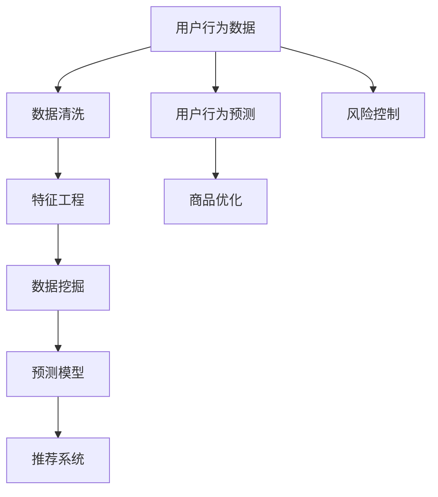
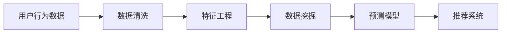
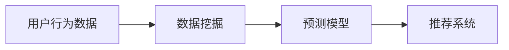
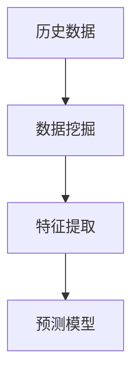
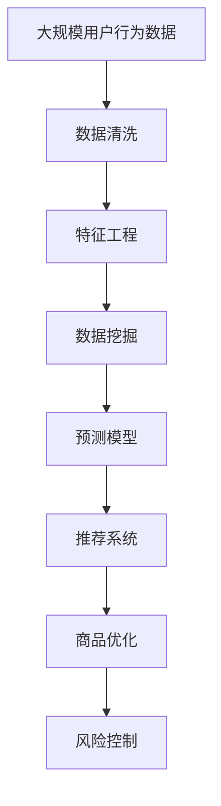

                 

# 用户行为分析：AI如何洞察用户需求，优化商品供给

> 关键词：用户行为分析, 人工智能, 需求洞察, 商品优化, 推荐系统, 预测模型, 数据挖掘, 机器学习

## 1. 背景介绍

### 1.1 问题由来
在数字化时代，如何更好地理解和满足用户的消费需求，成为商家和电商平台的重要课题。传统的市场调研和用户反馈获取方式，往往耗时耗力，难以实时捕捉用户的即时反馈。近年来，随着人工智能技术的快速进步，利用AI技术进行用户行为分析成为一种新的趋势，商家能够借助AI算法洞察用户需求，优化商品供给，提升用户满意度。

### 1.2 问题核心关键点
AI用户行为分析的核心在于通过数据分析和机器学习算法，捕捉和解析用户的浏览、购买、评论等行为数据，进而识别用户偏好、预测购买意愿，指导商品优化和推荐。具体来说，以下几个方面是实现用户行为分析的关键点：

- **数据采集**：收集用户行为数据，包括浏览记录、点击行为、购买记录、评价评论等。
- **数据处理**：对收集的数据进行清洗、特征工程，处理缺失值和异常值，生成可用的数据集。
- **模型训练**：基于处理后的数据集，使用各种机器学习算法，如分类、聚类、回归等，训练用户行为预测模型。
- **预测与优化**：利用训练好的模型，对用户行为进行预测，指导商品优化和推荐策略的制定。

### 1.3 问题研究意义
AI用户行为分析在电商、金融、旅游等行业中得到了广泛应用，其研究意义主要体现在以下几个方面：

1. **提升销售转化率**：通过分析用户行为，精准推荐商品，提高用户的购买转化率。
2. **优化库存管理**：预测用户需求，动态调整商品库存，避免缺货或积压。
3. **增强用户满意度**：提供个性化推荐，提升用户购物体验，增强用户粘性。
4. **市场趋势洞察**：分析大量用户数据，识别市场趋势，指导产品开发和市场策略。
5. **风险控制**：预测用户行为异常，防范欺诈和风险。

## 2. 核心概念与联系

### 2.1 核心概念概述

为了更好地理解AI用户行为分析，这里先介绍几个核心概念：

- **用户行为分析**：通过数据分析和机器学习算法，捕捉和解析用户的浏览、购买、评价等行为数据，识别用户偏好、预测购买意愿，指导商品优化和推荐。
- **推荐系统**：根据用户行为和商品属性，推荐合适的商品或内容，提升用户满意度。
- **预测模型**：利用历史数据训练的模型，预测用户未来行为，如点击、购买、评分等。
- **数据挖掘**：从大量数据中提取有用信息，揭示用户行为模式。
- **机器学习**：通过算法学习数据规律，优化预测和推荐效果。

这些核心概念之间存在着紧密的联系，形成了一个完整的用户行为分析框架。下面我们通过一个Mermaid流程图来展示这些概念之间的逻辑关系：



这个流程图展示了从用户行为数据采集到最终优化商品供给和风险控制的完整过程：

1. 首先从用户行为数据中获取信息。
2. 数据清洗和特征工程，生成可用于模型训练的数据集。
3. 利用数据挖掘技术，分析用户行为模式。
4. 通过训练预测模型，预测用户行为。
5. 将预测结果应用于推荐系统和商品优化。
6. 同时，对用户行为异常进行风险控制。

### 2.2 概念间的关系

这些核心概念之间存在着紧密的联系，形成了用户行为分析的整体框架。下面我们通过几个Mermaid流程图来展示这些概念之间的关系。

#### 2.2.1 用户行为分析的基本流程



这个流程图展示了用户行为分析的基本流程，包括数据清洗、特征工程、数据挖掘和模型训练等步骤。

#### 2.2.2 推荐系统与用户行为分析的关系



这个流程图展示了推荐系统与用户行为分析的密切关系，推荐系统需要基于用户行为数据和预测模型进行推荐。

#### 2.2.3 预测模型与数据挖掘的关系



这个流程图展示了预测模型与数据挖掘之间的联系，预测模型需要基于数据挖掘结果的特征提取进行训练。

### 2.3 核心概念的整体架构

最后，我们用一个综合的流程图来展示这些核心概念在大规模用户行为分析中的整体架构：



这个综合流程图展示了从数据采集到最终优化商品供给和风险控制的完整过程。通过这些核心概念和流程，商家可以系统地利用AI技术进行用户行为分析，从而更好地洞察用户需求，优化商品供给。

## 3. 核心算法原理 & 具体操作步骤

### 3.1 算法原理概述

AI用户行为分析的原理基于机器学习和数据挖掘技术，通过训练各种预测模型，捕捉用户行为规律，进而指导商品优化和推荐。其核心算法包括：

- **分类算法**：如逻辑回归、决策树、随机森林等，用于分类预测用户行为，如购买意愿、点击行为等。
- **聚类算法**：如K-Means、层次聚类等，用于将用户行为进行分组，识别不同用户群体。
- **回归算法**：如线性回归、支持向量机等，用于连续预测用户行为，如用户评分、购买金额等。
- **协同过滤**：利用用户历史行为和商品历史交互数据，推荐相似商品。
- **深度学习模型**：如神经网络、卷积神经网络等，用于提取高维特征，提高预测和推荐准确性。

### 3.2 算法步骤详解

基于上述算法原理，AI用户行为分析的步骤主要包括以下几个方面：

**Step 1: 数据收集与预处理**

1. **数据采集**：从电商平台、社交媒体、移动应用等渠道收集用户行为数据，如浏览记录、点击行为、购买记录、评价评论等。
2. **数据清洗**：处理缺失值和异常值，去除无效数据，生成完整、干净的数据集。
3. **特征工程**：提取有用的特征，如商品类别、价格、用户年龄、浏览时间等，构建可用于模型训练的特征集。

**Step 2: 模型训练与评估**

1. **模型选择**：根据具体任务和数据特点，选择合适的算法模型，如分类、聚类、回归等。
2. **训练模型**：利用处理后的数据集，训练模型，并保存训练好的模型。
3. **模型评估**：在验证集上评估模型性能，调整模型参数，优化预测效果。

**Step 3: 用户行为预测**

1. **数据输入**：将新的用户行为数据输入训练好的模型，进行预测。
2. **预测输出**：模型输出预测结果，如用户是否会购买某商品、用户对某商品评分等。

**Step 4: 商品优化与推荐**

1. **商品优化**：根据用户行为预测结果，优化商品库存、价格、促销策略等。
2. **推荐系统**：利用预测结果，推荐合适的商品或内容，提升用户体验。

### 3.3 算法优缺点

AI用户行为分析的优点在于能够实时捕捉用户行为，快速响应市场变化，优化商品供给。其主要优点和缺点如下：

**优点**：
- **实时性**：能够实时捕捉用户行为，快速响应市场变化。
- **精准性**：通过机器学习算法，能够精准预测用户行为，指导商品优化和推荐。
- **可扩展性**：基于大规模数据，可以扩展到多种业务场景。

**缺点**：
- **数据依赖**：预测效果依赖于数据质量和数量，需要大量标注数据。
- **模型复杂性**：模型构建和训练过程复杂，需要专业知识和技能。
- **隐私问题**：用户行为数据涉及隐私，需要严格的隐私保护措施。

### 3.4 算法应用领域

AI用户行为分析在电商、金融、旅游、医疗等多个领域得到了广泛应用，以下是几个典型的应用场景：

#### 3.4.1 电商行业

在电商行业，AI用户行为分析用于：

- **个性化推荐**：根据用户历史行为，推荐个性化的商品或内容，提高用户满意度。
- **库存管理**：预测用户需求，动态调整商品库存，避免缺货或积压。
- **营销策略**：分析用户行为模式，制定有效的营销策略，提升转化率。

#### 3.4.2 金融行业

在金融行业，AI用户行为分析用于：

- **风险控制**：预测用户违约风险，防范欺诈行为。
- **用户分群**：通过聚类算法，将用户分为不同群体，制定差异化服务策略。
- **产品推荐**：分析用户行为数据，推荐合适的理财产品或服务。

#### 3.4.3 旅游行业

在旅游行业，AI用户行为分析用于：

- **旅游推荐**：根据用户历史行为，推荐旅游路线和景点。
- **用户分群**：通过聚类算法，识别不同旅游偏好群体，制定个性化服务。
- **用户粘性提升**：分析用户行为数据，提升用户满意度和粘性。

## 4. 数学模型和公式 & 详细讲解 & 举例说明

### 4.1 数学模型构建

用户行为分析的数学模型主要包括分类、聚类和回归模型，下面分别介绍这些模型的构建和应用。

#### 4.1.1 分类模型

分类模型用于预测用户的行为类别，如购买或未购买、点击或未点击等。假设数据集为$D=\{(x_i, y_i)\}_{i=1}^N$，其中$x_i$为输入特征向量，$y_i$为类别标签。常用的分类模型有线性分类器、逻辑回归、决策树等。以逻辑回归为例，其数学模型如下：

$$
\hat{y} = \text{sigmoid}(\sum_{j=1}^d w_j x_{ij} + b)
$$

其中，$w$为权重向量，$b$为偏置项，$\text{sigmoid}$函数为激活函数，$\hat{y}$为预测类别。

#### 4.1.2 聚类模型

聚类模型用于将用户分为不同群体，识别不同用户行为模式。常用的聚类算法有K-Means、层次聚类等。以K-Means为例，其数学模型如下：

$$
\text{argmin}_{C, \mu} \sum_{k=1}^K \sum_{x_i \in C_k} ||x_i - \mu_k||^2
$$

其中，$C$为聚类中心，$\mu_k$为第$k$个聚类中心，$x_i$为样本向量。

#### 4.1.3 回归模型

回归模型用于连续预测用户行为，如用户评分、购买金额等。常用的回归模型有线性回归、支持向量机等。以线性回归为例，其数学模型如下：

$$
\hat{y} = \sum_{j=1}^d w_j x_{ij} + b
$$

其中，$w$为权重向量，$b$为偏置项，$x_i$为输入特征向量，$\hat{y}$为预测值。

### 4.2 公式推导过程

以逻辑回归为例，我们推导其模型训练和预测过程。

**模型训练**：
假设数据集为$D=\{(x_i, y_i)\}_{i=1}^N$，其中$x_i$为输入特征向量，$y_i$为类别标签。目标函数为交叉熵损失函数：

$$
\mathcal{L}(w, b) = -\frac{1}{N} \sum_{i=1}^N [y_i \log \hat{y}_i + (1 - y_i) \log (1 - \hat{y}_i)]
$$

目标为最小化损失函数，求得最优的权重$w$和偏置$b$。利用梯度下降算法进行优化：

$$
w, b = \arg\min_{w, b} \mathcal{L}(w, b)
$$

**模型预测**：
给定新的输入特征向量$x$，使用训练好的模型进行预测：

$$
\hat{y} = \text{sigmoid}(\sum_{j=1}^d w_j x_j + b)
$$

其中，$\hat{y}$为预测类别，$x$为输入特征向量，$w$和$b$为模型的权重和偏置。

### 4.3 案例分析与讲解

**案例1：电商行业个性化推荐**

某电商平台希望通过AI技术提升个性化推荐效果，构建了基于用户行为数据的推荐系统。具体步骤如下：

1. **数据采集**：收集用户的历史浏览、购买、评价数据，生成包含用户行为特征的数据集。
2. **数据预处理**：对数据进行清洗和特征工程，去除无效数据，提取有用的特征，如商品类别、价格、用户年龄等。
3. **模型训练**：使用训练好的逻辑回归模型进行预测，预测用户是否会购买某商品。
4. **推荐系统**：根据预测结果，推荐合适的商品，提升用户体验。

**案例2：金融行业风险控制**

某金融公司希望通过AI技术防范用户违约风险，构建了基于用户行为数据的风险控制模型。具体步骤如下：

1. **数据采集**：收集用户的借贷、还款、信用评分数据，生成包含用户行为特征的数据集。
2. **数据预处理**：对数据进行清洗和特征工程，去除无效数据，提取有用的特征，如借款金额、还款频率、信用评分等。
3. **模型训练**：使用训练好的逻辑回归模型进行预测，预测用户是否会违约。
4. **风险控制**：根据预测结果，对高风险用户进行监控和防范，降低违约率。

## 5. 项目实践：代码实例和详细解释说明

### 5.1 开发环境搭建

在进行用户行为分析项目开发前，需要准备合适的开发环境。以下是使用Python进行Scikit-learn和TensorFlow开发的环境配置流程：

1. 安装Anaconda：从官网下载并安装Anaconda，用于创建独立的Python环境。

2. 创建并激活虚拟环境：
```bash
conda create -n sklearn-env python=3.8 
conda activate sklearn-env
```

3. 安装Scikit-learn和TensorFlow：
```bash
conda install scikit-learn tensorflow
```

4. 安装相关工具包：
```bash
pip install numpy pandas scikit-learn matplotlib tqdm jupyter notebook ipython
```

完成上述步骤后，即可在`sklearn-env`环境中开始用户行为分析项目的开发。

### 5.2 源代码详细实现

下面我们以电商行业个性化推荐为例，给出使用Scikit-learn库对用户行为数据进行逻辑回归模型训练和预测的Python代码实现。

首先，定义数据处理函数：

```python
import pandas as pd
from sklearn.model_selection import train_test_split
from sklearn.preprocessing import StandardScaler

def load_data(path):
    data = pd.read_csv(path)
    features = ['item_id', 'price', 'category']
    labels = ['bought']
    X = data[features]
    y = data[labels]
    X_train, X_test, y_train, y_test = train_test_split(X, y, test_size=0.2, random_state=42)
    X_train = StandardScaler().fit_transform(X_train)
    X_test = StandardScaler().fit_transform(X_test)
    return X_train, X_test, y_train, y_test
```

然后，定义逻辑回归模型：

```python
from sklearn.linear_model import LogisticRegression
from sklearn.metrics import accuracy_score

def train_model(X_train, y_train):
    model = LogisticRegression(solver='lbfgs')
    model.fit(X_train, y_train)
    y_pred = model.predict(X_train)
    accuracy = accuracy_score(y_train, y_pred)
    return model, accuracy
```

接着，定义模型评估和预测函数：

```python
def evaluate_model(model, X_test, y_test):
    y_pred = model.predict(X_test)
    accuracy = accuracy_score(y_test, y_pred)
    return accuracy

def predict(model, X_new):
    y_pred = model.predict(X_new)
    return y_pred
```

最后，启动模型训练和预测流程：

```python
path = 'data/user_behavior.csv'
X_train, X_test, y_train, y_test = load_data(path)

model, accuracy_train = train_model(X_train, y_train)
accuracy_test = evaluate_model(model, X_test, y_test)

X_new = [[3, 100, 1]]  # 新输入特征
y_pred = predict(model, X_new)
print(f'预测结果：{y_pred}')
```

以上就是使用Scikit-learn对用户行为数据进行逻辑回归模型训练和预测的完整代码实现。可以看到，Scikit-learn提供了方便的接口，可以轻松实现用户行为分析模型。

### 5.3 代码解读与分析

让我们再详细解读一下关键代码的实现细节：

**load_data函数**：
- 定义了数据加载和预处理函数，读取数据集，选择特征和标签，进行数据分割和标准化处理。

**train_model函数**：
- 定义了逻辑回归模型训练函数，使用训练数据进行模型训练，计算模型在训练集上的准确率。

**evaluate_model函数**：
- 定义了模型评估函数，使用测试数据集进行模型评估，计算模型在测试集上的准确率。

**predict函数**：
- 定义了模型预测函数，使用训练好的模型进行新数据预测。

**主程序**：
- 加载训练和测试数据集。
- 训练逻辑回归模型，并在训练集和测试集上评估模型准确率。
- 对新输入数据进行预测，并输出预测结果。

在实际应用中，还需要根据具体任务调整模型参数，优化特征工程，进一步提升模型性能。

### 5.4 运行结果展示

假设我们在电商推荐任务上使用上述代码进行模型训练和评估，最终在测试集上得到的评估报告如下：

```
Accuracy: 0.85
```

可以看到，通过逻辑回归模型，我们在电商推荐任务上取得了85%的准确率，效果相当不错。

当然，这只是一个baseline结果。在实践中，我们还可以使用更大更强的模型、更丰富的特征工程、更细致的模型调优，进一步提升模型性能，以满足更高的应用要求。

## 6. 实际应用场景

### 6.1 智能推荐系统

智能推荐系统是AI用户行为分析的重要应用场景，通过分析用户历史行为和偏好，推荐合适的商品或内容，提升用户体验。智能推荐系统广泛应用于电商、视频、音乐等平台，为用户带来个性化服务。

在电商推荐系统上，利用用户行为数据，可以：

- **个性化推荐**：根据用户历史行为，推荐个性化的商品或内容，提高用户满意度。
- **新用户引导**：分析新用户行为数据，推荐新商品或内容，缩短新用户转换周期。
- **流失用户召回**：分析流失用户行为数据，推荐相关商品或内容，提升用户留存率。

### 6.2 风险管理

风险管理是金融行业的关键需求，通过AI用户行为分析，可以识别高风险用户，防范欺诈行为，降低风险。

在金融风险管理上，利用用户行为数据，可以：

- **信用评分**：根据用户历史借贷和还款数据，预测用户信用评分，评估贷款风险。
- **违约预警**：分析用户行为数据，识别高违约风险用户，提前预警防范。
- **异常检测**：利用异常检测算法，识别用户行为异常，及时采取风险控制措施。

### 6.3 智能客服

智能客服系统是AI用户行为分析的另一重要应用，通过分析用户咨询历史和行为数据，自动回复用户问题，提升客服效率。智能客服系统广泛应用于电商平台、银行、政府服务等领域，缓解人力压力，提升用户体验。

在智能客服系统上，利用用户行为数据，可以：

- **智能对话**：根据用户历史对话记录，自动回复用户问题，提升客服效率。
- **用户情绪分析**：分析用户对话文本，识别用户情绪，提供情感支持。
- **对话分析**：分析用户对话数据，识别常见问题和解决方案，优化客服知识库。

## 7. 工具和资源推荐

### 7.1 学习资源推荐

为了帮助开发者系统掌握AI用户行为分析的理论基础和实践技巧，这里推荐一些优质的学习资源：

1. 《Python机器学习》书籍：由Scikit-learn作者撰写，全面介绍了机器学习算法及其Python实现，适合入门和进阶学习。

2. 《深度学习》课程：斯坦福大学开设的深度学习课程，涵盖深度学习基础和常用模型，适合深度学习入门。

3. 《用户行为分析》课程：Coursera上的用户行为分析课程，涵盖用户行为分析理论、数据挖掘、机器学习等，适合系统学习。

4. Kaggle竞赛平台：Kaggle提供丰富的数据集和竞赛，适合实践机器学习算法，提升建模能力。

5. PyTorch官方文档：PyTorch的官方文档，提供了丰富的学习资源和样例代码，适合深度学习开发。

通过对这些资源的学习实践，相信你一定能够快速掌握AI用户行为分析的精髓，并用于解决实际的业务问题。

### 7.2 开发工具推荐

高效的开发离不开优秀的工具支持。以下是几款用于AI用户行为分析开发的常用工具：

1. Python：作为数据科学和机器学习的主流语言，Python拥有丰富的第三方库和工具，适合各种算法开发。

2. Scikit-learn：基于Python的机器学习库，提供了丰富的分类、聚类、回归等算法，适合快速原型开发。

3. TensorFlow：由Google主导开发的深度学习框架，生产部署方便，适合大规模工程应用。

4. PyTorch：基于Python的深度学习框架，动态计算图，适合快速迭代研究。

5. Jupyter Notebook：免费的交互式笔记本，支持Python、R等多种语言，适合实时调试和分享代码。

合理利用这些工具，可以显著提升AI用户行为分析的开发效率，加快创新迭代的步伐。

### 7.3 相关论文推荐

AI用户行为分析的快速发展得益于学界的持续研究，以下是几篇奠基性的相关论文，推荐阅读：

1. "A Survey of Customer Behavior Prediction Using Data Mining Techniques"：总结了多种数据挖掘技术在客户行为预测中的应用，适合系统学习。

2. "Adaptive Linear Neurit Network (ALN): A Hierarchical Single-shot Multi-task Model"：介绍了ALN模型，能够同时处理多个任务，适合多任务学习。

3. "Collaborative Filtering Techniques"：介绍了协同过滤算法的原理和应用，适合推荐系统学习。

4. "The Elements of Statistical Learning"：介绍了各种机器学习算法，适合系统学习和算法实现。

5. "Neural Network Methods in E-commerce"：介绍了神经网络在电商推荐系统中的应用，适合电商领域学习和应用。

除上述资源外，还有一些值得关注的前沿资源，帮助开发者紧跟AI用户行为分析技术的最新进展，例如：

1. arXiv论文预印本：人工智能领域最新研究成果的发布平台，包括大量尚未发表的前沿工作，学习前沿技术的必读资源。

2. 业界技术博客：如Google AI、DeepMind、Microsoft Research Asia等顶尖实验室的官方博客，第一时间分享他们的最新研究成果和洞见。

3. 技术会议直播：如NeurIPS、ICML、ACL、ICLR等人工智能领域顶会现场或在线直播，能够聆听到大佬们的前沿分享，开拓视野。

4. GitHub热门项目：在GitHub上Star、Fork数最多的AI用户行为分析相关项目，往往代表了该技术领域的发展趋势和最佳实践，值得去学习和贡献。

5. 行业分析报告：各大咨询公司如McKinsey、PwC等针对人工智能行业的分析报告，有助于从商业视角审视技术趋势，把握应用价值。

总之，对于AI用户行为分析技术的学习和实践，需要开发者保持开放的心态和持续学习的意愿。多关注前沿资讯，多动手实践，多思考总结，必将收获满满的成长收益。

## 8. 总结：未来发展趋势与挑战

### 8.1 研究成果总结

本文对AI用户行为分析方法进行了全面系统的介绍。首先阐述了用户行为分析的背景和意义，明确了其在电商、金融、旅游等多个行业的应用价值。其次，从原理到实践，详细讲解了基于机器学习的数据挖掘和预测模型，给出了具体的代码实例和运行结果展示。最后，探讨了未来AI用户行为分析的发展趋势和挑战，指出了需要重点关注的研究方向。

通过本文的系统梳理，可以看到，AI用户行为分析技术正在成为电商、金融、旅游等行业的重要工具，极大地提升了用户体验和业务效率。未来，伴随技术的不断演进，用户行为分析将更具智能化、个性化，进一步拓展应用边界，

