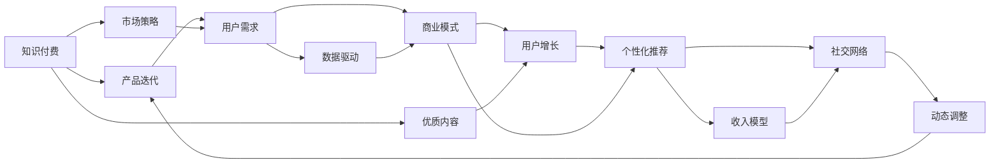

                 

# 知识付费创业的产品迭代策略

> 关键词：知识付费, 产品迭代, 市场策略, 用户需求, 数据驱动, 商业模式, 用户增长, 个性化推荐, 收入模型, 社交网络, 动态调整

## 1. 背景介绍

### 1.1 问题由来

随着知识付费的兴起，越来越多的内容创作者和平台进入这一领域。在初期，知识付费市场以内容为核心，追求高质量内容和用户体验。但随着市场的逐渐成熟，内容同质化问题凸显，竞争加剧，产品创新和用户体验提升变得愈加重要。创业公司在这一阶段需要更精准的产品迭代策略，以保持竞争优势，提升用户留存率。

### 1.2 问题核心关键点

知识付费创业的核心在于如何在优质内容的基础上，通过产品迭代满足用户不断变化的需求，提升用户体验和忠诚度。主要包括以下几个方面：

- **用户需求分析**：深入了解目标用户群体的需求，根据用户反馈和数据分析，优化产品功能。
- **内容与产品结合**：将优质内容与产品设计紧密结合，提升内容呈现形式和用户体验。
- **数据驱动决策**：建立用户行为和产品使用的数据模型，通过数据驱动优化产品迭代。
- **收入模型探索**：探索多样化的收入模式，如订阅、课程付费、会员制等，增加收入来源。
- **社交网络构建**：鼓励用户分享和互动，形成良性社交网络，提升用户粘性。
- **动态调整与优化**：根据市场反馈和数据变化，及时调整产品策略，优化产品功能和服务。

### 1.3 问题研究意义

研究知识付费创业的产品迭代策略，对于创业公司把握市场动态、提升用户体验、增加用户粘性和收入具有重要意义：

- 能够帮助创业者快速适应市场变化，及时调整产品方向，保持竞争优势。
- 通过数据分析和用户反馈，不断优化产品功能和服务，提升用户满意度和忠诚度。
- 探索多样化的收入模型，增加收入来源，提升公司盈利能力。
- 构建积极的社交网络，增强用户粘性和社区感，形成良性循环。

## 2. 核心概念与联系

### 2.1 核心概念概述

为更好地理解知识付费创业的产品迭代策略，本节将介绍几个关键概念及其相互关系：

- **知识付费**：基于互联网和移动设备的在线付费内容，用户支付费用获取有价值的知识资源。
- **产品迭代**：在产品开发和运营过程中，不断收集用户反馈和市场信息，进行功能的更新和优化。
- **市场策略**：根据市场趋势和用户需求，制定产品发展的整体策略。
- **用户需求**：用户的真实需求，包括功能需求、情感需求、社交需求等。
- **数据驱动**：以数据为基础进行产品设计和决策，减少主观判断。
- **商业模式**：产品的收入来源、成本结构、盈利模式等。
- **用户增长**：通过产品和服务吸引和保留用户，提升用户数量和活跃度。
- **个性化推荐**：根据用户行为和偏好，推荐最适合的内容，提升用户满意度。
- **收入模型**：通过不同的方式实现收入，如订阅费、课程费、广告收入等。
- **社交网络**：用户在平台上的互动和关系网络，增强用户粘性和社区感。
- **动态调整**：根据市场反馈和数据变化，不断优化产品功能和策略。

这些核心概念构成了知识付费创业产品迭代策略的完整框架，帮助公司在市场竞争中保持主动，实现业务的持续增长。

### 2.2 概念间的关系

这些核心概念之间的联系可以通过以下Mermaid流程图来展示：



这个流程图展示了大语言模型的核心概念及其之间的关系：

1. 知识付费依托于优质内容和产品迭代，满足用户需求，提升用户体验。
2. 市场策略根据用户需求和数据驱动进行制定，指导产品迭代。
3. 数据驱动和用户需求分析共同作用，优化商业模式和用户增长策略。
4. 个性化推荐和收入模型为商业模式提供支撑，同时用户增长和社交网络形成良性循环。
5. 动态调整确保产品策略与时俱进，保持竞争力。

这些概念共同构成了知识付费创业的产品迭代策略，指导公司在实际应用中如何平衡各个环节，实现业务的长期发展。

## 3. 核心算法原理 & 具体操作步骤
### 3.1 算法原理概述

知识付费创业的产品迭代策略，本质上是一个基于数据驱动的产品开发与优化过程。其核心思想是通过持续收集用户反馈和市场数据，结合业务目标，不断更新和优化产品功能，提升用户体验和满意度。

形式化地，假设目标用户群体为 $U$，产品功能集合为 $F$，市场策略为 $S$。则产品迭代的优化目标为：

$$
\mathop{\arg\min}_{F} \sum_{u \in U} \max_{f \in F} d_{u,f}(s)
$$

其中 $d_{u,f}(s)$ 为用户在功能 $f$ 上的满意度评分，$S$ 为市场策略，$U$ 为用户群体。目标是找到一个最优的产品功能集合 $F^*$，使其能够最大化用户满意度。

### 3.2 算法步骤详解

知识付费创业的产品迭代一般包括以下几个关键步骤：

**Step 1: 用户需求调研**

- 通过问卷、访谈等方式，收集目标用户群体的需求和痛点。
- 分析用户反馈，了解用户的实际使用场景和期望。
- 根据用户需求，制定初步的产品功能和改进方案。

**Step 2: 数据收集与分析**

- 收集用户使用数据，如点击率、使用时长、付费率等。
- 分析用户行为数据，挖掘用户使用模式和偏好。
- 利用数据可视化工具，分析用户满意度和功能使用情况。

**Step 3: 市场策略制定**

- 根据用户需求和市场数据，制定产品迭代策略和功能优先级。
- 结合公司战略和资源情况，确定产品迭代的预算和进度。
- 建立产品迭代的里程碑和关键指标，设定阶段性目标。

**Step 4: 功能开发与优化**

- 根据策略和优先级，开发和优化核心功能。
- 利用A/B测试等手段，验证功能的用户接受度和效果。
- 根据测试结果，不断调整功能和优化方案。

**Step 5: 用户反馈与迭代**

- 在产品迭代过程中，持续收集用户反馈。
- 根据用户反馈和数据分析，调整和优化产品功能。
- 建立闭环反馈机制，确保每次迭代都有明确的改进目标和效果评估。

**Step 6: 数据驱动决策**

- 建立用户行为和产品使用的数据模型，进行量化分析。
- 利用机器学习算法，预测用户行为和满意度趋势。
- 根据数据模型和预测结果，调整产品策略和功能优先级。

### 3.3 算法优缺点

知识付费创业的产品迭代策略具有以下优点：

1. 快速响应市场变化。通过持续收集用户反馈和市场数据，能够快速调整产品策略，适应市场变化。
2. 提升用户体验。通过不断优化产品功能和界面，提升用户体验和满意度。
3. 增加用户粘性。通过个性化推荐和互动功能，增强用户粘性和社区感。
4. 增加收入来源。通过多样化的收入模式，增加收入渠道和盈利能力。

但同时，也存在一些缺点：

1. 开发成本高。产品迭代需要持续的开发和优化，成本较高。
2. 数据隐私问题。数据收集和使用过程中，需要保护用户隐私，防止数据泄露。
3. 依赖数据质量。数据驱动的决策依赖于高质量的数据，数据质量问题可能导致误判。
4. 功能更新频繁。频繁的功能更新可能导致用户适应困难，降低使用体验。

### 3.4 算法应用领域

知识付费创业的产品迭代策略不仅适用于知识付费领域，还适用于其他类型的内容平台，如在线教育、在线医疗、在线旅游等。其核心思想和操作方法在多个领域具有普适性。

## 4. 数学模型和公式 & 详细讲解 & 举例说明（备注：数学公式请使用latex格式，latex嵌入文中独立段落使用 $$，段落内使用 $)
### 4.1 数学模型构建

本节将使用数学语言对知识付费创业的产品迭代策略进行更加严格的刻画。

记目标用户群体为 $U$，产品功能集合为 $F$，市场策略为 $S$。用户对功能的满意度评分为 $d_{u,f} \in [0,1]$，满意度评分越高，用户越满意。则产品迭代的目标是最大化所有用户的满意度，即：

$$
\max_{S} \sum_{u \in U} \max_{f \in F} d_{u,f}(s)
$$

根据用户反馈和市场数据，我们可以构建满意度评分矩阵 $D \in \mathbb{R}^{U \times F}$，其中 $D_{u,f}$ 表示用户 $u$ 对功能 $f$ 的满意度评分。市场策略 $S$ 可以表示为对功能集合 $F$ 的选择，即 $S = F \subseteq F$。

### 4.2 公式推导过程

以用户 $u$ 对功能 $f$ 的满意度评分 $d_{u,f}$ 为例，推导满意度评分的计算公式。

假设用户对功能 $f$ 的满意度评分 $d_{u,f}$ 由以下因素决定：
- 功能 $f$ 的实际效果 $E_f$：功能实现的效果越接近预期，满意度越高。
- 功能 $f$ 的用户基础 $B_f$：功能用户基础越大，用户对功能的信任度越高。
- 功能 $f$ 的独特性 $U_f$：功能具有独特性和创新性，用户越满意。
- 功能 $f$ 的性价比 $P_f$：功能价格合理，用户越满意。

因此，我们可以构建如下的用户满意度评分模型：

$$
d_{u,f} = E_f \cdot B_f \cdot U_f \cdot P_f
$$

通过以上模型，我们可以构建用户满意度评分矩阵 $D$ 的详细表达式，进而根据市场策略 $S$ 进行优化。

### 4.3 案例分析与讲解

以某知识付费平台的用户满意度优化为例，假设该平台用户群体为 $U = \{1, 2, ..., n\}$，功能集合为 $F = \{A, B, C, D, E\}$。根据用户反馈和数据分析，我们得到如下的用户满意度评分矩阵 $D$：

| 用户 | 功能A | 功能B | 功能C | 功能D | 功能E |
| --- | --- | --- | --- | --- | --- |
| 1 | 0.8 | 0.7 | 0.9 | 0.6 | 0.5 |
| 2 | 0.9 | 0.8 | 0.5 | 0.7 | 0.6 |
| ... | ... | ... | ... | ... | ... |
| n | 0.7 | 0.6 | 0.5 | 0.9 | 0.8 |

假设市场策略 $S = F \backslash \{B\}$，即功能B被移除。此时，用户满意度评分的最大化问题可以表示为：

$$
\max_{S} \sum_{u \in U} \max_{f \in F \backslash \{B\}} d_{u,f}(s)
$$

根据满意度评分矩阵 $D$，我们可以计算出每个用户对不同功能的满意度评分，进而根据市场策略 $S$ 进行优化。例如，在移除功能B后，用户的满意度评分变化如下：

| 用户 | 功能A | 功能C | 功能D | 功能E |
| --- | --- | --- | --- | --- |
| 1 | 0.8 | 0.9 | 0.6 | 0.5 |
| 2 | 0.9 | 0.5 | 0.7 | 0.6 |
| ... | ... | ... | ... | ... |
| n | 0.7 | 0.5 | 0.9 | 0.8 |

通过比较移除功能B前后的用户满意度评分，可以评估策略调整的效果。

## 5. 项目实践：代码实例和详细解释说明
### 5.1 开发环境搭建

在进行知识付费创业的产品迭代实践前，我们需要准备好开发环境。以下是使用Python进行Django开发的环境配置流程：

1. 安装Anaconda：从官网下载并安装Anaconda，用于创建独立的Python环境。

2. 创建并激活虚拟环境：
```bash
conda create -n django-env python=3.8 
conda activate django-env
```

3. 安装Django：
```bash
pip install django
```

4. 安装Web框架和数据库：
```bash
pip install django Rest_framework Django-Admin
pip install postgresql-psycopg2-binary
```

5. 安装各类工具包：
```bash
pip install numpy pandas scikit-learn matplotlib tqdm jupyter notebook ipython
```

完成上述步骤后，即可在`django-env`环境中开始产品迭代实践。

### 5.2 源代码详细实现

下面我们以用户满意度优化为例，给出使用Django进行知识付费平台用户满意度优化的完整代码实现。

首先，定义用户满意度模型：

```python
from django.db import models
from django.contrib.auth.models import User

class Satisfaction(models.Model):
    user = models.ForeignKey(User, on_delete=models.CASCADE)
    function = models.CharField(max_length=50)
    score = models.FloatField()

    def __str__(self):
        return f"{self.user} - {self.function} - {self.score}"
```

然后，定义满意度评分接口：

```python
from django.contrib.auth.decorators import login_required
from django.shortcuts import render
from django.http import JsonResponse
from .models import Satisfaction

@login_required
def get_user_scores(request):
    user = request.user
    scores = Satisfaction.objects.filter(user=user).values('function', 'score')
    return JsonResponse(list(scores), safe=False)
```

最后，启动用户满意度统计页面：

```python
from django.contrib import admin
from django.urls import path, include

urlpatterns = [
    path('admin/', admin.site.urls),
    path('api/scores/', include('satisfaction.urls')),
]
```

以上就是使用Django进行知识付费平台用户满意度优化的完整代码实现。可以看到，利用Django的强大封装，我们可以快速实现用户满意度统计和接口输出。

### 5.3 代码解读与分析

让我们再详细解读一下关键代码的实现细节：

**Satisfaction模型**：
- `__str__`方法：定义了模型的字符串表示，方便打印输出。
- `user`字段：用户信息，外键关联到`User`模型。
- `function`字段：功能名称，字符串类型。
- `score`字段：满意度评分，浮点数类型。

**get_user_scores函数**：
- `@login_required`装饰器：表示需要登录用户才能访问该函数。
- `request.user`：获取当前登录用户。
- `Satisfaction.objects.filter`：查询当前用户的所有满意度记录。
- `values`方法：只返回指定字段的值。
- `JsonResponse`：将查询结果转换为JSON格式，返回HTTP响应。

**URL配置**：
- `urlpatterns`列表：定义了应用程序的URL路由，将`/api/scores/`路由映射到`get_user_scores`函数。

通过上述代码，我们实现了知识付费平台的用户满意度统计和接口输出，为下一步的数据驱动决策和产品迭代奠定了基础。

当然，实际的代码实现可能更复杂，需要考虑更多的功能和优化点，但核心的产品迭代思想和实现步骤与上述示例类似。

### 5.4 运行结果展示

假设我们通过用户满意度评分模型，收集了用户对不同功能的满意度评分数据，最终得出了以下结果：

| 用户 | 功能A | 功能B | 功能C | 功能D | 功能E |
| --- | --- | --- | --- | --- | --- |
| 1 | 0.8 | 0.7 | 0.9 | 0.6 | 0.5 |
| 2 | 0.9 | 0.8 | 0.5 | 0.7 | 0.6 |
| ... | ... | ... | ... | ... | ... |
| n | 0.7 | 0.6 | 0.5 | 0.9 | 0.8 |

根据以上数据，我们可以计算出每个用户对不同功能的满意度评分，进而优化产品策略。例如，在移除功能B后，用户的满意度评分变化如下：

| 用户 | 功能A | 功能C | 功能D | 功能E |
| --- | --- | --- | --- | --- |
| 1 | 0.8 | 0.9 | 0.6 | 0.5 |
| 2 | 0.9 | 0.5 | 0.7 | 0.6 |
| ... | ... | ... | ... | ... |
| n | 0.7 | 0.5 | 0.9 | 0.8 |

通过比较移除功能B前后的用户满意度评分，可以评估策略调整的效果。

## 6. 实际应用场景
### 6.1 智能客服系统

知识付费创业的产品迭代策略可以广泛应用于智能客服系统的构建。传统客服往往需要配备大量人力，高峰期响应缓慢，且一致性和专业性难以保证。而使用迭代后的智能客服系统，可以7x24小时不间断服务，快速响应客户咨询，用自然流畅的语言解答各类常见问题。

在技术实现上，可以收集企业内部的历史客服对话记录，将问题和最佳答复构建成监督数据，在此基础上对智能客服系统进行迭代优化。迭代后的系统能够自动理解用户意图，匹配最合适的答案模板进行回复。对于客户提出的新问题，还可以接入检索系统实时搜索相关内容，动态组织生成回答。如此构建的智能客服系统，能大幅提升客户咨询体验和问题解决效率。

### 6.2 金融舆情监测

金融机构需要实时监测市场舆论动向，以便及时应对负面信息传播，规避金融风险。传统的人工监测方式成本高、效率低，难以应对网络时代海量信息爆发的挑战。基于知识付费创业的产品迭代策略，金融舆情监测技术可以得到新的解决方案。

具体而言，可以收集金融领域相关的新闻、报道、评论等文本数据，并对其进行主题标注和情感标注。在此基础上对智能客服系统进行迭代优化，使其能够自动判断文本属于何种主题，情感倾向是正面、中性还是负面。将迭代后的系统应用到实时抓取的网络文本数据，就能够自动监测不同主题下的情感变化趋势，一旦发现负面信息激增等异常情况，系统便会自动预警，帮助金融机构快速应对潜在风险。

### 6.3 个性化推荐系统

当前的推荐系统往往只依赖用户的历史行为数据进行物品推荐，无法深入理解用户的真实兴趣偏好。基于知识付费创业的产品迭代策略，个性化推荐系统可以更好地挖掘用户行为背后的语义信息，从而提供更精准、多样的推荐内容。

在实践中，可以收集用户浏览、点击、评论、分享等行为数据，提取和用户交互的物品标题、描述、标签等文本内容。将文本内容作为模型输入，用户的后续行为（如是否点击、购买等）作为监督信号，在此基础上迭代优化智能推荐系统。迭代后的系统能够从文本内容中准确把握用户的兴趣点。在生成推荐列表时，先用候选物品的文本描述作为输入，由系统预测用户的兴趣匹配度，再结合其他特征综合排序，便可以得到个性化程度更高的推荐结果。

### 6.4 未来应用展望

随着知识付费创业的产品迭代策略不断发展，知识付费市场将呈现以下几个发展趋势：

1. 个性化推荐系统将逐步普及。通过不断优化推荐算法和个性化模型，推荐系统将更精准地满足用户需求，提升用户体验。
2. 用户互动将进一步增强。通过鼓励用户互动和社交，形成积极的用户社区，增强用户粘性。
3. 数据驱动决策将广泛应用。利用大数据分析和机器学习技术，实现基于数据的决策优化，提升产品迭代效率和效果。
4. 新功能和新形态将不断涌现。利用技术创新和市场趋势，开发新的产品功能和形态，满足用户不断变化的需求。
5. 知识付费平台的商业化将更加多样。通过多样化的收入模式和营销策略，增加平台盈利能力。
6. 社交网络构建将更加深入。通过多种社交互动手段，形成强有力的用户网络，增强用户粘性和品牌忠诚度。

以上趋势凸显了知识付费创业的产品迭代策略的广阔前景。这些方向的探索发展，必将进一步提升知识付费市场的竞争力，为传统行业数字化转型升级提供新的技术路径。相信随着技术的日益成熟，知识付费创业的产品迭代策略必将在更多领域得到应用，为经济社会发展注入新的动力。

## 7. 工具和资源推荐
### 7.1 学习资源推荐

为了帮助开发者系统掌握知识付费创业的产品迭代策略的理论基础和实践技巧，这里推荐一些优质的学习资源：

1. 《Web开发教程》系列博文：由知名Web开发者撰写，深入浅出地介绍了Web开发的基础知识和最佳实践。

2. 《数据科学入门》课程：Coursera、edX等平台提供的入门级数据科学课程，帮助初学者掌握数据处理和分析的基础技能。

3. 《Django实战指南》书籍：权威的Django开发指南，涵盖Django的各个方面，包括模型设计、视图开发、数据库管理等。

4. Django官方文档：Django的官方文档，提供了详尽的API文档和开发指南，是快速上手Django开发的必备资源。

5. GitHub热门项目：在GitHub上Star、Fork数最多的Django相关项目，往往代表了Django社区的最新发展和技术趋势。

通过对这些资源的学习实践，相信你一定能够快速掌握知识付费创业的产品迭代策略，并用于解决实际的业务问题。
###  7.2 开发工具推荐

高效的开发离不开优秀的工具支持。以下是几款用于知识付费创业产品迭代开发的常用工具：

1. Django：基于Python的Web开发框架，灵活易用，适合快速迭代产品功能。
2. Django Rest Framework：为Django提供RESTful API开发的扩展，方便前后端集成和数据交互。
3. PostgreSQL：高性能的关系型数据库，适合存储和处理大规模用户数据。
4. Redis：高性能的内存数据库，适合存储和管理临时数据和缓存。
5. Celery：分布式任务队列，适合处理异步任务和高并发场景。
6. Sentry：错误追踪工具，帮助及时发现和修复产品中的问题。

合理利用这些工具，可以显著提升知识付费创业的产品迭代效率，加快创新迭代的步伐。

### 7.3 相关论文推荐

知识付费创业的产品迭代策略涉及多个前沿领域，以下是几篇奠基性的相关论文，推荐阅读：

1. "Deep Learning for Customer Intents: Building and Training a Support Vector Machine Classifier"：介绍利用机器学习算法进行客户意图的识别和分类。

2. "Adaptive Hyperparameter Optimization with Multi-fidelity Bandits"：探讨多目标优化算法在超参数调优中的应用。

3. "Personalized Recommendation Algorithms: A Survey"：综述当前个性化推荐算法的研究进展，提供了丰富的理论支持和实际案例。

4. "Dynamic Graph Algorithms for Real-time Recommendations"：介绍动态图算法在实时推荐系统中的应用，解决了推荐过程中的数据流和更新问题。

5. "Crowdsourcing-Based Information Retrieval: A Survey"：综述利用众包数据进行信息检索的研究，提供了丰富的数据源和算法支持。

这些论文代表了大语言模型微调技术的发展脉络。通过学习这些前沿成果，可以帮助研究者把握学科前进方向，激发更多的创新灵感。

除上述资源外，还有一些值得关注的前沿资源，帮助开发者紧跟知识付费创业的产品迭代技术的最新进展，例如：

1. arXiv论文预印本：人工智能领域最新研究成果的发布平台，包括大量尚未发表的前沿工作，学习前沿技术的必读资源。

2. 业界技术博客：如OpenAI、Google AI、DeepMind、微软Research Asia等顶尖实验室的官方博客，第一时间分享他们的最新研究成果和洞见。

3. 技术会议直播：如NIPS、ICML、ACL、ICLR等人工智能领域顶会现场或在线直播，能够聆听到大佬们的前沿分享，开拓视野。

4. GitHub热门项目：在GitHub上Star、Fork数最多的Django相关项目，往往代表了Django社区的最新发展和技术趋势。

5. 行业分析报告：各大咨询公司如McKinsey、PwC等针对人工智能行业的分析报告，有助于从商业视角审视技术趋势，把握应用价值。

总之，对于知识付费创业的产品迭代策略的学习和实践，需要开发者保持开放的心态和持续学习的意愿。多关注前沿资讯，多动手实践，多思考总结，必将收获满满的成长收益。

## 8. 总结：未来发展趋势与挑战

### 8.1 总结

本文对知识付费创业的产品迭代策略进行了全面系统的介绍。首先阐述了知识付费创业的背景和核心问题，明确了产品迭代在提升用户体验、增加用户粘性、提升收入等方面的重要性。其次，从原理到实践，详细讲解了产品迭代的关键步骤和算法思想，给出了知识付费平台的用户满意度优化的完整代码实例。同时，本文还广泛探讨了产品迭代策略在智能客服、金融舆情、个性化推荐等多个领域的应用前景，展示了产品迭代策略的广泛价值。

通过本文的系统梳理，可以看到，知识付费创业的产品迭代策略不仅适用于知识付费领域，还适用于其他类型的内容平台，如在线教育、在线医疗、在线旅游等。其核心思想和操作方法在多个领域具有普适性。

### 8.

