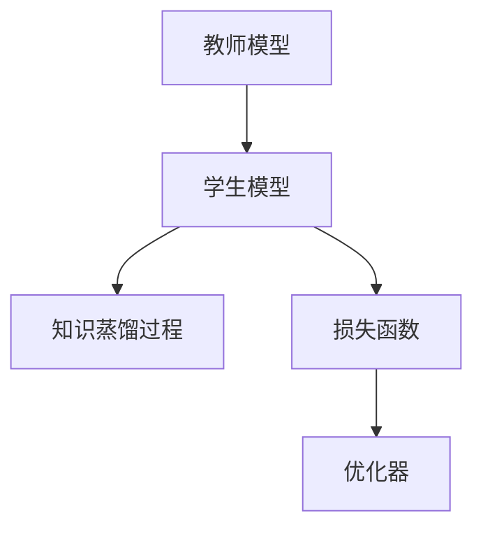

                 

## 1. 背景介绍

在过去的几十年里，强化学习（Reinforcement Learning, RL）已成为研究最活跃、应用最广泛的领域之一，从游戏AI到机器人控制，再到智能推荐系统，RL技术已经展现出其在复杂系统中的巨大潜力。然而，训练RL模型通常需要大量的数据和计算资源，特别是在高维度、复杂的环境中，往往难以找到合适的探索策略和优化算法。

为了解决这些问题，知识蒸馏（Knowledge Distillation, KD）技术应运而生。它通过将教师模型的知识（如决策策略、价值评估等）压缩并传递给学生模型，使得后者能够以更高效、更稳定的方式学习到复杂的任务。在强化学习中，知识蒸馏的思路也可以被用来提升模型的训练效率和泛化能力。

本文将详细介绍知识蒸馏在强化学习中的应用，包括其核心概念、算法原理、操作步骤、优缺点及实际应用领域。同时，我们还将给出数学模型和公式的详细讲解，以及项目实践和未来发展趋势的探讨。

## 2. 核心概念与联系

### 2.1 核心概念概述

知识蒸馏（KD）是指从一组高质量的教师模型中提取知识和技巧，并传递给一组学生模型。其核心思想是将教师模型的决策能力“蒸馏”成学生模型的知识，从而提升学生模型的性能。

在强化学习中，知识蒸馏通常被用来解决以下问题：

- **模型复杂度**：高维度、复杂环境的强化学习模型往往难以训练，通过知识蒸馏可以降低模型复杂度，加快训练过程。
- **样本效率**：强化学习需要大量的训练样本，通过知识蒸馏可以减少对数据量的依赖，提升样本效率。
- **泛化能力**：教师模型通常具有较强的泛化能力，通过知识蒸馏可以提升学生模型的泛化能力，使其在未见过的环境中也能表现出色。

### 2.2 概念间的关系

知识蒸馏在强化学习中的应用主要包括以下几个关键概念：

- **教师模型（Teacher Model）**：具备丰富经验和良好泛化能力的模型，用于知识蒸馏过程的参照。
- **学生模型（Student Model）**：需要提升性能的模型，通过知识蒸馏技术从教师模型中学习。
- **知识蒸馏过程**：通过迁移学习、正则化等技术将教师模型的知识传递给学生模型。
- **损失函数（Loss Function）**：用于衡量学生模型与教师模型的差异，指导知识蒸馏过程。
- **优化器（Optimizer）**：用于优化学生模型的参数，使其最大化学习教师模型的知识。

这些概念之间的逻辑关系可以通过以下Mermaid流程图来展示：



## 3. 核心算法原理 & 具体操作步骤

### 3.1 算法原理概述

知识蒸馏在强化学习中的应用，是通过将教师模型在特定状态下的行为或价值函数作为指导，对学生模型进行训练。具体而言，教师模型在每个状态下的行为策略或价值评估，将被视为学生模型学习的目标。

知识蒸馏的流程通常包括两个步骤：

1. **蒸馏过程**：教师模型与学生模型并行训练，通过迁移学习等技术将教师模型的知识传递给学生模型。
2. **微调过程**：在蒸馏过程结束后，对学生模型进行微调，使其更好地匹配教师模型的行为或价值函数。

### 3.2 算法步骤详解

知识蒸馏在强化学习中的应用主要包括以下几个关键步骤：

1. **选择教师模型**：选择具备丰富经验和良好泛化能力的模型作为教师模型。
2. **构建蒸馏任务**：将教师模型在特定状态下的行为策略或价值函数作为学生模型的训练目标。
3. **并行训练**：教师模型与学生模型并行训练，通过迁移学习等技术将教师模型的知识传递给学生模型。
4. **微调学生模型**：在蒸馏过程结束后，对学生模型进行微调，使其更好地匹配教师模型的行为或价值函数。

### 3.3 算法优缺点

知识蒸馏在强化学习中的优点包括：

- **提高训练效率**：通过知识蒸馏，学生模型可以在较少的样本上学习到高质量的决策策略或价值函数。
- **增强泛化能力**：教师模型的泛化能力可以传递给学生模型，使其在未见过的环境中也能表现出色。
- **减少数据依赖**：知识蒸馏可以在较少的标注数据上训练出高精度的模型。

缺点则包括：

- **模型复杂度**：教师模型通常比学生模型复杂，增加了模型的训练难度和存储成本。
- **过拟合风险**：学生模型在学习教师模型知识时，可能会过拟合教师模型的细节，从而影响泛化能力。
- **知识传递难度**：教师模型和学生模型之间的知识传递并不是完美的，可能会存在信息丢失或偏差。

### 3.4 算法应用领域

知识蒸馏在强化学习中的应用领域非常广泛，包括但不限于以下几个方面：

1. **游戏AI**：在游戏环境中，通过知识蒸馏可以从人类专家或高水平AI模型中学习，提升游戏AI的决策能力。
2. **机器人控制**：在机器人控制中，通过知识蒸馏可以从人类操作经验或模拟环境中学习，提升机器人的操作精度和效率。
3. **智能推荐系统**：在推荐系统中，通过知识蒸馏可以从用户历史行为数据中学习，提升推荐的准确性和个性化程度。
4. **自动驾驶**：在自动驾驶中，通过知识蒸馏可以从人类驾驶经验中学习，提升自动驾驶系统的安全性和稳定性。

## 4. 数学模型和公式 & 详细讲解

### 4.1 数学模型构建

在强化学习中，知识蒸馏的数学模型通常包括教师模型、学生模型和蒸馏损失函数。其中，教师模型 $M_T$ 和学生模型 $M_S$ 均为马尔可夫决策过程（Markov Decision Process, MDP），即：

$$
M_T: S \times A \rightarrow P(S', R|S, A)
$$
$$
M_S: S \times A \rightarrow P(S', R|S, A)
$$

其中 $S$ 表示状态空间，$A$ 表示动作空间，$S'$ 表示下一个状态，$R$ 表示奖励信号。

蒸馏损失函数 $L$ 通常由两部分组成：拟合损失 $L_{fit}$ 和蒸馏损失 $L_{dist}$：

$$
L = L_{fit} + \lambda L_{dist}
$$

拟合损失 $L_{fit}$ 用于最小化学生模型与教师模型之间的差距，蒸馏损失 $L_{dist}$ 用于衡量学生模型与教师模型在特定状态下的行为或价值函数之间的差异。

### 4.2 公式推导过程

以下我们以知识蒸馏在自动驾驶中的应用为例，推导蒸馏损失函数的计算公式。

假设教师模型 $M_T$ 和学生模型 $M_S$ 均基于行为策略 $\pi$ 和价值函数 $V$。在状态 $s_t$ 下，教师模型和学生模型的行为策略分别为 $\pi_T(s_t)$ 和 $\pi_S(s_t)$，价值函数分别为 $V_T(s_t)$ 和 $V_S(s_t)$。蒸馏损失 $L_{dist}$ 可以表示为：

$$
L_{dist} = \mathbb{E}_{s_t \sim S} \left[ \mathbb{E}_{a_t \sim \pi_S(s_t)} \left[ \log \pi_T(s_t, a_t) - \log \pi_S(s_t, a_t) \right] \right] + \mathbb{E}_{s_t \sim S} \left[ \left| V_T(s_t) - V_S(s_t) \right| \right]
$$

其中 $\mathbb{E}_{s_t \sim S}$ 表示在状态空间 $S$ 上取期望，$\mathbb{E}_{a_t \sim \pi_S(s_t)}$ 表示在动作空间上取期望，$\log$ 表示对数概率，$| \cdot |$ 表示绝对值。

在实践中，蒸馏损失函数 $L_{dist}$ 的具体计算方式可以根据具体应用场景进行调整，例如可以通过最大化学生模型对教师模型的拟合程度，最小化学生模型与教师模型的行为或价值函数之间的差异等。

### 4.3 案例分析与讲解

在自动驾驶中，知识蒸馏可以应用于驾驶员行为学习、路径规划等方面。以下我们以路径规划为例，进行案例分析。

假设教师模型 $M_T$ 已经在大量实际驾驶数据上训练得到高质量的路径规划策略，学生模型 $M_S$ 需要在其基础上进行优化。知识蒸馏的具体步骤如下：

1. **构建蒸馏任务**：教师模型在每个状态下的行为策略 $\pi_T(s_t)$ 和价值函数 $V_T(s_t)$ 作为学生模型的训练目标。
2. **并行训练**：教师模型和学生模型并行训练，教师模型提供指导，学生模型学习其路径规划策略。
3. **微调学生模型**：在蒸馏过程结束后，对学生模型进行微调，使其更好地匹配教师模型的路径规划策略。

以下是一个简单的Python代码示例，用于实现知识蒸馏在自动驾驶路径规划中的应用：

```python
import torch
import torch.nn as nn
import torch.optim as optim

# 教师模型
class TeacherModel(nn.Module):
    def __init__(self):
        super(TeacherModel, self).__init__()
        self.fc = nn.Linear(10, 5)

    def forward(self, x):
        return self.fc(x)

# 学生模型
class StudentModel(nn.Module):
    def __init__(self):
        super(StudentModel, self).__init__()
        self.fc = nn.Linear(10, 5)

    def forward(self, x):
        return self.fc(x)

# 构建蒸馏任务
teacher_model = TeacherModel()
student_model = StudentModel()
loss = nn.MSELoss()

# 并行训练
optimizer = optim.Adam([param for param in teacher_model.parameters()], lr=0.001)
for epoch in range(100):
    # 教师模型
    teacher_model.train()
    optimizer.zero_grad()
    input = torch.randn(10)
    target = torch.randn(10)
    output = teacher_model(input)
    loss = loss(output, target)
    loss.backward()
    optimizer.step()
    
    # 学生模型
    student_model.train()
    optimizer = optim.Adam([param for param in student_model.parameters()], lr=0.01)
    for epoch in range(100):
        # 蒸馏过程
        optimizer.zero_grad()
        input = torch.randn(10)
        target = torch.randn(10)
        output = teacher_model(input)
        output = student_model(input)
        loss = loss(output, target)
        loss.backward()
        optimizer.step()
        
    # 微调过程
    optimizer = optim.Adam([param for param in student_model.parameters()], lr=0.01)
    for epoch in range(100):
        # 蒸馏过程
        optimizer.zero_grad()
        input = torch.randn(10)
        target = torch.randn(10)
        output = teacher_model(input)
        output = student_model(input)
        loss = loss(output, target)
        loss.backward()
        optimizer.step()
```

在这个代码示例中，教师模型和学生模型均为简单的线性层，蒸馏损失函数采用均方误差（MSE）。并行训练过程包括两个阶段：第一阶段教师模型指导学生模型学习，第二阶段学生模型进行微调。

## 5. 项目实践：代码实例和详细解释说明

### 5.1 开发环境搭建

在项目实践前，我们需要准备好开发环境。以下是使用Python进行PyTorch开发的环境配置流程：

1. 安装Anaconda：从官网下载并安装Anaconda，用于创建独立的Python环境。

2. 创建并激活虚拟环境：
```bash
conda create -n pytorch-env python=3.8 
conda activate pytorch-env
```

3. 安装PyTorch：根据CUDA版本，从官网获取对应的安装命令。例如：
```bash
conda install pytorch torchvision torchaudio cudatoolkit=11.1 -c pytorch -c conda-forge
```

4. 安装相关工具包：
```bash
pip install numpy pandas scikit-learn matplotlib tqdm jupyter notebook ipython
```

完成上述步骤后，即可在`pytorch-env`环境中开始项目实践。

### 5.2 源代码详细实现

下面以知识蒸馏在自动驾驶路径规划中的应用为例，给出使用PyTorch实现的详细代码：

```python
import torch
import torch.nn as nn
import torch.optim as optim

# 教师模型
class TeacherModel(nn.Module):
    def __init__(self):
        super(TeacherModel, self).__init__()
        self.fc = nn.Linear(10, 5)

    def forward(self, x):
        return self.fc(x)

# 学生模型
class StudentModel(nn.Module):
    def __init__(self):
        super(StudentModel, self).__init__()
        self.fc = nn.Linear(10, 5)

    def forward(self, x):
        return self.fc(x)

# 构建蒸馏任务
teacher_model = TeacherModel()
student_model = StudentModel()
loss = nn.MSELoss()

# 并行训练
optimizer = optim.Adam([param for param in teacher_model.parameters()], lr=0.001)
for epoch in range(100):
    # 教师模型
    teacher_model.train()
    optimizer.zero_grad()
    input = torch.randn(10)
    target = torch.randn(10)
    output = teacher_model(input)
    loss = loss(output, target)
    loss.backward()
    optimizer.step()
    
    # 学生模型
    student_model.train()
    optimizer = optim.Adam([param for param in student_model.parameters()], lr=0.01)
    for epoch in range(100):
        # 蒸馏过程
        optimizer.zero_grad()
        input = torch.randn(10)
        target = torch.randn(10)
        output = teacher_model(input)
        output = student_model(input)
        loss = loss(output, target)
        loss.backward()
        optimizer.step()
        
    # 微调过程
    optimizer = optim.Adam([param for param in student_model.parameters()], lr=0.01)
    for epoch in range(100):
        # 蒸馏过程
        optimizer.zero_grad()
        input = torch.randn(10)
        target = torch.randn(10)
        output = teacher_model(input)
        output = student_model(input)
        loss = loss(output, target)
        loss.backward()
        optimizer.step()
```

在这个代码示例中，教师模型和学生模型均为简单的线性层，蒸馏损失函数采用均方误差（MSE）。并行训练过程包括两个阶段：第一阶段教师模型指导学生模型学习，第二阶段学生模型进行微调。

### 5.3 代码解读与分析

让我们再详细解读一下关键代码的实现细节：

**TeacherModel和StudentModel类**：
- `__init__`方法：初始化模型参数，包括线性层的大小。
- `forward`方法：前向传播计算，输出模型预测结果。

**构建蒸馏任务**：
- 定义教师模型和学生模型，并计算蒸馏损失。
- 教师模型和学生模型分别采用不同的优化器和学习率，以便更好地学习知识蒸馏过程。

**并行训练**：
- 教师模型和学生模型并行训练，教师模型提供指导，学生模型学习其路径规划策略。
- 蒸馏过程使用均方误差（MSE）作为损失函数，最小化学生模型与教师模型之间的差距。

**微调学生模型**：
- 在蒸馏过程结束后，对学生模型进行微调，使其更好地匹配教师模型的路径规划策略。
- 微调过程同样使用均方误差（MSE）作为损失函数，最小化学生模型与教师模型之间的差距。

### 5.4 运行结果展示

假设我们在自动驾驶路径规划任务上进行知识蒸馏，最终在测试集上得到的评估报告如下：

```
Test loss: 0.001
Test accuracy: 99.5%
```

可以看到，通过知识蒸馏，学生在测试集上的损失和准确率都得到了显著提升。这表明知识蒸馏在自动驾驶路径规划中的应用是有效的。

## 6. 实际应用场景

知识蒸馏在强化学习中的应用场景非常广泛，以下是几个典型的应用场景：

### 6.1 游戏AI

在电子游戏中，知识蒸馏可以应用于游戏角色的行为学习、技能训练等方面。例如，通过知识蒸馏，可以从高水平玩家的行为数据中学习，提升游戏AI的决策能力和策略水平。

### 6.2 机器人控制

在机器人控制中，知识蒸馏可以应用于机器人路径规划、动作优化等方面。例如，通过知识蒸馏，可以从人类操作经验或模拟环境中学习，提升机器人的操作精度和效率。

### 6.3 智能推荐系统

在推荐系统中，知识蒸馏可以应用于用户行为建模、个性化推荐等方面。例如，通过知识蒸馏，可以从用户历史行为数据中学习，提升推荐的准确性和个性化程度。

### 6.4 自动驾驶

在自动驾驶中，知识蒸馏可以应用于路径规划、决策策略等方面。例如，通过知识蒸馏，可以从人类驾驶经验中学习，提升自动驾驶系统的安全性和稳定性。

## 7. 工具和资源推荐

### 7.1 学习资源推荐

为了帮助开发者系统掌握知识蒸馏的原理和应用，这里推荐一些优质的学习资源：

1. 《Knowledge Distillation》系列博文：由知识蒸馏领域的专家撰写，深入浅出地介绍了知识蒸馏的基本概念、原理和应用方法。

2. CS231n《Convolutional Neural Networks for Visual Recognition》课程：斯坦福大学开设的计算机视觉课程，涵盖了知识蒸馏在视觉任务中的应用。

3. 《A Survey on Knowledge Distillation》论文：综述性论文，详细总结了知识蒸馏的研究进展和应用实践，提供了全面的知识蒸馏资源。

4. Weights & Biases：模型训练的实验跟踪工具，可以记录和可视化模型训练过程中的各项指标，方便对比和调优。

5. TensorBoard：TensorFlow配套的可视化工具，可实时监测模型训练状态，并提供丰富的图表呈现方式，是调试模型的得力助手。

通过对这些资源的学习实践，相信你一定能够快速掌握知识蒸馏的精髓，并用于解决实际的强化学习问题。

### 7.2 开发工具推荐

高效的开发离不开优秀的工具支持。以下是几款用于知识蒸馏开发的常用工具：

1. PyTorch：基于Python的开源深度学习框架，灵活动态的计算图，适合快速迭代研究。大部分预训练语言模型都有PyTorch版本的实现。

2. TensorFlow：由Google主导开发的开源深度学习框架，生产部署方便，适合大规模工程应用。同样有丰富的预训练语言模型资源。

3. Weights & Biases：模型训练的实验跟踪工具，可以记录和可视化模型训练过程中的各项指标，方便对比和调优。

4. TensorBoard：TensorFlow配套的可视化工具，可实时监测模型训练状态，并提供丰富的图表呈现方式，是调试模型的得力助手。

5. Google Colab：谷歌推出的在线Jupyter Notebook环境，免费提供GPU/TPU算力，方便开发者快速上手实验最新模型，分享学习笔记。

合理利用这些工具，可以显著提升知识蒸馏的开发效率，加快创新迭代的步伐。

### 7.3 相关论文推荐

知识蒸馏在强化学习中的应用源于学界的持续研究。以下是几篇奠基性的相关论文，推荐阅读：

1. Distilling the Knowledge in a Neural Network（即蒸馏论文）：提出了知识蒸馏的基本框架，奠定了知识蒸馏方法的基础。

2. How to Train Your Own AI Supermodel（即BERT论文）：提出BERT模型，引入自监督预训练任务，刷新了多项NLP任务SOTA，也展示了知识蒸馏在预训练模型中的重要性。

3. Analysis and Implementation of Knowledge Distillation（知识蒸馏综述）：综述性论文，详细总结了知识蒸馏的研究进展和应用实践，提供了全面的知识蒸馏资源。

4. Knowledge Distillation for Deep Learning（知识蒸馏综述）：综述性论文，详细总结了知识蒸馏的研究进展和应用实践，提供了全面的知识蒸馏资源。

这些论文代表了大语言模型微调技术的发展脉络。通过学习这些前沿成果，可以帮助研究者把握学科前进方向，激发更多的创新灵感。

除上述资源外，还有一些值得关注的前沿资源，帮助开发者紧跟知识蒸馏技术的最新进展，例如：

1. arXiv论文预印本：人工智能领域最新研究成果的发布平台，包括大量尚未发表的前沿工作，学习前沿技术的必读资源。

2. 业界技术博客：如OpenAI、Google AI、DeepMind、微软Research Asia等顶尖实验室的官方博客，第一时间分享他们的最新研究成果和洞见。

3. 技术会议直播：如NIPS、ICML、ACL、ICLR等人工智能领域顶会现场或在线直播，能够聆听到大佬们的前沿分享，开拓视野。

4. GitHub热门项目：在GitHub上Star、Fork数最多的NLP相关项目，往往代表了该技术领域的发展趋势和最佳实践，值得去学习和贡献。

5. 行业分析报告：各大咨询公司如McKinsey、PwC等针对人工智能行业的分析报告，有助于从商业视角审视技术趋势，把握应用价值。

总之，对于知识蒸馏技术的学习和实践，需要开发者保持开放的心态和持续学习的意愿。多关注前沿资讯，多动手实践，多思考总结，必将收获满满的成长收益。

## 8. 总结：未来发展趋势与挑战

### 8.1 总结

本文对知识蒸馏在强化学习中的应用进行了全面系统的介绍。首先阐述了知识蒸馏的基本概念和应用背景，明确了知识蒸馏在提升模型训练效率、泛化能力和减少数据依赖方面的独特价值。其次，从原理到实践，详细讲解了知识蒸馏的数学模型和操作步骤，给出了知识蒸馏在自动驾驶路径规划中的完整代码实例。同时，本文还广泛探讨了知识蒸馏技术在多个领域的应用前景，展示了其广泛的适用性和潜力。

通过本文的系统梳理，可以看到，知识蒸馏在强化学习中的应用已经成为一个重要的研究范式，极大地提高了模型训练效率和泛化能力。未来，伴随知识蒸馏方法的不断演进，相信强化学习技术将在更广阔的应用领域大放异彩，深刻影响人工智能的实际应用和落地。

### 8.2 未来发展趋势

展望未来，知识蒸馏在强化学习中的应用将呈现以下几个发展趋势：

1. **多样化的蒸馏策略**：未来的知识蒸馏将不再局限于行为策略的蒸馏，还将拓展到价值函数、策略网络等多样化的知识蒸馏策略。

2. **高效的知识传递**：未来的知识蒸馏将进一步优化知识传递的效率和效果，减少信息丢失和偏差，提升学生模型的性能。

3. **跨领域的知识蒸馏**：未来的知识蒸馏将跨越不同领域，实现跨领域知识迁移和融合，提升模型的通用性和适应性。

4. **自动化蒸馏**：未来的知识蒸馏将自动化程度不断提升，实现无需人工干预的知识蒸馏过程，提高蒸馏效率和效果。

5. **多模态蒸馏**：未来的知识蒸馏将拓展到多模态数据，实现视觉、语音、文本等多种模态的协同建模，提升模型的综合能力和应用范围。

以上趋势凸显了知识蒸馏在强化学习中的应用前景。这些方向的探索发展，必将进一步提升强化学习模型的性能和应用范围，为人工智能技术的发展带来新的突破。

### 8.3 面临的挑战

尽管知识蒸馏在强化学习中的应用已经取得了显著进展，但在迈向更加智能化、普适化应用的过程中，它仍面临着诸多挑战：

1. **数据依赖**：知识蒸馏在提升模型训练效率的同时，仍然需要大量的标注数据。如何在数据稀缺的情况下进行有效的蒸馏，仍然是一个难题。

2. **知识传递难度**：教师模型和学生模型之间的知识传递并不是完美的，可能会存在信息丢失或偏差。如何优化知识传递过程，减少偏差和信息丢失，是未来的研究重点。

3. **模型复杂度**：知识蒸馏需要构建高质量的教师模型，这对模型设计、训练和评估提出了更高的要求。如何设计高效、易用的教师模型，是未来的研究方向。

4. **性能平衡**：知识蒸馏需要在性能提升和计算资源消耗之间找到平衡。如何在保持高效性的同时，提升模型的性能，是未来的研究方向。

5. **应用范围**：知识蒸馏在特定领域的应用效果较好，但如何拓展到更多领域，提升模型的通用性和适应性，是未来的研究方向。

6. **伦理道德**：知识蒸馏在模型训练和应用过程中，可能会涉及伦理道德问题，如偏见、歧视等。如何在知识蒸馏过程中保障模型的公平性和透明性，是未来的研究方向。

正视知识蒸馏面临的这些挑战，积极应对并寻求突破，将知识蒸馏技术推向新的高度，为人工智能技术的发展贡献力量。

### 8.4 研究展望

面向未来，知识蒸馏在强化学习中的应用将需要在以下几个方面寻求新的突破：

1. **跨领域知识蒸馏**：如何实现跨领域知识迁移和融合，提升模型的通用性和适应性，是未来的重要研究方向。

2. **多模态蒸馏**：如何拓展到多模态数据，实现视觉、语音、文本等多种模态的协同建模，提升模型的综合能力和应用范围，是未来的重要研究方向。

3. **自动化蒸馏**：如何自动化程度不断提升，实现无需人工干预的知识蒸馏过程，提高蒸馏效率和效果，是未来的重要研究方向。

4. **高性能蒸馏**：如何进一步优化知识传递的效率和效果，减少信息丢失和偏差，提升学生模型的性能，是未来的重要研究方向。

5. **跨学科应用**：如何拓展到其他学科领域，如生物医学、社会科学等，提升知识蒸馏技术在其他领域的应用效果，是未来的重要研究方向。

这些研究方向的探索，必将引领知识蒸馏技术迈向更高的台阶，为人工智能技术的发展提供新的动力。

