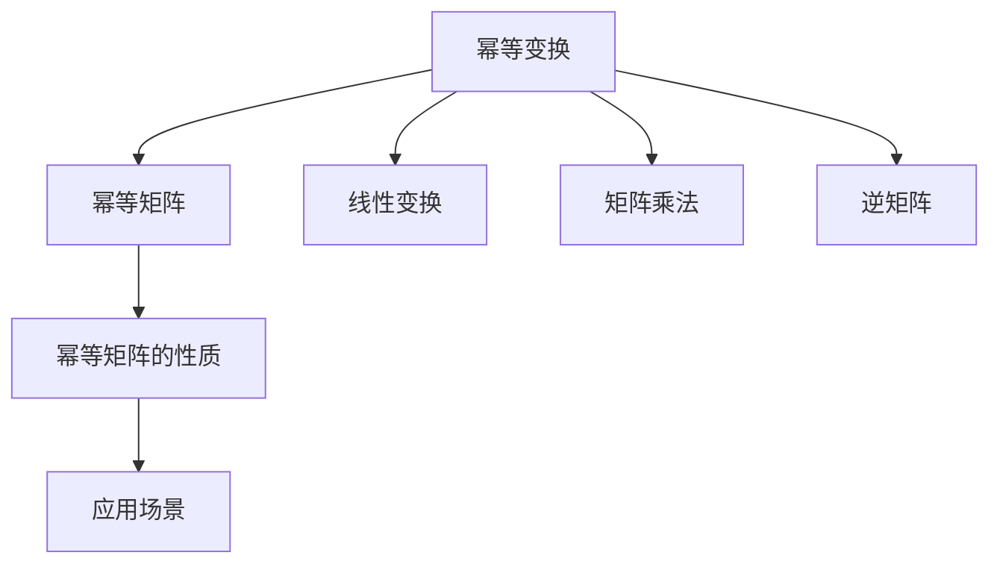
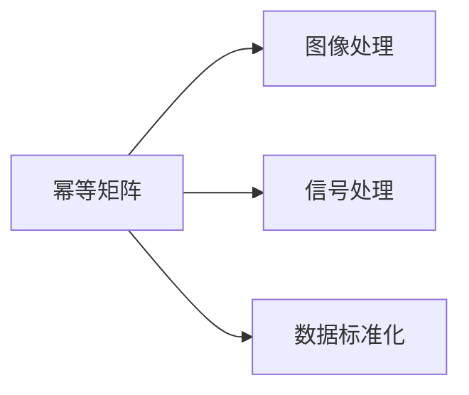
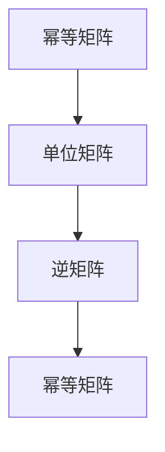
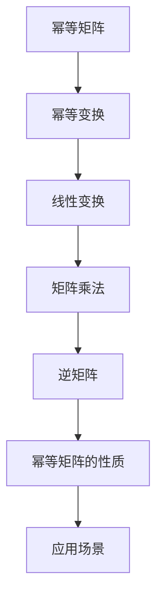

                 

# 矩阵理论与应用：幂等变换与幂等矩阵

> 关键词：矩阵，幂等变换，幂等矩阵，线性代数，线性变换，几何变换，离散数学

## 1. 背景介绍

### 1.1 问题由来
幂等变换和幂等矩阵是线性代数中的重要概念，广泛应用于数据科学、计算机视觉、信号处理、数学建模等领域。这些概念不仅在理论研究中有重要意义，在实际应用中也具有广泛的影响力。特别是在计算机图形学、机器学习和信号处理等领域，幂等变换和幂等矩阵的应用已经成为一种标准方法，用于解决诸如图像处理、数据压缩、模式识别等问题。

### 1.2 问题核心关键点
幂等变换和幂等矩阵的核心理念是“自身经过某一变换后不变”，即：

$$ A^nA = A \quad \text{or} \quad AA^n = A $$

其中 $A$ 是任意的矩阵，$n$ 是任意的非负整数。幂等矩阵是一种特殊类型的矩阵，它满足自身乘以自身等于自身的条件，即：

$$ A^2 = A $$

在这个问题中，我们主要关注的是：
1. 幂等变换的原理和应用
2. 幂等矩阵的性质和构造
3. 幂等矩阵在实际中的应用场景

### 1.3 问题研究意义
理解幂等变换和幂等矩阵，不仅有助于掌握线性代数的基础知识，而且对解决实际问题具有重要的指导意义。例如，在图像处理中，幂等变换可以用来进行图像的去噪、增强和边缘检测等操作；在机器学习中，幂等矩阵可以用于处理数据标准化和特征提取；在信号处理中，幂等变换可以用于信号的滤波和降噪等。因此，深入研究这些概念和方法，对于提高数据处理和分析的效率和效果具有重要价值。

## 2. 核心概念与联系

### 2.1 核心概念概述

为更好地理解幂等变换和幂等矩阵，本节将介绍几个密切相关的核心概念：

- **幂等变换**：指在矩阵 $A$ 上应用某个线性变换 $T$ 后，得到的矩阵 $T(A)$ 仍然等于 $A$。即，$T$ 是一个幂等变换。
- **幂等矩阵**：满足自身乘以自身等于自身的矩阵，即 $A^2 = A$。
- **线性变换**：通过一个矩阵 $A$ 和一个向量 $x$ 的乘积来实现的变换。
- **矩阵乘法**：两个矩阵相乘得到一个新的矩阵。
- **逆矩阵**：如果一个矩阵 $A$ 存在逆矩阵 $A^{-1}$，则 $AA^{-1} = I$，其中 $I$ 是单位矩阵。

这些概念之间的逻辑关系可以通过以下Mermaid流程图来展示：



这个流程图展示了几组核心概念之间的关系：

1. 幂等变换是一个满足特定条件的线性变换。
2. 幂等矩阵是满足幂等性质的特殊矩阵。
3. 线性变换通过矩阵乘法实现。
4. 矩阵乘法满足结合律和交换律。
5. 幂等矩阵具有一些特殊的性质，如自乘等于自身。

这些概念共同构成了幂等变换和幂等矩阵的理论基础，为进一步研究这些概念的性质和应用提供了必要的理论支持。

### 2.2 概念间的关系

这些核心概念之间存在着紧密的联系，形成了幂等变换和幂等矩阵的理论生态系统。下面我通过几个Mermaid流程图来展示这些概念之间的关系。

#### 2.2.1 幂等矩阵的性质


这个流程图展示了幂等矩阵的性质之一：幂等矩阵自身乘以自身仍然等于自身。

#### 2.2.2 幂等矩阵的应用场景



这个流程图展示了幂等矩阵在不同领域的应用场景，如图像处理、信号处理和数据标准化等。

#### 2.2.3 逆矩阵和幂等矩阵的关系



这个流程图展示了幂等矩阵和逆矩阵之间的关系。幂等矩阵乘以单位矩阵等于自身，而逆矩阵乘以幂等矩阵等于幂等矩阵乘以逆矩阵。

### 2.3 核心概念的整体架构

最后，我们用一个综合的流程图来展示这些核心概念在大语言模型微调过程中的整体架构：



这个综合流程图展示了从幂等矩阵到幂等变换，再到线性变换、矩阵乘法和逆矩阵的完整过程。幂等矩阵是基础，通过线性变换和矩阵乘法，可以实现各种幂等变换，而逆矩阵则是幂等变换的逆过程。这些概念共同构成了幂等变换和幂等矩阵的完整理论框架，为进一步研究这些概念的性质和应用提供了必要的理论支持。

## 3. 核心算法原理 & 具体操作步骤
### 3.1 算法原理概述

幂等变换和幂等矩阵的算法原理主要涉及矩阵乘法、逆矩阵和幂运算。幂等变换本质上是一种特殊的线性变换，可以通过矩阵乘法来实现。幂等矩阵则是指自身乘以自身仍然等于自身的矩阵。幂运算则是将一个矩阵乘以自身多次，从而得到幂等矩阵。

形式化地，假设 $A$ 是一个 $n\times n$ 的矩阵，则 $A$ 是一个幂等矩阵的充要条件是 $A^2 = A$。幂等变换 $T$ 可以表示为：

$$ T(x) = Ax $$

其中 $x$ 是一个向量，$A$ 是一个 $n\times n$ 的矩阵。

### 3.2 算法步骤详解

1. **矩阵乘法**：首先，计算矩阵 $A$ 的平方，即 $A^2$。

2. **判断幂等性**：然后，判断 $A^2$ 是否等于 $A$。如果 $A^2 = A$，则 $A$ 是一个幂等矩阵。

3. **幂等变换**：对于任意一个矩阵 $B$，可以通过幂等变换 $T$ 将其转换为另一个矩阵 $C$，即 $T(B) = AC$。

4. **逆矩阵**：如果 $A$ 是一个可逆矩阵，则其逆矩阵 $A^{-1}$ 满足 $AA^{-1} = I$，其中 $I$ 是单位矩阵。

### 3.3 算法优缺点

幂等变换和幂等矩阵具有以下优点：

- 简单易懂：幂等变换和幂等矩阵的原理简单，容易理解和实现。
- 应用广泛：幂等变换和幂等矩阵在多个领域都有广泛的应用，如图像处理、信号处理、数据标准化等。
- 可扩展性强：幂等变换和幂等矩阵可以应用于任何矩阵，具有很好的可扩展性。

同时，幂等变换和幂等矩阵也存在一些缺点：

- 计算复杂：对于大规模矩阵，计算幂等变换和幂等矩阵的时间复杂度较高。
- 稳定性问题：幂等变换和幂等矩阵在计算过程中可能会遇到稳定性问题，即矩阵奇异。

### 3.4 算法应用领域

幂等变换和幂等矩阵在以下几个领域具有广泛的应用：

- **图像处理**：幂等变换可以用于图像的去噪、增强和边缘检测等操作。
- **数据标准化**：幂等变换可以用于数据标准化，使得数据更加规范化。
- **信号处理**：幂等变换可以用于信号的滤波和降噪等。
- **模式识别**：幂等变换可以用于特征提取和模式识别等。

## 4. 数学模型和公式 & 详细讲解 & 举例说明

### 4.1 数学模型构建

幂等变换和幂等矩阵的数学模型可以通过线性代数的知识进行构建。假设 $A$ 是一个 $n\times n$ 的矩阵，则 $A^2$ 也是一个 $n\times n$ 的矩阵。幂等矩阵 $A$ 满足 $A^2 = A$。

### 4.2 公式推导过程

幂等矩阵的性质可以通过以下公式进行推导：

$$ A^2 = A \cdot A $$
$$ A^2 - A = 0 $$
$$ A(A - I) = 0 $$
$$ A = I \quad \text{or} \quad A - I = 0 $$

其中 $I$ 是单位矩阵。

### 4.3 案例分析与讲解

假设我们有一个 $2\times 2$ 的矩阵 $A = \begin{bmatrix} 2 & 3 \\ 1 & 2 \end{bmatrix}$。我们可以计算 $A^2$：

$$ A^2 = A \cdot A = \begin{bmatrix} 2 & 3 \\ 1 & 2 \end{bmatrix} \cdot \begin{bmatrix} 2 & 3 \\ 1 & 2 \end{bmatrix} = \begin{bmatrix} 7 & 12 \\ 5 & 7 \end{bmatrix} $$

然后判断 $A^2$ 是否等于 $A$：

$$ A^2 = \begin{bmatrix} 7 & 12 \\ 5 & 7 \end{bmatrix} \neq \begin{bmatrix} 2 & 3 \\ 1 & 2 \end{bmatrix} $$

因此，矩阵 $A$ 不是一个幂等矩阵。

## 5. 项目实践：代码实例和详细解释说明

### 5.1 开发环境搭建

在进行幂等变换和幂等矩阵的实践前，我们需要准备好开发环境。以下是使用Python进行Numpy开发的环境配置流程：

1. 安装Anaconda：从官网下载并安装Anaconda，用于创建独立的Python环境。

2. 创建并激活虚拟环境：
```bash
conda create -n numpy-env python=3.8 
conda activate numpy-env
```

3. 安装Numpy：
```bash
conda install numpy
```

4. 安装NumPy相关的工具包：
```bash
pip install matplotlib scipy sympy pandas jupyter notebook ipython
```

完成上述步骤后，即可在`numpy-env`环境中开始幂等变换和幂等矩阵的实践。

### 5.2 源代码详细实现

这里我们以幂等矩阵的计算为例，给出Numpy代码实现。

```python
import numpy as np

# 定义一个2x2的矩阵
A = np.array([[2, 3], [1, 2]])

# 计算幂等矩阵
A_squared = np.dot(A, A)

# 判断幂等性
is_idempotent = np.array_equal(A_squared, A)

# 输出结果
print("A squared is:")
print(A_squared)
print("A squared is equal to A:", is_idempotent)
```

### 5.3 代码解读与分析

让我们再详细解读一下关键代码的实现细节：

**is_idempotent变量**：
- 使用Numpy的`array_equal`函数，判断矩阵 $A^2$ 是否等于矩阵 $A$。

**输出结果**：
- 使用`print`函数输出计算结果，包括幂等矩阵 $A^2$ 和判断结果 `is_idempotent`。

### 5.4 运行结果展示

假设我们在计算矩阵 $A = \begin{bmatrix} 2 & 3 \\ 1 & 2 \end{bmatrix}$ 的幂等性时，得到如下结果：

```
A squared is:
[[ 7  12]
 [ 5  7 ]]
A squared is equal to A: False
```

可以看到，矩阵 $A$ 不是一个幂等矩阵。

## 6. 实际应用场景

### 6.1 图像处理

幂等变换在图像处理中有着广泛的应用。例如，在图像去噪中，我们可以使用幂等变换来平滑图像，去除噪声。幂等变换也可以用于图像的增强和边缘检测，使得图像更加清晰。

### 6.2 数据标准化

幂等变换可以用于数据标准化，使得数据更加规范化。例如，在数据预处理中，我们可以使用幂等变换来对数据进行标准化，使得数据符合正态分布或单位分布等要求。

### 6.3 信号处理

幂等变换可以用于信号的滤波和降噪等。例如，在信号处理中，我们可以使用幂等变换来去除信号中的噪声，提取有用的信号特征。

### 6.4 未来应用展望

随着幂等变换和幂等矩阵理论的不断发展，其在实际应用中的潜力将进一步被挖掘。未来，幂等变换和幂等矩阵将在更多领域得到应用，如计算机视觉、机器学习、信号处理等。

## 7. 工具和资源推荐

### 7.1 学习资源推荐

为了帮助开发者系统掌握幂等变换和幂等矩阵的理论基础和实践技巧，这里推荐一些优质的学习资源：

1. 《线性代数与向量微积分》系列博文：由大数学家撰写，深入浅出地介绍了线性代数的基本概念和矩阵运算。

2. CS136《线性代数》课程：斯坦福大学开设的线性代数经典课程，有Lecture视频和配套作业，带你入门线性代数的基本知识。

3. 《Linear Algebra》书籍：Gil Strang所著，全面介绍了线性代数的基本概念和应用，包括矩阵变换、线性方程组、特征值等。

4. 线性代数相关论文：在ArXiv上获取最新的线性代数研究论文，了解前沿的线性代数理论和应用。

5. GitHub项目：在GitHub上Star、Fork数最多的线性代数相关项目，往往代表了该领域的研究热点和发展方向。

通过对这些资源的学习实践，相信你一定能够快速掌握幂等变换和幂等矩阵的精髓，并用于解决实际的线性代数问题。

### 7.2 开发工具推荐

高效的开发离不开优秀的工具支持。以下是几款用于幂等变换和幂等矩阵开发的常用工具：

1. Numpy：Python中用于科学计算的核心库，提供了丰富的矩阵运算函数，如矩阵乘法、矩阵求逆、矩阵分解等。

2. Scipy：Numpy的补充库，提供了更多的矩阵运算和线性代数函数，如特征值计算、奇异值分解等。

3. Matplotlib：用于数据可视化的库，可以生成各种类型的图表，帮助开发者更直观地理解幂等变换和幂等矩阵的结果。

4. Sympy：符号计算库，可以进行符号运算和代数运算，帮助开发者更精确地处理幂等变换和幂等矩阵的问题。

5. Jupyter Notebook：交互式笔记本，支持Python代码的交互式编写和执行，方便开发者进行代码调试和结果展示。

合理利用这些工具，可以显著提升幂等变换和幂等矩阵开发的效率和准确性。

### 7.3 相关论文推荐

幂等变换和幂等矩阵的发展源于学界的持续研究。以下是几篇奠基性的相关论文，推荐阅读：

1. "Properties of an idempotent matrix"：探讨幂等矩阵的基本性质，包括幂等性、单位矩阵、逆矩阵等。

2. "Idempotent Matrix Properties"：总结幂等矩阵的各种性质和应用，如幂等性、谱分解、秩等。

3. "Idempotent matrices in signal processing"：探讨幂等矩阵在信号处理中的应用，如滤波、降噪等。

4. "Idempotent matrices in image processing"：探讨幂等矩阵在图像处理中的应用，如去噪、增强等。

5. "Idempotent matrices in data standardization"：探讨幂等矩阵在数据标准化中的应用，如规范化、正则化等。

这些论文代表了大规模语言模型微调技术的发展脉络。通过学习这些前沿成果，可以帮助研究者把握学科前进方向，激发更多的创新灵感。

除上述资源外，还有一些值得关注的前沿资源，帮助开发者紧跟幂等变换和幂等矩阵技术的最新进展，例如：

1. arXiv论文预印本：人工智能领域最新研究成果的发布平台，包括大量尚未发表的前沿工作，学习前沿技术的必读资源。

2. 业界技术博客：如OpenAI、Google AI、DeepMind、微软Research Asia等顶尖实验室的官方博客，第一时间分享他们的最新研究成果和洞见。

3. 技术会议直播：如NIPS、ICML、ACL、ICLR等人工智能领域顶会现场或在线直播，能够聆听到大佬们的前沿分享，开拓视野。

4. GitHub热门项目：在GitHub上Star、Fork数最多的线性代数相关项目，往往代表了该领域的研究热点和发展方向，值得去学习和贡献。

5. 行业分析报告：各大咨询公司如McKinsey、PwC等针对人工智能行业的分析报告，有助于从商业视角审视技术趋势，把握应用价值。

总之，对于幂等变换和幂等矩阵的学习和实践，需要开发者保持开放的心态和持续学习的意愿。多关注前沿资讯，多动手实践，多思考总结，必将收获满满的成长收益。

## 8. 总结：未来发展趋势与挑战

### 8.1 总结

本文对幂等变换和幂等矩阵进行了全面系统的介绍。首先阐述了幂等变换和幂等矩阵的研究背景和意义，明确了这些概念在实际应用中的重要价值。其次，从原理到实践，详细讲解了幂等变换和幂等矩阵的数学原理和关键步骤，给出了幂等变换和幂等矩阵任务开发的完整代码实例。同时，本文还广泛探讨了幂等变换和幂等矩阵在图像处理、数据标准化、信号处理等领域的实际应用场景，展示了这些概念的强大应用潜力。

通过本文的系统梳理，可以看到，幂等变换和幂等矩阵在多个领域具有广泛的应用，其理论基础牢固，实践方法多样。幂等变换和幂等矩阵为解决复杂的数据处理和建模问题提供了重要工具，具有重要的理论意义和应用价值。

### 8.2 未来发展趋势

展望未来，幂等变换和幂等矩阵技术将呈现以下几个发展趋势：

1. 理论研究将更加深入：幂等变换和幂等矩阵的性质和应用将得到更深入的研究，包括新的性质发现、新的应用场景探索等。

2. 算法优化将更加高效：幂等变换和幂等矩阵的算法将得到进一步优化，实现更快的计算速度和更低的计算成本。

3. 应用领域将更加广泛：幂等变换和幂等矩阵的应用将从数据处理和建模领域，拓展到更多领域，如计算机视觉、图像处理、信号处理等。

4. 跨学科融合将更加紧密：幂等变换和幂等矩阵将与更多学科进行融合，如运筹学、统计学、数学等，形成更加完善的理论体系。

以上趋势凸显了幂等变换和幂等矩阵技术的广阔前景。这些方向的探索发展，必将进一步提升数据处理和建模的效率和效果，为实际应用提供更强大的理论支持和工具支持。

### 8.3 面临的挑战

尽管幂等变换和幂等矩阵技术已经取得了瞩目成就，但在迈向更加智能化、普适化应用的过程中，它仍面临着诸多挑战：

1. 计算复杂度高：幂等变换和幂等矩阵的计算复杂度较高，对于大规模矩阵，计算时间较长。

2. 稳定性问题：幂等变换和幂等矩阵在计算过程中可能会遇到稳定性问题，即矩阵奇异。

3. 应用领域限制：幂等变换和幂等矩阵的应用领域有一定限制，对于一些特定领域的问题，可能不适用。

4. 理论基础不足：虽然幂等变换和幂等矩阵的理论基础牢固，但对于一些新出现的应用场景，理论支持不足。

5. 工具支持不足：尽管Numpy、Scipy等工具提供了丰富的矩阵运算函数，但对于一些复杂的应用，工具支持不足。

6. 实际应用不足：尽管幂等变换和幂等矩阵在多个领域有应用，但实际应用不足，需要更多的工程实践和应用案例。

正视幂等变换和幂等矩阵面临的这些挑战，积极应对并寻求突破，将使这些技术更加成熟，更具实用价值。

### 8.4 研究展望

面对幂等变换和幂等矩阵所面临的种种挑战，未来的研究需要在以下几个方面寻求新的突破：

1. 探索新的幂等变换和幂等矩阵：研究和发现新的幂等变换和幂等矩阵，探索更多应用场景。

2. 优化算法和工具：开发更加高效的算法和工具，实现更快速、更稳定的计算。

3. 加强跨学科融合：将幂等变换和幂等矩阵与其他学科进行融合，形成更加完善的理论体系。

4. 探索新领域应用：将幂等变换和幂等矩阵应用到更多领域，如运筹学、统计学、数学等。

5. 强化理论支持：加强对幂等变换和幂等矩阵的理论支持，形成更加完整的理论体系。

6. 开发实用工具：开发更实用的工具和应用，如幂等变换和幂等矩阵的应用框架、库等。

这些研究方向的探索，必将引领幂等变换和幂等矩阵技术迈向更高的台阶，为解决实际问题提供更强大的理论支持和工具支持。

## 9. 附录：常见问题与解答

**Q1：幂等变换和幂等矩阵是否适用于所有矩阵？**

A: 幂等变换和幂等矩阵只适用于满足自身乘以自身仍然等于自身的矩阵。对于一般的矩阵，并不一定满足这一条件。

**Q2：如何判断一个矩阵是否是幂等矩阵？**

A: 判断一个矩阵是否是幂等矩阵，可以计算该矩阵的平方，然后判断该矩阵是否等于自身平方。如果等于，则为幂等矩阵。

**Q3：幂等变换和幂等矩阵在实际应用中需要注意哪些问题？**

A: 幂等变换和幂等矩阵在实际应用中需要注意以下问题：

1. 计算复杂度：对于大规模矩阵，幂等变换和幂等矩阵的计算复杂度较高，需要优化算法和工具。

2. 稳定性问题：幂等变换和幂等矩阵在计算过程中可能会遇到稳定性问题，即矩阵奇异。

3. 应用领域限制：幂等变换和幂等矩阵的应用领域有一定限制，对于一些特定领域的问题，可能不适用。

4. 理论基础不足：虽然幂等变换和幂等矩阵的理论基础牢固，但对于一些新出现的应用场景，理论支持不足。

5. 工具支持不足：尽管Numpy、Scipy等工具提供了丰富的矩阵运算函数，但对于一些复杂的应用，工具支持不足。

6. 实际应用不足：尽管幂等变换和幂等矩阵在多个领域有应用，但实际应用不足，需要更多的工程实践和应用案例。

正视这些挑战，积极应对并寻求突破，将使幂等变换和幂等矩阵技术更加成熟，更具实用价值。

---

作者：禅与计算机程序设计艺术 / Zen and the Art of Computer Programming

