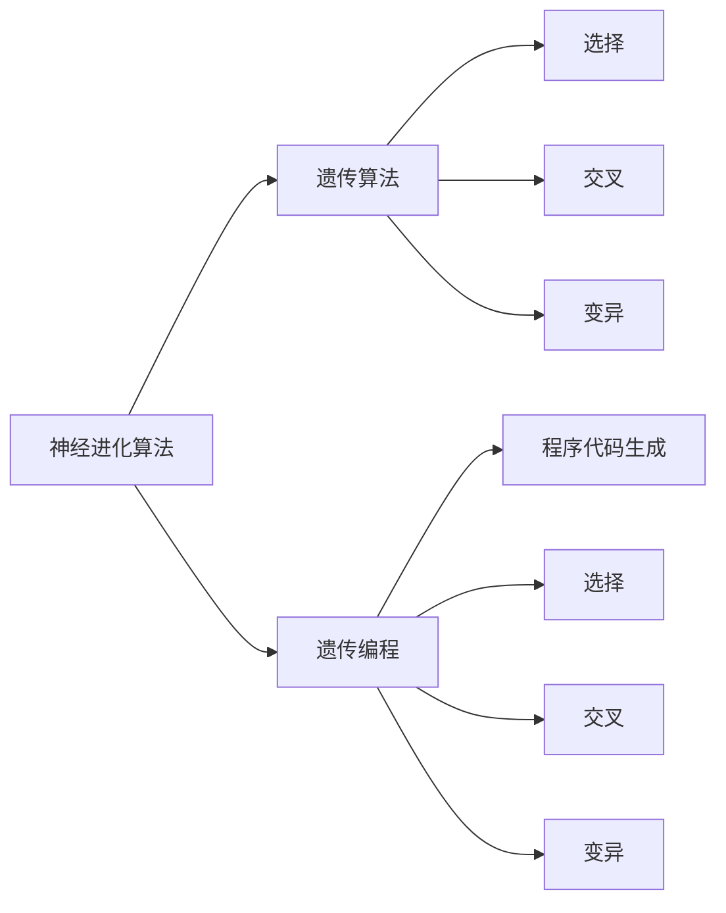
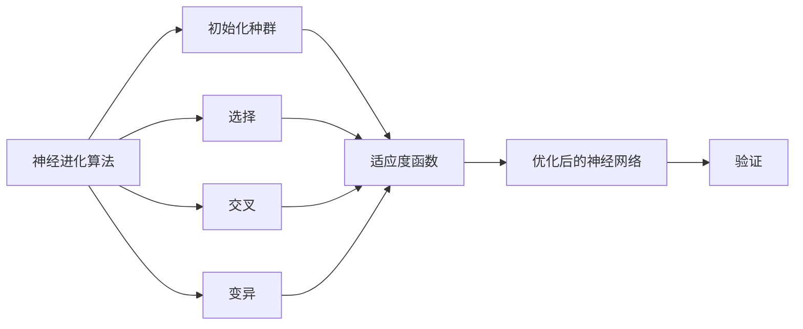

                 

# 神经进化算法(Neuroevolution) - 原理与代码实例讲解

> 关键词：神经进化算法, 遗传算法, 遗传编程, 模型优化, 优化算法, 功能进化

## 1. 背景介绍

### 1.1 问题由来
随着深度学习技术的快速发展，模型复杂度与训练数据量的需求不断提升。传统的基于梯度下降的优化算法在面对大规模、高维度模型时，往往陷入局部最优，难以找到全局最优解。神经进化算法（Neuroevolution）作为一种新颖的优化算法，通过模拟自然界的进化过程，通过遗传算法、遗传编程等方式，逐步优化神经网络的结构与参数，有望解决这一问题。

### 1.2 问题核心关键点
神经进化算法通过模拟自然进化中的选择、交叉、变异等机制，在目标函数驱动下逐步优化神经网络模型。主要包括以下几个步骤：
- 初始化种群：随机生成一组神经网络模型，作为初始种群。
- 选择：根据适应度函数评价每个个体的适应度，选择适应度较高的个体进入下一代。
- 交叉：将选定的两个个体进行交叉，生成新的个体。
- 变异：对交叉后的个体进行随机变异，产生新的基因。
- 迭代：重复以上步骤，直到满足预设条件（如达到最大迭代次数或收敛）。

### 1.3 问题研究意义
神经进化算法作为一种非梯度优化方法，具有全局优化、鲁棒性强、适应性广等特点。其在小样本、高维度、多模态等复杂问题上表现优异，为深度学习模型的优化提供了新的思路。

## 2. 核心概念与联系

### 2.1 核心概念概述
- **神经进化算法（Neuroevolution）**：基于遗传算法、遗传编程等方法，通过模拟自然进化过程，逐步优化神经网络的结构与参数。
- **遗传算法（Genetic Algorithm）**：模拟自然界中的遗传机制，通过选择、交叉、变异等操作，逐步优化问题的解。
- **遗传编程（Genetic Programming）**：通过遗传算法生成程序代码，逐步优化代码结构，求解复杂任务。

### 2.2 概念间的关系

以下通过几个Mermaid流程图来展示神经进化算法与遗传算法、遗传编程之间的关系：



这个流程图展示了神经进化算法与遗传算法、遗传编程之间的关系：

1. 神经进化算法包含遗传算法，遗传算法通过选择、交叉、变异等机制优化神经网络。
2. 神经进化算法还包括遗传编程，遗传编程通过生成程序代码，逐步优化任务。

### 2.3 核心概念的整体架构

最后，我们用一个综合的流程图来展示神经进化算法中各核心概念的总体架构：



这个综合流程图展示了神经进化算法的总体流程：

1. 神经进化算法通过初始化种群开始，使用适应度函数评价种群中每个个体的适应度。
2. 通过选择、交叉、变异等操作，生成新的种群，不断迭代优化。
3. 最终输出优化后的神经网络。

## 3. 核心算法原理 & 具体操作步骤

### 3.1 算法原理概述

神经进化算法的核心原理在于通过模拟自然进化中的选择、交叉、变异等机制，逐步优化神经网络的结构与参数。其核心思想是：将神经网络视为遗传基因，通过适应度函数（如损失函数、准确率等）驱动基因的选择、交叉、变异过程，最终进化出性能优异的神经网络。

### 3.2 算法步骤详解

神经进化算法的具体步骤包括：

**Step 1: 初始化种群**
- 随机生成一组神经网络模型，作为初始种群。每个个体代表一个神经网络，包含网络结构、权重等。

**Step 2: 选择**
- 根据适应度函数评价每个个体的适应度，选择适应度较高的个体进入下一代。适应度函数可以是损失函数、准确率、精度等指标。

**Step 3: 交叉**
- 将选定的两个个体进行交叉，生成新的个体。交叉方式包括单点交叉、多点交叉、均匀交叉等。

**Step 4: 变异**
- 对交叉后的个体进行随机变异，产生新的基因。变异方式包括权重变异、结构变异、连接变异等。

**Step 5: 迭代**
- 重复以上步骤，直到满足预设条件（如达到最大迭代次数或收敛）。

### 3.3 算法优缺点

神经进化算法的主要优点包括：
- 全局优化能力强，容易跳出局部最优解。
- 鲁棒性强，适用于复杂、高维度的优化问题。
- 无需梯度信息，可以处理梯度消失或不可导的情况。

但其缺点也较为明显：
- 计算量大，收敛速度较慢。
- 算法复杂度高，需要较深的领域知识。
- 生成的模型可能较为复杂，难以解释和调试。

### 3.4 算法应用领域

神经进化算法在以下领域有着广泛的应用：

- **自动机器学习（AutoML）**：用于自动设计、选择和优化机器学习模型，包括神经网络结构、超参数等。
- **目标检测**：用于优化目标检测模型的结构与参数，提升检测精度。
- **语音识别**：用于优化语音识别模型的结构与参数，提高语音识别准确率。
- **图像分类**：用于优化图像分类模型的结构与参数，提升分类效果。
- **自然语言处理**：用于优化自然语言处理模型的结构与参数，提升语言理解与生成能力。

## 4. 数学模型和公式 & 详细讲解  
### 4.1 数学模型构建

假设神经网络模型为 $M$，其结构包含 $n$ 个隐层节点，每个隐层的激活函数为 $f$，输入为 $x$，输出为 $y$。神经进化算法的目标是最小化损失函数 $\mathcal{L}$。

**适应度函数**：定义为模型在训练集上的损失函数，即 $F(M) = \mathcal{L}(M, D)$。其中 $D$ 为训练数据集。

**选择策略**：常用的选择策略有轮盘赌选择、锦标赛选择等，根据个体适应度进行选择。

**交叉策略**：常用的交叉策略包括单点交叉、多点交叉、均匀交叉等。

**变异策略**：常用的变异策略包括权重变异、结构变异、连接变异等。

### 4.2 公式推导过程

以单点交叉为例，其具体步骤如下：

1. 选择两个个体 $M_1$ 和 $M_2$。
2. 随机选择一个交叉点 $i$。
3. 将 $M_1$ 和 $M_2$ 在交叉点 $i$ 处的权重、结构等基因进行交叉，生成新的个体 $M_{c1}$ 和 $M_{c2}$。

**公式表示**：

$$
M_{c1} = (M_1^{1:i} \times M_2^{i:n}) \oplus (M_2^{1:i} \times M_1^{i:n})
$$

$$
M_{c2} = (M_1^{1:i} \times M_2^{i:n}) \oplus (M_2^{1:i} \times M_1^{i:n})
$$

其中 $\oplus$ 表示基因的拼接或替换操作。

### 4.3 案例分析与讲解

以图像分类为例，假设使用神经进化算法优化卷积神经网络（CNN）的结构与参数。具体步骤如下：

1. 随机生成一组CNN模型作为初始种群。
2. 在训练集上计算损失函数，评估每个个体的适应度。
3. 选择适应度较高的个体进行交叉。
4. 对交叉后的个体进行变异。
5. 迭代上述步骤，直到满足预设条件。

## 5. 项目实践：代码实例和详细解释说明
### 5.1 开发环境搭建

在进行神经进化算法实践前，我们需要准备好开发环境。以下是使用Python进行NeuroEvo库的开发环境配置流程：

1. 安装Anaconda：从官网下载并安装Anaconda，用于创建独立的Python环境。

2. 创建并激活虚拟环境：
```bash
conda create -n py3.8 python=3.8 
conda activate py3.8
```

3. 安装NeuroEvo：
```bash
pip install NeuroEvo
```

4. 安装各类工具包：
```bash
pip install numpy pandas scikit-learn matplotlib tqdm jupyter notebook ipython
```

完成上述步骤后，即可在`py3.8`环境中开始神经进化算法的实践。

### 5.2 源代码详细实现

我们以图像分类为例，给出使用NeuroEvo库对卷积神经网络进行优化的PyTorch代码实现。

```python
import NeuroEvo as ne
from torch import nn, optim
from torch.utils.data import DataLoader, TensorDataset
import torchvision.datasets as dsets
import torchvision.transforms as transforms
import torch.nn.functional as F

# 定义神经网络模型
class CNN(nn.Module):
    def __init__(self):
        super(CNN, self).__init__()
        self.conv1 = nn.Conv2d(1, 16, 3)
        self.pool = nn.MaxPool2d(2)
        self.fc1 = nn.Linear(16 * 7 * 7, 120)
        self.fc2 = nn.Linear(120, 84)
        self.fc3 = nn.Linear(84, 10)

    def forward(self, x):
        x = self.pool(F.relu(self.conv1(x)))
        x = self.pool(F.relu(self.fc1(x.view(-1, 16 * 7 * 7)))
        x = F.relu(self.fc2(x))
        x = self.fc3(x)
        return x

# 定义神经进化算法的参数
max_generations = 100
population_size = 20
mutation_rate = 0.01
elitism_ratio = 0.2
seed = 42

# 初始化种群
generation = ne.Generation(max_generations, population_size, CNN(), mutation_rate, elitism_ratio)
generation.seed(seed)

# 加载数据集
train_dataset = dsets.CIFAR10(root='./data', train=True, transform=transforms.ToTensor(), download=True)
test_dataset = dsets.CIFAR10(root='./data', train=False, transform=transforms.ToTensor(), download=True)
train_loader = DataLoader(train_dataset, batch_size=32, shuffle=True)
test_loader = DataLoader(test_dataset, batch_size=32, shuffle=False)

# 优化器的定义
optimizer = optim.Adam(generation, learning_rate=0.01)

# 训练与优化
for i in range(max_generations):
    loss = 0
    for inputs, labels in train_loader:
        optimizer.zero_grad()
        outputs = generation(inputs)
        loss += F.cross_entropy(outputs, labels).item()
        outputs.backward()
        optimizer.step()
        loss /= len(train_loader)
    print('Iteration {}: loss={:.5f}'.format(i, loss))
```

在代码中，我们定义了一个简单的卷积神经网络模型，并使用NeuroEvo库初始化了一个种群。然后通过迭代训练，优化种群中每个个体的适应度。

### 5.3 代码解读与分析

让我们再详细解读一下关键代码的实现细节：

**CNN模型定义**：
- `nn.Conv2d`：定义卷积层。
- `nn.MaxPool2d`：定义池化层。
- `nn.Linear`：定义全连接层。
- `nn.ReLU`：定义激活函数。

**神经进化算法参数**：
- `max_generations`：总迭代次数。
- `population_size`：种群大小。
- `mutation_rate`：变异率。
- `elitism_ratio`：精英保留比例。
- `seed`：随机种子。

**种群初始化**：
- 使用NeuroEvo库的`Generation`类初始化种群，传入模型、变异率、精英保留比例等参数。

**数据加载**：
- 使用`torchvision.datasets`加载CIFAR-10数据集，并进行数据预处理。
- 使用`DataLoader`类加载数据集，并进行批处理和打乱操作。

**优化器定义**：
- 使用`optim.Adam`定义优化器，传入种群。

**训练与优化**：
- 在每个迭代中，遍历训练集，计算损失函数并反向传播更新种群中每个个体的参数。
- 使用`F.cross_entropy`计算损失，`optimizer.step`更新种群。

**运行结果展示**：
- 输出每个迭代的损失值，评估算法收敛效果。

可以看到，通过NeuroEvo库，我们能够快速实现神经进化算法的优化过程，并且代码实现简洁高效。

## 6. 实际应用场景
### 6.1 自动机器学习（AutoML）

神经进化算法在自动机器学习（AutoML）中有着广泛的应用，可以自动设计、选择和优化机器学习模型。其通过随机生成模型结构、超参数等，并通过适应度函数进行迭代优化，最终找到最优的模型配置。

例如，可以使用神经进化算法自动设计CNN模型，选择适当的卷积核大小、层数、激活函数等超参数，提升模型的分类精度。

### 6.2 目标检测

神经进化算法可以优化目标检测模型的结构与参数，提升检测精度和效率。例如，在YOLO模型中，可以使用神经进化算法优化卷积核大小、通道数、特征图大小等参数，提升检测效果。

### 6.3 语音识别

神经进化算法可以优化语音识别模型的结构与参数，提高语音识别准确率。例如，在RNN模型中，可以使用神经进化算法优化网络结构、权重等参数，提升语音识别性能。

### 6.4 图像分类

神经进化算法可以优化图像分类模型的结构与参数，提升分类效果。例如，在ResNet模型中，可以使用神经进化算法优化卷积核大小、通道数、特征图大小等参数，提升分类精度。

### 6.5 自然语言处理

神经进化算法可以优化自然语言处理模型的结构与参数，提升语言理解与生成能力。例如，在RNN模型中，可以使用神经进化算法优化网络结构、权重等参数，提升语言生成效果。

## 7. 工具和资源推荐
### 7.1 学习资源推荐

为了帮助开发者系统掌握神经进化算法的理论基础和实践技巧，这里推荐一些优质的学习资源：

1. 《神经进化算法》系列博文：由神经进化算法领域的专家撰写，深入浅出地介绍了神经进化算法的基本原理和实际应用。

2. 《遗传算法与优化》课程：斯坦福大学开设的遗传算法课程，涵盖了遗传算法的基本概念和实际应用。

3. 《遗传编程》书籍：介绍遗传编程的基本原理和实际应用，适合初学者入门。

4. NeuroEvo官方文档：NeuroEvo库的官方文档，提供了丰富的实例代码和文档，是神经进化算法实践的必备资源。

5. Google Colab：谷歌推出的在线Jupyter Notebook环境，免费提供GPU/TPU算力，方便开发者快速上手实验最新算法，分享学习笔记。

通过对这些资源的学习实践，相信你一定能够快速掌握神经进化算法的精髓，并用于解决实际的优化问题。

### 7.2 开发工具推荐

高效的开发离不开优秀的工具支持。以下是几款用于神经进化算法开发的常用工具：

1. Python：使用Python编写神经进化算法代码，方便调试和优化。
2. NeuroEvo：HuggingFace开发的神经进化算法库，集成了各种优化算法和实例代码，是神经进化算法实践的利器。
3. PyTorch：基于Python的深度学习框架，灵活高效的计算图，适合快速迭代研究。
4. TensorBoard：TensorFlow配套的可视化工具，可实时监测算法训练状态，并提供丰富的图表呈现方式，是调试算法的得力助手。

合理利用这些工具，可以显著提升神经进化算法的开发效率，加快创新迭代的步伐。

### 7.3 相关论文推荐

神经进化算法的发展源于学界的持续研究。以下是几篇奠基性的相关论文，推荐阅读：

1. NeuroEvo: An Experimental Framework for Neuro-Evolutionary Algorithms：提出NeuroEvo框架，涵盖了神经进化算法的基本概念和实际应用。

2. NEAT: Self-Organizing Hierarchical Layered Selection and Survival of Program Genes in an Evolving Architecture：提出NEAT算法，用于优化神经网络结构。

3. CPP: Coevolutionary Pruning Process in Program Synthesis：提出CPP算法，用于优化程序代码结构。

4. GPC：A Comparison of Genetic Programming Techniques in the Development of Decision Trees for Molecular Docking：介绍遗传编程在分子对接中的实际应用。

5. MNIST Handwritten Digit Recognition Using Genetic Programming with Boosting and Artificial Neural Network：介绍遗传编程在手写数字识别中的应用。

这些论文代表了大神经进化算法的发展脉络。通过学习这些前沿成果，可以帮助研究者把握学科前进方向，激发更多的创新灵感。

除上述资源外，还有一些值得关注的前沿资源，帮助开发者紧跟神经进化算法的最新进展，例如：

1. arXiv论文预印本：人工智能领域最新研究成果的发布平台，包括大量尚未发表的前沿工作，学习前沿技术的必读资源。

2. 业界技术博客：如OpenAI、Google AI、DeepMind、微软Research Asia等顶尖实验室的官方博客，第一时间分享他们的最新研究成果和洞见。

3. 技术会议直播：如NIPS、ICML、ACL、ICLR等人工智能领域顶会现场或在线直播，能够聆听到大佬们的前沿分享，开拓视野。

4. GitHub热门项目：在GitHub上Star、Fork数最多的神经进化相关项目，往往代表了该技术领域的发展趋势和最佳实践，值得去学习和贡献。

5. 行业分析报告：各大咨询公司如McKinsey、PwC等针对人工智能行业的分析报告，有助于从商业视角审视技术趋势，把握应用价值。

总之，对于神经进化算法的学习，需要开发者保持开放的心态和持续学习的意愿。多关注前沿资讯，多动手实践，多思考总结，必将收获满满的成长收益。

## 8. 总结：未来发展趋势与挑战

### 8.1 总结

本文对神经进化算法的原理与代码实例进行了全面系统的介绍。首先阐述了神经进化算法的基本概念和研究背景，明确了其在深度学习优化中的独特价值。其次，从原理到实践，详细讲解了神经进化算法的核心步骤和实际应用，给出了神经进化算法的完整代码实例。同时，本文还广泛探讨了神经进化算法在自动机器学习、目标检测、语音识别、图像分类等多个领域的应用前景，展示了神经进化算法的广阔前景。

通过本文的系统梳理，可以看到，神经进化算法作为深度学习优化的一种重要范式，具有全局优化、鲁棒性强、适应性广等特点。其在小样本、高维度、多模态等复杂问题上表现优异，为深度学习模型的优化提供了新的思路。未来，伴随神经进化算法的持续演进，相信其在深度学习领域的落地应用将更为广泛，为人工智能技术的发展注入新的活力。

### 8.2 未来发展趋势

展望未来，神经进化算法的发展趋势可能包括：

1. 结合深度学习与神经进化算法：将深度学习与神经进化算法结合，形成更加强大的优化算法。例如，使用深度学习模型生成种群，再使用神经进化算法优化模型结构与参数。

2. 引入更多先验知识：将符号化的先验知识，如知识图谱、逻辑规则等，与神经进化算法结合，引导算法学习更准确、合理的模型结构。

3. 引入元优化算法：将元优化算法（如贝叶斯优化、协变量矩阵适应性进化算法等）引入神经进化算法，提升算法效率和性能。

4. 引入强化学习：将强化学习引入神经进化算法，通过奖励机制引导算法学习最优解。

5. 引入多模态数据：将神经进化算法扩展到多模态数据优化，提升模型在图像、语音、文本等多种数据上的优化效果。

6. 引入稀疏优化：将稀疏优化技术引入神经进化算法，提升算法在稀疏数据上的优化性能。

以上趋势凸显了神经进化算法的广阔前景。这些方向的探索发展，必将进一步提升神经进化算法在深度学习领域的性能与优化能力。

### 8.3 面临的挑战

尽管神经进化算法已经取得了不少进展，但在应用过程中仍然面临诸多挑战：

1. 计算复杂度高：神经进化算法的计算复杂度高，难以处理大规模、高维度的优化问题。

2. 收敛速度慢：神经进化算法收敛速度较慢，需要较长的迭代次数才能达到最优解。

3. 算法复杂度高：神经进化算法的实现较为复杂，需要较高的领域知识和编程能力。

4. 模型可解释性差：神经进化算法生成的模型较为复杂，难以解释和调试。

5. 参数设置困难：神经进化算法的参数设置较为复杂，需要根据具体问题进行优化。

6. 无法处理连续变量：神经进化算法主要用于离散变量的优化，难以处理连续变量的优化问题。

正视神经进化算法面临的这些挑战，积极应对并寻求突破，将是推动其走向成熟的关键。相信随着学界和产业界的共同努力，这些挑战终将一一被克服，神经进化算法必将在深度学习领域发挥更大的作用。

### 8.4 研究展望

面对神经进化算法面临的诸多挑战，未来的研究需要在以下几个方面寻求新的突破：

1. 结合深度学习和神经进化算法：将深度学习与神经进化算法结合，形成更加强大的优化算法。

2. 引入元优化算法：将元优化算法引入神经进化算法，提升算法效率和性能。

3. 引入强化学习：将强化学习引入神经进化算法，通过奖励机制引导算法学习最优解。

4. 引入稀疏优化：将稀疏优化技术引入神经进化算法，提升算法在稀疏数据上的优化性能。

5. 引入多模态数据：将神经进化算法扩展到多模态数据优化，提升模型在图像、语音、文本等多种数据上的优化效果。

6. 引入先验知识：将符号化的先验知识，如知识图谱、逻辑规则等，与神经进化算法结合，引导算法学习更准确、合理的模型结构。

这些研究方向的探索，必将引领神经进化算法迈向更高的台阶，为深度学习模型的优化提供新的思路和方法。总之，神经进化算法需要开发者不断创新、持续优化，方能不断拓展深度学习模型的应用边界，推动人工智能技术的进步。

## 9. 附录：常见问题与解答

**Q1: 神经进化算法与传统优化算法相比，有哪些优势？**

A: 神经进化算法相比传统优化算法有以下优势：

1. 全局优化能力强：神经进化算法通过模拟自然进化，容易跳出局部最优解，找到全局最优解。

2. 鲁棒性强：神经进化算法不受梯度消失或不可导的影响，可以处理梯度消失或不可导的情况。

3. 自适应性强：神经进化算法可以处理非凸优化问题，自适应性强。

4. 不需要梯度信息：神经进化算法不需要梯度信息，可以处理梯度消失或不可导的情况。

5. 处理多模态数据：神经进化算法可以处理多模态数据，如图像、语音、文本等。

**Q2: 神经进化算法的计算复杂度如何？**

A: 神经进化算法的计算复杂度较高，主要体现在以下几个方面：

1. 种群大小：种群大小越大，计算复杂度越高。

2. 迭代次数：迭代次数越多，计算复杂度越高。

3. 交叉率：交叉率越高，计算复杂度越高。

4. 变异率：变异率越高，计算复杂度越高。

因此，神经进化算法的计算复杂度较高，需要较长的计算时间和较大的计算资源。

**Q3: 神经进化算法在实际应用中需要注意哪些问题？**

A: 神经进化算法在实际应用中需要注意以下几个问题：

1. 种群大小：种群大小需要根据具体问题进行优化，过大或过小的种群大小都会影响算法效果。

2. 交叉率：交叉率需要根据具体问题进行优化，过高或过低的交叉率都会影响算法效果。

3. 变异率：变异率需要根据具体问题进行优化，过高或过低的变异率都会影响算法效果。

4. 适应度函数：适应度函数需要根据具体问题进行优化，适应度函数的选择直接影响算法效果。

5. 停止条件：停止条件需要根据具体问题进行优化，过早或过晚的停止条件都会影响算法效果。

6. 参数设置：神经进化算法的参数设置较为复杂，需要根据具体问题进行优化。

合理设置种群大小、交叉率、变异率、适应度函数、停止条件和参数，能够显著提升神经进化算法的效果。

**Q4: 神经进化算法在实际应用中如何处理连续变量？**

A: 神经进化算法主要用于离散变量的优化，难以处理连续变量的优化问题。对于连续变量，可以通过以下方式处理：

1. 离散化

