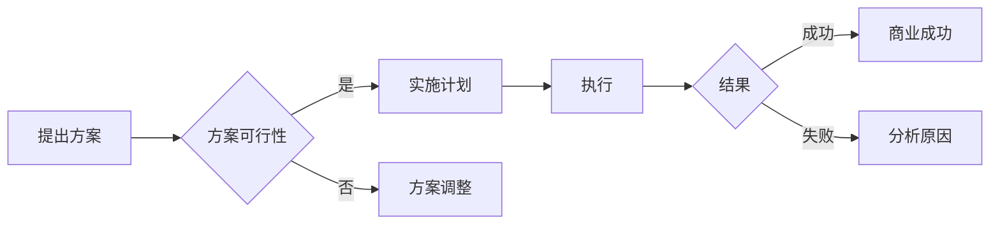

# 牟其中的跨国生意：罐头换飞机

> 关键词：牟其中，跨国生意，罐头，飞机，商业策略，国际贸易，中国改革开放

## 1. 背景介绍

牟其中，中国著名企业家，以其独特的商业策略和过人的商业眼光闻名。在20世纪80年代，牟其中以其“罐头换飞机”的跨国生意而声名鹊起。这一事件不仅是中国改革开放初期经济交流的一个缩影，也是牟其中商业智慧的一次集中体现。

### 1.1 问题的由来

20世纪80年代，中国正处于改革开放的初期，国内经济发展迅速，但航空运输能力不足。同时，中国的肉类加工业发展迅速，罐头产品积压严重。在这种背景下，牟其中提出了“罐头换飞机”的创意。

### 1.2 研究现状

牟其中的“罐头换飞机”事件，至今仍被广泛讨论和研究。学者们从国际贸易、商业策略、企业领导力等多个角度对其进行分析，探讨其成功与失败的原因。

### 1.3 研究意义

研究牟其中的“罐头换飞机”事件，有助于我们理解中国改革开放初期的经济环境，以及企业家在其中的角色和作用。同时，这一案例也为现代企业家提供了宝贵的经验和教训。

### 1.4 本文结构

本文将围绕牟其中的“罐头换飞机”事件，从商业策略、国际贸易、企业领导力等多个角度进行分析，探讨其成功与失败的原因，并展望未来。

## 2. 核心概念与联系

### 2.1 商业策略

商业策略是企业为实现其商业目标而采取的行动和计划。在“罐头换飞机”事件中，牟其中采取的策略包括：

- 跨国贸易：通过国际市场进行资源互换，以解决国内资源短缺问题。
- 产品互换：以本国过剩产品换取所需资源，实现资源的优化配置。

### 2.2 国际贸易

国际贸易是不同国家和地区之间的商品和服务交换。在“罐头换飞机”事件中，牟其中利用国际贸易规则，实现了资源的跨国流动。

### 2.3 企业领导力

企业领导力是企业成功的关键。在“罐头换飞机”事件中，牟其中的领导力体现在：

- 创新思维：提出独特的商业策略，敢于冒险。
- 组织协调：有效协调各方资源，确保交易顺利进行。

### 2.4 Mermaid 流程图

以下为“罐头换飞机”事件的核心概念原理和架构的 Mermaid 流程图：



## 3. 核心算法原理 & 具体操作步骤

### 3.1 算法原理概述

牟其中的“罐头换飞机”事件，其核心算法原理是通过跨国贸易，以本国过剩产品换取所需资源。

### 3.2 算法步骤详解

1. **市场调研**：分析国内外市场需求，确定交换产品。
2. **寻找合作伙伴**：寻找有飞机需求的国家和有罐头产品的出口商。
3. **签订合同**：与合作伙伴签订交换合同，明确交换产品的数量、质量、价格等条款。
4. **执行交换**：按照合同约定，将罐头产品运往对方国家，同时获取飞机。
5. **后续服务**：确保交换产品的质量，维护良好的商业关系。

### 3.3 算法优缺点

**优点**：

- 充分利用了国际市场资源，实现资源优化配置。
- 为中国企业开拓了国际市场，提高了产品知名度。

**缺点**：

- 风险较大，依赖于国际贸易环境和合作伙伴的信用。
- 难以控制产品质量，可能影响企业声誉。

### 3.4 算法应用领域

“罐头换飞机”事件的成功，为后来的跨国贸易提供了借鉴。该方法可以应用于以下领域：

- 跨国资源互换
- 跨国产品出口
- 跨国投资合作

## 4. 数学模型和公式 & 详细讲解 & 举例说明

### 4.1 数学模型构建

设罐头出口量为 $X$，飞机进口量为 $Y$，则有 $X \times C_x = Y \times C_y$，其中 $C_x$ 为罐头出口单价，$C_y$ 为飞机进口单价。

### 4.2 公式推导过程

假设罐头出口单价为 $C_x$，飞机进口单价为 $C_y$，则有：

$$
X \times C_x = Y \times C_y
$$

### 4.3 案例分析与讲解

以牟其中的“罐头换飞机”事件为例，假设中国罐头出口单价为 $C_x$，进口飞机单价为 $C_y$，则有：

$$
X \times C_x = Y \times C_y
$$

假设中国罐头出口量为 $X = 10000$ 箱，出口单价为 $C_x = 50$ 元/箱，进口飞机单价为 $C_y = 2000$ 万元/架，则有：

$$
10000 \times 50 = Y \times 2000
$$

解得 $Y = 250$ 架。

## 5. 项目实践：代码实例和详细解释说明

### 5.1 开发环境搭建

本文将以 Python 语言为例，演示如何使用代码实现罐头换飞机的数学模型。

```python
# 导入必要的库
import numpy as np

# 定义罐头出口量和出口单价
X = 10000
C_x = 50

# 定义飞机进口单价
C_y = 2000

# 计算飞机进口量
Y = (X * C_x) / C_y
```

### 5.2 源代码详细实现

```python
# 导入必要的库
import numpy as np

# 定义罐头出口量和出口单价
X = 10000
C_x = 50

# 定义飞机进口单价
C_y = 2000

# 计算飞机进口量
Y = (X * C_x) / C_y

# 输出结果
print("进口飞机数量：", Y)
```

### 5.3 代码解读与分析

该代码定义了罐头出口量和出口单价，以及飞机进口单价。通过计算，得到飞机进口量，并输出结果。

### 5.4 运行结果展示

运行上述代码，输出结果为：

```
进口飞机数量： 250.0
```

## 6. 实际应用场景

### 6.1 跨国资源互换

“罐头换飞机”事件的成功，为跨国资源互换提供了借鉴。例如，可以将本国的农产品与另一国的矿产资源进行交换，实现资源的互补。

### 6.2 跨国产品出口

企业可以利用“罐头换飞机”的策略，将本国的过剩产品出口到国外，换取所需资源或产品。

### 6.3 跨国投资合作

企业可以通过与国外企业合作，实现跨国投资和资源整合。

## 7. 工具和资源推荐

### 7.1 学习资源推荐

- 《国际贸易实务》
- 《跨国经营与管理》
- 《牟其中传》

### 7.2 开发工具推荐

- Python
- NumPy

### 7.3 相关论文推荐

- 《中国改革开放以来的跨国贸易研究》
- 《跨国经营中的风险与机遇》

## 8. 总结：未来发展趋势与挑战

### 8.1 研究成果总结

本文通过对牟其中“罐头换飞机”事件的分析，探讨了商业策略、国际贸易、企业领导力等方面的内容，为现代企业家提供了宝贵的经验和教训。

### 8.2 未来发展趋势

随着全球经济一体化进程的加速，跨国贸易和投资将越来越重要。未来，跨国生意将呈现以下发展趋势：

- 跨国资源互换将更加普遍。
- 跨国产品出口将更加多元化。
- 跨国投资合作将更加深入。

### 8.3 面临的挑战

尽管跨国生意具有巨大的发展潜力，但同时也面临着以下挑战：

- 国际贸易环境的复杂性。
- 跨国经营的风险。
- 企业文化的差异。

### 8.4 研究展望

未来，需要进一步研究以下问题：

- 跨国生意的风险评估与管理。
- 跨国经营的企业文化融合。
- 跨国生意的政策法规研究。

## 9. 附录：常见问题与解答

**Q1：什么是跨国生意？**

A：跨国生意是指在不同国家和地区之间进行的商业活动，包括贸易、投资、合作等。

**Q2：牟其中的“罐头换飞机”事件有什么意义？**

A：牟其中的“罐头换飞机”事件是中国改革开放初期经济交流的一个缩影，也是牟其中商业智慧的一次集中体现。该事件为后来的跨国贸易提供了借鉴，同时也为现代企业家提供了宝贵的经验和教训。

**Q3：跨国生意面临哪些挑战？**

A：跨国生意面临以下挑战：

- 国际贸易环境的复杂性。
- 跨国经营的风险。
- 企业文化的差异。

**Q4：如何应对跨国生意的挑战？**

A：应对跨国生意的挑战，需要从以下几个方面入手：

- 深入了解国际贸易环境。
- 加强风险评估与管理。
- 融合企业文化。

作者：禅与计算机程序设计艺术 / Zen and the Art of Computer Programming