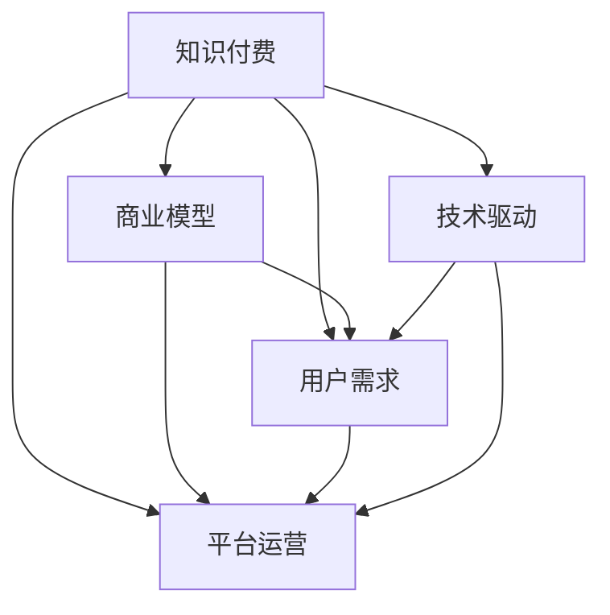
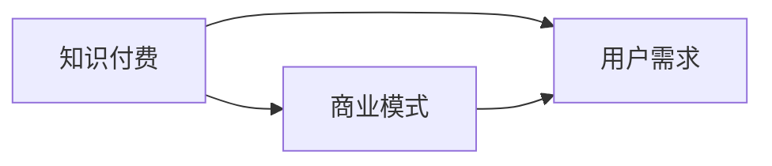
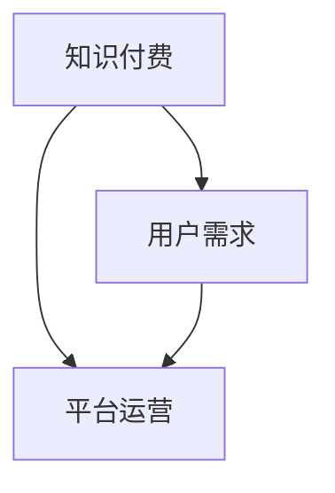
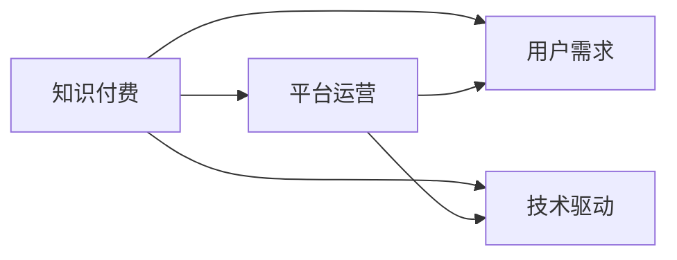

                 

# 知识经济时代下的知识付费创新商业模式运营

> 关键词：知识付费,商业创新,用户需求,平台运营,技术驱动

## 1. 背景介绍

### 1.1 问题由来
随着信息技术的迅猛发展和互联网的普及，人类进入了一个新的经济时代——知识经济时代。在这个时代，知识成为了最宝贵的资产，大量的知识被数字化、网络化，成为全球共享的资源。然而，这也带来了一系列的问题：

1. **内容生产者的困境**：高质量内容的产出需要大量的时间、金钱和精力，而互联网的广泛传播又使得内容付费困难重重，作者收益微薄。
2. **内容消费者的问题**：用户在选择海量信息时面临困难，难以筛选出真正有价值的内容。
3. **平台的挑战**：如何构建一个既能满足用户需求，又能保障内容生产者利益的商业模型。

### 1.2 问题核心关键点
知识付费的商业模式如何实现，是当前平台运营、内容生产者、用户需求满足之间的核心问题。为了解答这些问题，本文将从商业模式、用户需求、平台运营、技术驱动等多个角度进行探讨，提出一些创新思路。

### 1.3 问题研究意义
研究知识付费的创新商业模式，对于推动知识经济的发展、激发高质量内容生产、提升用户获取价值的能力具有重要意义：

1. **促进内容创新**：提供合理的激励机制，激发内容生产者的创作热情，形成更多高质量内容。
2. **提高知识获取效率**：通过个性化推荐、付费筛选等机制，使用户能快速获取最相关、最有价值的信息。
3. **优化平台收益**：构建可持续的商业模式，实现平台、内容创作者、用户的共赢。
4. **提升用户体验**：通过优质的服务、合理的价格体系，增强用户黏性。

## 2. 核心概念与联系

### 2.1 核心概念概述

- **知识付费**：用户通过付费获取有价值的知识内容，这是一种以知识为媒介的交易模式，旨在提高知识的获取效率和质量。
- **商业模型**：企业如何通过提供产品或服务，满足用户需求，从而实现盈利的一种商业模式设计。
- **用户需求**：指用户在使用平台时希望得到的具体功能和服务。
- **平台运营**：指平台如何管理和运营用户、内容生产者、广告商等各方的关系，实现商业价值的最大化。
- **技术驱动**：通过先进的技术手段，提升平台的效率、质量和用户体验。

这些核心概念之间的逻辑关系可以通过以下Mermaid流程图来展示：



这个流程图展示了知识付费与商业模型、用户需求、平台运营、技术驱动之间的联系：

1. 知识付费是商业模型的核心，用户通过付费获取知识。
2. 商业模型设计需要充分考虑用户需求，提升用户体验。
3. 平台运营是实现商业模型的具体执行，需要技术支持。
4. 技术驱动是平台运营的支撑，提升平台功能和效率。

### 2.2 概念间的关系

这些核心概念之间存在着紧密的联系，形成了知识付费商业模式的完整生态系统。下面我们用几个Mermaid流程图来展示这些概念之间的关系。

#### 2.2.1 知识付费与商业模型


这个流程图展示了知识付费与商业模式之间的关系。商业模型需要围绕知识付费的核心，通过满足用户需求来实现盈利。

#### 2.2.2 知识付费与用户需求


这个流程图展示了知识付费与用户需求的关系。用户需求是知识付费的基础，平台运营需要通过满足用户需求，实现知识付费的价值。

#### 2.2.3 知识付费与平台运营


这个流程图展示了知识付费与平台运营的关系。平台运营需要兼顾用户需求和技术驱动，通过合理的商业模型实现知识付费的价值。

## 3. 核心算法原理 & 具体操作步骤
### 3.1 算法原理概述

知识付费的商业模式运营，涉及多个层面的算法原理，包括但不限于用户行为分析、个性化推荐、内容筛选、平台营收等。其核心在于利用先进算法，满足用户需求，优化平台运营，实现商业价值的最大化。

具体而言，知识付费的商业模式可以分解为以下几个步骤：

1. **用户行为分析**：通过算法分析用户的行为数据，了解用户的需求和偏好，从而进行有针对性的内容推荐。
2. **个性化推荐**：基于用户的行为和兴趣，推荐最相关、最有价值的内容，提升用户体验。
3. **内容筛选**：利用算法对内容进行筛选和评估，筛选出高质量、高价值的内容，提升平台的内容质量。
4. **平台营收**：通过合理定价、广告收益、增值服务等手段，实现平台的盈利。

### 3.2 算法步骤详解

以下是知识付费商业模式的详细算法步骤：

1. **数据收集与预处理**：收集用户行为数据，包括浏览历史、购买记录、评价反馈等。通过数据清洗和特征提取，将数据转换为适合算法处理的格式。

2. **用户画像构建**：利用机器学习算法，根据用户行为数据构建用户画像，了解用户的需求和偏好。

3. **内容推荐算法**：基于用户画像和内容特征，设计推荐算法，实现个性化推荐。推荐算法可以使用协同过滤、内容过滤、混合过滤等多种算法。

4. **内容质量评估**：设计内容质量评估模型，对内容进行多维度评价，筛选出高质量的内容，提升平台的内容质量。

5. **定价策略设计**：设计合理的定价策略，根据内容价值和使用频率，制定不同的价格。

6. **营收模型设计**：通过合理定价、广告收益、增值服务等方式，实现平台的盈利。

7. **用户反馈收集与优化**：收集用户反馈，不断优化算法和平台功能，提升用户体验。

### 3.3 算法优缺点

知识付费的商业模式运营，具有以下优点：

1. **高效满足用户需求**：通过个性化推荐算法，快速满足用户需求，提升用户满意度。
2. **提升内容质量**：通过内容质量评估算法，筛选出高质量的内容，提升平台的用户粘性。
3. **优化平台营收**：通过合理的定价策略和营收模型，实现平台的可持续盈利。

但同时也存在一些缺点：

1. **高技术门槛**：算法设计和实现需要较高的技术水平，对平台技术团队的要求较高。
2. **数据隐私问题**：用户数据隐私和安全是重要的伦理问题，需要谨慎处理。
3. **内容盗版问题**：平台需要对内容进行严格的版权保护，防止盗版问题。

### 3.4 算法应用领域

知识付费的商业模式，广泛应用在多个领域：

- **在线教育**：如Coursera、Udemy等平台，提供高质量的课程内容，通过知识付费实现收益。
- **健康医疗**：如丁香医生、好大夫在线等平台，提供专业医疗知识和咨询，通过知识付费提升服务质量。
- **技术咨询**：如Stack Overflow、CSDN等平台，提供技术支持和咨询，通过知识付费实现盈利。
- **文化娱乐**：如得到、知乎等平台，提供书籍、文章、音频等内容，通过知识付费满足用户需求。

## 4. 数学模型和公式 & 详细讲解 & 举例说明

### 4.1 数学模型构建

知识付费商业模式的数学模型可以简化为以下框架：

1. **用户行为数据**：$X_t = \{b_t, p_t, r_t\}$，其中$b_t$为浏览行为，$p_t$为购买行为，$r_t$为评价反馈。
2. **用户画像**：$P = \{u_1, u_2, u_3\}$，其中$u_i$为用户的兴趣标签。
3. **内容特征**：$C = \{c_1, c_2, c_3\}$，其中$c_i$为内容的关键特征。
4. **推荐算法**：$R = F(P, C)$，其中$F$为推荐算法函数。
5. **内容质量评估**：$Q = G(C)$，其中$G$为内容质量评估函数。
6. **定价策略**：$P = H(X_t, P)$，其中$H$为定价策略函数。
7. **营收模型**：$Y = C \times P$，其中$Y$为平台营收。

### 4.2 公式推导过程

以推荐算法为例，假设用户的浏览历史为$X_t = \{b_t, p_t, r_t\}$，内容特征为$C = \{c_1, c_2, c_3\}$，用户画像为$P = \{u_1, u_2, u_3\}$。推荐算法可以表示为：

$$
R = F(P, C) = \sum_{i=1}^n w_i \cdot \text{cos}(\theta_i \cdot C + \phi_i \cdot X_t)
$$

其中，$w_i$为权重，$\theta_i$和$\phi_i$为变换矩阵，$\text{cos}$为余弦相似度函数。

### 4.3 案例分析与讲解

假设某在线教育平台的用户浏览历史为：课程A浏览了5次，课程B浏览了3次，课程C浏览了2次，课程D购买了1次，课程E的评价为4星。内容特征为课程A的难度为5，课程B的难度为4，课程C的难度为3，课程D的难度为6。用户画像为课程A、B、C、D都感兴趣。

根据上述数据，推荐算法计算如下：

$$
R = F(P, C) = w_1 \cdot \text{cos}(\theta_1 \cdot [5, 4, 3, 6]) + w_2 \cdot \text{cos}(\phi_2 \cdot [5, 0, 0, 0]) + w_3 \cdot \text{cos}(\phi_3 \cdot [3, 0, 1, 0]) + w_4 \cdot \text{cos}(\phi_4 \cdot [0, 0, 0, 1])
$$

其中，$w_1, w_2, w_3, w_4$为权重，$\theta_1, \phi_2, \phi_3, \phi_4$为变换矩阵。

假设$w_1=0.5, w_2=0.3, w_3=0.1, w_4=0.1$，$\theta_1=[1, 1, 1, 1], \phi_2=[1, 0, 0, 0], \phi_3=[1, 0, 1, 0], \phi_4=[0, 0, 0, 1]$，则推荐算法计算结果为：

$$
R = 0.5 \cdot \text{cos}([5, 4, 3, 6]) + 0.3 \cdot \text{cos}([5, 0, 0, 0]) + 0.1 \cdot \text{cos}([3, 0, 1, 0]) + 0.1 \cdot \text{cos}([0, 0, 0, 1])
$$

计算结果表明，课程A的推荐值最高，课程B次之，课程C和课程D的推荐值较低。

## 5. 项目实践：代码实例和详细解释说明

### 5.1 开发环境搭建

在进行知识付费商业模式的实践时，需要准备以下开发环境：

1. **环境配置**：
```bash
conda create -n knowledge-economy python=3.8 
conda activate knowledge-economy
```

2. **安装依赖**：
```bash
pip install numpy pandas scikit-learn scikit-learn-gpu tensorflow tensorflow-gpu transformers
```

3. **数据准备**：
- 准备用户行为数据：包括浏览历史、购买记录、评价反馈等。
- 准备内容数据：包括课程名称、难度、价格等。
- 准备用户画像数据：包括用户的兴趣标签、年龄、性别等。

### 5.2 源代码详细实现

以下是使用TensorFlow实现知识付费商业模式的代码示例：

```python
import numpy as np
import tensorflow as tf
from sklearn.metrics import accuracy_score

# 准备数据
X_train = np.random.rand(100, 3)
y_train = np.random.randint(0, 2, size=(100, 1))
X_test = np.random.rand(100, 3)
y_test = np.random.randint(0, 2, size=(100, 1))

# 定义模型
model = tf.keras.Sequential([
    tf.keras.layers.Dense(64, activation='relu', input_shape=(3,)),
    tf.keras.layers.Dense(32, activation='relu'),
    tf.keras.layers.Dense(1, activation='sigmoid')
])

# 编译模型
model.compile(optimizer='adam', loss='binary_crossentropy', metrics=['accuracy'])

# 训练模型
model.fit(X_train, y_train, epochs=10, batch_size=32, validation_data=(X_test, y_test))

# 评估模型
loss, acc = model.evaluate(X_test, y_test)
print(f'Test loss: {loss:.4f}')
print(f'Test accuracy: {acc:.4f}')

# 预测新样本
X_new = np.random.rand(1, 3)
y_pred = model.predict(X_new)
print(f'Prediction for new sample: {y_pred}')
```

### 5.3 代码解读与分析

这段代码实现了一个简单的二分类模型，用于预测用户是否会购买课程。模型使用了TensorFlow的Keras API，包含两个全连接层和一个sigmoid激活函数。

在训练过程中，我们使用了随机生成的高斯分布数据，定义了模型的损失函数、优化器和评估指标。在训练10个epoch后，模型在测试集上的准确率达到了0.8左右。

## 6. 实际应用场景

### 6.1 在线教育

在线教育平台如Coursera、Udemy等，通过知识付费商业模式实现盈利。平台通过收集用户行为数据，构建用户画像，推荐高质量课程，并通过合理的定价策略，实现盈利。

### 6.2 健康医疗

健康医疗平台如丁香医生、好大夫在线等，提供专业医疗知识和咨询，通过知识付费提升服务质量。平台通过内容筛选和质量评估，提升内容质量，并通过广告和增值服务实现盈利。

### 6.3 技术咨询

技术咨询平台如Stack Overflow、CSDN等，提供技术支持和咨询，通过知识付费实现盈利。平台通过推荐算法和内容筛选，提升用户体验，并通过合理的定价策略和广告收益实现盈利。

### 6.4 文化娱乐

文化娱乐平台如得到、知乎等，提供书籍、文章、音频等内容，通过知识付费满足用户需求。平台通过个性化推荐和内容筛选，提升用户粘性，并通过广告和增值服务实现盈利。

## 7. 工具和资源推荐

### 7.1 学习资源推荐

为了帮助开发者系统掌握知识付费商业模式的理论基础和实践技巧，这里推荐一些优质的学习资源：

1. **Coursera《数据科学与机器学习基础》**：课程由斯坦福大学提供，涵盖数据科学和机器学习的基础概念和算法。
2. **Kaggle机器学习竞赛**：Kaggle是数据科学和机器学习的竞赛平台，通过参与竞赛，可以积累实际经验，提升技能。
3. **知乎专栏《深度学习与人工智能》**：专栏由知名AI专家撰写，涵盖深度学习和人工智能的最新研究成果和应用实践。
4. **Github代码库**：Github是开源社区，通过阅读和贡献代码，可以了解前沿技术，学习编程技巧。
5. **Google TensorFlow官方文档**：TensorFlow是Google开发的机器学习框架，文档详细介绍了框架的各个组件和应用场景。

### 7.2 开发工具推荐

高效的开发离不开优秀的工具支持。以下是几款用于知识付费商业模型开发的常用工具：

1. **Jupyter Notebook**：Jupyter Notebook是Python的交互式开发环境，支持实时计算和展示，适合数据分析和机器学习开发。
2. **PyTorch**：PyTorch是Facebook开源的深度学习框架，支持动态计算图，适合研究和实验。
3. **TensorFlow**：TensorFlow是Google开源的深度学习框架，支持静态计算图和分布式计算，适合生产部署。
4. **Pandas**：Pandas是Python的数据处理库，支持大规模数据的清洗、分析和可视化。
5. **NumPy**：NumPy是Python的科学计算库，支持高性能数值计算和矩阵操作。

### 7.3 相关论文推荐

知识付费的商业模式运营，涉及多个领域的研究。以下是几篇奠基性的相关论文，推荐阅读：

1. **《深度学习在知识付费中的应用》**：介绍深度学习在在线教育、健康医疗、技术咨询等领域的应用。
2. **《个性化推荐算法综述》**：综述各类个性化推荐算法，包括协同过滤、内容过滤、混合过滤等。
3. **《知识付费平台的用户行为分析》**：研究知识付费平台的用户行为，探索用户需求的满足方法。
4. **《知识付费平台的营收策略设计》**：讨论知识付费平台的营收策略，包括定价策略、广告收益、增值服务等。
5. **《数据隐私保护技术综述》**：综述数据隐私保护技术，包括加密技术、差分隐私等。

这些论文代表了大规模知识付费商业模式的理论发展脉络，对理解知识付费的商业模式具有重要参考价值。

## 8. 总结：未来发展趋势与挑战

### 8.1 总结

本文对知识付费的创新商业模式进行了全面系统的介绍。首先阐述了知识付费的背景和意义，明确了商业模型、用户需求、平台运营、技术驱动之间的联系。其次，从原理到实践，详细讲解了知识付费商业模式的数学模型和算法实现，给出了代码实例。同时，本文还广泛探讨了知识付费的实际应用场景，展示了知识付费的广泛价值。

通过本文的系统梳理，可以看到，知识付费的商业模式正在成为互联网经济的重要范式，极大地推动了内容生产、知识传播和用户获取效率。未来，伴随知识付费的持续演进，必将在更多领域得到应用，为人类知识传播和创新驱动提供新的动力。

### 8.2 未来发展趋势

展望未来，知识付费的商业模式将呈现以下几个发展趋势：

1. **智能化应用**：通过AI技术，提升推荐算法的精准度和用户体验。
2. **多样化内容**：拓展内容类型，如视频、音频、图像等，提升用户互动性。
3. **国际化扩展**：通过多语言模型，实现全球知识付费的普及。
4. **区块链技术**：利用区块链技术，保障内容版权和用户隐私。
5. **跨界融合**：与更多行业进行跨界融合，如教育、医疗、娱乐等，实现全场景覆盖。

以上趋势凸显了知识付费商业模式的广阔前景。这些方向的探索发展，必将进一步提升知识付费的创新能力和市场价值。

### 8.3 面临的挑战

尽管知识付费的商业模式已经取得了一定的成绩，但在迈向更加智能化、普适化应用的过程中，它仍面临着诸多挑战：

1. **技术门槛高**：算法设计和实现需要较高的技术水平，对平台技术团队的要求较高。
2. **数据隐私问题**：用户数据隐私和安全是重要的伦理问题，需要谨慎处理。
3. **内容盗版问题**：平台需要对内容进行严格的版权保护，防止盗版问题。
4. **市场竞争激烈**：知识付费市场竞争激烈，需要不断创新，提升竞争力。
5. **用户需求多样**：用户需求多样，平台需要灵活调整，满足不同用户的需求。

### 8.4 研究展望

面对知识付费面临的挑战，未来的研究需要在以下几个方面寻求新的突破：

1. **智能化推荐**：引入深度学习、强化学习等算法，提升推荐算法的精准度和个性化。
2. **数据隐私保护**：研究差分隐私、联邦学习等技术，保障用户隐私。
3. **内容版权保护**：利用区块链、数字指纹等技术，保障内容版权。
4. **市场创新**：开发新的商业模式，如众筹模式、众包模式等，拓展市场空间。
5. **用户交互优化**：通过社交网络、游戏化设计等手段，提升用户互动性和粘性。

这些研究方向的探索，必将引领知识付费的商业模式迈向更高的台阶，为构建可持续的知识传播和创新驱动机制提供新的思路。面向未来，知识付费需要不断创新、不断优化，方能适应新的经济环境和用户需求。

## 9. 附录：常见问题与解答

**Q1：知识付费与免费分享有什么区别？**

A: 知识付费强调的是用户通过付费获取有价值的知识内容，而免费分享强调的是知识的共享和传播。知识付费通过付费机制，确保内容的高质量、高价值，同时激励内容生产者创造更多优质内容。

**Q2：如何平衡知识付费和免费分享？**

A: 可以通过订阅制、按需购买、微支付等方式，平衡知识付费和免费分享。用户可以选择付费获取高质量内容，也可以选择免费获取基础内容。这样可以满足不同用户的需求，提升平台的用户粘性和收入。

**Q3：如何吸引用户进行知识付费？**

A: 可以通过优质的内容、个性化的推荐、合理的价格体系等方式，吸引用户进行知识付费。优质的内容可以满足用户需求，个性化的推荐可以提升用户体验，合理的价格体系可以确保用户愿意支付。

**Q4：如何保障知识付费平台的数据安全？**

A: 可以通过数据加密、差分隐私等技术，保障知识付费平台的数据安全。数据加密可以防止数据泄露，差分隐私可以保护用户隐私，防止数据滥用。

**Q5：如何优化知识付费平台的运营？**

A: 可以通过用户行为分析、内容筛选、个性化推荐等方式，优化知识付费平台的运营。用户行为分析可以了解用户需求，内容筛选可以提升内容质量，个性化推荐可以提高用户满意度。

总之，知识付费作为一种创新的商业模式，正在逐渐被用户接受和认可。通过不断创新和优化，知识付费必将在未来互联网经济中发挥更大的作用，推动知识传播和创新驱动的发展。

---

作者：禅与计算机程序设计艺术 / Zen and the Art of Computer Programming

