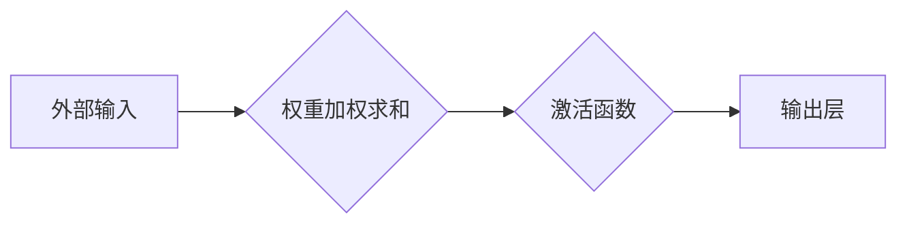

> 神经网络，深度学习，人工智能，机器学习，人机交互，认知建模

# 神经网络：人类与机器的共存

在信息爆炸的时代，人工智能（AI）技术已成为推动社会进步的重要力量。其中，神经网络作为一种模拟人类大脑处理信息方式的计算模型，为AI领域带来了革命性的变革。本文将深入探讨神经网络的核心概念、算法原理、应用场景以及未来发展趋势，旨在展示人类与机器共存的美好愿景。

## 1. 背景介绍

### 1.1 人工智能的兴起

人工智能（AI）作为计算机科学的一个重要分支，旨在使计算机能够模拟、延伸和扩展人的智能。自20世纪50年代以来，人工智能经历了多个发展阶段，其中最具代表性的包括：

- 第一个时期：1956年，达特茅斯会议将人工智能定义为“使机器具有智能的科学和工程”。这一时期的研究主要集中在知识表示、推理和规划等方面。
- 第二个时期：1974年至1980年，专家系统（Expert Systems）成为研究热点。专家系统通过模拟专家知识，在特定领域内提供决策支持。
- 第三个时期：1980年代末至2000年代初，机器学习（Machine Learning）兴起，通过算法让机器从数据中学习，自动识别模式和做出预测。
- 第四个时期：2010年以来，深度学习（Deep Learning）的快速发展，使得AI技术取得了突破性进展，如图像识别、语音识别、自然语言处理等领域。

### 1.2 神经网络的崛起

神经网络作为一种模拟人类大脑处理信息方式的计算模型，在深度学习时代崭露头角。与传统机器学习方法相比，神经网络具有以下优势：

- 能够自动学习数据的复杂特征，无需人工设计特征。
- 具有强大的泛化能力，能够处理复杂、非结构化数据。
- 能够模拟人脑的层次化处理方式，实现从低级特征到高级语义的抽象。

## 2. 核心概念与联系

### 2.1 神经元

神经网络的基本单元称为神经元，它模拟人脑神经元的工作方式。每个神经元由输入层、权重、激活函数和输出层组成。输入层接收外部输入，经过权重加权求和后，通过激活函数进行非线性变换，最终产生输出。



### 2.2 权重

权重表示神经元之间连接的强度。在训练过程中，权重通过梯度下降等优化算法进行更新，以最小化模型损失函数。

### 2.3 激活函数

激活函数将线性组合的结果转换为非线性值，增加模型的非线性表达能力。常见的激活函数包括Sigmoid、ReLU、Tanh等。

### 2.4 层次结构

神经网络由多个层次组成，包括输入层、隐藏层和输出层。输入层接收外部输入，隐藏层对输入数据进行特征提取和抽象，输出层产生最终输出。

## 3. 核心算法原理 & 具体操作步骤

### 3.1 算法原理概述

神经网络训练的核心是反向传播（Backpropagation）算法，它通过迭代更新权重和偏置，使模型输出与真实标签之间的误差最小化。

### 3.2 算法步骤详解

1. 初始化权重和偏置，设置激活函数和损失函数。
2. 前向传播：将输入数据输入神经网络，计算输出。
3. 计算损失函数，如均方误差（MSE）或交叉熵损失。
4. 反向传播：计算损失函数对每个权重的梯度，更新权重和偏置。
5. 重复步骤2-4，直至满足训练终止条件。

### 3.3 算法优缺点

#### 优点：

- 能够自动学习数据的复杂特征。
- 具有强大的泛化能力。
- 能够模拟人脑的层次化处理方式。

#### 缺点：

- 训练过程耗时耗力。
- 对数据质量和规模有一定要求。
- 容易过拟合。

### 3.4 算法应用领域

神经网络在众多领域都有广泛应用，如：

- 图像识别：人脸识别、物体检测、图像分类等。
- 语音识别：语音识别、语音合成、语音翻译等。
- 自然语言处理：机器翻译、文本分类、情感分析等。
- 医疗诊断：疾病检测、药物研发、健康管理等。

## 4. 数学模型和公式 & 详细讲解 & 举例说明

### 4.1 数学模型构建

神经网络的核心数学模型为前向传播和反向传播。

#### 前向传播：

$$
y = f(W \cdot x + b)
$$

其中，$W$ 为权重矩阵，$b$ 为偏置向量，$x$ 为输入向量，$f$ 为激活函数。

#### 反向传播：

$$
\delta = \frac{\partial L}{\partial z}
$$

其中，$\delta$ 为误差梯度，$L$ 为损失函数，$z$ 为激活函数的输出。

### 4.2 公式推导过程

以多层感知机（MLP）为例，介绍反向传播的推导过程。

假设网络包含输入层、一个隐藏层和一个输出层，激活函数为ReLU。损失函数为均方误差（MSE）。

1. 计算输出层的误差：

$$
\delta_L = \frac{\partial L}{\partial y} = \frac{1}{2} \left(y - t\right)^2
$$

其中，$t$ 为真实标签。

2. 计算隐藏层的误差：

$$
\delta_h = \frac{\partial L}{\partial z_h} = \delta_L \cdot f'(z_h)
$$

其中，$z_h$ 为隐藏层的激活值，$f'(z_h)$ 为激活函数的导数。

3. 计算隐藏层到输出层的权重梯度：

$$
\frac{\partial L}{\partial W_h} = \delta_L \cdot z_h^T
$$

4. 计算隐藏层到输出层的偏置梯度：

$$
\frac{\partial L}{\partial b_h} = \delta_L
$$

5. 计算输入层到隐藏层的权重梯度：

$$
\frac{\partial L}{\partial W_i} = \delta_h \cdot z_i^T
$$

6. 计算输入层到隐藏层的偏置梯度：

$$
\frac{\partial L}{\partial b_i} = \delta_h
$$

通过上述推导，我们得到了反向传播算法中各个梯度计算的公式，可以用于更新网络权重和偏置。

### 4.3 案例分析与讲解

以MNIST手写数字识别任务为例，演示神经网络的应用。

1. 数据预处理：将MNIST数据集转换为适合输入神经网络的数据格式。
2. 模型构建：使用PyTorch构建一个简单的卷积神经网络（CNN）模型。
3. 训练模型：使用训练集训练模型，并使用验证集调整超参数。
4. 评估模型：使用测试集评估模型的准确率。

```python
import torch
import torchvision
import torchvision.transforms as transforms
import torch.nn as nn
import torch.optim as optim

# 加载数据集
transform = transforms.Compose([transforms.ToTensor()])
trainset = torchvision.datasets.MNIST(root='./data', train=True, download=True, transform=transform)
trainloader = torch.utils.data.DataLoader(trainset, batch_size=64, shuffle=True)

# 构建模型
class Net(nn.Module):
    def __init__(self):
        super(Net, self).__init__()
        self.conv1 = nn.Conv2d(1, 20, 5)
        self.pool = nn.MaxPool2d(2, 2)
        self.conv2 = nn.Conv2d(20, 50, 5)
        self.fc1 = nn.Linear(50 * 4 * 4, 500)
        self.fc2 = nn.Linear(500, 10)

    def forward(self, x):
        x = self.pool(F.relu(self.conv1(x)))
        x = self.pool(F.relu(self.conv2(x)))
        x = x.view(-1, 50 * 4 * 4)
        x = F.relu(self.fc1(x))
        x = self.fc2(x)
        return x

net = Net()

# 训练模型
criterion = nn.CrossEntropyLoss()
optimizer = optim.SGD(net.parameters(), lr=0.001, momentum=0.9)

for epoch in range(2):  # loop over the dataset multiple times
    running_loss = 0.0
    for i, data in enumerate(trainloader, 0):
        inputs, labels = data
        optimizer.zero_grad()
        outputs = net(inputs)
        loss = criterion(outputs, labels)
        loss.backward()
        optimizer.step()
        running_loss += loss.item()
        if i % 2000 == 1999:    # print every 2000 mini-batches
            print(f'[{epoch + 1}, {i + 1:5d}] loss: {running_loss / 2000:.3f}')
            running_loss = 0.0

print('Finished Training')
```

通过以上代码，我们可以训练一个简单的CNN模型，并在MNIST手写数字识别任务上取得不错的准确率。

## 5. 项目实践：代码实例和详细解释说明

### 5.1 开发环境搭建

在进行神经网络项目实践前，我们需要准备好开发环境。以下是使用Python进行PyTorch开发的环境配置流程：

1. 安装Anaconda：从官网下载并安装Anaconda，用于创建独立的Python环境。

2. 创建并激活虚拟环境：
```bash
conda create -n pytorch-env python=3.8 
conda activate pytorch-env
```

3. 安装PyTorch：根据CUDA版本，从官网获取对应的安装命令。例如：
```bash
conda install pytorch torchvision torchaudio cudatoolkit=11.1 -c pytorch -c conda-forge
```

4. 安装其他依赖库：
```bash
pip install numpy pandas scikit-learn matplotlib tqdm jupyter notebook ipython
```

完成上述步骤后，即可在`pytorch-env`环境中开始神经网络项目实践。

### 5.2 源代码详细实现

以下我们以MNIST手写数字识别任务为例，给出使用PyTorch实现简单CNN模型的代码示例。

```python
import torch
import torchvision
import torchvision.transforms as transforms
import torch.nn as nn
import torch.optim as optim

# 加载数据集
transform = transforms.Compose([transforms.ToTensor()])
trainset = torchvision.datasets.MNIST(root='./data', train=True, download=True, transform=transform)
trainloader = torch.utils.data.DataLoader(trainset, batch_size=64, shuffle=True)

# 构建模型
class Net(nn.Module):
    def __init__(self):
        super(Net, self).__init__()
        self.conv1 = nn.Conv2d(1, 20, 5)
        self.pool = nn.MaxPool2d(2, 2)
        self.conv2 = nn.Conv2d(20, 50, 5)
        self.fc1 = nn.Linear(50 * 4 * 4, 500)
        self.fc2 = nn.Linear(500, 10)

    def forward(self, x):
        x = self.pool(F.relu(self.conv1(x)))
        x = self.pool(F.relu(self.conv2(x)))
        x = x.view(-1, 50 * 4 * 4)
        x = F.relu(self.fc1(x))
        x = self.fc2(x)
        return x

net = Net()

# 训练模型
criterion = nn.CrossEntropyLoss()
optimizer = optim.SGD(net.parameters(), lr=0.001, momentum=0.9)

for epoch in range(2):  # loop over the dataset multiple times
    running_loss = 0.0
    for i, data in enumerate(trainloader, 0):
        inputs, labels = data
        optimizer.zero_grad()
        outputs = net(inputs)
        loss = criterion(outputs, labels)
        loss.backward()
        optimizer.step()
        running_loss += loss.item()
        if i % 2000 == 1999:    # print every 2000 mini-batches
            print(f'[{epoch + 1}, {i + 1:5d}] loss: {running_loss / 2000:.3f}')
            running_loss = 0.0

print('Finished Training')
```

### 5.3 代码解读与分析

上述代码中，我们定义了一个简单的CNN模型，用于MNIST手写数字识别任务。

- `Net` 类定义了CNN模型的结构，包括两个卷积层、两个全连接层和ReLU激活函数。
- `forward` 方法实现了模型的前向传播过程。
- 使用`DataLoader`类加载数据，并使用`SGD`优化器和交叉熵损失函数进行训练。

### 5.4 运行结果展示

在完成模型训练后，我们可以使用测试集评估模型的准确率。

```python
# 测试模型
testset = torchvision.datasets.MNIST(root='./data', train=False, download=True, transform=transform)
testloader = torch.utils.data.DataLoader(testset, batch_size=64, shuffle=True)

correct = 0
total = 0
with torch.no_grad():
    for data in testloader:
        images, labels = data
        outputs = net(images)
        _, predicted = torch.max(outputs.data, 1)
        total += labels.size(0)
        correct += (predicted == labels).sum().item()

print('Accuracy of the network on the 10000 test images: %d %%' % (100 * correct / total))
```

运行上述代码，我们可以得到模型在测试集上的准确率，从而评估模型的性能。

## 6. 实际应用场景

神经网络在众多领域都有广泛应用，以下列举一些典型应用场景：

### 6.1 图像识别

- 人脸识别
- 物体检测
- 图像分类
- 图像分割

### 6.2 语音识别

- 语音识别
- 语音合成
- 语音翻译

### 6.3 自然语言处理

- 机器翻译
- 文本分类
- 情感分析

### 6.4 医学诊断

- 疾病检测
- 药物研发
- 健康管理

### 6.5 金融领域

- 风险评估
- 信用评分
- 股票预测

## 7. 工具和资源推荐

### 7.1 学习资源推荐

- 《深度学习》（Goodfellow, Bengio, Courville著）
- 《神经网络与深度学习》（邱锡鹏著）
- 《动手学深度学习》（邱锡鹏著）
- 《深度学习框架：PyTorch完全教程》（莫凡著）

### 7.2 开发工具推荐

- PyTorch
- TensorFlow
- Keras
- MXNet

### 7.3 相关论文推荐

- "A Few Useful Things to Know about Machine Learning"（Goodfellow et al., 2016）
- "Playing for Data: Learning to be Human in Atari"（Silver et al., 2016）
- "Mastering Chess and Shogi by Self-Play with a General Reinforcement Learning Algorithm"（Silver et al., 2017）
- "Generative Adversarial Nets"（Goodfellow et al., 2014）

## 8. 总结：未来发展趋势与挑战

### 8.1 研究成果总结

神经网络作为人工智能领域的核心技术，为机器学习、深度学习等领域带来了革命性的变革。通过不断优化算法、模型结构和训练方法，神经网络在图像识别、语音识别、自然语言处理等领域的应用取得了显著成果。

### 8.2 未来发展趋势

1. 模型轻量化：针对移动设备和嵌入式系统，研究轻量级神经网络模型，降低计算和存储资源消耗。
2. 模型可解释性：提高神经网络的可解释性，使其决策过程更加透明，便于理解和控制。
3. 多模态学习：研究跨模态神经网络模型，实现跨模态数据的融合，拓展应用场景。
4. 强化学习与控制：结合强化学习，实现更加复杂和智能的决策和控制任务。
5. 跨领域迁移：研究跨领域迁移学习，提高模型在不同领域之间的泛化能力。

### 8.3 面临的挑战

1. 计算资源消耗：深度学习模型需要大量的计算和存储资源，如何降低资源消耗是一个重要挑战。
2. 数据标注：高质量的数据标注是深度学习模型训练的基础，如何高效地获取和标注数据是一个难题。
3. 道德伦理：人工智能技术的发展引发了一系列道德伦理问题，如隐私保护、算法歧视等。
4. 模型可解释性：提高神经网络的可解释性，使其决策过程更加透明，便于理解和控制。

### 8.4 研究展望

神经网络作为人工智能领域的重要技术，将在未来发挥更加重要的作用。通过不断探索和创新，神经网络将在更多领域得到应用，推动人类社会的进步。

## 9. 附录：常见问题与解答

**Q1：神经网络与深度学习有什么区别？**

A：神经网络是深度学习的一个分支，深度学习包含多个分支，如监督学习、无监督学习、强化学习等。

**Q2：神经网络如何训练？**

A：神经网络通过反向传播算法进行训练，通过迭代更新权重和偏置，使模型输出与真实标签之间的误差最小化。

**Q3：神经网络如何进行图像识别？**

A：神经网络通过卷积层提取图像特征，通过全连接层进行分类，实现对图像的识别。

**Q4：神经网络如何进行自然语言处理？**

A：神经网络通过循环神经网络（RNN）或Transformer等模型，对文本数据进行序列建模，实现对自然语言的理解和处理。

**Q5：神经网络在哪些领域有应用？**

A：神经网络在图像识别、语音识别、自然语言处理、医学诊断、金融领域等多个领域都有广泛应用。

---

作者：禅与计算机程序设计艺术 / Zen and the Art of Computer Programming