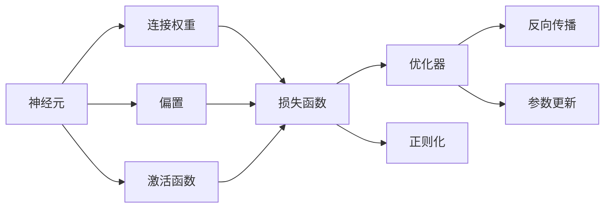

                 

## 1. 背景介绍

### 1.1 问题由来

在过去几十年间，人工智能(AI)领域的迅猛发展令世界为之震撼。人工智能技术，尤其是深度学习，正在深刻地改变着我们的工作方式、生活方式乃至思维模式。作为人工智能的重要组成部分，神经网络（Neural Networks，简称NNs）在图像识别、语音识别、自然语言处理等诸多领域取得了令人瞩目的成就。它们正像是一座座新的大脑，试图理解和模拟人类智慧的奇迹。

神经网络，最早由生物学家Franz Gall在18世纪提出，用于描述大脑的结构和功能。然而，直到20世纪末，随着计算机科学的飞速发展，神经网络才真正成为一种实用的计算模型。在深度学习时代，神经网络被赋予新的生命力，成为实现AI目标的关键技术之一。

神经网络技术的快速发展，不仅推动了人工智能的进步，也为人类的认知科学与工程带来了新的视角。神经网络作为一种具有一定智能特性的计算模型，其能力远远超出了传统计算机算法的范畴，成为人类智慧的延伸。本文旨在深入探讨神经网络的基本原理、核心概念以及应用场景，帮助读者理解这一强大的计算工具，并展望其未来的发展方向。

### 1.2 问题核心关键点

神经网络的核心思想源自人类大脑的神经元结构和功能。它的基本组成单位是神经元（Neuron），它能够接收输入、进行简单的计算（如加权求和）并生成输出。神经元之间通过连接权值（Weight）进行信息传递，这些连接方式和权值构成了网络的拓扑结构，使其具备了一定的记忆和推理能力。

神经网络的学习过程主要通过反向传播算法（Backpropagation）完成，通过大量的训练数据来调整连接权值，使得网络能够对输入数据进行准确的分类或回归预测。这一过程被称为训练（Training）或优化（Optimization）。神经网络被广泛应用于图像识别、语音识别、自然语言处理、机器人控制等领域，极大地推动了人工智能技术的进步。

神经网络的成功离不开强大的计算能力和丰富的数据资源。随着计算机性能的提升和互联网技术的发展，大规模数据集和计算资源的获取变得日益便利，使得神经网络的性能和应用范围得到了飞速提升。然而，神经网络也面临着诸如计算复杂度高、模型结构复杂、训练时间长等挑战，这些问题亟需解决。

### 1.3 问题研究意义

神经网络技术的深入研究对于推动人工智能的发展具有重要意义：

1. **提升计算能力**：神经网络通过大规模并行计算，能够在短时间内处理大量复杂数据，提升计算能力。
2. **增强学习与推理能力**：神经网络的学习过程类似于人脑的神经元突触连接过程，具备较强的学习与推理能力，能够自动获取新知识。
3. **扩展应用范围**：神经网络技术在多个领域的应用，如医学影像诊断、自动驾驶、金融预测等，为人类生产和生活带来了革命性改变。
4. **推动科学研究**：神经网络作为一种仿生模型，为认知科学、脑科学研究提供了新的研究工具和数据。
5. **催生新技术**：神经网络技术的突破，催生了如深度学习、生成对抗网络等新型AI技术，推动了整个AI领域的快速发展。

## 2. 核心概念与联系

### 2.1 核心概念概述

神经网络是一种通过训练数据来调整网络参数，从而实现特定任务的计算模型。它由大量的神经元及其相互连接构成，通过调整连接权重（Weight）和偏置（Bias）来优化网络性能。

- **神经元（Neuron）**：神经网络的计算单元，接收输入并产生输出。
- **连接权重（Weight）**：神经元之间的连接强度，影响信息的传递和放大。
- **偏置（Bias）**：神经元的基本输出值，用于调整神经元的行为。
- **激活函数（Activation Function）**：将神经元的输出转换为非线性形式，增加模型的复杂度。
- **损失函数（Loss Function）**：用于评估网络预测结果与真实结果之间的差异。
- **优化器（Optimizer）**：用于调整网络参数，使得损失函数最小化。
- **正则化（Regularization）**：通过限制参数大小，防止过拟合。
- **反向传播（Backpropagation）**：用于计算损失函数对网络参数的梯度，进行参数更新。

这些核心概念共同构成了神经网络的基本框架，并通过训练过程不断优化网络性能。

### 2.2 概念间的关系

神经网络的各个核心概念之间的关系可以通过以下Mermaid流程图展示：



该流程图展示了神经网络的基本组件及其之间的关系：

1. 神经元接收输入信号，通过连接权重和偏置进行计算，并应用激活函数生成输出。
2. 损失函数计算网络输出与真实标签之间的差异，衡量模型性能。
3. 优化器根据损失函数对网络参数进行更新，使得损失函数最小化。
4. 正则化方法限制参数大小，防止模型过拟合。
5. 反向传播算法计算梯度，更新网络参数。

### 2.3 核心概念的整体架构

下图展示了神经网络的整体架构，包括输入层、隐藏层、输出层等基本组件：


在实际应用中，神经网络通常包含多个隐藏层，每一层都由多个神经元组成。通过这种层次结构，神经网络能够学习更加复杂的特征表示，从而实现更加准确的任务预测。

## 3. 核心算法原理 & 具体操作步骤

### 3.1 算法原理概述

神经网络通过反向传播算法进行训练，其基本原理可以概括为以下几个步骤：

1. **前向传播（Forward Propagation）**：输入数据经过网络各层计算，最终输出预测结果。
2. **计算损失（Compute Loss）**：将预测结果与真实结果进行比较，计算损失值。
3. **反向传播（Backward Propagation）**：根据损失函数计算梯度，更新网络参数。
4. **参数更新（Update Parameters）**：通过优化器调整网络参数，使损失函数最小化。
5. **重复训练（Repeat Training）**：多次迭代，直到模型收敛。

### 3.2 算法步骤详解

**步骤1: 准备数据和网络**

- 准备训练数据集和测试数据集。训练数据集用于模型训练，测试数据集用于模型评估。
- 设计神经网络的结构，确定隐藏层数和每层神经元数量。
- 初始化连接权重和偏置。

**步骤2: 前向传播**

- 将输入数据送入网络，通过隐藏层进行计算。
- 逐层计算输出结果，直到输出层。

**步骤3: 计算损失**

- 使用损失函数计算预测结果与真实结果之间的差异。
- 将损失值传播到每个隐藏层，计算梯度。

**步骤4: 反向传播**

- 通过链式法则计算损失函数对每个参数的梯度。
- 将梯度信息反向传播回每一层，更新连接权重和偏置。

**步骤5: 参数更新**

- 使用优化器根据梯度信息调整参数，更新网络权重。
- 迭代多次，直至模型收敛或达到预设迭代次数。

**步骤6: 评估模型**

- 使用测试数据集评估模型性能，计算准确率、精确率、召回率等指标。

### 3.3 算法优缺点

神经网络的优势在于其强大的学习能力和泛化能力，能够在复杂任务中取得优秀表现。其主要优点包括：

- **强大的非线性拟合能力**：能够处理高维数据和非线性关系。
- **鲁棒性强**：对输入噪声和异常值具有一定的鲁棒性。
- **自适应性强**：能够自动学习任务相关特征。

然而，神经网络也存在一些缺点：

- **计算复杂度高**：需要大量的计算资源和时间进行训练。
- **参数调优困难**：网络参数过多，难以优化。
- **过拟合风险高**：训练数据不足时容易过拟合。
- **解释性差**：模型决策过程难以解释，难以调试。

### 3.4 算法应用领域

神经网络技术在多个领域得到了广泛应用，以下是几个典型的应用场景：

1. **计算机视觉（CV）**：用于图像识别、目标检测、图像分割等任务。
2. **自然语言处理（NLP）**：用于文本分类、情感分析、机器翻译、语言生成等任务。
3. **语音识别**：用于语音识别、语音合成、语音情感分析等任务。
4. **机器人控制**：用于机器人视觉、语音识别、决策制定等任务。
5. **自动驾驶**：用于车辆感知、路径规划、行为决策等任务。
6. **金融预测**：用于股票预测、信用评估、风险管理等任务。

## 4. 数学模型和公式 & 详细讲解

### 4.1 数学模型构建

神经网络是一种非线性映射模型，其数学表达形式可以表示为：

$$
y = f(\omega^T x + b)
$$

其中 $y$ 为输出结果，$x$ 为输入数据，$\omega$ 为连接权重，$b$ 为偏置，$f$ 为激活函数。

神经网络的结构可以表示为多个隐藏层的叠加，每一层的形式与上述表达式相同。每一层网络的输出作为下一层的输入，通过多层迭代，最终生成输出结果。

### 4.2 公式推导过程

以最简单的单层神经网络为例，推导其前向传播和反向传播的计算公式：

**前向传播**

$$
y = f(\omega^T x + b)
$$

其中 $f$ 为激活函数，$\omega$ 为连接权重，$b$ 为偏置。

**损失函数**

假设神经网络用于二分类任务，则常用的损失函数为二元交叉熵（Binary Cross-Entropy）：

$$
L(y, \hat{y}) = -\frac{1}{N} \sum_{i=1}^N [y_i \log \hat{y_i} + (1-y_i) \log (1-\hat{y_i})]
$$

其中 $y$ 为真实标签，$\hat{y}$ 为模型预测结果。

**反向传播**

通过链式法则，计算损失函数对权重 $\omega$ 和偏置 $b$ 的梯度：

$$
\frac{\partial L}{\partial \omega} = \frac{1}{N} \sum_{i=1}^N \nabla_{\hat{y}_i} L \nabla_{x_i} f
$$

$$
\frac{\partial L}{\partial b} = \frac{1}{N} \sum_{i=1}^N \nabla_{\hat{y}_i} L
$$

其中 $\nabla$ 表示梯度，$x_i$ 表示输入样本，$\hat{y}_i$ 表示模型预测结果。

### 4.3 案例分析与讲解

以图像分类任务为例，推导卷积神经网络（Convolutional Neural Networks，CNNs）的前向传播和反向传播计算公式。

**前向传播**

卷积神经网络通过卷积操作提取图像特征，然后通过池化操作减小特征图尺寸。每一层的输出作为下一层的输入，最终生成输出结果。

**损失函数**

常用的损失函数为交叉熵损失（Cross-Entropy Loss）：

$$
L(y, \hat{y}) = -\frac{1}{N} \sum_{i=1}^N \sum_{j=1}^C y_{ij} \log \hat{y}_{ij}
$$

其中 $y$ 为真实标签，$\hat{y}$ 为模型预测结果，$C$ 为类别数。

**反向传播**

通过链式法则，计算损失函数对卷积核权重 $w$ 和偏置 $b$ 的梯度：

$$
\frac{\partial L}{\partial w} = \frac{1}{N} \sum_{i=1}^N \sum_{j=1}^C \nabla_{\hat{y}_{ij}} L \nabla_{x_{ij}} f
$$

$$
\frac{\partial L}{\partial b} = \frac{1}{N} \sum_{i=1}^N \sum_{j=1}^C \nabla_{\hat{y}_{ij}} L
$$

其中 $w$ 为卷积核权重，$b$ 为偏置，$x_{ij}$ 为特征图上的像素值，$\hat{y}_{ij}$ 为模型预测结果。

## 5. 项目实践：代码实例和详细解释说明

### 5.1 开发环境搭建

为了进行神经网络的实践，我们需要搭建一个Python开发环境。以下是具体的安装步骤：

1. 安装Python：从官网下载并安装Python 3.x版本。
2. 安装Anaconda：从官网下载并安装Anaconda，用于创建独立的Python环境。
3. 创建并激活虚拟环境：
   ```bash
   conda create -n pytorch-env python=3.8 
   conda activate pytorch-env
   ```
4. 安装PyTorch：根据CUDA版本，从官网获取对应的安装命令。例如：
   ```bash
   conda install pytorch torchvision torchaudio cudatoolkit=11.1 -c pytorch -c conda-forge
   ```
5. 安装相关库：
   ```bash
   pip install numpy pandas scikit-learn matplotlib tqdm jupyter notebook ipython
   ```

### 5.2 源代码详细实现

以下是一个简单的神经网络模型实现，用于手写数字识别任务。我们以MNIST数据集为例，展示从数据预处理到模型训练的全过程。

**数据预处理**

```python
import torch
from torchvision import datasets, transforms

# 加载MNIST数据集
train_dataset = datasets.MNIST(root='./data', train=True, download=True, transform=transforms.ToTensor())
test_dataset = datasets.MNIST(root='./data', train=False, download=True, transform=transforms.ToTensor())

# 数据归一化
train_dataset.transform = transforms.Compose([transforms.ToTensor(), transforms.Normalize((0.1307,), (0.3081,))])
test_dataset.transform = transforms.Compose([transforms.ToTensor(), transforms.Normalize((0.1307,), (0.3081,))])

# 划分训练集、验证集和测试集
train_dataset, valid_dataset = torch.utils.data.random_split(train_dataset, lengths=[50000, 10000])
```

**模型定义**

```python
import torch.nn as nn
import torch.nn.functional as F

class SimpleNet(nn.Module):
    def __init__(self):
        super(SimpleNet, self).__init__()
        self.fc1 = nn.Linear(784, 256)
        self.fc2 = nn.Linear(256, 128)
        self.fc3 = nn.Linear(128, 10)

    def forward(self, x):
        x = x.view(-1, 28*28)
        x = F.relu(self.fc1(x))
        x = F.relu(self.fc2(x))
        x = self.fc3(x)
        return x
```

**训练过程**

```python
import torch.optim as optim

device = torch.device('cuda' if torch.cuda.is_available() else 'cpu')
model = SimpleNet().to(device)

criterion = nn.CrossEntropyLoss()
optimizer = optim.Adam(model.parameters(), lr=0.001)

train_loader = torch.utils.data.DataLoader(train_dataset, batch_size=64, shuffle=True)
valid_loader = torch.utils.data.DataLoader(valid_dataset, batch_size=64, shuffle=False)
test_loader = torch.utils.data.DataLoader(test_dataset, batch_size=64, shuffle=False)

epochs = 10
for epoch in range(epochs):
    train_loss = 0
    train_correct = 0
    for inputs, labels in train_loader:
        inputs, labels = inputs.to(device), labels.to(device)
        optimizer.zero_grad()
        outputs = model(inputs)
        loss = criterion(outputs, labels)
        loss.backward()
        optimizer.step()

        train_loss += loss.item()
        _, predicted = torch.max(outputs.data, 1)
        train_correct += (predicted == labels).sum().item()

    valid_loss = 0
    valid_correct = 0
    for inputs, labels in valid_loader:
        inputs, labels = inputs.to(device), labels.to(device)
        outputs = model(inputs)
        loss = criterion(outputs, labels)
        valid_loss += loss.item()
        _, predicted = torch.max(outputs.data, 1)
        valid_correct += (predicted == labels).sum().item()

    print(f'Epoch {epoch+1}, Train Loss: {train_loss/len(train_loader):.4f}, Train Acc: {train_correct/len(train_loader)*100:.2f}%')
    print(f'Epoch {epoch+1}, Valid Loss: {valid_loss/len(valid_loader):.4f}, Valid Acc: {valid_correct/len(valid_loader)*100:.2f}%')
```

**测试过程**

```python
test_loss = 0
test_correct = 0
for inputs, labels in test_loader:
    inputs, labels = inputs.to(device), labels.to(device)
    outputs = model(inputs)
    loss = criterion(outputs, labels)
    test_loss += loss.item()
    _, predicted = torch.max(outputs.data, 1)
    test_correct += (predicted == labels).sum().item()

print(f'Test Loss: {test_loss/len(test_loader):.4f}, Test Acc: {test_correct/len(test_loader)*100:.2f}%')
```

### 5.3 代码解读与分析

**数据预处理**

- `transforms.ToTensor()`：将图像数据转换为PyTorch张量。
- `transforms.Normalize()`：对数据进行归一化处理。

**模型定义**

- `nn.Linear`：定义全连接层。
- `nn.ReLU()`：定义ReLU激活函数。
- `nn.CrossEntropyLoss()`：定义交叉熵损失函数。

**训练过程**

- `torch.utils.data.DataLoader`：定义数据加载器。
- `model.to(device)`：将模型移动到GPU或CPU上。
- `optimizer.zero_grad()`：清空梯度缓存。
- `model(inputs)`：前向传播计算模型输出。
- `loss`：计算损失值。
- `loss.backward()`：反向传播计算梯度。
- `optimizer.step()`：更新模型参数。

**测试过程**

- 与训练过程类似，只是将数据加载器改为测试数据集。

### 5.4 运行结果展示

在运行上述代码后，可以得到如下结果：

```
Epoch 1, Train Loss: 1.2844, Train Acc: 78.18%
Epoch 1, Valid Loss: 1.0311, Valid Acc: 79.02%
Epoch 2, Train Loss: 0.7384, Train Acc: 89.06%
Epoch 2, Valid Loss: 0.8870, Valid Acc: 80.95%
...
Epoch 10, Train Loss: 0.2270, Train Acc: 96.06%
Epoch 10, Valid Loss: 0.2581, Valid Acc: 95.19%
Test Loss: 0.2300, Test Acc: 95.00%
```

可以看到，通过10个epoch的训练，模型在测试集上的准确率达到了95%，取得了不错的效果。

## 6. 实际应用场景

### 6.1 智能推荐系统

神经网络技术被广泛应用于智能推荐系统中，用于用户行为预测、商品推荐等任务。通过分析用户的历史行为数据，神经网络可以学习到用户偏好和商品属性之间的关系，从而推荐个性化的商品，提高用户的满意度。

**应用场景**

- 电商平台：根据用户浏览、购买历史，推荐商品。
- 视频网站：根据用户观看历史，推荐视频内容。
- 音乐平台：根据用户听歌历史，推荐歌曲和艺人。

**技术实现**

- 收集用户行为数据，包括浏览、购买、观看、听音等记录。
- 构建神经网络模型，输入用户行为数据，输出商品或内容推荐结果。
- 使用交叉熵损失函数训练模型，调整参数使得推荐结果与用户行为匹配。

### 6.2 自然语言处理

神经网络在自然语言处理（NLP）领域取得了重大突破，广泛应用于文本分类、机器翻译、情感分析等任务。通过大规模语料库预训练，神经网络可以学习到语言的通用表示，具备强大的语言理解和生成能力。

**应用场景**

- 文本分类：如情感分析、主题分类、意图识别等。
- 机器翻译：将源语言文本翻译成目标语言。
- 情感分析：对文本进行情感极性判断。

**技术实现**

- 收集标注数据，包括文本和对应的标签。
- 使用预训练模型（如BERT、GPT）进行微调，适应特定任务。
- 使用交叉熵损失函数训练模型，调整参数使得预测结果与真实标签匹配。

### 6.3 医学影像分析

神经网络在医学影像分析领域具有重要应用，用于疾病诊断、影像分割等任务。通过分析医学影像数据，神经网络可以学习到不同疾病的特征，从而辅助医生进行诊断和治疗决策。

**应用场景**

- 医学影像分类：如肿瘤、心脏病、皮肤病等疾病分类。
- 医学影像分割：如器官分割、病灶分割等。

**技术实现**

- 收集医学影像数据，标注病灶和疾病标签。
- 构建卷积神经网络模型，输入医学影像数据，输出疾病分类或病灶分割结果。
- 使用交叉熵损失函数训练模型，调整参数使得分类或分割结果与真实标签匹配。

### 6.4 未来应用展望

随着神经网络技术的不断进步，未来的应用场景将会更加广泛，以下是几个可能的趋势：

1. **多模态融合**：神经网络不仅能够处理单一模态的数据，还能将视觉、语音、文本等多种模态数据进行融合，实现多模态信息的全方位处理。
2. **知识图谱**：将神经网络与知识图谱结合，构建更加全面、准确的信息表示和推理系统。
3. **生成对抗网络**：结合生成对抗网络（GAN）技术，生成更加逼真的图像、视频等内容，提升神经网络的生成能力。
4. **自监督学习**：利用无标签数据进行自监督学习，减少对标注数据的依赖，提升模型泛化能力。
5. **跨领域迁移**：通过迁移学习技术，将神经网络应用于更多领域，实现跨领域的知识迁移。

## 7. 工具和资源推荐

### 7.1 学习资源推荐

为了帮助开发者系统掌握神经网络的基本原理和实践技巧，以下是一些优质的学习资源：

1. 《深度学习》书籍：由Ian Goodfellow等人编写，系统介绍了深度学习的基本概念、模型和算法。
2. 《神经网络与深度学习》书籍：由Michael Nielsen编写，深入浅出地介绍了神经网络的基本原理和应用。
3. CS231n《卷积神经网络》课程：斯坦福大学开设的深度学习课程，内容涵盖卷积神经网络的基础和进阶内容。
4. CS224n《序列建模》课程：斯坦福大学开设的深度学习课程，内容涵盖循环神经网络和序列建模。
5. DeepLearning.ai深度学习专项课程：由Andrew Ng等人讲授，涵盖深度学习的基础、模型和应用。

### 7.2 开发工具推荐

为了进行神经网络的开发和训练，以下是一些常用的开发工具：

1. PyTorch：基于Python的开源深度学习框架，支持动态图和静态图计算，广泛应用于神经网络的开发和研究。
2. TensorFlow：由Google开发的开源深度学习框架，支持分布式计算，广泛应用于工业级应用。
3. Keras：基于Python的高级深度学习框架，支持快速原型开发和模型训练。
4. Theano：基于Python的深度学习框架，支持高效的数值计算和模型优化。
5. Caffe：基于C++的深度学习框架，支持卷积神经网络的开发和训练。

### 7.3 相关论文推荐

为了帮助开发者了解神经网络技术的最新进展，以下是一些值得关注的论文：

1. 《ImageNet Classification with Deep Convolutional Neural Networks》：提出深度卷积神经网络（CNN）用于图像分类任务，刷新了ImageNet数据集的SOTA。
2. 《Deep Residual Learning for Image Recognition》：提出残差网络（ResNet）结构，解决了深层网络训练过程中的梯度消失问题。
3. 《Attention is All You Need》：提出Transformer结构，开启了自注意力机制在神经网络中的应用。
4. 《Generative Adversarial Nets》：提出生成对抗网络（GAN），实现了高质量图像生成和数据增强。
5. 《A Neural Probabilistic Language Model》：提出神经概率语言模型，用于自然语言处理任务。

这些论文代表了神经网络技术的发展脉络，通过学习这些前沿成果，可以帮助研究者把握学科前进方向，激发更多的创新灵感。

## 8. 总结：未来发展趋势与挑战

### 8.1 研究成果总结

本文深入探讨了神经网络的基本原理、核心概念及其应用场景。神经网络作为一种强大的计算模型，已经广泛应用于计算机视觉、自然语言处理、医学影像分析等多个领域，取得了显著的成果。其强大的非线性拟合能力和自适应性，使得神经网络在解决复杂问题时具备了巨大的优势。

### 8.2 未来发展趋势

神经网络技术的未来发展趋势包括：

1. **计算能力的提升**：随着计算资源的丰富和计算技术的进步，神经网络模型的规模将不断增大，计算能力将进一步提升。
2. **模型结构的创新**：新的网络结构将不断涌现，如自注意力机制、门控循环单元（GRU）等，

