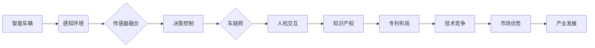

> 自动驾驶，专利布局，知识产权，技术竞争，智能车辆，车联网，传感器融合，深度学习，人工智能

# 自动驾驶行业的专利布局竞争

自动驾驶技术作为21世纪最具颠覆性的技术之一，正在深刻地改变着交通运输、城市出行、物流配送等众多领域。随着技术的不断发展和市场竞争的加剧，专利布局成为自动驾驶企业争夺技术制高点、构建行业壁垒的关键。本文将深入探讨自动驾驶行业的专利布局竞争，分析其核心概念、技术原理、实际应用场景，并展望未来发展趋势与挑战。

## 1. 背景介绍

### 1.1 问题的由来

自动驾驶技术涉及多个学科和领域，包括计算机视觉、传感器融合、深度学习、人工智能等。随着技术的不断进步，自动驾驶汽车从实验室走向市场，各大企业纷纷布局自动驾驶领域，争夺市场份额。专利作为企业核心竞争力的重要体现，成为企业竞争的重要手段。

### 1.2 研究现状

近年来，自动驾驶领域的专利申请数量呈爆炸式增长。根据世界知识产权组织(WIPO)的数据，2019年全球自动驾驶相关专利申请量达到10万件，预计未来还将保持快速增长。主要专利布局领域包括：

- 感知环境：激光雷达、摄像头、毫米波雷达、超声波雷达等传感器技术。
- 智能决策：路径规划、行为预测、决策算法等。
- 算法优化：深度学习、强化学习、优化算法等。
- 软硬件平台：自动驾驶平台、车联网技术、车辆控制技术等。

### 1.3 研究意义

研究自动驾驶行业的专利布局竞争，有助于：

- 了解自动驾驶技术发展趋势。
- 分析竞争对手的技术优势和劣势。
- 优化企业自身的技术创新和专利布局策略。
- 促进自动驾驶产业的健康发展。

## 2. 核心概念与联系

### 2.1 核心概念原理

**专利布局**：指企业在特定技术领域，对核心技术和创新成果进行专利申请和保护，以形成技术壁垒和市场竞争优势。

**知识产权**：指人们对其智力成果所享有的一种专有权利，包括专利权、商标权、著作权等。

**技术竞争**：指企业在技术创新、产品开发、市场拓展等方面展开的竞争。

**智能车辆**：指具备感知、决策、控制能力的自动驾驶汽车。

**车联网**：指通过无线通信技术将车辆、路侧基础设施和行人等交通参与者连接起来，实现信息共享和协同控制。

**传感器融合**：指将多种传感器采集到的信息进行综合处理，以获得更加全面、准确的环境感知。

**深度学习**：一种基于数据的机器学习技术，通过模拟人脑神经网络结构，实现图像、语音、文本等领域的智能识别和处理。

**人工智能**：一种模拟、延伸和扩展人的智能的理论、方法、技术和应用系统。

### 2.2 架构的 Mermaid 流程图



## 3. 核心算法原理 & 具体操作步骤

### 3.1 算法原理概述

自动驾驶技术核心算法包括：

- 感知环境：通过多种传感器感知周围环境，包括车辆、行人、道路等。
- 智能决策：根据感知到的环境信息，进行路径规划、行为预测、决策算法等。
- 控制执行：根据决策结果，实现对车辆的加减速、转向、制动等操作。

### 3.2 算法步骤详解

1. **感知环境**：使用激光雷达、摄像头、毫米波雷达、超声波雷达等传感器采集周围环境信息。
2. **传感器融合**：对采集到的传感器数据进行预处理，并进行数据融合，获得更加全面、准确的环境感知。
3. **智能决策**：根据融合后的环境信息，进行路径规划、行为预测、决策算法等，生成控制指令。
4. **控制执行**：根据决策结果，通过车辆控制系统实现对车辆的加减速、转向、制动等操作。

### 3.3 算法优缺点

自动驾驶技术核心算法的优点：

- 灵活性：可适应不同环境和场景，具有较强的鲁棒性。
- 智能化：能够进行自主决策和规划，提高驾驶安全性。
- 精确性：通过传感器融合技术，提高环境感知的准确性。

自动驾驶技术核心算法的缺点：

- 复杂性：涉及多个学科和领域，技术难度高。
- 计算量大：需要高性能计算资源支持。
- 数据依赖性：需要大量训练数据。

### 3.4 算法应用领域

自动驾驶技术核心算法主要应用领域：

- 自动驾驶汽车：包括乘用车、商用车、特种车辆等。
- 车联网：实现车辆与路侧基础设施、其他车辆、行人等交通参与者的信息交互。
- 智能交通系统：优化交通流量，提高道路利用率，降低交通事故发生率。

## 4. 数学模型和公式 & 详细讲解 & 举例说明

### 4.1 数学模型构建

自动驾驶技术涉及多种数学模型，主要包括：

- 概率模型：用于描述传感器数据、环境状态、决策结果等。
- 优化模型：用于路径规划、行为预测等。
- 机器学习模型：用于特征提取、分类、回归等。

### 4.2 公式推导过程

以下以路径规划中的A*算法为例，介绍公式推导过程：

$$
f(n) = g(n) + h(n)
$$

其中，$f(n)$ 为节点 $n$ 的总代价，$g(n)$ 为从起点到节点 $n$ 的实际代价，$h(n)$ 为从节点 $n$ 到终点的估计代价。

### 4.3 案例分析与讲解

以某自动驾驶公司在城市道路场景下的路径规划为例，介绍如何利用A*算法进行路径规划。

1. **建立地图**：根据城市道路信息，建立道路地图，包括道路节点、道路连接关系、道路长度等。
2. **定义代价函数**：选择合适的代价函数，如曼哈顿距离、欧几里得距离等。
3. **初始化算法**：设置起始节点和终止节点，初始化开放列表和关闭列表。
4. **搜索过程**：根据代价函数和启发式搜索策略，逐步生成路径，直至达到终止节点。

## 5. 项目实践：代码实例和详细解释说明

### 5.1 开发环境搭建

1. 安装Python开发环境。
2. 安装相关库，如PyTorch、OpenCV、NumPy等。
3. 搭建深度学习训练平台。

### 5.2 源代码详细实现

以下是一个简单的自动驾驶感知环境搭建的Python代码示例：

```python
import cv2
import numpy as np

def load_image(image_path):
    image = cv2.imread(image_path)
    return image

def preprocess_image(image):
    # 对图像进行预处理
    image = cv2.resize(image, (640, 480))
    image = cv2.cvtColor(image, cv2.COLOR_BGR2GRAY)
    return image

def detect_objects(image):
    # 使用OpenCV检测图像中的物体
    # ...
    return objects

if __name__ == "__main__":
    image_path = "city_street.jpg"
    image = load_image(image_path)
    preprocessed_image = preprocess_image(image)
    objects = detect_objects(preprocessed_image)
    # ...
```

### 5.3 代码解读与分析

以上代码展示了如何使用Python进行自动驾驶感知环境搭建的基本流程。首先，加载并预处理图像；然后，使用OpenCV检测图像中的物体；最后，根据检测结果进行后续处理。

### 5.4 运行结果展示

运行上述代码，可以得到如下结果：

- 处理后的图像：图像经过预处理后，转换为灰度图，并调整了大小。
- 物体检测结果：识别出图像中的各种物体，如车辆、行人、道路等。

## 6. 实际应用场景

### 6.1 自动驾驶汽车

自动驾驶汽车是自动驾驶技术最典型的应用场景。目前，多家企业正在研发自动驾驶汽车，包括百度Apollo、Waymo、特斯拉等。

### 6.2 车联网

车联网技术将车辆、路侧基础设施、行人等交通参与者连接起来，实现信息共享和协同控制。车联网技术可以应用于以下场景：

- 道路交通管理：实时监控道路状况，优化交通流量。
- 智能交通信号灯：根据交通状况调整信号灯时长。
- 无人驾驶公交：实现无人驾驶公交车的运营。
- 智能停车场：实现无人停车、自动收费等功能。

### 6.3 智能交通系统

智能交通系统是指利用先进的信息技术、数据挖掘技术、通信技术等，对交通系统进行全面优化，提高交通效率、降低交通事故发生率。智能交通系统可以应用于以下场景：

- 交通流量预测：预测未来一段时间内的交通流量，为交通管理部门提供决策支持。
- 交通事故预警：及时发现交通事故，减少事故损失。
- 交通疏导：根据实时交通状况，优化交通疏导策略。

## 7. 工具和资源推荐

### 7.1 学习资源推荐

1. 《深度学习》系列书籍：介绍深度学习的基本概念、算法和应用。
2. 《计算机视觉基础》系列书籍：介绍计算机视觉的基本概念、算法和应用。
3. 《自动驾驶技术》系列书籍：介绍自动驾驶技术的原理、算法和应用。
4. Coursera、edX等在线课程：提供丰富的自动驾驶技术相关课程。

### 7.2 开发工具推荐

1. Python：一种流行的编程语言，适用于数据分析和深度学习开发。
2. OpenCV：一个开源的计算机视觉库，用于图像处理和计算机视觉任务。
3. TensorFlow、PyTorch：深度学习框架，用于模型训练和推理。
4. C++、Java：适合高性能计算和嵌入式系统开发。

### 7.3 相关论文推荐

1. "A Survey on Autonomous Driving Perception: Algorithms, Systems and Challenges"：综述自动驾驶感知技术。
2. "Deep Learning for Autonomous Driving"：介绍深度学习在自动驾驶中的应用。
3. "Understanding the State of the Art of Autonomous Driving"：分析自动驾驶技术的发展现状和挑战。

## 8. 总结：未来发展趋势与挑战

### 8.1 研究成果总结

本文从背景介绍、核心概念、技术原理、实际应用场景等方面，对自动驾驶行业的专利布局竞争进行了全面分析。通过研究，我们了解到自动驾驶技术发展迅速，专利布局成为企业竞争的关键。同时，自动驾驶技术在实际应用过程中也面临着诸多挑战。

### 8.2 未来发展趋势

1. **技术融合**：自动驾驶技术将与其他技术，如5G、物联网、云计算等，进行深度融合，形成更加完善的技术体系。
2. **数据驱动**：自动驾驶技术将更加依赖大规模数据，通过数据驱动的方式不断优化模型和算法。
3. **标准化**：自动驾驶技术将逐步实现标准化，降低技术门槛，促进产业健康发展。

### 8.3 面临的挑战

1. **技术难题**：自动驾驶技术涉及多个学科和领域，技术难题依然存在，如感知、决策、控制等。
2. **法律法规**：自动驾驶技术的法律法规尚不完善，需要制定相应的法律法规来规范行业发展。
3. **安全与伦理**：自动驾驶技术的安全性和伦理问题需要得到关注和解决。

### 8.4 研究展望

未来，自动驾驶技术将在以下几个方面进行深入研究：

1. **感知技术**：提高感知系统的鲁棒性、准确性，降低对传感器依赖。
2. **决策算法**：提高决策算法的智能化和适应性，降低误判率。
3. **控制技术**：提高车辆控制系统的稳定性和可靠性，确保行车安全。
4. **数据安全与隐私保护**：加强数据安全和隐私保护，确保用户隐私不受侵害。

相信在各界共同努力下，自动驾驶技术将不断取得突破，为人类社会带来更加安全、便捷、高效的出行方式。

## 9. 附录：常见问题与解答

**Q1：什么是自动驾驶？**

A：自动驾驶是指利用计算机视觉、传感器融合、深度学习、人工智能等技术，使车辆能够自主感知周围环境、进行决策和控制，实现安全、高效、舒适的驾驶过程。

**Q2：自动驾驶技术有哪些类型？**

A：自动驾驶技术主要分为以下类型：
- L0：有驾驶辅助系统，如自适应巡航、自动泊车等。
- L1：部分自动化，如车道保持、自动刹车等。
- L2：有条件自动化，如自动换道、自动超车等。
- L3：高度自动化，如自动驾驶、自动换道、自动超车等。
- L4：完全自动化，无需人类驾驶员干预。

**Q3：自动驾驶技术有哪些挑战？**

A：自动驾驶技术面临的主要挑战包括：
- 感知环境：传感器数据融合、目标识别、场景理解等。
- 智能决策：路径规划、行为预测、决策算法等。
- 控制执行：车辆控制、动力学控制、执行机构控制等。
- 安全与伦理：安全风险、伦理问题、法律法规等。

**Q4：自动驾驶技术的未来发展如何？**

A：自动驾驶技术具有广阔的发展前景，未来将在以下方面取得突破：
- 技术融合：与其他技术深度融合，形成更加完善的技术体系。
- 数据驱动：通过大规模数据驱动，不断优化模型和算法。
- 标准化：逐步实现标准化，降低技术门槛，促进产业健康发展。

作者：禅与计算机程序设计艺术 / Zen and the Art of Computer Programming