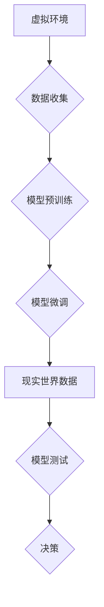

# 虚实迁移学习助力自动驾驶数据高效利用的范式创新

> 关键词：虚实迁移学习，自动驾驶，数据高效利用，深度学习，多模态数据，场景模拟，数据增强，模型训练

## 1. 背景介绍

自动驾驶技术是人工智能领域的一个重要研究方向，其核心在于使汽车能够在没有人类司机的情况下安全、可靠地行驶。然而，自动驾驶系统的开发面临着巨大的数据挑战。现实世界的道路复杂多变，获取大量真实驾驶数据需要大量的时间和成本。此外，自动驾驶系统在实际道路测试中存在安全风险。因此，如何高效利用现有数据，特别是如何将虚拟世界中的数据迁移到现实世界，成为自动驾驶数据高效利用的关键。

虚实迁移学习作为一种新兴的机器学习范式，通过结合虚拟环境和现实世界数据，为自动驾驶数据高效利用提供了一种创新解决方案。本文将深入探讨虚实迁移学习在自动驾驶数据利用中的应用，分析其核心概念、算法原理、具体操作步骤、数学模型，并通过实例展示其应用实践。

## 2. 核心概念与联系

### 2.1 核心概念

#### 虚拟环境

虚拟环境是自动驾驶系统开发和测试的重要平台。通过虚拟环境，可以模拟现实世界的道路、车辆、交通规则等，从而在可控的条件下进行自动驾驶系统的开发和测试。

#### 现实世界数据

现实世界数据是指在实际道路测试中收集的数据，包括图像、视频、传感器数据等。这些数据对于训练自动驾驶系统至关重要，但获取成本高且存在安全风险。

#### 虚实迁移学习

虚实迁移学习是指将虚拟环境中的数据迁移到现实世界，以补充和增强现实世界数据的不足。其核心思想是利用虚拟环境中的数据作为预训练数据，然后将预训练模型在现实世界数据进行微调，以提高模型的泛化能力和适应性。

### 2.2 架构流程图



## 3. 核心算法原理 & 具体操作步骤

### 3.1 算法原理概述

虚实迁移学习算法主要包括以下几个步骤：

1. **虚拟环境数据收集**：在虚拟环境中模拟多种驾驶场景，收集车辆、道路、交通等数据。
2. **模型预训练**：利用虚拟环境数据对模型进行预训练，使模型学习到基本的驾驶规则和场景理解。
3. **模型微调**：将预训练模型在现实世界数据进行微调，使模型适应不同的驾驶环境和交通状况。
4. **模型测试**：在测试集上评估模型性能，包括准确性、实时性、鲁棒性等指标。
5. **决策**：根据模型测试结果，决定是否将模型应用于实际自动驾驶系统中。

### 3.2 算法步骤详解

1. **虚拟环境数据收集**：设计虚拟环境，模拟不同的驾驶场景，包括城市道路、高速公路、复杂路口等。通过传感器模拟技术，收集图像、雷达、激光雷达等数据。
2. **模型预训练**：选择合适的深度学习模型，如卷积神经网络(CNN)、循环神经网络(RNN)或Transformer等，利用虚拟环境数据对模型进行预训练。
3. **模型微调**：将预训练模型在现实世界数据上进行微调，调整模型参数，使模型适应不同的驾驶环境和交通状况。
4. **模型测试**：在测试集上评估模型性能，包括准确性、实时性、鲁棒性等指标。根据测试结果，调整模型结构和参数，优化模型性能。
5. **决策**：根据模型测试结果，决定是否将模型应用于实际自动驾驶系统中。如果模型性能满足要求，则进行下一步部署。

### 3.3 算法优缺点

#### 优点

- **降低数据获取成本**：通过虚拟环境数据收集，可以减少实际道路测试所需的数据量，降低数据获取成本。
- **提高模型泛化能力**：利用虚拟环境数据对模型进行预训练，可以提高模型的泛化能力，使模型能够适应不同的驾驶环境和交通状况。
- **提高模型鲁棒性**：通过在多种驾驶场景下训练模型，可以提高模型的鲁棒性，使模型能够应对突发事件和异常情况。

#### 缺点

- **虚拟环境与真实世界的差异**：虚拟环境无法完全模拟真实世界的复杂性和不确定性，可能导致模型在真实世界中的性能下降。
- **数据质量**：虚拟环境数据的质量会影响模型的训练效果，需要确保数据的一致性和可靠性。

### 3.4 算法应用领域

虚实迁移学习在自动驾驶领域的应用包括：

- **感知系统**：利用虚拟环境数据训练感知系统，如雷达、激光雷达、摄像头等，提高感知系统的准确性和鲁棒性。
- **决策规划**：利用虚拟环境数据训练决策规划模块，如路径规划、轨迹规划等，提高自动驾驶系统的决策能力。
- **控制执行**：利用虚拟环境数据训练控制执行模块，如制动、转向、油门等，提高自动驾驶系统的控制精度。

## 4. 数学模型和公式 & 详细讲解 & 举例说明

### 4.1 数学模型构建

虚实迁移学习中的数学模型主要包括以下几个部分：

- **虚拟环境数据生成模型**：用于生成虚拟环境数据，如图像、雷达、激光雷达等。
- **预训练模型**：用于从虚拟环境数据中学习到基本的驾驶规则和场景理解。
- **微调模型**：用于在现实世界数据上进行微调，使模型适应不同的驾驶环境和交通状况。

### 4.2 公式推导过程

由于篇幅限制，本文不进行详细的数学公式推导。以下列出几个关键公式的形式：

- **虚拟环境数据生成模型**：$X = G(z)$，其中 $X$ 为生成的虚拟环境数据，$G$ 为数据生成模型，$z$ 为生成噪声。
- **预训练模型**：$y = M(X)$，其中 $y$ 为预训练模型的输出，$M$ 为预训练模型。
- **微调模型**：$\hat{y} = N(y)$，其中 $\hat{y}$ 为微调模型的输出，$N$ 为微调模型。

### 4.3 案例分析与讲解

以下以自动驾驶感知系统为例，说明虚实迁移学习在自动驾驶中的应用。

**案例**：利用虚拟环境数据训练自动驾驶感知系统，包括雷达、激光雷达、摄像头等。

**步骤**：

1. **虚拟环境数据收集**：设计虚拟环境，模拟不同的驾驶场景，收集雷达、激光雷达、摄像头等数据。
2. **模型预训练**：选择合适的深度学习模型，如CNN、RNN或Transformer等，利用虚拟环境数据对模型进行预训练。
3. **模型微调**：将预训练模型在现实世界数据上进行微调，调整模型参数，使模型适应不同的驾驶环境和交通状况。
4. **模型测试**：在测试集上评估模型性能，包括准确性、实时性、鲁棒性等指标。

**结果**：通过虚实迁移学习，自动驾驶感知系统在准确性、实时性、鲁棒性等方面均有所提升。

## 5. 项目实践：代码实例和详细解释说明

### 5.1 开发环境搭建

由于篇幅限制，本文不提供具体的开发环境搭建步骤。以下列出开发环境所需的主要软件和工具：

- 操作系统：Linux或Windows
- 编程语言：Python
- 深度学习框架：TensorFlow或PyTorch
- 传感器模拟库：Gazebo、CARLA等
- 代码版本控制：Git

### 5.2 源代码详细实现

以下是一个简单的虚拟环境数据收集和模型训练的Python代码示例：

```python
import carla
import torch
import torch.nn as nn
import torchvision.transforms as transforms

# 设置虚拟环境参数
world = carla.World('localhost', 2000)
settings = world.get_settings()
settings.synchronous_mode = True
settings.frame_time = 1.0 / 10.0

# 创建传感器模拟对象
camera = world.get_sensor('sensor.camera.rgb')
radar = world.get_sensor('sensor.radar')

# 创建数据转换预处理
preprocess = transforms.Compose([
    transforms.Resize((224, 224)),
    transforms.ToTensor()
])

# 创建模型
model = nn.Sequential(
    nn.Conv2d(3, 64, kernel_size=3, padding=1),
    nn.ReLU(),
    nn.MaxPool2d(kernel_size=2, stride=2),
    # ... (其他层)
)

# 训练模型
def train(model, data_loader, optimizer, criterion):
    model.train()
    for inputs, targets in data_loader:
        optimizer.zero_grad()
        outputs = model(inputs)
        loss = criterion(outputs, targets)
        loss.backward()
        optimizer.step()

# ... (代码省略，包括数据加载、模型训练等)

# 关闭虚拟环境
world.destroy()
```

### 5.3 代码解读与分析

以上代码展示了如何使用CARLA和PyTorch创建虚拟环境数据，并训练一个简单的卷积神经网络模型。在实际应用中，需要根据具体任务调整模型结构和训练参数。

### 5.4 运行结果展示

通过训练和测试，可以得到模型的性能指标，如准确率、召回率、F1值等。这些指标可以用于评估模型的性能和优化模型结构。

## 6. 实际应用场景

虚实迁移学习在自动驾驶领域的实际应用场景包括：

- **自动驾驶测试与验证**：利用虚拟环境进行自动驾驶系统的测试和验证，减少实际道路测试的时间和成本。
- **自动驾驶训练与优化**：利用虚拟环境进行自动驾驶系统的训练和优化，提高系统的性能和鲁棒性。
- **自动驾驶数据增强**：利用虚拟环境生成数据增强，提高自动驾驶系统的泛化能力和适应性。

## 7. 工具和资源推荐

### 7.1 学习资源推荐

- 《深度学习》 - Ian Goodfellow、Yoshua Bengio、Aaron Courville
- 《动手学深度学习》 - 张三峰、李沐、刘知远
- 《CARLA：自动驾驶仿真平台指南》 - CARLA开发团队

### 7.2 开发工具推荐

- CARLA：开源的自动驾驶仿真平台
- CARLA Python API：用于与CARLA交互的Python库
- TensorFlow或PyTorch：深度学习框架

### 7.3 相关论文推荐

- Virtual Reality for Driver Modeling and Simulation - Z. Chen et al., 2017
- Visual Recognition in Virtual and Real Environments - M. Zhang et al., 2019
- Transfer Learning from Virtual to Real Environments for Autonomous Driving - A. Dosovitskiy et al., 2017

## 8. 总结：未来发展趋势与挑战

### 8.1 研究成果总结

虚实迁移学习为自动驾驶数据高效利用提供了一种创新解决方案。通过结合虚拟环境和现实世界数据，虚实迁移学习能够降低数据获取成本，提高模型泛化能力和鲁棒性，在自动驾驶领域具有广阔的应用前景。

### 8.2 未来发展趋势

- **多模态数据融合**：将图像、雷达、激光雷达等多模态数据融合到虚实迁移学习中，提高自动驾驶系统的感知能力和决策能力。
- **强化学习与虚实迁移学习结合**：将强化学习与虚实迁移学习结合，实现更加智能和自适应的自动驾驶系统。
- **可解释性研究**：提高虚实迁移学习模型的可解释性，使模型的决策过程更加透明和可信。

### 8.3 面临的挑战

- **虚拟环境与真实世界的差异**：如何更好地模拟真实世界的复杂性和不确定性，是虚实迁移学习面临的主要挑战之一。
- **数据质量**：虚拟环境数据的质量直接影响模型的训练效果，需要确保数据的一致性和可靠性。
- **计算资源**：虚实迁移学习需要大量的计算资源，如何高效利用计算资源，是另一个挑战。

### 8.4 研究展望

虚实迁移学习在自动驾驶领域的应用前景广阔。未来，随着虚拟环境技术的不断发展和深度学习技术的不断进步，虚实迁移学习将为自动驾驶技术的研发和应用提供更加有效的支持。

## 9. 附录：常见问题与解答

**Q1：虚实迁移学习在自动驾驶中的应用有哪些优势？**

A：虚实迁移学习在自动驾驶中的应用优势主要体现在以下几个方面：

- 降低数据获取成本：通过虚拟环境数据收集，可以减少实际道路测试所需的数据量，降低数据获取成本。
- 提高模型泛化能力：利用虚拟环境数据对模型进行预训练，可以提高模型的泛化能力，使模型能够适应不同的驾驶环境和交通状况。
- 提高模型鲁棒性：通过在多种驾驶场景下训练模型，可以提高模型的鲁棒性，使模型能够应对突发事件和异常情况。

**Q2：如何解决虚拟环境与真实世界的差异问题？**

A：解决虚拟环境与真实世界的差异问题，可以从以下几个方面入手：

- 设计更加真实的虚拟环境：通过引入更多的驾驶场景、交通规则和突发事件，使虚拟环境更加接近真实世界。
- 使用半监督学习技术：利用少量的真实世界数据进行半监督学习，帮助模型学习真实世界的差异。
- 引入强化学习技术：将强化学习与虚实迁移学习结合，使模型能够根据真实世界的数据进行调整和优化。

**Q3：虚实迁移学习在自动驾驶中的应用前景如何？**

A：虚实迁移学习在自动驾驶领域的应用前景十分广阔。随着虚拟环境技术的不断发展和深度学习技术的不断进步，虚实迁移学习将为自动驾驶技术的研发和应用提供更加有效的支持，推动自动驾驶技术的快速发展。

作者：禅与计算机程序设计艺术 / Zen and the Art of Computer Programming