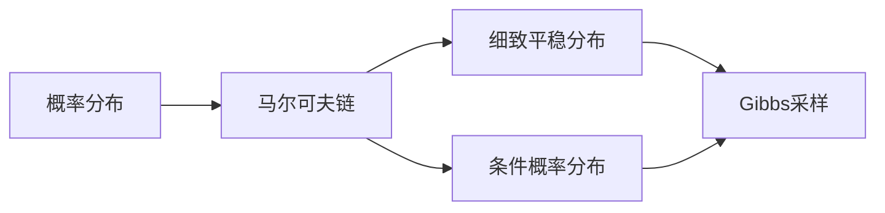
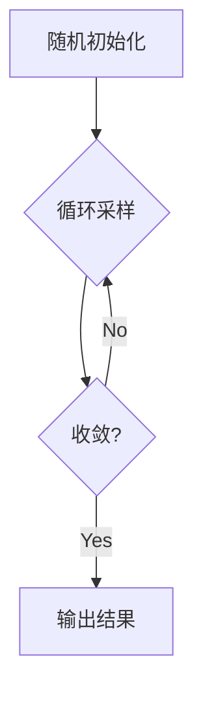

# Gibbs采样原理与代码实战案例讲解

关键词：Gibbs采样, 马尔可夫链蒙特卡洛, 概率分布, 随机采样, 贝叶斯推断

## 1. 背景介绍

### 1.1 问题的由来
在现实世界中,我们经常遇到需要从复杂的高维概率分布中进行采样的问题,比如在机器学习、统计物理、金融工程等领域。然而,对于许多复杂的概率分布,直接采样往往是不可行的。为了解决这一问题,人们提出了马尔可夫链蒙特卡洛(MCMC)方法这一类重要的采样算法。其中,Gibbs采样作为MCMC算法家族的重要成员,以其简单高效的特点在实践中得到了广泛应用。

### 1.2 研究现状
自从20世纪80年代以来,Gibbs采样就作为一种有力的采样工具被广泛研究和应用。统计学家Geman兄弟在1984年的开创性论文中首次提出了Gibbs采样算法。此后,这一算法在图像处理、自然语言处理、生物信息等诸多领域取得了巨大成功。近年来,随着大数据和人工智能的迅猛发展,Gibbs采样在处理高维数据、进行贝叶斯推断等方面展现出了更大的应用前景。

### 1.3 研究意义
深入理解和掌握Gibbs采样算法,对于从事机器学习、数据挖掘、人工智能等前沿领域研究的学者和工程师而言具有重要意义。一方面,Gibbs采样是处理复杂概率模型的利器,有助于我们设计出更加精妙的算法;另一方面,Gibbs采样思想启发我们从随机动力学的角度审视问题,为解决现实问题提供新的视角。此外,Gibbs采样在当前火热的生成式模型如变分自编码器中也扮演着关键角色。

### 1.4 本文结构
本文将全面系统地讲解Gibbs采样的原理和应用。第2部分介绍Gibbs采样涉及的核心概念。第3部分阐述Gibbs采样算法的原理和步骤。第4部分给出Gibbs采样的数学模型和推导过程。第5部分通过代码实战案例演示Gibbs采样的具体实现。第6部分讨论Gibbs采样的实际应用场景。第7部分推荐Gibbs采样相关的工具和资源。第8部分总结全文并展望Gibbs采样的未来发展趋势与挑战。

## 2. 核心概念与联系

在深入探讨Gibbs采样之前,我们先来了解几个核心概念:
- 概率分布:描述随机变量在各种可能取值下的概率。Gibbs采样的目标就是从某个概率分布中采样。
- 马尔可夫链:随机过程的一种,下一状态只与当前状态有关。Gibbs采样本质上是构造一个马尔可夫链。
- 细致平稳分布:马尔可夫链收敛的极限分布。Gibbs采样通过构造马尔可夫链使其收敛到目标分布。
- 条件概率分布:在给定某些变量的条件下,其他变量的概率分布。Gibbs采样通过轮流采样变量的条件概率分布来更新状态。

这些概念环环相扣,共同构成了Gibbs采样的理论基础。在后面的章节中,我们将看到它们是如何与Gibbs采样算法本身紧密联系在一起的。



## 3. 核心算法原理 & 具体操作步骤

### 3.1 算法原理概述
Gibbs采样的基本原理可以概括为:通过不断地从变量的条件概率分布中轮流采样,构造一个马尔可夫链,使得该马尔可夫链收敛到变量的联合概率分布。

具体来说,假设我们要采样的是d维随机变量$\mathbf{x}=(x_1,\cdots,x_d)$,其概率密度函数为$p(\mathbf{x})$。Gibbs采样每一轮迭代会遍历所有维度,对于第$i$维变量$x_i$,从其条件概率密度函数$p(x_i|\mathbf{x}_{-i})$中采样,其中$\mathbf{x}_{-i}$表示除$x_i$之外的所有变量。循环往复,最终得到的样本$\mathbf{x}^{(1)},\cdots,\mathbf{x}^{(n)}$就近似地服从$p(\mathbf{x})$。

### 3.2 算法步骤详解
Gibbs采样算法可以分为以下4个步骤:

1. 初始化:随机选取一组初始值$\mathbf{x}^{(0)}=(x_1^{(0)},\cdots,x_d^{(0)})$。

2. 循环采样:进行如下循环迭代,直至收敛,得到$\mathbf{x}^{(1)},\cdots,\mathbf{x}^{(n)}$:

   for $t=1,\cdots,n$:

      for $i=1,\cdots,d$:

         从条件分布$p(x_i|x_1^{(t)},\cdots,x_{i-1}^{(t)},x_{i+1}^{(t-1)},\cdots,x_d^{(t-1)})$中采样得到$x_i^{(t)}$

3. 收敛诊断:通过统计检验等手段判断马尔可夫链是否收敛。

4. 输出结果:如果马尔可夫链收敛,输出$\mathbf{x}^{(1)},\cdots,\mathbf{x}^{(n)}$作为服从$p(\mathbf{x})$的样本。



### 3.3 算法优缺点
Gibbs采样算法的主要优点有:
- 原理简单,编程实现方便
- 在高维情形下表现出色,每次只需采样一维条件分布
- 是许多更复杂MCMC算法的基础

Gibbs采样的缺点包括:
- 在变量高度相关时混合较慢
- 难以并行化,因为需要按顺序采样
- 要求能写出条件概率密度函数的解析形式

### 3.4 算法应用领域
Gibbs采样在以下领域有广泛应用:
- 统计物理:模拟磁性系统、晶格量子场论等
- 机器学习:主题模型、马尔可夫随机场等概率图模型的推断
- 金融工程:估计金融资产的波动率、计算信用风险等
- 生物信息:基因数据分析、蛋白质结构预测等

## 4. 数学模型和公式 & 详细讲解 & 举例说明

### 4.1 数学模型构建
为了便于理解,我们考虑一个简单的例子:二元高斯分布的Gibbs采样。

设二维随机变量$\mathbf{x}=(x_1,x_2)$服从均值为$\mathbf{0}$,协方差矩阵为$\mathbf{\Sigma}=\begin{bmatrix}
\sigma_1^2 & \rho\sigma_1\sigma_2\\
\rho\sigma_1\sigma_2 & \sigma_2^2
\end{bmatrix}$的高斯分布,其中$\sigma_1,\sigma_2>0$,$\rho\in(-1,1)$为相关系数。记

$$p(\mathbf{x})=\frac{1}{2\pi\sigma_1\sigma_2\sqrt{1-\rho^2}}\exp\left(-\frac{1}{2(1-\rho^2)}\left[\frac{x_1^2}{\sigma_1^2}-2\rho\frac{x_1x_2}{\sigma_1\sigma_2}+\frac{x_2^2}{\sigma_2^2}\right]\right)$$

我们的目标是从该分布中采样得到样本$\mathbf{x}^{(1)},\cdots,\mathbf{x}^{(n)}$。

### 4.2 公式推导过程
根据Gibbs采样原理,我们需要求出$x_1$和$x_2$的条件概率分布。

对于$x_1$,在给定$x_2$的条件下,其条件概率密度函数为

$$\begin{aligned}
p(x_1|x_2)&=\frac{p(\mathbf{x})}{p(x_2)}\\
&\propto \exp\left(-\frac{1}{2\sigma_1^2(1-\rho^2)}\left[x_1-\rho\frac{\sigma_1}{\sigma_2}x_2\right]^2\right)
\end{aligned}$$

这说明$x_1|x_2\sim N\left(\rho\frac{\sigma_1}{\sigma_2}x_2,\sigma_1^2(1-\rho^2)\right)$。

同理可得

$$x_2|x_1\sim N\left(\rho\frac{\sigma_2}{\sigma_1}x_1,\sigma_2^2(1-\rho^2)\right)$$

### 4.3 案例分析与讲解
有了条件概率分布的解析形式,我们就可以应用Gibbs采样算法来生成二元高斯分布的样本了。

假设我们取$\sigma_1=\sigma_2=1,\rho=0.8$,目标采样10000个样本。Gibbs采样的过程如下:

1. 初始化:随机选取初始点$\mathbf{x}^{(0)}=(x_1^{(0)},x_2^{(0)})$,例如取为$(0,0)$。

2. 循环采样:进行10000轮迭代,在第$t$轮:

   - 从$N(0.8x_2^{(t-1)},0.36)$中采样得到$x_1^{(t)}$
   - 从$N(0.8x_1^{(t)},0.36)$中采样得到$x_2^{(t)}$

3. 输出结果:得到样本$\mathbf{x}^{(1)},\cdots,\mathbf{x}^{(10000)}$

下图展示了Gibbs采样得到的10000个样本的散点图(蓝色),可以看到它们很好地拟合了二元高斯分布的概率密度函数(红色等高线)。


### 4.4 常见问题解答
问:Gibbs采样需要迭代多少次才能达到收敛?

答:这取决于初始点的选取和变量之间的相关性。一般来说,迭代次数越多,样本质量越高。在实践中,我们可以先运行一定次数的迭代,然后检查样本的各种统计量是否稳定。此外,平行运行多条马尔可夫链有助于诊断收敛性。

## 5. 项目实践：代码实例和详细解释说明

接下来,让我们用Python代码来实现二元高斯分布的Gibbs采样。

### 5.1 开发环境搭建
本项目使用Python 3.7,需要安装以下库:
- NumPy:数值计算库
- Matplotlib:绘图库

可以通过以下命令安装:

```bash
pip install numpy matplotlib
```

### 5.2 源代码详细实现
完整的Gibbs采样实现代码如下:

```python
import numpy as np
import matplotlib.pyplot as plt

def gibbs_sampling(N, rho):
    """二元高斯分布的Gibbs采样"""
    samples = np.zeros((N, 2))
    x1, x2 = 0, 0
    for i in range(N):
        x1 = np.random.normal(rho * x2, np.sqrt(1 - rho**2))
        x2 = np.random.normal(rho * x1, np.sqrt(1 - rho**2))
        samples[i] = [x1, x2]
    return samples

def main():
    N = 10000
    rho = 0.8
    samples = gibbs_sampling(N, rho)

    plt.figure(figsize=(6,6))
    plt.scatter(samples[:,0], samples[:,1], s=5, color='b')

    x = np.linspace(-3,3,100)
    y = np.linspace(-3,3,100)
    X,Y = np.meshgrid(x,y)
    Z = 1/(2*np.pi*np.sqrt(1-rho**2))*np.exp(-(X**2-2*rho*X*Y+Y**2)/(2*(1-rho**2)))
    plt.contour(