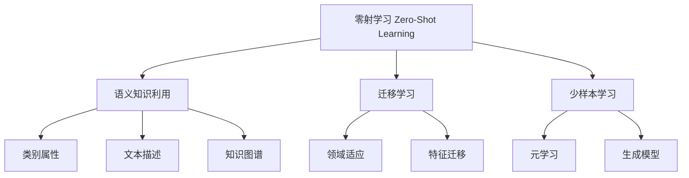

# 零射学习 (Zero-Shot Learning) 原理与代码实例讲解

## 1. 背景介绍

### 1.1 问题的由来

在传统的机器学习和深度学习中，模型需要在大量标注数据上进行训练才能获得良好的性能。然而，在许多实际应用场景中，获取大量标注数据是一项昂贵且耗时的过程。因此,如何在缺乏或只有少量标注数据的情况下,利用已有的知识来解决新的任务,成为了机器学习领域的一个重要挑战。

零射学习(Zero-Shot Learning, ZSL)正是为解决这一挑战而提出的一种新颖的机器学习范式。它旨在让模型能够识别在训练时从未见过的新类别,而无需对这些新类别进行额外的标注和训练。这种能力对于扩展模型的适用范围、减少标注成本以及快速适应新环境等方面具有重要意义。

### 1.2 研究现状

近年来,零射学习受到了广泛关注,并取得了一些进展。研究人员提出了多种不同的零射学习方法,包括基于属性的方法、基于语义空间的方法、生成对抗网络(GAN)方法等。这些方法通过利用语义知识或辅助信息(如类别属性描述、文本描述等)来建立已知类别和未知类别之间的关联,从而实现对未知类别的识别。

然而,现有的零射学习方法仍然存在一些局限性,例如性能不够理想、对辅助信息的依赖性较强、缺乏足够的解释性等。因此,如何设计更加有效、鲁棒和可解释的零射学习算法,仍然是该领域的一个重要研究方向。

### 1.3 研究意义

零射学习的研究对于推动机器学习技术的发展具有重要意义:

1. **减少标注成本**: 零射学习可以显著减少对大量标注数据的需求,从而降低了数据标注的成本和工作量。

2. **提高模型适应性**: 零射学习赋予了模型快速适应新环境和新任务的能力,使得模型更加灵活和通用。

3. **促进人工智能发展**: 零射学习体现了人工智能系统向通用智能迈进的一个重要步骤,有助于推动人工智能技术的长远发展。

4. **拓展应用领域**: 零射学习可以应用于各种缺乏足够标注数据的领域,如医疗影像分析、自然语言处理、计算机视觉等,拓展了机器学习的应用范围。

### 1.4 本文结构

本文将全面介绍零射学习的核心概念、算法原理、数学模型、代码实现和应用场景等内容。文章结构安排如下:

1. 背景介绍
2. 核心概念与联系
3. 核心算法原理与具体操作步骤
4. 数学模型和公式详细讲解与案例分析
5. 项目实践:代码实例和详细解释说明
6. 实际应用场景
7. 工具和资源推荐
8. 总结:未来发展趋势与挑战
9. 附录:常见问题与解答

## 2. 核心概念与联系

零射学习(Zero-Shot Learning, ZSL)是一种机器学习范式,旨在让模型能够识别在训练时从未见过的新类别,而无需对这些新类别进行额外的标注和训练。它与迁移学习和少样本学习等概念密切相关:

1. **语义知识利用**: 零射学习的核心思想是利用语义知识(如类别属性描述、文本描述、知识图谱等)来建立已知类别和未知类别之间的关联,从而实现对未知类别的识别。

2. **迁移学习**: 零射学习可以看作是一种特殊的迁移学习形式,它需要将在源域(已知类别)学习到的知识迁移到目标域(未知类别)。因此,零射学习常常借鉴迁移学习中的一些思想和方法,如领域适应和特征迁移等。

3. **少样本学习**: 零射学习属于少样本学习的一种极端情况,即对于未知类别,没有任何样本数据可供学习。因此,零射学习常常需要借助元学习和生成模型等技术,以提高模型的泛化能力和数据利用效率。

综上所述,零射学习紧密联系着语义知识利用、迁移学习和少样本学习等概念,并且融合了它们的思想和方法。通过有效利用语义知识、迁移学习和少样本学习技术,零射学习旨在实现对未知类别的准确识别,从而突破传统机器学习对大量标注数据的依赖。

## 3. 核心算法原理与具体操作步骤

### 3.1 算法原理概述

零射学习算法的核心思想是利用语义知识来建立已知类别和未知类别之间的关联,从而实现对未知类别的识别。具体来说,零射学习算法通常包括以下几个关键步骤:

1. **语义空间构建**: 根据类别的语义描述(如属性描述、文本描述等),构建一个语义空间,将每个类别映射到该空间中的一个语义向量。

2. **视觉空间构建**: 利用已知类别的样本数据,通过深度神经网络等方法学习一个视觉特征提取器,将每个样本映射到一个视觉特征向量,从而构建视觉空间。

3. **语义-视觉对应**: 通过某种方式建立语义空间和视觉空间之间的对应关系,使得语义向量和视觉特征向量能够在同一个嵌入空间中进行比较和匹配。

4. **未知类别识别**: 对于一个未知类别的测试样本,首先提取其视觉特征向量,然后在嵌入空间中寻找与之最相似的语义向量对应的类别,即为该样本的预测类别。

不同的零射学习算法在具体实现上会有所不同,但总体上都遵循这一核心思路。接下来,我们将详细介绍一种典型的零射学习算法的具体操作步骤。

### 3.2 算法步骤详解

本节将详细介绍一种基于属性的零射学习算法的具体操作步骤,该算法利用类别属性描述作为语义知识。

#### 3.2.1 数据准备

1. 已知类别样本数据集 $\mathcal{D}_s = \{(x_i, y_i)\}_{i=1}^{N_s}$,其中 $x_i$ 为样本特征,  $y_i \in \mathcal{Y}_s$ 为已知类别标签。
2. 未知类别属性描述集合 $\mathcal{A}_u = \{a_j\}_{j=1}^{N_u}$,其中 $a_j$ 为第 $j$ 个未知类别的属性向量。
3. 已知类别属性描述集合 $\mathcal{A}_s = \{a_k\}_{k=1}^{N_s}$,其中 $a_k$ 为第 $k$ 个已知类别的属性向量。

#### 3.2.2 语义空间构建

将已知类别和未知类别的属性向量合并,构建语义空间:

$$\mathcal{A} = \mathcal{A}_s \cup \mathcal{A}_u$$

#### 3.2.3 视觉空间构建

1. 使用已知类别样本数据集 $\mathcal{D}_s$ 训练一个深度卷积神经网络 $f_\theta$,作为视觉特征提取器。
2. 对于每个样本 $x_i$,提取其视觉特征向量 $v_i = f_\theta(x_i)$。
3. 将所有视觉特征向量 $\{v_i\}_{i=1}^{N_s}$ 组成视觉空间 $\mathcal{V}$。

#### 3.2.4 语义-视觉对应

1. 定义一个相似性函数 $s(a, v)$,用于计算属性向量 $a$ 和视觉特征向量 $v$ 之间的相似度。
2. 训练一个映射函数 $\phi$,使得对于每个已知类别 $k$,有 $\phi(a_k) \approx \frac{1}{N_k} \sum_{i:y_i=k} v_i$,即属性向量 $a_k$ 的映射值接近该类别所有样本的视觉特征向量的均值。
3. 通过优化以下目标函数来学习 $\phi$:

$$\min_\phi \sum_{k=1}^{N_s} \left\|\phi(a_k) - \frac{1}{N_k} \sum_{i:y_i=k} v_i\right\|_2^2 + \lambda \Omega(\phi)$$

其中 $\Omega(\phi)$ 是正则化项,用于控制模型复杂度。

#### 3.2.5 未知类别识别

对于一个未知类别的测试样本 $x^*$,提取其视觉特征向量 $v^* = f_\theta(x^*)$,然后计算它与每个属性向量 $a_j \in \mathcal{A}_u$ 的相似度 $s(\phi(a_j), v^*)$,将最相似的属性向量对应的类别作为预测结果:

$$\hat{y}^* = \arg\max_{j=1,\dots,N_u} s(\phi(a_j), v^*)$$

通过上述步骤,零射学习算法能够利用语义知识(属性描述)来识别未知类别,从而实现对新类别的识别,而无需对这些新类别进行额外的标注和训练。

### 3.3 算法优缺点

#### 优点:

1. **无需标注新类别**: 零射学习算法能够识别在训练时从未见过的新类别,而无需对这些新类别进行额外的标注和训练,从而大大降低了标注成本。

2. **快速适应新环境**: 零射学习赋予了模型快速适应新环境和新任务的能力,使得模型更加灵活和通用。

3. **利用语义知识**: 零射学习通过有效利用语义知识(如类别属性、文本描述等),建立了已知类别和未知类别之间的关联,提高了模型的泛化能力。

4. **推动人工智能发展**: 零射学习体现了人工智能系统向通用智能迈进的一个重要步骤,有助于推动人工智能技术的长远发展。

#### 缺点:

1. **依赖语义知识质量**: 零射学习算法的性能在很大程度上依赖于语义知识的质量和完整性,如果语义知识不够准确或缺失,会影响模型的识别精度。

2. **语义-视觉对应困难**: 建立语义空间和视觉空间之间的有效对应关系是零射学习算法的一个关键挑战,需要设计合理的映射函数和相似度度量。

3. **性能有待提高**: 目前零射学习算法的性能仍然无法与基于大量标注数据训练的模型相媲美,在识别精度和鲁棒性方面还有提升空间。

4. **缺乏解释性**: 零射学习模型的决策过程往往缺乏足够的解释性,难以解释为什么会做出某种预测。

5. **应用场景限制**: 零射学习算法主要适用于那些具有丰富语义知识的领域,对于缺乏语义描述的任务,零射学习的应用会受到一定限制。

### 3.4 算法应用领域

零射学习算法由于其无需标注新类别的优势,在以下领域具有广泛的应用前景:

1. **计算机视觉**: 在图像分类、目标检测、实例分割等任务中,零射学习可以快速适应新的视觉类别,扩展模型的适用范围。

2. **自然语言处理**: 在文本分类、命名实体识别、关系抽取等任务中,零射学习可以利用语义知识来识别新的实体类别或关系类型。

3. **推荐系统**: 在推荐系统中,零射学习可以用于识别新上架的商品类别,为用户提供个性化推荐。

4. **医疗影像分析**: