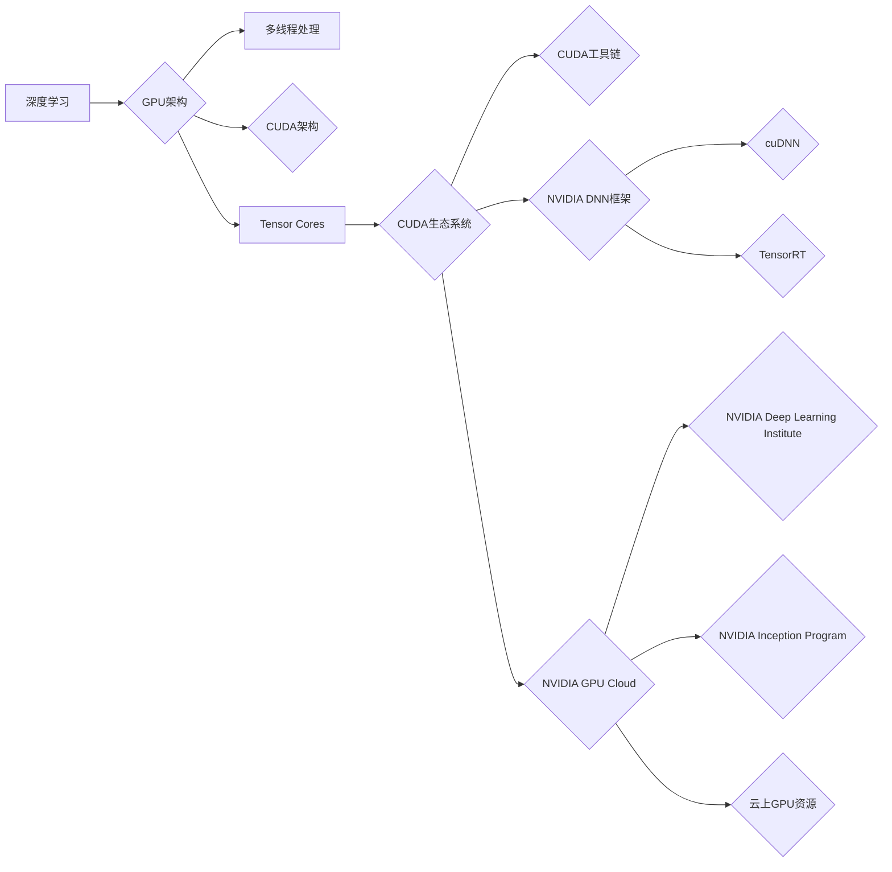

# NVIDIA如何推动AI算力的发展

> 关键词：NVIDIA, AI算力，GPU，深度学习，CUDA，深度学习框架，AI生态系统，GPU架构，CUDA生态系统

## 1. 背景介绍

随着人工智能技术的飞速发展，对计算能力的需求日益增长。深度学习作为人工智能的核心技术，对算力提出了极高的要求。NVIDIA作为GPU领域的领军企业，在推动AI算力发展方面发挥了至关重要的作用。本文将深入探讨NVIDIA如何通过其创新的GPU架构、CUDA生态系统、深度学习框架以及AI生态系统，推动AI算力的发展。

### 1.1 深度学习与AI算力

深度学习是人工智能领域的重要技术，它依赖于大量的计算资源进行模型的训练和推理。随着模型规模的不断扩大，对算力的需求也随之增长。传统的CPU在处理深度学习任务时，往往速度慢、效率低，难以满足大规模深度学习模型的需求。

### 1.2 NVIDIA在GPU领域的优势

NVIDIA作为GPU领域的领军企业，拥有丰富的GPU架构设计和CUDA编程经验。其GPU产品在并行计算、图形渲染等领域具有强大的性能和广泛的适用性。这使得NVIDIA在AI算力领域具有天然的优势。

## 2. 核心概念与联系

### 2.1 NVIDIA GPU架构

NVIDIA的GPU架构是推动AI算力发展的核心。其核心概念包括：

- **多线程处理**：NVIDIA GPU采用多线程处理技术，能够同时处理多个计算任务，大大提高了计算效率。
- **CUDA架构**：NVIDIA GPU采用CUDA架构，为开发者提供了强大的编程工具和库，使得GPU的计算能力得到充分发挥。
- **Tensor Cores**：NVIDIA最新GPU产品中引入的Tensor Cores，专门为深度学习任务优化，能够显著提升深度学习模型的训练和推理速度。

### 2.2 CUDA生态系统

CUDA生态系统是NVIDIA推动AI算力发展的另一个关键因素。它包括：

- **CUDA工具链**：提供了一套完整的编程工具和库，包括CUDA编译器、驱动程序、数学库等。
- **NVIDIA DNN框架**：提供了一系列深度学习框架，如cuDNN、TensorRT等，为深度学习开发提供了高效、易用的解决方案。
- **NVIDIA GPU Cloud**：提供云上GPU资源，使得研究人员和开发者能够更轻松地获取高性能计算资源。

### 2.3 深度学习框架

深度学习框架是深度学习开发的重要工具。NVIDIA支持的深度学习框架包括：

- **cuDNN**：专门为深度神经网络加速而设计的库，提供了高性能的深度学习操作。
- **TensorRT**：一个深度学习推理引擎，能够将深度学习模型转换为高效、可部署的格式。

### 2.4 AI生态系统

NVIDIA通过构建AI生态系统，促进了AI技术的发展和应用。其核心概念包括：

- **NVIDIA Deep Learning Institute**：提供深度学习培训和认证，帮助开发者掌握深度学习技术。
- **NVIDIA Inception Program**：支持创业公司发展，推动AI技术落地。
- **NVIDIA GPU Cloud**：提供云上GPU资源，降低AI研究和开发的门槛。

以下为NVIDIA核心概念与联系Mermaid流程图：



## 3. 核心算法原理 & 具体操作步骤

### 3.1 算法原理概述

NVIDIA通过以下几种方式推动AI算力的发展：

- **GPU并行计算**：利用GPU的并行计算能力，加速深度学习模型的训练和推理。
- **CUDA编程**：通过CUDA编程，充分发挥GPU的计算能力，实现深度学习算法的高效执行。
- **深度学习框架**：提供易于使用的深度学习框架，降低深度学习开发的门槛。
- **AI生态系统**：构建AI生态系统，促进AI技术的传播和应用。

### 3.2 算法步骤详解

以下为使用NVIDIA GPU进行深度学习模型训练的基本步骤：

1. **选择深度学习框架**：选择适合任务的深度学习框架，如TensorFlow、PyTorch等。
2. **编写深度学习代码**：使用选择的框架编写深度学习模型和训练代码。
3. **编译CUDA代码**：将深度学习代码编译为CUDA代码，以便在GPU上执行。
4. **训练深度学习模型**：在GPU上训练深度学习模型，并监控训练过程。
5. **评估和部署模型**：评估训练好的模型的性能，并将其部署到实际应用中。

### 3.3 算法优缺点

### 3.3.1 优点

- **计算速度快**：GPU的并行计算能力能够显著提升深度学习模型的训练和推理速度。
- **编程简单**：CUDA编程相对简单，易于掌握。
- **生态系统完善**：NVIDIA提供了丰富的工具和资源，方便深度学习开发。

### 3.3.2 缺点

- **学习曲线陡峭**：CUDA编程需要一定的学习成本。
- **成本较高**：高性能GPU的成本较高。

### 3.4 算法应用领域

NVIDIA的GPU和深度学习框架在以下领域得到了广泛应用：

- **计算机视觉**：图像识别、目标检测、视频分析等。
- **自然语言处理**：文本分类、机器翻译、情感分析等。
- **语音识别**：语音识别、语音合成等。
- **推荐系统**：个性化推荐、商品推荐等。

## 4. 数学模型和公式 & 详细讲解 & 举例说明

### 4.1 数学模型构建

深度学习模型通常由多个数学模型组成，如卷积神经网络、循环神经网络等。以下以卷积神经网络为例，介绍其数学模型构建过程。

#### 4.1.1 卷积神经网络

卷积神经网络（Convolutional Neural Network，CNN）是一种用于图像识别的深度学习模型。其数学模型主要包括：

- **卷积操作**：通过卷积核提取图像特征。
- **激活函数**：如ReLU、Sigmoid等，用于增加非线性。
- **池化操作**：如最大池化、平均池化等，用于降低特征图的尺寸。

#### 4.1.2 例子

以下是一个简单的卷积神经网络模型：

```
input -> [ Conv1 -> Relu -> Pool ] -> [ Conv2 -> Relu -> Pool ] -> Flatten -> Dense -> Output
```

### 4.2 公式推导过程

以下为卷积神经网络中卷积操作的公式推导过程：

$$
h^{(l)} = f(W^{(l)} \cdot h^{(l-1)} + b^{(l)})
$$

其中：

- $h^{(l)}$：第l层输出
- $W^{(l)}$：第l层权重
- $h^{(l-1)}$：第l-1层输出
- $b^{(l)}$：第l层偏置
- $f$：激活函数

### 4.3 案例分析与讲解

以下以使用PyTorch框架在CPU和GPU上进行卷积神经网络训练的案例进行分析。

#### 4.3.1 代码实现

```python
import torch
import torch.nn as nn

# 定义卷积神经网络模型
class ConvNet(nn.Module):
    def __init__(self):
        super(ConvNet, self).__init__()
        self.conv1 = nn.Conv2d(1, 20, 5)
        self.conv2 = nn.Conv2d(20, 50, 5)
        self.fc1 = nn.Linear(4*4*50, 500)
        self.fc2 = nn.Linear(500, 10)

    def forward(self, x):
        x = torch.relu(self.conv1(x))
        x = torch.max_pool2d(x, 2, 2)
        x = torch.relu(self.conv2(x))
        x = torch.max_pool2d(x, 2, 2)
        x = x.view(-1, 4*4*50)
        x = torch.relu(self.fc1(x))
        x = self.fc2(x)
        return x

# 在CPU上训练模型
model = ConvNet().cpu()
# ... 训练代码 ...

# 在GPU上训练模型
model = ConvNet().cuda()
# ... 训练代码 ...
```

#### 4.3.2 分析

从代码中可以看出，通过调用`.cuda()`方法，可以将模型转移到GPU上进行训练。GPU上的模型训练速度要比CPU上的模型训练速度快得多。

## 5. 项目实践：代码实例和详细解释说明

### 5.1 开发环境搭建

以下是使用PyTorch框架在NVIDIA GPU上进行深度学习模型训练的步骤：

1. **安装PyTorch**：根据CUDA版本下载并安装适合的PyTorch版本。
2. **安装CUDA工具链**：下载并安装CUDA工具链，包括CUDA编译器、驱动程序等。
3. **安装深度学习框架**：选择并安装所需的深度学习框架，如TensorFlow、PyTorch等。

### 5.2 源代码详细实现

以下是一个简单的卷积神经网络训练代码实例：

```python
import torch
import torch.nn as nn
import torch.optim as optim

# 定义卷积神经网络模型
class ConvNet(nn.Module):
    # ... 模型定义 ...

# 加载训练数据
train_loader = torch.utils.data.DataLoader(train_dataset, batch_size=64, shuffle=True)

# 实例化模型
model = ConvNet().cuda()

# 定义损失函数和优化器
criterion = nn.CrossEntropyLoss()
optimizer = optim.Adam(model.parameters(), lr=0.001)

# 训练模型
for epoch in range(10):
    for data, target in train_loader:
        data, target = data.cuda(), target.cuda()
        optimizer.zero_grad()
        output = model(data)
        loss = criterion(output, target)
        loss.backward()
        optimizer.step()
```

### 5.3 代码解读与分析

以上代码首先定义了一个简单的卷积神经网络模型，然后加载训练数据，实例化模型、损失函数和优化器。接着，通过循环遍历训练数据，进行前向传播、计算损失、反向传播和参数更新，最终实现模型训练。

### 5.4 运行结果展示

运行以上代码，可以在GPU上训练卷积神经网络模型。训练过程中，可以通过打印输出的loss值来监控训练进度。

## 6. 实际应用场景

NVIDIA的GPU和深度学习框架在以下领域得到了广泛应用：

### 6.1 计算机视觉

- **图像识别**：使用深度学习模型对图像进行分类、检测、分割等任务。
- **视频分析**：对视频进行内容识别、动作检测、目标跟踪等任务。

### 6.2 自然语言处理

- **文本分类**：对文本进行情感分析、主题分类、情感分类等任务。
- **机器翻译**：将一种语言的文本翻译成另一种语言。

### 6.3 语音识别

- **语音识别**：将语音信号转换为文本。
- **语音合成**：将文本转换为语音。

### 6.4 推荐系统

- **个性化推荐**：为用户推荐商品、新闻、视频等内容。

## 7. 工具和资源推荐

### 7.1 学习资源推荐

- **NVIDIA官方文档**：提供了丰富的GPU和CUDA相关文档。
- **PyTorch官方文档**：提供了PyTorch框架的详细文档和教程。
- **TensorFlow官方文档**：提供了TensorFlow框架的详细文档和教程。

### 7.2 开发工具推荐

- **CUDA Toolkit**：NVIDIA提供的GPU编程工具和库。
- **PyTorch**：用于深度学习的开源框架。
- **TensorFlow**：用于深度学习的开源框架。

### 7.3 相关论文推荐

- **AlexNet**：ImageNet竞赛冠军模型，标志着深度学习时代的到来。
- **VGGNet**：VGGNet在ImageNet竞赛中取得了优异成绩，展示了深度学习模型的结构优势。
- **ResNet**：ResNet解决了深度学习中的梯度消失问题，推动了深度学习模型规模的进一步增长。

## 8. 总结：未来发展趋势与挑战

### 8.1 研究成果总结

NVIDIA通过其创新的GPU架构、CUDA生态系统、深度学习框架以及AI生态系统，推动了AI算力的发展。其GPU产品在并行计算、图形渲染等领域具有强大的性能和广泛的适用性。NVIDIA的深度学习框架和工具，为深度学习开发提供了高效、易用的解决方案。NVIDIA的AI生态系统，促进了AI技术的传播和应用。

### 8.2 未来发展趋势

- **更强大的GPU架构**：NVIDIA将继续推动GPU架构的创新，提供更高性能的GPU产品。
- **更先进的深度学习框架**：NVIDIA将继续优化其深度学习框架，提供更易用、更高效的深度学习开发工具。
- **更广泛的AI生态系统**：NVIDIA将继续构建AI生态系统，促进AI技术的传播和应用。

### 8.3 面临的挑战

- **算法挑战**：随着深度学习模型规模的不断扩大，如何设计高效、可扩展的算法是一个重要的挑战。
- **硬件挑战**：如何提供更高效的GPU架构，以满足不断增长的计算需求。
- **应用挑战**：如何将AI技术应用到更多领域，推动社会进步。

### 8.4 研究展望

NVIDIA将继续推动AI算力的发展，为AI技术的应用提供强大的支撑。相信在不久的将来，AI技术将改变我们的生活方式，推动社会进步。

## 9. 附录：常见问题与解答

### 9.1 常见问题

**Q1：为什么深度学习需要GPU加速？**

A1：深度学习模型通常需要大量的计算资源，GPU具有并行计算能力，能够显著提升深度学习模型的训练和推理速度。

**Q2：如何选择合适的GPU产品？**

A2：选择合适的GPU产品需要考虑以下因素：

- **性能**：根据任务需求，选择具有足够性能的GPU产品。
- **功耗**：根据硬件环境，选择功耗合适的GPU产品。
- **成本**：根据预算，选择性价比高的GPU产品。

**Q3：如何使用CUDA进行编程？**

A3：CUDA编程需要一定的学习成本。可以从以下资源学习CUDA编程：

- **CUDA Toolkit官方文档**
- **NVIDIA开发者论坛**
- **在线教程**

**Q4：如何使用PyTorch进行深度学习开发？**

A4：PyTorch是一个开源的深度学习框架，提供了丰富的教程和文档。可以从以下资源学习PyTorch：

- **PyTorch官方文档**
- **PyTorch教程**
- **在线课程**

### 9.2 解答

由于篇幅限制，此处省略解答内容。

---

作者：禅与计算机程序设计艺术 / Zen and the Art of Computer Programming