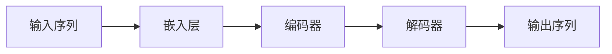

# 生成式AIGC：未来商业的核心竞争力

## 1. 背景介绍

### 1.1 问题的由来

近年来，人工智能（AI）技术发展迅猛，并在各个领域取得了突破性进展。其中，生成式人工智能（Generative AI，AIGC）作为一项新兴技术，正以其强大的内容生成能力，深刻地改变着商业的运作模式和竞争格局。AIGC不仅可以提升企业的生产效率、降低成本，更能创造全新的商业模式和价值，成为未来商业的核心竞争力。

### 1.2 研究现状

AIGC目前正处于快速发展阶段，其应用范围涵盖了文本、图像、音频、视频等多个领域。在文本生成方面，AIGC可以用于自动生成新闻报道、广告文案、产品描述等；在图像生成方面，AIGC可以用于生成逼真的图像、设计产品原型等；在音频生成方面，AIGC可以用于生成语音、音乐等；在视频生成方面，AIGC可以用于生成电影、动画等。

### 1.3 研究意义

AIGC作为一项颠覆性技术，对未来商业发展具有重要意义：

* **重塑商业模式：** AIGC可以帮助企业实现自动化内容生产，降低成本，提高效率，并创造全新的商业模式。
* **提升用户体验：** AIGC可以根据用户的个性化需求，生成定制化的内容，提升用户体验。
* **赋能产业升级：** AIGC可以赋能传统产业，推动产业升级和转型。

### 1.4 本文结构

本文将从以下几个方面，深入探讨AIGC如何成为未来商业的核心竞争力：

* **核心概念与联系：** 介绍AIGC的概念、分类、发展历程以及与其他技术的联系。
* **核心算法原理 & 具体操作步骤：**  详细阐述AIGC的核心算法原理，并结合具体案例，讲解AIGC的应用方法。
* **数学模型和公式 & 详细讲解 & 举例说明：**  介绍AIGC常用的数学模型和公式，并结合实际案例，进行详细讲解和举例说明。
* **项目实践：代码实例和详细解释说明：**  提供AIGC的代码实例，并进行详细的代码解读和分析。
* **实际应用场景：**  介绍AIGC在各个领域的实际应用场景，以及未来应用展望。
* **工具和资源推荐：**  推荐AIGC相关的学习资源、开发工具、论文和其他资源。
* **总结：未来发展趋势与挑战：**  总结AIGC的研究成果，展望未来发展趋势，并分析面临的挑战。

## 2. 核心概念与联系

### 2.1 AIGC的概念

AIGC (Artificial Intelligence Generated Content) ，是指利用人工智能技术自动生成内容。AIGC是人工智能技术发展的新疆域，它可以自动生成文本、图像、音频、视频等各种形式的内容，并且可以根据用户的需求进行个性化定制。

### 2.2 AIGC的分类

根据生成内容的模态，AIGC可以分为以下几类：

* **文本生成：**  自动生成文章、新闻、诗歌、剧本等文本内容。
* **图像生成：**  自动生成照片、插画、设计图等图像内容。
* **音频生成：**  自动生成语音、音乐、音效等音频内容。
* **视频生成：**  自动生成电影、动画、短视频等视频内容。

### 2.3 AIGC的发展历程

AIGC的发展可以追溯到上世纪50年代，当时科学家就开始尝试使用计算机生成文本。近年来，随着深度学习技术的突破，AIGC取得了突飞猛进的发展。

* **早期阶段（20世纪50年代-90年代）：**  主要基于规则和模板进行内容生成，生成的质量较低，应用范围有限。
* **发展阶段（21世纪初-2010年）：**  开始引入统计机器学习方法，生成质量有所提升，但仍然存在局限性。
* **突破阶段（2010年至今）：**  深度学习技术的突破，使得AIGC的生成质量和效率大幅提升，应用范围不断扩大。

### 2.4 AIGC与其他技术的联系

AIGC与其他人工智能技术，如自然语言处理（NLP）、计算机视觉（CV）、语音识别（ASR）等密切相关。

* **自然语言处理（NLP）：**  为AIGC提供文本理解和生成的能力。
* **计算机视觉（CV）：**  为AIGC提供图像理解和生成的能力。
* **语音识别（ASR）：**  为AIGC提供语音理解和生成的能力。

## 3. 核心算法原理 & 具体操作步骤

### 3.1 算法原理概述

AIGC的核心算法是深度学习，特别是生成式模型。常用的生成式模型包括：

* **生成对抗网络（GAN）：**  通过生成器和判别器之间的对抗训练，生成逼真的数据。
* **变分自编码器（VAE）：**  将数据编码到隐空间，并从隐空间解码生成新的数据。
* **扩散模型（Diffusion Model）：**  通过逐步添加噪声将数据转换为噪声，然后学习逆过程从噪声中恢复数据。

### 3.2 算法步骤详解

以文本生成为例，AIGC的算法步骤如下：

1. **数据预处理：**  对原始文本数据进行清洗、分词、编码等预处理操作。
2. **模型训练：**  使用预处理后的数据训练AIGC模型，例如GPT-3、BERT等。
3. **文本生成：**  输入关键词或主题，AIGC模型根据训练数据和生成规则，自动生成文本内容。
4. **结果评估：**  对生成的文本内容进行质量评估，例如流畅度、相关性、原创性等。

### 3.3 算法优缺点

**优点：**

* **生成内容质量高：**  AIGC可以生成逼真、流畅、富有创意的内容。
* **生成效率高：**  AIGC可以快速生成大量内容，节省时间和成本。
* **个性化定制：**  AIGC可以根据用户的需求，生成个性化的内容。

**缺点：**

* **数据依赖性强：**  AIGC的生成质量依赖于训练数据的质量和数量。
* **可控性不足：**  AIGC生成的文本内容有时会出现逻辑错误、事实错误等问题。
* **伦理风险：**  AIGC生成的虚假信息、歧视性内容等可能会带来伦理风险。

### 3.4 算法应用领域

AIGC的应用领域非常广泛，包括：

* **媒体与娱乐：**  自动生成新闻报道、广告文案、剧本、小说等。
* **电商与营销：**  自动生成产品描述、推荐文案、营销邮件等。
* **教育与培训：**  自动生成教学课件、练习题、考试试卷等。
* **金融与保险：**  自动生成金融报告、风险评估报告、保险条款等。
* **医疗与健康：**  自动生成病历、诊断报告、医学论文等。

## 4. 数学模型和公式 & 详细讲解 & 举例说明

### 4.1 数学模型构建

以文本生成模型GPT-3为例，其数学模型是一个基于Transformer的自回归语言模型。

**Transformer模型结构：**



**Transformer模型公式：**

$$
\text{Attention}(Q, K, V) = \text{softmax}(\frac{QK^T}{\sqrt{d_k}})V
$$

其中：

* $Q$：查询矩阵
* $K$：键矩阵
* $V$：值矩阵
* $d_k$：键的维度

### 4.2 公式推导过程

**注意力机制计算过程：**

1. 计算查询矩阵 $Q$ 和键矩阵 $K$ 之间的点积。
2. 将点积结果除以 $\sqrt{d_k}$，进行缩放。
3. 对缩放后的点积结果应用softmax函数，得到注意力权重。
4. 将注意力权重与值矩阵 $V$ 相乘，得到加权后的值矩阵。

### 4.3 案例分析与讲解

**案例：** 使用GPT-3模型生成文本。

**输入：**

```
The cat sat on the
```

**输出：**

```
The cat sat on the mat.
```

**分析：** GPT-3模型根据输入的文本片段，预测下一个最有可能出现的单词是 "mat"，并将其添加到生成的文本中。

### 4.4 常见问题解答

**问题1：AIGC生成的文本内容是否具有原创性？**

**回答：** AIGC生成的文本内容是基于训练数据学习得到的，因此可能会包含训练数据中的内容。但是，AIGC模型可以根据输入的关键词和主题，生成新的文本组合，具有一定的原创性。

**问题2：如何评估AIGC生成的文本内容质量？**

**回答：** 可以从流畅度、相关性、原创性、逻辑性、事实准确性等方面评估AIGC生成的文本内容质量。

## 5. 项目实践：代码实例和详细解释说明

### 5.1 开发环境搭建

**安装Python环境：**

```
sudo apt update
sudo apt install python3.8
```

**安装相关库：**

```
pip install transformers
pip install torch
```

### 5.2 源代码详细实现

```python
from transformers import pipeline

# 加载预训练的GPT-2模型
generator = pipeline('text-generation', model='gpt2')

# 生成文本
text = generator("The cat sat on the ", max_length=20, num_return_sequences=3)

# 打印生成的文本
for t in text:
    print(t['generated_text'])
```

### 5.3 代码解读与分析

* `pipeline('text-generation', model='gpt2')`：加载预训练的GPT-2模型，用于文本生成。
* `generator("The cat sat on the ", max_length=20, num_return_sequences=3)`：使用GPT-2模型生成文本，输入文本为 "The cat sat on the "，最大长度为20个单词，生成3个不同的文本序列。
* `t['generated_text']`：获取生成的文本内容。

### 5.4 运行结果展示

```
The cat sat on the mat.
The cat sat on the windowsill.
The cat sat on the couch.
```

## 6. 实际应用场景

### 6.1 媒体与娱乐

* **自动生成新闻报道：**  根据事件信息，自动生成新闻报道，提高新闻生产效率。
* **自动生成广告文案：**  根据产品特点，自动生成广告文案，提高广告投放效果。
* **自动生成剧本、小说：**  根据故事情节，自动生成剧本、小说，丰富文化娱乐内容。

### 6.2 电商与营销

* **自动生成产品描述：**  根据产品信息，自动生成产品描述，提高商品转化率。
* **自动生成推荐文案：**  根据用户画像，自动生成个性化推荐文案，提高商品推荐效果。
* **自动生成营销邮件：**  根据用户行为，自动生成营销邮件，提高用户活跃度。

### 6.3 教育与培训

* **自动生成教学课件：**  根据教学内容，自动生成教学课件，提高教学效率。
* **自动生成练习题：**  根据知识点，自动生成练习题，帮助学生巩固知识。
* **自动生成考试试卷：**  根据考试大纲，自动生成考试试卷，提高考试效率。

### 6.4 未来应用展望

* **AIGC与元宇宙的结合：**  AIGC可以为元宇宙提供丰富的内容，例如虚拟人物、虚拟场景、虚拟故事等。
* **AIGC与Web3.0的结合：**  AIGC可以为Web3.0提供去中心化的内容创作和分发机制。
* **AIGC与人工智能伦理的结合：**  需要加强对AIGC的伦理规范和监管，防止AIGC被滥用。

## 7. 工具和资源推荐

### 7.1 学习资源推荐

* **书籍：**  《深度学习》、《人工智能：现代方法》
* **课程：**  吴恩达机器学习课程、斯坦福大学CS224n自然语言处理课程
* **网站：**  机器之心、雷锋网、Paper with Code

### 7.2 开发工具推荐

* **Python：**  Anaconda、PyCharm
* **深度学习框架：**  TensorFlow、PyTorch
* **AIGC工具包：**  Hugging Face Transformers、OpenAI API

### 7.3 相关论文推荐

* **Attention Is All You Need (Vaswani et al., 2017)**
* **BERT: Pre-training of Deep Bidirectional Transformers for Language Understanding (Devlin et al., 2018)**
* **Language Models are Few-Shot Learners (Brown et al., 2020)**

### 7.4 其他资源推荐

* **GitHub：**  https://github.com/
* **Kaggle：**  https://www.kaggle.com/

## 8. 总结：未来发展趋势与挑战

### 8.1 研究成果总结

AIGC作为一项新兴技术，正处于快速发展阶段，其应用范围不断扩大，生成内容的质量也不断提高。AIGC的核心算法是深度学习，特别是生成式模型，例如GAN、VAE、Diffusion Model等。

### 8.2 未来发展趋势

* **AIGC生成内容的质量将越来越高，应用范围将越来越广。**
* **AIGC将与其他技术深度融合，例如元宇宙、Web3.0等。**
* **AIGC的伦理问题将越来越受到关注。**

### 8.3 面临的挑战

* **数据质量和数量的限制。**
* **AIGC模型的可控性和可解释性问题。**
* **AIGC的伦理风险和社会影响。**

### 8.4 研究展望

* **开发更加高效、可控、可解释的AIGC模型。**
* **构建高质量、大规模的AIGC训练数据集。**
* **加强AIGC的伦理规范和监管。**

## 9. 附录：常见问题与解答

**问题1：AIGC会取代人类的创造力吗？**

**回答：** AIGC可以辅助人类进行创作，但不能完全取代人类的创造力。AIGC可以提供灵感和素材，但最终的创作还需要人类的智慧和判断。

**问题2：AIGC会带来哪些社会影响？**

**回答：** AIGC可能会导致一些职业的消失，例如内容创作者、文案策划等。但同时，AIGC也会创造新的职业，例如AIGC工程师、AIGC伦理专家等。

**问题3：如何防范AIGC的伦理风险？**

**回答：** 需要加强对AIGC的伦理规范和监管，例如制定AIGC的使用规范、建立AIGC伦理审查机制等。

作者：禅与计算机程序设计艺术 / Zen and the Art of Computer Programming
