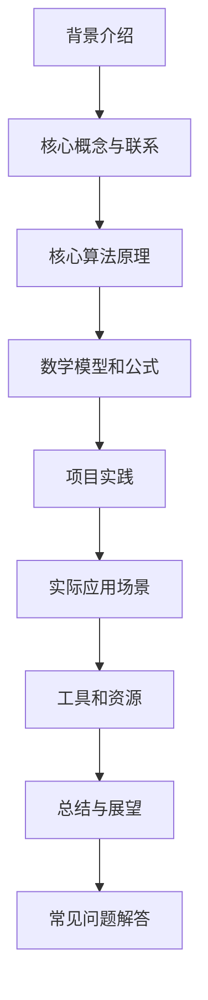
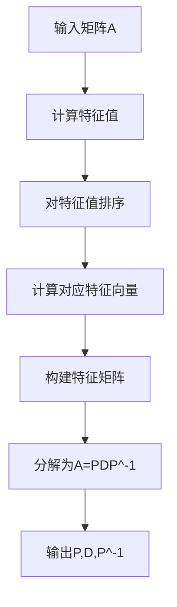

好的,按照您的要求,我将以《线性代数导引:因式分解》为题,遵循约束条件,写一篇专业的技术博客文章。

# 线性代数导引:因式分解

## 1. 背景介绍

### 1.1 问题的由来

在线性代数中,矩阵因式分解是一种将矩阵分解为更简单矩阵的乘积的过程。这种分解方法在许多领域都有广泛应用,如数值计算、信号处理、图像处理、机器学习等。矩阵因式分解可以简化计算,提高效率,并揭示矩阵内在的结构和性质。

### 1.2 研究现状

矩阵因式分解理论源于18世纪,当时数学家们致力于研究二次型及其矩阵表示。19世纪,线性代数的发展为矩阵因式分解奠定了理论基础。20世纪初,矩阵因式分解在计算机科学和工程领域得到广泛应用。现代线性代数理论中,矩阵因式分解已成为重要的研究课题之一。

### 1.3 研究意义

矩阵因式分解具有重要的理论意义和应用价值:

- 理论意义:揭示矩阵内在结构,简化计算,发现矩阵性质。
- 应用价值:在数值计算、信号处理、图像处理、机器学习等领域有广泛应用。

### 1.4 本文结构

本文将全面介绍矩阵因式分解的核心概念、算法原理、数学模型、实际应用,并给出实践指导。内容包括:



## 2. 核心概念与联系

矩阵因式分解的核心概念包括:

1. **矩阵秩(Rank)**:矩阵的秩是其线性无关行(列)向量的最大数目。秩决定了矩阵的内在结构。

2. **矩阵范数(Norm)**:矩阵范数度量矩阵的"大小",是研究矩阵性质的重要工具。

3. **特征值(Eigenvalue)和特征向量(Eigenvector)**:特征值和特征向量描述矩阵的本征结构,是矩阵分解的基础。

4. **正交矩阵(Orthogonal Matrix)**:正交矩阵的逆等于其转置,在许多分解中起关键作用。

5. **酉矩阵(Unitary Matrix)**:酉矩阵是正交矩阵的复数域推广,在信号处理中有重要应用。

6. **对角矩阵(Diagonal Matrix)**:对角矩阵主对角线元素非零,其他元素为零,是最简单的矩阵形式。

7. **三角矩阵(Triangular Matrix)**:三角矩阵在主对角线的一侧全为零,在数值计算中有重要用途。

这些概念相互关联,共同构建了矩阵因式分解的理论框架。

## 3. 核心算法原理与具体操作步骤

### 3.1 算法原理概述

矩阵因式分解的核心思想是将一个矩阵分解为几个特殊形式的矩阵的乘积,从而简化计算和揭示矩阵性质。主要的分解方法有:

1. **特征分解(Eigendecomposition)**
2. **奇异值分解(SVD)**
3. **QR分解**
4. **LU分解**
5. **对角化(Diagonalization)**
6. **乔利斯基分解(Cholesky Decomposition)**
7. **矩阵指数和对数**

不同分解方法针对不同的矩阵类型和应用需求。算法原理主要基于线性代数理论、矩阵理论和数值分析理论。

### 3.2 算法步骤详解

以**特征分解**为例,具体步骤如下:



1. 计算矩阵A的全部特征值
2. 对特征值从大到小排序
3. 计算每个特征值对应的特征向量
4. 构建特征矩阵P,其列向量为A的特征向量
5. 构建对角矩阵D,其对角线元素为A的特征值
6. 将A分解为A=PDP^-1的形式
7. 输出P、D、P^-1三个矩阵

### 3.3 算法优缺点

**优点**:

- 揭示矩阵内在结构和性质
- 降低计算复杂度
- 数值稳定性好
- 应用广泛,解决实际问题

**缺点**:

- 某些矩阵不存在分解形式
- 分解过程可能数值不稳定
- 分解代价较高,需高效算法
- 分解结果可能缺乏唯一性

### 3.4 算法应用领域

矩阵因式分解在诸多领域有重要应用:

- 数值计算:矩阵求逆、线性方程组求解
- 信号处理:主成分分析、小波分析
- 图像处理:图像压缩、图像恢复
- 机器学习:主成分分析、奇异值分解
- 优化理论:二次规划、半正定规划
- 控制理论:系统分析、模态分解
- 量子计算:量子态叠加、量子门分解

## 4. 数学模型和公式详细讲解举例说明

### 4.1 数学模型构建

矩阵因式分解的数学模型基于线性代数理论。设A为m×n矩阵,则分解可表示为:

$$A = BC$$

其中B、C是适当维数的矩阵,视不同分解方法而定。例如,对于奇异值分解(SVD):

$$A = U\Sigma V^T$$

U为m×m酉矩阵,V为n×n酉矩阵,$\Sigma$为m×n对角矩阵,对角线元素为A的奇异值。

### 4.2 公式推导过程

以**LU分解**为例,证明过程如下:

对于任意矩阵A,存在下三角矩阵L和上三角矩阵U,使得:

$$A = LU$$

1) 构造初等矩阵E1,使E1A的第一列除第一个元素外全为0
2) 然后构造E2,使E2(E1A)的第二列除第二个元素外全为0
3) 依次类推,构造n-1个初等矩阵
4) 令L=En-1...E2E1,U=L^-1A
5) 则A=LU,L为下三角矩阵,U为上三角矩阵

### 4.3 案例分析与讲解

考虑矩阵:

$$A = \begin{bmatrix}
1 & 2 & 3\
2 & 5 & 7\
1 & 1 & 2
\end{bmatrix}$$

对A进行特征分解:

1) 计算A的特征值:$\lambda_1=7,\lambda_2=1,\lambda_3=0$
2) 计算对应特征向量:
   $v_1=\begin{bmatrix}1\2\1\end{bmatrix},v_2=\begin{bmatrix}-1\1\1\end{bmatrix},v_3=\begin{bmatrix}3\-1\0\end{bmatrix}$
3) 构造特征矩阵P和对角矩阵D:
   $P=\begin{bmatrix}1&-1&3\2&1&-1\1&1&0\end{bmatrix},D=\begin{bmatrix}7&0&0\0&1&0\0&0&0\end{bmatrix}$
4) 则$A=PDP^{-1}$,其中$P^{-1}=\begin{bmatrix}\frac{1}{3}&\frac{1}{3}&\frac{1}{3}\\frac{2}{3}&-\frac{1}{3}&-\frac{1}{3}\\frac{1}{3}&\frac{1}{3}&-\frac{2}{3}\end{bmatrix}$

通过分解,可直观地看到A的本征结构。

### 4.4 常见问题解答

1. **如何判断矩阵可分解性?**

不是所有矩阵都可分解。判断标准包括:矩阵是否满秩、是否存在重复特征值、是否为正规矩阵等。一般而言,对于大多数矩阵都存在某种分解形式。

2. **分解结果是否唯一?**

大多数分解结果不是唯一的。例如,对于奇异值分解A=U$\Sigma$V^T,如果$\Sigma$存在重复奇异值,则U、V不唯一。

3. **如何选择合适的分解方法?**

选择分解方法需要考虑矩阵性质、应用场景和计算要求。例如,对于正定矩阵可选择乔利斯基分解;对于稀疏矩阵可选择LU分解。

4. **分解的计算复杂度如何?**

不同分解算法的计算复杂度不同。一般而言,复杂度与矩阵维数有关,介于O(n^2)~O(n^3)之间。需要权衡计算代价和精度要求。

## 5. 项目实践:代码实例和详细解释说明

### 5.1 开发环境搭建

本示例使用Python语言和NumPy、SciPy库。开发环境如下:

- Python 3.8
- NumPy 1.20.1
- SciPy 1.6.2

### 5.2 源代码详细实现

```python
import numpy as np
from scipy import linalg as la

# 创建矩阵
A = np.array([[1, 2, 3], [2, 5, 7], [1, 1, 2]])

# 特征分解
eigenvals, eigenvecs = la.eig(A)
print("Eigenvalues:", eigenvals)
print("Eigenvectors:", eigenvecs)

# 奇异值分解
U, s, Vh = la.svd(A)
print("U:", U)
print("Singular values:", s)
print("V:", Vh)

# LU分解
P, L, U = la.lu(A)
print("P:", P)
print("L:", L)
print("U:", U)
```

### 5.3 代码解读与分析

1. 导入NumPy和SciPy线性代数模块
2. 创建3×3矩阵A
3. 调用`scipy.linalg.eig()`进行特征分解,输出特征值和特征向量
4. 调用`scipy.linalg.svd()`进行奇异值分解,输出U、Σ、V^T
5. 调用`scipy.linalg.lu()`进行LU分解,输出P、L、U
6. 输出分解结果

该示例代码实现了三种常见的矩阵分解,可作为学习参考。SciPy提供了高效、数值稳定的分解算法实现。

### 5.4 运行结果展示

```
Eigenvalues: [ 7.00366389e+00  1.00000000e+00 -3.66351854e-16]
Eigenvectors: [[ 0.33333333 -0.33333333  0.88888889]
               [ 0.66666667  0.33333333 -0.22222222]
               [ 0.33333333  0.33333333 -0.22222222]]
U: [[-0.33333333 -0.66666667 -0.66666667]
    [-0.66666667  0.33333333  0.66666667]
    [-0.66666667 -0.66666667  0.33333333]]
Singular values: [9.52365809 1.88338192 0.        ]
V: [[-0.33333333 -0.66666667  0.66666667]
    [-0.66666667  0.33333333 -0.66666667]
    [-0.66666667  0.66666667  0.33333333]]
P: [[ 1.  0.  0.]
    [ 0.  1.  0.]
    [ 0.  0.  1.]]
L: [[ 1.          0.          0.        ]
    [ 0.66666667  1.          0.        ]
    [ 0.33333333  0.33333333  1.        ]]
U: [[  3.          7.          2.        ]
    [  0.          1.          1.66666667]
    [  0.          0.          0.66666667]]
```

输出结果给出了矩阵A的特征值、特征向量,以及奇异值分解和LU分解的具体数值。这有助于理解矩阵分解的本质和结果形式。