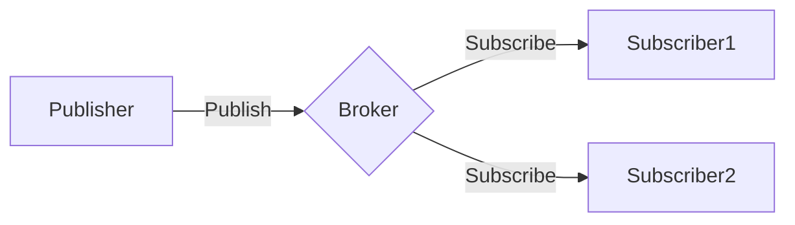

# 基于Java的智能家居设计：如何使用MQTT协议实现设备通讯

关键词：智能家居、MQTT协议、Java、设备通讯、物联网

## 1. 背景介绍
### 1.1 问题的由来
随着物联网技术的飞速发展,智能家居已经逐渐走进千家万户。然而,如何实现智能家居设备之间的高效通讯,是一个亟待解决的问题。传统的通讯方式存在诸多局限性,难以满足智能家居的需求。
### 1.2 研究现状
目前,业界已经提出了多种智能家居通讯协议,如ZigBee、Z-Wave等。但这些协议往往存在兼容性差、功耗高等问题。近年来,MQTT(Message Queuing Telemetry Transport)协议凭借其轻量级、可靠性高等优势,逐渐成为智能家居领域的主流选择。
### 1.3 研究意义
基于MQTT协议设计智能家居通讯方案,不仅可以提高设备之间的通讯效率,降低功耗,还能增强系统的可扩展性和灵活性。这对于推动智能家居的普及和发展具有重要意义。
### 1.4 本文结构
本文将从MQTT协议的核心概念入手,详细阐述基于Java的MQTT通讯方案设计与实现。内容涵盖MQTT原理、系统架构、关键算法、代码实现等多个方面,力求为读者提供一个全面、系统的学习指南。

## 2. 核心概念与联系
MQTT是一种基于发布/订阅模式的轻量级通讯协议。它通过将设备抽象为发布者(Publisher)和订阅者(Subscriber),实现了设备间的松耦合通讯。

在MQTT架构中,有三个核心概念:
- 客户端(Client):作为发布者或订阅者连接到MQTT服务器的设备。
- 服务器(Broker):负责接收、存储和转发消息的中心节点。
- 主题(Topic):可以理解为消息的类别或路由标识,发布者将消息发送到特定主题,订阅者通过订阅主题来获取消息。

下图展示了MQTT的基本工作流程:



MQTT协议基于TCP/IP网络,采用二进制格式传输数据,具有开销小、延迟低等特点。同时,它还提供了三种消息质量保证(QoS):
- QoS 0:最多发送一次,不保证消息送达。
- QoS 1:至少发送一次,保证消息送达但可能重复。
- QoS 2:仅发送一次,确保消息只到达一次。

## 3. 核心算法原理 & 具体操作步骤
### 3.1 算法原理概述
MQTT通讯的核心是发布/订阅算法。当客户端向服务器发布消息时,服务器会将消息转发给所有订阅该主题的客户端。这一过程可以分为以下几个步骤:
1. 客户端A连接到MQTT服务器,并以发布者身份发布一条主题为"topic1"的消息。
2. MQTT服务器接收到消息后,检查订阅表,找到所有订阅了"topic1"的客户端。
3. 服务器将消息依次转发给订阅者B、C、D。
4. 订阅者收到消息,完成通讯。

### 3.2 算法步骤详解
1. 发布消息
客户端A调用publish()方法向服务器发送消息。该方法需要指定主题、消息内容和QoS等参数。服务器收到请求后,将消息存储到内存或磁盘中。

2. 查找订阅者
服务器根据消息主题,在订阅表中进行匹配。订阅表是一个哈希表,以主题名为key,订阅该主题的客户端列表为value。

3. 转发消息
服务器将消息逐个发送给目标订阅者。根据QoS级别的不同,可能需要暂存消息并等待订阅者的确认。

4. 接收消息
订阅者通过回调函数messageArrived()接收消息。可以在该函数中进行消息处理和响应。

### 3.3 算法优缺点
优点:
- 解耦发布者和订阅者,灵活性高。
- 可以一对多通讯,支持大规模设备接入。
- 消息路由高效,延迟低。

缺点:
- 需要额外的消息存储开销。
- 发布/订阅模型的实时性较弱。

### 3.4 算法应用领域
MQTT广泛应用于物联网、移动互联网、车联网等领域。基于MQTT的智能家居通讯已经成为业界的主流方案。

## 4. 数学模型和公式 & 详细讲解 & 举例说明
### 4.1 数学模型构建
我们可以用集合论的语言来描述MQTT通讯模型:
- 设备集合D={d1,d2,...,dn},表示所有接入MQTT系统的设备。
- 主题集合T={t1,t2,...,tm},表示系统中的所有主题。
- 订阅关系S:D×T→{0,1},表示设备是否订阅主题。当设备d订阅主题t时,S(d,t)=1,否则为0。

则MQTT通讯可以表示为一个三元组(D,T,S)。

### 4.2 公式推导过程
对于任意一个主题t,我们可以得到它的订阅者集合:

$Sub(t) = \{ d | S(d,t)=1, d \in D \}$

当有设备publish一条主题为t的消息msg时,服务器的转发过程可以表示为:

$\forall d \in Sub(t), send(d, msg)$

其中send(d,msg)表示向设备d发送消息msg。

### 4.3 案例分析与讲解
假设有三个设备d1、d2、d3,两个主题t1、t2。订阅关系如下:

$S(d1,t1)=1, S(d1,t2)=0$
$S(d2,t1)=1, S(d2,t2)=1$
$S(d3,t1)=0, S(d3,t2)=1$

当d1向t1发送消息"hello"时,服务器的转发过程如下:
1. 计算t1的订阅者集合:Sub(t1)={d1,d2}
2. 向Sub(t1)中的每个设备转发消息:
   send(d1,"hello")
   send(d2,"hello")

可以看出,d3虽然连接在服务器上,但并未订阅t1,因此不会收到消息。

### 4.4 常见问题解答
Q: MQTT的QoS级别如何选择?
A: 根据应用场景的可靠性要求选择。对于实时性要求高但允许少量消息丢失的场景,可使用QoS 0;对于需要消息必达的场景,使用QoS 1;对于不允许消息重复的场景,使用QoS 2。

Q: MQTT消息的保存时间有多长?
A: 取决于Broker的配置。可以设置消息的过期时间,一般不会长期保存。对于需要离线发送的消息,可以使用MQTT的保留消息(Retained Message)功能。

## 5. 项目实践：代码实例和详细解释说明
接下来,我们使用Java语言,基于Eclipse Paho MQTT客户端库,实现一个简单的智能家居设备通讯Demo。

### 5.1 开发环境搭建
1. 安装Java 8或更高版本的JDK。
2. 在Eclipse或IDEA中创建一个Maven项目。
3. 在pom.xml中添加Paho MQTT库的依赖:
```xml
<dependency>
    <groupId>org.eclipse.paho</groupId>
    <artifactId>org.eclipse.paho.client.mqttv3</artifactId>
    <version>1.2.5</version>
</dependency>
```

### 5.2 源代码详细实现
1. 创建MQTT客户端并连接服务器
```java
String broker = "tcp://localhost:1883";
String clientId = "JavaSample";
MemoryPersistence persistence = new MemoryPersistence();

MqttClient sampleClient = new MqttClient(broker, clientId, persistence);
MqttConnectOptions connOpts = new MqttConnectOptions();
connOpts.setCleanSession(true);
sampleClient.connect(connOpts);
```
其中broker指定了MQTT服务器的地址,clientId标识客户端ID,persistence设置了消息的持久化方式。

2. 订阅主题
```java
String topic = "smarthome/sensor/temperature";
sampleClient.subscribe(topic);
```
topic指定了要订阅的主题,支持多级主题和通配符。

3. 设置消息回调函数
```java
sampleClient.setCallback(new MqttCallback() {
    @Override
    public void messageArrived(String topic, MqttMessage message) throws Exception {
        System.out.println("Received message: " + message.toString());
    }

    // 其他回调函数
});
```
当收到消息时,会触发messageArrived()函数,可以在其中处理消息内容。

4. 发布消息
```java
String content = "25.5";
MqttMessage message = new MqttMessage(content.getBytes());
message.setQos(2);
sampleClient.publish(topic, message);
```
content为消息内容,topic为发布主题。可以设置消息的QoS。

5. 断开连接
```java
sampleClient.disconnect();
```

### 5.3 代码解读与分析
以上代码实现了一个温度传感器设备与服务器的通讯:
- 传感器订阅了"smarthome/sensor/temperature"主题,当有其他设备发布该主题的消息时,会收到通知。
- 传感器自身也可以将采集到的温度数据发布到该主题,供其他设备订阅。
- 整个过程中,设备之间无需感知对方的存在,通过MQTT服务器实现了解耦。

### 5.4 运行结果展示
假设有两个设备A和B,A订阅主题并等待消息,B发布一条消息。运行结果如下:

设备A:
```
Received message: 25.5
```

设备B:
```
Message published
```

可以看出,通过MQTT,两个设备完成了温度数据的发布与接收。

## 6. 实际应用场景
基于MQTT的智能家居通讯可以应用于多个场景,例如:
- 智能照明:将灯泡接入MQTT,通过手机APP发送控制指令,实现远程控制开关、调节亮度等功能。
- 家电控制:空调、冰箱等家电支持MQTT协议后,可以通过统一的物联网平台进行监控和控制。
- 安防监控:门锁、摄像头等安防设备通过MQTT上报状态信息,用户可以随时查看家中情况,并远程控制。
- 数据采集:各类传感器(如温湿度、PM2.5等)通过MQTT上报数据,可以构建一个完整的家庭环境监测系统。

### 6.4 未来应用展望
随着5G、人工智能等新技术的发展,基于MQTT的智能家居将迎来更广阔的应用前景:
- 融合5G技术,实现更大规模、更低时延的设备接入与控制。
- 结合边缘计算,在家庭网关处理数据,提高响应速度,降低云端压力。
- 应用机器学习算法,根据设备数据进行用户行为分析,实现个性化服务。
- 与其他智能家居协议兼容,构建一个开放、互联的智能家居生态系统。

## 7. 工具和资源推荐
### 7.1 学习资源推荐
- MQTT官方网站:https://mqtt.org/
- Eclipse Paho项目:https://www.eclipse.org/paho/
- MQTT协议规范:http://docs.oasis-open.org/mqtt/mqtt/v3.1.1/os/mqtt-v3.1.1-os.html
- HiveMQ MQTT教程:https://www.hivemq.com/mqtt-essentials/

### 7.2 开发工具推荐
- MQTT.fx:跨平台MQTT客户端工具,支持发布/订阅、Topic监听等功能。
- Mosquitto:开源MQTT Broker,提供轻量级服务器端环境。
- Paho MQTT库:Eclipse开源的MQTT客户端库,支持Java、Python、C++、JS等多种语言。

### 7.3 相关论文推荐
- Yassein M B, Shatnawi M Q, Aljwarneh S, et al. Internet of Things: Survey and open issues of MQTT protocol[C]//2017 international conference on engineering & MIS (ICEMIS). IEEE, 2017: 1-6.
- Light R A. Mosquitto: server and client implementation of the MQTT protocol[J]. Journal of Open Source Software,