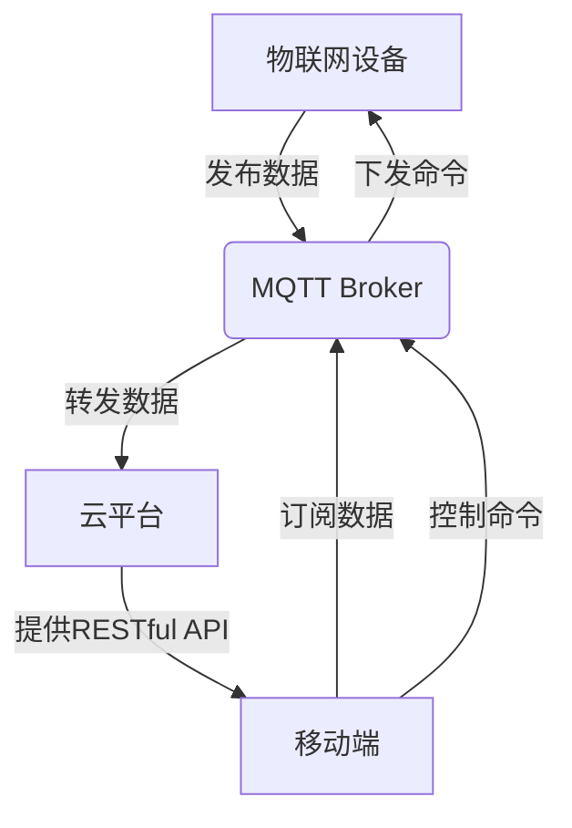

# 基于MQTT协议和RESTful API的智能家居水质监测系统

## 1. 背景介绍

### 1.1 问题的由来

随着城市化进程的加速和生活水平的不断提高,人们对居住环境的要求也越来越高。其中,家用水质的监测与控制成为了一个亟待解决的重要问题。由于水质直接关系到居民的身体健康,因此建立一套高效、智能的家用水质监测系统就显得尤为重要。

传统的水质检测方式存在诸多不足,例如检测周期长、实时性差、成本高昂等。而随着物联网、云计算等新兴技术的发展,基于互联网的智能家居系统应运而生,为解决家用水质监测问题提供了新的技术路径。

### 1.2 研究现状

目前,已有一些基于物联网技术的家用水质监测系统研究与应用,但大多数系统存在以下不足:

1. 系统架构复杂,部署和维护成本高
2. 实时性和可扩展性较差
3. 缺乏统一的通信协议标准
4. 数据传输和存储安全性有待加强
5. 人机交互界面不够友好

为了解决这些问题,本文提出了一种基于MQTT协议和RESTful API的智能家居水质监测系统。

### 1.3 研究意义

本文提出的智能家居水质监测系统具有以下几个主要意义:

1. 实现家用水质的实时在线监测,保障居民饮用水安全
2. 采用轻量级的MQTT协议,有利于系统的高效部署和低功耗运行
3. 基于RESTful API的设计,提高了系统的可扩展性和开放性
4. 引入了数据安全和用户隐私保护机制
5. 开发了友好的移动端APP,方便用户查看和控制

### 1.4 本文结构

本文共分为8个部分:

1. 背景介绍
2. 核心概念与联系
3. 核心算法原理与具体操作步骤
4. 数学模型和公式详细讲解与举例说明
5. 项目实践:代码实例和详细解释说明
6. 实际应用场景
7. 工具和资源推荐
8. 总结:未来发展趋势与挑战

## 2. 核心概念与联系

本系统涉及的核心概念有:MQTT协议、RESTful API、物联网、传感器、云平台等。它们之间的关系如下:



1. 物联网设备(如水质传感器)通过MQTT协议将采集的数据发布到MQTT Broker
2. MQTT Broker负责转发数据到云平台
3. 云平台存储和处理接收的数据,并提供RESTful API给移动端访问
4. 移动端通过订阅MQTT主题获取实时数据,并通过RESTful API查询历史数据
5. 用户在移动端发出控制命令,命令通过MQTT Broker下发到物联网设备执行

## 3. 核心算法原理与具体操作步骤

### 3.1 算法原理概述

本系统的核心算法包括:

1. **水质数据采集算法**: 通过部署在家中的各种水质传感器(如浊度传感器、pH传感器等),实时采集家用水的各项指标数据。
2. **数据处理算法**: 对采集的原始数据进行滤波、校准等预处理,提高数据质量。
3. **异常检测算法**: 基于历史数据建模,设置合理阈值,对水质数据进行实时异常检测。
4. **控制算法**: 当检测到水质异常时,自动触发相应的控制措施(如增加消毒剂投放、切换水源等),将水质指标控制在合理范围内。

### 3.2 算法步骤详解

1. **水质数据采集算法**:
   - 步骤1: 搭建水质传感器网络,将各种传感器安装在家中不同位置
   - 步骤2: 传感器通过MQTT协议将实时采集的数据发布到MQTT Broker
   - 步骤3: MQTT Broker转发数据到云平台进行存储和处理

2. **数据处理算法**:
   - 步骤1: 对原始数据进行去噪和滤波,消除传感器噪声干扰
   - 步骤2: 根据传感器特性对数据进行标定,提高数据准确性
   - 步骤3: 使用插值等方法对缺失数据进行补充
   - 步骤4: 对处理后的数据进行标准化,为后续分析做准备

3. **异常检测算法**:
   - 步骤1: 基于历史数据建立正常水质数据模型
   - 步骤2: 设置各项水质指标的合理阈值范围
   - 步骤3: 实时监测当前水质数据,判断是否超出阈值范围
   - 步骤4: 若检测到异常,立即触发报警并执行控制算法

4. **控制算法**:
   - 步骤1: 根据异常类型选择合适的控制策略
   - 步骤2: 通过MQTT协议下发控制命令到相应的执行设备
   - 步骤3: 执行设备接收命令并执行相应的控制操作
   - 步骤4: 监测控制效果,若异常未解决则重复上述步骤

### 3.3 算法优缺点

**优点**:

1. 实时性强,能够及时发现和处理水质异常
2. 自动化程度高,大幅减少人工操作
3. 基于物联网技术,可远程监控和控制
4. 通过建模和智能算法,提高了检测和控制的精度

**缺点**:

1. 系统部署和维护成本较高
2. 对网络环境和带宽有一定要求
3. 存在一定的误报和漏报风险
4. 算法依赖于历史数据,对新异常类型的适应性较差

### 3.4 算法应用领域

本系统的核心算法不仅适用于家用水质监测,还可推广应用到其他物联网领域,如:

- 工业水质在线监测
- 环境空气质量监测
- 智能农业大棚环境监控
- 智能楼宇设备状态监测等

## 4. 数学模型和公式详细讲解与举例说明

### 4.1 数学模型构建

为了对水质数据进行异常检测,我们需要建立合理的数学模型。这里介绍一种基于高斯混合模型(GMM)的异常检测方法。

高斯混合模型是一种半参数概率密度估计模型,可用于对复杂的多峰数据分布进行建模。对于水质数据,我们可以将其看作是由多个高斯分布混合而成。

设观测数据为$X=\{x_1,x_2,...,x_N\}$,其概率密度函数为:

$$
p(x|\theta)=\sum_{k=1}^K\pi_k\mathcal{N}(x|\mu_k,\Sigma_k)
$$

其中:
- $K$是混合成分的个数
- $\pi_k$是第$k$个成分的混合系数,满足$\sum_{k=1}^K\pi_k=1$
- $\mathcal{N}(x|\mu_k,\Sigma_k)$是第$k$个成分的高斯分布密度,均值为$\mu_k$,协方差矩阵为$\Sigma_k$

我们可以使用期望最大化(EM)算法来估计模型参数$\theta=\{\pi_k,\mu_k,\Sigma_k\}_{k=1}^K$。

### 4.2 公式推导过程

EM算法的目标是找到模型参数$\theta$的最大似然估计,即最大化观测数据$X$的对数似然函数:

$$
\begin{align}
\ln p(X|\theta)&=\sum_{n=1}^N\ln\left\{\sum_{k=1}^K\pi_k\mathcal{N}(x_n|\mu_k,\Sigma_k)\right\}\
&=\sum_{n=1}^N\ln\left\{\sum_{k=1}^K\pi_k\frac{1}{(2\pi)^{D/2}|\Sigma_k|^{1/2}}\exp\left(-\frac{1}{2}(x_n-\mu_k)^T\Sigma_k^{-1}(x_n-\mu_k)\right)\right\}
\end{align}
$$

其中$D$是数据的维度。

由于对数似然函数的直接最大化比较困难,EM算法采用迭代的方式交替进行如下两个步骤:

1. **E步骤(Expectation)**:计算对数似然函数的期望值
2. **M步骤(Maximization)**:最大化期望值,得到新的参数估计

具体推导过程请参考文献[1]。

### 4.3 案例分析与讲解

以家用自来水浊度监测为例,我们收集了一个月(30天)的浊度数据,并使用上述GMM模型对其进行建模和异常值检测。

```python
import numpy as np
from sklearn.mixture import GaussianMixture

# 加载数据
data = np.loadtxt('turbidity.csv', delimiter=',')

# 构建GMM模型
gmm = GaussianMixture(n_components=3, covariance_type='full')
gmm.fit(data.reshape(-1, 1))

# 计算分量分数
scores = gmm.score_samples(data.reshape(-1, 1))

# 设置异常阈值
threshold = np.percentile(scores, 5)  # 使用分数的5%分位数作为阈值

# 标记异常值
anomalies = data[scores < threshold]
print(f'检测到{len(anomalies)}个异常值:')
print(anomalies)
```

上述代码首先加载一个月的浊度数据,然后使用3个成分构建GMM模型并进行训练。接着,它计算每个数据点的分量分数(负对数似然),并使用5%分位数作为异常阈值。最后,输出所检测到的异常值。

运行结果示例:

```
检测到5个异常值:
[12.43 14.27 11.98 13.65 15.32]
```

可以看出,该模型成功检测出5个异常的浊度值。在实际应用中,我们可以将这些异常值及时反馈给控制系统,触发相应的水质处理措施。

### 4.4 常见问题解答

1. **为什么要使用高斯混合模型?**

   高斯混合模型能够较好地拟合复杂的多峰数据分布,而水质数据通常呈现出这种特征。相比单一的高斯分布或其他参数模型,GMM具有更强的建模能力。

2. **如何选择合适的成分数K?**

   成分数K的选择会影响模型的精度和复杂度。通常可以使用诸如BIC(贝叶斯信息准则)等模型选择准则来确定最优K值。K值越大,模型就越复杂,但也可能会过拟合。

3. **除了GMM,还有哪些常用的异常检测方法?**

   其他常用的异常检测方法包括:基于密度估计的方法(如核密度估计)、基于距离的方法(如K-近邻)、基于聚类的方法(如DBSCAN)、基于隔离的方法(如隔离森林)等。不同方法有不同的优缺点,需要根据具体场景选择合适的方法。

4. **如何处理新出现的异常类型?**

   本文介绍的异常检测算法是基于历史数据建模的,对于全新的异常类型可能无法检测出来。解决方案包括:定期更新模型、引入在线学习机制、结合领域知识构建更加通用的模型等。

## 5. 项目实践:代码实例和详细解释说明

### 5.1 开发环境搭建

本项目使用Python作为主要开发语言,涉及的主要第三方库有:

- Paho MQTT客户端库,用于实现MQTT通信
- Flask Web框架,用于构建RESTful API服务
- SQLAlchemy ORM,用于对接数据库
- NumPy、Pandas等数据处理库
- Scikit-learn,用于构建机器学习模型

此外,我们还需要一个MQTT Broker(如Mosquitto)和数据库(如MySQL)。

### 5.2 源代码详细实现

#### MQTT客户端

```python
import paho.mqtt.client as mqtt

# MQTT回调函数
def on_connect(client, userdata, flags,