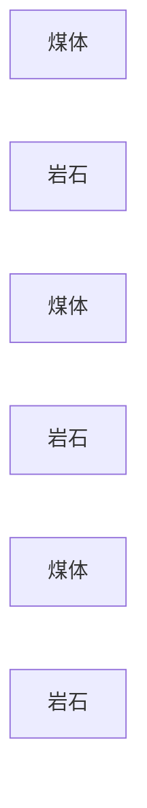

# 基于边缘检测的煤与岩石图像分割方法研究

## 1. 背景介绍

### 1.1 问题的由来

煤炭作为重要的能源资源，其开采和利用对国民经济发展具有重要意义。在煤矿开采过程中，准确识别和分割煤体与岩石是安全生产、提高采掘效率的关键环节。传统的煤与岩石识别方法主要依靠人工经验，存在效率低、准确率不高、易受主观因素影响等问题。随着计算机视觉技术的快速发展，利用图像处理技术实现煤与岩石的自动识别和分割成为研究热点。

### 1.2 研究现状

近年来，基于图像处理的煤与岩石分割方法取得了显著进展，主要包括以下几种：

* **基于阈值分割的方法：** 通过设置阈值将图像像素分为煤体和岩石两类，简单易行，但对图像噪声敏感，难以处理复杂场景。
* **基于聚类分析的方法：** 将图像像素聚集成不同的类别，如K-means聚类、模糊C均值聚类等，能够处理一定程度的噪声，但需要预先确定聚类中心，对参数敏感。
* **基于机器学习的方法：** 利用机器学习模型，如支持向量机、神经网络等，学习煤体和岩石的特征，实现图像分割，能够处理复杂场景，但需要大量训练数据。
* **基于深度学习的方法：** 利用深度神经网络，如卷积神经网络、循环神经网络等，自动学习图像特征，实现图像分割，具有较高的准确率，但需要大量训练数据，模型复杂。

### 1.3 研究意义

基于边缘检测的煤与岩石图像分割方法具有以下意义：

* **提高煤矿安全生产水平：** 准确识别和分割煤体与岩石，可以及时发现潜在的危险区域，避免事故发生。
* **提高采掘效率：** 自动识别和分割煤体与岩石，可以减少人工操作，提高采掘效率。
* **促进煤炭行业智能化发展：** 基于图像处理技术的煤与岩石识别和分割，是煤炭行业智能化发展的重要方向。

### 1.4 本文结构

本文将首先介绍基于边缘检测的煤与岩石图像分割方法的核心概念和原理，然后详细介绍算法步骤、数学模型和公式，并通过代码实例和实际应用场景进行说明。最后，本文将总结研究成果，展望未来发展趋势和面临的挑战。

## 2. 核心概念与联系

**边缘检测** 是图像处理中的一个重要概念，是指在图像中识别和定位物体的边界。边缘通常对应于图像亮度、颜色或纹理的突变。边缘检测是图像分割、目标识别、特征提取等图像处理任务的基础。

**煤与岩石图像分割** 是指将煤与岩石图像分割成不同的区域，以便于识别和分析。边缘检测是煤与岩石图像分割的重要方法之一，通过识别煤体和岩石的边缘，可以将它们分割开来。

## 3. 核心算法原理 & 具体操作步骤

### 3.1 算法原理概述

基于边缘检测的煤与岩石图像分割方法主要利用图像边缘信息，通过边缘检测算法识别煤体和岩石的边界，然后利用分割算法将图像分割成不同的区域。

### 3.2 算法步骤详解

基于边缘检测的煤与岩石图像分割方法主要包括以下步骤：

1. **图像预处理：** 对原始图像进行灰度化、噪声去除、图像增强等操作，以便于后续的边缘检测。
2. **边缘检测：** 利用边缘检测算法识别煤体和岩石的边界，常用的边缘检测算法包括：
    * **Sobel算子：** 对图像进行水平和垂直方向的微分运算，检测边缘。
    * **Canny算子：** 是一种常用的边缘检测算法，能够有效地抑制噪声，检测出清晰的边缘。
    * **Laplacian算子：** 对图像进行二阶微分运算，检测边缘。
3. **边缘连接：** 将检测到的边缘进行连接，形成完整的边界。
4. **区域分割：** 利用分割算法将图像分割成不同的区域，常用的分割算法包括：
    * **阈值分割：** 通过设置阈值将图像像素分为不同的类别。
    * **区域生长：** 从一个种子点开始，根据一定的规则将相邻的像素合并到同一个区域。
    * **分水岭算法：** 将图像看作地形，找到分水岭，将图像分割成不同的区域。

### 3.3 算法优缺点

**优点：**

* **能够有效地识别煤体和岩石的边界：** 基于边缘检测的算法能够有效地识别煤体和岩石的边界，从而实现图像分割。
* **对噪声有一定的鲁棒性：** 某些边缘检测算法，如Canny算子，能够有效地抑制噪声，提高分割精度。
* **计算效率较高：** 相比于其他图像分割方法，基于边缘检测的算法计算效率较高。

**缺点：**

* **对复杂场景的处理能力有限：** 当图像中存在复杂的纹理、阴影等干扰因素时，边缘检测算法的效果会受到影响。
* **需要进行参数调整：** 不同的边缘检测算法需要进行参数调整，才能获得最佳的分割效果。

### 3.4 算法应用领域

基于边缘检测的煤与岩石图像分割方法可以应用于以下领域：

* **煤矿安全生产：** 识别和分割煤体与岩石，可以及时发现潜在的危险区域，避免事故发生。
* **煤炭开采：** 自动识别和分割煤体与岩石，可以提高采掘效率。
* **煤炭资源勘探：** 识别和分割煤体与岩石，可以帮助进行煤炭资源勘探。

## 4. 数学模型和公式 & 详细讲解 & 举例说明

### 4.1 数学模型构建

基于边缘检测的煤与岩石图像分割方法的数学模型可以描述为：

$$
I(x, y) = \begin{cases}
C, & \text{if } (x, y) \in \text{煤体} \
R, & \text{if } (x, y) \in \text{岩石}
\end{cases}
$$

其中，$I(x, y)$ 表示图像在坐标 $(x, y)$ 处的像素值，$C$ 表示煤体像素值，$R$ 表示岩石像素值。

### 4.2 公式推导过程

边缘检测算法通常利用图像梯度信息来识别边缘。图像梯度是指图像亮度变化率，可以用以下公式计算：

$$
\nabla I(x, y) = \begin{bmatrix}
\frac{\partial I}{\partial x} \
\frac{\partial I}{\partial y}
\end{bmatrix}
$$

其中，$\frac{\partial I}{\partial x}$ 和 $\frac{\partial I}{\partial y}$ 分别表示图像在 $x$ 方向和 $y$ 方向的偏导数。

边缘检测算法通常利用图像梯度的模值和方向来识别边缘。梯度模值表示边缘的强度，梯度方向表示边缘的方向。

### 4.3 案例分析与讲解

假设有一张煤与岩石图像，如图所示：


利用Canny算子进行边缘检测，可以识别出煤体和岩石的边界，如图所示：


然后利用区域生长算法，将图像分割成不同的区域，如图所示：



### 4.4 常见问题解答

* **如何选择合适的边缘检测算法？** 不同的边缘检测算法具有不同的特点，需要根据实际情况选择合适的算法。例如，Canny算子能够有效地抑制噪声，检测出清晰的边缘，适用于噪声较大的图像；Sobel算子能够快速检测边缘，适用于实时处理。
* **如何设置合适的阈值？** 阈值的选择会影响分割结果，需要根据实际情况进行调整。一般来说，阈值过低会造成过度分割，阈值过高会造成欠分割。
* **如何处理复杂场景？** 当图像中存在复杂的纹理、阴影等干扰因素时，可以采用多尺度边缘检测、形态学处理等方法来提高分割精度。

## 5. 项目实践：代码实例和详细解释说明

### 5.1 开发环境搭建

* **编程语言：** Python
* **图像处理库：** OpenCV
* **机器学习库：** scikit-learn

### 5.2 源代码详细实现

```python
import cv2
import numpy as np

# 加载图像
img = cv2.imread('coal_rock.jpg')

# 灰度化
gray = cv2.cvtColor(img, cv2.COLOR_BGR2GRAY)

# Canny边缘检测
edges = cv2.Canny(gray, 100, 200)

# 区域生长
ret, markers = cv2.connectedComponents(edges)

# 分割图像
segmented_img = np.zeros_like(img)
for i in range(1, markers.max() + 1):
    segmented_img[markers == i] = [255, 0, 0] if i % 2 == 0 else [0, 255, 0]

# 显示结果
cv2.imshow('Original Image', img)
cv2.imshow('Edges', edges)
cv2.imshow('Segmented Image', segmented_img)
cv2.waitKey(0)
cv2.destroyAllWindows()
```

### 5.3 代码解读与分析

* 代码首先加载图像并进行灰度化。
* 然后利用Canny算子进行边缘检测，并利用区域生长算法将图像分割成不同的区域。
* 最后将分割后的图像显示出来。

### 5.4 运行结果展示

运行代码后，可以得到以下结果：

* **原始图像：** 显示原始煤与岩石图像。
* **边缘图像：** 显示边缘检测后的图像，可以看到煤体和岩石的边界。
* **分割图像：** 显示分割后的图像，可以看到煤体和岩石被分割成不同的区域。

## 6. 实际应用场景

### 6.1 煤矿安全生产

基于边缘检测的煤与岩石图像分割方法可以应用于煤矿安全生产，识别和分割煤体与岩石，可以及时发现潜在的危险区域，避免事故发生。

### 6.2 煤炭开采

基于边缘检测的煤与岩石图像分割方法可以应用于煤炭开采，自动识别和分割煤体与岩石，可以提高采掘效率。

### 6.3 煤炭资源勘探

基于边缘检测的煤与岩石图像分割方法可以应用于煤炭资源勘探，识别和分割煤体与岩石，可以帮助进行煤炭资源勘探。

### 6.4 未来应用展望

随着计算机视觉技术的不断发展，基于边缘检测的煤与岩石图像分割方法将会得到更广泛的应用，例如：

* **结合三维重建技术，实现煤体和岩石的三维模型重建。**
* **结合深度学习技术，提高分割精度和鲁棒性。**
* **应用于其他矿产资源的识别和分割。**

## 7. 工具和资源推荐

### 7.1 学习资源推荐

* **OpenCV官方网站：** [https://opencv.org/](https://opencv.org/)
* **scikit-learn官方网站：** [https://scikit-learn.org/stable/](https://scikit-learn.org/stable/)
* **图像处理教程：** [https://www.pyimagesearch.com/](https://www.pyimagesearch.com/)

### 7.2 开发工具推荐

* **Python：** 是一种常用的编程语言，适合进行图像处理。
* **OpenCV：** 一个开源的计算机视觉库，提供了丰富的图像处理函数。
* **scikit-learn：** 一个机器学习库，提供了各种机器学习算法。

### 7.3 相关论文推荐

* **Canny, J. (1986). A computational approach to edge detection. IEEE Transactions on pattern analysis and machine intelligence, 8(6), 679-698.**
* **Gonzalez, R. C., & Woods, R. E. (2018). Digital image processing. Pearson Education.**

### 7.4 其他资源推荐

* **GitHub：** [https://github.com/](https://github.com/)
* **Stack Overflow：** [https://stackoverflow.com/](https://stackoverflow.com/)

## 8. 总结：未来发展趋势与挑战

### 8.1 研究成果总结

本文介绍了基于边缘检测的煤与岩石图像分割方法，详细介绍了算法原理、步骤、数学模型、代码实例和实际应用场景。该方法能够有效地识别煤体和岩石的边界，实现图像分割，具有较高的效率和精度。

### 8.2 未来发展趋势

基于边缘检测的煤与岩石图像分割方法将会得到更广泛的应用，未来发展趋势包括：

* **结合三维重建技术，实现煤体和岩石的三维模型重建。**
* **结合深度学习技术，提高分割精度和鲁棒性。**
* **应用于其他矿产资源的识别和分割。**

### 8.3 面临的挑战

基于边缘检测的煤与岩石图像分割方法仍然面临一些挑战，例如：

* **对复杂场景的处理能力有限：** 当图像中存在复杂的纹理、阴影等干扰因素时，边缘检测算法的效果会受到影响。
* **需要进行参数调整：** 不同的边缘检测算法需要进行参数调整，才能获得最佳的分割效果。
* **缺乏统一的评价标准：** 不同的图像分割方法的评价指标不同，缺乏统一的评价标准。

### 8.4 研究展望

未来，需要进一步研究和开发新的边缘检测算法，提高分割精度和鲁棒性，并探索新的应用场景，推动煤炭行业智能化发展。

## 9. 附录：常见问题与解答

**Q1：如何选择合适的边缘检测算法？**

**A1：** 不同的边缘检测算法具有不同的特点，需要根据实际情况选择合适的算法。例如，Canny算子能够有效地抑制噪声，检测出清晰的边缘，适用于噪声较大的图像；Sobel算子能够快速检测边缘，适用于实时处理。

**Q2：如何设置合适的阈值？**

**A2：** 阈值的选择会影响分割结果，需要根据实际情况进行调整。一般来说，阈值过低会造成过度分割，阈值过高会造成欠分割。

**Q3：如何处理复杂场景？**

**A3：** 当图像中存在复杂的纹理、阴影等干扰因素时，可以采用多尺度边缘检测、形态学处理等方法来提高分割精度。

**Q4：如何评价图像分割结果？**

**A4：** 可以使用以下指标来评价图像分割结果：

* **准确率：** 正确分割的像素数占总像素数的比例。
* **召回率：** 正确分割的像素数占所有目标像素数的比例。
* **F1值：** 准确率和召回率的调和平均数。

**Q5：如何提高分割精度？**

**A5：** 可以通过以下方法提高分割精度：

* **选择合适的边缘检测算法。**
* **设置合适的阈值。**
* **使用多尺度边缘检测。**
* **使用形态学处理。**
* **使用深度学习技术。**

作者：禅与计算机程序设计艺术 / Zen and the Art of Computer Programming
