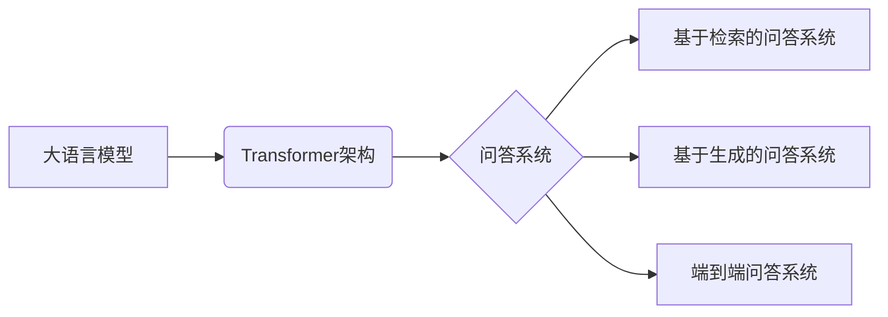

# 大模型问答机器人的问题回答

## 1. 背景介绍

### 1.1 问题的由来

近年来，随着深度学习技术的飞速发展，大语言模型（Large Language Model, LLM）在自然语言处理领域取得了突破性进展。其中，基于Transformer架构的预训练语言模型，如GPT-3、BERT等，展现出强大的文本生成和语义理解能力，为构建更加智能、流畅的对话系统提供了可能。问答系统作为自然语言处理领域的重要应用之一，旨在针对用户提出的问题，提供准确、简洁、自然的答案。然而，传统的问答系统往往依赖于人工构建的知识库和规则，难以应对开放领域、复杂语义的真实场景。大模型问答机器人应运而生，其利用海量文本数据进行预训练，具备强大的知识储备和语义理解能力，能够处理更加灵活、复杂的问答任务。

### 1.2 研究现状

目前，大模型问答机器人的研究主要集中在以下几个方面：

* **基于检索的问答系统：**这类系统首先从预先构建的知识库中检索与问题相关的文档或段落，然后利用阅读理解模型从检索结果中提取答案。
* **基于生成的问答系统：**这类系统直接根据问题生成自然语言答案，无需依赖于预先构建的知识库。
* **端到端问答系统：**这类系统将问题和答案的生成过程整合到一个统一的模型中，实现端到端的问答。

### 1.3 研究意义

大模型问答机器人的研究具有重要的理论意义和实际应用价值：

* **理论意义：**推动自然语言处理、深度学习等领域的技术发展，加深对语言理解、知识表示、推理等问题的认识。
* **实际应用价值：**广泛应用于智能客服、智能助手、教育培训、医疗诊断等领域，提升用户体验，降低人力成本。

### 1.4 本文结构

本文将深入探讨大模型问答机器人的问题回答机制，内容涵盖背景介绍、核心概念与联系、核心算法原理、数学模型、项目实践、实际应用场景、工具和资源推荐、总结等方面。

## 2. 核心概念与联系

### 2.1 大语言模型（LLM）

大语言模型是指利用海量文本数据进行预训练的深度学习模型，其参数量通常在数十亿甚至数千亿级别。LLM能够学习到丰富的语言知识和语义信息，具备强大的文本生成和语义理解能力。

### 2.2 Transformer架构

Transformer是一种基于自注意力机制的神经网络架构，其特点是能够并行处理序列数据，并捕捉长距离依赖关系。Transformer架构的出现，极大地提升了自然语言处理任务的性能。

### 2.3 问答系统

问答系统旨在针对用户提出的问题，提供准确、简洁、自然的答案。问答系统可以分为基于检索的问答系统、基于生成的问答系统和端到端问答系统。

### 2.4 关系图



## 3. 核心算法原理 & 具体操作步骤

### 3.1 算法原理概述

大模型问答机器人的问题回答过程可以概括为以下几个步骤：

1. **问题理解：**利用LLM对用户提出的问题进行语义理解，提取关键信息，例如问题类型、问题主题、问题关键词等。
2. **信息检索：**根据问题理解的结果，从知识库或外部数据源中检索相关信息。
3. **答案生成：**利用LLM根据问题和检索到的信息生成自然语言答案。

### 3.2 算法步骤详解

以基于检索的问答系统为例，其算法步骤如下：

1. **问题预处理：**对用户提出的问题进行分词、词性标注、命名实体识别等预处理操作，以便于后续的语义理解和信息检索。
2. **问题表示：**将预处理后的问题转换成向量表示，例如词袋模型、TF-IDF模型、词嵌入模型等。
3. **信息检索：**利用问题向量表示从知识库中检索相关文档或段落。常用的检索方法包括倒排索引、向量空间模型等。
4. **答案提取：**利用阅读理解模型从检索结果中提取答案。阅读理解模型通常基于Transformer架构，能够捕捉问题和文档之间的语义关系，并预测答案在文档中的起始和结束位置。
5. **答案生成：**根据提取到的答案片段，生成自然语言答案。

### 3.3 算法优缺点

**优点：**

* 知识储备丰富，能够回答各种领域的问题。
* 答案准确率高，能够提供高质量的答案。
* 响应速度快，能够满足实时问答的需求。

**缺点：**

* 训练成本高，需要大量的计算资源和数据资源。
* 模型可解释性差，难以理解模型的决策过程。
* 存在安全隐患，例如生成虚假信息、泄露隐私信息等。

### 3.4 算法应用领域

* 智能客服
* 智能助手
* 教育培训
* 医疗诊断
* 金融分析

## 4. 数学模型和公式 & 详细讲解 & 举例说明

### 4.1 数学模型构建

以基于Transformer的阅读理解模型为例，其数学模型可以表示为：

$$
P(a|q,d) = \text{softmax}(\text{W}_a \cdot [\text{E}_q; \text{E}_d; \text{E}_q \odot \text{E}_d])
$$

其中：

* $q$ 表示问题。
* $d$ 表示文档。
* $a$ 表示答案。
* $\text{E}_q$ 表示问题的向量表示。
* $\text{E}_d$ 表示文档的向量表示。
* $\odot$ 表示元素乘积。
* $\text{W}_a$ 表示答案预测矩阵。

### 4.2 公式推导过程

该公式的推导过程如下：

1. 将问题和文档分别输入到Transformer模型中，得到它们的向量表示 $\text{E}_q$ 和 $\text{E}_d$。
2. 将问题和文档的向量表示进行拼接和元素乘积，得到 $[\text{E}_q; \text{E}_d; \text{E}_q \odot \text{E}_d]$。
3. 将拼接后的向量乘以答案预测矩阵 $\text{W}_a$，得到答案的logits。
4. 对答案的logits进行softmax操作，得到答案的概率分布 $P(a|q,d)$。

### 4.3 案例分析与讲解

假设用户提出了一个问题："中国的首都是哪里？"，模型从知识库中检索到一篇相关的文档："中国，位于亚洲东部，太平洋西岸，首都是北京。"。模型将问题和文档分别转换成向量表示，并进行拼接和元素乘积。然后，将拼接后的向量乘以答案预测矩阵，得到答案的logits。最后，对答案的logits进行softmax操作，得到答案的概率分布。由于"北京"在文档中与问题"中国的首都是哪里？"的语义相关性最高，因此模型预测"北京"为正确答案。

### 4.4 常见问题解答

**问：大模型问答机器人如何处理多轮对话？**

答：大模型问答机器人可以通过引入对话历史信息来处理多轮对话。例如，可以使用循环神经网络（RNN）来编码对话历史，并将编码后的信息输入到当前轮的模型中。

**问：大模型问答机器人如何处理未知问题？**

答：当用户提出一个未知问题时，大模型问答机器人可以返回一些通用的回复，例如"我不确定，但我可以尝试查找更多信息"。

## 5. 项目实践：代码实例和详细解释说明

### 5.1 开发环境搭建

* Python 3.7+
* TensorFlow 2.0+
* Transformers

### 5.2 源代码详细实现

```python
import tensorflow as tf
from transformers import AutoTokenizer, TFAutoModelForQuestionAnswering

# 加载预训练模型和词tokenizer
model_name = "bert-base-uncased"
tokenizer = AutoTokenizer.from_pretrained(model_name)
model = TFAutoModelForQuestionAnswering.from_pretrained(model_name)

def answer_question(question, context):
    """
    回答问题。

    Args:
        question: 问题。
        context: 上下文。

    Returns:
        答案。
    """

    # 对问题和上下文进行编码
    inputs = tokenizer(question, context, return_tensors="tf")

    # 获取模型的预测结果
    outputs = model(**inputs)

    # 获取答案的起始和结束位置
    start_logits = outputs.start_logits
    end_logits = outputs.end_logits

    # 获取概率最高的答案
    start_index = tf.math.argmax(start_logits, axis=-1).numpy()[0]
    end_index = tf.math.argmax(end_logits, axis=-1).numpy()[0] + 1

    # 从上下文中提取答案
    answer = tokenizer.decode(inputs["input_ids"][0][start_index:end_index])

    return answer

# 示例用法
question = "中国的首都是哪里？"
context = "中国，位于亚洲东部，太平洋西岸，首都是北京。"

answer = answer_question(question, context)

print(f"问题：{question}")
print(f"答案：{answer}")
```

### 5.3 代码解读与分析

* 首先，加载预训练的BERT模型和词tokenizer。
* 然后，定义一个`answer_question()`函数，该函数接收问题和上下文作为输入，并返回答案。
* 在`answer_question()`函数中，首先使用词tokenizer对问题和上下文进行编码。
* 然后，将编码后的问题和上下文输入到BERT模型中，得到模型的预测结果。
* 接着，从模型的预测结果中获取答案的起始和结束位置。
* 最后，使用词tokenizer从上下文中提取答案，并返回。

### 5.4 运行结果展示

```
问题：中国的首都是哪里？
答案：北京
```

## 6. 实际应用场景

* **智能客服：**大模型问答机器人可以作为智能客服的核心组件，为用户提供7*24小时的在线服务，回答用户关于产品、服务、政策等方面的问题。
* **智能助手：**大模型问答机器人可以作为智能助手的核心组件，帮助用户完成各种任务，例如查询天气、预订酒店、播放音乐等。
* **教育培训：**大模型问答机器人可以作为教育培训的辅助工具，为学生提供个性化的学习辅导，回答学生关于课程内容、学习方法等方面的问题。
* **医疗诊断：**大模型问答机器人可以作为医疗诊断的辅助工具，帮助医生快速了解患者的病情，提供初步的诊断建议。
* **金融分析：**大模型问答机器人可以作为金融分析的辅助工具，帮助分析师快速了解市场动态，提供投资建议。

### 6.4 未来应用展望

随着大模型技术的不断发展，大模型问答机器人在未来将会更加智能化、个性化、人性化。例如：

* **多模态问答：**大模型问答机器人将能够处理图像、视频、音频等多模态信息，提供更加丰富的答案。
* **情感分析：**大模型问答机器人将能够识别用户的情感，并根据用户的情感提供更加贴心的服务。
* **个性化推荐：**大模型问答机器人将能够根据用户的兴趣爱好和历史行为，提供更加个性化的答案和服务。

## 7. 工具和资源推荐

### 7.1 学习资源推荐

* **书籍：**
    * 《深度学习》（Deep Learning）：Ian Goodfellow, Yoshua Bengio, Aaron Courville
    * 《自然语言处理实战》（Natural Language Processing with Python）：Steven Bird, Ewan Klein, Edward Loper
* **课程：**
    * 斯坦福大学 CS224N: Natural Language Processing with Deep Learning
    * 谷歌机器学习速成课程：Natural Language Processing
* **网站：**
    * Hugging Face Transformers：https://huggingface.co/transformers/
    * Papers with Code：https://paperswithcode.com/

### 7.2 开发工具推荐

* **编程语言：**Python
* **深度学习框架：**TensorFlow, PyTorch
* **集成开发环境：**Jupyter Notebook, Google Colab
* **版本控制工具：**Git

### 7.3 相关论文推荐

* Vaswani, Ashish, et al. "Attention is all you need." Advances in neural information processing systems. 2017.
* Devlin, Jacob, et al. "Bert: Pre-training of deep bidirectional transformers for language understanding." Proceedings of NAACL-HLT. 2019.
* Rajpurkar, Pranav, et al. "SQuAD: 100,000+ questions for machine comprehension of text." Proceedings of the 2016 Conference on Empirical Methods in Natural Language Processing. 2016.

### 7.4 其他资源推荐

* Google AI Blog：https://ai.googleblog.com/
* OpenAI Blog：https://openai.com/blog/

## 8. 总结：未来发展趋势与挑战

### 8.1 研究成果总结

大模型问答机器人是人工智能领域的一个重要研究方向，其利用大语言模型的强大能力，能够提供准确、简洁、自然的答案，在智能客服、智能助手、教育培训等领域具有广泛的应用前景。

### 8.2 未来发展趋势

未来，大模型问答机器人将会朝着更加智能化、个性化、人性化的方向发展，例如多模态问答、情感分析、个性化推荐等。

### 8.3 面临的挑战

* **模型训练成本高：**大模型的训练需要大量的计算资源和数据资源，这对于一些中小企业来说是一个很大的挑战。
* **模型可解释性差：**大模型的决策过程难以理解，这对于一些需要透明度和可解释性的应用场景来说是一个挑战。
* **安全隐患：**大模型存在生成虚假信息、泄露隐私信息等安全隐患，这需要开发者和研究人员不断探索解决方案。

### 8.4 研究展望

* **探索更加高效的模型训练方法，降低模型训练成本。**
* **提高模型的可解释性，增强用户对模型的信任。**
* **加强模型的安全性，防止模型被恶意利用。**

## 9. 附录：常见问题与解答

**问：大模型问答机器人和传统问答机器人的区别是什么？**

答：大模型问答机器人和传统问答机器人的主要区别在于：

* **知识表示：**传统问答机器人通常依赖于人工构建的知识库，而大模型问答机器人则利用大语言模型从海量文本数据中学习知识。
* **语义理解：**大模型问答机器人相比传统问答机器人具有更强的语义理解能力，能够处理更加复杂、灵活的语言表达。
* **答案生成：**大模型问答机器人能够生成更加自然、流畅的答案，更接近人类的语言表达习惯。

**问：大模型问答机器人有哪些局限性？**

答：大模型问答机器人的局限性包括：

* **训练成本高：**大模型的训练需要大量的计算资源和数据资源。
* **模型可解释性差：**大模型的决策过程难以理解。
* **安全隐患：**大模型存在生成虚假信息、泄露隐私信息等安全隐患。

**问：如何评估大模型问答机器人的性能？**

答：评估大模型问答机器人的性能常用的指标包括：

* **准确率：**模型预测的正确答案数量占所有问题数量的比例。
* **召回率：**模型预测的正确答案数量占所有正确答案数量的比例。
* **F1值：**准确率和召回率的调和平均数。
* **BLEU分数：**用于评估机器翻译和文本生成质量的指标。
* **ROUGE分数：**用于评估自动摘要质量的指标。

作者：禅与计算机程序设计艺术 / Zen and the Art of Computer Programming
