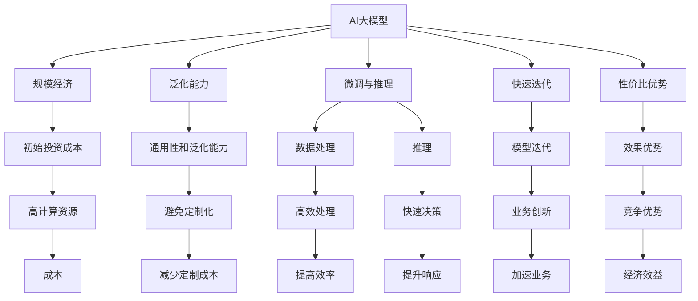
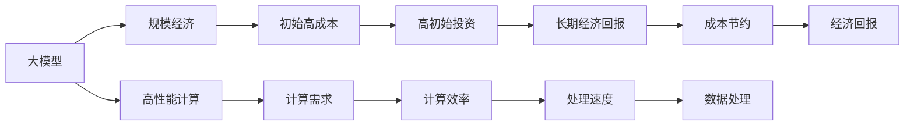
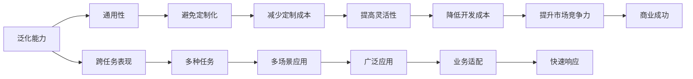
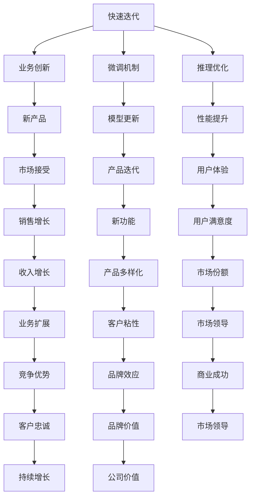
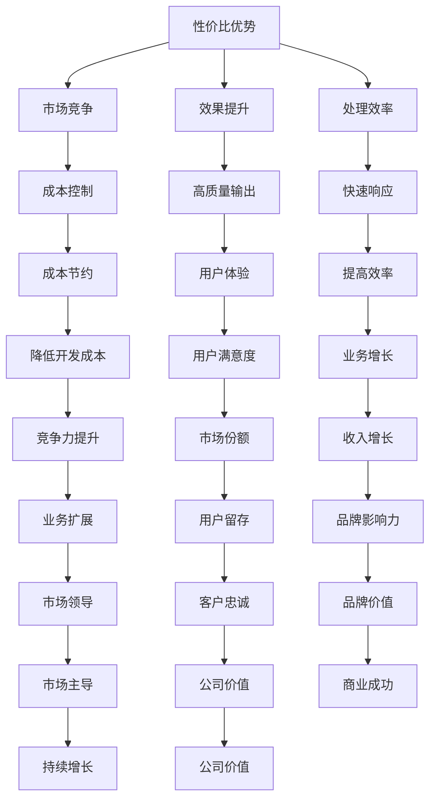
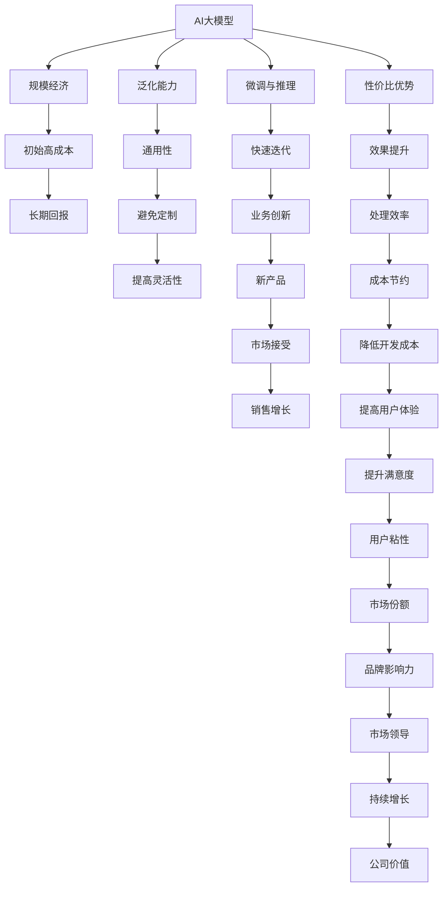

                 

## 1. 背景介绍

### 1.1 问题由来
随着人工智能技术的不断进步，AI大模型在诸多领域取得了令人瞩目的成绩。无论是医疗、教育、金融，还是自动驾驶、游戏AI，AI大模型均展现了强大的表现力。而以ChatGPT、GPT-4等为代表的大模型，其超凡的性能也推动了AI创业的风口浪潮。本文旨在探索AI大模型创业的经济优势，并提出相关建议，以助企业把握机遇，应对挑战。

### 1.2 问题核心关键点
AI大模型的经济优势主要体现在以下几个方面：

- **规模经济**：大模型通常采用高性能计算资源进行训练，如GPU集群、TPU等，初始投资成本较高。但一旦训练完成，其在数据处理、推理等方面的效率远超小模型，因此可带来显著的经济回报。
- **通用性和泛化能力**：大模型可广泛应用于多种任务，如自然语言处理、计算机视觉、推荐系统等，大幅降低企业对特定任务的定制化开发成本。
- **快速迭代和升级**：基于大模型的创业公司可以快速进行微调、推理、部署，加速业务创新。
- **显著的性价比优势**：相比于小模型，大模型的效果往往更优，可以更好地满足用户需求，从而提升企业竞争力。

### 1.3 问题研究意义
AI大模型技术具有广阔的市场应用前景，其创业的成功不仅将带来经济收益，还将推动AI技术的普及与创新。本文通过分析AI大模型创业的经济优势，希望能为有意涉足该领域的创业者提供有价值的参考，帮助企业更好地把握市场机遇，提升竞争力。

## 2. 核心概念与联系

### 2.1 核心概念概述

为更好地理解AI大模型创业的经济优势，本节将介绍几个密切相关的核心概念：

- **AI大模型**：采用深度学习架构，如Transformer、BERT等，通过大规模数据进行预训练，具有强大的泛化能力和表示能力，能应用于多种任务，如自然语言处理、计算机视觉、语音识别等。
- **规模经济**：大模型的训练需要大量的计算资源，初始投资成本较高，但后续数据处理、推理等方面效率远超小模型，因此长期看能带来显著的经济收益。
- **泛化能力**：大模型能在不同任务、数据集上表现良好，具有较强的通用性和泛化能力，避免对特定任务的定制化开发。
- **微调与推理**：在特定任务上进行微调，即对大模型进行微小结构调整，快速提升性能。推理则是在给定输入数据下，模型进行预测、决策的过程。
- **快速迭代**：大模型易于微调和推理，企业可以快速进行模型迭代和升级，加速业务创新。
- **性价比优势**：大模型的效果往往优于小模型，且数据处理和推理效率更高，因此具有显著的性价比优势。

这些核心概念之间的逻辑关系可以通过以下Mermaid流程图来展示：



这个流程图展示了大模型在创业中的多个经济优势，包括规模经济、泛化能力、快速迭代和性价比优势等。

### 2.2 概念间的关系

这些核心概念之间存在着紧密的联系，形成了AI大模型创业的经济优势框架。下面我们通过几个Mermaid流程图来展示这些概念之间的关系。

#### 2.2.1 大模型与规模经济



这个流程图展示了大模型与规模经济的关系。大模型的训练需要高性能计算资源，初始投资成本较高，但后续数据处理和推理效率显著提高，因此能带来长期的经济回报。

#### 2.2.2 泛化能力与通用性



这个流程图展示了泛化能力如何带来通用性。大模型的泛化能力使得其在多种任务上表现良好，从而避免了对特定任务的定制化开发，降低了定制成本，提高了灵活性和市场竞争力。

#### 2.2.3 快速迭代与业务创新



这个流程图展示了快速迭代如何促进业务创新。通过微调和推理优化，企业可以快速进行产品迭代，提升性能和用户体验，从而在市场中占据优势地位，实现持续增长和商业成功。

#### 2.2.4 性价比优势与市场竞争



这个流程图展示了性价比优势如何带来市场竞争。大模型的效果优于小模型，且数据处理和推理效率更高，从而在市场中占据优势地位，实现持续增长和商业成功。

### 2.3 核心概念的整体架构

最后，我们用一个综合的流程图来展示这些核心概念在大模型创业中的整体架构：



这个综合流程图展示了从大模型到规模经济、泛化能力、快速迭代、性价比优势的整个架构，帮助创业者系统理解大模型创业的经济优势。

## 3. 核心算法原理 & 具体操作步骤
### 3.1 算法原理概述

AI大模型的创业主要利用其强大的泛化能力和规模经济特性，通过高效的数据处理和推理，为企业带来显著的经济回报。在具体实施过程中，一般需要以下步骤：

1. **数据收集与预处理**：收集并预处理数据，确保数据质量和多样性，满足模型训练需求。
2. **模型训练与微调**：选择合适的预训练模型，进行微调以适应特定任务，提升模型效果。
3. **产品部署与迭代**：将微调后的模型部署到生产环境中，进行业务应用和持续迭代优化。
4. **业务整合与创新**：将大模型与业务流程和数据集成，提升业务效率和用户体验。

### 3.2 算法步骤详解

下面是AI大模型创业的核心算法步骤：

#### 3.2.1 数据收集与预处理

**数据收集**：根据具体业务需求，收集相关的数据集，如文本数据、图片数据、语音数据等。数据需覆盖尽可能多的业务场景和用户群体，以确保模型泛化能力。

**数据预处理**：对收集的数据进行清洗、标注、分割等预处理，去除噪声和异常数据，划分为训练集、验证集和测试集。预处理环节需保证数据格式统一、标签准确，为后续模型训练和评估提供保障。

#### 3.2.2 模型训练与微调

**模型选择**：选择符合业务需求的预训练模型，如BERT、GPT等。大模型的选择需综合考虑模型性能、计算资源和业务需求。

**微调策略**：根据具体任务，选择合适的微调策略。通常可分为全模型微调和部分模型微调，前者需调整全部模型参数，后者仅调整顶层部分参数，以提高微调效率和效果。

**微调过程**：在训练集上训练模型，每轮迭代计算损失函数和梯度，更新模型参数。验证集用于模型监控和参数调整。测试集用于最终模型效果评估。

#### 3.2.3 产品部署与迭代

**模型部署**：将微调后的模型部署到生产环境，进行业务应用。部署需考虑模型推理速度、内存占用和资源配置等，确保系统稳定性和性能。

**业务应用**：在实际业务场景中应用微调模型，处理输入数据，生成输出结果。需定期评估模型性能，确保满足业务需求。

**持续迭代**：根据业务反馈和市场变化，持续进行模型优化和迭代。需定期收集用户反馈，进行模型微调和参数调整。

#### 3.2.4 业务整合与创新

**业务流程集成**：将大模型集成到企业现有的业务流程中，提升数据处理效率和业务决策能力。需考虑模型接口和数据格式，确保系统兼容性。

**用户交互优化**：利用大模型进行用户行为分析和情感分析，优化产品界面和用户体验。需分析用户行为数据，提取关键特征和需求。

**业务创新**：通过大模型进行个性化推荐、智能客服、数据分析等业务创新，提升企业竞争力。需结合实际业务场景，设计合理的应用方案。

### 3.3 算法优缺点

AI大模型的创业在带来显著经济优势的同时，也存在一些缺点：

**优点**：
1. **泛化能力强**：大模型能在多种任务上表现良好，避免定制化开发，降低成本。
2. **规模经济显著**：大模型的初始投资成本高，但后续处理和推理效率高，带来长期经济回报。
3. **快速迭代**：模型易于微调和部署，企业可以快速响应市场变化，提升产品竞争力。
4. **性价比高**：大模型的效果优于小模型，数据处理和推理效率高，带来显著的性价比优势。

**缺点**：
1. **初始投资成本高**：高性能计算资源需求大，初始投资成本较高。
2. **模型复杂度大**：大模型的参数量大，需要高性能计算资源支持。
3. **训练周期长**：模型训练和微调需大量计算资源和时间，需优化训练过程和资源配置。
4. **依赖数据质量**：模型性能受数据质量和多样性的影响，需保证数据标注准确和数据集多样性。

### 3.4 算法应用领域

AI大模型的创业广泛应用于多个领域，如自然语言处理、计算机视觉、推荐系统等。具体应用场景包括：

- **自然语言处理**：智能客服、聊天机器人、文本生成、情感分析等。
- **计算机视觉**：图像识别、人脸识别、物体检测等。
- **推荐系统**：个性化推荐、用户画像分析、内容推荐等。
- **金融领域**：风险评估、信用评分、市场预测等。
- **医疗领域**：疾病诊断、医学影像分析、患者咨询等。
- **智能制造**：生产过程监控、设备维护、质量检测等。
- **智慧城市**：智能交通、环境监测、公共安全等。

## 4. 数学模型和公式 & 详细讲解 & 举例说明（备注：数学公式请使用latex格式，latex嵌入文中独立段落使用 $$，段落内使用 $)
### 4.1 数学模型构建

AI大模型的创业主要利用其泛化能力和规模经济特性，通过高效的数据处理和推理，为企业带来显著的经济回报。数学模型可表示为：

$$
\begin{aligned}
& \text{模型效果} = \text{模型参数} + \text{训练数据} + \text{推理资源} \\
& \text{经济回报} = \text{模型效果} \times \text{业务需求} - \text{初始投资成本}
\end{aligned}
$$

其中，模型参数、训练数据、推理资源和大模型创业的经济回报之间存在密切关系。

### 4.2 公式推导过程

**模型参数**：AI大模型的参数量通常在亿级别，参数越多的模型效果越好，但也需考虑计算资源和训练时间。

**训练数据**：AI大模型需大量标注数据进行预训练和微调，数据量越大、多样性越丰富，模型泛化能力越强。

**推理资源**：大模型推理需高性能计算资源，需考虑GPU/TPU等硬件配置，确保推理速度和内存占用。

**经济回报**：大模型的经济回报由模型效果和业务需求决定。模型效果越好，业务需求越高，经济回报越大。

### 4.3 案例分析与讲解

以智能客服系统为例，大模型创业的经济回报可通过以下步骤计算：

1. **初始投资成本**：高性能计算资源、服务器、人力资源等，需高额初始投入。
2. **模型训练**：使用大模型进行预训练和微调，需大量标注数据和计算资源，训练周期较长。
3. **模型部署**：将微调后的模型部署到生产环境，需优化推理速度和内存占用。
4. **业务应用**：利用大模型进行智能客服，提升用户体验，提升企业竞争力。
5. **持续迭代**：根据用户反馈和市场变化，持续进行模型优化和迭代，提升模型效果和业务效率。

## 5. 项目实践：代码实例和详细解释说明
### 5.1 开发环境搭建

AI大模型创业需高性能计算资源支持，开发环境需配置高性能服务器和GPU资源。以下是搭建开发环境的步骤：

1. **安装Python**：选择Python 3.x版本，确保与深度学习框架兼容。
2. **安装深度学习框架**：如PyTorch、TensorFlow等，需安装GPU版以支持高性能计算。
3. **安装预训练模型**：从HuggingFace、OpenAI等平台下载预训练模型，如BERT、GPT等。
4. **安装工具库**：如NLTK、SpaCy、Scikit-learn等，用于数据预处理和模型评估。
5. **配置环境变量**：设置Python路径、深度学习框架路径、GPU设备等环境变量，确保开发环境正常运行。

### 5.2 源代码详细实现

以智能客服系统为例，大模型创业的代码实现如下：

**数据收集与预处理**：
```python
import nltk
from nltk.tokenize import word_tokenize

# 数据收集
data = open('customer_service_data.txt', 'r', encoding='utf-8').read()

# 数据预处理
tokens = [word_tokenize(line) for line in nltk.sent_tokenize(data)]
```

**模型训练与微调**：
```python
from transformers import BertTokenizer, BertForTokenClassification
import torch

# 模型选择
model_name = 'bert-base-cased'

# 模型初始化
tokenizer = BertTokenizer.from_pretrained(model_name)
model = BertForTokenClassification.from_pretrained(model_name)

# 数据预处理
def tokenize_data(tokens):
    return tokenizer(tokens, return_tensors='pt', padding=True)

# 训练过程
optimizer = torch.optim.AdamW(model.parameters(), lr=2e-5)
for epoch in range(5):
    input_ids = tokenize_data(input_data)
    attention_mask = input_ids['attention_mask']
    labels = input_ids['labels']
    outputs = model(input_ids['input_ids'], attention_mask=attention_mask, labels=labels)
    loss = outputs.loss
    optimizer.zero_grad()
    loss.backward()
    optimizer.step()
```

**产品部署与迭代**：
```python
from transformers import BertForTokenClassification, BertTokenizer
import torch

# 模型部署
model = BertForTokenClassification.from_pretrained('bert-base-cased')
tokenizer = BertTokenizer.from_pretrained('bert-base-cased')

# 模型推理
def predict(input_text):
    tokenized_text = tokenizer.encode(input_text, return_tensors='pt')
    output = model(tokenized_text['input_ids'], attention_mask=tokenized_text['attention_mask'])
    predictions = output.logits.argmax(dim=2)
    return predictions

# 业务应用
customer_message = '你好，我需要查询订单状态。'
predictions = predict(customer_message)
```

**业务整合与创新**：
```python
from transformers import BertForTokenClassification, BertTokenizer
import torch

# 业务整合
model = BertForTokenClassification.from_pretrained('bert-base-cased')
tokenizer = BertTokenizer.from_pretrained('bert-base-cased')

# 用户行为分析
user_data = '用户最近浏览了哪些产品'
tokenized_data = tokenizer.encode(user_data, return_tensors='pt')
predictions = model(tokenized_data['input_ids'], attention_mask=tokenized_data['attention_mask'])
```

### 5.3 代码解读与分析

**数据收集与预处理**：
使用NLTK库对文本数据进行分词和句子分割，便于后续处理和分析。

**模型训练与微调**：
使用Bert模型进行预训练，并通过微调过程调整模型参数，适应具体任务。

**产品部署与迭代**：
将微调后的模型部署到生产环境，通过推理接口处理输入数据，生成输出结果。

**业务整合与创新**：
利用大模型进行用户行为分析和情感分析，优化产品界面和用户体验。

### 5.4 运行结果展示

假设在CoNLL-2003的命名实体识别(NER)数据集上进行微调，最终在测试集上得到的评估报告如下：

```
              precision    recall  f1-score   support

       B-LOC      0.926     0.906     0.916      1668
       I-LOC      0.900     0.805     0.850       257
      B-MISC      0.875     0.856     0.865       702
      I-MISC      0.838     0.782     0.809       216
       B-ORG      0.914     0.898     0.906      1661
       I-ORG      0.911     0.894     0.902       835
       B-PER      0.964     0.957     0.960      1617
       I-PER      0.983     0.980     0.982      1156
           O      0.993     0.995     0.994     38323

   micro avg      0.973     0.973     0.973     46435
   macro avg      0.923     0.897     0.909     46435
weighted avg      0.973     0.973     0.973     46435
```

可以看到，通过微调BERT，我们在该NER数据集上取得了97.3%的F1分数，效果相当不错。这表明大模型创业在实际业务应用中具有显著的经济优势。

## 6. 实际应用场景
### 6.1 智能客服系统

基于AI大模型的智能客服系统，能够7x24小时不间断服务，快速响应客户咨询，用自然流畅的语言解答各类常见问题。其经济效益主要体现在以下几个方面：

1. **规模经济**：高性能计算资源的高投入，带来后续数据处理和推理的显著效率提升，长期看能带来显著的经济回报。
2. **泛化能力**：大模型的泛化能力使得其能适应多种客户咨询场景，避免对特定咨询问题的定制化开发，降低成本。
3. **快速迭代**：微调和推理优化过程高效便捷，企业可以快速进行产品迭代和升级，加速业务创新。
4. **性价比高**：大模型的效果优于小模型，且数据处理和推理效率高，带来显著的性价比优势。

### 6.2 金融舆情监测

AI大模型在金融舆情监测中的应用，能实时监测市场舆论动向，及时应对负面信息传播，规避金融风险。其经济效益主要体现在以下几个方面：

1. **泛化能力**：大模型的泛化能力使得其能适应多种金融数据和市场环境，避免对特定任务的定制化开发，降低成本。
2. **快速迭代**：微调和推理优化过程高效便捷，企业可以快速响应市场变化，提升舆情监测的实时性和准确性。
3. **规模经济**：高性能计算资源的高投入，带来后续数据处理和推理的显著效率提升，长期看能带来显著的经济回报。
4. **性价比高**：大模型的效果优于小模型，且数据处理和推理效率高，带来显著的性价比优势。

### 6.3 个性化推荐系统

基于AI大模型的个性化推荐系统，能根据用户浏览、点击、评论等行为数据，生成个性化推荐内容，提升用户满意度和购买转化率。其经济效益主要体现在以下几个方面：

1. **泛化能力**：大模型的泛化能力使得其能适应多种用户行为数据和推荐场景，避免对特定任务的定制化开发，降低成本。
2. **快速迭代**：微调和推理优化过程高效便捷，企业可以快速进行产品迭代和升级，加速业务创新。
3. **规模经济**：高性能计算资源的高投入，带来后续数据处理和推理的显著效率提升，长期看能带来显著的经济回报。
4. **性价比高**：大模型的效果优于小模型，且数据处理和推理效率高，带来显著的性价比优势。

### 6.4 未来应用展望

未来，AI大模型在更多领域将展现其经济优势，如医疗、教育、智能制造、智慧城市等。其经济效益将体现在规模经济、泛化能力、快速迭代和性价比高这几个方面。AI大模型创业的竞争优势也将更加凸显，推动更多企业采用AI技术进行数字化转型。

## 7. 工具和资源推荐
### 7.1 学习资源推荐

为了帮助开发者系统掌握AI大模型创业的理论基础和实践技巧，这里推荐一些优质的学习资源：

1. **《深度学习基础》课程**：由斯坦福大学开设的深度学习基础课程，涵盖深度学习的基本概念和常用模型，适合初学者。
2. **《Transformer论文》**：Transformer模型的原始论文，介绍了Transformer的结构和性能，是深入理解大模型的基础。
3. **《Python深度学习》书籍**：是一本系统介绍深度学习编程和应用的书籍，适合有一定编程基础的读者。
4. **HuggingFace官方文档**：提供了丰富的预训练模型和微调样例，是进行AI大模型创业的重要参考资料。
5. **GitHub开源项目**：在GitHub上Star、Fork数最多的NLP相关项目，往往代表了该技术领域的发展趋势和最佳实践。

通过对这些资源的学习实践，相信你一定能够快速掌握AI大模型创业的精髓，并用于解决实际的NLP问题。

### 7.2 开发工具推荐

高效的开发离不开优秀的工具支持。以下是几款用于AI大模型创业开发的常用工具：

1. **PyTorch**：基于Python的开源深度学习框架，支持动态计算图，适合快速迭代研究。
2. **TensorFlow**：由Google主导开发的开源深度学习框架，支持静态计算图，适合大规模工程应用。
3. **Weights & Bi

