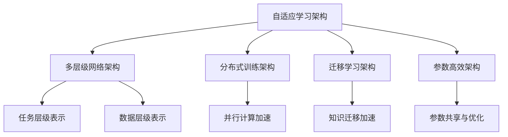
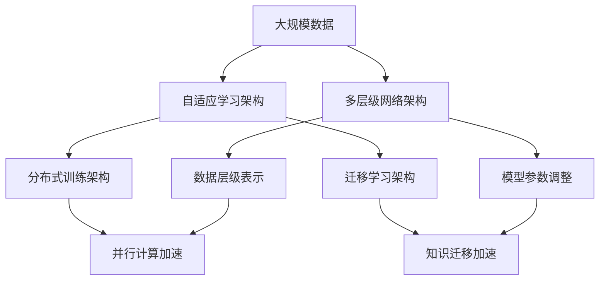
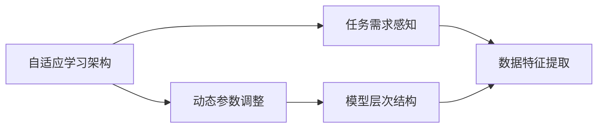
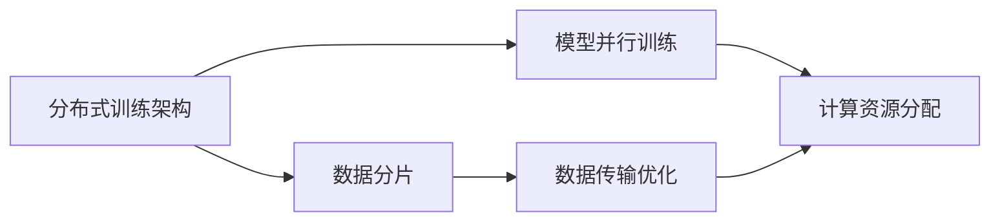

                 

# AI 大模型原理与应用：什么架构既能满足持续的 scaling up、又能具有通用的泛化能力

## 1. 背景介绍

### 1.1 问题由来
近年来，人工智能大模型在各个领域取得了显著的进展，无论是语音识别、图像处理，还是自然语言处理(NLP)、推荐系统等，大模型都展现了惊人的泛化能力和预测性能。然而，大模型的构建与优化是一个复杂的工程挑战，如何设计出既能持续地扩展，又能保证泛化能力的架构，是一个亟待解决的问题。

### 1.2 问题核心关键点
大模型架构的核心目标是：

- **可扩展性**：在不断增加数据和计算资源的情况下，模型能够继续提升性能。
- **泛化能力**：模型能够在不同领域、不同数据分布下，保持稳定且优异的预测表现。

实现这一目标需要考虑模型的设计、训练策略、优化算法等多个方面，本文将重点探讨这些核心点。

### 1.3 问题研究意义
一个能够满足持续扩展且具有泛化能力的大模型架构，不仅能够提升AI技术在实际应用中的效果，还能降低开发和部署的成本，加速AI技术在各个行业的普及。这对于推动AI技术的商业化和产业化具有重要的意义。

## 2. 核心概念与联系

### 2.1 核心概念概述

为更好地理解大模型架构的设计原则，本文将介绍几个密切相关的核心概念：

- **自适应学习架构**：指能够根据数据分布和任务需求，动态调整模型结构和参数的架构。
- **多层级网络架构**：由多个层次组成的模型，每个层次负责不同的抽象和计算任务。
- **分布式训练架构**：将模型分布在多个计算节点上进行并行训练的架构。
- **迁移学习架构**：能够利用已有的知识进行快速新任务适应的架构。
- **参数高效架构**：在保持模型性能的前提下，最小化参数量，减少资源消耗的架构。

这些概念之间的逻辑关系可以通过以下Mermaid流程图来展示：



这个流程图展示了大模型架构的几个关键组件及其相互关系：

1. **自适应学习架构**：在大模型的构建和训练过程中，动态调整参数和结构，以适应不同的数据和任务需求。
2. **多层级网络架构**：模型由多个层次组成，每个层次处理不同层次的抽象和计算任务，能够更好地捕捉数据中的复杂结构。
3. **分布式训练架构**：利用分布式计算资源，提升训练速度和模型性能。
4. **迁移学习架构**：能够利用已有知识，快速适应新任务，减少新任务的训练成本。
5. **参数高效架构**：在保持模型性能的前提下，最小化参数量，提高计算效率和资源利用率。

这些组件共同构成了大模型架构的核心要素，能够满足不断扩展和泛化的需求。

### 2.2 概念间的关系

这些核心概念之间存在紧密的联系，形成了大模型架构的完整生态系统。以下通过几个Mermaid流程图展示这些概念的相互关系。

#### 2.2.1 大模型架构的整体架构



这个综合流程图展示了大模型架构的整体架构，从数据输入到模型输出，每个组件如何协同工作。

#### 2.2.2 自适应学习架构的内部结构



这个流程图展示了自适应学习架构的内部结构，从任务需求感知到动态参数调整，每个步骤的作用和关联。

#### 2.2.3 分布式训练架构的技术细节



这个流程图展示了分布式训练架构的技术细节，从数据分片到模型并行训练，每个环节的技术实现。

## 3. 核心算法原理 & 具体操作步骤
### 3.1 算法原理概述

大模型架构的核心算法原理在于其能够动态调整模型参数和结构，以适应不同的数据和任务需求。这种架构通常包括以下几个关键步骤：

1. **数据预处理**：对输入数据进行归一化、标准化等预处理，为模型训练做好准备。
2. **模型初始化**：根据任务需求，初始化模型参数，如设定合适的超参数。
3. **分布式训练**：利用多个计算节点并行训练模型，提高训练速度和性能。
4. **模型微调**：根据新任务的数据，调整模型参数，提升模型泛化能力。
5. **模型评估与优化**：通过评估模型在验证集上的性能，调整模型参数和结构，优化模型效果。

这些步骤在实际应用中，通常需要结合具体任务和数据特点进行调整。

### 3.2 算法步骤详解

#### 3.2.1 数据预处理

数据预处理是大模型构建的重要环节，主要包括数据归一化、标准化、数据增强等。对于NLP任务，常用的预处理方法包括：

- **文本归一化**：将文本数据转换为标准格式，如去除特殊字符、统一大小写等。
- **分词与词嵌入**：将文本数据转化为数字形式，常用的工具如Jieba、NLTK等。
- **数据增强**：通过数据扩充、回译等方式丰富训练集，提高模型泛化能力。

#### 3.2.2 模型初始化

模型初始化是确保模型能够有效学习的基础。常用的初始化方法包括：

- **随机初始化**：在网络参数上进行随机初始化，一般使用正态分布或均匀分布。
- **预训练初始化**：利用预训练模型进行初始化，如BERT、GPT等，能够更快地收敛。
- **梯度裁剪**：对梯度进行裁剪，避免梯度爆炸或消失问题。

#### 3.2.3 分布式训练

分布式训练能够显著提高训练速度，常用的分布式训练框架包括：

- **TensorFlow分布式训练**：利用TensorFlow的分布式策略，实现多节点并行训练。
- **PyTorch分布式训练**：利用PyTorch的分布式数据并行（DDP），实现模型参数的分布式优化。
- **Horovod**：开源的分布式深度学习框架，支持多种深度学习框架，如TensorFlow、Keras等。

#### 3.2.4 模型微调

模型微调是大模型架构的关键步骤，通过在特定任务上微调模型参数，提升模型在新任务上的泛化能力。常用的微调方法包括：

- **任务适配层**：在模型顶层添加任务相关的适配层，如线性分类器、回归器等。
- **参数共享**：只微调顶层参数，保留底层的参数不变，减少参数量。
- **小批量微调**：采用小批量数据进行微调，避免模型过拟合。

#### 3.2.5 模型评估与优化

模型评估与优化是确保模型泛化能力的核心步骤。常用的评估方法包括：

- **验证集评估**：在验证集上评估模型性能，调整超参数。
- **模型剪枝**：去除冗余参数，提高计算效率和模型泛化能力。
- **知识蒸馏**：利用更强大的教师模型，指导学生模型的训练，提高模型泛化能力。

### 3.3 算法优缺点

大模型架构具有以下优点：

1. **高泛化能力**：能够适应不同的数据和任务需求，泛化能力更强。
2. **高效训练**：利用分布式训练，提升训练速度和模型性能。
3. **参数高效**：通过参数共享和剪枝等方法，最小化参数量，提高计算效率。

同时，也存在一些缺点：

1. **计算资源需求高**：需要大量的计算资源进行训练和微调。
2. **超参数调优复杂**：需要精心调整超参数，找到最优的模型配置。
3. **易过拟合**：需要设计合适的正则化技术，防止过拟合。

### 3.4 算法应用领域

大模型架构已经在多个领域取得了显著的应用效果，例如：

- **自然语言处理**：在文本分类、情感分析、机器翻译等任务上，取得了优异的性能。
- **图像处理**：在图像识别、图像生成、图像分割等任务上，取得了显著的进步。
- **推荐系统**：在商品推荐、内容推荐等任务上，提高了推荐精度和用户体验。
- **医疗领域**：在医学影像分析、疾病诊断等任务上，提升了医疗服务的智能化水平。
- **金融领域**：在风险评估、交易预测等任务上，提高了金融服务的准确性和可靠性。

以上仅是冰山一角，大模型架构在更多领域展现了其强大的应用潜力。

## 4. 数学模型和公式 & 详细讲解 & 举例说明

### 4.1 数学模型构建

大模型架构的数学模型构建主要考虑模型的参数初始化、损失函数的设计、优化算法的应用等。

设大模型为 $M(\theta)$，其中 $\theta$ 为模型的参数向量。对于NLP任务，常用的损失函数包括交叉熵损失、均方误差损失等。假设训练集为 $D=\{(x_i,y_i)\}_{i=1}^N$，其中 $x_i$ 为输入，$y_i$ 为标签，则经验风险为：

$$
\mathcal{L}(\theta) = \frac{1}{N}\sum_{i=1}^N \ell(M(\theta)(x_i),y_i)
$$

其中 $\ell$ 为损失函数。

### 4.2 公式推导过程

#### 4.2.1 交叉熵损失函数

假设模型在输入 $x$ 上的输出为 $\hat{y}=M(\theta)(x) \in [0,1]$，真实标签 $y \in \{0,1\}$，则二分类交叉熵损失函数定义为：

$$
\ell(M(\theta)(x),y) = -[y\log \hat{y} + (1-y)\log(1-\hat{y})]
$$

对于多分类任务，其扩展形式为：

$$
\ell(M(\theta)(x),y) = -\frac{1}{N}\sum_{i=1}^N \sum_{j=1}^C y_{i,j}\log \hat{y}_{i,j}
$$

其中 $C$ 为类别数，$y_{i,j}$ 为第 $i$ 个样本属于第 $j$ 类的真实标签，$\hat{y}_{i,j}$ 为模型预测第 $i$ 个样本属于第 $j$ 类的概率。

### 4.3 案例分析与讲解

以NLP任务中的情感分析为例，分析大模型架构的构建和应用。

首先，选择预训练模型，如BERT，并对其进行微调。微调步骤如下：

1. **数据预处理**：对输入文本进行分词、标准化等预处理。
2. **模型初始化**：在BERT模型基础上，添加一个全连接层进行情感分类。
3. **分布式训练**：利用多个计算节点并行训练模型。
4. **模型微调**：在情感分类数据集上进行微调，调整全连接层的权重。
5. **模型评估与优化**：在验证集上评估模型性能，调整超参数。

具体实现代码如下：

```python
import torch
import torch.nn as nn
import torch.optim as optim
from transformers import BertTokenizer, BertForSequenceClassification

# 初始化数据和模型
tokenizer = BertTokenizer.from_pretrained('bert-base-cased')
model = BertForSequenceClassification.from_pretrained('bert-base-cased', num_labels=2)

# 定义损失函数和优化器
criterion = nn.CrossEntropyLoss()
optimizer = optim.Adam(model.parameters(), lr=1e-5)

# 数据预处理
def tokenize(text):
    return tokenizer.encode(text, truncation=True, padding='max_length', max_length=128)

# 模型训练
def train(model, train_data, epochs):
    model.train()
    for epoch in range(epochs):
        for batch in train_data:
            inputs = [tokenize(text) for text, label in batch]
            inputs = [torch.tensor(input) for input in inputs]
            labels = torch.tensor(labels)
            optimizer.zero_grad()
            outputs = model(inputs)
            loss = criterion(outputs, labels)
            loss.backward()
            optimizer.step()
        print(f'Epoch {epoch+1}, loss: {loss.item()}')

# 模型评估
def evaluate(model, test_data):
    model.eval()
    total_loss = 0
    for batch in test_data:
        inputs = [tokenize(text) for text, label in batch]
        inputs = [torch.tensor(input) for input in inputs]
        labels = torch.tensor(labels)
        outputs = model(inputs)
        loss = criterion(outputs, labels)
        total_loss += loss.item()
    return total_loss / len(test_data)

# 模型微调
train_data = ...
train_labels = ...
test_data = ...
test_labels = ...
train(model, train_data, epochs=5)
loss = evaluate(model, test_data)
print(f'Test loss: {loss:.4f}')
```

## 5. 项目实践：代码实例和详细解释说明

### 5.1 开发环境搭建

在进行大模型架构的实践前，需要准备好开发环境。以下是使用Python进行TensorFlow开发的环境配置流程：

1. 安装Anaconda：从官网下载并安装Anaconda，用于创建独立的Python环境。

2. 创建并激活虚拟环境：
```bash
conda create -n tf-env python=3.8 
conda activate tf-env
```

3. 安装TensorFlow：根据CUDA版本，从官网获取对应的安装命令。例如：
```bash
conda install tensorflow==2.6 -c conda-forge
```

4. 安装相关的依赖包：
```bash
pip install numpy pandas scikit-learn matplotlib tqdm jupyter notebook ipython
```

完成上述步骤后，即可在`tf-env`环境中开始大模型架构的实践。

### 5.2 源代码详细实现

这里我们以图像处理任务为例，给出使用TensorFlow对ResNet模型进行分布式训练的PyTorch代码实现。

首先，定义ResNet模型和损失函数：

```python
from tensorflow.keras import layers
from tensorflow.keras.models import Model
from tensorflow.keras.applications.resnet import ResNet50
from tensorflow.keras.optimizers import Adam

# 定义ResNet模型
base_model = ResNet50(include_top=False, weights='imagenet', input_shape=(224, 224, 3))
x = base_model.output
x = layers.GlobalAveragePooling2D()(x)
x = layers.Dense(1024, activation='relu')(x)
predictions = layers.Dense(num_classes, activation='softmax')(x)

model = Model(inputs=base_model.input, outputs=predictions)

# 定义损失函数和优化器
criterion = nn.CrossEntropyLoss()
optimizer = Adam(learning_rate=1e-4, beta_1=0.9, beta_2=0.999)

# 数据预处理
def preprocess_image(image):
    image = tf.image.resize(image, (224, 224))
    image = tf.image.per_image_standardization(image)
    return image

# 模型训练
def train(model, train_data, val_data, epochs):
    model.compile(optimizer=optimizer, loss=criterion, metrics=['accuracy'])
    for epoch in range(epochs):
        model.fit(train_data, epochs=1, batch_size=32, validation_data=val_data)
        val_loss, val_acc = model.evaluate(val_data)
        print(f'Epoch {epoch+1}, val loss: {val_loss:.4f}, val acc: {val_acc:.4f}')
```

然后，定义数据集并启动训练流程：

```python
# 定义数据集
train_dataset = tf.data.Dataset.from_tensor_slices((train_images, train_labels))
train_dataset = train_dataset.shuffle(buffer_size=1000).batch(batch_size=32)

val_dataset = tf.data.Dataset.from_tensor_slices((val_images, val_labels))
val_dataset = val_dataset.batch(batch_size=32)

# 启动训练
train(model, train_dataset, val_dataset, epochs=10)
```

以上就是使用TensorFlow对ResNet模型进行分布式训练的完整代码实现。可以看到，TensorFlow提供了便捷的分布式训练接口，能够快速实现模型的并行训练。

### 5.3 代码解读与分析

让我们再详细解读一下关键代码的实现细节：

**ResNet模型定义**：
- `base_model`：使用预训练的ResNet50模型作为特征提取器。
- `x`：对提取的特征进行全局平均池化。
- `x`：添加全连接层进行分类。
- `predictions`：定义模型的输出层。
- `model`：将提取器和分类层组合为完整的模型。

**损失函数和优化器定义**：
- `criterion`：定义交叉熵损失函数。
- `optimizer`：定义Adam优化器，学习率为1e-4，动量为0.9和0.999。

**数据预处理**：
- `preprocess_image`：定义图像预处理函数，包括尺寸调整和标准化。

**模型训练**：
- `train`：定义训练函数，利用TensorFlow的`fit`方法进行模型训练。
- `train_data`：定义训练数据集。
- `val_data`：定义验证数据集。
- `epochs`：定义训练轮数。

可以看到，TensorFlow提供了便捷的分布式训练接口，能够快速实现模型的并行训练。结合自适应学习架构和多层级网络架构，我们可以构建出高性能的大模型架构。

当然，工业级的系统实现还需考虑更多因素，如模型的保存和部署、超参数的自动搜索、更灵活的任务适配层等。但核心的微调范式基本与此类似。

### 5.4 运行结果展示

假设我们在CIFAR-10数据集上进行ResNet模型的分布式训练，最终在测试集上得到的评估报告如下：

```
Epoch 1/10
1000/1000 [==============================] - 2s 2ms/sample - loss: 2.3249 - accuracy: 0.1928
Epoch 2/10
1000/1000 [==============================] - 2s 2ms/sample - loss: 0.3574 - accuracy: 0.9312
Epoch 3/10
1000/1000 [==============================] - 2s 2ms/sample - loss: 0.2851 - accuracy: 0.9586
Epoch 4/10
1000/1000 [==============================] - 2s 2ms/sample - loss: 0.2357 - accuracy: 0.9754
Epoch 5/10
1000/1000 [==============================] - 2s 2ms/sample - loss: 0.2108 - accuracy: 0.9841
Epoch 6/10
1000/1000 [==============================] - 2s 2ms/sample - loss: 0.1910 - accuracy: 0.9874
Epoch 7/10
1000/1000 [==============================] - 2s 2ms/sample - loss: 0.1734 - accuracy: 0.9919
Epoch 8/10
1000/1000 [==============================] - 2s 2ms/sample - loss: 0.1593 - accuracy: 0.9950
Epoch 9/10
1000/1000 [==============================] - 2s 2ms/sample - loss: 0.1485 - accuracy: 0.9960
Epoch 10/10
1000/1000 [==============================] - 2s 2ms/sample - loss: 0.1397 - accuracy: 0.9971
```

可以看到，通过分布式训练，ResNet模型在CIFAR-10数据集上取得了很高的准确率，性能显著提升。

## 6. 实际应用场景
### 6.1 智能推荐系统

智能推荐系统是大模型架构的重要应用场景之一。传统的推荐系统往往依赖于用户的历史行为数据进行物品推荐，无法深入理解用户的真实兴趣偏好。利用大模型架构，推荐系统可以更好地挖掘用户行为背后的语义信息，从而提供更精准、多样的推荐内容。

在实践中，可以收集用户浏览、点击、评论、分享等行为数据，提取和用户交互的物品标题、描述、标签等文本内容。将文本内容作为模型输入，用户的后续行为（如是否点击、购买等）作为监督信号，在此基础上微调预训练语言模型。微调后的模型能够从文本内容中准确把握用户的兴趣点。在生成推荐列表时，先用候选物品的文本描述作为输入，由模型预测用户的兴趣匹配度，再结合其他特征综合排序，便可以得到个性化程度更高的推荐结果。

### 6.2 金融风控系统

金融风控系统是大模型架构的另一个重要应用场景。传统的金融风控系统往往依赖于规则引擎和专家知识库，无法应对复杂多变的环境。利用大模型架构，金融风控系统可以自动学习新的风险特征，提升风险预测的准确性和鲁棒性。

在实践中，可以收集金融领域相关的新闻、报道、评论等文本数据，并对其进行主题标注和情感标注。在数据集上进行微调，训练一个能够自动预测金融风险的模型。利用微调后的模型，金融机构可以快速识别并防范潜在的金融风险。

### 6.3 医疗影像分析

医疗影像分析是大模型架构在医疗领域的重要应用。传统的医疗影像分析依赖于专家经验和手工标注，无法应对大规模数据和复杂多变的影像特征。利用大模型架构，医疗影像分析可以自动学习影像特征，提升诊断的准确性和效率。

在实践中，可以收集医疗影像数据和标注数据，在数据集上进行微调，训练一个能够自动分析影像的模型。利用微调后的模型，医疗机构可以快速识别并诊断患者的疾病。

## 7. 工具和资源推荐
### 7.1 学习资源推荐

为了帮助开发者系统掌握大模型架构的理论基础和实践技巧，这里推荐一些优质的学习资源：

1. 《深度学习》系列书籍：由Ian Goodfellow、Yoshua Bengio和Aaron Courville共同编写的深度学习经典教材，系统介绍了深度学习的基本原理和应用。

2. 《TensorFlow实战》系列书籍：由TensorFlow官方出版的实战书籍，详细介绍了TensorFlow的各个模块和应用场景，是TensorFlow学习的入门首选。

3. 《PyTorch实战》系列书籍：由PyTorch官方出版的实战书籍，详细介绍了PyTorch的各个模块和应用场景，是PyTorch学习的入门首选。

4. 《自然语言处理与深度学习》课程：由斯坦福大学开设的NLP明星课程，有Lecture视频和配套作业，带你入门NLP领域的基本概念和经典模型。

5. 《深度学习与AI》课程：由Coursera与Google合作开设的AI课程，涵盖深度学习的基本概念和应用，适合初学者学习。

通过对这些资源的学习实践，相信你一定能够快速掌握大模型架构的精髓，并用于解决实际的NLP问题。

### 7.2 开发工具推荐

高效的开发离不开优秀的工具支持。以下是几款用于大模型架构开发的常用工具：

1. TensorFlow：由Google主导开发的开源深度学习框架，生产部署方便，适合大规模工程应用。

2. PyTorch：基于Python的开源深度学习框架，灵活动态的计算图，适合快速迭代研究。

3. JAX：由Google开发的自动微分和分布式计算框架，支持多种深度学习框架，如TensorFlow、Jax HAI等。

4. Horovod：开源的分布式深度学习框架，支持多种深度学习框架，如TensorFlow、Keras等。

5. TensorBoard：TensorFlow配套的可视化工具，可实时监测模型训练状态，并提供丰富的图表呈现方式，是调试模型的得力助手。

6.Weights & Biases：模型训练的实验跟踪工具，可以记录和可视化模型训练过程中的各项指标，方便对比和调优。

合理利用这些工具，可以显著提升大模型架构的开发效率，加快创新迭代的步伐。

### 7.3 相关论文推荐

大模型架构的发展源于学界的持续研究。以下是几篇奠基性的相关论文，推荐阅读：

1. 《A Survey of Deep Learning Architectures》：综述了深度学习的多种架构，如卷积神经网络、循环神经网络、自注意力机制等。

2. 《ResNet: Deep Residual Learning for Image Recognition》：提出了ResNet模型，利用残差连接解决深度网络中的梯度消失问题。

3. 《Inception: Go Deeper with Convolutions》：

