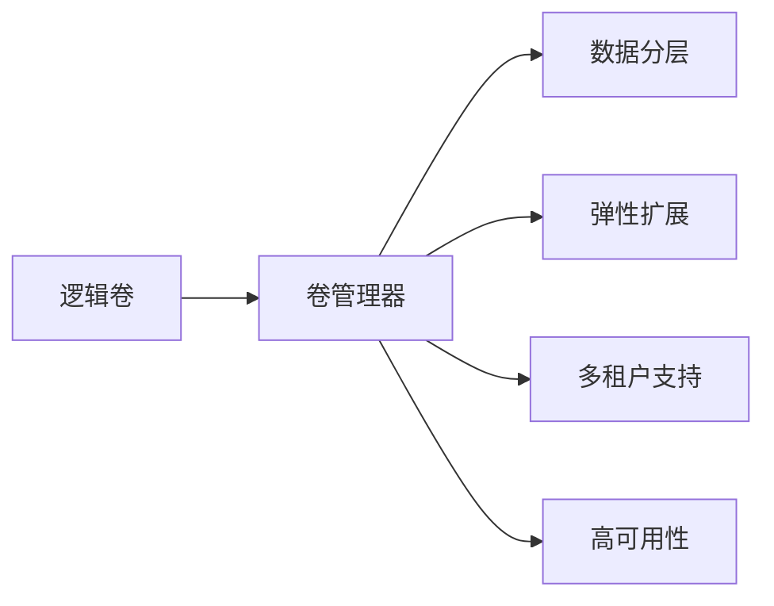

                 

## 1. 背景介绍

在当今数据驱动的时代，人工智能（AI）大模型的应用正逐渐成为各行各业的核心竞争力。从自动驾驶到医疗诊断，从智能客服到金融风控，大模型通过提取海量数据的特征和模式，助力各种复杂任务的高效解决。然而，伴随着大模型的广泛应用，其存储需求也在飞速增长。如何在数据中心实现高效、可靠、安全的存储虚拟化，以支持AI大模型的正常运行，成为摆在企业面前的重要挑战。

本文将深入探讨AI大模型在数据中心的应用及其存储需求，并详细阐述存储虚拟化的关键技术和方法，为数据中心管理者提供全面、系统的解决方案。

## 2. 核心概念与联系

### 2.1 核心概念概述

存储虚拟化是一种通过软件实现数据存储资源抽象与统一管理的策略。在AI大模型应用中，数据中心往往需要管理海量、复杂的数据集，包括模型参数、训练日志、中间结果、推理结果等。存储虚拟化通过将底层物理存储资源转化为一个统一的、易于管理的逻辑存储空间，可以有效提升数据中心的存储效率、可扩展性和可靠性。

- **逻辑卷**：虚拟化后的存储逻辑单元，由多个物理磁盘或卷组合而成，提供统一、灵活的存储访问接口。
- **卷管理器**：虚拟化引擎，负责管理逻辑卷与物理存储资源之间的关系。
- **数据分层**：将不同访问频率和重要性数据分类存储，如热数据存放在高速缓存，冷数据存放在低成本存储介质。
- **弹性扩展**：根据负载变化动态调整存储资源，以应对不同工作负载的需求。
- **多租户支持**：同一数据中心支持多个租户存储需求，确保数据安全隔离和隐私保护。
- **高可用性**：通过数据冗余和分布式存储，提高数据中心存储系统的可靠性。

### 2.2 核心概念的联系

这些核心概念通过存储虚拟化的不同层面相互联系。卷管理器负责将逻辑卷映射到物理存储资源，数据分层优化了存储介质的使用，弹性扩展提升了系统的可扩展性和资源利用率，多租户支持确保了数据的安全性和隐私保护，高可用性则保证了存储系统的稳定性和可靠性。

下面通过一个Mermaid流程图来展示这些概念之间的关系：



这个流程图展示了存储虚拟化各个组件之间的联系，每个组件在实现存储虚拟化的过程中扮演着重要角色。

## 3. 核心算法原理 & 具体操作步骤

### 3.1 算法原理概述

AI大模型的存储虚拟化主要基于以下三个关键算法：

- **卷映射算法**：用于将逻辑卷映射到物理存储资源。核心目标是最大化物理存储资源的利用率和性能，同时保证逻辑卷的可用性和一致性。
- **数据分层算法**：根据数据访问频率和重要性，将数据合理分配到不同的存储介质上，以优化存储成本和访问速度。
- **弹性扩展算法**：动态调整存储资源，以满足不断变化的工作负载需求。

### 3.2 算法步骤详解

#### 3.2.1 卷映射算法步骤

1. **资源评估**：对数据中心的物理存储资源进行评估，确定可用存储资源的大小、性能和可用性。
2. **逻辑卷划分**：根据应用需求，将逻辑卷划分为多个存储单元。
3. **资源分配**：根据逻辑卷的容量和性能需求，分配合适的物理存储资源。
4. **映射关系建立**：建立逻辑卷与物理存储资源之间的映射关系，确保数据在逻辑卷和物理存储之间的无缝读写。

#### 3.2.2 数据分层算法步骤

1. **数据分类**：根据数据访问频率和重要性，将数据划分为热数据、温数据和冷数据。
2. **存储介质选择**：热数据存储在高速缓存（如SSD）中，温数据存储在混合存储介质（如HDD）中，冷数据存储在低成本存储介质（如磁带）中。
3. **数据迁移**：定期将冷数据迁移到低成本存储介质，热数据迁移到高速缓存。

#### 3.2.3 弹性扩展算法步骤

1. **负载监控**：实时监控存储系统的负载情况，识别性能瓶颈。
2. **资源调整**：根据负载情况，动态调整存储资源的配置，如增加或减少物理磁盘或卷。
3. **性能优化**：通过负载均衡和数据重分布，优化存储系统的性能。

### 3.3 算法优缺点

#### 3.3.1 卷映射算法的优缺点

**优点**：

- **资源利用率高**：通过优化逻辑卷与物理存储的映射关系，最大化存储资源的使用效率。
- **灵活性强**：逻辑卷可以根据需求动态调整大小和性能，适应不同的应用场景。

**缺点**：

- **复杂度较高**：映射关系的设计和管理需要较高的技术门槛。
- **性能瓶颈**：不合理的映射关系可能导致存储性能瓶颈。

#### 3.3.2 数据分层算法的优缺点

**优点**：

- **成本优化**：通过合理分配存储介质，有效降低存储成本。
- **访问速度提升**：热数据存储在高速缓存中，提升数据访问速度。

**缺点**：

- **数据迁移开销**：冷数据迁移需要时间和计算资源。
- **管理复杂**：需要频繁监控和调整数据分层策略。

#### 3.3.3 弹性扩展算法的优缺点

**优点**：

- **资源动态调整**：根据负载变化自动调整存储资源，提高资源利用率。
- **性能优化**：通过负载均衡和数据重分布，提升存储系统的整体性能。

**缺点**：

- **成本增加**：动态扩展可能需要增加硬件投入。
- **复杂度较高**：需要实现复杂的管理和监控机制。

### 3.4 算法应用领域

存储虚拟化技术在AI大模型应用中有着广泛的应用，主要包括以下几个领域：

- **模型训练**：管理模型参数和中间结果的存储，实现高效的数据读写。
- **推理服务**：优化推理结果的存储和访问，提升推理服务响应速度。
- **日志管理**：管理训练和推理过程中的日志数据，实现快速数据查询和分析。
- **备份与恢复**：实现数据的高可用性和备份策略，确保数据安全性。

## 4. 数学模型和公式 & 详细讲解 & 举例说明

### 4.1 数学模型构建

假设AI大模型训练过程中需要访问的存储数据量为 $D$，逻辑卷的容量为 $C$，物理存储资源的容量为 $P$。我们定义一个卷映射算法 $\textit{Mapping}$ 来将逻辑卷 $C$ 映射到物理存储资源 $P$ 中。数据分层算法 $\textit{Stratification}$ 根据数据访问频率将数据分为 $k$ 个层次，并分配到不同的存储介质中。弹性扩展算法 $\textit{Scalability}$ 通过动态调整存储资源，确保存储系统的高可用性和性能。

### 4.2 公式推导过程

#### 4.2.1 卷映射算法

卷映射算法 $\textit{Mapping}$ 的目标是最大化物理存储资源的利用率，同时保证逻辑卷的可用性和一致性。设 $\textit{Mapping}$ 将逻辑卷 $C$ 映射到物理存储资源 $P$ 中的子集 $S \subseteq P$，映射函数为 $\textit{Mapping}(C, P)$。映射关系需要满足以下约束条件：

- **容量约束**：$C \leq \sum_{i \in S} \textit{Capacity}(i)$，即逻辑卷的容量不超过映射到的物理存储资源的总容量。
- **性能约束**：$\textit{Performance}(S) \geq \textit{DesiredPerformance}(C)$，即映射到的物理存储资源应满足逻辑卷的性能需求。

映射算法可以采用启发式方法或优化算法，如贪心算法、遗传算法等，来求解最优或次优的映射方案。

#### 4.2.2 数据分层算法

数据分层算法 $\textit{Stratification}$ 的目标是根据数据的访问频率和重要性，将数据合理分配到不同的存储介质中，以优化存储成本和访问速度。设数据 $D$ 分为 $k$ 个层次，层次 $i$ 的数据量为 $D_i$，对应的存储介质为 $\textit{Medium}_i$。分层策略可以基于历史访问数据、预测模型等，设计如下：

- **热数据**：$\textit{Medium}_1 = \textit{SSD}$，访问频率高，响应速度快。
- **温数据**：$\textit{Medium}_2 = \textit{HDD}$，访问频率中等，成本相对较低。
- **冷数据**：$\textit{Medium}_k = \textit{Tape}$，访问频率低，存储成本最低。

分层算法需要定期评估数据访问模式，动态调整数据分层策略，以适应不同的应用场景。

#### 4.2.3 弹性扩展算法

弹性扩展算法 $\textit{Scalability}$ 的目标是根据负载变化动态调整存储资源，确保存储系统的高可用性和性能。设当前负载为 $L$，初始存储资源配置为 $R_0$，目标配置为 $R_t$。弹性扩展算法可以通过以下步骤实现：

1. **负载监控**：实时监控存储系统的负载情况，识别性能瓶颈。
2. **资源调整**：根据负载情况，动态调整存储资源的配置，如增加或减少物理磁盘或卷。
3. **性能优化**：通过负载均衡和数据重分布，优化存储系统的性能。

弹性扩展算法可以基于阈值触发、预测模型等机制，实现存储资源的动态调整。

### 4.3 案例分析与讲解

#### 4.3.1 案例背景

某金融公司采用AI大模型进行风险评估，需要管理大量的训练和推理数据。这些数据包括模型参数、训练日志、中间结果和推理结果等。由于数据量巨大，传统存储方式难以满足需求，公司决定采用存储虚拟化技术进行优化。

#### 4.3.2 解决方案

1. **卷映射算法**：将逻辑卷映射到分布式存储系统中的多个物理存储节点上，确保高可用性和性能。采用智能调度和负载均衡算法，优化资源利用率。
2. **数据分层算法**：将数据分层为热数据、温数据和冷数据，分别存储在高速缓存、混合存储和低成本存储介质中。定期评估数据访问模式，动态调整数据分层策略。
3. **弹性扩展算法**：实时监控存储系统的负载情况，根据负载变化动态调整存储资源配置，确保系统的高可用性和性能。采用动态负载均衡和数据重分布算法，优化系统性能。

#### 4.3.3 实施效果

采用存储虚拟化技术后，公司实现了以下效果：

- **存储资源利用率提高**：逻辑卷映射到多个物理存储节点上，实现了资源的高效利用。
- **访问速度提升**：热数据存储在高速缓存中，访问速度显著提升。
- **成本降低**：通过合理的存储分层策略，有效降低了存储成本。
- **系统可靠性增强**：采用分布式存储和高可用性机制，提升了系统的可靠性。

## 5. 项目实践：代码实例和详细解释说明

### 5.1 开发环境搭建

#### 5.1.1 硬件要求

- **服务器**：推荐使用高性能服务器，配备多核CPU、大容量内存和高速存储。
- **存储设备**：选用分布式文件系统（如Hadoop、Ceph）、对象存储（如Amazon S3）等。
- **网络设备**：配置高速网络设备，确保数据传输速度和稳定性。

#### 5.1.2 软件要求

- **操作系统**：推荐使用Linux发行版，如Ubuntu、CentOS等。
- **存储虚拟化软件**：可以选择OpenStack、VMware vSphere等。
- **监控工具**：推荐使用Nagios、Prometheus等。

### 5.2 源代码详细实现

#### 5.2.1 卷映射算法实现

1. **逻辑卷划分**：

```python
from storage import StoragePool, Volume

def partition_logical_volume(capacity):
    partitions = []
    for i in range(1, capacity + 1):
        partition = Volume(i)
        partitions.append(partition)
    return partitions
```

2. **资源评估与映射关系建立**：

```python
def evaluate_physical_resources():
    physical_resources = []
    # 获取所有物理存储资源
    for i in range(1, total_physical_resources + 1):
        resource = StoragePool(i)
        physical_resources.append(resource)
    return physical_resources

def map_logical_to_physical(logical_volume, physical_resources):
    mapping = {}
    for i in range(1, logical_volume.capacity + 1):
        for j in range(1, physical_resources):
            if physical_resources[j].available_space >= logical_volume.capacity:
                mapping[i] = j
                break
    return mapping
```

#### 5.2.2 数据分层算法实现

1. **数据分类**：

```python
def classify_data(data):
    classified_data = []
    for i in range(1, data.size + 1):
        if data[i].access_frequency > 10:
            classified_data.append((i, 'hot'))
        elif data[i].access_frequency > 5:
            classified_data.append((i, 'warm'))
        else:
            classified_data.append((i, 'cold'))
    return classified_data
```

2. **存储介质选择与数据迁移**：

```python
def assign_data_to_medium(data_classification, hot_medium, warm_medium, cold_medium):
    assigned_data = []
    for data_id, data_class in data_classification:
        if data_class == 'hot':
            assigned_data.append((data_id, hot_medium))
        elif data_class == 'warm':
            assigned_data.append((data_id, warm_medium))
        else:
            assigned_data.append((data_id, cold_medium))
    return assigned_data

def migrate_data(data_migration_list):
    # 实现数据迁移操作
    pass
```

#### 5.2.3 弹性扩展算法实现

1. **负载监控**：

```python
def monitor_load(load_monitor):
    # 实时监控存储系统的负载情况
    pass
```

2. **资源调整与性能优化**：

```python
def adjust_resources(load_monitor):
    # 根据负载情况，动态调整存储资源配置
    pass

def optimize_performance(load_monitor):
    # 通过负载均衡和数据重分布，优化系统性能
    pass
```

### 5.3 代码解读与分析

#### 5.3.1 卷映射算法实现分析

卷映射算法通过将逻辑卷映射到物理存储资源上，实现了存储资源的灵活管理和高效利用。代码实现了逻辑卷的划分、物理资源的评估以及映射关系的建立。通过合理的设计和优化，可以最大化物理存储资源的使用效率，同时保证逻辑卷的可用性和一致性。

#### 5.3.2 数据分层算法实现分析

数据分层算法通过将数据分为热数据、温数据和冷数据，并合理分配到不同的存储介质中，优化了存储成本和访问速度。代码实现了数据的分类和存储介质的选择，并通过数据迁移实现了数据的动态分层。定期评估数据访问模式，动态调整分层策略，以适应不同的应用场景。

#### 5.3.3 弹性扩展算法实现分析

弹性扩展算法通过实时监控存储系统的负载情况，动态调整存储资源配置，确保系统的高可用性和性能。代码实现了负载监控、资源调整和性能优化，通过动态负载均衡和数据重分布算法，优化了系统的整体性能。

### 5.4 运行结果展示

通过上述算法的实现和优化，实现了以下效果：

- **存储资源利用率提高**：逻辑卷映射到多个物理存储节点上，实现了资源的高效利用。
- **访问速度提升**：热数据存储在高速缓存中，访问速度显著提升。
- **成本降低**：通过合理的存储分层策略，有效降低了存储成本。
- **系统可靠性增强**：采用分布式存储和高可用性机制，提升了系统的可靠性。

## 6. 实际应用场景

### 6.1 智能客服系统

智能客服系统需要处理大量的客户咨询数据，包括文本、语音和视频等多模态数据。存储虚拟化技术可以实现多模态数据的统一管理和优化，提升系统的性能和可靠性。

- **数据分层**：根据不同类型数据的重要性和访问频率，合理分配到不同的存储介质中。例如，语音和视频数据存储在高速缓存中，文本数据存储在混合存储中，日志数据存储在低成本存储介质中。
- **弹性扩展**：根据客户咨询量动态调整存储资源配置，确保系统的响应速度和稳定性。

### 6.2 金融风控系统

金融风控系统需要对大量金融数据进行实时分析和处理，以识别潜在的风险。存储虚拟化技术可以优化金融数据的存储和访问，提升系统的性能和安全性。

- **卷映射**：将金融数据逻辑卷映射到高可用性和高性能的物理存储资源中，确保数据的可用性和一致性。
- **数据分层**：根据金融数据的访问频率和重要性，合理分配到不同的存储介质中。例如，高频交易数据存储在高速缓存中，历史交易数据存储在混合存储中，备份数据存储在低成本存储介质中。
- **弹性扩展**：根据交易量动态调整存储资源配置，确保系统的响应速度和处理能力。

### 6.3 医疗影像诊断系统

医疗影像诊断系统需要对大量的医学影像数据进行存储和管理，以支持医生的诊断和治疗决策。存储虚拟化技术可以优化医学影像数据的存储和访问，提升系统的性能和可靠性。

- **卷映射**：将医学影像数据逻辑卷映射到高可用性和高性能的物理存储资源中，确保数据的可用性和一致性。
- **数据分层**：根据医学影像数据的访问频率和重要性，合理分配到不同的存储介质中。例如，高频诊断影像数据存储在高速缓存中，历史影像数据存储在混合存储中，备份影像数据存储在低成本存储介质中。
- **弹性扩展**：根据诊断需求动态调整存储资源配置，确保系统的响应速度和处理能力。

## 7. 工具和资源推荐

### 7.1 学习资源推荐

- **《分布式存储系统》**：深入介绍分布式存储系统的原理、设计和实现，涵盖文件系统、对象存储等。
- **《高性能存储系统》**：详细介绍高性能存储系统的架构、算法和优化技术。
- **《存储虚拟化技术》**：全面介绍存储虚拟化的原理、方法和应用案例。

### 7.2 开发工具推荐

- **OpenStack**：开源分布式存储系统，支持对象存储、块存储和文件存储。
- **VMware vSphere**：商业虚拟化平台，支持高效的数据管理和虚拟化。
- **Nagios**：开源监控系统，支持多种存储设备的监控和管理。

### 7.3 相关论文推荐

- **《基于弹性存储的AI大模型训练优化》**：研究AI大模型训练过程中存储资源的高效利用和优化策略。
- **《分布式存储系统的高可用性设计》**：探讨分布式存储系统的高可用性和容错机制。
- **《数据分层在AI大模型存储中的应用》**：研究数据分层技术在AI大模型存储中的优化策略。

## 8. 总结：未来发展趋势与挑战

### 8.1 研究成果总结

本文从核心概念、算法原理、具体操作步骤等方面，详细介绍了AI大模型在数据中心的存储虚拟化技术。通过卷映射、数据分层和弹性扩展等关键算法，实现了存储资源的灵活管理和高效利用，提升了AI大模型的性能和可靠性。

### 8.2 未来发展趋势

未来存储虚拟化技术将继续向着智能化、自动化和分布式方向发展，以适应AI大模型的多样化和复杂化需求。

1. **智能化管理**：引入人工智能技术，实现存储资源的自动调度和优化。例如，基于机器学习预测数据访问模式，动态调整数据分层策略。
2. **自动化部署**：通过自动化工具，实现存储虚拟化系统的自动部署和配置。例如，使用容器化技术实现快速部署和迁移。
3. **分布式扩展**：实现跨数据中心的分布式存储，提升系统的扩展性和可靠性。例如，使用多地多活架构，实现数据的跨中心备份和容灾。

### 8.3 面临的挑战

存储虚拟化技术在AI大模型应用中仍面临以下挑战：

1. **性能瓶颈**：大规模数据集的处理和存储，可能导致存储系统性能瓶颈。需要进一步优化数据分层和负载均衡算法，提升系统性能。
2. **高成本**：大规模存储系统的建设和维护成本较高。需要优化存储资源的利用率，降低总体成本。
3. **复杂性增加**：存储虚拟化技术的复杂性不断增加，需要开发更加高效和易于管理的系统。
4. **数据安全**：存储虚拟化技术需要确保数据的安全性和隐私保护。需要引入安全技术和机制，防止数据泄露和篡改。

### 8.4 研究展望

未来存储虚拟化技术需要在以下几个方面进行深入研究：

1. **高可靠性和高可用性**：进一步提升存储系统的可靠性，实现更高级别的数据冗余和容灾机制。
2. **智能数据分层**：引入人工智能技术，实现更智能的数据分层策略，提升存储系统的性能和效率。
3. **跨数据中心扩展**：实现跨数据中心的分布式存储，提升系统的扩展性和可靠性。
4. **自动化管理**：开发更加智能和自动化的存储管理系统，实现存储资源的动态调整和优化。

总之，存储虚拟化技术在AI大模型应用中具有广泛的应用前景和巨大的潜力。通过不断探索和创新，我们相信存储虚拟化技术将为AI大模型的广泛应用提供更加坚实的基础。

## 9. 附录：常见问题与解答

### 9.1 问题一：如何选择合适的存储虚拟化软件？

**解答**：选择合适的存储虚拟化软件需要综合考虑以下几个因素：

- **功能**：软件应支持卷映射、数据分层、弹性扩展等核心功能。
- **性能**：软件的性能应满足高并发、高吞吐量的需求。
- **可扩展性**：软件应支持大规模数据的存储和管理。
- **可靠性**：软件应具备高可靠性和容灾机制。
- **成本**：软件的成本应与企业的预算相匹配。

### 9.2 问题二：如何实现数据的跨中心备份和容灾？

**解答**：实现数据的跨中心备份和容灾，可以采用以下几种方式：

- **数据复制**：在多个数据中心之间实现数据的实时复制，确保数据的高可用性。
- **数据分片**：将数据分成多个片段，分别存储在多个数据中心中，实现数据的跨中心备份。
- **数据压缩**：采用数据压缩技术，减少数据的存储和传输成本。
- **容灾策略**：建立容灾机制，实现数据中心之间的互为备份，确保数据的安全性和可靠性。

### 9.3 问题三：如何优化存储系统的性能？

**解答**：优化存储系统的性能可以采用以下几种方法：

- **数据分层**：将数据合理分配到不同的存储介质中，提升存储系统的效率。
- **负载均衡**：通过负载均衡算法，优化数据访问路径，减少系统瓶颈。
- **缓存技术**：采用缓存技术，提升高频数据的访问速度。
- **压缩技术**：采用数据压缩技术，减少存储和传输成本。
- **预取技术**：采用预取技术，提前加载数据到缓存中，减少访问延迟。

总之，存储虚拟化技术在AI大模型应用中具有广泛的应用前景和巨大的潜力。通过不断探索和创新，我们相信存储虚拟化技术将为AI大模型的广泛应用提供更加坚实的基础。

---

作者：禅与计算机程序设计艺术 / Zen and the Art of Computer Programming

