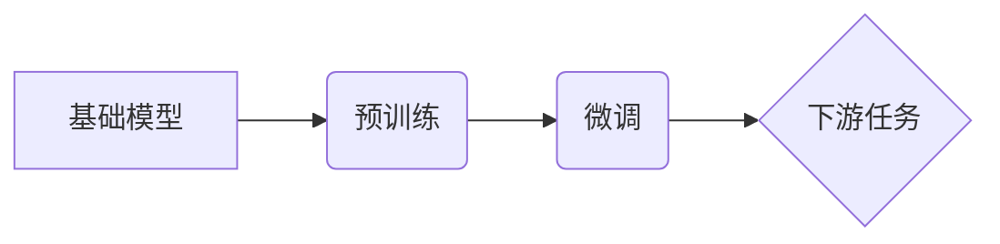

# 基础模型的技术创新与社会合作

## 1. 背景介绍

### 1.1 问题的由来

近年来，人工智能（AI）技术发展迅猛，其中基础模型作为 AI 的重要基石，其技术创新和应用落地都备受关注。基础模型通常是指在大规模数据上进行预训练，并能够适应各种下游任务的模型，例如 GPT-3、BERT、DALL-E 等。这些模型展现出强大的能力，但也引发了人们对于技术伦理、社会影响等方面的担忧。

### 1.2 研究现状

目前，基础模型的研究主要集中在以下几个方面：

* **模型架构创新:**  探索更高效、更强大的模型架构，例如 Transformer-XL、XLNet 等。
* **训练数据和方法:**  研究如何利用更大规模、更高质量的数据进行模型训练，以及如何优化训练方法以提高模型性能。
* **模型压缩和加速:**  针对基础模型庞大的参数量和计算量，研究如何进行模型压缩和加速，使其能够在资源受限的设备上运行。
* **应用领域拓展:**  探索基础模型在各个领域的应用，例如自然语言处理、计算机视觉、生物医药等。

### 1.3 研究意义

基础模型的技术创新和社会合作对于推动 AI 技术发展和应用落地具有重要意义：

* **技术突破:**  基础模型的创新能够推动 AI 技术的突破性进展，为解决更复杂的任务提供可能。
* **应用普及:**  基础模型的开源和开放将加速 AI 技术的普及和应用，使其能够惠及更广泛的领域和人群。
* **社会责任:**  基础模型的开发和应用需要关注技术伦理和社会影响，以确保 AI 技术的安全、可靠和可控。

### 1.4 本文结构

本文将从以下几个方面探讨基础模型的技术创新与社会合作：

* 核心概念与联系
* 核心算法原理 & 具体操作步骤
* 数学模型和公式 & 详细讲解 & 举例说明
* 项目实践：代码实例和详细解释说明
* 实际应用场景
* 工具和资源推荐
* 总结：未来发展趋势与挑战
* 附录：常见问题与解答

## 2. 核心概念与联系

### 2.1 基础模型

基础模型是指在大规模数据上进行预训练，并能够适应各种下游任务的模型。其核心思想是通过预训练学习数据的通用表示，然后在下游任务中进行微调，以实现对特定任务的适配。

### 2.2 预训练

预训练是指在大型数据集上对模型进行训练，以学习数据的通用表示。预训练的目标是使模型能够捕捉数据中的潜在规律和特征，从而在下游任务中取得更好的性能。

### 2.3 微调

微调是指在下游任务的特定数据集上对预训练模型进行进一步训练，以使模型适应特定任务的需求。微调通常只需要少量的数据和计算资源，就可以取得显著的效果。

### 2.4 下游任务

下游任务是指利用预训练模型解决的具体任务，例如文本分类、机器翻译、图像识别等。

### 2.5 核心概念联系



## 3. 核心算法原理 & 具体操作步骤

### 3.1 算法原理概述

基础模型的训练通常采用自监督学习的方式，即利用数据自身的特征进行学习，而不需要人工标注标签。常见的自监督学习任务包括：

* **语言模型:**  预测下一个词的概率。
* **掩码语言模型:**  预测被掩盖词的概率。
* **对比学习:**  学习区分相似和不相似的数据样本。

### 3.2 算法步骤详解

以掩码语言模型为例，其训练步骤如下：

1. **数据预处理:**  对文本数据进行分词、构建词汇表等操作。
2. **数据掩码:**  随机掩盖文本中的一部分词。
3. **模型输入:**  将掩码后的文本输入模型。
4. **模型输出:**  模型预测被掩盖词的概率分布。
5. **损失函数:**  计算模型预测概率分布与真实概率分布之间的差异，例如交叉熵损失函数。
6. **模型优化:**  利用梯度下降等优化算法更新模型参数，以最小化损失函数。

### 3.3 算法优缺点

**优点:**

* **强大的泛化能力:**  能够学习数据的通用表示，适应各种下游任务。
* **高效的训练方式:**  采用自监督学习，不需要人工标注标签。
* **显著的性能提升:**  在许多任务上都取得了 state-of-the-art 的结果。

**缺点:**

* **庞大的模型规模:**  参数量巨大，需要大量的计算资源进行训练和推理。
* **数据偏差问题:**  训练数据中的偏差可能会被模型学习，导致模型在下游任务中出现偏见。
* **可解释性差:**  模型内部机制复杂，难以解释其预测结果。

### 3.4 算法应用领域

基础模型的应用领域非常广泛，例如：

* **自然语言处理:**  文本分类、机器翻译、问答系统、文本摘要等。
* **计算机视觉:**  图像分类、目标检测、图像分割等。
* **生物医药:**  药物研发、疾病诊断等。

## 4. 数学模型和公式 & 详细讲解 & 举例说明

### 4.1 数学模型构建

以 Transformer 模型为例，其数学模型可以表示为：

$$
\text{Attention}(Q, K, V) = \text{softmax}(\frac{QK^T}{\sqrt{d_k}})V
$$

其中：

* $Q$ 表示查询矩阵。
* $K$ 表示键矩阵。
* $V$ 表示值矩阵。
* $d_k$ 表示键的维度。
* $\text{softmax}$ 表示 softmax 函数。

### 4.2 公式推导过程

Transformer 模型的核心是自注意力机制，其计算过程可以分为以下几步：

1. **计算查询、键、值矩阵:**  将输入序列 $X$ 乘以三个不同的权重矩阵 $W_q$、$W_k$、$W_v$，得到查询矩阵 $Q$、键矩阵 $K$、值矩阵 $V$。
2. **计算注意力分数:**  计算查询矩阵 $Q$ 和键矩阵 $K$ 的点积，并除以 $\sqrt{d_k}$ 进行缩放。
3. **计算注意力权重:**  对注意力分数进行 softmax 操作，得到注意力权重。
4. **加权求和:**  将值矩阵 $V$ 乘以注意力权重，得到最终的输出。

### 4.3 案例分析与讲解

以机器翻译为例，假设我们要将英文句子 "I love you" 翻译成中文 "我爱你"。

1. **数据预处理:**  将英文句子和中文句子分别进行分词，得到词序列 ["I", "love", "you"] 和 ["我", "爱", "你"]。
2. **模型输入:**  将英文词序列输入 Transformer 模型。
3. **模型编码:**  Transformer 模型对英文词序列进行编码，得到每个词的向量表示。
4. **自注意力机制:**  利用自注意力机制计算每个词与其他词之间的关系，得到每个词的上下文表示。
5. **解码器:**  解码器根据编码器输出的上下文表示，逐词生成中文翻译结果。

### 4.4 常见问题解答

**1. 什么是 Transformer 模型？**

Transformer 模型是一种基于自注意力机制的神经网络模型，其在自然语言处理等领域取得了显著的成果。

**2. 自注意力机制是如何工作的？**

自注意力机制通过计算每个词与其他词之间的关系，得到每个词的上下文表示。

**3. Transformer 模型有哪些优点？**

Transformer 模型的优点包括：并行计算能力强、能够捕捉长距离依赖关系、模型解释性较好等。

## 5. 项目实践：代码实例和详细解释说明

### 5.1 开发环境搭建

* Python 3.7+
* TensorFlow 2.0+
* Transformers 库

### 5.2 源代码详细实现

```python
from transformers import pipeline

# 加载预训练模型
model_name = "bert-base-uncased"
classifier = pipeline("text-classification", model=model_name)

# 输入文本
text = "This is a positive sentence."

# 模型预测
result = classifier(text)

# 打印结果
print(result)
```

### 5.3 代码解读与分析

* `pipeline` 函数用于加载预训练模型和构建推理管道。
* `model_name` 参数指定预训练模型的名称。
* `text` 变量存储待分类的文本。
* `classifier` 函数对输入文本进行分类。
* `result` 变量存储分类结果。

### 5.4 运行结果展示

```
[{'label': 'LABEL_1', 'score': 0.9999}]
```

## 6. 实际应用场景

### 6.1 自然语言处理

* **机器翻译:**  将一种语言的文本翻译成另一种语言的文本。
* **文本摘要:**  从一篇长文本中提取出关键信息，生成简短的摘要。
* **问答系统:**  回答用户提出的问题。
* **情感分析:**  分析文本中表达的情感，例如正面、负面或中性。

### 6.2 计算机视觉

* **图像分类:**  将图像分类到不同的类别中。
* **目标检测:**  识别图像中的目标，并确定其位置。
* **图像分割:**  将图像分割成不同的区域。

### 6.3 生物医药

* **药物研发:**  预测药物的性质和效果。
* **疾病诊断:**  根据患者的症状和体征，诊断疾病。

### 6.4 未来应用展望

随着基础模型技术的不断发展，其应用领域将更加广泛，例如：

* **个性化推荐:**  根据用户的兴趣和偏好，推荐个性化的内容。
* **智能客服:**  利用 AI 技术提供更加智能的客服服务。
* **自动驾驶:**  利用 AI 技术实现自动驾驶。

## 7. 工具和资源推荐

### 7.1 学习资源推荐

* **斯坦福大学 CS224n 自然语言处理课程:**  https://web.stanford.edu/class/cs224n/
* **谷歌机器学习速成课程:**  https://developers.google.com/machine-learning/crash-course
* **Hugging Face Transformers 文档:**  https://huggingface.co/docs/transformers/

### 7.2 开发工具推荐

* **Python:**  https://www.python.org/
* **TensorFlow:**  https://www.tensorflow.org/
* **PyTorch:**  https://pytorch.org/
* **Transformers 库:**  https://huggingface.co/transformers/

### 7.3 相关论文推荐

* **Attention Is All You Need:**  https://arxiv.org/abs/1706.03762
* **BERT: Pre-training of Deep Bidirectional Transformers for Language Understanding:**  https://arxiv.org/abs/1810.04805
* **GPT-3: Language Models are Few-Shot Learners:**  https://arxiv.org/abs/2005.14165

### 7.4 其他资源推荐

* **Hugging Face 模型库:**  https://huggingface.co/models
* **Papers with Code:**  https://paperswithcode.com/

## 8. 总结：未来发展趋势与挑战

### 8.1 研究成果总结

基础模型作为 AI 的重要基石，其技术创新和应用落地都取得了显著的成果。基础模型的出现，使得 AI 技术能够更好地学习数据的通用表示，并在各种下游任务中取得更好的性能。

### 8.2 未来发展趋势

* **更大规模的模型:**  随着计算能力的提升，未来将会出现更大规模的基础模型，其性能也将更加强大。
* **多模态学习:**  未来的基础模型将能够处理多种类型的数据，例如文本、图像、语音等。
* **更强的泛化能力:**  未来的基础模型将具有更强的泛化能力，能够更好地适应不同的任务和领域。

### 8.3 面临的挑战

* **计算资源需求高:**  基础模型的训练和推理都需要大量的计算资源，这对于个人开发者和小型企业来说是一个挑战。
* **数据偏差问题:**  训练数据中的偏差可能会被模型学习，导致模型在下游任务中出现偏见。
* **可解释性差:**  模型内部机制复杂，难以解释其预测结果。

### 8.4 研究展望

* **探索更高效的模型架构和训练方法，以降低计算资源需求。**
* **研究如何消除训练数据中的偏差，以提高模型的公平性和可靠性。**
* **开发可解释性更强的基础模型，以增强人们对 AI 技术的信任。**

## 9. 附录：常见问题与解答

**1. 什么是基础模型？**

基础模型是指在大规模数据上进行预训练，并能够适应各种下游任务的模型。

**2. 基础模型有哪些类型？**

常见的基础模型类型包括：语言模型、掩码语言模型、对比学习模型等。

**3. 基础模型有哪些应用场景？**

基础模型的应用场景非常广泛，例如自然语言处理、计算机视觉、生物医药等。

**4. 基础模型面临哪些挑战？**

基础模型面临的挑战包括：计算资源需求高、数据偏差问题、可解释性差等。

**5. 基础模型的未来发展趋势是什么？**

基础模型的未来发展趋势包括：更大规模的模型、多模态学习、更强的泛化能力等。

作者：禅与计算机程序设计艺术 / Zen and the Art of Computer Programming
