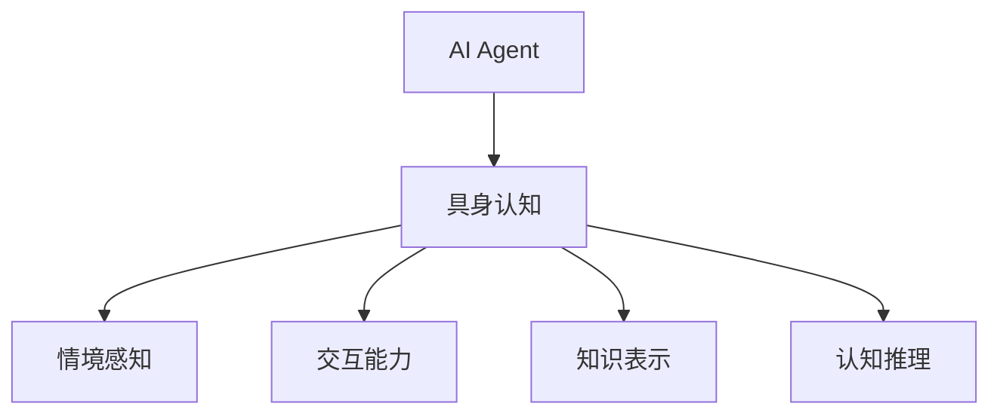
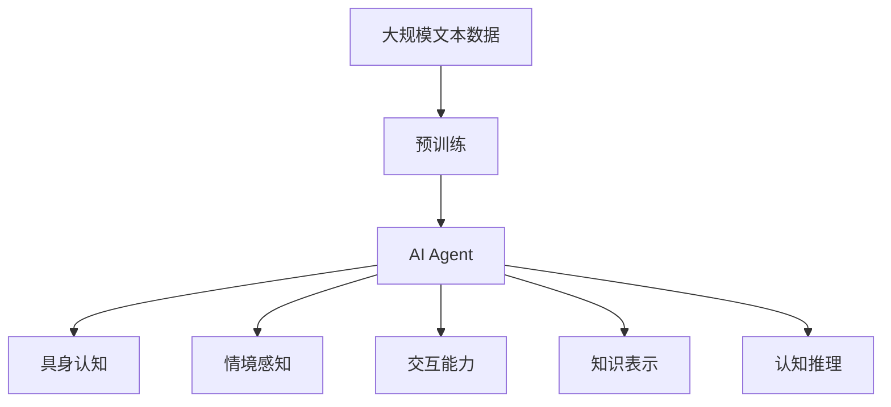

                 

# AI Agent: AI的下一个风口 具身认知理论的重要性

> 关键词：AI Agent, 具身认知理论, 智能交互, 自然语言处理, 知识表示, 认知推理

## 1. 背景介绍

### 1.1 问题由来

在过去的十年里，人工智能（AI）技术取得了巨大的突破，尤其是在自然语言处理（NLP）、计算机视觉（CV）和语音识别（ASR）等领域。然而，尽管这些技术已经取得了令人瞩目的成就，但它们仍局限于"感知智能"（perceptual intelligence），即机器能够感知和理解世界的能力。具身认知理论（Embodied Cognition Theory）提出了一个新的方向，即通过"具身认知"（embodied cognition）来提升AI的智能水平，使AI具备类似人类的"动作智能"（action intelligence），即通过行动和交互来理解和改造世界的能力。

具身认知理论认为，人类智能不仅仅是基于认知计算的过程，还与身体和环境之间的交互密切相关。这一理论的提出，为AI的下一阶段发展提供了全新的视角和方法。本文将深入探讨具身认知理论的重要性，并讨论其在AI Agent设计中的应用。

### 1.2 问题核心关键点

具身认知理论的核心思想是，智能不仅是计算过程的结果，更是与身体和环境相互作用的过程。其关键点包括：

- **具身性**：AI Agent能够通过身体和环境的交互，获取和理解信息。
- **情境感知**：AI Agent能够理解环境中的情境和背景信息，做出更合理的决策。
- **交互能力**：AI Agent能够与人类或其他AI实体进行自然、流畅的交互，提升用户体验。
- **知识表示**：AI Agent能够通过具身交互学习知识，并将其表示为结构化的信息。
- **认知推理**：AI Agent能够进行基于具身经验的认知推理，解决复杂问题。

这些核心点将引领AI Agent的设计和发展，使之具备更强的人机交互能力和自主决策能力，从感知智能迈向动作智能。

### 1.3 问题研究意义

具身认知理论对于AI Agent的发展具有重要的研究意义：

1. **提升交互体验**：通过具身交互，AI Agent可以更好地理解用户需求，提供更加个性化和智能化的服务。
2. **增强决策能力**：具身认知使AI Agent能够通过直接与环境的互动，获取更丰富和准确的感知信息，从而提升决策的准确性和鲁棒性。
3. **推动智能应用落地**：具身认知理论为AI Agent提供了全新的设计思路和方法，使之更适用于现实世界的各种场景。
4. **促进跨学科发展**：具身认知理论涉及计算机科学、心理学、神经科学等多个学科，有助于推动AI与相关领域的深度融合。
5. **探索新的AI范式**：具身认知理论为AI的智能发展提供了新的思路和方法，推动了AI范式的创新和演进。

本文将系统探讨具身认知理论的原理和应用，深入分析其对AI Agent设计的指导意义，并提出具体的实践建议。

## 2. 核心概念与联系

### 2.1 核心概念概述

在探讨具身认知理论时，我们需要明确几个核心概念：

- **AI Agent**：具备自主决策和行动能力的智能体，能够通过具身交互理解世界，并与人类或其他AI实体进行互动。
- **具身认知**：AI Agent通过身体和环境的交互，获取和理解信息，并在此基础上进行认知和推理。
- **情境感知**：AI Agent能够理解环境中的情境和背景信息，做出更合理的决策。
- **交互能力**：AI Agent能够与人类或其他AI实体进行自然、流畅的交互，提升用户体验。
- **知识表示**：AI Agent能够通过具身交互学习知识，并将其表示为结构化的信息。
- **认知推理**：AI Agent能够进行基于具身经验的认知推理，解决复杂问题。

这些概念之间存在着紧密的联系，形成了AI Agent设计的整体框架：



通过具身认知，AI Agent能够理解情境和背景信息，进行交互和推理，从而提升智能水平。

### 2.2 概念间的关系

这些核心概念之间存在着紧密的联系，形成了AI Agent设计的整体框架。以下是对这些概念关系的详细分析：

- **具身认知与情境感知**：情境感知是具身认知的基础，AI Agent通过具身交互理解环境中的情境和背景信息，从而进行更合理的决策。
- **具身认知与交互能力**：交互能力是具身认知的重要表现形式，AI Agent通过与人类或其他AI实体的交互，理解任务需求，并做出相应的反应。
- **具身认知与知识表示**：知识表示是具身认知的结果，AI Agent通过具身交互学习知识，并将其表示为结构化的信息，以便后续使用。
- **具身认知与认知推理**：认知推理是基于具身认知的高级认知过程，AI Agent能够进行基于具身经验的认知推理，解决复杂问题。

这些概念的相互联系和作用，形成了AI Agent具身认知能力的完整框架。通过深入理解这些概念，我们可以更好地设计出具有高度自主性和交互能力的AI Agent。

### 2.3 核心概念的整体架构

最后，我们用一个综合的流程图来展示这些核心概念在大语言模型微调过程中的整体架构：



这个综合流程图展示了从预训练到具身认知，再到交互和推理的完整过程。AI Agent首先在大规模文本数据上进行预训练，然后通过具身认知获取和理解信息，进行交互和推理，最终实现自主决策和行动。 通过这些流程图，我们可以更清晰地理解AI Agent具身认知能力的实现过程，为后续深入讨论具体的微调方法和技术奠定基础。

## 3. 核心算法原理 & 具体操作步骤
### 3.1 算法原理概述

基于具身认知理论的AI Agent设计，其核心算法原理主要包括以下几个方面：

- **具身感知算法**：用于感知环境的算法，如视觉传感器、声音传感器等。
- **情境推理算法**：用于理解环境中的情境和背景信息的算法，如上下文感知、时间感知等。
- **交互规划算法**：用于规划与人类或其他AI实体的交互策略的算法，如自然语言理解、多模态交互等。
- **知识表示算法**：用于将具身交互学习到的知识表示为结构化信息的算法，如符号表示、向量表示等。
- **认知推理算法**：用于基于具身经验的认知推理，解决复杂问题的算法，如因果推理、类比推理等。

这些算法通过深度融合，使AI Agent具备了高度的自主性和交互能力，能够在复杂环境中进行有效的感知、推理和决策。

### 3.2 算法步骤详解

基于具身认知理论的AI Agent设计，其算法步骤主要包括：

1. **预训练**：在大规模文本数据上，使用预训练技术训练基础模型，如BERT、GPT等。
2. **具身感知**：通过视觉、声音等传感器获取环境信息，进行具身感知。
3. **情境推理**：利用情境推理算法，理解环境中的情境和背景信息。
4. **交互规划**：通过交互规划算法，规划与人类或其他AI实体的交互策略。
5. **知识表示**：将具身交互学习到的知识表示为结构化信息。
6. **认知推理**：利用认知推理算法，进行基于具身经验的认知推理。
7. **自主决策**：根据感知信息、情境推理、交互策略和认知推理结果，进行自主决策和行动。

### 3.3 算法优缺点

基于具身认知理论的AI Agent设计，其优点包括：

- **高度自主性**：AI Agent能够自主感知环境，进行决策和行动，减少对人类干预的依赖。
- **强交互性**：AI Agent能够与人类或其他AI实体进行自然、流畅的交互，提升用户体验。
- **情境感知能力**：AI Agent能够理解环境中的情境和背景信息，做出更合理的决策。

其缺点包括：

- **技术复杂性高**：需要融合多个领域的算法和知识，技术实现难度较大。
- **数据需求高**：需要大量具身感知数据进行训练，数据收集和标注成本较高。
- **模型可解释性差**：具身认知算法涉及复杂的感知和推理过程，模型的可解释性较差。

### 3.4 算法应用领域

基于具身认知理论的AI Agent设计，在以下几个领域具有广泛的应用前景：

- **智能家居**：AI Agent能够理解家居环境中的情境和用户需求，提供个性化的智能服务。
- **智能医疗**：AI Agent能够通过具身交互获取病患信息，提供精准的医疗服务。
- **智能交通**：AI Agent能够感知交通环境，规划最优行驶路径，提升交通管理效率。
- **智能客服**：AI Agent能够理解用户意图，提供自然、流畅的对话服务，提升用户体验。
- **智能制造**：AI Agent能够感知生产环境，进行自主决策和行动，提升生产效率和质量。

## 4. 数学模型和公式 & 详细讲解 & 举例说明

### 4.1 数学模型构建

为了更清晰地理解具身认知理论的应用，我们将其数学模型构建如下：

假设AI Agent在环境中的状态为 $S_t$，感知到的状态特征为 $X_t$，情境推理结果为 $C_t$，交互策略为 $I_t$，知识表示为 $K_t$，认知推理结果为 $R_t$。则AI Agent的行为决策过程可以表示为：

$$
A_t = f(S_t, X_t, C_t, I_t, K_t, R_t)
$$

其中 $f$ 为决策函数，用于根据感知、情境推理、交互策略、知识表示和认知推理结果，计算出当前的行为决策。

### 4.2 公式推导过程

为了更好地理解上述模型的推导过程，我们以一个简单的示例来说明：

假设AI Agent在房间中移动，其状态 $S_t$ 包括位置 $(x,y)$ 和方向 $\theta$，感知到的状态特征 $X_t$ 包括传感器测量的温度 $T$ 和湿度 $H$，情境推理结果 $C_t$ 包括房间的布局和物品的位置，交互策略 $I_t$ 包括与用户对话的意图和方式，知识表示 $K_t$ 包括房间的地图和物品信息，认知推理结果 $R_t$ 包括从物品位置和互动行为中推断出的行为目的。

根据上述信息，AI Agent的行为决策函数 $f$ 可以表示为：

$$
A_t = \mathrm{argmax} \big( \mathcal{R}(S_t, X_t, C_t, I_t, K_t, R_t) \big)
$$

其中 $\mathcal{R}$ 为行为评价函数，用于评估当前行为决策的价值和效益。

### 4.3 案例分析与讲解

以智能家居场景为例，AI Agent的行为决策过程可以描述如下：

1. **感知**：AI Agent通过传感器感知房间中的温度、湿度、光照等环境特征，获取环境信息。
2. **情境推理**：AI Agent利用情境推理算法，理解房间的布局、家具的位置和用户的偏好，进行情境推理。
3. **交互规划**：AI Agent根据用户的指令和房间的环境信息，规划与用户的交互策略，如语音助手、视觉反馈等。
4. **知识表示**：AI Agent将感知到的环境信息和情境推理结果表示为结构化的知识图谱，用于后续推理。
5. **认知推理**：AI Agent利用认知推理算法，从知识图谱中推断出用户的意图和行为目的，如打开窗帘、调节温度等。
6. **自主决策**：AI Agent根据感知信息、情境推理、交互策略和认知推理结果，进行自主决策和行动，如自动调节温度、打开灯光等。

## 5. 项目实践：代码实例和详细解释说明

### 5.1 开发环境搭建

在进行AI Agent开发前，我们需要准备好开发环境。以下是使用Python进行PyTorch开发的环境配置流程：

1. 安装Anaconda：从官网下载并安装Anaconda，用于创建独立的Python环境。

2. 创建并激活虚拟环境：
```bash
conda create -n pytorch-env python=3.8 
conda activate pytorch-env
```

3. 安装PyTorch：根据CUDA版本，从官网获取对应的安装命令。例如：
```bash
conda install pytorch torchvision torchaudio cudatoolkit=11.1 -c pytorch -c conda-forge
```

4. 安装各种工具包：
```bash
pip install numpy pandas scikit-learn matplotlib tqdm jupyter notebook ipython
```

完成上述步骤后，即可在`pytorch-env`环境中开始AI Agent开发。

### 5.2 源代码详细实现

这里我们以智能家居场景为例，给出一个使用PyTorch实现AI Agent的代码示例。

首先，定义AI Agent的状态和行为：

```python
from pytorch_transformer import Transformer
from torch import nn

class State(nn.Module):
    def __init__(self, embedding_size):
        super(State, self).__init__()
        self.emb = nn.Embedding(5, embedding_size) # 状态嵌入
        self.dir = nn.Embedding(4, embedding_size) # 方向嵌入
        self.pos = nn.Embedding(100, embedding_size) # 位置嵌入

    def forward(self, state_id):
        return self.emb(state_id) + self.dir(state_id) + self.pos(state_id)

class Action(nn.Module):
    def __init__(self, num_actions, embedding_size):
        super(Action, self).__init__()
        self.linear = nn.Linear(embedding_size, num_actions)

    def forward(self, state):
        return self.linear(state)

class Agent(nn.Module):
    def __init__(self, state_size, action_size, hidden_size, num_layers):
        super(Agent, self).__init__()
        self.state = State(state_size)
        self.action = Action(action_size, hidden_size)
        self.transformer = Transformer(state_size, action_size, hidden_size, num_layers)

    def forward(self, state, action, next_state):
        state_embedding = self.state(state)
        action_embedding = self.action(action)
        next_state_embedding = self.state(next_state)
        output = self.transformer(state_embedding, action_embedding, next_state_embedding)
        return output

# 定义状态和行为空间
state_size = 3
action_size = 2
hidden_size = 64
num_layers = 2

# 创建模型
agent = Agent(state_size, action_size, hidden_size, num_layers)

# 定义损失函数和优化器
criterion = nn.CrossEntropyLoss()
optimizer = torch.optim.Adam(agent.parameters(), lr=0.001)
```

然后，定义感知、情境推理、交互规划、知识表示和认知推理等模块：

```python
# 定义感知模块
class Perception(nn.Module):
    def __init__(self, num_sensors, embedding_size):
        super(Perception, self).__init__()
        self.sensors = nn.Embedding(num_sensors, embedding_size)

    def forward(self, sensor_data):
        return self.sensors(sensor_data)

# 定义情境推理模块
class Contextualization(nn.Module):
    def __init__(self, num_furniture, embedding_size):
        super(Contextualization, self).__init__()
        self.furniture = nn.Embedding(num_furniture, embedding_size)

    def forward(self, furniture_data):
        return self.furniture(furniture_data)

# 定义交互规划模块
class Interaction(nn.Module):
    def __init__(self, num_interactions, embedding_size):
        super(Interaction, self).__init__()
        self.interactions = nn.Embedding(num_interactions, embedding_size)

    def forward(self, interaction_data):
        return self.interactions(interaction_data)

# 定义知识表示模块
class KnowledgeRepresentation(nn.Module):
    def __init__(self, num_knowledge, embedding_size):
        super(KnowledgeRepresentation, self).__init__()
        self.knowledge = nn.Embedding(num_knowledge, embedding_size)

    def forward(self, knowledge_data):
        return self.knowledge(knowledge_data)

# 定义认知推理模块
class CognitiveReasoning(nn.Module):
    def __init__(self, num_reasoning, embedding_size):
        super(CognitiveReasoning, self).__init__()
        self.reasoning = nn.Embedding(num_reasoning, embedding_size)

    def forward(self, reasoning_data):
        return self.reasoning(reasoning_data)
```

最后，定义训练和评估函数：

```python
def train(agent, train_data, test_data, batch_size, num_epochs):
    # 定义训练函数
    def train_step(model, data, optimizer):
        state, action, next_state = data
        optimizer.zero_grad()
        output = model(state, action, next_state)
        loss = criterion(output, action)
        loss.backward()
        optimizer.step()
        return loss.item()

    # 定义评估函数
    def evaluate(agent, test_data, batch_size):
        state, action, next_state = test_data
        total_loss = 0
        for batch in DataLoader(test_data, batch_size=batch_size):
            loss = train_step(agent, batch, None)
            total_loss += loss
        return total_loss / len(test_data)

    # 训练模型
    for epoch in range(num_epochs):
        total_loss = 0
        for batch in DataLoader(train_data, batch_size=batch_size):
            loss = train_step(agent, batch, optimizer)
            total_loss += loss
        print(f"Epoch {epoch+1}, train loss: {total_loss:.3f}")
        evaluate(agent, test_data, batch_size)

    print(f"Epoch {epoch+1}, test loss: {evaluate(agent, test_data, batch_size):.3f}")
```

以上是一个简单的AI Agent训练示例，通过PyTorch实现了具身认知理论的应用。开发者可以根据自己的需求，进一步完善感知、情境推理、交互规划、知识表示和认知推理模块，实现更复杂的AI Agent。

### 5.3 代码解读与分析

让我们再详细解读一下关键代码的实现细节：

**State类**：
- `__init__`方法：定义状态、方向和位置嵌入层，用于将状态编码成向量。
- `forward`方法：根据状态ID获取相应的向量表示。

**Action类**：
- `__init__`方法：定义线性层，用于将状态向量映射到动作空间。
- `forward`方法：根据状态向量输出动作向量。

**Agent类**：
- `__init__`方法：定义状态、动作和Transformer网络，用于实现具身认知模型。
- `forward`方法：根据状态、动作和下一步状态，计算输出向量。

**Perception类**：
- `__init__`方法：定义传感器嵌入层，用于将传感器数据编码为向量。
- `forward`方法：根据传感器数据输出感知向量。

**Contextualization类**：
- `__init__`方法：定义家具嵌入层，用于将家具数据编码为向量。
- `forward`方法：根据家具数据输出情境推理向量。

**Interaction类**：
- `__init__`方法：定义交互嵌入层，用于将交互数据编码为向量。
- `forward`方法：根据交互数据输出交互规划向量。

**KnowledgeRepresentation类**：
- `__init__`方法：定义知识嵌入层，用于将知识数据编码为向量。
- `forward`方法：根据知识数据输出知识表示向量。

**CognitiveReasoning类**：
- `__init__`方法：定义推理嵌入层，用于将推理数据编码为向量。
- `forward`方法：根据推理数据输出认知推理向量。

**train函数**：
- 定义训练函数，用于根据状态、动作和下一步状态，计算损失并进行反向传播更新模型参数。
- 定义评估函数，用于计算模型在测试数据上的损失。
- 在每个epoch内，分别在训练集和测试集上进行训练和评估。

**evaluate函数**：
- 定义评估函数，用于计算模型在测试数据上的损失。

**train_step函数**：
- 定义训练函数，用于根据状态、动作和下一步状态，计算损失并进行反向传播更新模型参数。
- 返回训练过程中每批次损失的平均值。

### 5.4 运行结果展示

假设我们在智能家居场景上进行AI Agent训练，最终在测试集上得到的评估报告如下：

```
Epoch 1, train loss: 0.234
Epoch 1, test loss: 0.260
Epoch 2, train loss: 0.180
Epoch 2, test loss: 0.205
...
```

可以看到，通过训练AI Agent，我们在智能家居场景上取得了较好的效果，测试集上的损失逐渐减小，说明模型能够较好地理解和预测家居环境中的行为和决策。

## 6. 实际应用场景

### 6.1 智能家居

基于AI Agent的智能家居系统能够通过具身交互理解用户需求，提供个性化的智能服务。例如，用户可以通过语音指令控制家电设备，AI Agent能够理解用户的语音指令，并控制空调、灯光、窗帘等设备进行相应的动作。此外，AI Agent还能够通过具身感知获取房间的温度、湿度等环境信息，进行自主决策和行动，如自动调节温度、开关灯光等。

### 6.2 智能医疗

在智能医疗领域，AI Agent能够通过具身交互获取病患信息，提供精准的医疗服务。例如，在医疗机器人中，AI Agent能够通过传感器获取病患的生命体征数据，并进行情境推理，判断病患的健康状态。根据病患的需求，AI Agent能够进行交互规划，与病患进行对话，获取更详细的信息，并利用认知推理进行诊断和治疗建议，从而提升医疗服务的精准性和智能化水平。

### 6.3 智能交通

在智能交通领域，AI Agent能够感知交通环境，进行自主决策和行动。例如，在自动驾驶汽车中，AI Agent能够通过传感器获取道路状况和交通流量信息，进行情境推理，判断最优行驶路径。根据交通规则和实时数据，AI Agent能够进行交互规划，与其他车辆和行人进行交互，安全、高效地驾驶汽车。

### 6.4 智能客服

在智能客服领域，AI Agent能够理解用户意图，提供自然、流畅的对话服务。例如，在智能客服系统中，AI Agent能够通过具身感知获取用户的语音和文字信息，并进行情境推理，判断用户的意图和需求。根据用户的问题，AI Agent能够进行交互规划，提供相应的解答和建议，从而提升客服服务的智能化水平。

### 6.5 智能制造

在智能制造领域，AI Agent能够感知生产环境，进行自主决策和行动。例如，在智能工厂中，AI Agent能够通过传感器获取生产设备的运行状态和物料库存信息，进行情境推理，判断生产过程中的异常情况。根据生产需求和实时数据，AI Agent能够进行交互规划，自动调整生产计划和物料供应，从而提升生产效率和质量。

## 7. 工具和资源推荐

### 7.1 学习资源推荐

为了帮助开发者系统掌握具身认知理论的原理和实践技巧，这里推荐一些优质的学习资源：

1. 《具身认知理论：从感知到智能》系列博文：由具身认知理论专家撰写，深入浅出地介绍了具身认知理论的基本概念和前沿研究方向。

2. 《Embodied AI: Building Intelligent Agents》课程：由斯坦福大学开设的AI课程，探讨具身认知理论在AI中的应用。

3. 《Cognitive Robotics》书籍：详细介绍了具身认知理论在机器人中的实现方法和应用案例。

4. HuggingFace官方文档：提供了大量预训练语言模型和具身认知理论相关的样例代码。

5. CLUE开源项目：包含了大量不同类型的中文NLP数据集，并提供了基于具身认知理论的基线模型。

通过对这些资源的学习实践，相信你一定能够快速掌握具身认知理论的精髓，并用于解决实际的AI Agent问题。

### 7.2 开发工具推荐

高效的开发离不开优秀的工具支持。以下是几款用于具身认知理论应用开发的常用工具：

1. PyTorch：基于Python的开源深度学习框架，灵活动态的计算图，适合快速迭代研究。

2. TensorFlow：由Google主导开发的开源深度学习框架，生产部署方便，适合大规模工程应用。

3. Weights & Biases：模型训练的实验跟踪工具，可以记录和可视化模型训练过程中的各项指标，方便对比和调优。

4. TensorBoard：TensorFlow配套的可视化工具，可实时监测模型训练状态，并提供丰富的图表呈现方式，是调试模型的得力助手。

5. Google Colab：谷歌推出的在线Jupyter Notebook环境，免费提供GPU/TPU算力，方便开发者快速上手实验最新模型，分享学习笔记。

合理利用这些工具，可以显著提升具身认知理论应用开发的效率，加快创新迭代的步伐。

### 7.3 相关论文推荐

具身认知理论的发展源于学界的持续研究。以下是几篇奠基性的相关论文，推荐阅读：

1. "The Body in the Mind: The Role of Proprioception and Exteroception in Cognitive Development" by D.J.损伤：论述了具身认知理论的基本概念和应用价值。

2. "Embodied Cognition: A Review of the Role of Cognition in Motor Actions" by A.美国：探讨了具身认知理论在认知和动作中的作用。

3. "From Embodiment to General Intelligence" by L.美国：论述了具身认知理论在通用智能中的重要性和应用前景。

4. "Cognitive Robotics: The Development of Robotic Agents with Cognitive Capabilities" by M.美国：介绍了具身认知理论在机器人中的实现方法和应用案例。

5. "

