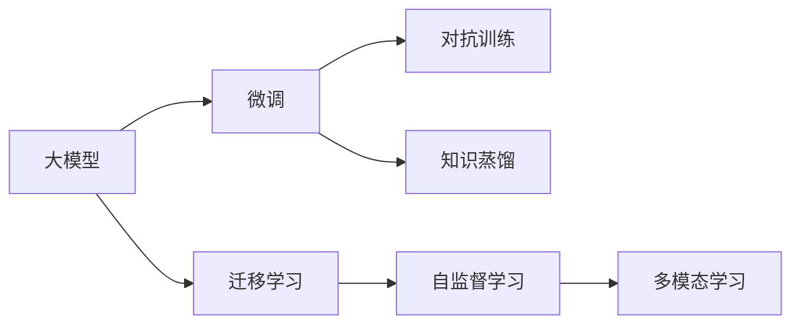
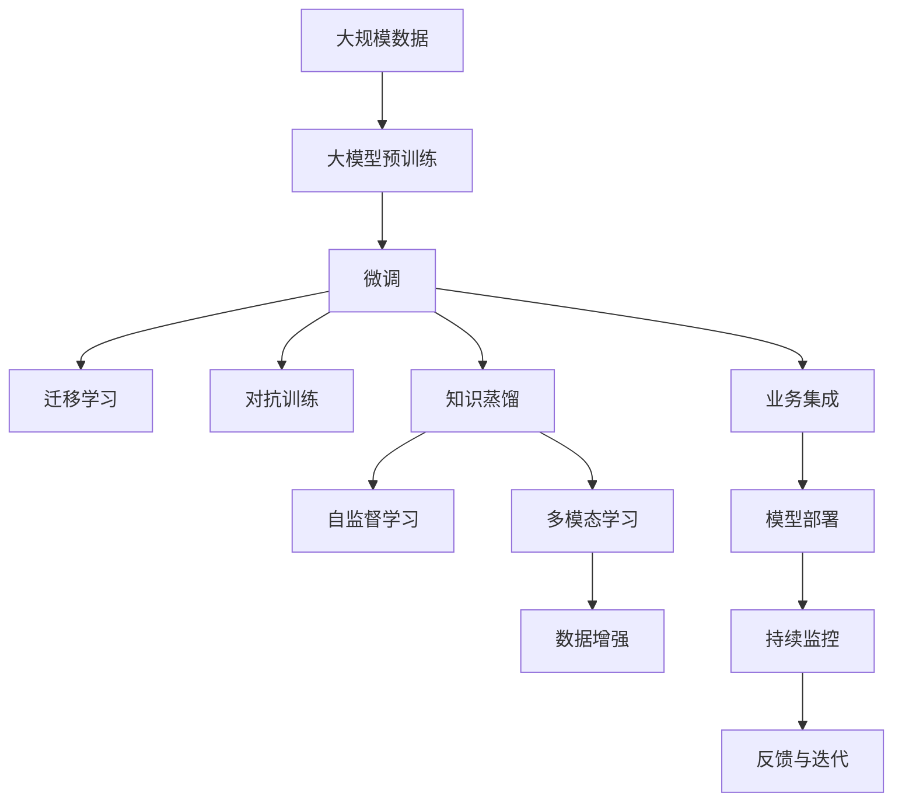

                 

## 1. 背景介绍

### 1.1 问题由来

当前，人工智能(AI)技术正迅速进入各行各业，成为推动数字化转型的重要引擎。其中，大模型技术作为AI领域的最新进展，通过在海量数据上进行的深度学习训练，具备了强大的通用能力和泛化能力，可以显著提升各种业务场景的效率和精度。

然而，尽管大模型在技术上具有显著优势，但其应用的复杂性、高昂的成本以及难以量化的风险，使得许多中小企业望而却步。因此，如何利用大模型技术，开展AI创业项目，成为当下业界热门话题。

### 1.2 问题核心关键点

本文聚焦于如何通过技术优势开展AI大模型创业。具体来说，我们将从以下几个方面探讨：

1. **选择合适的大模型**：分析各类主流大模型的特点，选择最适合自己业务场景的模型。
2. **数据准备与处理**：讨论如何获取、预处理和增强数据，以提升模型效果。
3. **模型微调与优化**：介绍常见的微调技术，以及如何通过参数优化、正则化等手段提升模型性能。
4. **部署与集成**：解析如何搭建模型部署平台，以及如何与现有系统集成。
5. **运营与优化**：探讨如何通过持续监控、反馈和迭代，保持模型的高效运行。

本文通过理论与实践相结合的方式，旨在为AI大模型创业项目提供一份全面的技术指南。

## 2. 核心概念与联系

### 2.1 核心概念概述

为更好地理解利用技术优势开展AI大模型创业，本文将介绍几个关键概念：

- **大模型(Large Model)**：通常指通过大规模数据训练得到的深度神经网络模型，如GPT、BERT、T5等。这些模型在自然语言处理、计算机视觉等领域具备强大的通用能力和泛化能力。
- **微调(Fine-Tuning)**：在大模型的基础上，通过特定任务的标注数据，调整模型的参数，使其在特定任务上表现更好。
- **迁移学习(Transfer Learning)**：将预训练模型在不同任务之间的知识迁移，用于提高模型在特定任务上的性能。
- **知识蒸馏(Knowledge Distillation)**：通过从大模型中提取知识，训练更小的模型，提升模型在特定任务上的效果。
- **对抗训练(Adversarial Training)**：通过引入对抗样本，增强模型的鲁棒性和泛化能力。
- **自监督学习(Self-Supervised Learning)**：使用未标注数据进行模型训练，提升模型的泛化能力。
- **多模态学习(Multimodal Learning)**：融合视觉、听觉等多模态数据，提升模型的复杂表征能力。

### 2.2 概念间的关系

这些概念之间相互联系，共同构成AI大模型创业的技术基础。以下是一个简化的Mermaid流程图，展示这些概念之间的关系：



此流程图显示，大模型在微调、迁移学习、对抗训练、知识蒸馏和自监督学习等技术的支持下，能够更好地适应特定任务，并通过多模态学习扩展其能力边界。

### 2.3 核心概念的整体架构

为更直观地展示这些概念的整体架构，我们提供以下综合的Mermaid流程图：



此流程图展示了从数据预处理、大模型预训练、微调和集成部署的全流程，并强调了自监督学习、对抗训练、知识蒸馏、多模态学习和数据增强等技术的重要性。

## 3. 核心算法原理 & 具体操作步骤

### 3.1 算法原理概述

AI大模型创业的核心在于利用预训练大模型在特定任务上的迁移能力。具体步骤如下：

1. **选择合适的大模型**：根据业务需求选择合适的预训练模型，如BERT、GPT、T5等。
2. **数据准备与预处理**：收集和预处理任务相关的数据，确保数据的多样性和代表性。
3. **模型微调和优化**：在特定任务的标注数据上微调大模型，通过调整模型参数和应用正则化技术，提高模型性能。
4. **模型部署与集成**：将微调后的模型部署到实际应用场景，并通过API接口与业务系统集成。
5. **持续监控与优化**：通过持续监控和反馈，不断优化模型和数据，提升模型效果。

### 3.2 算法步骤详解

#### 3.2.1 数据准备与预处理

数据准备与预处理是大模型创业的重要步骤，具体步骤如下：

1. **数据收集**：根据业务需求，收集相关的标注数据和未标注数据。标注数据用于模型微调，未标注数据用于自监督学习。
2. **数据清洗**：清洗数据中的噪声、缺失值和不一致信息，确保数据的准确性和一致性。
3. **数据增强**：通过数据增强技术，如旋转、裁剪、扰动等，扩充数据集，提升模型泛化能力。
4. **数据划分**：将数据划分为训练集、验证集和测试集，确保模型在未知数据上的泛化能力。

#### 3.2.2 模型微调和优化

模型微调和优化是利用大模型创业的核心环节，具体步骤如下：

1. **选择微调方法**：根据任务特点选择合适的微调方法，如全参数微调、参数高效微调等。
2. **设定超参数**：选择合适的学习率、批大小、迭代轮数等超参数。
3. **训练与评估**：在训练集上训练模型，并在验证集上评估模型性能。根据性能调整超参数。
4. **模型保存与部署**：保存训练好的模型，并部署到实际应用场景。
5. **持续优化**：根据实际应用反馈，不断优化模型和超参数，提升模型效果。

#### 3.2.3 模型部署与集成

模型部署与集成是将微调后的模型应用到实际业务场景的关键步骤，具体步骤如下：

1. **模型封装**：将微调后的模型封装为API接口或服务端，便于集成调用。
2. **集成部署**：将模型部署到云端或本地服务器，确保系统的高可用性和扩展性。
3. **业务集成**：将模型集成到业务系统中，实现自动化决策和智能推荐。

#### 3.2.4 持续监控与优化

持续监控与优化是保证AI大模型创业项目长期有效的关键环节，具体步骤如下：

1. **监控指标**：监控模型的各项指标，如精度、召回率、F1分数等，确保模型的稳定性和性能。
2. **反馈机制**：建立反馈机制，收集用户反馈和业务数据，发现模型的短板。
3. **迭代优化**：根据反馈数据和监控指标，不断优化模型和数据，提升模型效果。
4. **模型更新**：定期更新模型，确保模型能够适应数据分布的变化。

### 3.3 算法优缺点

利用大模型开展AI创业项目，具有以下优点：

- **通用性强**：大模型具备通用能力，能够适应多种业务场景。
- **性能优异**：大模型在特定任务上的效果往往优于从头训练的模型。
- **开发效率高**：通过微调技术，快速实现模型部署，缩短开发周期。
- **可扩展性好**：大模型可以灵活扩展，支持多任务和多模态数据。

同时，也存在以下缺点：

- **成本高昂**：预训练和微调大模型的硬件和算法成本较高。
- **技术门槛高**：大模型需要专业的技术团队进行维护和优化。
- **数据依赖强**：模型的效果依赖于高质量的数据和标注。
- **伦理风险**：大模型可能存在偏见和歧视，需注意伦理和隐私问题。

### 3.4 算法应用领域

AI大模型创业技术已经在多个领域取得了应用，具体如下：

- **自然语言处理(NLP)**：如智能客服、智能搜索、情感分析、机器翻译等。
- **计算机视觉(CV)**：如图像识别、人脸识别、物体检测等。
- **医疗健康**：如医学影像分析、疾病诊断、健康监测等。
- **金融科技**：如信用评估、反欺诈、智能投顾等。
- **智能制造**：如质量检测、设备维护、供应链优化等。
- **智慧城市**：如交通管理、安防监控、智能家居等。

## 4. 数学模型和公式 & 详细讲解 & 举例说明

### 4.1 数学模型构建

大模型创业的数学模型构建主要涉及以下几个步骤：

1. **数据表示**：将原始数据转化为模型可以处理的向量形式。
2. **模型定义**：定义深度神经网络模型，包括输入层、隐藏层和输出层。
3. **损失函数**：定义模型预测输出与真实标签之间的损失函数。
4. **优化目标**：最小化损失函数，优化模型参数。

假设任务为二分类任务，模型为二分类神经网络，使用交叉熵损失函数，优化目标为最小化损失函数。具体如下：

- 输入数据：$x \in \mathbb{R}^n$
- 模型输出：$y \in \mathbb{R}$
- 标签数据：$y_t \in \{0, 1\}$
- 损失函数：$\mathcal{L}(y, y_t) = -(y_t\log(y) + (1-y_t)\log(1-y))$
- 优化目标：$\min_{\theta} \frac{1}{N}\sum_{i=1}^N \mathcal{L}(y_i, y_t)$

### 4.2 公式推导过程

以下对二分类任务中的公式进行详细推导：

1. **模型定义**
   $$
   y = \sigma(Wx + b)
   $$
   其中，$\sigma$为激活函数，$W$为权重矩阵，$b$为偏置向量。

2. **损失函数**
   $$
   \mathcal{L}(y, y_t) = -(y_t\log(y) + (1-y_t)\log(1-y))
   $$

3. **优化目标**
   $$
   \min_{\theta} \frac{1}{N}\sum_{i=1}^N \mathcal{L}(y_i, y_t)
   $$

4. **梯度计算**
   $$
   \frac{\partial \mathcal{L}}{\partial W} = \frac{\partial \mathcal{L}}{\partial y}\frac{\partial y}{\partial W}
   $$

5. **更新公式**
   $$
   W \leftarrow W - \eta \nabla_{W}\mathcal{L}
   $$

通过以上公式，可以对大模型进行训练和优化，提升其在特定任务上的性能。

### 4.3 案例分析与讲解

以下以图像识别任务为例，展示大模型创业的具体实现：

1. **数据准备**：收集和预处理图像数据，将其转化为模型可以处理的向量形式。
2. **模型定义**：使用卷积神经网络(CNN)作为模型，定义输入层、卷积层、池化层和全连接层。
3. **损失函数**：使用交叉熵损失函数，定义模型输出与标签之间的差异。
4. **优化目标**：最小化损失函数，优化模型参数。
5. **训练与评估**：在训练集上训练模型，并在验证集上评估模型性能。
6. **模型部署**：将训练好的模型封装为API接口，部署到实际应用场景。

## 5. 项目实践：代码实例和详细解释说明

### 5.1 开发环境搭建

1. **选择编程语言**：Python是目前最流行的AI开发语言，具备丰富的第三方库和框架支持。
2. **安装依赖库**：使用pip安装必要的库，如TensorFlow、PyTorch、Pandas、NumPy等。
3. **搭建开发环境**：使用Anaconda或Virtualenv创建虚拟环境，确保开发环境的隔离和稳定性。
4. **数据准备**：收集和预处理数据，将其转化为模型可以处理的格式。
5. **模型训练**：使用深度学习框架，定义模型结构，训练模型。
6. **模型评估**：在验证集上评估模型性能，根据评估结果优化模型参数。
7. **模型部署**：将训练好的模型部署到实际应用场景，提供API接口或服务端。

### 5.2 源代码详细实现

以下是使用TensorFlow实现图像分类任务的代码实现：

```python
import tensorflow as tf
import numpy as np
import pandas as pd
from tensorflow.keras import layers, models

# 数据加载与预处理
data = pd.read_csv('data.csv')
x_train = np.array(data['images'])
y_train = np.array(data['labels'])

# 定义模型
model = models.Sequential([
    layers.Conv2D(32, (3, 3), activation='relu', input_shape=(32, 32, 3)),
    layers.MaxPooling2D((2, 2)),
    layers.Conv2D(64, (3, 3), activation='relu'),
    layers.MaxPooling2D((2, 2)),
    layers.Conv2D(128, (3, 3), activation='relu'),
    layers.MaxPooling2D((2, 2)),
    layers.Flatten(),
    layers.Dense(64, activation='relu'),
    layers.Dense(10, activation='softmax')
])

# 编译模型
model.compile(optimizer='adam', loss='sparse_categorical_crossentropy', metrics=['accuracy'])

# 训练模型
model.fit(x_train, y_train, epochs=10, batch_size=32, validation_data=(x_val, y_val))

# 模型评估
loss, accuracy = model.evaluate(x_test, y_test)

# 模型部署
model.save('model.h5')
```

### 5.3 代码解读与分析

- **数据准备**：使用Pandas加载和预处理数据，将其转化为模型可以处理的格式。
- **模型定义**：使用Keras定义卷积神经网络模型，包含多个卷积层、池化层和全连接层。
- **模型编译**：使用Adam优化器，交叉熵损失函数，准确率作为评估指标。
- **模型训练**：在训练集上训练模型，并在验证集上评估模型性能。
- **模型评估**：在测试集上评估模型性能，获取损失和准确率。
- **模型部署**：将训练好的模型保存为HDF5格式，供实际应用使用。

## 6. 实际应用场景

### 6.1 智能客服系统

利用AI大模型创业，可以构建智能客服系统，通过自然语言处理技术，实现自动问答和情感分析，提升客户满意度。具体步骤如下：

1. **数据准备**：收集客户咨询数据，标注数据并处理成可训练格式。
2. **模型训练**：使用BERT、GPT等大模型，进行微调和优化，训练自动问答模型。
3. **模型部署**：将训练好的模型部署到云端或本地服务器，提供API接口。
4. **系统集成**：将模型集成到客户服务平台，实现自动化响应。

### 6.2 金融风险管理

在金融领域，可以利用AI大模型创业，构建风险管理平台，实时监控市场舆情，识别潜在风险。具体步骤如下：

1. **数据准备**：收集金融市场数据和舆情数据，进行清洗和标注。
2. **模型训练**：使用BERT等大模型，进行情感分析和事件识别，训练风险预警模型。
3. **模型部署**：将训练好的模型部署到云端或本地服务器，提供API接口。
4. **系统集成**：将模型集成到金融分析系统，实现风险预警和决策支持。

### 6.3 医疗影像诊断

在医疗领域，可以利用AI大模型创业，构建医疗影像诊断系统，辅助医生进行诊断和治疗。具体步骤如下：

1. **数据准备**：收集医疗影像数据和标注数据，进行清洗和标注。
2. **模型训练**：使用ResNet、Inception等大模型，进行微调和优化，训练医学影像诊断模型。
3. **模型部署**：将训练好的模型部署到云端或本地服务器，提供API接口。
4. **系统集成**：将模型集成到医疗影像分析系统，实现自动诊断和辅助决策。

## 7. 工具和资源推荐

### 7.1 学习资源推荐

为了帮助开发者系统掌握AI大模型创业的理论基础和实践技巧，这里推荐一些优质的学习资源：

1. **《深度学习》课程**：斯坦福大学的深度学习课程，涵盖神经网络、卷积神经网络、循环神经网络等基本概念。
2. **Kaggle竞赛**：参加Kaggle数据科学竞赛，通过实战提升模型开发和优化能力。
3. **论文阅读**：阅读最新顶级会议和期刊的论文，了解前沿研究动态和技术进展。
4. **书籍推荐**：《Python深度学习》、《深度学习入门》等书籍，系统介绍深度学习理论和实践。
5. **在线课程**：Coursera、Udacity等平台提供丰富的深度学习课程，系统学习深度学习技术。

### 7.2 开发工具推荐

高效的工具是开发AI大模型创业项目的关键，以下是一些推荐工具：

1. **TensorFlow**：谷歌开发的深度学习框架，功能丰富，社区活跃，适合大模型创业项目。
2. **PyTorch**：Facebook开发的深度学习框架，灵活高效，适合研究和实验。
3. **Keras**：谷歌开发的高级API，易于使用，适合快速原型开发和模型实验。
4. **Jupyter Notebook**：数据科学和深度学习常用的交互式编程环境，方便代码调试和版本控制。
5. **Git/GitHub**：版本控制和代码托管平台，方便协作和版本管理。

### 7.3 相关论文推荐

AI大模型创业涉及的多个领域都有大量的优秀论文，以下是几篇经典论文推荐：

1. **《ImageNet分类挑战：大模型时代的终结》**：AlexNet论文，介绍了大模型在图像分类任务上的突破。
2. **《BERT：预训练表示的方法》**：BERT论文，介绍了BERT模型及其在NLP任务上的应用。
3. **《GPT-2：语言模型是如何工作的》**：GPT-2论文，介绍了大语言模型和对抗训练技术。
4. **《强化学习：一种新的机器学习方法》**：强化学习经典论文，介绍了强化学习在AI大模型创业中的应用。

## 8. 总结：未来发展趋势与挑战

### 8.1 总结

本文对AI大模型创业进行了全面的介绍，涵盖了大模型的选择、数据准备、模型微调、模型部署和持续优化等多个环节。通过理论与实践相结合的方式，希望能为AI大模型创业提供一份全面的技术指南。

### 8.2 未来发展趋势

展望未来，AI大模型创业技术将呈现以下几个发展趋势：

1. **边缘计算**：随着IoT设备的发展，边缘计算将进一步普及，大模型创业项目将在本地部署和计算。
2. **跨模态融合**：未来大模型创业将融合多模态数据，提升模型的复杂表征能力。
3. **自动化学习**：自动化机器学习技术将逐步普及，大模型创业项目将更加自动化。
4. **低成本运行**：云计算和边缘计算技术的发展，将使得大模型创业项目更加低成本运行。
5. **可持续发展**：AI大模型创业项目将更加注重数据伦理和隐私保护，实现可持续发展。

### 8.3 面临的挑战

尽管AI大模型创业技术已经取得不少进展，但仍面临诸多挑战：

1. **数据质量**：高质量数据是模型效果的基础，但数据获取和标注成本较高。
2. **技术门槛**：大模型创业需要专业的技术团队，技术门槛较高。
3. **模型鲁棒性**：大模型可能存在偏见和歧视，需注意伦理和隐私问题。
4. **资源消耗**：大模型训练和推理的硬件和算法成本较高，需优化资源消耗。

### 8.4 研究展望

未来研究将在大模型创业的多个方面进行深入探索，包括：

1. **自动化机器学习**：开发自动化机器学习工具，降低技术门槛，提升开发效率。
2. **跨模态融合**：融合多模态数据，提升模型的复杂表征能力。
3. **模型压缩**：开发模型压缩和优化技术，降低硬件和算法成本。
4. **伦理和隐私保护**：研究和解决数据伦理和隐私问题，确保AI大模型创业的可持续发展。

总之，AI大模型创业技术具有广阔的应用前景，但也面临诸多挑战。只有通过不断创新和优化，才能实现大模型创业项目的商业化应用。

## 9. 附录：常见问题与解答

**Q1：AI大模型创业是否需要大量的标注数据？**

A: 是的，AI大模型创业需要高质量的标注数据来训练和优化模型。数据量越大，模型效果越好。但数据获取和标注成本较高，需合理规划。

**Q2：如何选择合适的AI大模型？**

A: 根据业务需求选择合适的预训练大模型，如BERT、GPT、T5等。大模型的选择应基于模型在特定任务上的效果和泛化能力。

**Q3：AI大模型创业需要哪些技术资源？**

A: AI大模型创业需要专业的技术团队，涉及深度学习、自然语言处理、计算机视觉等多个领域。

**Q4：如何降低AI大模型创业的成本？**

A: 通过优化模型结构、使用自动化机器学习工具、合理规划数据集等措施，降低AI大模型创业的成本。

**Q5：AI大模型创业如何处理数据隐私问题？**

A: 在数据收集和处理过程中，需注意数据隐私保护，使用加密、匿名化等技术手段，确保数据的安全性和隐私性。

作者：禅与计算机程序设计艺术 / Zen and the Art of Computer Programming

