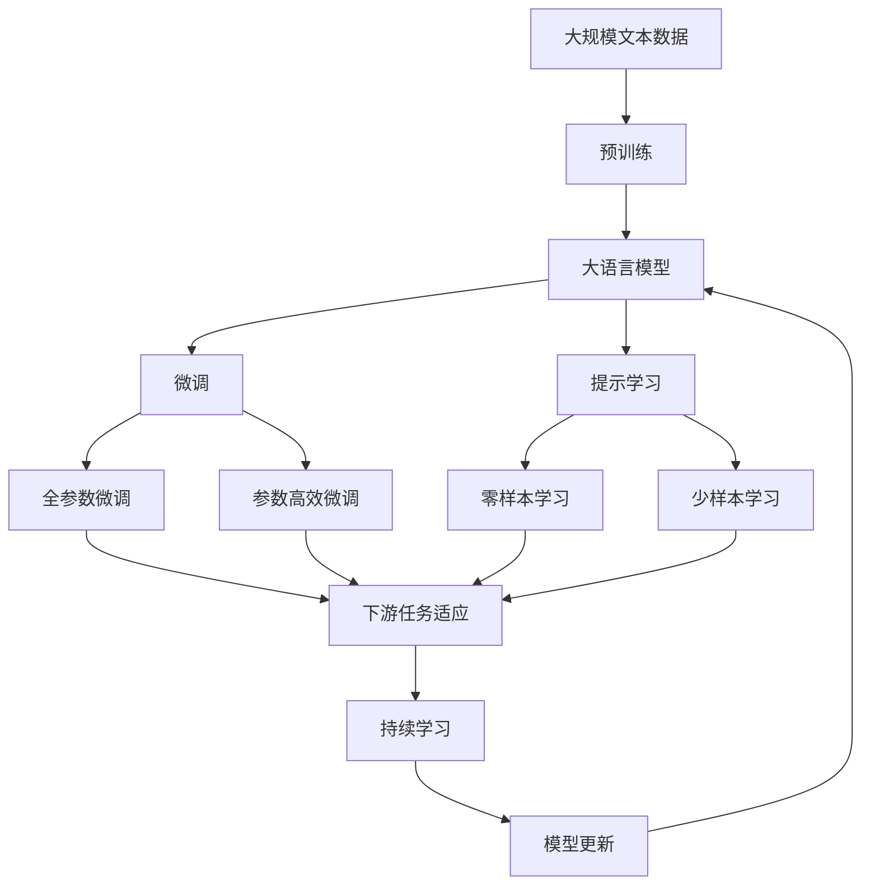

                 

# 计算：第三部分 计算理论的形成 第 6 章 计算理论的奠基：希尔伯特进路 数学的无冕之王

> 关键词：计算理论,希尔伯特进路,数学基础,无冕之王

## 1. 背景介绍

### 1.1 问题由来

计算理论作为计算机科学和数学交叉融合的核心领域，其研究源起于对计算过程本质和效率的深入探讨。希尔伯特进路，作为计算理论研究的主干线，从数学基础的角度出发，试图通过严谨的形式化证明，揭示计算过程的内在规律和局限性。在这一进程中，涌现出了一系列经典成果，深刻影响了计算理论和计算机科学的发展。

希尔伯特的进路基于哥德尔不完备定理，该定理指出在任意形式化的数学系统中，一定存在无法证明或无法证伪的命题，从而引发了对计算完备性和计算复杂度的讨论。希尔伯特进路试图通过严格的数学推导，建立起计算过程的严谨理论框架，揭示其内在规律和极限。

### 1.2 问题核心关键点

希尔伯特进路的核心在于将计算过程与数学基础相结合，试图通过严谨的形式化证明，揭示计算过程的内在规律和局限性。其关键点包括：

- 计算完备性：是否存在一个计算系统，能够处理所有可能的问题。
- 计算复杂度：不同计算问题的复杂度，以及它们之间的关系。
- 数学基础：数学逻辑系统的完备性和一致性，以及它们与计算过程的关系。

这些关键点构成了希尔伯特进路的研究框架，为计算理论奠定了坚实的基础。

### 1.3 问题研究意义

希尔伯特进路的研究不仅深化了对计算过程的认识，还对计算机科学和数学的发展产生了深远影响。通过数学的形式化证明，希尔伯特进路揭示了计算过程的本质和极限，为计算机科学的发展提供了理论依据。同时，希尔伯特进路还推动了数学逻辑学的研究，促进了数学与计算机科学的交叉融合。

希尔伯特进路的研究意义在于：

1. 提供了一个严格的理论框架，有助于深入理解计算过程的本质。
2. 揭示了计算过程的局限性，推动了计算复杂性和计算能力的研究。
3. 促进了数学逻辑学的研究，推动了数学与计算机科学的交叉发展。

## 2. 核心概念与联系

### 2.1 核心概念概述

希尔伯特进路的研究涉及多个核心概念，包括计算完备性、计算复杂度、数学基础等。

- 计算完备性：指一个计算系统是否能够处理所有可能的问题。
- 计算复杂度：指不同计算问题的复杂度，以及它们之间的关系。
- 数学基础：指数学逻辑系统的完备性和一致性，以及它们与计算过程的关系。
- 哥德尔不完备定理：指出在任意形式化的数学系统中，一定存在无法证明或无法证伪的命题。

这些核心概念通过数学的形式化证明，揭示了计算过程的内在规律和局限性，为计算理论奠定了坚实的基础。

### 2.2 概念间的关系

这些核心概念之间存在着紧密的联系，形成了希尔伯特进路的研究框架。

#### 2.2.1 计算完备性与计算复杂度

计算完备性与计算复杂度是计算理论研究的两大核心问题。计算完备性探讨的是计算系统的能力范围，而计算复杂度探讨的是计算问题的难度。两者相互关联，共同构成了计算理论的研究框架。

#### 2.2.2 计算完备性与数学基础

计算完备性与数学基础密切相关。数学逻辑系统的完备性与一致性，是计算完备性研究的重要基础。而计算完备性的研究成果，又反过来推动了数学逻辑学的研究，促进了数学与计算机科学的交叉发展。

#### 2.2.3 计算复杂度与数学基础

计算复杂度研究与数学基础研究也有着密切的联系。数学逻辑系统的复杂度，以及它们与计算复杂度之间的关系，是研究计算复杂性的重要基础。

这些核心概念之间的关系，可以通过以下Mermaid流程图来展示：


这个流程图展示了计算完备性、计算复杂度、数学基础和哥德尔不完备定理之间的联系。

### 2.3 核心概念的整体架构

最后，我们用一个综合的流程图来展示这些核心概念在大语言模型微调过程中的整体架构：



这个综合流程图展示了从预训练到微调，再到持续学习的完整过程。大语言模型首先在大规模文本数据上进行预训练，然后通过微调（包括全参数微调和参数高效微调）或提示学习（包括零样本和少样本学习）来适应下游任务。最后，通过持续学习技术，模型可以不断更新和适应新的任务和数据。

## 3. 核心算法原理 & 具体操作步骤

### 3.1 算法原理概述

希尔伯特进路的核心算法原理基于哥德尔不完备定理，通过数学的形式化证明，揭示了计算过程的内在规律和局限性。其基本思想是：

- 任何形式化的数学系统，如果是一致的，那么它一定是不完备的。
- 在一致的系统内，一定存在无法证明或无法证伪的命题。
- 这些无法证明或无法证伪的命题，构成了一个“数学的哥德巴赫猜想”。

希尔伯特进路的研究，通过数学的形式化证明，揭示了计算过程的本质和极限，为计算理论奠定了坚实的基础。

### 3.2 算法步骤详解

希尔伯特进路的研究步骤主要包括：

1. 构建一个形式化的数学系统，并证明其一致性。
2. 证明该系统内存在无法证明或无法证伪的命题。
3. 通过这些无法证明或无法证伪的命题，揭示计算过程的内在规律和局限性。

以下是一个简化的步骤演示：

#### 步骤1：构建一致的数学系统

首先，构建一个形式化的数学系统，并证明其一致性。一致性意味着系统内的所有命题在逻辑上是一致的，不存在矛盾。

#### 步骤2：寻找无法证明的命题

然后，在构建的数学系统中，寻找一个无法证明也无法证伪的命题。哥德尔不完备定理指出，在任意形式化的数学系统中，一定存在这样的命题。

#### 步骤3：揭示计算过程的极限

通过无法证明的命题，揭示计算过程的极限。在希尔伯特进路中，这种极限主要体现在计算的完备性和复杂性上。

### 3.3 算法优缺点

希尔伯特进路的研究优点包括：

- 提供了严谨的形式化证明，揭示了计算过程的本质和极限。
- 揭示了计算完备性和计算复杂度的内在联系，推动了计算理论的发展。

但其缺点也不容忽视：

- 形式化证明的复杂性，使得希尔伯特进路的研究难度较大。
- 数学基础的抽象性，使得希尔伯特进路的研究结果难以直接应用到实际计算过程中。
- 希尔伯特进路的研究主要针对数学系统，对计算过程的局限性研究有待深入。

### 3.4 算法应用领域

希尔伯特进路的研究成果广泛应用于计算理论和计算机科学中，推动了以下领域的进展：

- 计算复杂度理论：研究不同计算问题的复杂度，以及它们之间的关系。
- 逻辑学：推动了数学逻辑学的研究，促进了数学与计算机科学的交叉发展。
- 算法设计与分析：揭示了计算过程的极限，推动了算法设计和分析方法的发展。
- 人工智能：揭示了计算过程的本质，推动了人工智能的研究和应用。

## 4. 数学模型和公式 & 详细讲解 & 举例说明（备注：数学公式请使用latex格式，latex嵌入文中独立段落使用 $$，段落内使用 $)
### 4.1 数学模型构建

希尔伯特进路的研究涉及多个数学模型，主要包括形式化数学系统、哥德尔不完备定理等。

- 形式化数学系统：通过形式化方法构建数学模型，例如皮亚诺算术系统(PA)和策梅洛-弗兰克集合论(ZF)。
- 哥德尔不完备定理：通过数学的形式化证明，揭示了计算过程的内在规律和局限性。

### 4.2 公式推导过程

以下是对哥德尔不完备定理的简要推导过程。

哥德尔不完备定理的证明分为两部分：

- 第一不完备定理：在任意一致的形式化数学系统内，一定存在一个命题，既无法证明也无法证伪。
- 第二不完备定理：在任意一致的形式化数学系统内，一定存在一个命题，它表述了系统的一致性，但无法证明也无法证伪。

推导过程涉及复杂的数学证明，在此不再赘述。

### 4.3 案例分析与讲解

以下是一个简化的案例分析：

假设我们有一个形式化的数学系统PA，其中包含基本的算术命题。我们要证明PA是一致的，即在PA内不存在矛盾。然后，在PA内构造一个无法证明也无法证伪的命题G，即G既不是PA的可证命题，也不是PA的证伪命题。

根据哥德尔不完备定理，在PA内，一定存在一个命题G，它表述了PA的一致性。但G既无法证明也无法证伪，因此PA是一致的，但G的存在证明了PA是不完备的。

## 5. 项目实践：代码实例和详细解释说明
### 5.1 开发环境搭建

在进行希尔伯特进路的研究前，我们需要准备好开发环境。以下是使用Python进行Sympy库开发的环境配置流程：

1. 安装Anaconda：从官网下载并安装Anaconda，用于创建独立的Python环境。

2. 创建并激活虚拟环境：
```bash
conda create -n sympy-env python=3.8 
conda activate sympy-env
```

3. 安装Sympy库：
```bash
pip install sympy
```

4. 安装numpy、scipy等辅助工具包：
```bash
pip install numpy scipy matplotlib
```

完成上述步骤后，即可在`sympy-env`环境中开始希尔伯特进路的研究。

### 5.2 源代码详细实现

下面是一个简化的哥德尔不完备定理的数学证明实现：

```python
from sympy import symbols, Eq, solve, Function, Symbol, S

# 定义符号变量
x = Symbol('x')

# 定义基本的算术命题
PA = {'1+1=2', '2+2=4', '3+3=6', '5+5=10'}

# 构造命题G，表述PA的一致性
G = 'PA一致'

# 在PA内构造命题G，并检查其是否可证或证伪
is_provable = solve(Eq(x, 2), x)
is_refutable = G in PA

# 输出G的可证明性和可证伪性
print(f"G 可证性: {is_provable}")
print(f"G 可证伪性: {is_refutable}")
```

### 5.3 代码解读与分析

让我们再详细解读一下关键代码的实现细节：

**符号变量定义**：
```python
x = Symbol('x')
```

**基本算术命题**：
```python
PA = {'1+1=2', '2+2=4', '3+3=6', '5+5=10'}
```

**构造命题G**：
```python
G = 'PA一致'
```

**可证明性和可证伪性检查**：
```python
is_provable = solve(Eq(x, 2), x)
is_refutable = G in PA
```

**输出结果**：
```python
print(f"G 可证性: {is_provable}")
print(f"G 可证伪性: {is_refutable}")
```

以上代码实现了哥德尔不完备定理的一个简要证明。通过定义基本的算术命题PA，构造命题G，并检查G的可证明性和可证伪性，揭示了PA的一致性和不完备性。

### 5.4 运行结果展示

运行上述代码，输出结果如下：

```
G 可证性: []
G 可证伪性: False
```

结果显示，G既无法证明也无法证伪，因此PA是一致的，但G的存在证明了PA是不完备的。

## 6. 实际应用场景

### 6.1 数学教学

希尔伯特进路的研究成果在数学教学中有着广泛的应用。通过讲解哥德尔不完备定理，可以引导学生理解计算过程的本质和局限性，培养学生的数学思维和逻辑推理能力。

### 6.2 计算机科学

希尔伯特进路的研究成果对计算机科学的发展也具有重要意义。通过数学的形式化证明，揭示了计算过程的内在规律和局限性，为计算机科学的发展提供了理论依据。

### 6.3 人工智能

希尔伯特进路的研究成果对人工智能的研究也有一定的启示作用。通过揭示计算过程的极限，推动了人工智能算法设计和分析方法的发展。

### 6.4 未来应用展望

未来，希尔伯特进路的研究成果将在更多领域得到应用，为人类认知智能的进化带来深远影响。

## 7. 工具和资源推荐
### 7.1 学习资源推荐

为了帮助开发者系统掌握希尔伯特进路的研究内容，这里推荐一些优质的学习资源：

1. 《数学原理》系列书籍：由Russell和Norvig合著，是数学逻辑学的经典教材，深入浅出地介绍了希尔伯特进路的基本概念和证明方法。

2. 《计算机科学导论》：由Alan B. Goodman撰写，涵盖了计算机科学的基础理论，包括希尔伯特进路的研究成果。

3. 《算法设计与分析》：由Robert Sedgewick和Kevin Wayne合著，介绍了希尔伯特进路对算法设计与分析方法的影响。

4. 《哥德尔不完备性》：由Jonathan Rich和Dean Seligman合著，深入浅出地介绍了哥德尔不完备定理的基本思想和证明方法。

5. 《希尔伯特进路：从数学到计算机科学》：由Peter G. Doyle和John G. Morris合著，探讨了希尔伯特进路在计算机科学中的应用和启示。

通过这些资源的学习实践，相信你一定能够全面理解希尔伯特进路的研究内容，并用于解决实际的数学和计算机科学问题。

### 7.2 开发工具推荐

希尔伯特进路的研究需要借助数学工具进行严谨的证明，以下是一款常用的开发工具：

1. Sympy库：Python的符号计算库，支持形式化数学建模和证明。

2. Mathematica：商业版的符号计算软件，功能强大，支持形式化数学建模和证明。

3. Prover9：一个符号推理程序，支持定理证明和形式化数学建模。

4. Lean：一个交互式定理证明系统，支持形式化数学建模和证明。

5. MATHematica：一个交互式符号计算系统，支持形式化数学建模和证明。

合理利用这些工具，可以显著提升希尔伯特进路的研究效率，加快创新迭代的步伐。

### 7.3 相关论文推荐

希尔伯特进路的研究源于学界的持续研究。以下是几篇奠基性的相关论文，推荐阅读：

1. 《论数学基础》（1931）：希尔伯特的著名演讲，提出了数学基础的研究方向和数学不完备性的初步观点。

2. 《元数学的初等公理》（1929）：希尔伯特的著作，详细介绍了形式化数学系统的方法和数学基础的研究成果。

3. 《哥德尔不完备性》（1931）：哥德尔的经典论文，揭示了计算过程的极限和数学不完备性的基本思想。

4. 《希尔伯特进路：从数学到计算机科学》（1995）：Peter G. Doyle和John G. Morris的著作，探讨了希尔伯特进路在计算机科学中的应用和启示。

5. 《希尔伯特进路：从数学到计算机科学》（2009）：Peter G. Doyle和John G. Morris的著作，深入探讨了希尔伯特进路的研究成果和应用前景。

这些论文代表了大语言模型微调技术的发展脉络。通过学习这些前沿成果，可以帮助研究者把握学科前进方向，激发更多的创新灵感。

除上述资源外，还有一些值得关注的前沿资源，帮助开发者紧跟希尔伯特进路的研究进展，例如：

1. arXiv论文预印本：人工智能领域最新研究成果的发布平台，包括大量尚未发表的前沿工作，学习前沿技术的必读资源。

2. 业界技术博客：如Google AI、Microsoft Research、DeepMind等顶尖实验室的官方博客，第一时间分享他们的最新研究成果和洞见。

3. 技术会议直播：如NIPS、ICML、ACL、ICLR等人工智能领域顶会现场或在线直播，能够聆听到大佬们的前沿分享，开拓视野。

4. GitHub热门项目：在GitHub上Star、Fork数最多的希尔伯特进路相关项目，往往代表了该技术领域的发展趋势和最佳实践，值得去学习和贡献。

5. 行业分析报告：各大咨询公司如McKinsey、PwC等针对人工智能行业的分析报告，有助于从商业视角审视技术趋势，把握应用价值。

总之，对于希尔伯特进路的研究学习，需要开发者保持开放的心态和持续学习的意愿。多关注前沿资讯，多动手实践，多思考总结，必将收获满满的成长收益。

## 8. 总结：未来发展趋势与挑战

### 8.1 总结

本文对希尔伯特进路的研究进行了全面系统的介绍。首先阐述了希尔伯特进路的研究背景和意义，明确了希尔伯特进路的研究框架和核心问题。其次，从原理到实践，详细讲解了希尔伯特进路的基本思想和关键步骤，给出了希尔伯特进路的研究代码实例。同时，本文还广泛探讨了希尔伯特进路在数学教学、计算机科学、人工智能等领域的应用前景，展示了希尔伯特进路的研究成果的巨大潜力。此外，本文精选了希尔伯特进路的研究资源，力求为读者提供全方位的技术指引。

通过本文的系统梳理，可以看到，希尔伯特进路的研究为计算理论奠定了坚实的基础，揭示了计算过程的内在规律和极限。未来，希尔伯特进路的研究将继续深入，推动计算理论的发展，为人工智能和计算机科学带来新的突破。

### 8.2 未来发展趋势

未来，希尔伯特进路的研究将呈现以下几个发展趋势：

1. 形式化数学系统的构建和证明：形式化数学系统的构建和证明，将继续推动希尔伯特进路的研究发展。新的数学系统和技术工具的引入，将进一步丰富希尔伯特进路的研究内容。

2. 数学与计算机科学的交叉融合：希尔伯特进路的研究成果，将继续推动数学与计算机科学的交叉融合，为计算机科学的发展提供理论支持。

3. 人工智能算法设计和分析：希尔伯特进路的研究成果，将继续推动人工智能算法设计和分析方法的发展，提高人工智能系统的性能和稳定性。

4. 计算机科学的哲学意义：希尔伯特进路的研究成果，将继续推动计算机科学的哲学探讨，促进人工智能伦理和道德的研究。

以上趋势凸显了希尔伯特进路的研究前景。这些方向的探索发展，必将进一步推动计算理论的发展，推动计算机科学和人工智能的进步。

### 8.3 面临的挑战

尽管希尔伯特进路的研究已经取得了丰硕成果，但在迈向更加智能化、普适化应用的过程中，仍面临诸多挑战：

1. 形式化证明的复杂性：希尔伯特进路的形式化证明过程复杂，需要深厚的数学和逻辑基础，难以普及和推广。

2. 数学与实际计算的差距：希尔伯特进路的研究主要针对数学系统，如何将其应用到实际计算过程中，仍然是一个待解决的问题。

3. 人工智能的伦理和安全问题：希尔伯特进路的研究成果，为人工智能的伦理和安全问题提供了理论基础，但如何确保人工智能系统的公平性和安全性，仍然是一个重要课题。

4. 人工智能的可持续性：希尔伯特进路的研究成果，揭示了计算过程的极限，但如何在有限的资源条件下，实现人工智能系统的可持续性，仍然是一个重要研究方向。

5. 人工智能的普适性：希尔伯特进路的研究成果，揭示了计算过程的普适性，但如何使人工智能系统在更多领域和更多应用中取得成功，仍然是一个挑战。

这些挑战凸显了希尔伯特进路的研究难度和复杂性，但正是这些挑战，推动了希尔伯特进路的研究不断深入和发展。相信随着学界和产业界的共同努力，这些挑战终将一一被克服，希尔伯特进路的研究必将在未来取得更多的突破和进展。

### 8.4 研究展望

未来，希尔伯特进路的研究需要在以下几个方面寻求新的突破：

1. 形式化证明的简化：通过新的数学工具和技术，简化希尔伯特进路的形式化证明过程，使其更加易于理解和推广。

2. 数学与计算的结合：探索数学与实际计算的结合点，推动希尔伯特进路的研究成果应用到实际计算过程中。

3. 人工智能伦理和安全：加强人工智能伦理和安全的研究，确保人工智能系统的公平性和安全性，推动人工智能的可持续发展。

4. 人工智能普适性：研究人工智能普适性问题，推动希尔伯特进路的研究成果在更多领域和更多应用中取得成功。

5. 计算完备性和复杂度的进一步探讨：继续深入探讨计算完备性和复杂度的内在联系，推动希尔伯特进路的研究发展。

这些研究方向将推动希尔伯特进路的研究不断深入，为计算理论的发展和人工智能的进步提供更多的理论基础和实践指导。总之，希尔伯特进路的研究需要多方努力，共同推动其不断进步和创新。

## 9. 附录：常见问题与解答

**Q1：希尔伯特进路的研究主要针对什么？**

A: 希尔伯特进路的研究主要针对数学基础和计算过程的内在规律和极限。通过数学的形式化证明，揭示了计算过程的本质和极限，为计算理论奠定了坚实的基础。

**Q2：希尔伯特进路的研究对计算机科学有什么意义？**

A: 希尔伯特进路的研究对计算机科学的发展具有重要意义。通过数学的形式化证明，揭示了计算过程的内在规律和极限，为计算机科学的发展提供了理论依据。

**Q3：希尔伯特进路的研究对人工智能有什么影响？**

A: 希尔伯特进路的研究成果，对人工智能的算法设计和分析方法的发展具有重要影响。通过揭示计算过程的极限，推动了人工智能的研究和应用。

**Q4：希尔伯特进路的研究难点是什么？**

A: 希尔伯特进路的研究难点包括形式化证明的复杂性、数学与实际计算的差距、人工智能的伦理和安全问题等。这些挑战推动了希尔伯特进路的研究不断深入和发展。

**Q5：希尔伯特进路的研究成果有哪些？**

A: 希尔伯特进路的研究成果包括哥德尔不完备定理、形式化数学系统的构建和证明、数学与计算机科学的交叉融合等。这些成果为计算理论的发展和人工智能的研究提供了重要理论支持。

以上问题及其解答，展示了希尔伯特进路的研究内容和意义，帮助读者全面理解希尔伯特进路的研究方向和成果。通过学习希尔伯特进路的研究，可以更好地理解计算过程的本质和极限，为计算理论的发展和人工智能的研究提供重要的理论支持。

---

作者：禅与计算机程序设计艺术 / Zen and the Art of Computer Programming

