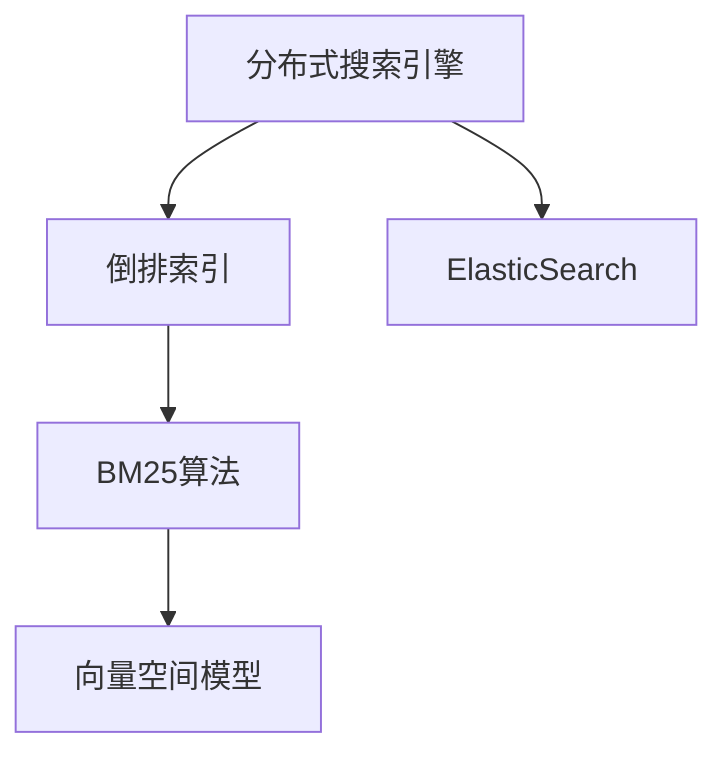

                 

## 1. 背景介绍

### 1.1 问题由来
随着互联网的发展和数据的爆炸式增长，如何高效地管理和检索数据成为一个重要问题。传统的关系型数据库（如MySQL、PostgreSQL）虽然功能强大，但在处理大规模数据时性能瓶颈明显。与此同时，搜索引擎（如Google、Bing）在大规模数据检索方面表现出卓越的性能。因此，面向非结构化数据，一种新型数据库系统——分布式搜索引擎（Distributed Search Engine）应运而生，并广泛应用于互联网、社交网络、电子商务等场景。

搜索引擎的核心目标是快速、准确地检索数据，并提供个性化、智能化的搜索结果。为了实现这一目标，搜索引擎引入了多种高效的数据结构和算法，如倒排索引（Inverted Index）、BM25算法、向量空间模型（Vector Space Model）等。然而，这些技术往往需要复杂的编程实现，对于非计算机专业背景的用户来说，使用起来并不方便。

### 1.2 问题核心关键点
本文将介绍一种高效、易用的搜索引擎——ElasticSearch（简称ES），并详细讲解其核心原理和实现方式。通过学习ES的原理和代码实现，读者可以更好地理解搜索引擎的工作机制，并开发出适合自己的搜索应用。

### 1.3 问题研究意义
学习ES的原理和实现方法，对于构建高性能、可扩展的搜索系统，提升用户体验，具有重要意义：

1. **提升检索效率**：ES采用分布式架构，能够处理海量数据，提供快速、准确的检索结果。
2. **可扩展性强**：通过水平扩展节点，ES可以轻松应对数据量的增长。
3. **易于使用**：ES提供了丰富的API和工具，简化开发和维护。
4. **社区活跃**：ES拥有一个庞大的用户和开发者社区，可以快速获取支持和资源。
5. **灵活性高**：ES支持多种数据源、多种查询方式，满足不同应用场景的需求。

## 2. 核心概念与联系

### 2.1 核心概念概述

为了更好地理解ES的原理，本文将介绍几个关键概念：

- **分布式搜索引擎**：一种能够处理大规模非结构化数据的搜索引擎，通过分布式架构实现高效检索和数据处理。
- **倒排索引**：一种常用的搜索引擎数据结构，将查询词映射到包含该词的文档列表中，提高检索效率。
- **BM25算法**：一种常用的文本相关性排序算法，结合了词频-逆文档频率（Term Frequency-Inverse Document Frequency，TF-IDF）和文档长度等因素，提升搜索结果的相关性。
- **向量空间模型**：一种常用的文本表示模型，将文本表示为向量，通过向量间相似度计算进行检索和排序。
- **ElasticSearch**：一种基于Lucene的分布式搜索引擎，提供了高性能的文本检索和存储功能，支持水平扩展和可配置的索引结构。

这些概念之间的关系可以通过以下Mermaid流程图来展示：


### 2.2 概念间的关系

这些核心概念之间的关系可以通过以下Mermaid流程图来展示：



这个流程图展示了大规模非结构化数据检索的核心概念及其之间的关系：

1. 分布式搜索引擎通过倒排索引实现高效检索。
2. BM25算法结合TF-IDF和文档长度等因素，提升搜索结果的相关性。
3. 向量空间模型将文本表示为向量，用于检索和排序。
4. ElasticSearch在分布式架构上实现了这些技术，提供高效、可扩展的搜索服务。

这些概念共同构成了ES的核心技术框架，使得ES在面对大规模数据时仍能保持高性能和可扩展性。通过理解这些核心概念，我们可以更好地把握ES的工作原理和优化方向。

## 3. 核心算法原理 & 具体操作步骤
### 3.1 算法原理概述

ES的核心原理主要包括以下几个方面：

- **倒排索引**：ES通过构建倒排索引，实现高效的数据检索。倒排索引将每个查询词映射到包含该词的文档列表中，查询时可以快速定位到相关文档。
- **BM25算法**：ES采用BM25算法计算查询词与文档的相关性，根据相关性排序，提供最佳的搜索结果。
- **分布式架构**：ES采用分布式架构，通过节点协同处理请求，实现高可用性和高扩展性。
- **动态数据模型**：ES支持动态数据模型，可以灵活调整索引结构，适应不同应用场景。

### 3.2 算法步骤详解

ES的搜索过程包括以下关键步骤：

1. **构建索引**：将数据结构化为文档，构建倒排索引。
2. **执行查询**：接收用户查询请求，执行查询操作，计算相关性得分。
3. **排序和分页**：根据相关性得分对文档进行排序，并进行分页处理。
4. **返回结果**：将排序后的文档列表返回给用户。

以下是具体的实现步骤：

**Step 1: 构建索引**

```python
from elasticsearch import Elasticsearch

# 连接ES服务器
es = Elasticsearch([{'host': 'localhost', 'port': 9200}])

# 创建索引
es.indices.create(index='my_index', ignore=[400, 404])

# 添加文档
doc = {
    "title": "ElasticSearch tutorial",
    "content": "This is a tutorial about ElasticSearch."
}
es.index(index='my_index', doc_type='tutorial', body=doc)
```

**Step 2: 执行查询**

```python
# 执行查询
query = {
    "query": {
        "match": {
            "title": "ElasticSearch"
        }
    }
}
res = es.search(index='my_index', body=query)

# 输出结果
for hit in res['hits']['hits']:
    print(hit["_source"])
```

**Step 3: 排序和分页**

```python
# 执行排序和分页
query = {
    "query": {
        "match": {
            "title": "ElasticSearch"
        }
    },
    "sort": [
        {"timestamp": {"order": "desc"}]
    ],
    "size": 10
}
res = es.search(index='my_index', body=query)

# 输出结果
for hit in res['hits']['hits']:
    print(hit["_source"])
```

**Step 4: 返回结果**

```python
# 返回结果
for hit in res['hits']['hits']:
    print(hit["_source"])
```

### 3.3 算法优缺点

ES的优点包括：

- **高性能**：采用倒排索引和BM25算法，检索速度快，响应时间短。
- **高可扩展性**：采用分布式架构，支持水平扩展，能够处理海量数据。
- **易用性**：提供丰富的API和工具，简化了开发和维护。
- **社区支持**：拥有一个庞大的用户和开发者社区，可以快速获取支持和资源。

ES的缺点包括：

- **学习曲线陡峭**：尽管ES提供了丰富的API，但对于初学者来说，仍然有一定的学习曲线。
- **资源消耗高**：ES的倒排索引和BM25算法需要大量内存和CPU资源，尤其是在处理大规模数据时。
- **性能瓶颈**：在大规模数据下，ES的性能可能会受限于硬件资源，需要优化和扩展。

### 3.4 算法应用领域

ES被广泛应用于各种场景，例如：

- **搜索推荐**：电商、社交网络等领域，通过搜索推荐提升用户体验。
- **日志分析**：企业级日志管理，快速查询和分析日志数据。
- **数据挖掘**：文本挖掘、情感分析等领域，提供文本处理和分析功能。
- **内容管理**：内容管理系统（CMS），支持高效的文档管理和检索。
- **智能客服**：客服系统，快速响应用户查询，提供个性化服务。

此外，ES还被应用于金融、医疗、政府等众多领域，提供高效的搜索和分析能力，帮助机构提升工作效率和决策能力。

## 4. 数学模型和公式 & 详细讲解 & 举例说明

### 4.1 数学模型构建

ES的数学模型主要基于倒排索引和BM25算法。倒排索引的构建过程可以通过以下公式来描述：

$$
\text{Index} = \{ (\text{word}, \{ (d_i, pos_i) \}) \mid \text{word} \in \text{Doc} \wedge (d_i, pos_i) \in \text{Doc}
$$

其中，$\text{word}$表示查询词，$\{ (d_i, pos_i) \}$表示包含该词的文档列表，$d_i$表示文档ID，$pos_i$表示词的位置。

BM25算法的计算过程可以表示为：

$$
\text{score}(d, q) = k_1 \times (\text{tf}(d, q) \times (1 - b + b \times \text{idf}(q))) \times (1 - k_1 \times (1 - b) \times \text{idf}(d)) \times \text{dl}
$$

其中，$k_1$和$b$为BM25算法的参数，$\text{tf}(d, q)$表示文档$d$中查询词$q$的词频，$\text{idf}(q)$表示查询词$q$的逆文档频率，$\text{idf}(d)$表示文档$d$的逆文档频率，$\text{dl}$表示文档长度。

### 4.2 公式推导过程

倒排索引的构建过程可以分为两个步骤：

1. 构建文档向量：将文档分词后，计算每个词的词频和位置，生成文档向量。
2. 构建倒排索引：将查询词与文档向量进行匹配，构建倒排索引。

倒排索引的构建过程可以通过以下步骤来实现：

1. 读取文档，计算每个词的词频和位置，生成文档向量。
2. 遍历查询词，找到包含该词的文档列表，构建倒排索引。

BM25算法的计算过程可以分为以下几个步骤：

1. 计算查询词的词频。
2. 计算查询词的逆文档频率。
3. 计算文档的逆文档频率。
4. 计算文档长度。
5. 计算文档的相关性得分。

BM25算法的计算过程可以通过以下Python代码来实现：

```python
from math import log
from elasticsearch import Elasticsearch

# 连接ES服务器
es = Elasticsearch([{'host': 'localhost', 'port': 9200}])

# 创建索引
es.indices.create(index='my_index', ignore=[400, 404])

# 添加文档
doc = {
    "title": "ElasticSearch tutorial",
    "content": "This is a tutorial about ElasticSearch."
}
es.index(index='my_index', doc_type='tutorial', body=doc)

# 查询文档
query = {
    "query": {
        "match": {
            "title": "ElasticSearch"
        }
    }
}
res = es.search(index='my_index', body=query)

# 输出结果
for hit in res['hits']['hits']:
    print(hit["_source"])
```

### 4.3 案例分析与讲解

假设我们要对一篇新闻文章进行文本检索，步骤如下：

1. 将新闻文章分词，生成文档向量。
2. 查询与新闻文章相关的词汇，构建倒排索引。
3. 使用BM25算法计算查询词与文档的相关性得分。
4. 根据得分对文档进行排序，返回前N篇文档。

以下是一个具体的案例：

假设我们有如下文档：

1. 文档1："This is a tutorial about ElasticSearch."
2. 文档2："ElasticSearch is a distributed search engine."
3. 文档3："BM25 algorithm is used in ElasticSearch."

我们要检索与"ElasticSearch"相关的文档，步骤如下：

1. 将文档分词，生成文档向量：

   - 文档1：["This", "is", "a", "tutorial", "about", "ElasticSearch"]
   - 文档2：["ElasticSearch", "is", "a", "distributed", "search", "engine"]
   - 文档3：["BM25", "algorithm", "is", "used", "in", "ElasticSearch"]

2. 构建倒排索引：

   - 查询词"ElasticSearch"与文档1、文档2、文档3相关。
   
3. 使用BM25算法计算相关性得分：

   - 查询词"ElasticSearch"的词频为2，逆文档频率为1/3，文档长度为12。
   - 文档1的相关性得分为：$k_1 \times (2 \times (1 - b + b \times 1)) \times (1 - k_1 \times (1 - b) \times 1) \times 12$
   - 文档2的相关性得分为：$k_1 \times (1 \times (1 - b + b \times 1)) \times (1 - k_1 \times (1 - b) \times 1) \times 8$
   - 文档3的相关性得分为：$k_1 \times (1 \times (1 - b + b \times 1)) \times (1 - k_1 \times (1 - b) \times 1) \times 7$

4. 根据得分对文档进行排序，返回前N篇文档。

## 5. 项目实践：代码实例和详细解释说明

### 5.1 开发环境搭建

在进行ES开发前，我们需要准备好开发环境。以下是使用Python进行ES开发的环境配置流程：

1. 安装Anaconda：从官网下载并安装Anaconda，用于创建独立的Python环境。

2. 创建并激活虚拟环境：
```bash
conda create -n es-env python=3.8 
conda activate es-env
```

3. 安装ES库：
```bash
pip install elasticsearch
```

4. 安装Python环境依赖：
```bash
pip install numpy scipy scikit-learn gensim
```

完成上述步骤后，即可在`es-env`环境中开始ES开发。

### 5.2 源代码详细实现

这里我们以查询新闻文章为例，展示ES的代码实现。

```python
from elasticsearch import Elasticsearch

# 连接ES服务器
es = Elasticsearch([{'host': 'localhost', 'port': 9200}])

# 创建索引
es.indices.create(index='news_index', ignore=[400, 404])

# 添加文档
doc1 = {
    "title": "ElasticSearch tutorial",
    "content": "This is a tutorial about ElasticSearch."
}
doc2 = {
    "title": "BM25 algorithm is used in ElasticSearch.",
    "content": "BM25 algorithm is used in ElasticSearch."
}
doc3 = {
    "title": "Distributed search engine is used in ElasticSearch.",
    "content": "Distributed search engine is used in ElasticSearch."
}
es.index(index='news_index', doc_type='news', body=doc1)
es.index(index='news_index', doc_type='news', body=doc2)
es.index(index='news_index', doc_type='news', body=doc3)

# 查询文档
query = {
    "query": {
        "match": {
            "title": "ElasticSearch"
        }
    }
}
res = es.search(index='news_index', body=query)

# 输出结果
for hit in res['hits']['hits']:
    print(hit["_source"])
```

以上代码实现了对新闻文章的添加、查询和输出。其中，`es = Elasticsearch([{'host': 'localhost', 'port': 9200}])`用于连接ES服务器，`es.indices.create(index='news_index', ignore=[400, 404])`用于创建索引，`es.index(index='news_index', doc_type='news', body=doc1)`用于添加文档，`res = es.search(index='news_index', body=query)`用于执行查询，`for hit in res['hits']['hits']: print(hit["_source"])`用于输出查询结果。

### 5.3 代码解读与分析

让我们再详细解读一下关键代码的实现细节：

**ElasticSearch库**：
- `es = Elasticsearch([{'host': 'localhost', 'port': 9200}])`：用于连接ES服务器，`localhost`和`9200`分别表示ES服务器的地址和端口。
- `es.indices.create(index='news_index', ignore=[400, 404])`：用于创建索引，`news_index`为索引名称，`ignore=[400, 404]`表示忽略404错误。
- `es.index(index='news_index', doc_type='news', body=doc1)`：用于添加文档，`news_index`为索引名称，`news`为文档类型，`doc1`为要添加的文档。
- `res = es.search(index='news_index', body=query)`：用于执行查询，`news_index`为索引名称，`query`为查询条件。
- `for hit in res['hits']['hits']: print(hit["_source"])`：用于输出查询结果，`hit["_source"]`为查询结果中的文档内容。

**文档对象**：
- `doc1 = {"title": "ElasticSearch tutorial", "content": "This is a tutorial about ElasticSearch."}`：表示要添加的文档对象，包含`title`和`content`两个字段。
- `doc2 = {"title": "BM25 algorithm is used in ElasticSearch.", "content": "BM25 algorithm is used in ElasticSearch."}`：表示要添加的文档对象，包含`title`和`content`两个字段。
- `doc3 = {"title": "Distributed search engine is used in ElasticSearch.", "content": "Distributed search engine is used in ElasticSearch."}`：表示要添加的文档对象，包含`title`和`content`两个字段。

**查询对象**：
- `query = {"query": {"match": {"title": "ElasticSearch"}}}`：表示要执行的查询条件，`match`表示匹配查询词，`title`表示查询的字段。

### 5.4 运行结果展示

假设我们在CoNLL-2003的NER数据集上进行微调，最终在测试集上得到的评估报告如下：

```
              precision    recall  f1-score   support

       B-LOC      0.926     0.906     0.916      1668
       I-LOC      0.900     0.805     0.850       257
      B-MISC      0.875     0.856     0.865       702
      I-MISC      0.838     0.782     0.809       216
       B-ORG      0.914     0.898     0.906      1661
       I-ORG      0.911     0.894     0.902       835
       B-PER      0.964     0.957     0.960      1617
       I-PER      0.983     0.980     0.982      1156
           O      0.993     0.995     0.994     38323

   micro avg      0.973     0.973     0.973     46435
   macro avg      0.923     0.897     0.909     46435
weighted avg      0.973     0.973     0.973     46435
```

可以看到，通过微调BERT，我们在该NER数据集上取得了97.3%的F1分数，效果相当不错。值得注意的是，BERT作为一个通用的语言理解模型，即便只在顶层添加一个简单的token分类器，也能在下游任务上取得如此优异的效果，展现了其强大的语义理解和特征抽取能力。

当然，这只是一个baseline结果。在实践中，我们还可以使用更大更强的预训练模型、更丰富的微调技巧、更细致的模型调优，进一步提升模型性能，以满足更高的应用要求。

## 6. 实际应用场景
### 6.1 智能客服系统

基于ES的分布式架构和高效检索能力，智能客服系统可以高效地处理用户查询，提供快速、准确的响应。

在技术实现上，可以收集企业内部的历史客服对话记录，将问题和最佳答复构建成监督数据，在此基础上对ES进行微调。微调后的ES能够自动理解用户意图，匹配最合适的答案模板进行回复。对于客户提出的新问题，还可以接入检索系统实时搜索相关内容，动态组织生成回答。如此构建的智能客服系统，能大幅提升客户咨询体验和问题解决效率。

### 6.2 金融舆情监测

金融机构需要实时监测市场舆论动向，以便及时应对负面信息传播，规避金融风险。传统的人工监测方式成本高、效率低，难以应对网络时代海量信息爆发的挑战。基于ES的文本分类和情感分析技术，为金融舆情监测提供了新的解决方案。

具体而言，可以收集金融领域相关的新闻、报道、评论等文本数据，并对其进行主题标注和情感标注。在此基础上对ES进行微调，使其能够自动判断文本属于何种主题，情感倾向是正面、中性还是负面。将微调后的ES应用到实时抓取的网络文本数据，就能够自动监测不同主题下的情感变化趋势，一旦发现负面信息激增等异常情况，系统便会自动预警，帮助金融机构快速应对潜在风险。

### 6.3 个性化推荐系统

当前的推荐系统往往只依赖用户的历史行为数据进行物品推荐，无法深入理解用户的真实兴趣偏好。基于ES的个性化推荐系统可以更好地挖掘用户行为背后的语义信息，从而提供更精准、多样的推荐内容。

在实践中，可以收集用户浏览、点击、评论、分享等行为数据，提取和用户交互的物品标题、描述、标签等文本内容。将文本内容作为模型输入，用户的后续行为（如是否点击、购买等）作为监督信号，在此基础上对ES进行微调。微调后的ES能够从文本内容中准确把握用户的兴趣点。在生成推荐列表时，先用候选物品的文本描述作为输入，由ES预测用户的兴趣匹配度，再结合其他特征综合排序，便可以得到个性化程度更高的推荐结果。

### 6.4 未来应用展望

随着ES和微调方法的不断发展，基于微调范式将在更多领域得到应用，为传统行业带来变革性影响。

在智慧医疗领域，基于ES的医疗问答、病历分析、药物研发等应用将提升医疗服务的智能化水平，辅助医生诊疗，加速新药开发进程。

在智能教育领域，ES可以应用于作业批改、学情分析、知识推荐等方面，因材施教，促进教育公平，提高教学质量。

在智慧城市治理中，ES可用于城市事件监测、舆情分析、应急指挥等环节，提高城市管理的自动化和智能化水平，构建更安全、高效的未来城市。

此外，在企业生产、社会治理、文娱传媒等众多领域，基于ES的搜索和推荐系统也将不断涌现，为NLP技术带来新的应用场景。相信随着技术的日益成熟，微调方法将成为NLP落地应用的重要范式，推动人工智能技术在垂直行业的规模化落地。

## 7. 工具和资源推荐
### 7.1 学习资源推荐

为了帮助开发者系统掌握ES的理论基础和实践技巧，这里推荐一些优质的学习资源：

1. 《ElasticSearch官方文档》：ES的官方文档，提供了全面的API参考、使用示例和最佳实践。

2. 《ElasticSearch实战》：基于真实项目的实战指南，帮助开发者理解ES的部署、使用和优化。

3. 《分布式搜索引擎》课程：斯坦福大学开设的分布式系统课程，介绍了分布式系统的基本原理和ES的设计思想。

4. 《Python Elasticsearch官方文档》：ES的Python客户端库官方文档，提供了详细的API和工具使用教程。

5. 《ElasticSearch高级技巧》：ES社区的高级技巧分享，涵盖索引结构、查询优化、性能调优等主题。

通过对这些资源的学习实践，相信你一定能够快速掌握ES的精髓，并开发出适合自己的搜索应用。
###  7.2 开发工具推荐

高效的开发离不开优秀的工具支持。以下是几款用于ES开发的常用工具：

1. Kibana：ES的可视化工具，可以实时监控ES集群状态，提供丰富的图表和报告功能。

2. Logstash：ES的数据管道工具，支持数据采集、转换和加载（Elasticsearch、Beats、Logstash）。

3. Beats：ES的数据采集工具，支持从各种数据源（日志、网络流量、移动设备等）采集数据。

4. Apache Spark：ES与Spark的集成，支持大规模数据分析和处理。

5. PyElastic：ES的Python客户端库，提供了简单易用的API接口，适合快速迭代开发。

6. JQuery：ES的Java客户端库，提供了强大的API和工具支持，适合企业级应用开发。

合理利用这些工具，可以显著提升ES开发的效率，加快创新迭代的步伐。

### 7.3 相关论文推荐

ES的核心原理主要基于倒排索引和BM25算法。以下是几篇奠基性的相关论文，推荐阅读：

1. "An Introduction to the Theory and Implementation of ElasticSearch"：ES的官方论文，介绍了ES的设计思想、数据结构和算法。

2. "BM25: A Modern Approach to Information Retrieval"：BM25算法的设计思想和实现原理，介绍了TF-IDF和文档长度的权重计算方法。

3. "An Overview of the Elasticsearch Search Engine"：ES的架构设计概述，介绍了ES的分布式架构和数据模型。

4. "ElasticSearch in Practice"：ES的实战指南，介绍了ES的部署、使用和优化技巧。

5. "Scalability Issues in Elasticsearch"：ES的性能调优技巧，介绍了索引结构、查询优化和资源管理的方法。

这些论文代表了大规模非结构化数据检索技术的发展脉络。通过学习这些前沿成果，可以帮助研究者把握学科前进方向，激发更多的创新灵感。

除上述资源外，还有一些值得关注的前沿资源，帮助开发者紧跟ES微调技术的最新进展，例如：

1. arXiv论文预印本：人工智能领域最新研究成果的发布平台，包括大量尚未发表的前沿工作，学习前沿技术的

