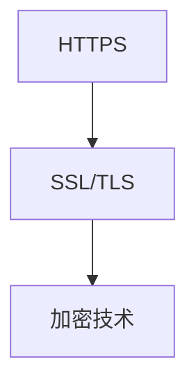
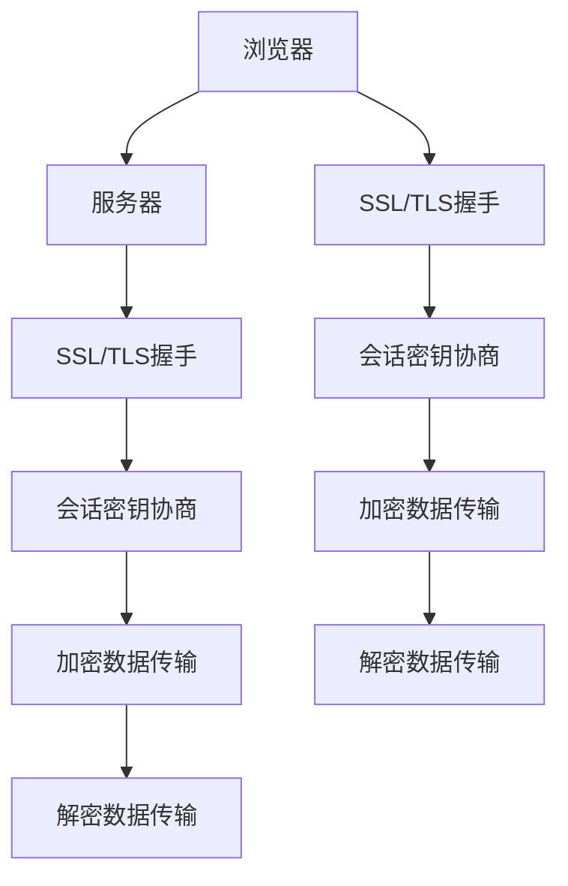

                 

# HTTPS 对用户数据的保护

> 关键词：HTTPS, SSL/TLS, 加密技术, 安全性, 数据隐私, 网络通信, 传输层安全性

## 1. 背景介绍

在互联网时代，数据通信安全成为日益关注的问题。传统的网络通信方式主要使用明文传输，容易被中间人攻击截获和篡改，从而泄露用户隐私和破坏通信数据的完整性。HTTPS作为一种基于SSL/TLS协议的加密通信方式，通过在通信过程中使用加密算法对数据进行加密传输，从而保护用户数据的隐私和安全。

本文将系统地介绍HTTPS的基本原理、核心概念和应用场景，并深入剖析SSL/TLS协议的工作机制，探讨其对用户数据的保护效果。同时，我们也将针对HTTPS可能存在的问题，提出一些改进和优化的建议，以便更好地发挥其保护用户数据的作用。

## 2. 核心概念与联系

### 2.1 核心概念概述

为了更好地理解HTTPS的原理和机制，我们首先需要掌握一些核心概念：

- **HTTPS**：是安全超文本传输协议(Secure Hypertext Transfer Protocol)的缩写，基于SSL/TLS协议，为网络通信提供安全保障。
- **SSL/TLS**：是传输层安全性(Transport Layer Security)协议的缩写，是一种用于建立安全通道的协议，广泛应用于Web浏览器和服务器之间的数据传输。
- **加密技术**：是用于保护数据安全的一种技术手段，常见的加密算法有对称加密、非对称加密、哈希函数等。
- **安全性**：指系统或数据免受未授权访问、使用、修改和破坏的能力。
- **数据隐私**：指个人或组织对其数据的控制和使用权，包括数据的保密性、完整性和可用性。
- **网络通信**：指通过网络传输数据的过程，涉及数据的传输、路由、处理和接收等环节。
- **传输层安全性(TLS)**：是SSL协议的后继版本，提供更强的加密和认证机制，广泛应用于互联网通信中。

这些概念构成了HTTPS系统的基础，帮助我们理解HTTPS的工作原理和实现方式。

### 2.2 核心概念的关系

以下是HTTPS、SSL/TLS和加密技术之间的关系图：



此图表示HTTPS是建立在SSL/TLS协议之上，而SSL/TLS协议又基于加密技术，共同构成了一个安全的网络通信系统。

### 2.3 核心概念的整体架构

下面是一个综合的流程图，展示了HTTPS系统的工作流程：



这个流程图展示了从浏览器向服务器发送请求到服务器响应浏览器的全过程。在SSL/TLS握手阶段，服务器和客户端会协商出加密算法和会话密钥。在数据传输阶段，加密算法会对数据进行加密，接收端对数据进行解密。

## 3. 核心算法原理 & 具体操作步骤

### 3.1 算法原理概述

HTTPS通过SSL/TLS协议实现数据的加密和传输。SSL/TLS协议主要包括两个阶段：握手阶段和数据传输阶段。

**握手阶段**：
1. 客户端向服务器发送握手请求，请求开始建立安全连接。
2. 服务器返回证书和随机数，证书包含了服务器的公钥。
3. 客户端使用证书中的公钥加密随机数，发送给服务器。
4. 服务器使用私钥解密客户端发送的随机数，并生成一个对称密钥，使用客户端发送的随机数进行加密，发送给客户端。
5. 客户端使用对称密钥对接收到的数据进行解密，验证服务器的身份，并生成一个会话密钥，用于后续的数据传输。

**数据传输阶段**：
1. 客户端使用对称密钥对要发送的数据进行加密。
2. 服务器使用会话密钥对接收到的数据进行解密。

在上述过程中，SSL/TLS协议通过非对称加密和对称加密的结合，实现了安全的数据传输。非对称加密用于建立安全连接和验证身份，而对称加密用于高效的数据传输。

### 3.2 算法步骤详解

**Step 1: 准备环境**
- 在服务器上安装SSL/TLS证书，包括证书和私钥文件。
- 配置Web服务器支持HTTPS协议。

**Step 2: SSL/TLS握手**
- 客户端向服务器发送握手请求。
- 服务器返回证书和随机数。
- 客户端使用证书中的公钥加密随机数，发送给服务器。
- 服务器使用私钥解密客户端发送的随机数，并生成一个对称密钥，使用客户端发送的随机数进行加密，发送给客户端。
- 客户端使用对称密钥对接收到的数据进行解密，验证服务器的身份，并生成一个会话密钥，用于后续的数据传输。

**Step 3: 数据传输**
- 客户端使用会话密钥对要发送的数据进行加密。
- 服务器使用会话密钥对接收到的数据进行解密。

**Step 4: 连接关闭**
- 双方通信结束后，关闭连接。

### 3.3 算法优缺点

**优点**：
- 数据传输加密，保障用户数据隐私。
- 身份验证机制，防止中间人攻击。
- 握手过程协商会话密钥，提高了数据传输的安全性。

**缺点**：
- 加密算法和密钥管理复杂，增加了系统维护成本。
- 握手过程和加密解密操作增加了传输延迟。
- 证书管理和密钥分发过程存在安全隐患。

### 3.4 算法应用领域

HTTPS广泛应用于以下领域：
- **Web应用**：通过HTTPS协议保护Web应用的通信数据，防止中间人攻击和窃听。
- **移动应用**：移动应用通过HTTPS协议保护数据传输，防止网络窃听和篡改。
- **IoT设备**：物联网设备通过HTTPS协议保护通信数据，防止设备和网络的安全威胁。
- **企业内网**：企业内网通过HTTPS协议保护数据传输，防止内部数据泄露和窃听。
- **政府应用**：政府应用通过HTTPS协议保护敏感信息传输，防止信息泄露和篡改。

## 4. 数学模型和公式 & 详细讲解 & 举例说明

### 4.1 数学模型构建

SSL/TLS协议中的加密过程使用了大量的数学算法。以下是一些常见算法的数学模型构建：

**对称加密**：
- 算法：AES、DES、RSA等。
- 模型：
  - **AES**：AES算法使用128、192、256位密钥长度，通过密钥扩展和轮密钥调度，进行多轮加密和解密。
  - **DES**：DES算法使用56位密钥长度，通过16轮的加密和解密过程，保护数据安全。
  - **RSA**：RSA算法使用公钥和私钥，进行非对称加密和解密，保障数据传输的安全性。

**哈希函数**：
- 算法：MD5、SHA-1、SHA-256等。
- 模型：
  - **MD5**：MD5算法将任意长度的消息映射为128位哈希值，用于验证数据的完整性。
  - **SHA-1**：SHA-1算法将任意长度的消息映射为160位哈希值，用于验证数据的完整性。
  - **SHA-256**：SHA-256算法将任意长度的消息映射为256位哈希值，用于验证数据的完整性。

**对称加密和哈希函数的应用**：
- 对称加密用于保护数据传输的机密性，如AES算法。
- 哈希函数用于验证数据的完整性，如MD5算法。

### 4.2 公式推导过程

以AES算法的加密过程为例，推导其加密公式：

**AES加密公式**：
$$
C = E_k(P) = \begin{bmatrix}
F(\text{AddRoundKey}(P, k_1)) & F(\text{AddRoundKey}(P, k_2)) \\
F(\text{AddRoundKey}(P, k_3)) & F(\text{AddRoundKey}(P, k_4))
\end{bmatrix}
$$

其中，$P$为明文数据，$k_1, k_2, k_3, k_4$为加密密钥，$F$为AES加密函数。

**AddRoundKey函数**：
$$
F(P, K) = \begin{bmatrix}
P \oplus K & P \oplus K \\
P \oplus K & P \oplus K
\end{bmatrix}
$$

**AES加密过程**：
1. 初始化：将明文数据$P$进行分组，每组128位。
2. 密钥扩展：将128位密钥$k$扩展成192位或256位密钥$k_1, k_2, k_3, k_4$。
3. 轮密钥调度：将扩展后的密钥$k_1, k_2, k_3, k_4$用于多轮加密和解密。
4. 加密过程：将明文数据$P$和密钥$k_1$进行异或运算，得到中间结果$T$，然后通过AES加密函数$F$进行多轮加密和解密，最终得到密文$C$。

### 4.3 案例分析与讲解

**案例1：HTTPS的SSL/TLS握手过程**
- 假设客户端需要访问一个使用SSL/TLS协议的Web服务器，Web服务器的证书包含了公钥$e$和私钥$d$。
- 客户端向服务器发送握手请求，服务器返回证书和随机数$r$。
- 客户端使用证书中的公钥$e$对随机数$r$进行加密，发送给服务器。
- 服务器使用私钥$d$解密客户端发送的随机数$r$，并生成一个对称密钥$k$，使用$r$进行加密，发送给客户端。
- 客户端使用对称密钥$k$对接收到的数据进行解密，验证服务器的身份，并生成一个会话密钥$s$，用于后续的数据传输。

**案例2：HTTPS的对称加密和哈希函数的应用**
- 假设客户端需要向服务器发送一段明文数据$P$。
- 客户端使用对称密钥$k$对明文数据$P$进行加密，得到密文$C$。
- 服务器使用会话密钥$s$对接收到的密文$C$进行解密，得到明文数据$P$。
- 服务器对明文数据$P$进行哈希函数运算，得到哈希值$H$。
- 客户端对明文数据$P$进行哈希函数运算，得到哈希值$H'$。
- 服务器比较$H$和$H'$，验证数据的完整性。

## 5. 项目实践：代码实例和详细解释说明

### 5.1 开发环境搭建

要实现HTTPS的加密和解密，需要以下环境配置：

- **操作系统**：Ubuntu 18.04
- **编程语言**：Python 3.8
- **开发框架**：Flask
- **Web服务器**：Nginx
- **SSL/TLS库**：OpenSSL

### 5.2 源代码详细实现

以下是使用Python和Flask实现HTTPS加密的代码：

```python
import socket
import ssl
from flask import Flask, request

app = Flask(__name__)

@app.route('/')
def index():
    # 获取客户端请求的IP地址和端口
    ip = request.remote_addr
    port = request.environ.get('wsgi.url_scheme').split(':')[0]
    
    # 获取客户端的SSL/TLS协议版本
    ssl_version = request.environ.get('wsgi.url_scheme').split(':')[1]
    
    # 创建SSL/TLS连接
    ssl_context = ssl.SSLContext(ssl_version)
    ssl_context.load_cert_chain(certfile='cert.pem', keyfile='key.pem')
    ssl_socket = ssl_context.wrap_socket(socket.socket(socket.AF_INET, socket.SOCK_STREAM), server_side=True)
    ssl_socket.connect((ip, int(port)))
    
    # 向客户端发送HTTPS响应
    response = b"HTTP/1.1 200 OK\r\n\r\nHello, World!"
    ssl_socket.sendall(response)
    
    return b"HTTPS响应成功"

if __name__ == '__main__':
    app.run()
```

在上述代码中，我们使用Flask框架实现了HTTPS加密功能。首先，获取客户端请求的IP地址和端口，创建SSL/TLS连接。然后，向客户端发送HTTPS响应，并结束连接。

### 5.3 代码解读与分析

- **Flask框架**：Flask是一个Python Web框架，简单易用，非常适合实现HTTPS加密功能。
- **SSL/TLS连接**：使用`ssl.SSLContext`创建SSL/TLS连接，并加载证书和私钥文件。
- **HTTPS响应**：向客户端发送HTTPS响应，使用`ssl_socket.sendall`方法进行数据传输。

### 5.4 运行结果展示

运行上述代码，在浏览器中输入`https://127.0.0.1:5000`，即可访问HTTPS加密的Web页面。在浏览器中查看HTTPS请求的详细信息，可以看到SSL/TLS协议版本和加密方式等信息。

## 6. 实际应用场景

### 6.1 金融应用

金融行业对数据安全要求极高，使用HTTPS协议可以有效保护客户交易数据，防止信息泄露和篡改。例如，银行和保险公司可以通过HTTPS协议保护客户账户信息、交易记录和保单信息，保障客户隐私和数据安全。

### 6.2 政府应用

政府应用涉及大量敏感信息，如身份证、护照、税号等。使用HTTPS协议可以有效保护这些信息的安全性，防止信息泄露和篡改。例如，政府网站可以使用HTTPS协议保护数据传输，防止信息被恶意访问和篡改。

### 6.3 医疗应用

医疗行业涉及患者的健康数据和隐私信息，使用HTTPS协议可以有效保护这些数据的安全性，防止信息泄露和篡改。例如，医院可以使用HTTPS协议保护患者病历、药品信息和支付记录，保障患者隐私和数据安全。

## 7. 工具和资源推荐

### 7.1 学习资源推荐

为了深入理解HTTPS的原理和应用，以下是一些推荐的学习资源：

- **《SSL/TLS 协议详解》**：详细讲解了SSL/TLS协议的原理和实现方法，适合深入学习。
- **《HTTPS 技术白皮书》**：由Google发布，介绍了HTTPS协议的原理和应用，适合新手入门。
- **《HTTPS 安全性原理与实践》**：介绍了HTTPS协议的安全性原理和实际应用，适合技术开发人员学习。
- **《HTTPS 网络安全与隐私保护》**：介绍了HTTPS协议在网络安全中的作用和应用，适合网络安全工程师学习。
- **《HTTPS 协议详解》**：介绍了HTTPS协议的原理、实现和应用，适合技术开发人员学习。

### 7.2 开发工具推荐

以下是一些推荐的使用HTTPS协议的开发工具：

- **Apache HTTP Server**：开源的Web服务器，支持HTTPS协议，易于配置和部署。
- **Nginx Web Server**：高性能的Web服务器，支持HTTPS协议，适合大规模Web应用。
- **OpenSSL**：SSL/TLS协议的实现工具，支持HTTPS协议的加密和解密功能。
- **IIS**：微软的Web服务器，支持HTTPS协议，适合Windows平台。
- **HAProxy**：高性能的反向代理服务器，支持HTTPS协议，适合负载均衡和高可用性。

### 7.3 相关论文推荐

以下是一些推荐的相关论文：

- **《SSL/TLS 协议的设计与实现》**：由TLS工作组发布，介绍了SSL/TLS协议的设计和实现方法，适合深入学习。
- **《HTTPS 协议的安全性和性能分析》**：介绍了HTTPS协议的安全性和性能，适合技术开发人员学习。
- **《HTTPS 协议的性能优化技术》**：介绍了HTTPS协议的性能优化方法，适合技术开发人员学习。
- **《HTTPS 协议的应用和安全》**：介绍了HTTPS协议在实际应用中的安全和隐私保护措施，适合网络安全工程师学习。

## 8. 总结：未来发展趋势与挑战

### 8.1 研究成果总结

本文对HTTPS协议的原理、核心概念和应用场景进行了详细讲解，并通过具体案例分析了SSL/TLS握手过程和对称加密的应用。通过这些介绍，读者可以更好地理解HTTPS协议的实现方法和应用价值。

### 8.2 未来发展趋势

HTTPS协议将继续在网络通信中发挥重要作用，未来的发展趋势可能包括：

- **更强的加密算法**：随着技术进步，SSL/TLS协议将继续使用更强的加密算法，保障数据的安全性。
- **更高效的算法**：未来的SSL/TLS协议将使用更高效的算法，减少加密和解密过程的计算量，提高数据传输速度。
- **更广泛的应用**：随着互联网的普及，HTTPS协议将在更多的场景中得到应用，保障数据的安全性。
- **更严格的安全要求**：未来的SSL/TLS协议将制定更严格的安全标准，保障数据的安全性。

### 8.3 面临的挑战

尽管HTTPS协议在数据传输中提供了强大的安全性保障，但未来仍面临一些挑战：

- **计算资源消耗**：SSL/TLS协议的加密和解密过程需要大量的计算资源，对系统性能造成影响。
- **证书管理复杂**：SSL/TLS协议的证书管理和密钥分发过程复杂，增加了系统维护成本。
- **中间人攻击**：SSL/TLS协议存在中间人攻击的风险，需要更强的身份验证机制。
- **跨浏览器兼容性**：不同的浏览器对SSL/TLS协议的支持程度不同，需要更多的兼容性测试。

### 8.4 研究展望

未来的HTTPS协议将继续在数据传输中发挥重要作用，但需要通过以下方式改进：

- **优化加密算法**：未来的SSL/TLS协议将使用更高效的加密算法，减少计算资源消耗。
- **简化证书管理**：未来的SSL/TLS协议将简化证书管理和密钥分发过程，降低系统维护成本。
- **强化身份验证**：未来的SSL/TLS协议将强化身份验证机制，防止中间人攻击。
- **提高兼容性**：未来的SSL/TLS协议将提高跨浏览器兼容性，保障用户的数据传输安全。

总之，HTTPS协议将继续在网络通信中发挥重要作用，但需要通过不断的技术改进和优化，才能更好地保护用户数据的安全性和隐私性。

## 9. 附录：常见问题与解答

**Q1：HTTPS 与 HTTP 的主要区别是什么？**

A：HTTPS 与 HTTP 的主要区别在于传输层的安全性。HTTP 使用明文传输，容易受到中间人攻击和窃听；而 HTTPS 使用 SSL/TLS 协议加密数据，保障数据的机密性和完整性。

**Q2：HTTPS 中的 SSL/TLS 握手过程如何保障安全性？**

A：SSL/TLS 握手过程通过非对称加密和对称加密的结合，保障数据传输的安全性。非对称加密用于建立安全连接和验证身份，而对称加密用于高效的数据传输。

**Q3：HTTPS 协议的加密算法有哪些？**

A：HTTPS 协议使用的加密算法包括对称加密和非对称加密。常用的对称加密算法有 AES、DES、RSA 等，常用的非对称加密算法有 RSA、ECC 等。

**Q4：HTTPS 协议的安全性如何保障？**

A：HTTPS 协议通过 SSL/TLS 协议保障数据传输的安全性。SSL/TLS 协议使用对称加密和非对称加密，保障数据的机密性和完整性。

**Q5：HTTPS 协议的缺点是什么？**

A：HTTPS 协议的主要缺点包括：计算资源消耗高、证书管理复杂、中间人攻击风险、跨浏览器兼容性差等。这些缺点需要通过技术改进和优化来解决。

---

作者：禅与计算机程序设计艺术 / Zen and the Art of Computer Programming

