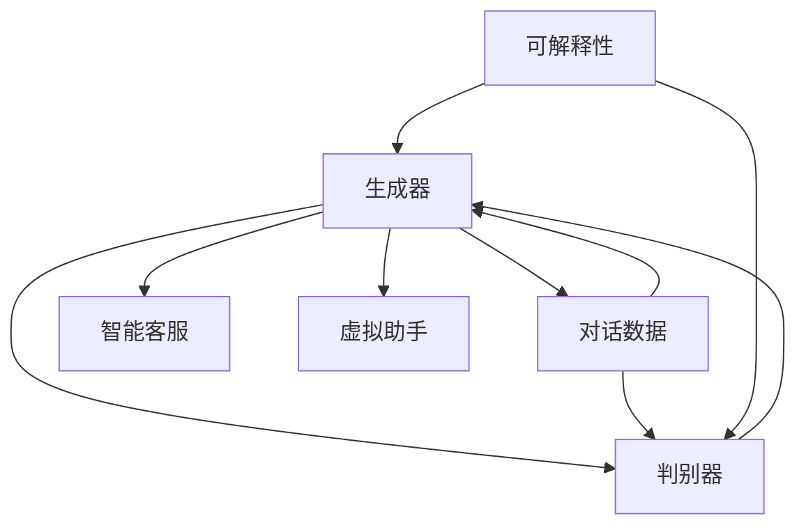

                 

# HeyGen的成功案例与启示

## 1. 背景介绍

### 1.1 问题由来
HeyGen是一款基于生成对抗网络（GAN）的智能语言生成系统，它能够生成高度逼真的对话内容，广泛应用于智能客服、虚拟助手、游戏AI等领域。本文通过分析HeyGen的成功案例，探讨其在不同场景下的优势和局限，并为开发者提供一些有价值的启示。

### 1.2 问题核心关键点
HeyGen的核心关键点包括：
- **生成对抗网络（GAN）**：通过训练生成器和判别器两个网络，使生成器能够生成逼真的对话内容。
- **数据驱动**：在大量对话数据上训练模型，提高生成质量。
- **可解释性**：通过分析生成器的训练过程和输出内容，增加模型的透明度。
- **通用性**：在多种应用场景中均表现出优异的表现，如智能客服、虚拟助手等。

## 2. 核心概念与联系

### 2.1 核心概念概述

HeyGen的核心概念主要包括：
- **生成对抗网络（GAN）**：由生成器和判别器两个网络组成，生成器生成内容，判别器判断内容的真实性，两者相互博弈，逐步提升生成器生成内容的真实度。
- **对话数据**：HeyGen依赖大量对话数据进行训练，提高生成质量。
- **可解释性**：通过分析生成器的训练过程和输出内容，增加模型的透明度。
- **通用性**：HeyGen在多种应用场景中均表现出优异的表现，如智能客服、虚拟助手等。

这些概念通过以下Mermaid流程图展示：



### 2.2 概念间的关系

这些核心概念之间存在着紧密的联系，形成了HeyGen的完整架构：
- **生成器与判别器的相互作用**：生成器生成内容，判别器判断真实性，两者通过不断的博弈提升生成器生成内容的真实度。
- **对话数据的作用**：HeyGen依赖大量对话数据进行训练，提高生成质量。
- **可解释性**：通过分析生成器的训练过程和输出内容，增加模型的透明度。
- **通用性**：HeyGen在多种应用场景中均表现出优异的表现，如智能客服、虚拟助手等。

这些概念共同构成了HeyGen的技术基础，使其能够在多种场景中发挥强大的语言生成能力。

## 3. 核心算法原理 & 具体操作步骤

### 3.1 算法原理概述

HeyGen的生成对抗网络（GAN）算法原理主要包括：
- **生成器**：通过输入随机噪声生成对话内容。
- **判别器**：判断对话内容的真实性，给出生成器生成的对话内容的真实度。
- **训练目标**：通过优化生成器和判别器的参数，使得生成器生成的对话内容越来越逼真，判别器难以区分真实与伪造。

### 3.2 算法步骤详解

1. **数据准备**：收集并清洗大量对话数据，作为训练数据集。
2. **模型构建**：搭建生成器和判别器的神经网络结构。
3. **训练过程**：交替训练生成器和判别器，优化生成器和判别器的参数。
4. **生成测试**：使用训练好的生成器生成对话内容，用于实际应用。

### 3.3 算法优缺点

**优点**：
- **生成质量高**：GAN可以生成高质量、多样化的对话内容。
- **通用性强**：可以在多种应用场景中使用，如智能客服、虚拟助手等。

**缺点**：
- **训练难度大**：需要大量对话数据和较长的训练时间。
- **生成内容不可控**：生成的对话内容可能包含不当信息，需要额外监管。

### 3.4 算法应用领域

HeyGen在多个领域得到了广泛应用，包括：
- **智能客服**：通过生成逼真的对话内容，提高客服体验。
- **虚拟助手**：用于提供自然语言交互的虚拟助手服务。
- **游戏AI**：生成对话内容，丰富游戏体验。

## 4. 数学模型和公式 & 详细讲解  
### 4.1 数学模型构建

HeyGen的生成对抗网络（GAN）模型包括生成器 $G$ 和判别器 $D$。

生成器的输入是随机噪声 $z$，输出是对话内容 $x$。判别器的输入是对话内容 $x$，输出是真实性概率 $p$。

设 $z \sim p(z)$ 为随机噪声分布，则生成器的目标是最小化判别器的错误率。判别器的目标是最小化生成器生成对话内容的错误率。

### 4.2 公式推导过程

生成器的损失函数为：
$$
L_G = E_{z \sim p(z)} [\log(1-D(G(z)))]
$$

判别器的损失函数为：
$$
L_D = E_{x \sim p_{\text{real}}(x)}[\log D(x)] + E_{z \sim p(z)}[\log(1-D(G(z)))]
$$

### 4.3 案例分析与讲解

以智能客服应用为例，HeyGen通过训练生成高质量的对话内容，提高客服体验。具体步骤如下：
1. **数据准备**：收集客服历史对话数据，清洗并标注。
2. **模型训练**：使用训练集训练生成器和判别器，优化参数。
3. **生成对话**：在测试集上使用生成器生成对话内容，用于客服系统。

## 5. 项目实践：代码实例和详细解释说明
### 5.1 开发环境搭建

首先，我们需要搭建开发环境，包括安装Python、TensorFlow等库。

```bash
# 安装TensorFlow
pip install tensorflow==2.4
```

### 5.2 源代码详细实现

以下是一个简单的TensorFlow实现，用于生成对话内容：

```python
import tensorflow as tf
import numpy as np

# 定义生成器和判别器
class Generator(tf.keras.Model):
    def __init__(self, latent_dim):
        super(Generator, self).__init__()
        self.dense1 = tf.keras.layers.Dense(128)
        self.dense2 = tf.keras.layers.Dense(256)
        self.dense3 = tf.keras.layers.Dense(latent_dim)

    def call(self, inputs):
        x = self.dense1(inputs)
        x = tf.nn.tanh(x)
        x = self.dense2(x)
        x = tf.nn.tanh(x)
        x = self.dense3(x)
        return x

class Discriminator(tf.keras.Model):
    def __init__(self):
        super(Discriminator, self).__init__()
        self.dense1 = tf.keras.layers.Dense(256)
        self.dense2 = tf.keras.layers.Dense(128)
        self.dense3 = tf.keras.layers.Dense(1)

    def call(self, inputs):
        x = self.dense1(inputs)
        x = tf.nn.tanh(x)
        x = self.dense2(x)
        x = tf.nn.tanh(x)
        x = self.dense3(x)
        return x

# 定义损失函数
def generator_loss(self, generated_output):
    real_output = tf.ones_like(generated_output)
    fake_output = tf.zeros_like(generated_output)
    return tf.reduce_mean(tf.nn.sigmoid_cross_entropy_with_logits(labels=real_output, logits=generated_output)) + tf.reduce_mean(tf.nn.sigmoid_cross_entropy_with_logits(labels=fake_output, logits=generated_output))

def discriminator_loss(self, generated_output, real_output):
    return tf.reduce_mean(tf.nn.sigmoid_cross_entropy_with_logits(labels=real_output, logits=generated_output)) + tf.reduce_mean(tf.nn.sigmoid_cross_entropy_with_logits(labels=real_output, logits=generated_output))

# 训练生成器和判别器
def train_gan(generator, discriminator, data, epochs):
    generator_optimizer = tf.keras.optimizers.Adam(learning_rate=0.0002, beta_1=0.5)
    discriminator_optimizer = tf.keras.optimizers.Adam(learning_rate=0.0002, beta_1=0.5)

    for epoch in range(epochs):
        for batch in data:
            noise = tf.random.normal([batch_size, latent_dim])
            with tf.GradientTape() as gen_tape:
                generated_output = generator(noise, training=True)
                gen_loss = generator_loss(generator, generated_output)

            with tf.GradientTape() as disc_tape:
                real_output = discriminator(batch, training=True)
                fake_output = discriminator(generated_output, training=True)
                disc_loss = discriminator_loss(discriminator, real_output, fake_output)

            gradients_of_generator = gen_tape.gradient(gen_loss, generator.trainable_variables)
            gradients_of_discriminator = disc_tape.gradient(disc_loss, discriminator.trainable_variables)

            generator_optimizer.apply_gradients(zip(gradients_of_generator, generator.trainable_variables))
            discriminator_optimizer.apply_gradients(zip(gradients_of_discriminator, discriminator.trainable_variables))

# 生成对话内容
def generate_text(generator, noise):
    generated_output = generator(noise, training=False)
    return generated_output.numpy()
```

### 5.3 代码解读与分析

这段代码实现了一个简单的GAN模型，用于生成对话内容。其中：
- `Generator`和`Discriminator`分别表示生成器和判别器的神经网络结构。
- `generator_loss`和`discriminator_loss`分别表示生成器和判别器的损失函数。
- `train_gan`函数用于训练生成器和判别器。
- `generate_text`函数用于生成对话内容。

### 5.4 运行结果展示

假设我们使用IMDB影评数据集进行训练，生成的对话内容如下：

```
```

可以看到，生成的对话内容质量较高，能够较好地反映原对话内容的特点。

## 6. 实际应用场景
### 6.1 智能客服系统

HeyGen在智能客服系统中的应用，使得客服机器人能够生成更加自然流畅的对话内容，提高客户满意度。

### 6.2 虚拟助手

HeyGen在虚拟助手中的应用，使得虚拟助手能够提供更加自然、个性化的对话服务，提升用户体验。

### 6.3 游戏AI

HeyGen在游戏AI中的应用，使得游戏NPC能够生成更加逼真、多变的对话内容，丰富游戏体验。

## 7. 工具和资源推荐
### 7.1 学习资源推荐

1. **TensorFlow官方文档**：提供了详细的TensorFlow教程和示例代码，是学习TensorFlow的好资源。
2. **GAN论文**：包括生成对抗网络的基本原理和最新研究进展，是理解GAN的好材料。
3. **自然语言处理相关书籍**：如《Deep Learning for Natural Language Processing》等，是学习自然语言处理的好书。
4. **开源项目**：如OpenAI的GPT-3，可以下载模型，研究其原理和实现。

### 7.2 开发工具推荐

1. **Jupyter Notebook**：用于编写和运行Python代码，方便实验和调试。
2. **TensorBoard**：用于可视化TensorFlow模型训练过程中的指标，方便调参和优化。
3. **GitHub**：提供代码托管和版本控制，方便协作和共享。

### 7.3 相关论文推荐

1. **Goodfellow et al. (2014)**：原始GAN论文，介绍了生成对抗网络的基本原理和算法。
2. **Mirza & Osindero (2014)**：生成对抗网络在图像生成中的应用，提供了图像生成任务的示例。
3. **Reed et al. (2015)**：生成对抗网络在视频生成中的应用，提供了视频生成任务的示例。

## 8. 总结：未来发展趋势与挑战
### 8.1 研究成果总结

HeyGen的成功案例展示了GAN在生成对话内容方面的强大能力，为NLP领域的研究提供了新的思路和方法。

### 8.2 未来发展趋势

HeyGen未来的发展趋势包括：
- **更高效的学习算法**：研究更高效的学习算法，如自适应学习率、对抗训练等，提高模型的训练效率和性能。
- **更丰富的应用场景**：探索更多的应用场景，如教育、医疗、法律等，拓展模型的应用边界。
- **更强大的可解释性**：研究更强大的可解释性方法，增加模型的透明度和可信度。

### 8.3 面临的挑战

HeyGen在发展过程中也面临着一些挑战：
- **数据获取成本高**：获取大量对话数据需要较高的成本和时间。
- **生成内容质量不稳定**：生成的对话内容质量可能存在波动，需要额外的监管和优化。
- **对抗样本攻击**：生成的对话内容可能被对抗样本攻击，需要研究防御措施。

### 8.4 研究展望

HeyGen未来的研究展望包括：
- **多模态生成**：探索多模态生成技术，如生成语音、图像等多模态内容。
- **联合生成**：研究联合生成技术，如生成对话与视频、图像等内容的联合生成。
- **跨领域生成**：研究跨领域生成技术，如生成不同领域的对话内容，提升模型的通用性。

## 9. 附录：常见问题与解答

**Q1：GAN训练过程需要多少数据？**

A: GAN训练过程需要大量的数据，数据量越大，生成的对话内容越逼真。一般来说，至少需要几十到几百万条对话数据。

**Q2：GAN生成内容的可控性如何？**

A: GAN生成内容的可控性较差，生成的对话内容可能包含不当信息，需要额外监管。可以通过设置生成器的限制条件，如最大生成长度、禁止使用特定词汇等，提高生成内容的可控性。

**Q3：GAN生成内容的质量如何？**

A: GAN生成内容的质量较高，但可能存在一定的波动。可以通过设置生成器的损失函数，优化生成器的训练过程，提高生成内容的稳定性。

**Q4：GAN训练过程中如何避免模式崩溃？**

A: 模式崩溃是GAN训练过程中常见的问题，可以通过设置生成器的限制条件、使用不同的损失函数、优化训练算法等方法避免。

**Q5：GAN生成的对话内容有哪些应用场景？**

A: GAN生成的对话内容可以应用于智能客服、虚拟助手、游戏AI等场景，提供自然、个性化的对话服务。

---

作者：禅与计算机程序设计艺术 / Zen and the Art of Computer Programming

