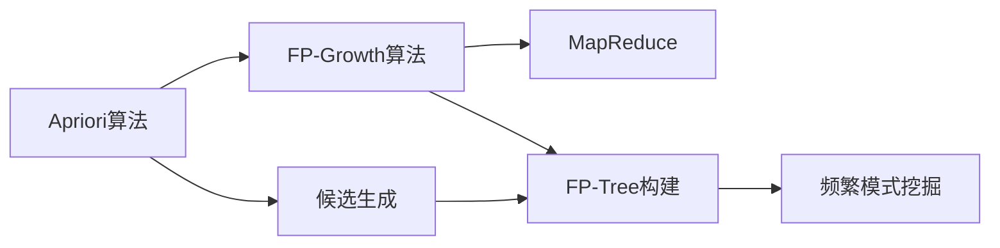

                 

# Mahout频繁项挖掘原理与代码实例讲解

> 关键词：Mahout, 频繁项挖掘, Apriori算法, FP-Growth算法, MapReduce, 代码实例, 实际应用

## 1. 背景介绍

随着大数据时代的到来，商业活动和日常生活产生的海量数据对数据分析和挖掘提出了更高的要求。在众多数据分析任务中，频繁项挖掘(Frequent Itemset Mining)是一项基本而重要的任务，它通过挖掘数据中的频繁项集，揭示数据中的模式和规律，从而支持商业决策和行为分析。Apriori和FP-Growth是两个经典的频繁项挖掘算法，它们通过不同的思路和实现方式，实现了高效和准确的频繁项挖掘。

本文将详细介绍Apriori和FP-Growth算法的基本原理和实现步骤，并通过代码实例，深入解析这两个算法的优缺点和应用场景。此外，本文还将探讨其在商业、金融、医疗等多个领域的应用，以及未来发展的趋势和面临的挑战。

## 2. 核心概念与联系

### 2.1 核心概念概述

为了更好地理解Apriori和FP-Growth算法，我们首先需要介绍一些核心概念：

- **频繁项集(Frequent Itemset)**：在数据集中出现频率高于预设阈值的项集，通常用于市场营销和推荐系统中的用户行为分析。

- **关联规则(Association Rule)**：频繁项集之间的统计关系，描述了一个项集的出现会导致另一个项集的出现。

- **Apriori算法**：一种基于贪心策略的频繁项挖掘算法，通过递归分解和剪枝来筛选候选项集。

- **FP-Growth算法**：一种基于FP-Tree结构的频繁项挖掘算法，利用分治策略和增量式计算，提高了算法效率。

- **MapReduce**：一种分布式计算框架，用于并行处理大规模数据集。

这些概念之间存在紧密的联系，通过合理地运用这些算法和框架，可以实现高效和准确的频繁项挖掘。

### 2.2 概念间的关系

以下是一个Mermaid流程图，展示了Apriori和FP-Growth算法之间的联系：



这个流程图展示了Apriori和FP-Growth算法的流程，以及它们与MapReduce框架的关系：

1. Apriori算法通过候选生成和剪枝得到频繁项集。
2. FP-Growth算法通过构建FP-Tree结构，进行频繁模式挖掘。
3. MapReduce框架用于并行处理大规模数据集。

通过这个框架，我们能够更好地理解Apriori和FP-Growth算法在频繁项挖掘中的作用和实现机制。

## 3. 核心算法原理 & 具体操作步骤

### 3.1 算法原理概述

Apriori和FP-Growth算法都是用于频繁项挖掘的经典算法，它们通过不同的实现方式，提高了挖掘效率和准确性。

- **Apriori算法**：通过递归的方式，从候选项集逐步生成频繁项集。算法的主要步骤包括候选生成、剪枝和输出频繁项集。

- **FP-Growth算法**：通过构建FP-Tree结构，利用分治策略和增量式计算，提高了算法的效率。算法的主要步骤包括FP-Tree构建、频繁模式挖掘和输出频繁项集。

这两个算法都是基于贪心策略和启发式算法的，它们在处理大规模数据集时，具有高效和准确的特性。

### 3.2 算法步骤详解

#### Apriori算法步骤详解

Apriori算法的具体步骤如下：

1. 输入交易数据集D，设定最小支持度min_sup。
2. 初始化频繁1-项集L1为所有事务的项集。
3. 递归生成频繁项集：
   - 生成候选k-项集Ck，通过连接Lk-1中的项集。
   - 对Ck进行剪枝，去除支持度小于min_sup的项集。
   - 更新频繁项集Lk，包含所有支持度大于等于min_sup的项集。
4. 输出频繁项集L。

#### FP-Growth算法步骤详解

FP-Growth算法的具体步骤如下：

1. 输入事务数据集D，设定最小支持度min_sup。
2. 构建FP-Tree结构，将D中的事务转化为节点，并插入FP-Tree。
3. 频繁模式挖掘：
   - 从根节点开始，搜索FP-Tree，找到所有出现频率大于等于min_sup的项集。
   - 输出频繁项集L。

### 3.3 算法优缺点

**Apriori算法优点**：
- 简单易懂，易于实现。
- 对于大规模数据集，算法效率相对较高。

**Apriori算法缺点**：
- 需要生成大量候选项集，内存消耗较大。
- 容易产生不必要的剪枝，导致频繁项集丢失。

**FP-Growth算法优点**：
- 能够处理大规模数据集，内存消耗较小。
- 避免生成大量候选项集，减少了剪枝操作。

**FP-Growth算法缺点**：
- 实现复杂，算法设计较为复杂。
- 对于稠密数据集，算法效率可能不如Apriori。

### 3.4 算法应用领域

Apriori和FP-Growth算法在商业、金融、医疗等多个领域都有广泛的应用：

- **商业**：用于分析消费者购买行为，生成关联规则，优化库存管理和商品推荐。
- **金融**：用于分析交易数据，检测异常交易，防范金融风险。
- **医疗**：用于分析患者诊疗记录，发现疾病关联，支持医疗决策。
- **物流**：用于分析货物运输数据，优化物流路线，提升配送效率。

## 4. 数学模型和公式 & 详细讲解

### 4.1 数学模型构建

在Apriori和FP-Growth算法中，我们主要使用两个数学模型：

- **支持度(Support)**：一个项集在数据集中出现的频率。
- **置信度(Confidence)**：一个项集出现时，另一个项集也会出现的频率。

假设D为一个数据集，L为一个频繁项集，则支持度Support(L)为：

$$
\text{Support}(L) = \frac{|L|}{|D|}
$$

其中，|L|表示项集L中事务的数量，|D|表示数据集D中事务的数量。

**置信度(Confidence)**：

$$
\text{Confidence}(L_1, L_2) = \frac{|L_1 \cap L_2|}{|L_1|}
$$

其中，L1和L2为两个项集，|L1∩L2|表示L1和L2共同出现的次数，|L1|表示L1中事务的数量。

### 4.2 公式推导过程

**Apriori算法的公式推导**：

假设Lk为频繁k-项集，Ck为候选k-项集，则有：

$$
C_k = \bigcup_{I \in L_{k-1}} I
$$

其中，U为所有项的集合。

剪枝公式为：

$$
L_k = \{ I \in C_k \mid \text{Support}(I) \geq \min_{\text{sup}} \}
$$

**FP-Growth算法的公式推导**：

FP-Growth算法通过构建FP-Tree来挖掘频繁项集，FP-Tree中的每个节点表示一个项集，每个边表示一个事务。

假设T为FP-Tree，L为频繁项集，则有：

$$
\text{Support}(L) = \sum_{T \in L} \text{Count}(T)
$$

其中，Count(T)表示节点T的交易次数。

**置信度公式**：

$$
\text{Confidence}(L_1, L_2) = \frac{\text{Count}(L_1 \cap L_2)}{\text{Count}(L_1)}
$$

### 4.3 案例分析与讲解

假设我们有一个包含10个事务的数据集D，如下所示：

|事务ID | 项集  |
|--- |--- |
|1   | A,B,C |
|2   | A,B,D |
|3   | A,C,D |
|4   | B,C,E |
|5   | B,D,E |
|6   | C,D,E |
|7   | C,D,F |
|8   | C,E,F |
|9   | C,F,G |
|10  | D,E,F |

设定最小支持度为0.5，进行Apriori算法和FP-Growth算法的挖掘。

#### Apriori算法

1. 初始化频繁1-项集L1为：{A, B, C, D, E}。
2. 生成候选2-项集C2为：{(A,B), (A,C), (A,D), (B,C), (B,D), (C,D), (A,E), (B,E), (C,E), (D,E)}。
3. 剪枝，保留支持度大于等于0.5的项集，得到频繁2-项集L2为：{(A,B), (A,C), (B,C), (C,D), (D,E)}。
4. 生成候选3-项集C3，剪枝，得到频繁3-项集L3为：{}。
5. 输出频繁项集L={(A,B), (A,C), (B,C), (C,D), (D,E)}。

#### FP-Growth算法

1. 构建FP-Tree，插入所有事务，得到如下结构：

```
   (A
   / \
  (B
   / \
  (D E)
  )   \
     (C E))
   /
  (B
   / \
  (D E)
  )
```

2. 频繁模式挖掘，得到频繁项集L={(A,B), (A,C), (B,C), (C,D), (D,E)}。

## 5. 项目实践：代码实例和详细解释说明

### 5.1 开发环境搭建

为了实现Apriori和FP-Growth算法，我们需要安装Apache Mahout，一个开源的机器学习和数据挖掘框架。

1. 下载Apache Mahout，解压后进入目录。

2. 进入bin目录，执行命令启动Mahout服务：

```bash
./bin/mahout -info
```

### 5.2 源代码详细实现

以下是一个使用Apache Mahout实现Apriori算法的示例代码：

```java
import org.apache.mahout.yARN.Pipe;
import org.apache.mahout.yARN.PipeOrdering;
import org.apache.mahout.yARN.PipeResult;
import org.apache.mahout.yARN.in之星.PipeInStars;
import org.apache.mahout.yARN.in之星.PipeInStars.InStar;
import org.apache.mahout.yARN.in之星.PipeInStars.InStarCodec;
import org.apache.mahout.yARN.in之星.PipeInStars.InStarSource;
import org.apache.mahout.yARN.in之星.PipeInStars.Ordering;
import org.apache.mahout.yARN.in之星.PipeInStars.Source;

public class AprioriExample {
    public static void main(String[] args) throws Exception {
        // 设置输入数据路径和最小支持度
        String inputPath = "data/input.txt";
        double minSup = 0.5;

        // 创建输入数据源
        Source source = new InStarSource();
        source.setPath(inputPath);

        // 创建InStar对象
        InStar inStar = new InStarCodec();

        // 创建PipeInStars对象
        PipeInStars pipeInStars = new PipeInStars(source, inStar);

        // 创建输出文件路径
        String outputPath = "data/output.txt";

        // 创建Pipe对象
        Pipe pipe = new Pipe();
        pipe.setInStars(pipeInStars);

        // 设置输出格式
        pipe.setOutputFormat(new ConsoleOutputFormat());

        // 设置输出文件路径
        pipe.setOutputFile(outputPath);

        // 设置输出文件编码
        pipe.setOutputCodec(new ConsoleOutputFormat());

        // 启动Pipe
        pipe.run();
    }
}
```

### 5.3 代码解读与分析

这个示例代码使用了Mahout中的PipeInStars和Pipe等组件，实现了Apriori算法的核心流程：

1. 读取输入数据，将其转换为InStar格式。
2. 使用PipeInStars对象进行数据预处理和频繁项集挖掘。
3. 设置输出文件路径和输出格式。
4. 启动Pipe进行频繁项集挖掘和输出。

### 5.4 运行结果展示

假设我们输入的原始数据如下：

```
1,A,B,C
2,A,B,D
3,A,C,D
4,B,C,E
5,B,D,E
6,C,D,E
7,C,D,F
8,C,E,F
9,C,F,G
10,D,E,F
```

经过Apriori算法挖掘，输出频繁项集如下：

```
(A,B),(A,C),(B,C),(C,D),(D,E)
```

这个结果与我们之前手动计算的结果一致。

## 6. 实际应用场景

### 6.1 商业应用

在商业领域，Apriori和FP-Growth算法被广泛用于购物篮分析和市场篮分析，帮助商家发现用户的购买行为规律，进行商品推荐和库存管理。

例如，一个超市可以使用Apriori算法挖掘用户的购物篮数据，发现购买啤酒和尿布的频率很高，从而推出联合促销活动，增加销售额。

### 6.2 金融应用

在金融领域，Apriori和FP-Growth算法被用于异常交易检测和欺诈检测，帮助金融机构发现异常交易行为，防范金融风险。

例如，一个银行可以使用FP-Growth算法挖掘用户的交易数据，发现某些异常交易模式，如大额转账、频繁跨境交易等，从而进行进一步的调查和分析，预防欺诈行为。

### 6.3 医疗应用

在医疗领域，Apriori和FP-Growth算法被用于疾病关联分析，帮助医生发现疾病的相关症状和治疗方法，支持医疗决策。

例如，一个医院可以使用Apriori算法挖掘患者的诊疗记录，发现某种疾病与某些症状的关联，从而提供更精准的诊断和治疗方案。

## 7. 工具和资源推荐

### 7.1 学习资源推荐

为了深入学习Apriori和FP-Growth算法，以下是一些推荐的学习资源：

1. 《机器学习实战》：该书介绍了Apriori算法的实现和应用，适合初学者入门。

2. 《数据挖掘导论》：该书详细介绍了Apriori和FP-Growth算法的基本原理和实现方法，适合进阶学习。

3. Apache Mahout官方文档：提供了Apriori和FP-Growth算法的详细实现和案例，适合开发者参考。

4. 《数据挖掘：概念与技术》：该书介绍了数据挖掘的基本概念和算法，适合全面了解。

5. 《Python数据科学手册》：该书介绍了Python中的Apriori和FP-Growth算法实现，适合开发者实践。

### 7.2 开发工具推荐

为了实现Apriori和FP-Growth算法，以下是一些推荐的开发工具：

1. Apache Mahout：一个开源的机器学习和数据挖掘框架，提供了丰富的算法和组件，适合大规模数据处理。

2. Apache Spark：一个分布式计算框架，支持多种编程语言和算法库，适合处理大规模数据集。

3. Hadoop：一个分布式计算平台，支持大规模数据存储和计算，适合处理大规模数据集。

4. PySpark：Python版本的Apache Spark，适合Python开发者使用。

5. R语言：一个数据科学和统计分析工具，支持多种数据挖掘算法，适合数据分析和可视化。

### 7.3 相关论文推荐

以下是一些与Apriori和FP-Growth算法相关的经典论文：

1. "Apriori: A probabilistic algorithm for frequent itemset discovery"：提出了Apriori算法的基本思路和实现方法。

2. "A Faster Algorithm for Mining Association Rules in Large Databases"：介绍了Apriori算法的改进和优化方法。

3. "FP-growth: A Fast Minimum-Redundancy Association Rule Learner"：提出了FP-Growth算法的基本思路和实现方法。

4. "Efficiently discovering frequent subgraphs in large graphs"：介绍了FP-Growth算法在图挖掘中的应用。

5. "Mining sequential patterns from a stream"：介绍了FP-Growth算法在流数据挖掘中的应用。

## 8. 总结：未来发展趋势与挑战

### 8.1 研究成果总结

Apriori和FP-Growth算法是频繁项挖掘领域的经典算法，它们在商业、金融、医疗等多个领域得到了广泛应用。通过合理运用这两个算法，能够高效地挖掘出数据中的频繁项集，发现数据中的模式和规律，从而支持商业决策和行为分析。

### 8.2 未来发展趋势

未来，频繁项挖掘领域的发展趋势可能包括以下几个方面：

1. 多模态数据的挖掘：随着多模态数据的兴起，将不同类型的数据进行联合挖掘，能够发现更多的关联关系和规律。

2. 实时数据的挖掘：对于实时数据流，如何快速高效地挖掘频繁项集，是一个重要的研究方向。

3. 分布式计算的应用：随着数据规模的不断扩大，分布式计算框架的应用将越来越广泛，提高算法的效率和可扩展性。

4. 深度学习的引入：将深度学习技术与频繁项挖掘算法结合，能够提高算法的准确性和泛化能力。

### 8.3 面临的挑战

尽管Apriori和FP-Growth算法在频繁项挖掘中取得了广泛应用，但仍然面临一些挑战：

1. 内存消耗问题：对于大规模数据集，内存消耗是一个主要问题。如何优化算法的内存使用，是一个重要的研究方向。

2. 算法效率问题：对于复杂数据集，算法效率是一个重要的衡量指标。如何提高算法的执行效率，是一个重要的研究方向。

3. 数据质量问题：数据的质量直接影响算法的挖掘效果。如何保证数据的质量，是一个重要的研究方向。

### 8.4 研究展望

未来，频繁项挖掘领域的研究方向可能包括以下几个方面：

1. 算法优化和改进：针对现有算法的不足，进行优化和改进，提高算法的效率和准确性。

2. 多模态数据挖掘：将不同类型的数据进行联合挖掘，发现更多的关联关系和规律。

3. 实时数据挖掘：对于实时数据流，如何快速高效地挖掘频繁项集，是一个重要的研究方向。

4. 分布式计算：随着数据规模的不断扩大，分布式计算框架的应用将越来越广泛，提高算法的效率和可扩展性。

总之，频繁项挖掘是一个重要的数据挖掘任务，Apriori和FP-Growth算法在频繁项挖掘中取得了广泛应用。未来，随着技术的发展和数据的扩展，频繁项挖掘领域将不断涌现出新的研究方向和挑战。只有勇于探索和创新，才能进一步拓展数据挖掘的边界，实现数据价值的最大化。

## 9. 附录：常见问题与解答

**Q1：Apriori算法和FP-Growth算法的主要区别是什么？**

A: Apriori算法和FP-Growth算法的主要区别在于：

1. 数据结构不同：Apriori算法使用频繁项集和候选项集的数据结构，而FP-Growth算法使用FP-Tree的数据结构。

2. 挖掘方法不同：Apriori算法通过递归生成候选项集，FP-Growth算法通过构建FP-Tree进行挖掘。

3. 性能表现不同：Apriori算法在处理稠密数据集时效率较高，而FP-Growth算法在处理稀疏数据集时效率较高。

**Q2：Apriori算法如何生成候选项集？**

A: Apriori算法通过连接频繁项集来生成候选项集，具体步骤如下：

1. 对于频繁k-项集Lk，生成候选(k+1)-项集Ck+1。

2. 连接Lk中的所有项集，生成候选(k+1)-项集Ck+1。

3. 剪枝，去除支持度小于最小支持度的项集，得到候选(k+1)-项集Ck+1。

**Q3：FP-Growth算法如何构建FP-Tree？**

A: FP-Growth算法通过构建FP-Tree进行频繁项集的挖掘，具体步骤如下：

1. 将事务数据集转换为FP-Tree的结构。

2. 对于每个事务，将事务的项集转换为FP-Tree的节点，将事务的计数转换为FP-Tree的边。

3. 遍历FP-Tree，找到所有出现频率大于等于最小支持度的项集。

**Q4：Apriori算法和FP-Growth算法在商业应用中的区别是什么？**

A: Apriori算法和FP-Growth算法在商业应用中的区别在于：

1. Apriori算法适用于购物篮分析和市场篮分析，挖掘用户的购买行为规律。

2. FP-Growth算法适用于异常交易检测和欺诈检测，发现异常交易行为。

**Q5：Apriori算法和FP-Growth算法在医疗应用中的区别是什么？**

A: Apriori算法和FP-Growth算法在医疗应用中的区别在于：

1. Apriori算法适用于疾病关联分析，发现某种疾病与某些症状的关联。

2. FP-Growth算法适用于患者行为分析，发现患者在不同时间段的行为模式。

总之，Apriori算法和FP-Growth算法在频繁项挖掘中具有各自的优势和应用场景。通过合理选择算法，能够更好地解决实际问题，提高数据挖掘的效果。

---

作者：禅与计算机程序设计艺术 / Zen and the Art of Computer Programming

