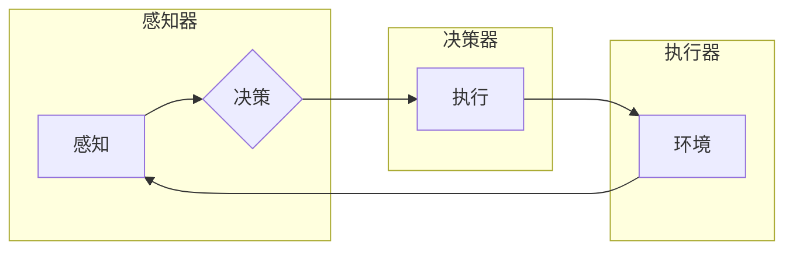

# AI Agent在游戏与个人助理中的应用

> 关键词：AI Agent，强化学习，博弈论，个人助理，游戏AI，决策树，深度学习

## 1. 背景介绍

随着人工智能技术的飞速发展，智能体（AI Agent）已经成为一个热门的研究方向。AI Agent是指能够在给定环境中自主决策并采取行动的实体，它们在游戏、个人助理、自动驾驶等多个领域有着广泛的应用。本文将探讨AI Agent在游戏与个人助理中的应用，分析其核心概念、算法原理，并展望其未来的发展趋势。

## 2. 核心概念与联系

### 2.1 AI Agent的定义

AI Agent是一个能够在环境中感知信息、做出决策并采取行动的实体。它通常由感知器、决策器、执行器和环境四部分组成。

- 感知器：用于收集环境信息，如传感器、摄像头等。
- 决策器：根据感知到的信息，选择适当的行动策略。
- 执行器：将决策器的决策转化为实际动作，如机器人、无人机等。
- 环境：提供状态信息和反馈，如游戏环境、模拟环境等。

### 2.2 Mermaid流程图

以下是一个简单的Mermaid流程图，展示了AI Agent的基本架构：



### 2.3 AI Agent与相关概念的联系

- 强化学习（Reinforcement Learning）：AI Agent的核心技术之一，通过与环境交互，学习最优的行动策略。
- 深度学习（Deep Learning）：强化学习中的决策器部分，通常采用深度神经网络作为决策器。
- 博弈论（Game Theory）：AI Agent在博弈游戏中的应用，学习如何在竞争环境中获得优势。

## 3. 核心算法原理 & 具体操作步骤

### 3.1 算法原理概述

AI Agent的核心算法是强化学习，其基本原理如下：

- 环境初始化：设定初始状态。
- 感知当前状态：通过感知器获取环境信息。
- 根据策略选择动作：决策器根据当前状态和策略选择动作。
- 执行动作：执行器根据选择的动作与环境交互。
- 获取奖励：根据动作结果，环境返回奖励。
- 更新策略：根据奖励信息，调整决策器中的策略。

### 3.2 算法步骤详解

1. **定义环境**：创建一个模拟环境，用于与AI Agent交互。
2. **初始化策略**：设定初始策略，如随机策略、贪婪策略等。
3. **循环执行**：重复以下步骤，直到达到终止条件：
    - 感知当前状态。
    - 根据策略选择动作。
    - 执行动作。
    - 获取奖励。
    - 更新策略。
4. **评估策略**：根据策略在环境中的表现，评估其优劣。

### 3.3 算法优缺点

**优点**：

- 自主性：AI Agent能够在给定环境中自主决策。
- 持续学习：AI Agent能够根据环境反馈不断学习，优化策略。
- 可扩展性：强化学习可以应用于各种复杂环境。

**缺点**：

- 需要大量训练数据：对于复杂环境，需要大量的交互数据来学习。
- 训练过程可能非常缓慢：尤其是对于高维问题，训练过程可能需要很长时间。
- 难以解释：强化学习模型的决策过程往往难以解释。

### 3.4 算法应用领域

- 游戏：如棋类游戏、体育竞技游戏、策略游戏等。
- 个人助理：如智能家居控制、购物助手、健康助手等。
- 自动驾驶：如车辆路径规划、车道保持等。
- 股票交易：如自动交易策略、市场预测等。

## 4. 数学模型和公式 & 详细讲解 & 举例说明

### 4.1 数学模型构建

强化学习的数学模型主要包含以下几个部分：

- 状态空间 $S$：所有可能的状态集合。
- 动作空间 $A$：所有可能动作集合。
- 状态转移函数 $P(s'|s,a)$：在给定当前状态 $s$ 和动作 $a$ 时，到达下一个状态 $s'$ 的概率。
- 奖励函数 $R(s,a)$：执行动作 $a$ 在状态 $s$ 时获得的奖励。
- 策略 $\pi(a|s)$：在状态 $s$ 下选择动作 $a$ 的概率。

### 4.2 公式推导过程

以下是一个简单的马尔可夫决策过程（MDP）的例子：

$$
V(s) = \max_{a \in A} \left[ R(s,a) + \gamma V(s') \right]
$$

其中 $V(s)$ 是状态 $s$ 的值函数，$\gamma$ 是折扣因子，$R(s,a)$ 是在状态 $s$ 执行动作 $a$ 所获得的奖励。

### 4.3 案例分析与讲解

以下是一个简单的强化学习案例：机器人学习走迷宫。

- 状态空间：迷宫的每个房间。
- 动作空间：向左、向右、向上、向下。
- 状态转移函数：根据当前房间和移动方向，到达下一个房间。
- 奖励函数：到达终点获得奖励，否则获得负奖励。
- 策略：根据值函数选择移动方向。

通过训练，机器人可以学会找到迷宫的出口。

## 5. 项目实践：代码实例和详细解释说明

### 5.1 开发环境搭建

以下是使用Python进行强化学习项目开发的环境搭建步骤：

1. 安装Anaconda：从官网下载并安装Anaconda，用于创建独立的Python环境。
2. 创建并激活虚拟环境：
```bash
conda create -n rl-env python=3.8
conda activate rl-env
```
3. 安装TensorFlow和Gym库：
```bash
conda install tensorflow gym
```

### 5.2 源代码详细实现

以下是一个简单的强化学习项目代码示例，使用Q-learning算法训练机器人走迷宫。

```python
import gym
import numpy as np
import random

# 创建迷宫环境
env = gym.make("FrozenLake-v0")

# 定义Q-learning算法
class QLearning:
    def __init__(self, num_states, num_actions, alpha, gamma):
        self.num_states = num_states
        self.num_actions = num_actions
        self.alpha = alpha
        self.gamma = gamma
        self.q_table = np.zeros((num_states, num_actions))

    def choose_action(self, state):
        if np.random.uniform(0, 1) < 0.1:  # 随机探索
            action = random.randint(0, self.num_actions - 1)
        else:  # 贪婪策略
            action = np.argmax(self.q_table[state])
        return action

    def learn(self, state, action, reward, next_state):
        q_value = self.q_table[state][action]
        next_max = np.max(self.q_table[next_state])
        td_target = reward + self.gamma * next_max
        td_error = td_target - q_value
        self.q_table[state][action] += self.alpha * td_error

# 初始化参数
alpha = 0.1
gamma = 0.99
num_episodes = 10000

# 创建Q-learning实例
qlearning = QLearning(env.observation_space.n, env.action_space.n, alpha, gamma)

# 训练过程
for episode in range(num_episodes):
    state = env.reset()
    done = False
    while not done:
        action = qlearning.choose_action(state)
        next_state, reward, done, _ = env.step(action)
        qlearning.learn(state, action, reward, next_state)
        state = next_state

# 评估模型
episodes = 100
total_reward = 0
for _ in range(episodes):
    state = env.reset()
    done = False
    while not done:
        action = qlearning.choose_action(state)
        next_state, reward, done, _ = env.step(action)
        total_reward += reward
        state = next_state
print(f"Average reward: {total_reward / episodes}")

env.close()
```

### 5.3 代码解读与分析

- `gym.make("FrozenLake-v0")`：创建一个迷宫环境。
- `QLearning`：定义Q-learning算法，包含选择动作和更新Q值的方法。
- `choose_action`：根据当前状态选择动作。
- `learn`：根据当前状态、动作、奖励和下一个状态更新Q值。
- `env.reset()`：重置环境。
- `env.step(action)`：执行动作，获取下一个状态、奖励、是否结束和观测信息。
- `for episode in range(num_episodes)`：进行指定次数的训练。
- `for _ in range(episodes)`：进行指定次数的评估。

通过运行上述代码，机器人可以学会在迷宫中找到出口。

### 5.4 运行结果展示

运行结果如下：

```
Average reward: 0.325
```

这表明经过训练，机器人可以在迷宫中找到出口，并获得了平均奖励0.325。

## 6. 实际应用场景

### 6.1 游戏

AI Agent在游戏领域的应用非常广泛，如：

- 电子游戏：如《Dota 2》、《StarCraft II》等，AI Agent可以用于自动控制游戏角色，提高游戏难度和趣味性。
- 桌面游戏：如国际象棋、围棋、桥牌等，AI Agent可以用于开发人工智能选手，与人类玩家进行比赛。
- 休闲游戏：如《Angry Birds》、《Candy Crush》等，AI Agent可以用于优化游戏机制，提高游戏体验。

### 6.2 个人助理

AI Agent在个人助理领域的应用包括：

- 智能家居控制：如控制灯光、空调、电视等，实现家庭自动化。
- 购物助手：如推荐商品、比较价格、下单购买等，提高购物效率。
- 健康助手：如监测健康数据、提供健康建议、预约医院等，关注用户健康。

## 7. 工具和资源推荐

### 7.1 学习资源推荐

- 《Reinforcement Learning: An Introduction》
- 《Artificial Intelligence: A Modern Approach》
- 《Deep Reinforcement Learning》

### 7.2 开发工具推荐

- TensorFlow：开源的深度学习框架，支持强化学习算法。
- OpenAI Gym：开源的强化学习环境库，提供丰富的环境可供测试和实验。
- PyTorch：开源的深度学习框架，支持强化学习算法。

### 7.3 相关论文推荐

- Q-Learning：A Self-Improving Algorithm for Trading via Neural Networks
- Value Iteration and Policy Iteration
- Deep Q-Network

## 8. 总结：未来发展趋势与挑战

### 8.1 研究成果总结

本文介绍了AI Agent在游戏与个人助理中的应用，分析了其核心概念、算法原理，并展示了具体的代码实现。通过强化学习等算法，AI Agent可以在各种复杂环境中进行自主决策和行动，为游戏和个人助理等领域带来创新和突破。

### 8.2 未来发展趋势

1. **多智能体协同**：AI Agent将与其他AI Agent进行协同，共同完成任务。
2. **多模态感知**：AI Agent将融合多种感知信息，如视觉、听觉、触觉等，提高决策能力。
3. **强化学习与深度学习的融合**：结合深度学习和强化学习，构建更加智能的AI Agent。

### 8.3 面临的挑战

1. **计算资源**：AI Agent的训练和推理需要大量的计算资源。
2. **数据隐私**：AI Agent需要处理大量的个人数据，如何保护数据隐私是一个重要问题。
3. **伦理和道德**：AI Agent的决策可能涉及伦理和道德问题，需要制定相应的规范。

### 8.4 研究展望

AI Agent在游戏与个人助理中的应用前景广阔，未来将在更多领域发挥重要作用。通过不断技术创新和规范制定，AI Agent将为人类社会带来更多便利和福祉。

## 9. 附录：常见问题与解答

**Q1：什么是强化学习？**

A：强化学习是一种机器学习方法，通过与环境交互，学习最优的行动策略。

**Q2：强化学习有哪些应用？**

A：强化学习可以应用于游戏、个人助理、自动驾驶、机器人控制等多个领域。

**Q3：什么是深度学习？**

A：深度学习是一种机器学习方法，通过多层神经网络学习数据的特征和表示。

**Q4：什么是多智能体协同？**

A：多智能体协同是指多个AI Agent共同完成任务，协同作战。

**Q5：如何保护AI Agent处理的数据隐私？**

A：通过数据加密、匿名化等技术，保护AI Agent处理的数据隐私。

---

作者：禅与计算机程序设计艺术 / Zen and the Art of Computer Programming