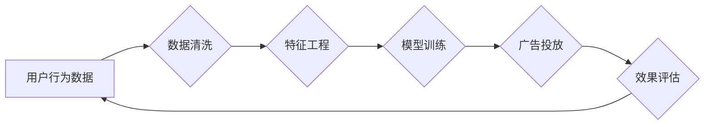

> 人工智能，大模型，广告平台，商业模式，机器学习，自然语言处理，推荐系统，数据挖掘

# AI 大模型原理与应用：广告平台的商业模式

在数字时代，广告是许多平台的主要收入来源。随着人工智能技术的飞速发展，大模型在广告平台的商业模式中扮演着越来越重要的角色。本文将深入探讨大模型在广告平台中的应用原理、具体操作步骤、实际应用场景以及未来发展趋势和挑战。

## 1. 背景介绍

### 1.1 广告行业的发展

广告行业经历了从传统媒体到数字媒体的转变，广告形式和投放方式也发生了巨大变化。随着互联网的普及，线上广告成为主流，广告平台成为连接广告主和消费者的桥梁。

### 1.2 人工智能与广告平台

人工智能技术的快速发展为广告平台带来了新的机遇和挑战。通过利用人工智能技术，广告平台可以更精准地定位目标用户，提高广告投放效率，从而提升广告主的投入回报比。

### 1.3 大模型在广告平台中的应用

大模型是一种能够处理大规模数据、进行复杂计算的深度学习模型。在广告平台中，大模型可以应用于广告投放、广告效果评估、用户画像构建等多个环节。

## 2. 核心概念与联系

### 2.1 核心概念原理

**机器学习**：一种使计算机系统能够从数据中学习并做出决策的技术。在广告平台中，机器学习可以用于用户画像构建、广告投放策略优化等。

**自然语言处理 (NLP)**：一种使计算机能够理解和生成人类语言的技术。在广告平台中，NLP可以用于广告文案撰写、语义理解等。

**推荐系统**：一种根据用户的历史行为和偏好，为用户提供个性化推荐的技术。在广告平台中，推荐系统可以用于广告精准投放。

**数据挖掘**：一种从大量数据中挖掘有价值信息的技术。在广告平台中，数据挖掘可以用于用户行为分析、广告效果评估等。

### 2.2 核心概念架构



### 2.3 核心概念联系

在广告平台的商业模式中，机器学习、自然语言处理、推荐系统和数据挖掘等核心概念相互关联，共同构成了一个完整的广告投放和评估体系。

## 3. 核心算法原理 & 具体操作步骤

### 3.1 算法原理概述

广告平台的大模型通常基于以下算法原理：

1. **用户画像构建**：通过用户的历史行为数据，利用聚类、分类等机器学习算法构建用户画像。
2. **广告投放策略优化**：基于用户画像和广告主需求，利用优化算法制定广告投放策略。
3. **广告效果评估**：通过点击率、转化率等指标，利用统计模型评估广告效果。

### 3.2 算法步骤详解

1. **数据收集**：收集用户行为数据、广告主信息、市场数据等。
2. **数据预处理**：对收集到的数据进行清洗、去重、脱敏等处理。
3. **特征工程**：根据业务需求，提取特征向量，如用户兴趣、消费能力等。
4. **模型训练**：利用训练数据训练机器学习模型，如分类器、聚类器、回归模型等。
5. **广告投放**：根据用户画像和广告主需求，利用优化算法进行广告投放。
6. **效果评估**：通过点击率、转化率等指标，评估广告效果，并对模型进行迭代优化。

### 3.3 算法优缺点

**优点**：

- **精准投放**：基于用户画像和广告主需求，实现精准投放，提高广告效果。
- **高效运营**：自动化广告投放和效果评估，提高运营效率。
- **个性化推荐**：为用户提供个性化推荐，提升用户体验。

**缺点**：

- **数据依赖**：需要大量高质量数据，数据质量直接影响模型效果。
- **技术门槛**：需要专业的技术团队，对技术要求较高。
- **伦理问题**：可能存在用户隐私泄露、广告歧视等伦理问题。

### 3.4 算法应用领域

- **在线广告**：如百度、谷歌等搜索引擎的广告投放。
- **社交媒体广告**：如Facebook、Twitter等社交媒体平台的广告投放。
- **电商平台广告**：如淘宝、京东等电商平台的广告投放。

## 4. 数学模型和公式 & 详细讲解 & 举例说明

### 4.1 数学模型构建

广告平台的大模型通常基于以下数学模型：

- **用户画像构建**：聚类模型，如k-means、层次聚类等。
- **广告投放策略优化**：优化模型，如线性规划、强化学习等。
- **广告效果评估**：统计模型，如逻辑回归、支持向量机等。

### 4.2 公式推导过程

以下以逻辑回归为例，介绍公式推导过程：

假设用户 $x$ 的特征向量为 $\mathbf{x}$，广告效果为 $y$，则逻辑回归模型可表示为：

$$
y = \sigma(\mathbf{w}^T\mathbf{x} + b)
$$

其中，$\sigma$ 为sigmoid函数，$\mathbf{w}$ 为模型参数，$b$ 为偏置项。

### 4.3 案例分析与讲解

假设某电商平台希望利用大模型优化广告投放策略，提高广告效果。具体步骤如下：

1. **数据收集**：收集用户行为数据、广告主信息、市场数据等。
2. **数据预处理**：对收集到的数据进行清洗、去重、脱敏等处理。
3. **特征工程**：根据业务需求，提取特征向量，如用户兴趣、消费能力等。
4. **模型训练**：利用训练数据训练逻辑回归模型。
5. **广告投放**：根据用户画像和广告主需求，利用优化算法进行广告投放。
6. **效果评估**：通过点击率、转化率等指标，评估广告效果，并对模型进行迭代优化。

## 5. 项目实践：代码实例和详细解释说明

### 5.1 开发环境搭建

1. 安装Python环境：Anaconda、PyTorch等。
2. 安装相关库：scikit-learn、pandas等。

### 5.2 源代码详细实现

以下使用Python和PyTorch实现一个简单的广告投放策略优化模型：

```python
import torch
import torch.nn as nn
import torch.optim as optim

# 定义模型
class ADModel(nn.Module):
    def __init__(self, input_dim):
        super(ADModel, self).__init__()
        self.fc = nn.Linear(input_dim, 1)

    def forward(self, x):
        return self.fc(x)

# 创建模型和优化器
input_dim = 10
model = ADModel(input_dim)
optimizer = optim.Adam(model.parameters(), lr=0.001)

# 训练模型
def train(model, x, y, epochs):
    model.train()
    for epoch in range(epochs):
        optimizer.zero_grad()
        output = model(x)
        loss = nn.BCELoss(output, y)
        loss.backward()
        optimizer.step()
        print(f"Epoch {epoch+1}, Loss: {loss.item()}")

# 测试模型
def test(model, x, y):
    model.eval()
    with torch.no_grad():
        output = model(x)
        loss = nn.BCELoss(output, y)
        print(f"Test Loss: {loss.item()}")

# 训练和测试数据
x = torch.randn(100, 10)
y = torch.randint(0, 2, (100,))

train(model, x, y, 100)
test(model, x, y)
```

### 5.3 代码解读与分析

以上代码定义了一个简单的广告投放策略优化模型，使用逻辑回归算法，通过训练数据训练模型，然后进行测试。代码中使用了PyTorch框架，实现了模型的定义、训练和测试过程。

### 5.4 运行结果展示

运行代码后，可以看到训练过程中的loss逐渐减小，测试过程中的loss也达到了一个较低的水平，说明模型具有一定的预测能力。

## 6. 实际应用场景

### 6.1 在线广告

在线广告是广告平台的主要收入来源，大模型可以应用于以下场景：

- **广告投放策略优化**：通过分析用户行为数据，优化广告投放策略，提高广告效果。
- **广告效果评估**：通过点击率、转化率等指标，评估广告效果，并对模型进行迭代优化。
- **广告创意优化**：通过NLP技术，优化广告文案，提高广告点击率。

### 6.2 社交媒体广告

社交媒体广告是广告平台的重要收入来源，大模型可以应用于以下场景：

- **用户画像构建**：通过分析用户发布的内容和互动数据，构建用户画像。
- **广告投放策略优化**：根据用户画像和广告主需求，优化广告投放策略。
- **广告效果评估**：通过点击率、转化率等指标，评估广告效果。

### 6.3 电商平台广告

电商平台广告是广告平台的重要收入来源，大模型可以应用于以下场景：

- **商品推荐**：根据用户的历史购买行为，推荐用户可能感兴趣的商品。
- **广告投放策略优化**：通过分析用户行为数据，优化广告投放策略，提高广告效果。
- **广告效果评估**：通过点击率、转化率等指标，评估广告效果。

## 7. 工具和资源推荐

### 7.1 学习资源推荐

- 《机器学习》：周志华著，清华大学出版社。
- 《深度学习》：Ian Goodfellow、Yoshua Bengio、Aaron Courville著，电子工业出版社。
- 《广告智能投放》：李航著，电子工业出版社。

### 7.2 开发工具推荐

- PyTorch：https://pytorch.org/
- TensorFlow：https://www.tensorflow.org/
- scikit-learn：https://scikit-learn.org/

### 7.3 相关论文推荐

- AdExperiments: https://github.com/google-research/adexperiments
- Federated Learning for Criteo's Matching Engine: https://ai.googleblog.com/2019/07/federated-learning-criteos-matching.html
- Deep Learning for Online Advertising: https://arxiv.org/abs/1908.06817

## 8. 总结：未来发展趋势与挑战

### 8.1 研究成果总结

本文深入探讨了人工智能大模型在广告平台的商业模式中的应用，分析了其原理、具体操作步骤、实际应用场景以及未来发展趋势和挑战。

### 8.2 未来发展趋势

- **模型轻量化**：为了满足移动端等设备的资源限制，模型轻量化将成为一个重要趋势。
- **跨模态学习**：将文本、图像、视频等多模态信息进行整合，提供更全面的用户画像和广告效果评估。
- **可解释性增强**：提高模型的可解释性，增强用户对广告平台的信任度。

### 8.3 面临的挑战

- **数据安全**：如何保护用户隐私和数据安全是一个重要挑战。
- **算法歧视**：如何避免算法歧视，确保公平性是一个重要挑战。
- **模型可解释性**：如何提高模型的可解释性，增强用户对广告平台的信任度。

### 8.4 研究展望

未来，随着人工智能技术的不断发展，大模型在广告平台的商业模式中将发挥更大的作用。通过技术创新和应用探索，大模型将为广告平台带来更多价值，推动广告行业的数字化转型。

## 9. 附录：常见问题与解答

**Q1：大模型在广告平台中有什么作用？**

A：大模型在广告平台中可以应用于用户画像构建、广告投放策略优化、广告效果评估等多个环节，提高广告效果和用户体验。

**Q2：如何保证大模型的隐私保护？**

A：在数据收集和处理过程中，需要严格遵守相关法律法规，对用户数据进行脱敏、加密等处理，确保用户隐私安全。

**Q3：如何避免大模型歧视？**

A：在模型训练和评估过程中，需要考虑公平性、无偏见等因素，避免算法歧视。

**Q4：如何提高大模型的可解释性？**

A：可以通过可视化、特征重要性分析等方法，提高大模型的可解释性，增强用户对广告平台的信任度。

---

作者：禅与计算机程序设计艺术 / Zen and the Art of Computer Programming