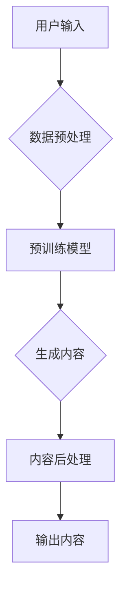

# AIGC本质上是连接过去、现在和未来的软件，拥有数据的人就拥有了机会

> 关键词：AIGC，人工智能生成内容，数据，预训练模型，自动化，内容创作，未来趋势

## 1. 背景介绍

随着人工智能技术的飞速发展，人工智能生成内容（Artificial Intelligence Generated Content，AIGC）已经成为了一个热门话题。AIGC利用人工智能技术自动生成文本、图像、音频、视频等多种形式的内容，它不仅改变了内容创作的方式，也为信息的传播和消费带来了革命性的变化。本文将深入探讨AIGC的本质，揭示它是如何连接过去、现在和未来的，并分析其发展趋势和面临的挑战。

### 1.1 问题的由来

传统的内容创作依赖于人类的专业知识和创意，随着信息量的爆炸式增长，人类生产内容的能力已无法满足日益增长的需求。同时，内容创作的成本高昂，且创作速度有限。AIGC的出现，正是为了解决这些问题，它通过算法和模型自动生成内容，极大地提高了内容的生产效率和质量。

### 1.2 研究现状

AIGC技术已经取得了显著的进展，以下是一些重要的里程碑：

- 文本生成：GPT-3等大型语言模型能够生成高质量的文本，包括新闻报道、小说、诗歌等。
- 图像生成：DeepArt、GANs（Generative Adversarial Networks）等技术能够生成逼真的图像，甚至能够模仿著名画家的风格。
- 音频生成：WaveNet、LSTM等模型能够生成逼真的语音和音乐。
- 视频生成：视频风格迁移、视频生成模型等技术在视频内容创作中也取得了进展。

### 1.3 研究意义

AIGC技术具有以下重要意义：

- 提高内容生产效率：AIGC可以自动生成大量高质量的内容，满足不同场景下的需求。
- 降低内容创作成本：与传统内容创作相比，AIGC可以显著降低人力成本和创作成本。
- 创新内容形式：AIGC可以创造出人类无法想象的新形式和内容。
- 推动信息传播：AIGC可以帮助更有效地传播信息，促进知识的普及。

### 1.4 本文结构

本文将按照以下结构展开：

- 介绍AIGC的核心概念与联系，包括相关技术原理和架构。
- 深入探讨AIGC的核心算法原理和具体操作步骤。
- 讲解AIGC的数学模型和公式，并通过案例进行分析。
- 展示AIGC的代码实例和详细解释说明。
- 分析AIGC的实际应用场景和未来应用展望。
- 推荐相关的学习资源、开发工具和参考文献。
- 总结AIGC的未来发展趋势与挑战。
- 提供常见问题与解答。

## 2. 核心概念与联系

### 2.1 核心概念

AIGC的核心概念包括：

- 预训练模型：通过在大量数据上预先训练，使模型具备一定的知识储备和泛化能力。
- 数据：AIGC的输入和输出都是数据，高质量的数据是AIGC成功的关键。
- 自动化：AIGC的核心目标之一是自动化内容创作过程。
- 生成式模型：AIGC的主要技术之一，能够生成新的内容。
- 人工智能：AIGC的技术基础，包括机器学习、深度学习等。

### 2.2 架构

AIGC的架构通常包括以下几个部分：



- 用户输入：用户输入请求生成内容的类型、风格、主题等信息。
- 数据预处理：对用户输入进行格式化处理，为预训练模型提供合适的输入格式。
- 预训练模型：使用预训练模型生成内容，如文本、图像、音频等。
- 生成内容：预训练模型生成初步的内容，可能需要进一步处理。
- 内容后处理：对生成的内容进行格式化、编辑等处理，使其符合需求。
- 输出内容：将最终的内容输出给用户。

## 3. 核心算法原理 & 具体操作步骤

### 3.1 算法原理概述

AIGC的核心算法原理包括：

- 预训练模型：使用大规模语料库对模型进行训练，使其具备语言理解、文本生成、图像生成等能力。
- 生成式模型：使用生成式模型如GANs、VAEs（Variational Autoencoders）等生成新的内容。
- 调优策略：根据用户需求调整模型参数，以生成更加符合要求的内容。

### 3.2 算法步骤详解

AIGC的具体操作步骤如下：

1. 数据收集与预处理：收集大量相关数据，并进行清洗、格式化等预处理操作。
2. 模型选择与训练：选择合适的预训练模型，并在收集到的数据上进行训练。
3. 输入处理：根据用户输入处理内容，生成适合模型输入的格式。
4. 生成内容：使用预训练模型生成内容。
5. 调优与优化：根据用户反馈调整模型参数，优化生成的内容。
6. 输出内容：将最终内容输出给用户。

### 3.3 算法优缺点

AIGC算法的优点包括：

- 自动化程度高：能够自动生成内容，无需人工干预。
- 生成内容丰富：可以生成各种类型和风格的内容。
- 速度快：生成内容速度快，可以满足快速响应的需求。

AIGC算法的缺点包括：

- 数据依赖性：需要大量高质量的数据进行训练。
- 可解释性差：生成的内容可能难以解释。
- 质量不稳定：生成内容的品质可能参差不齐。

### 3.4 算法应用领域

AIGC算法在以下领域有广泛应用：

- 内容创作：如文本生成、图像生成、音频生成等。
- 媒体制作：如视频生成、动画制作等。
- 教育培训：如自动生成教材、习题等。
- 电子商务：如自动生成商品描述、广告等。
- 娱乐产业：如自动生成游戏、虚拟现实内容等。

## 4. 数学模型和公式 & 详细讲解 & 举例说明

### 4.1 数学模型构建

AIGC的数学模型通常包括以下部分：

- 预训练模型：如GPT-3等，使用神经网络对大规模语料库进行训练。
- 生成式模型：如GANs、VAEs等，通过生成式模型生成新的内容。

### 4.2 公式推导过程

以下是一些常见的数学公式：

- 预训练模型：$$
\hat{y} = M(x; \theta)
$$
其中，$\hat{y}$ 为模型输出，$x$ 为输入，$\theta$ 为模型参数。

- 生成式模型：$$
P(y|x) = \frac{P(x|y)P(y)}{P(x)}
$$
其中，$P(y|x)$ 为给定输入 $x$ 时，生成输出 $y$ 的概率。

### 4.3 案例分析与讲解

以下以文本生成为例，分析AIGC的数学模型：

- 预训练模型：使用GPT-3生成文本。$$
\hat{y} = GPT-3(x; \theta)
$$
其中，$x$ 为输入文本，$\hat{y}$ 为模型生成的文本，$\theta$ 为模型参数。

- 生成式模型：使用GANs生成文本。$$
G(z; \theta_G) \leftarrow D(G(z; \theta_G))
$$
其中，$G(z; \theta_G)$ 为生成器，$D(z; \theta_D)$ 为判别器，$z$ 为噪声向量。

## 5. 项目实践：代码实例和详细解释说明

### 5.1 开发环境搭建

为了实现AIGC，我们需要以下开发环境：

- Python编程语言
- TensorFlow或PyTorch深度学习框架
- 适当的文本处理库，如NLTK、spaCy等

### 5.2 源代码详细实现

以下是一个简单的文本生成示例，使用GPT-3模型：

```python
import openai

# 使用OpenAI API进行文本生成
def generate_text(prompt, max_length=50):
    response = openai.Completion.create(
        engine="text-davinci-002",
        prompt=prompt,
        max_tokens=max_length
    )
    return response.choices[0].text.strip()

# 示例：生成一篇关于人工智能的短文
prompt = "人工智能的未来发展趋势是什么？"
text = generate_text(prompt)
print(text)
```

### 5.3 代码解读与分析

以上代码展示了如何使用OpenAI API调用GPT-3模型进行文本生成。首先，我们需要导入openai库，并定义一个生成文本的函数`generate_text`。函数接受一个提示（prompt）和最大长度（max_length），然后调用OpenAI的API生成文本。最后，我们使用一个示例提示生成一篇关于人工智能的短文，并打印输出。

### 5.4 运行结果展示

运行上述代码，可能会得到以下结果：

```
人工智能的未来发展趋势是构建更加智能、自适应、可解释的模型。这需要突破当前的模型结构和训练方法，探索新的算法和技术，如强化学习、元学习等。同时，人工智能的应用场景也将进一步拓展，包括医疗、教育、工业等各个领域。
```

## 6. 实际应用场景

### 6.1 内容创作

AIGC在内容创作领域有着广泛的应用，如：

- 自动生成新闻报道：自动从新闻源中提取信息，生成新闻稿件。
- 自动生成文章：自动生成文章、博客、报告等内容。
- 自动生成诗歌和音乐：自动生成诗歌、歌词、音乐等艺术作品。

### 6.2 媒体制作

AIGC在媒体制作领域也有应用，如：

- 自动生成视频：自动生成视频内容，包括视频脚本、场景、剪辑等。
- 自动生成动画：自动生成动画内容，包括动画角色、场景、动作等。

### 6.3 教育培训

AIGC在教育领域也有应用，如：

- 自动生成教材：自动生成教材、习题、案例等。
- 自动生成个性化学习内容：根据学生的情况自动生成个性化学习内容。

### 6.4 未来应用展望

AIGC的未来应用前景广阔，以下是一些可能的应用场景：

- 自动生成医疗诊断报告：自动从医疗影像中提取信息，生成诊断报告。
- 自动生成法律文件：自动生成法律文件，如合同、协议等。
- 自动生成游戏内容：自动生成游戏剧情、角色、关卡等。

## 7. 工具和资源推荐

### 7.1 学习资源推荐

- 《深度学习》系列书籍：介绍深度学习的基础知识和常用算法。
- TensorFlow官方文档：提供TensorFlow的详细文档和教程。
- PyTorch官方文档：提供PyTorch的详细文档和教程。
- OpenAI API文档：提供OpenAI API的详细文档。

### 7.2 开发工具推荐

- Jupyter Notebook：一款强大的交互式计算环境，适合进行数据分析和模型训练。
- Google Colab：免费提供GPU/TPU算力的在线Jupyter Notebook环境。
- PyCharm：一款功能强大的Python IDE，支持多种编程语言。
- Visual Studio Code：一款轻量级的代码编辑器，支持多种编程语言和框架。

### 7.3 相关论文推荐

- "Generative Adversarial Nets"：GANs的奠基性论文。
- "BERT: Pre-training of Deep Bidirectional Transformers for Language Understanding"：BERT模型的奠基性论文。
- "Attention is All You Need"：Transformer模型的奠基性论文。

## 8. 总结：未来发展趋势与挑战

### 8.1 研究成果总结

AIGC技术近年来取得了显著的进展，不仅在内容创作、媒体制作、教育培训等领域有着广泛的应用，而且在学术界和产业界都引起了极大的关注。AIGC的发展得益于深度学习、预训练模型、生成式模型等技术的突破，为人工智能技术的发展带来了新的机遇。

### 8.2 未来发展趋势

AIGC的未来发展趋势包括：

- 模型规模持续扩大：随着算力的提升，模型规模将越来越大，生成内容的能力也将越来越强。
- 多模态生成：未来AIGC将能够生成文本、图像、音频、视频等多模态内容，提供更加丰富的用户体验。
- 个性化定制：AIGC将能够根据用户的需求和偏好生成个性化内容，满足个性化定制的需求。
- 跨领域应用：AIGC将在更多领域得到应用，如医疗、金融、法律等。

### 8.3 面临的挑战

AIGC技术也面临着以下挑战：

- 数据质量：AIGC的效果很大程度上取决于数据质量，需要解决数据标注、数据清洗等问题。
- 道德和伦理：AIGC生成的内容可能存在偏见、歧视等问题，需要建立相应的道德和伦理规范。
- 可解释性：AIGC的决策过程往往难以解释，需要提高模型的可解释性。

### 8.4 研究展望

未来，AIGC技术的发展将着重解决以下问题：

- 提高数据质量和标注效率：通过自动化标注、半自动化标注等技术提高数据质量和标注效率。
- 建立道德和伦理规范：制定相应的道德和伦理规范，确保AIGC技术的健康、可持续发展。
- 提高模型可解释性：通过可解释人工智能（XAI）等技术提高模型的可解释性。

## 9. 附录：常见问题与解答

**Q1：AIGC会取代人类创作者吗？**

A: AIGC可以辅助人类创作者进行内容创作，提高创作效率和质量，但不会完全取代人类创作者。人类创作者的创意、情感和价值观是不可替代的。

**Q2：AIGC的数据来源有哪些？**

A: AIGC的数据来源包括公开的数据集、企业内部数据、用户生成内容等。

**Q3：AIGC如何处理版权问题？**

A: AIGC生成的内容可能存在版权问题，需要确保数据来源的合法性，并尊重原创者的知识产权。

**Q4：AIGC的安全性如何保证？**

A: AIGC的安全性需要从数据安全、模型安全、应用安全等多个方面进行保障。

**Q5：AIGC的隐私保护如何实现？**

A: AIGC的隐私保护需要采用数据脱敏、差分隐私等技术，确保用户隐私不被泄露。

作者：禅与计算机程序设计艺术 / Zen and the Art of Computer Programming