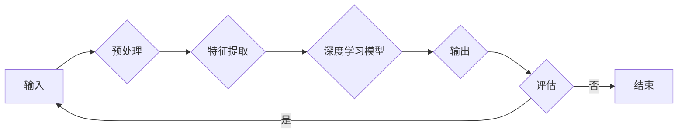

# AI人工智能深度学习算法：在航空航天中的应用

> 关键词：深度学习，航空航天，机器学习，预测性维护，无人机，自动化，数据处理，性能优化

## 1. 背景介绍

航空航天工业是高科技领域的先锋，对技术创新的要求极高。随着人工智能（AI）和深度学习（DL）技术的快速发展，它们开始在航空航天领域发挥越来越重要的作用。从飞机的维护到无人机的导航，再到卫星的数据处理，深度学习算法正在改变着航空航天的许多方面。本文将探讨深度学习在航空航天中的应用，分析其原理、操作步骤、数学模型以及实际案例。

### 1.1 问题的由来

航空航天工业面临的挑战包括：

- **预测性维护**：传统的基于规则的维护方法无法适应复杂的系统故障。
- **无人机导航**：需要高度精确的定位和路径规划能力。
- **卫星数据处理**：海量卫星数据需要高效的处理和分析。
- **性能优化**：提高飞机的燃油效率和飞行性能。

### 1.2 研究现状

深度学习在航空航天领域的应用主要集中在以下几个方面：

- **预测性维护**：利用深度学习预测飞机部件的故障，减少停机时间。
- **无人机导航**：实现自主导航和避障。
- **卫星数据处理**：从海量数据中提取有用信息。
- **性能优化**：通过深度学习优化飞机设计，提高燃油效率。

### 1.3 研究意义

深度学习在航空航天中的应用具有以下意义：

- **提高安全性**：通过预测性维护减少事故发生的风险。
- **降低成本**：通过自动化和优化提高效率，降低运营成本。
- **增强竞争力**：推动航空航天的技术创新和产业升级。

### 1.4 本文结构

本文将按以下结构展开：

- **第2章**：介绍深度学习在航空航天中的核心概念和联系。
- **第3章**：详细阐述深度学习算法的原理和操作步骤。
- **第4章**：讲解深度学习的数学模型和公式。
- **第5章**：提供深度学习在航空航天中的应用实例。
- **第6章**：探讨深度学习在航空航天中的实际应用场景和未来展望。
- **第7章**：推荐相关学习资源、开发工具和论文。
- **第8章**：总结未来发展趋势和挑战。
- **第9章**：附录，常见问题与解答。

## 2. 核心概念与联系

### 2.1 核心概念

- **深度学习**：一种模仿人脑神经网络结构和功能的机器学习技术。
- **神经网络**：由大量神经元组成的计算模型，能够学习数据的复杂模式。
- **监督学习**：通过标签数据进行训练，学习输入和输出之间的关系。
- **无监督学习**：通过无标签数据进行训练，学习数据的内在结构和模式。

### 2.2 Mermaid 流程图



### 2.3 联系

深度学习是神经网络的一种实现方式，它通过多层次的抽象学习数据的复杂特征。监督学习和无监督学习是深度学习的主要学习方法，分别针对有标签和无标签数据进行训练。

## 3. 核心算法原理 & 具体操作步骤

### 3.1 算法原理概述

深度学习算法的核心是神经网络，它通过前向传播和反向传播进行训练。前向传播是将输入数据通过网络的每一层，直到得到输出。反向传播是根据输出和期望输出之间的差异，计算损失并更新网络权重。

### 3.2 算法步骤详解

1. **数据预处理**：清洗数据，进行特征提取和选择。
2. **模型选择**：选择合适的神经网络结构，如卷积神经网络（CNN）或循环神经网络（RNN）。
3. **模型训练**：使用训练数据训练模型，优化网络权重。
4. **模型评估**：使用测试数据评估模型性能。
5. **模型部署**：将训练好的模型部署到实际应用中。

### 3.3 算法优缺点

**优点**：

- 能够学习复杂的非线性关系。
- 能够自动提取特征，无需人工设计特征。
- 具有强大的泛化能力。

**缺点**：

- 训练数据量大，计算资源需求高。
- 模型可解释性差。

### 3.4 算法应用领域

- 预测性维护
- 无人机导航
- 卫星数据处理
- 性能优化

## 4. 数学模型和公式 & 详细讲解 & 举例说明

### 4.1 数学模型构建

神经网络的基本单元是神经元，每个神经元通过权重与输入数据相乘，然后通过激活函数进行处理。以下是神经网络的基本公式：

$$
y = f(W \cdot x + b)
$$

其中，$y$ 是输出，$W$ 是权重，$x$ 是输入，$b$ 是偏置，$f$ 是激活函数。

### 4.2 公式推导过程

以多层感知器（MLP）为例，其输入层、隐藏层和输出层的公式如下：

- 输入层：$a_1 = x$
- 隐藏层：$a_{k+1} = \sigma(W_k \cdot a_k + b_k)$
- 输出层：$y = \sigma(W_n \cdot a_n + b_n)$

其中，$\sigma$ 是激活函数，常用的激活函数包括Sigmoid、ReLU、Tanh等。

### 4.3 案例分析与讲解

以无人机导航为例，我们可以使用RNN来处理无人机在连续时间内的位置和速度数据，预测其未来的位置。

- 输入：无人机的历史位置和速度数据。
- 输出：无人机未来的位置。

通过训练，RNN可以学习到无人机运动的规律，从而预测其未来的位置。

## 5. 项目实践：代码实例和详细解释说明

### 5.1 开发环境搭建

- 安装Python、NumPy、TensorFlow或PyTorch。
- 安装必要的库，如scikit-learn、matplotlib等。

### 5.2 源代码详细实现

```python
import numpy as np
import tensorflow as tf
from tensorflow.keras.models import Sequential
from tensorflow.keras.layers import Dense, LSTM

# 创建数据集
# ...

# 构建模型
model = Sequential()
model.add(LSTM(50, activation='relu', input_shape=(input_shape)))
model.add(Dense(1))
model.compile(optimizer='adam', loss='mse')

# 训练模型
model.fit(X_train, y_train, epochs=10, batch_size=32)

# 预测
predictions = model.predict(X_test)
```

### 5.3 代码解读与分析

- 创建数据集：将无人机的历史位置和速度数据整理成NumPy数组。
- 构建模型：使用Keras构建一个简单的LSTM模型。
- 训练模型：使用训练数据训练模型。
- 预测：使用测试数据预测无人机的未来位置。

## 6. 实际应用场景

### 6.1 预测性维护

通过分析飞机的运行数据，预测部件的故障，提前进行维护，减少停机时间。

### 6.2 无人机导航

利用深度学习算法实现无人机的自主导航和避障。

### 6.3 卫星数据处理

从海量卫星数据中提取有用信息，如天气、地形等。

### 6.4 性能优化

通过深度学习优化飞机设计，提高燃油效率。

## 7. 工具和资源推荐

### 7.1 学习资源推荐

- 《深度学习》（Goodfellow, Bengio, Courville）
- 《Python深度学习》（François Chollet）
- TensorFlow官方文档
- PyTorch官方文档

### 7.2 开发工具推荐

- TensorFlow
- PyTorch
- Keras
- scikit-learn

### 7.3 相关论文推荐

- "Deep Learning for Autonomous Flight: A Survey"（Blogan et al.，2019）
- "Predictive Maintenance with Deep Learning"（Li et al.，2018）
- "Deep Learning for Earth Observation Data Analysis"（Wang et al.，2017）

## 8. 总结：未来发展趋势与挑战

### 8.1 研究成果总结

深度学习在航空航天领域取得了显著的成果，为航空航天工业带来了新的机遇。

### 8.2 未来发展趋势

- 深度学习算法将更加高效和可解释。
- 多模态数据的融合将更加普遍。
- 深度学习将与其他人工智能技术相结合。

### 8.3 面临的挑战

- 数据安全性和隐私保护。
- 模型可解释性和可靠性。
- 资源消耗和计算效率。

### 8.4 研究展望

深度学习将在航空航天领域发挥更大的作用，推动航空航天工业的创新发展。

## 9. 附录：常见问题与解答

**Q1：深度学习在航空航天中的应用有哪些？**

A1：深度学习在航空航天中的应用包括预测性维护、无人机导航、卫星数据处理和性能优化等。

**Q2：深度学习算法有哪些类型？**

A2：深度学习算法包括卷积神经网络（CNN）、循环神经网络（RNN）、长短期记忆网络（LSTM）等。

**Q3：如何评估深度学习模型的性能？**

A3：可以通过准确率、召回率、F1分数等指标评估深度学习模型的性能。

**Q4：深度学习算法有哪些局限性？**

A4：深度学习算法的局限性包括数据依赖性、可解释性差、计算资源消耗大等。

**Q5：未来深度学习在航空航天领域有哪些发展趋势？**

A5：未来深度学习在航空航天领域的发展趋势包括算法优化、多模态数据融合、与其他人工智能技术相结合等。

---

作者：禅与计算机程序设计艺术 / Zen and the Art of Computer Programming