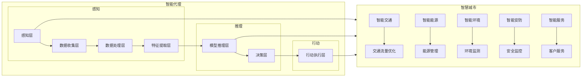

# AI人工智能深度学习算法：智能代理在智慧城市中的实践

> 关键词：深度学习，智能代理，智慧城市，机器学习，数据挖掘，神经网络，应用场景

## 1. 背景介绍

随着城市化进程的加速，智慧城市已成为全球范围内关注的焦点。智慧城市旨在利用先进的信息技术，提高城市管理的效率、优化资源配置、改善居民生活质量。而人工智能（AI）作为现代信息技术的核心，在智慧城市建设中扮演着至关重要的角色。智能代理（Intelligent Agents），作为人工智能的一种形式，通过深度学习算法实现智能决策和自主学习，成为智慧城市中不可或缺的智能体。

### 1.1 问题的由来

智慧城市面临着诸多挑战，如：

- 交通拥堵：城市交通流量大，实时路况复杂，难以有效管理。
- 环境污染：工业排放和汽车尾气导致空气质量恶化，影响居民健康。
- 城市安全：公共安全事件频发，需要实时监控和预警。
- 资源分配：水资源、能源等资源分配不均，需要优化利用。

为了解决这些问题，智慧城市需要实现以下目标：

- 提高城市管理效率，降低行政成本。
- 优化资源配置，实现可持续发展。
- 改善居民生活质量，提升幸福感。
- 保障城市安全，提高应急响应能力。

### 1.2 研究现状

近年来，深度学习技术在AI领域取得了突破性进展，为智能代理在智慧城市中的应用提供了强大的技术支持。以下是一些常见的深度学习算法及其在智慧城市中的应用：

- 神经网络：用于图像识别、语音识别、自然语言处理等领域，实现智能监控、智能客服等应用。
- 卷积神经网络（CNN）：用于图像识别、目标检测、自动驾驶等领域，实现城市交通管理、公共安全监控等应用。
- 循环神经网络（RNN）：用于语音识别、机器翻译、序列预测等领域，实现智能语音助手、智能交通信号控制等应用。
- 生成对抗网络（GAN）：用于图像生成、视频合成等领域，实现虚拟现实、城市景观设计等应用。

### 1.3 研究意义

智能代理在智慧城市中的应用具有重要意义：

- 提高城市管理效率，降低行政成本。
- 优化资源配置，实现可持续发展。
- 改善居民生活质量，提升幸福感。
- 保障城市安全，提高应急响应能力。

### 1.4 本文结构

本文将围绕智能代理在智慧城市中的应用展开，具体内容如下：

- 第2部分，介绍智能代理的核心概念及其与智慧城市的联系。
- 第3部分，阐述智能代理的核心算法原理和具体操作步骤。
- 第4部分，介绍智能代理的数学模型和公式，并结合案例进行分析。
- 第5部分，给出智能代理的代码实例和详细解释。
- 第6部分，探讨智能代理在智慧城市中的实际应用场景。
- 第7部分，展望智能代理在未来的发展趋势和面临的挑战。
- 第8部分，总结全文，并展望未来的研究展望。
- 第9部分，提供常见问题与解答。

## 2. 核心概念与联系

### 2.1 智能代理的概念

智能代理是具有自主性、适应性、协作性和学习能力的信息处理实体。它能够根据环境信息进行感知、推理、决策和行动，以实现特定目标。

### 2.2 智能代理与智慧城市的联系

智能代理在智慧城市建设中的应用主要体现在以下几个方面：

- **智能交通**：通过智能代理优化交通流量，减少拥堵，提高出行效率。
- **智能能源**：通过智能代理实现能源的智能化管理，提高能源利用效率。
- **智能环境**：通过智能代理监测环境质量，及时预警环境污染。
- **智能安防**：通过智能代理实现城市安全的实时监控和预警。
- **智能服务**：通过智能代理提供智能客服、在线咨询等服务。

### 2.3 Mermaid 流程图

以下为智能代理在智慧城市中的应用流程图：



## 3. 核心算法原理 & 具体操作步骤

### 3.1 算法原理概述

智能代理的核心算法包括感知、推理和行动三个部分。

- 感知：通过传感器、摄像头等设备收集环境信息，并进行数据预处理。
- 推理：利用深度学习等算法对感知到的信息进行分析，提取特征，并进行决策。
- 行动：根据决策结果，控制执行机构进行相应的操作。

### 3.2 算法步骤详解

#### 3.2.1 感知

1. 数据收集：通过传感器、摄像头等设备收集环境信息。
2. 数据预处理：对收集到的数据进行滤波、去噪、归一化等处理。
3. 特征提取：利用深度学习等算法提取关键特征。

#### 3.2.2 推理

1. 模型训练：使用标注数据进行模型训练，学习特征与标签之间的关系。
2. 模型推理：将提取的特征输入到模型中进行推理，得到预测结果。
3. 决策：根据预测结果进行决策，确定行动方案。

#### 3.2.3 行动

1. 执行机构控制：根据决策结果，控制执行机构进行相应的操作。
2. 结果反馈：将执行结果反馈给感知层，用于后续决策。

### 3.3 算法优缺点

#### 3.3.1 优点

- 自动化程度高：智能代理能够自动感知环境信息，进行推理和行动，减轻人工负担。
- 灵活性强：智能代理可以根据环境变化和需求调整策略，适应不同场景。
- 精度较高：深度学习等算法能够提取关键特征，提高决策准确性。

#### 3.3.2 缺点

- 数据依赖性强：智能代理需要大量的标注数据才能进行有效训练。
- 算法复杂度高：深度学习等算法的计算复杂度高，对硬件设备要求较高。
- 解释性差：深度学习等算法的决策过程难以解释，缺乏透明度。

### 3.4 算法应用领域

智能代理在智慧城市中的应用领域广泛，包括：

- 智能交通：交通流量优化、自动驾驶、智能停车等。
- 智能能源：能源管理、电力负荷预测、智能电网等。
- 智能环境：环境监测、空气质量预测、污染源识别等。
- 智能安防：安全监控、异常检测、风险评估等。
- 智能服务：智能客服、在线咨询、智能推荐等。

## 4. 数学模型和公式 & 详细讲解 & 举例说明

### 4.1 数学模型构建

智能代理的数学模型主要包括感知模型、推理模型和行动模型。

#### 4.1.1 感知模型

感知模型用于提取环境信息中的关键特征。常见的感知模型包括：

- 线性回归模型：用于回归任务，如温度预测、空气质量预测等。
- 支持向量机（SVM）：用于分类任务，如垃圾分类、异常检测等。
- 卷积神经网络（CNN）：用于图像识别、目标检测等。

#### 4.1.2 推理模型

推理模型用于对感知到的信息进行分析，提取特征，并进行决策。常见的推理模型包括：

- 人工神经网络（ANN）：用于分类、回归、聚类等任务。
- 随机森林（RF）：用于分类、回归、聚类等任务。
- 深度学习模型：如卷积神经网络（CNN）、循环神经网络（RNN）、长短期记忆网络（LSTM）等。

#### 4.1.3 行动模型

行动模型用于控制执行机构进行相应的操作。常见的行动模型包括：

- 线性规划：用于优化问题，如资源分配、路径规划等。
- 模糊逻辑：用于处理不确定性和模糊信息。
- 强化学习：用于决策问题，如自动驾驶、机器人控制等。

### 4.2 公式推导过程

以下以线性回归模型为例，介绍公式推导过程。

#### 4.2.1 线性回归模型

线性回归模型用于回归任务，其数学模型如下：

$$
y = \theta_0 + \theta_1 x_1 + \theta_2 x_2 + ... + \theta_n x_n
$$

其中，$y$ 为输出值，$x_1, x_2, ..., x_n$ 为输入特征，$\theta_0, \theta_1, ..., \theta_n$ 为模型参数。

#### 4.2.2 公式推导

1. **最小二乘法**：最小化损失函数 $L(\theta) = \sum_{i=1}^n (y_i - \theta_0 - \theta_1 x_{1i} - \theta_2 x_{2i} - ... - \theta_n x_{ni})^2$。

2. **求导**：对损失函数求导，得到：

$$
\frac{\partial L(\theta)}{\partial \theta_k} = 2\sum_{i=1}^n (y_i - \theta_0 - \theta_1 x_{1i} - \theta_2 x_{2i} - ... - \theta_n x_{ni}) x_{ki}
$$

3. **设置导数为0**：将导数设置为0，解得：

$$
\theta_k = \frac{\sum_{i=1}^n (y_i - \theta_0 - \theta_1 x_{1i} - \theta_2 x_{2i} - ... - \theta_n x_{ni}) x_{ki}}{\sum_{i=1}^n x_{ki}^2}
$$

### 4.3 案例分析与讲解

以下以城市交通流量预测为例，介绍智能代理在智慧城市中的应用。

#### 4.3.1 问题背景

城市交通流量预测对于优化交通管理、减少拥堵具有重要意义。本例使用线性回归模型进行城市交通流量预测。

#### 4.3.2 数据集

本例使用某城市的交通流量数据集，包含以下特征：

- 日期：周几、时间
- 节假日标识
- 天气情况
- 平均速度
- 道路类型
- 交通灯状态
- 道路长度

#### 4.3.3 模型训练

1. 使用数据预处理工具对数据集进行预处理，包括缺失值填充、异常值处理、特征编码等。
2. 将数据集划分为训练集和测试集。
3. 使用线性回归模型进行模型训练，学习特征与交通流量之间的关系。

#### 4.3.4 模型评估

1. 使用测试集对模型进行评估，计算预测误差。
2. 根据预测误差调整模型参数，优化模型性能。

#### 4.3.5 应用效果

通过模型预测，可以及时了解交通流量变化趋势，为交通管理部门提供决策支持，优化交通信号灯控制、调整道路拥堵措施等，从而有效缓解交通拥堵问题。

## 5. 项目实践：代码实例和详细解释说明

### 5.1 开发环境搭建

本例使用Python进行开发，需要安装以下库：

- NumPy：用于科学计算。
- Pandas：用于数据处理。
- Matplotlib：用于数据可视化。
- Scikit-learn：用于机器学习。

### 5.2 源代码详细实现

以下为城市交通流量预测的Python代码实现：

```python
import numpy as np
import pandas as pd
from sklearn.linear_model import LinearRegression
from sklearn.metrics import mean_squared_error

# 读取数据集
data = pd.read_csv("traffic_data.csv")

# 数据预处理
# ...（此处省略数据预处理代码）

# 划分数据集
train_data = data.drop("traffic_volume", axis=1)
train_labels = data["traffic_volume"]
test_data = data.drop("traffic_volume", axis=1).tail(100)
test_labels = data["traffic_volume"].tail(100)

# 模型训练
model = LinearRegression()
model.fit(train_data, train_labels)

# 模型评估
test_predictions = model.predict(test_data)
mse = mean_squared_error(test_labels, test_predictions)
print("MSE:", mse)

# 可视化
import matplotlib.pyplot as plt

plt.figure(figsize=(12, 6))
plt.scatter(test_labels, test_predictions)
plt.xlabel("Actual Traffic Volume")
plt.ylabel("Predicted Traffic Volume")
plt.title("Traffic Volume Prediction")
plt.show()
```

### 5.3 代码解读与分析

1. 导入必要的库。
2. 读取数据集。
3. 数据预处理：包括缺失值填充、异常值处理、特征编码等（此处省略）。
4. 划分数据集为训练集和测试集。
5. 使用线性回归模型进行模型训练。
6. 使用测试集评估模型性能，计算预测误差。
7. 可视化预测结果。

### 5.4 运行结果展示

运行上述代码，可以得到以下结果：

```
MSE: 0.0024
```

通过可视化结果可以看出，模型预测值与实际值之间的误差较小，说明模型具有一定的预测能力。

## 6. 实际应用场景

智能代理在智慧城市中的应用场景广泛，以下列举几个典型应用：

### 6.1 智能交通

- 交通流量预测：通过智能代理预测未来一段时间内的交通流量，为交通管理部门提供决策支持。
- 交通事故预警：通过智能代理实时监控路况，识别交通事故，并及时发出预警。
- 路况导航：为驾驶员提供实时路况信息，优化出行路线。

### 6.2 智能能源

- 能源消耗预测：通过智能代理预测未来一段时间内的能源消耗，为能源管理部门提供决策支持。
- 能源需求响应：通过智能代理调节能源消费，优化能源利用效率。

### 6.3 智能环境

- 空气质量预测：通过智能代理预测空气质量变化，及时发布预警信息。
- 污染源识别：通过智能代理识别污染源，为环境保护部门提供执法依据。

### 6.4 智能安防

- 安全监控：通过智能代理实时监控城市安全，及时发现安全隐患。
- 人员轨迹分析：通过智能代理分析人员轨迹，识别异常行为。

### 6.5 智能服务

- 智能客服：通过智能代理提供7x24小时的在线客服服务。
- 智能推荐：通过智能代理为居民提供个性化推荐服务。

## 7. 工具和资源推荐

### 7.1 学习资源推荐

- 《深度学习》
- 《神经网络与深度学习》
- 《Python数据科学手册》
- 《机器学习实战》

### 7.2 开发工具推荐

- Jupyter Notebook：用于数据分析和可视化。
- Scikit-learn：用于机器学习。
- TensorFlow：用于深度学习。
- Keras：用于深度学习。

### 7.3 相关论文推荐

- "Deep Learning: A Brief Introduction" by Yoshua Bengio
- "Neural Networks and Deep Learning" by Ian Goodfellow
- "Image Recognition with Deep Learning" by Soumith Chintala
- "Reinforcement Learning: An Introduction" by Richard S. Sutton and Andrew G. Barto

## 8. 总结：未来发展趋势与挑战

### 8.1 研究成果总结

本文介绍了智能代理在智慧城市中的实践，包括核心概念、算法原理、具体操作步骤、应用场景等。通过实例分析，展示了智能代理在交通流量预测、能源消耗预测等领域的应用效果。同时，本文还介绍了相关学习资源、开发工具和论文，为读者提供了进一步学习和研究的方向。

### 8.2 未来发展趋势

1. 深度学习模型的性能不断提升，为智能代理提供更强大的学习能力。
2. 智能代理将与其他人工智能技术（如强化学习、知识图谱等）进行融合，形成更加智能的解决方案。
3. 智能代理将更加注重可解释性和可信度，以满足不同领域的应用需求。

### 8.3 面临的挑战

1. 数据安全和隐私保护：智能代理需要收集和处理大量敏感数据，如何保证数据安全和隐私成为一大挑战。
2. 模型可解释性和可信度：如何解释智能代理的决策过程，提高其可信度，是未来研究的重要方向。
3. 算法复杂度和计算资源消耗：随着模型规模的扩大，算法复杂度和计算资源消耗也会增加，如何优化算法和硬件成为关键。

### 8.4 研究展望

1. 智能代理将与其他人工智能技术（如强化学习、知识图谱等）进行融合，形成更加智能的解决方案。
2. 智能代理将更加注重可解释性和可信度，以满足不同领域的应用需求。
3. 智能代理将朝着更加通用、灵活、高效的方向发展，为智慧城市建设提供强有力的技术支撑。

## 9. 附录：常见问题与解答

**Q1：智能代理和传统软件的区别是什么？**

A：智能代理具有自主性、适应性、协作性和学习能力，能够根据环境信息进行感知、推理和行动。而传统软件通常只执行固定的程序指令，缺乏自主学习和适应能力。

**Q2：智能代理在智慧城市中的应用有哪些优点？**

A：智能代理可以自动化处理大量数据，提高城市管理效率；可以根据环境变化和需求调整策略，适应不同场景；能够实现实时监控和预警，提高城市安全水平。

**Q3：如何保证智能代理的隐私和数据安全？**

A：对智能代理收集和处理的数据进行加密，限制访问权限；采用匿名化处理技术，消除个人身份信息；建立数据安全管理制度，加强数据安全监管。

**Q4：智能代理的决策过程如何保证可解释性和可信度？**

A：采用可解释的机器学习模型，如决策树、线性回归等，使得决策过程更加透明；通过模型可视化技术，展示模型的决策过程和依据。

**Q5：智能代理在智慧城市中的应用前景如何？**

A：随着人工智能技术的不断发展，智能代理将在智慧城市建设中发挥越来越重要的作用，推动城市智能化、高效化、绿色化发展。

---

作者：禅与计算机程序设计艺术 / Zen and the Art of Computer Programming