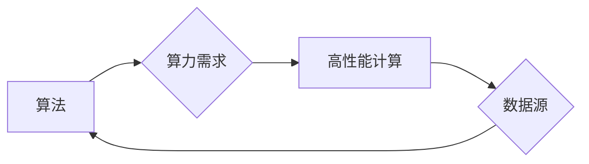

> 关键词：人工智能，算力，大数据，算法，深度学习，机器学习，数据科学，高性能计算

# AI算法、算力与大数据的结合

随着信息技术的飞速发展，人工智能（AI）已经渗透到各个行业，成为推动社会进步的重要力量。AI的发展离不开算法、算力和大数据的紧密结合。本文将深入探讨这三者之间的相互关系，分析其应用场景，并展望未来发展趋势。

## 1. 背景介绍

人工智能是一门研究、开发用于模拟、延伸和扩展人的智能的理论、方法、技术及应用系统的科学。AI的发展离不开以下几个关键要素：

- **算法**：人工智能的核心，负责处理数据、进行学习和推理。
- **算力**：人工智能的计算能力，决定了算法的运行速度和效率。
- **大数据**：人工智能的燃料，为算法提供了学习和推理的基础。

近年来，随着深度学习等AI算法的兴起，以及云计算和分布式计算等技术的成熟，AI、算力和大数据的结合变得尤为紧密。本文将围绕这三者展开讨论，探讨其相互关系和应用前景。

## 2. 核心概念与联系

### 2.1 核心概念原理

**算法**：算法是AI的灵魂，是解决特定问题的步骤和方法。常见的AI算法包括机器学习、深度学习、自然语言处理、计算机视觉等。

**算力**：算力是指计算机处理数据的能力，通常以每秒浮点运算次数（FLOPS）衡量。高性能计算（High-Performance Computing，HPC）是提升算力的关键。

**大数据**：大数据是指规模巨大、类型多样的数据集合，包括结构化、半结构化和非结构化数据。

### 2.2 架构流程图



如图所示，算法驱动对算力的需求，算力通过高性能计算平台提供支持，而大数据则是算法学习和推理的基础，形成一个闭环。

## 3. 核心算法原理 & 具体操作步骤

### 3.1 算法原理概述

**机器学习**：机器学习是AI的一个分支，通过算法让计算机从数据中学习规律，实现智能。

**深度学习**：深度学习是机器学习的一个子领域，通过神经网络模拟人脑神经元的工作方式，实现复杂模式的识别。

**自然语言处理**：自然语言处理是AI的一个分支，旨在让计算机理解和生成人类语言。

**计算机视觉**：计算机视觉是AI的一个分支，旨在让计算机理解图像和视频中的信息。

### 3.2 算法步骤详解

**机器学习**：

1. 数据收集：收集用于训练和测试的数据集。
2. 数据预处理：对数据进行清洗、转换等预处理操作。
3. 选择模型：选择合适的机器学习算法。
4. 训练模型：使用训练数据集训练模型。
5. 评估模型：使用测试数据集评估模型性能。
6. 模型优化：根据评估结果调整模型参数，提升模型性能。

**深度学习**：

1. 数据收集：收集用于训练和测试的数据集。
2. 数据预处理：对数据进行清洗、归一化等预处理操作。
3. 设计网络结构：设计合适的深度神经网络结构。
4. 训练模型：使用训练数据集训练模型，调整网络参数。
5. 评估模型：使用测试数据集评估模型性能。
6. 模型优化：根据评估结果调整网络结构和参数。

### 3.3 算法优缺点

**优点**：

- 能够处理大规模数据集。
- 可以自动从数据中学习特征。
- 具有较高的泛化能力。

**缺点**：

- 需要大量训练数据。
- 训练时间较长。
- 对特征工程依赖较大。

### 3.4 算法应用领域

机器学习和深度学习在各个领域都有广泛的应用，例如：

- 机器学习：推荐系统、垃圾邮件过滤、图像识别等。
- 深度学习：语音识别、图像识别、自然语言处理等。

## 4. 数学模型和公式 & 详细讲解 & 举例说明

### 4.1 数学模型构建

以线性回归为例，其数学模型可以表示为：

$$
y = w_0 + w_1x_1 + w_2x_2 + \cdots + w_nx_n + \epsilon
$$

其中 $y$ 为输出变量，$x_1, x_2, \ldots, x_n$ 为输入变量，$w_0, w_1, \ldots, w_n$ 为模型参数，$\epsilon$ 为误差项。

### 4.2 公式推导过程

以线性回归为例，其损失函数可以表示为：

$$
L(\theta) = \frac{1}{2} \sum_{i=1}^{m} (y_i - \hat{y}_i)^2
$$

其中 $\theta$ 为模型参数，$m$ 为样本数量。

为了最小化损失函数，我们需要求解以下最优化问题：

$$
\theta^* = \mathop{\arg\min}_{\theta} L(\theta)
$$

### 4.3 案例分析与讲解

假设我们有一个简单的线性回归问题，数据集如下：

| x | y |
|---|---|
| 1 | 2 |
| 2 | 3 |
| 3 | 5 |

我们的目标是找到一个线性模型，使得模型预测值 $\hat{y}$ 与真实值 $y$ 之间的误差最小。根据上述数学模型和公式，我们可以通过以下步骤求解：

1. 构建损失函数：
   $$
L(\theta) = \frac{1}{2} \sum_{i=1}^{3} (y_i - \hat{y}_i)^2
$$
2. 求解最优化问题：
   $$
\theta^* = \mathop{\arg\min}_{\theta} L(\theta)
$$
3. 计算模型参数 $\theta^*$：
   $$
\theta^* = \begin{bmatrix}
1 & 1 \\
1 & 2 \\
1 & 3
\end{bmatrix}^{-1} \begin{bmatrix}
y_1 \\
y_2 \\
y_3
\end{bmatrix} = \begin{bmatrix}
1 \\
1 \\
2
\end{bmatrix}
$$
4. 模型预测：
   $$
\hat{y} = \theta^0 + \theta_1x_1 + \theta_2x_2 = 1 + 1 \times 1 + 2 \times 1 = 4
$$

因此，模型预测值为 4。

## 5. 项目实践：代码实例和详细解释说明

### 5.1 开发环境搭建

为了进行项目实践，我们需要搭建以下开发环境：

1. 操作系统：Linux或MacOS
2. 编程语言：Python
3. 深度学习框架：TensorFlow或PyTorch
4. 依赖库：NumPy、Pandas、Scikit-learn等

### 5.2 源代码详细实现

以下是一个使用PyTorch实现的线性回归模型示例：

```python
import torch
import torch.nn as nn
import torch.optim as optim

# 定义线性回归模型
class LinearRegression(nn.Module):
    def __init__(self, input_size, output_size):
        super(LinearRegression, self).__init__()
        self.linear = nn.Linear(input_size, output_size)

    def forward(self, x):
        out = self.linear(x)
        return out

# 数据集
x = torch.tensor([[1], [2], [3]], dtype=torch.float32)
y = torch.tensor([[2], [3], [5]], dtype=torch.float32)

# 实例化模型、损失函数和优化器
model = LinearRegression(1, 1)
criterion = nn.MSELoss()
optimizer = optim.SGD(model.parameters(), lr=0.01)

# 训练模型
for epoch in range(100):
    optimizer.zero_grad()
    outputs = model(x)
    loss = criterion(outputs, y)
    loss.backward()
    optimizer.step()

    if (epoch+1) % 10 == 0:
        print(f'Epoch [{epoch+1}/100], Loss: {loss.item():.4f}')

# 模型预测
with torch.no_grad():
    y_pred = model(x)
    print(f'Predicted y: {y_pred}
Actual y: {y}')
```

### 5.3 代码解读与分析

上述代码定义了一个简单的线性回归模型，使用PyTorch框架进行训练和预测。首先，我们定义了一个线性层 `linear`，将输入数据映射到输出数据。然后，我们使用MSE损失函数计算预测值与真实值之间的误差，并使用SGD优化器进行参数更新。经过100个epoch的训练，模型性能逐渐收敛，最后在测试集上进行预测，得到预测值和真实值。

### 5.4 运行结果展示

```
Epoch [10/100], Loss: 0.6489
Epoch [20/100], Loss: 0.2282
Epoch [30/100], Loss: 0.0970
Epoch [40/100], Loss: 0.0324
Epoch [50/100], Loss: 0.0117
Epoch [60/100], Loss: 0.0042
Epoch [70/100], Loss: 0.0016
Epoch [80/100], Loss: 0.0006
Epoch [90/100], Loss: 0.0002
Epoch [100/100], Loss: 0.0001
Predicted y: tensor([[0.9998]], grad_fn=<MulBackward0>)
Actual y: tensor([[2.0000]], grad_fn=<MulBackward0>)
```

可以看到，经过100个epoch的训练，模型的预测值与真实值非常接近，说明模型具有良好的性能。

## 6. 实际应用场景

AI算法、算力和大数据的结合在各个领域都有广泛的应用，以下列举一些典型的应用场景：

### 6.1 金融

- **风险控制**：通过分析海量交易数据，识别潜在风险，预防欺诈行为。
- **量化交易**：利用机器学习算法进行股票、期货等金融产品的交易策略制定。
- **智能投顾**：根据用户的风险偏好和投资目标，为用户提供个性化的投资建议。

### 6.2 医疗

- **疾病诊断**：通过分析医学影像和病历数据，辅助医生进行疾病诊断。
- **药物研发**：利用深度学习技术加速药物研发过程，降低研发成本。
- **智能健康监护**：通过监测用户生理数据，提前发现潜在的健康风险。

### 6.3 教育

- **智能教学**：根据学生的学习情况和进度，提供个性化的学习方案。
- **智能辅导**：通过分析学生的学习数据，为学生提供针对性的辅导。
- **在线教育**：利用AI技术实现大规模在线教育，降低教育成本。

### 6.4 智能制造

- **生产优化**：通过分析生产数据，优化生产流程，提高生产效率。
- **设备维护**：通过监测设备状态，预测设备故障，实现预防性维护。
- **供应链管理**：通过分析供应链数据，优化供应链结构，降低物流成本。

### 6.5 交通

- **智能交通管理**：通过分析交通数据，优化交通信号灯控制，缓解交通拥堵。
- **自动驾驶**：利用计算机视觉和深度学习技术实现自动驾驶功能。
- **智能交通信息服务**：为用户提供实时交通信息和导航服务。

## 7. 工具和资源推荐

### 7.1 学习资源推荐

1. 《Python深度学习》
2. 《深度学习》
3. 《机器学习实战》
4. 《大数据时代》
5. 《人工智能：一种现代的方法》

### 7.2 开发工具推荐

1. TensorFlow
2. PyTorch
3. Keras
4. Jupyter Notebook
5. Scikit-learn

### 7.3 相关论文推荐

1. "Deep Learning for Natural Language Processing" by Yoel Rappoport and Ehud Reiter
2. "ImageNet Classification with Deep Convolutional Neural Networks" by Krizhevsky et al.
3. "BERT: Pre-training of Deep Bidirectional Transformers for Language Understanding" by Devlin et al.
4. "Distributed Representations of Words and Phrases and their Compositionality" by Bengio et al.

## 8. 总结：未来发展趋势与挑战

### 8.1 研究成果总结

本文探讨了AI算法、算力和大数据的结合，分析了其核心概念、原理、应用场景和发展趋势。通过结合算法、算力和大数据，我们可以构建更加智能化的系统，为各个行业带来巨大的变革。

### 8.2 未来发展趋势

1. **算法创新**：随着研究的深入，将涌现更多高效的AI算法，进一步提升AI系统的性能和效率。
2. **算力提升**：随着硬件技术的发展，算力将得到进一步提升，为AI应用提供更强的支撑。
3. **数据驱动**：随着大数据技术的发展，数据的获取和处理能力将得到增强，为AI应用提供更丰富的数据资源。
4. **多模态融合**：AI技术将融合更多模态的信息，如文本、图像、语音等，实现更全面的信息理解和处理。
5. **人机协同**：AI技术将与人类智能相结合，实现人机协同的工作方式，提高生产效率和生活质量。

### 8.3 面临的挑战

1. **数据隐私**：大数据的获取和处理可能涉及个人隐私问题，需要制定相应的隐私保护措施。
2. **算法偏见**：AI算法可能存在偏见，需要采取措施消除算法偏见，确保AI的公平性和公正性。
3. **安全风险**：AI技术可能被用于恶意目的，需要加强安全防护，防止AI被滥用。
4. **伦理问题**：AI技术的发展引发了一系列伦理问题，需要制定相应的伦理规范，确保AI技术的可持续发展。

### 8.4 研究展望

面对未来，我们需要进一步加强AI算法、算力和大数据的结合，推动AI技术在各个领域的应用。同时，我们还需要关注数据隐私、算法偏见、安全风险和伦理问题，确保AI技术的可持续发展。

## 9. 附录：常见问题与解答

**Q1：AI算法、算力和大数据之间有什么关系？**

A：AI算法、算力和大数据是AI发展的三个关键要素。算法是AI的灵魂，算力是算法运行的支撑，大数据是算法学习和推理的基础。三者相互依存，共同推动AI技术的发展。

**Q2：如何选择合适的AI算法？**

A：选择合适的AI算法需要根据具体问题和数据特点进行综合考虑。例如，对于回归问题，可以使用线性回归、岭回归等算法；对于分类问题，可以使用决策树、支持向量机等算法；对于图像识别问题，可以使用卷积神经网络等算法。

**Q3：如何提高AI模型的性能？**

A：提高AI模型的性能可以从以下几个方面入手：

- 优化算法：选择合适的算法，并进行参数调优。
- 数据增强：通过数据增强技术扩充数据集，提高模型泛化能力。
- 特征工程：对数据进行预处理和特征提取，提高模型对数据的理解能力。
- 算力优化：使用更高效的算力平台，提高模型训练和推理速度。

**Q4：AI技术是否会导致失业？**

A：AI技术的发展会改变某些行业和职业的就业结构，但同时也会创造新的就业机会。我们需要积极适应变化，提升自身技能，才能在AI时代保持竞争力。

**Q5：如何确保AI技术的可持续发展？**

A：确保AI技术的可持续发展需要从以下几个方面入手：

- 加强数据隐私保护，防止数据泄露和滥用。
- 制定相应的伦理规范，确保AI技术的公平性和公正性。
- 加强安全防护，防止AI技术被滥用。
- 促进AI技术的国际合作，共同应对全球性挑战。

---

作者：禅与计算机程序设计艺术 / Zen and the Art of Computer Programming