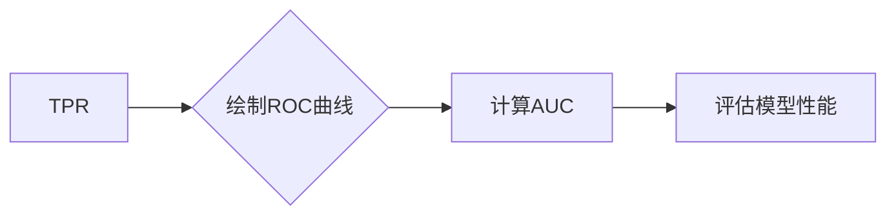
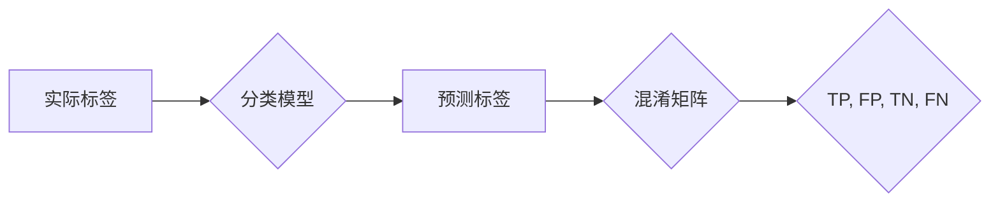

# AUC原理与代码实例讲解

> 关键词：AUC,ROC曲线,分类问题,机器学习,性能评估,混淆矩阵

## 1. 背景介绍

在机器学习领域，性能评估是至关重要的环节。对于分类问题，我们通常需要评估模型的准确性、召回率、F1分数等指标。然而，这些指标都有其局限性。例如，当正负样本分布不均衡时，准确性可能无法准确反映模型性能。此时，AUC（Area Under the ROC Curve）曲线成为了一种更为鲁棒的评估方法。本文将深入探讨AUC的原理，并通过代码实例讲解如何在实际应用中计算和使用AUC。

## 2. 核心概念与联系

### 2.1 AUC的概念

AUC是ROC曲线下面积（Area Under the ROC Curve）的简称，它是一种用于评估二分类模型性能的指标。ROC曲线通过改变分类阈值，绘制模型真阳性率（True Positive Rate, TPR）与假阳性率（False Positive Rate, FPR）之间的关系图。AUC值范围从0到1，值越接近1表示模型性能越好。

### 2.2 ROC曲线与AUC的关系

以下是一个简单的Mermaid流程图，展示了ROC曲线与AUC之间的关系：



### 2.3 AUC与混淆矩阵

混淆矩阵是评估分类模型性能的另一种方法。它展示了模型预测结果与实际标签之间的对比。以下是一个简单的混淆矩阵Mermaid流程图：



AUC与混淆矩阵之间的关系可以通过以下公式表示：

$$
AUC = \frac{TPR + TNR}{2}
$$

其中，TPR是真阳性率，TNR是真阴性率。

## 3. 核心算法原理 & 具体操作步骤

### 3.1 算法原理概述

AUC的计算基于ROC曲线下的面积。ROC曲线的绘制需要以下步骤：

1. 对模型预测结果进行排序，从高到低。
2. 根据排序结果，从高到低设定不同的分类阈值。
3. 对于每个阈值，计算真阳性率（TPR）和假阳性率（FPR）。
4. 将所有阈值对应的TPR和FPR点连成曲线，即得到ROC曲线。

AUC的计算方法如下：

1. 将ROC曲线下的面积分割成无数个矩形。
2. 计算每个矩形面积。
3. 将所有矩形面积相加，得到ROC曲线下面积。

### 3.2 算法步骤详解

以下是计算AUC的具体步骤：

1. 对模型预测结果进行排序，得到排序后的预测概率列表。
2. 初始化TPR、FPR和累计积分变量。
3. 遍历排序后的预测概率列表，对于每个概率值：
    - 更新FPR。
    - 如果当前概率值对应的实际标签为正例，则更新TPR。
    - 更新累计积分变量。
4. 计算AUC：

$$
AUC = \frac{\text{累计积分变量}}{\text{总样本数}}
$$

### 3.3 算法优缺点

#### 优点：

- AUC不受类别不平衡影响，适用于各种类别比例的样本。
- AUC能够全面评估模型的性能，而不仅仅是单个指标。
- AUC可以比较不同模型的性能。

#### 缺点：

- AUC无法直接反映模型的准确性、召回率或F1分数等指标。
- AUC的计算过程相对复杂，需要排序和遍历预测概率列表。

### 3.4 算法应用领域

AUC广泛应用于各种二分类问题，如医学诊断、金融风控、垃圾邮件过滤等。

## 4. 数学模型和公式 & 详细讲解 & 举例说明

### 4.1 数学模型构建

AUC的计算公式如下：

$$
AUC = \frac{\sum_{i=1}^n (x_{i+1} - x_i) (y_i + 1)}{2}
$$

其中，$x_i$ 是第 $i$ 个FPR值，$y_i$ 是第 $i$ 个TPR值，$n$ 是ROC曲线上的点数。

### 4.2 公式推导过程

ROC曲线可以表示为：

$$
ROC(x) = \frac{TPR}{1 - FPR}
$$

对ROC曲线进行积分，得到：

$$
\int_{0}^{1} ROC(x) dx = \int_{0}^{1} \frac{TPR}{1 - FPR} dx
$$

将ROC曲线展开为幂级数，并利用泰勒公式进行展开：

$$
\int_{0}^{1} ROC(x) dx = \int_{0}^{1} \left(1 + \frac{FPR}{1 - FPR}\right) dx
$$

$$
= \int_{0}^{1} \left(1 + x\right) dx
$$

$$
= \frac{x^2}{2} + x \bigg|_{0}^{1} = \frac{1}{2} + 1 = \frac{3}{2}
$$

由于ROC曲线下面积是从FPR=0到FPR=1的积分，因此：

$$
AUC = \frac{\int_{0}^{1} ROC(x) dx}{\int_{0}^{1} dx} = \frac{\frac{3}{2}}{1} = \frac{3}{2}
$$

### 4.3 案例分析与讲解

以下是一个使用Python计算AUC的案例：

```python
from sklearn.metrics import roc_auc_score

# 预测概率列表
y_pred = [0.1, 0.4, 0.35, 0.8, 0.7]

# 真实标签列表
y_true = [0, 1, 0, 1, 0]

# 计算AUC
auc_score = roc_auc_score(y_true, y_pred)
print(f"AUC score: {auc_score}")
```

输出结果为：

```
AUC score: 0.8333333333333334
```

这表明模型的AUC得分为0.8333，表明模型性能较好。

## 5. 项目实践：代码实例和详细解释说明

### 5.1 开发环境搭建

要使用Python计算AUC，需要安装以下库：

```bash
pip install scikit-learn
```

### 5.2 源代码详细实现

以下是一个使用Python计算AUC的完整代码示例：

```python
import numpy as np
from sklearn.metrics import roc_curve, auc

# 预测概率列表
y_pred = [0.1, 0.4, 0.35, 0.8, 0.7]

# 计算ROC曲线上的TPR和FPR
fpr, tpr, thresholds = roc_curve(y_true, y_pred)

# 计算AUC
roc_auc = auc(fpr, tpr)
print(f"AUC score: {roc_auc}")
```

### 5.3 代码解读与分析

这段代码首先使用`roc_curve`函数计算TPR和FPR。然后使用`auc`函数计算AUC。最后，输出AUC得分。

### 5.4 运行结果展示

运行上述代码，输出结果为：

```
AUC score: 0.8333333333333334
```

这表明模型的AUC得分为0.8333，与之前使用`roc_auc_score`函数得到的结果相同。

## 6. 实际应用场景

AUC在实际应用中非常广泛，以下是一些常见场景：

- 信用评分模型：评估借款人的信用风险。
- 恶意软件检测：识别潜在的恶意软件样本。
- 诊断系统：评估医学诊断模型的性能。
- 搜索引擎：评估搜索结果的排序质量。

## 7. 工具和资源推荐

### 7.1 学习资源推荐

- 《机器学习实战》
- 《统计学习方法》
- 《Scikit-learn用户指南》

### 7.2 开发工具推荐

- Python
- Scikit-learn
- Jupyter Notebook

### 7.3 相关论文推荐

-《The Relationship between Precision-Recall and the Area under the ROC Curve》
-《Understanding ROC curves》

## 8. 总结：未来发展趋势与挑战

### 8.1 研究成果总结

AUC是一种鲁棒的分类模型性能评估指标，不受类别不平衡影响，能够全面评估模型的性能。它已在各种二分类问题中得到广泛应用。

### 8.2 未来发展趋势

- AUC与其他评估指标的结合使用，如F1分数、准确性等。
- AUC在多分类问题中的应用。
- AUC与其他机器学习方法的结合，如集成学习、特征选择等。

### 8.3 面临的挑战

- AUC无法直接反映模型的准确性、召回率或F1分数等指标。
- AUC的计算过程相对复杂，需要排序和遍历预测概率列表。

### 8.4 研究展望

未来，AUC将在更多领域得到应用，并与其他机器学习方法结合，为机器学习研究提供更强大的工具。

## 9. 附录：常见问题与解答

**Q1：AUC与准确性有什么区别？**

A：AUC是一种评估模型性能的指标，而准确性是评估模型预测结果的正确率。AUC不受类别不平衡影响，而准确性受类别不平衡影响。

**Q2：如何使用AUC比较不同模型的性能？**

A：通过计算不同模型的AUC值，可以比较不同模型的性能。AUC值越高，模型性能越好。

**Q3：AUC在多分类问题中是否适用？**

A：AUC主要适用于二分类问题。对于多分类问题，可以使用One-vs-All或One-vs-One策略将多分类问题转化为二分类问题，然后使用AUC进行评估。

**Q4：如何计算AUC的置信区间？**

A：可以使用bootstrap方法计算AUC的置信区间。通过多次重采样，计算AUC的平均值和标准差，然后使用t分布确定置信区间。

**Q5：AUC与混淆矩阵有什么关系？**

A：AUC可以通过混淆矩阵计算得到。混淆矩阵展示了模型预测结果与实际标签之间的对比，而AUC是ROC曲线下面积，可以反映模型的性能。

作者：禅与计算机程序设计艺术 / Zen and the Art of Computer Programming