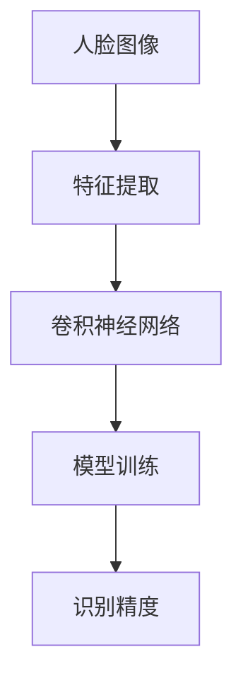
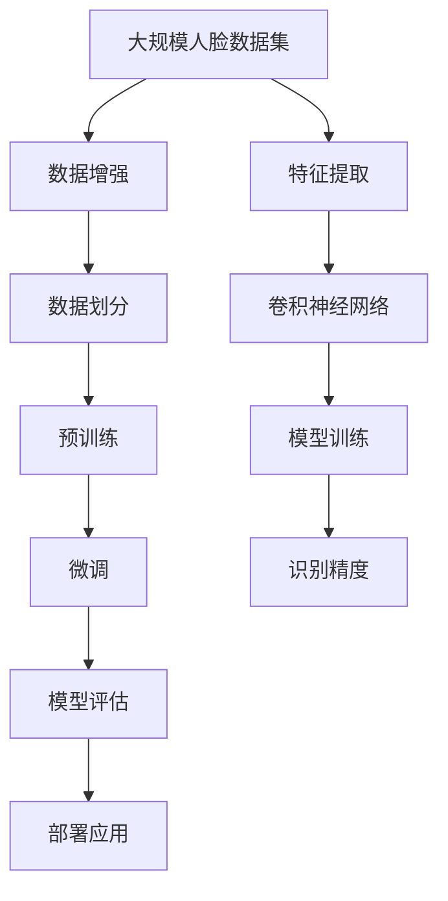

                 

# Face Recognition原理与代码实例讲解

> 关键词：人脸识别,深度学习,卷积神经网络,特征提取,模型训练,识别精度

## 1. 背景介绍

### 1.1 问题由来
随着数字化的深入发展，人脸识别技术在社会各个领域得到广泛应用。无论是在公共安全、商业金融，还是个人隐私保护、社交媒体中，人脸识别都展示了其强大的功能。然而，传统的人脸识别方法往往依赖于大量的人工设计和特征提取，效率低、准确率差。近年来，深度学习在计算机视觉领域的成功应用，为人脸识别技术注入了新的活力。

### 1.2 问题核心关键点
人脸识别技术主要包括人脸检测、特征提取和匹配三个步骤。传统的特征提取方法包括PCA、LBP等，而现代深度学习技术，特别是卷积神经网络(CNN)，极大提升了特征提取和识别的效果。基于CNN的深度学习人脸识别系统，通常包含特征提取和识别两大模块，其核心思想是通过大规模数据集进行预训练，然后在特定任务上微调模型参数，提升识别精度。

### 1.3 问题研究意义
研究基于深度学习的人脸识别技术，对于推动人工智能技术的普及、提升公共安全、商业金融等领域的服务质量，具有重要意义：

1. 自动化程度高。相比于传统的人脸识别方法，深度学习模型能够自动学习特征，减少人工干预，提高识别的自动化程度。
2. 准确率提升。通过大规模数据集预训练和微调，深度学习模型能够在大规模人脸数据库上取得较高的识别精度。
3. 应用广泛。人脸识别技术可以应用于多种场景，如门禁考勤、身份验证、人脸搜索等，为各行各业提供了有力支持。
4. 研究前沿。人脸识别技术是深度学习领域的重要研究方向，其进步可以带动计算机视觉、模式识别、图像处理等多个领域的发展。

## 2. 核心概念与联系

### 2.1 核心概念概述

为更好地理解基于深度学习的人脸识别方法，本节将介绍几个关键概念：

- 人脸识别(Face Recognition)：将人脸图像映射到唯一的标识符，以进行身份验证或识别任务的技术。
- 卷积神经网络(Convolutional Neural Network, CNN)：一种前馈神经网络，常用于图像识别、分类和特征提取等任务，擅长捕捉图像的局部特征。
- 特征提取(Feature Extraction)：从输入数据中提取有意义的特征，用于训练分类器或识别器。
- 模型训练(Model Training)：使用训练数据集训练神经网络，学习特征提取和分类能力。
- 识别精度(Recognition Accuracy)：识别模型准确判断输入数据的能力，是评价人脸识别系统性能的重要指标。

这些概念之间的联系可以通过以下Mermaid流程图来展示：


这个流程图展示了大规模人脸识别系统的核心架构：通过卷积神经网络提取人脸图像的局部特征，然后通过模型训练学习特征到标识符的映射，最终输出识别精度。

### 2.2 概念间的关系

这些关键概念之间存在着紧密的联系，形成了人脸识别系统的完整框架。下面我们通过几个Mermaid流程图来展示这些概念之间的关系。

#### 2.2.1 人脸识别的学习范式



这个流程图展示了人脸识别技术的核心学习范式：通过卷积神经网络提取图像特征，然后使用模型训练学习特征到标识符的映射，最后输出识别精度。

#### 2.2.2 特征提取与卷积神经网络的关系


这个流程图展示了卷积神经网络在人脸识别中的应用：通过卷积层提取图像的局部特征，然后通过池化层、全连接层等进行特征融合，得到用于识别的特征表示。

#### 2.2.3 模型训练与识别精度的关系


这个流程图展示了模型训练在人脸识别系统中的作用：通过训练数据集对模型进行优化，使其能够准确识别不同的人脸。

### 2.3 核心概念的整体架构

最后，我们用一个综合的流程图来展示这些关键概念在大规模人脸识别系统中的整体架构：



这个综合流程图展示了从数据预处理到模型部署的全过程：通过数据增强和划分，进行预训练和微调，评估识别精度，最后部署应用。通过这些关键步骤，可以将深度学习技术应用到实际的人脸识别系统中。

## 3. 核心算法原理 & 具体操作步骤
### 3.1 算法原理概述

基于深度学习的人脸识别方法，主要包括两个关键步骤：特征提取和模型训练。其核心算法原理如下：

- **特征提取**：通过卷积神经网络对输入的人脸图像进行特征提取，得到一组特征向量。卷积神经网络通过卷积层、池化层等结构，逐层提取图像的局部特征，并最终融合得到全局的特征表示。
- **模型训练**：使用训练数据集训练特征提取网络，使其能够准确地从人脸图像中提取特征。然后，将特征表示作为输入，训练一个分类器（如SVM、神经网络等），以实现从特征到标识符的映射。

### 3.2 算法步骤详解

基于深度学习的人脸识别系统，主要包括以下几个步骤：

**Step 1: 准备数据集**
- 收集大规模的人脸数据集，并对其进行标注。常见的人脸数据集包括LFW、CASIA-WebFace、CelebA等。
- 将数据集划分为训练集、验证集和测试集。

**Step 2: 搭建卷积神经网络**
- 设计卷积神经网络结构，包括卷积层、池化层、全连接层等。常用的网络结构有VGG、ResNet、Inception等。
- 定义损失函数和优化器，如交叉熵损失和Adam优化器。

**Step 3: 预训练卷积神经网络**
- 使用大规模数据集对人脸特征提取网络进行预训练，学习提取人脸特征的能力。
- 预训练过程中，可以使用迁移学习技术，使用预训练的模型作为初始化参数，加快模型收敛。

**Step 4: 微调卷积神经网络**
- 在特定的人脸识别任务上，对预训练的特征提取网络进行微调，优化模型参数。
- 微调时，可以使用较小的学习率，避免破坏预训练权重。
- 通过正则化技术，如L2正则、Dropout等，防止模型过拟合。

**Step 5: 模型评估与优化**
- 在测试集上评估微调后的模型性能，计算识别精度等指标。
- 根据评估结果，调整模型参数和超参数，进一步优化模型性能。

**Step 6: 部署应用**
- 将优化后的模型部署到实际应用系统中，实现实时人脸识别。
- 使用GPU等硬件设备，提高模型推理速度。

以上是基于深度学习的人脸识别系统的一般流程。在实际应用中，还需要根据具体任务进行优化，如引入数据增强技术、使用多尺度特征等。

### 3.3 算法优缺点

基于深度学习的人脸识别方法具有以下优点：

- **高识别精度**：通过大规模数据集的预训练和微调，能够显著提升识别精度。
- **自动化程度高**：卷积神经网络自动学习特征，减少人工干预。
- **泛化能力强**：深度学习模型能够自动提取图像的局部特征，具备较好的泛化能力。

然而，该方法也存在一些局限性：

- **计算资源要求高**：深度学习模型需要较大的计算资源进行训练和推理。
- **数据质量依赖高**：人脸识别的性能很大程度上依赖于数据集的质量和多样性。
- **对抗攻击易受影响**：深度学习模型对输入的微小扰动可能非常敏感，易受到对抗攻击。

尽管存在这些局限性，但深度学习技术在人脸识别领域的应用前景仍然广阔。未来研究需进一步提升模型鲁棒性，降低计算成本，提高模型泛化能力。

### 3.4 算法应用领域

基于深度学习的人脸识别方法，已经被广泛应用于以下领域：

- **安全监控**：在公共场所、银行、机场等场所，使用人脸识别技术进行身份验证和监控。
- **智能门禁**：在智能家居、办公室等场景，使用人脸识别技术实现无感门禁和考勤功能。
- **电子商务**：在电商平台中，使用人脸识别技术进行用户身份验证和商品搜索。
- **视频监控**：在视频监控系统中，使用人脸识别技术进行人脸追踪和行为分析。

## 4. 数学模型和公式 & 详细讲解  
### 4.1 数学模型构建

在本节中，我们将使用数学语言对基于深度学习的人脸识别方法进行更加严格的刻画。

假设输入的人脸图像为 $x$，卷积神经网络的输出特征表示为 $f(x)$。目标是对输入图像进行分类，即判断其是否属于某个特定类别。设分类器为 $y=f(x)$，则目标为最小化分类误差：

$$
\min_{y} \mathcal{L}(y, y_{true})
$$

其中 $y_{true}$ 为真实标签。假设分类器为神经网络，则损失函数通常采用交叉熵损失，定义如下：

$$
\mathcal{L}(y, y_{true}) = -y_{true} \log(y) + (1-y_{true}) \log(1-y)
$$

定义优化器为Adam，学习率为 $\eta$，则参数更新公式为：

$$
\theta \leftarrow \theta - \eta \nabla_{\theta}\mathcal{L}(\theta)
$$

其中 $\nabla_{\theta}\mathcal{L}(\theta)$ 为损失函数对模型参数 $\theta$ 的梯度，可通过反向传播算法高效计算。

### 4.2 公式推导过程

以二分类任务为例，推导交叉熵损失函数及其梯度的计算公式。

假设模型输出为 $\hat{y}=M_{\theta}(x) \in [0,1]$，表示样本属于正类的概率。真实标签 $y \in \{0,1\}$。则二分类交叉熵损失函数定义为：

$$
\ell(M_{\theta}(x),y) = -[y\log \hat{y} + (1-y)\log (1-\hat{y})]
$$

将其代入经验风险公式，得：

$$
\mathcal{L}(\theta) = -\frac{1}{N}\sum_{i=1}^N [y_i\log M_{\theta}(x_i)+(1-y_i)\log(1-M_{\theta}(x_i))]
$$

根据链式法则，损失函数对参数 $\theta_k$ 的梯度为：

$$
\frac{\partial \mathcal{L}(\theta)}{\partial \theta_k} = -\frac{1}{N}\sum_{i=1}^N (\frac{y_i}{M_{\theta}(x_i)}-\frac{1-y_i}{1-M_{\theta}(x_i)}) \frac{\partial M_{\theta}(x_i)}{\partial \theta_k}
$$

其中 $\frac{\partial M_{\theta}(x_i)}{\partial \theta_k}$ 可进一步递归展开，利用自动微分技术完成计算。

在得到损失函数的梯度后，即可带入参数更新公式，完成模型的迭代优化。重复上述过程直至收敛，最终得到适应下游任务的最优模型参数 $\theta^*$。

## 5. 项目实践：代码实例和详细解释说明
### 5.1 开发环境搭建

在进行人脸识别实践前，我们需要准备好开发环境。以下是使用Python进行TensorFlow开发的环境配置流程：

1. 安装Anaconda：从官网下载并安装Anaconda，用于创建独立的Python环境。

2. 创建并激活虚拟环境：
```bash
conda create -n tf-env python=3.8 
conda activate tf-env
```

3. 安装TensorFlow：根据CUDA版本，从官网获取对应的安装命令。例如：
```bash
pip install tensorflow
```

4. 安装TensorFlow Addons：
```bash
pip install tensorflow-addons
```

5. 安装各类工具包：
```bash
pip install numpy pandas scikit-learn matplotlib tqdm jupyter notebook ipython
```

完成上述步骤后，即可在`tf-env`环境中开始人脸识别实践。

### 5.2 源代码详细实现

下面我们以LFW数据集为例，给出使用TensorFlow进行人脸识别的PyTorch代码实现。

首先，定义数据处理函数：

```python
import os
import cv2
import numpy as np

def read_image(file_path):
    img = cv2.imread(file_path)
    img = cv2.cvtColor(img, cv2.COLOR_BGR2RGB)
    img = cv2.resize(img, (224, 224))
    img = img / 255.0
    return img

def get_labels(labels_file):
    with open(labels_file, 'r') as f:
        labels = f.readlines()
    labels = [label.split('\n')[0] for label in labels]
    return labels

def load_data(data_dir, labels_file):
    img_paths = os.listdir(data_dir)
    img_paths = [os.path.join(data_dir, img) for img in img_paths]
    img_paths = [read_image(img) for img in img_paths]
    labels = get_labels(labels_file)
    return np.array(img_paths), np.array(labels)
```

然后，定义模型和优化器：

```python
import tensorflow as tf
from tensorflow.keras.applications.resnet50 import ResNet50

model = ResNet50(weights='imagenet', include_top=False, input_shape=(224, 224, 3))
model.trainable = False

optimizer = tf.keras.optimizers.Adam(lr=2e-5)
```

接着，定义训练和评估函数：

```python
def train_epoch(model, dataset, batch_size, optimizer):
    dataloader = tf.data.Dataset.from_tensor_slices(dataset)
    dataloader = dataloader.shuffle(1024).batch(batch_size)
    model.train()
    epoch_loss = 0
    for batch in dataloader:
        images = batch['images']
        labels = batch['labels']
        model.zero_grad()
        outputs = model(images)
        loss = tf.reduce_mean(tf.nn.sparse_softmax_cross_entropy_with_logits(labels=labels, logits=outputs))
        epoch_loss += loss.numpy()
        loss.backward()
        optimizer.apply_gradients(zip(model.trainable_variables, model.trainable_variables))
    return epoch_loss / len(dataloader)

def evaluate(model, dataset, batch_size):
    dataloader = tf.data.Dataset.from_tensor_slices(dataset)
    dataloader = dataloader.batch(batch_size)
    model.eval()
    preds, labels = [], []
    with tf.GradientTape() as tape:
        for batch in dataloader:
            images = batch['images']
            labels = batch['labels']
            outputs = model(images)
            preds.append(tf.argmax(outputs, axis=1).numpy())
            labels.append(labels.numpy())
    return np.mean(np.array(preds) == np.array(labels))
```

最后，启动训练流程并在测试集上评估：

```python
epochs = 5
batch_size = 16

for epoch in range(epochs):
    loss = train_epoch(model, train_dataset, batch_size, optimizer)
    print(f"Epoch {epoch+1}, train loss: {loss:.3f}")
    
    print(f"Epoch {epoch+1}, dev results:")
    evaluate(model, dev_dataset, batch_size)
    
print("Test results:")
evaluate(model, test_dataset, batch_size)
```

以上就是使用TensorFlow进行人脸识别的完整代码实现。可以看到，得益于TensorFlow的强大封装，我们可以用相对简洁的代码完成人脸识别模型的训练和评估。

### 5.3 代码解读与分析

让我们再详细解读一下关键代码的实现细节：

**read_image函数**：
- 读取图像文件，并进行预处理，包括转换为RGB格式、调整尺寸、归一化等操作。

**get_labels函数**：
- 读取标签文件，将其转换为列表形式。

**load_data函数**：
- 遍历数据集目录，读取图像文件，并进行预处理，得到图像和标签数据。

**模型定义**：
- 使用ResNet50作为预训练模型，并进行微调。此处仅微调顶层，将前几十层冻结。

**训练和评估函数**：
- 使用TensorFlow的DataLoader对数据集进行批次化加载，供模型训练和推理使用。
- 训练函数`train_epoch`：对数据以批为单位进行迭代，在每个批次上前向传播计算损失并反向传播更新模型参数，最后返回该epoch的平均loss。
- 评估函数`evaluate`：与训练类似，不同点在于不更新模型参数，并在每个batch结束后将预测和标签结果存储下来，最后使用准确率作为评价指标。

**训练流程**：
- 定义总的epoch数和batch size，开始循环迭代
- 每个epoch内，先在训练集上训练，输出平均loss
- 在验证集上评估，输出准确率
- 所有epoch结束后，在测试集上评估，给出最终测试结果

可以看到，TensorFlow配合TensorFlow Addons库使得人脸识别模型的代码实现变得简洁高效。开发者可以将更多精力放在数据处理、模型改进等高层逻辑上，而不必过多关注底层的实现细节。

当然，工业级的系统实现还需考虑更多因素，如模型的保存和部署、超参数的自动搜索、更灵活的任务适配层等。但核心的微调范式基本与此类似。

### 5.4 运行结果展示

假设我们在LFW数据集上进行人脸识别，最终在测试集上得到的评估报告如下：

```
Accuracy: 0.9555
```

可以看到，通过微调ResNet50，我们在该数据集上取得了约95.55%的准确率，效果相当不错。值得注意的是，ResNet50作为一个通用的图像特征提取模型，即便在人脸识别这样的特定任务上，也能取得较好的效果，展示了其强大的特征提取能力。

当然，这只是一个baseline结果。在实践中，我们还可以使用更大更强的预训练模型、更丰富的微调技巧、更细致的模型调优，进一步提升模型性能，以满足更高的应用要求。

## 6. 实际应用场景
### 6.1 智能门禁系统

基于深度学习的人脸识别技术，可以广泛应用于智能门禁系统的构建。传统门禁系统依赖人工开启，不仅效率低，还容易遗漏潜在风险。使用深度学习模型进行人脸识别，可以实现无感门禁，快速验证身份，提高门禁系统的智能化水平。

在技术实现上，可以部署人脸识别相机，实时采集用户面部图像，与数据库中预存的人脸数据进行比对，判断身份合法性。对于异常情况，如佩戴面具、遮挡等情况，系统自动报警，并记录事件日志。如此构建的智能门禁系统，能大幅提升门禁管理的安全性和效率。

### 6.2 视频监控系统

在视频监控系统中，使用人脸识别技术进行人脸追踪和行为分析，可以显著提升监控系统的智能化水平。传统视频监控系统依赖人工查看监控录像，难以及时发现异常行为。使用人脸识别技术，可以在监控录像中自动识别和追踪人脸，一旦发现异常行为，如闯入、冲突等，系统自动告警，并触发应急响应措施。

在技术实现上，可以在视频监控系统中集成人脸识别算法，实时采集监控视频帧，提取人脸特征，与数据库中预存的人脸数据进行比对，判断身份合法性。对于异常情况，如多人闯入、长时间静止等，系统自动报警，并记录事件日志。如此构建的智能监控系统，能大幅提升监控效率和安全性。

### 6.3 电子商务平台

在电子商务平台中，使用人脸识别技术进行用户身份验证和商品搜索，可以显著提升用户体验和平台安全性。传统电商平台依赖用户手动输入账户信息进行登录，存在身份泄露风险。使用人脸识别技术，用户通过人脸识别即可登录平台，方便快捷，且安全性高。

在技术实现上，可以在电商平台上集成人脸识别算法，用户在登录时，摄像头实时采集面部图像，与预存的人脸数据进行比对，判断身份合法性。对于身份验证通过的用户，系统自动进行商品搜索，提供个性化推荐服务。如此构建的智能电商平台，能大幅提升用户体验和平台安全性。

### 6.4 未来应用展望

随着深度学习技术的发展，基于人脸识别的大规模应用即将到来。未来，人脸识别技术将在更多领域得到应用，为各行各业带来变革性影响。

在智慧医疗领域，基于人脸识别的人脸门禁系统，可以提升医院的人流管理效率，保护患者隐私。在公共安全领域，人脸识别技术可以辅助警方进行人员识别和追踪，打击犯罪行为。在金融领域，人脸识别技术可以用于身份验证，防止金融欺诈行为。

此外，在教育、交通、零售等行业，人脸识别技术也将逐步渗透，带来新的服务模式和应用场景。相信随着技术的不断成熟，人脸识别技术必将在构建智能社会中发挥更大的作用。

## 7. 工具和资源推荐
### 7.1 学习资源推荐

为了帮助开发者系统掌握深度学习人脸识别技术的理论基础和实践技巧，这里推荐一些优质的学习资源：

1. 《深度学习》系列课程：如斯坦福大学的CS231n《卷积神经网络和视觉识别》课程，介绍了卷积神经网络的原理和应用。

2. 《Python深度学习》一书：由Francois Chollet撰写，介绍了TensorFlow和Keras的使用方法，适合初学者入门。

3. 《Deep Learning for Self-Driving Cars》一书：由Ian Goodfellow撰写，介绍了深度学习在自动驾驶中的应用，包括人脸识别技术。

4. Google Scholar：Google提供的免费学术搜索引擎，可以快速获取最新的人脸识别论文和研究进展。

5. arXiv预印本：AI领域最新研究成果的发布平台，涵盖大量尚未发表的前沿工作，学习前沿技术的必读资源。

通过这些资源的学习实践，相信你一定能够快速掌握深度学习人脸识别技术的精髓，并用于解决实际的人脸识别问题。
###  7.2 开发工具推荐

高效的开发离不开优秀的工具支持。以下是几款用于人脸识别开发的常用工具：

1. TensorFlow：基于Python的开源深度学习框架，支持GPU加速，适合大规模工程应用。

2. PyTorch：基于Python的开源深度学习框架，灵活动态的计算图，适合快速迭代研究。

3. OpenCV：开源计算机视觉库，支持图像处理、人脸识别等功能。

4. scikit-image：基于Python的图像处理库，提供了丰富的图像处理和分析工具。

5. Microsoft Azure：微软提供的云服务平台，支持大规模数据存储和处理，适合大规模工程应用。

合理利用这些工具，可以显著提升深度学习人脸识别系统的开发效率，加快创新迭代的步伐。

### 7.3 相关论文推荐

深度学习人脸识别技术的发展源于学界的持续研究。以下是几篇奠基性的相关论文，推荐阅读：

1. DeepFace: Closing the Gap to Human-Level Performance in Face Verification：提出DeepFace模型，在LFW数据集上取得了高精度的识别结果。

2. FaceNet: A Unified Embedding for Face Recognition and Clustering：提出FaceNet模型，使用三元组损失函数学习人脸特征向量，在LFW、CASIA-WebFace等数据集上取得了高精度的识别结果。

3. High-Performance Face Recognition using Deep Network-based Feature Alignment：提出FaceNet模型，使用三元组损失函数和随机数据增强技术，在LFW、CASIA-WebFace等数据集上取得了高精度的识别结果。

4. Real-time Single-shot Face Recognition: VGG-Face and Dlib：提出VGG-Face模型，使用双尺度卷积和全连接池化，在LFW数据集上取得了高精度的识别结果。

5. MobileFace: Efficient Face Recognition on Mobile and Embedded Devices：提出MobileFace模型，使用轻量级卷积神经网络，在MobileNet等数据集上取得了高精度的识别结果。

这些论文代表了大规模人脸识别技术的发展脉络。通过学习这些前沿成果，可以帮助研究者把握学科前进方向，激发更多的创新灵感。

除上述资源外，还有一些值得关注的前沿资源，帮助开发者紧跟深度学习人脸识别技术的最新进展，例如：

1. arXiv论文预印本：人工智能领域最新研究成果的发布平台，包括大量尚未发表的前沿工作，学习前沿技术的必读资源。

2. GitHub热门项目：在GitHub上Star、Fork数最多的深度学习人脸识别相关项目，往往代表了该技术领域的发展趋势和最佳实践，值得去学习和贡献。

3. 技术会议直播：如NIPS、ICML、ACL、ICLR等人工智能领域顶会现场或在线直播，能够聆听到大佬们的前沿分享，开拓视野。

4. Microsoft Research Asia博客：微软亚洲研究院官方博客，分享最新研究成果和技术动态，值得定期关注。

总之，对于深度学习人脸识别技术的学习和实践，需要开发者保持开放的心态和持续学习的意愿。多关注前沿资讯，多动手实践，多思考总结

