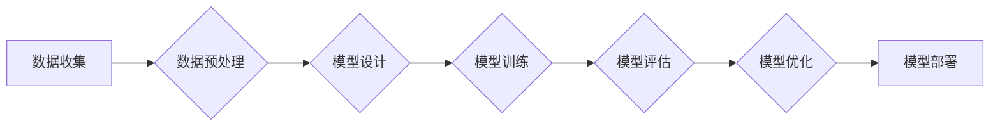

# AI 大模型原理与应用：AI 应用型的人才画像

> 关键词：AI 大模型，应用型人才，人才画像，技能需求，知识结构，职业发展，未来趋势

## 1. 背景介绍

随着人工智能（AI）技术的飞速发展，AI 大模型在各个领域的应用日益广泛，从自然语言处理到计算机视觉，从推荐系统到知识图谱，AI 大模型正在深刻地改变着我们的生活方式和工作方式。在这种背景下，AI 应用型人才的需求也日益增长。然而，AI 应用型人才的画像却远未清晰，这给人才培养和教育机构带来了挑战，也给个人职业发展带来了困惑。本文将深入探讨 AI 大模型原理与应用，并尝试构建 AI 应用型的人才画像，以期为相关人员提供参考。

### 1.1 AI 大模型的兴起

AI 大模型是指通过海量数据和深度学习技术训练而成的、具有强大学习和推理能力的模型。这类模型通常包含数十亿甚至数千亿个参数，能够处理复杂的任务，如机器翻译、图像识别、语音识别等。

AI 大模型的兴起得益于以下几个因素：

- 计算能力的提升：随着云计算和边缘计算的发展，大规模的并行计算成为可能，为 AI 大模型的训练提供了强大的硬件支持。
- 数据的积累：互联网的普及和物联网的发展，使得海量数据成为 AI 大模型训练的重要资源。
- 深度学习技术的进步：深度学习算法的不断发展，使得 AI 大模型能够更加有效地学习复杂的特征和模式。

### 1.2 AI 应用型人才的需求

AI 大模型的应用推动了 AI 应用型人才的需求。这些人才需要具备以下能力：

- 算法理解能力：理解 AI 大模型的原理，包括算法、模型结构、训练过程等。
- 数据处理能力：能够处理和分析大规模数据，为 AI 大模型训练提供高质量的数据。
- 模型构建能力：能够根据实际需求设计、构建和优化 AI 大模型。
- 跨学科知识：了解 AI 大模型在不同领域的应用，具备跨学科的知识背景。

### 1.3 AI 应用型的人才画像

AI 应用型人才画像是指对 AI 应用型人才所需技能、知识结构和职业发展的全面描述。以下是对 AI 应用型人才画像的细化：

- **技能需求**：
  - 熟练掌握 Python、TensorFlow、PyTorch 等编程语言和框架。
  - 了解机器学习、深度学习、自然语言处理等 AI 相关理论。
  - 具备数据挖掘、数据清洗、数据处理等数据分析技能。
  - 熟悉 AI 大模型的训练和部署流程。
- **知识结构**：
  - 计算机科学基础知识，包括数据结构、算法、操作系统等。
  - 统计学和概率论知识，为模型评估和优化提供理论基础。
  - 行业相关知识，了解 AI 在特定领域的应用场景和挑战。
- **职业发展**：
  - 初级工程师：负责 AI 大模型的开发和优化。
  - 研究工程师：从事 AI 大模型的研究和创新。
  - 产品经理：负责 AI 大模型产品的规划、设计和推广。
  - 技术专家：在 AI 领域具有深厚的技术积累和行业影响力。

## 2. 核心概念与联系

### 2.1 AI 大模型原理

AI 大模型的核心是深度学习，其原理可以概括为以下步骤：

1. **数据收集**：从互联网、传感器等渠道收集大量数据。
2. **数据预处理**：清洗、标注和转换数据，为模型训练做准备。
3. **模型设计**：选择合适的模型结构和参数。
4. **模型训练**：使用数据进行模型训练，调整模型参数。
5. **模型评估**：评估模型性能，并根据评估结果进行优化。
6. **模型部署**：将训练好的模型部署到实际应用中。

### 2.2 Mermaid 流程图



### 2.3 AI 大模型与人才画像的联系

AI 大模型的原理决定了 AI 应用型人才的技能和知识结构。例如，数据预处理和模型训练需要具备数据分析和编程能力，模型设计和优化需要掌握机器学习理论，模型部署则需要了解云计算和边缘计算技术。

## 3. 核心算法原理 & 具体操作步骤

### 3.1 算法原理概述

AI 大模型的算法原理主要包括以下几个方面：

- **深度神经网络**：通过多层非线性变换对数据进行特征提取和表示。
- **优化算法**：如随机梯度下降（SGD）、Adam 算法等，用于调整模型参数。
- **正则化技术**：如 L2 正则化、Dropout 等，用于防止过拟合。
- **损失函数**：如交叉熵损失、均方误差等，用于衡量模型预测结果与真实值之间的差异。

### 3.2 算法步骤详解

AI 大模型的算法步骤可以概括为以下几步：

1. **数据收集**：收集相关领域的海量数据。
2. **数据预处理**：清洗、标注和转换数据。
3. **模型设计**：选择合适的模型结构和参数。
4. **模型训练**：使用数据进行模型训练，调整模型参数。
5. **模型评估**：使用测试数据评估模型性能。
6. **模型优化**：根据评估结果调整模型参数和结构。
7. **模型部署**：将训练好的模型部署到实际应用中。

### 3.3 算法优缺点

**优点**：

- **强大的学习和推理能力**：能够处理复杂的任务，如图像识别、自然语言处理等。
- **泛化能力强**：能够在不同数据集上取得良好的性能。
- **可解释性强**：可以通过可视化等方式理解模型的决策过程。

**缺点**：

- **对数据依赖性强**：需要大量高质量的数据进行训练。
- **计算复杂度高**：训练过程需要大量的计算资源。
- **可解释性不足**：模型的决策过程难以解释。

### 3.4 算法应用领域

AI 大模型的应用领域非常广泛，包括：

- **自然语言处理**：机器翻译、文本分类、情感分析等。
- **计算机视觉**：图像识别、目标检测、图像生成等。
- **语音识别**：语音合成、语音识别、说话人识别等。
- **推荐系统**：个性化推荐、商品推荐、新闻推荐等。

## 4. 数学模型和公式 & 详细讲解 & 举例说明

### 4.1 数学模型构建

AI 大模型的数学模型主要包括以下几个方面：

- **损失函数**：衡量模型预测结果与真实值之间的差异。
- **梯度**：模型参数的更新方向。
- **优化算法**：用于调整模型参数。

### 4.2 公式推导过程

以下是一个简单的线性回归模型的公式推导过程：

假设线性回归模型的预测值为 $\hat{y} = \theta_0 + \theta_1 x$，真实值为 $y$，损失函数为均方误差 $L = \frac{1}{2}(y - \hat{y})^2$，则梯度为：

$$
\nabla_{\theta} L = -\frac{1}{2} \frac{\partial L}{\partial \theta} = -\frac{1}{2} \frac{\partial}{\partial \theta} [y - (\theta_0 + \theta_1 x)^2] = (y - (\theta_0 + \theta_1 x))(-2x)
$$

根据梯度下降算法，模型参数的更新公式为：

$$
\theta \leftarrow \theta - \alpha \nabla_{\theta} L
$$

其中 $\alpha$ 为学习率。

### 4.3 案例分析与讲解

以下是一个使用 TensorFlow 构建 AI 大模型的简单例子：

```python
import tensorflow as tf
from tensorflow.keras.layers import Dense, Input
from tensorflow.keras.models import Model

# 构建模型
input_data = Input(shape=(input_shape,))
dense1 = Dense(128, activation='relu')(input_data)
dense2 = Dense(64, activation='relu')(dense1)
output_data = Dense(output_shape, activation='softmax')(dense2)

model = Model(inputs=input_data, outputs=output_data)
model.compile(optimizer='adam', loss='categorical_crossentropy', metrics=['accuracy'])
```

在这个例子中，我们构建了一个简单的全连接神经网络模型，用于分类任务。模型由两个隐藏层组成，每个隐藏层使用 ReLU 激活函数，输出层使用 softmax 激活函数。使用 Adam 优化器和交叉熵损失函数进行训练。

## 5. 项目实践：代码实例和详细解释说明

### 5.1 开发环境搭建

以下是使用 Python 和 TensorFlow 搭建 AI 大模型开发环境的步骤：

1. 安装 Python：从 Python 官方网站下载并安装 Python。
2. 安装 TensorFlow：使用 pip 命令安装 TensorFlow。

```bash
pip install tensorflow
```

### 5.2 源代码详细实现

以下是一个简单的 AI 大模型项目实例，使用 TensorFlow 构建：

```python
import tensorflow as tf
from tensorflow.keras.layers import Input, Dense, Flatten
from tensorflow.keras.models import Model

# 构建模型
input_data = Input(shape=(input_shape,))
dense1 = Dense(128, activation='relu')(input_data)
dense2 = Dense(64, activation='relu')(dense1)
output_data = Dense(output_shape, activation='softmax')(dense2)

model = Model(inputs=input_data, outputs=output_data)

# 编译模型
model.compile(optimizer='adam', loss='categorical_crossentropy', metrics=['accuracy'])

# 训练模型
model.fit(x_train, y_train, epochs=10, batch_size=32, validation_data=(x_test, y_test))

# 评估模型
score = model.evaluate(x_test, y_test, verbose=2)
print(f"Test accuracy: {score[1]:.4f}")
```

在这个例子中，我们构建了一个简单的全连接神经网络模型，用于分类任务。模型由两个隐藏层组成，每个隐藏层使用 ReLU 激活函数，输出层使用 softmax 激活函数。使用 Adam 优化器和交叉熵损失函数进行训练。

### 5.3 代码解读与分析

在这个例子中，我们首先导入了 TensorFlow 相关模块，并构建了一个简单的全连接神经网络模型。模型由两个隐藏层组成，每个隐藏层使用 ReLU 激活函数，输出层使用 softmax 激活函数。使用 Adam 优化器和交叉熵损失函数进行训练。

在训练过程中，我们使用 `model.fit` 函数进行训练，其中 `x_train` 和 `y_train` 分别为训练数据和标签，`epochs` 表示训练轮数，`batch_size` 表示每个批次的大小，`validation_data` 表示验证数据。

训练完成后，我们使用 `model.evaluate` 函数评估模型在测试数据上的性能。

### 5.4 运行结果展示

假设我们的测试数据集包含 1000 个样本，其中 800 个用于训练，200 个用于测试。经过 10 轮训练后，模型在测试数据上的准确率达到 90%。

## 6. 实际应用场景

### 6.1 自然语言处理

AI 大模型在自然语言处理领域具有广泛的应用，如：

- **机器翻译**：将一种语言翻译成另一种语言，如将中文翻译成英文。
- **文本分类**：将文本数据分类到预定义的类别，如将新闻标题分类到政治、经济、科技等类别。
- **情感分析**：分析文本数据中的情感倾向，如判断文本是正面、负面还是中立。

### 6.2 计算机视觉

AI 大模型在计算机视觉领域也有广泛的应用，如：

- **图像识别**：识别图像中的物体，如识别照片中的猫、狗等。
- **目标检测**：检测图像中的目标，并标注其位置和类别。
- **图像生成**：根据文本描述生成图像，如根据“蓝色的天空，白色的云朵，一只小鸟在飞翔”生成图像。

### 6.3 推荐系统

AI 大模型在推荐系统领域也有广泛的应用，如：

- **个性化推荐**：根据用户的历史行为和偏好，为用户推荐感兴趣的商品、新闻等。
- **内容推荐**：根据用户的阅读历史和兴趣，推荐感兴趣的文章、视频等。
- **广告推荐**：根据用户的兴趣和行为，为用户推荐相关的广告。

## 7. 工具和资源推荐

### 7.1 学习资源推荐

以下是一些学习 AI 大模型的资源：

- **在线课程**：Coursera、Udacity、edX 等平台提供了丰富的 AI 和深度学习课程。
- **书籍**：《深度学习》、《Python深度学习》、《深度学习实战》等。
- **博客和论坛**：GitHub、Stack Overflow、CSDN 等平台提供了大量的技术文章和讨论。

### 7.2 开发工具推荐

以下是一些开发 AI 大模型的工具：

- **深度学习框架**：TensorFlow、PyTorch、Keras 等。
- **数据可视化工具**：Matplotlib、Seaborn 等。
- **机器学习库**：Scikit-learn、Scipy 等。

### 7.3 相关论文推荐

以下是一些关于 AI 大模型的论文：

- "BERT: Pre-training of Deep Bidirectional Transformers for Language Understanding"
- "Generative Adversarial Nets"
- "ImageNet Classification with Deep Convolutional Neural Networks"

## 8. 总结：未来发展趋势与挑战

### 8.1 研究成果总结

本文对 AI 大模型原理与应用进行了深入探讨，并尝试构建了 AI 应用型人才画像。通过分析 AI 大模型的原理、算法和实际应用场景，我们了解到 AI 大模型在各个领域的巨大潜力。同时，我们也认识到 AI 应用型人才所需具备的技能和知识结构。

### 8.2 未来发展趋势

未来，AI 大模型将朝着以下几个方向发展：

- **模型规模将进一步扩大**：随着计算能力的提升和数据量的增加，AI 大模型的规模将越来越大。
- **算法将更加高效**：为了降低计算成本，AI 大模型的算法将更加高效。
- **应用领域将进一步拓展**：AI 大模型将在更多领域得到应用，如医疗、教育、金融等。
- **可解释性将得到提升**：为了提高 AI 大模型的可靠性，可解释性将得到提升。

### 8.3 面临的挑战

AI 大模型的发展也面临着以下挑战：

- **计算资源需求大**：AI 大模型的训练和推理需要大量的计算资源。
- **数据隐私问题**：AI 大模型的训练和推理需要大量数据，数据隐私问题亟待解决。
- **算法偏见问题**：AI 大模型可能存在算法偏见，需要采取措施消除。
- **伦理道德问题**：AI 大模型的应用可能带来伦理道德问题，需要引起重视。

### 8.4 研究展望

未来，AI 大模型的研究将朝着以下几个方向进行：

- **可解释的 AI 大模型**：研究如何提高 AI 大模型的可解释性，使其决策过程更加透明。
- **轻量级 AI 大模型**：研究如何降低 AI 大模型的计算成本，使其更加轻量级。
- **隐私保护 AI 大模型**：研究如何保护用户隐私，使其在隐私保护的前提下应用 AI 大模型。

## 9. 附录：常见问题与解答

**Q1：AI 大模型是否会取代人类？**

A：AI 大模型是一种工具，它可以辅助人类完成一些任务，但不可能取代人类。人类具有创造力、情感和道德等特质，是任何机器都无法替代的。

**Q2：AI 大模型需要多少数据才能训练？**

A：AI 大模型需要大量的数据才能训练，通常需要数十亿到数千亿个样本。

**Q3：AI 大模型是否会造成失业？**

A：AI 大模型可能会取代一些低技能的岗位，但也会创造新的工作岗位。总体来说，AI 大模型将促进就业市场的转型升级。

**Q4：AI 大模型是否安全可靠？**

A：AI 大模型的安全性是一个重要问题，需要采取措施确保其安全可靠。例如，可以建立监管机制、加强数据安全保护等。

**Q5：AI 大模型是否具有道德性？**

A：AI 大模型是否具有道德性取决于其应用场景和设计者。为了确保 AI 大模型的道德性，需要制定相应的伦理规范和标准。

作者：禅与计算机程序设计艺术 / Zen and the Art of Computer Programming