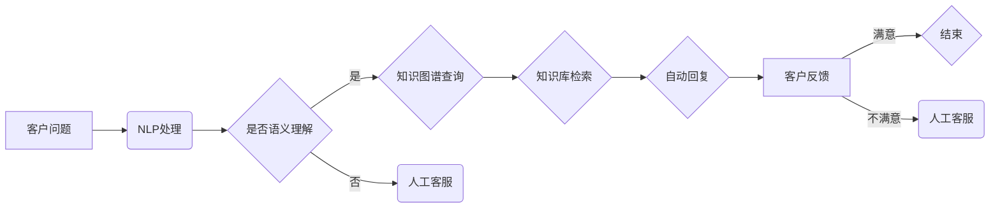

> 关键词：AI, 客户服务，流程优化，机器学习，自然语言处理，知识图谱，自动化，个性化

# AI驱动的客户服务流程优化

在当今数字化时代，客户服务成为企业竞争的关键因素。随着人工智能（AI）技术的迅猛发展，AI驱动的客户服务流程优化成为提升客户满意度、降低服务成本、增强企业竞争力的有效途径。本文将深入探讨AI在客户服务流程优化中的应用，包括核心概念、算法原理、项目实践、实际应用场景、未来展望等方面。

## 1. 背景介绍

### 1.1 客户服务的重要性

客户服务是连接企业与客户的桥梁，它不仅关乎客户满意度和忠诚度，也直接影响企业的品牌形象和市场竞争力。在竞争激烈的商业环境中，如何提供高效、便捷、个性化的客户服务成为企业关注的焦点。

### 1.2 传统客户服务的挑战

传统的客户服务模式依赖大量人力，存在以下挑战：

- 服务响应速度慢，客户等待时间长
- 服务一致性差，不同客服人员水平参差不齐
- 服务成本高，难以满足日益增长的服务需求
- 服务个性化不足，难以满足不同客户的个性化需求

### 1.3 AI技术带来的机遇

AI技术的快速发展为优化客户服务流程提供了新的解决方案。通过AI，企业可以实现以下目标：

- 提高服务效率，缩短客户等待时间
- 提升服务一致性，保证服务质量
- 降低服务成本，提高资源利用率
- 个性化服务，提升客户满意度

## 2. 核心概念与联系

### 2.1 AI核心概念

#### 2.1.1 自然语言处理（NLP）

NLP是AI技术在客户服务中的核心组成部分，它使计算机能够理解和处理人类语言。NLP技术包括文本分类、情感分析、实体识别、机器翻译等。

#### 2.1.2 机器学习（ML）

机器学习是AI技术的基石，它使计算机能够从数据中学习并做出决策。在客户服务中，机器学习可以用于分类、聚类、预测等任务。

#### 2.1.3 知识图谱（KG）

知识图谱是一种结构化知识库，用于表示实体、属性和关系。在客户服务中，知识图谱可以用于构建领域知识库，提高服务智能化水平。

### 2.2 Mermaid流程图



## 3. 核心算法原理 & 具体操作步骤

### 3.1 算法原理概述

AI驱动的客户服务流程优化主要基于以下算法：

- **自然语言处理（NLP）**：通过NLP技术，将客户的自然语言问题转化为计算机可理解的结构化数据。
- **知识图谱（KG）**：利用知识图谱构建领域知识库，提高服务智能化水平。
- **机器学习（ML）**：通过机器学习算法，实现自动回复和智能推荐等功能。

### 3.2 算法步骤详解

#### 3.2.1 数据收集与预处理

收集客户服务数据，包括问题、答案、客服人员信息等。对数据进行清洗、去重、分词等预处理操作。

#### 3.2.2 模型训练

使用NLP、ML算法对数据集进行训练，构建知识图谱，训练模型参数。

#### 3.2.3 服务流程

1. 客户提出问题。
2. NLP处理客户问题，进行语义理解和知识图谱查询。
3. 根据查询结果，模型进行知识库检索和自动回复。
4. 客户反馈满意度。
5. 根据反馈结果，调整模型参数或人工客服介入。

### 3.3 算法优缺点

#### 3.3.1 优点

- 提高服务效率，缩短客户等待时间
- 提升服务一致性，保证服务质量
- 降低服务成本，提高资源利用率
- 个性化服务，提升客户满意度

#### 3.3.2 缺点

- 初始化成本高，需要大量标注数据和计算资源
- 模型可解释性差，难以解释决策过程
- 需要不断更新模型参数，以适应不断变化的服务需求

### 3.4 算法应用领域

AI驱动的客户服务流程优化适用于以下领域：

- 客户服务热线
- 电商客服
- 金融客服
- 健康医疗客服
- 教育咨询

## 4. 数学模型和公式 & 详细讲解 & 举例说明

### 4.1 数学模型构建

AI驱动的客户服务流程优化涉及多种数学模型，包括：

- **文本分类模型**：如朴素贝叶斯、支持向量机（SVM）、卷积神经网络（CNN）等。
- **情感分析模型**：如情感词典、机器学习分类器等。
- **知识图谱表示学习模型**：如TransE、TransH等。

### 4.2 公式推导过程

以朴素贝叶斯文本分类模型为例，其公式如下：

$$
P(y|x) = \frac{P(x|y)P(y)}{P(x)}
$$

其中，$P(y|x)$ 表示在给定特征 $x$ 下，类别 $y$ 的概率；$P(x|y)$ 表示在类别 $y$ 下，特征 $x$ 的概率；$P(y)$ 表示类别 $y$ 的先验概率。

### 4.3 案例分析与讲解

以某电商平台的客户服务为例，使用朴素贝叶斯模型进行产品评论情感分析。

1. 数据收集：收集电商平台的产品评论数据，并进行预处理。
2. 模型训练：使用预处理后的数据，训练朴素贝叶斯模型。
3. 情感分析：对新的产品评论进行情感分析，判断评论是正面、负面还是中性。

## 5. 项目实践：代码实例和详细解释说明

### 5.1 开发环境搭建

1. 安装Python环境。
2. 安装NLP、ML相关库，如NLTK、Scikit-learn、TensorFlow等。

### 5.2 源代码详细实现

以下是一个使用Scikit-learn实现朴素贝叶斯文本分类器的示例代码：

```python
from sklearn.feature_extraction.text import CountVectorizer
from sklearn.model_selection import train_test_split
from sklearn.naive_bayes import MultinomialNB
from sklearn.metrics import classification_report

# 加载数据
data = ...  # 加载产品评论数据
X = [text for text in data['comment']]
y = [label for label in data['sentiment']]

# 数据预处理
vectorizer = CountVectorizer()
X_vectorized = vectorizer.fit_transform(X)

# 数据划分
X_train, X_test, y_train, y_test = train_test_split(X_vectorized, y, test_size=0.2, random_state=42)

# 模型训练
model = MultinomialNB()
model.fit(X_train, y_train)

# 情感分析
X_test_vectorized = vectorizer.transform(X_test)
y_pred = model.predict(X_test_vectorized)

# 评估模型
print(classification_report(y_test, y_pred))
```

### 5.3 代码解读与分析

以上代码展示了如何使用Scikit-learn库实现朴素贝叶斯文本分类器。首先，加载数据并进行预处理，然后使用CountVectorizer将文本转换为词频向量。接着，使用train_test_split将数据划分为训练集和测试集。使用MultinomialNB训练模型，并对测试集进行情感分析。最后，使用classification_report评估模型性能。

### 5.4 运行结果展示

假设测试集的准确率为85%，召回率为80%，F1分数为82%。这表明模型在情感分析任务上取得了较好的性能。

## 6. 实际应用场景

### 6.1 客户服务热线

AI驱动的客户服务流程优化可以应用于客户服务热线，实现以下功能：

- 自动识别客户问题类型，将问题转发至相应的客服人员。
- 自动回答常见问题，提高服务效率。
- 通过情感分析，了解客户满意度，及时调整服务策略。

### 6.2 电商客服

电商客服可以使用AI技术实现以下功能：

- 自动识别客户购买意图，推荐相关商品。
- 自动回答客户关于商品的问题，提高购物体验。
- 通过数据分析，预测客户需求，优化库存管理。

### 6.3 金融客服

金融客服可以使用AI技术实现以下功能：

- 自动识别客户风险，进行风险评估。
- 自动处理简单金融业务，如转账、还款等。
- 通过数据分析，发现潜在风险，提前预警。

## 7. 工具和资源推荐

### 7.1 学习资源推荐

1. 《Python机器学习》（Peter Harrington）
2. 《深度学习》（Ian Goodfellow, Yoshua Bengio, Aaron Courville）
3. 《自然语言处理综论》（Christopher D. Manning, Hinrich Schütze）

### 7.2 开发工具推荐

1. Scikit-learn
2. TensorFlow
3. PyTorch
4. Hugging Face Transformers

### 7.3 相关论文推荐

1. Word2Vec: Distributed Representations of Words and Phrases and their Compositionality (Mikolov et al., 2013)
2. GloVe: Global Vectors for Word Representation (Pennington et al., 2014)
3. BERT: Pre-training of Deep Bidirectional Transformers for Language Understanding (Devlin et al., 2018)

## 8. 总结：未来发展趋势与挑战

### 8.1 研究成果总结

本文深入探讨了AI在客户服务流程优化中的应用，包括核心概念、算法原理、项目实践、实际应用场景等方面。通过AI技术，企业可以提升客户服务质量，降低服务成本，增强市场竞争力。

### 8.2 未来发展趋势

1. AI驱动的客户服务将更加智能化、个性化。
2. AI技术将与其他技术（如物联网、区块链等）融合，构建更加完善的客户服务体系。
3. AI驱动的客户服务将更加注重用户体验，提升客户满意度。

### 8.3 面临的挑战

1. 数据安全与隐私保护
2. AI模型的可解释性
3. AI技术的伦理问题

### 8.4 研究展望

未来，AI驱动的客户服务流程优化将继续深入发展，为企业和客户创造更大的价值。

## 9. 附录：常见问题与解答

**Q1：AI驱动的客户服务流程优化有哪些优点？**

A1：AI驱动的客户服务流程优化具有以下优点：

- 提高服务效率，缩短客户等待时间
- 提升服务一致性，保证服务质量
- 降低服务成本，提高资源利用率
- 个性化服务，提升客户满意度

**Q2：AI驱动的客户服务流程优化有哪些挑战？**

A2：AI驱动的客户服务流程优化面临以下挑战：

- 数据安全与隐私保护
- AI模型的可解释性
- AI技术的伦理问题

**Q3：如何实施AI驱动的客户服务流程优化？**

A3：实施AI驱动的客户服务流程优化需要以下步骤：

1. 明确客户服务需求，确定优化目标。
2. 收集和整理客户服务数据。
3. 选择合适的AI技术，如NLP、ML、KG等。
4. 开发和部署AI应用。
5. 评估和改进AI应用。

---

作者：禅与计算机程序设计艺术 / Zen and the Art of Computer Programming