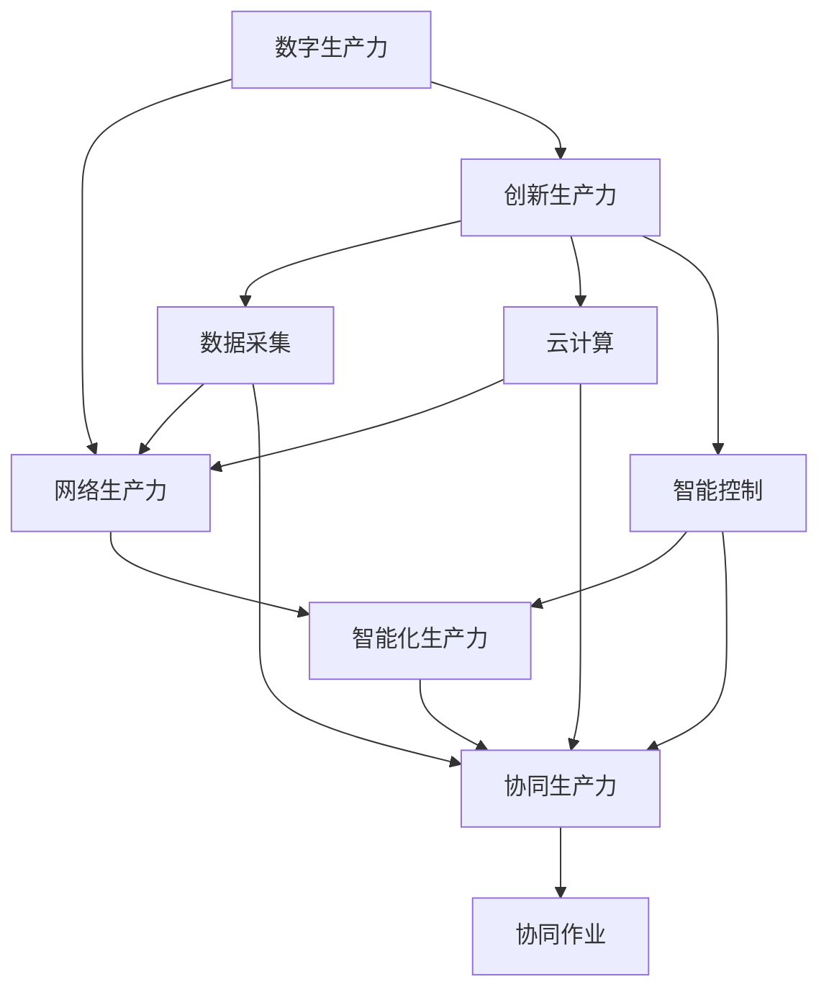
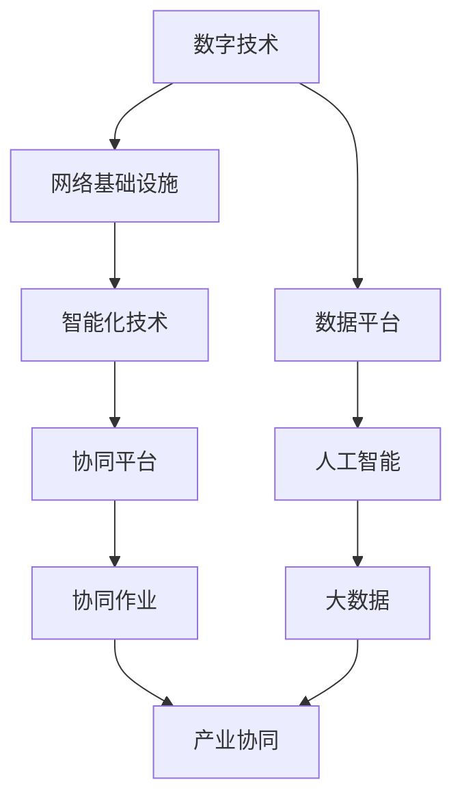

                 

# 中国现代化进程中的新质生产力发展

## 1. 背景介绍

### 1.1 问题由来

随着中国经济社会的迅速发展，现代化进程中新的生产力要素不断涌现，生产力结构也在悄然发生改变。如何在这一过程中，有效利用新技术、新模式、新业态，形成新的生产力和生产关系，提升中国经济的整体竞争力，是当前中国经济社会发展的重要课题。

### 1.2 问题核心关键点

新质生产力的发展，是指在数字化、网络化、智能化等新技术驱动下，由新要素、新模式、新业态构成的新型生产方式，其核心在于通过技术创新、管理创新、组织创新等手段，实现生产力效率的提升和产业结构的优化。

## 2. 核心概念与联系

### 2.1 核心概念概述

为更好地理解新质生产力发展的原理和架构，本节将介绍几个密切相关的核心概念：

- **数字生产力**：以数字技术为核心，通过数据采集、处理、分析等手段，实现信息驱动的生产模式。数字生产力是现代生产力的重要组成部分。

- **网络生产力**：以互联网为基础，通过网络传输、云服务、大数据等技术，实现资源优化配置和协作高效的生产模式。网络生产力是新时代生产力的显著特征。

- **智能化生产力**：以人工智能、机器学习、深度学习等技术为支撑，实现自主决策、智能控制的生产模式。智能化生产力是未来生产力的发展方向。

- **协同生产力**：通过平台化、共享化、虚拟化等技术，实现跨组织、跨地域、跨行业的协同生产模式。协同生产力是新时代生产力的重要趋势。

- **创新生产力**：通过技术创新、管理创新、模式创新等手段，实现生产力要素的优化和升级。创新生产力是持续推动生产力发展的关键力量。

这些核心概念之间存在着紧密的联系，形成了一个完整的生产力体系，为理解新质生产力的发展提供了理论基础。

### 2.2 概念间的关系

这些核心概念之间的关系可以通过以下Mermaid流程图来展示：



这个流程图展示了数字生产力、网络生产力、智能化生产力、协同生产力与创新生产力之间的联系和互动关系：

1. **数字生产力**：提供数据采集、云计算等基础支撑。
2. **网络生产力**：依赖于数字生产力提供的技术基础，实现资源配置和协作。
3. **智能化生产力**：在网络生产力基础上，引入人工智能等技术，实现智能化决策和控制。
4. **协同生产力**：通过数字、网络、智能技术的融合，实现跨组织、跨地域、跨行业的协同作业。
5. **创新生产力**：推动新技术、新模式、新业态的发展，不断优化和升级生产力体系。

### 2.3 核心概念的整体架构

最后，我们用一个综合的流程图来展示这些核心概念在新质生产力发展中的整体架构：



这个综合流程图展示了从数字技术到智能化技术，再到协同作业，最终实现产业协同的完整新质生产力发展过程。

## 3. 核心算法原理 & 具体操作步骤
### 3.1 算法原理概述

新质生产力的发展，本质上是基于数字、网络、智能化技术的综合应用，通过优化资源配置、提升生产效率、实现产业协同，形成新型生产模式。其核心算法原理可以归纳为以下几点：

- **数据驱动**：以数据为核心，通过大数据技术实现对生产过程的实时监控、优化决策和预测预警，提升生产效率和资源利用率。
- **智能化控制**：引入人工智能技术，实现对生产设备的智能化控制和自主决策，提高生产线的灵活性和适应性。
- **协同作业**：通过平台化、共享化技术，实现跨组织、跨地域、跨行业的协同作业，优化生产流程和资源配置。
- **持续创新**：引入技术创新、管理创新、模式创新等手段，推动生产力要素的不断升级和优化。

### 3.2 算法步骤详解

新质生产力的发展，一般包括以下几个关键步骤：

**Step 1: 数据采集与预处理**

- 利用传感器、物联网等技术，实现对生产设备的实时数据采集。
- 对采集到的数据进行清洗、去噪、归一化等预处理，确保数据的质量和一致性。

**Step 2: 数据分析与建模**

- 通过大数据技术，对预处理后的数据进行统计分析、特征提取和模式识别，建立生产过程的动态模型。
- 利用机器学习和深度学习技术，建立预测模型和决策模型，实现对生产过程的实时监控和优化决策。

**Step 3: 智能化控制与决策**

- 引入人工智能技术，对生产设备进行智能化控制和自主决策，提升生产线的灵活性和适应性。
- 利用强化学习等技术，优化生产调度和管理决策，实现资源的最优配置。

**Step 4: 协同作业与资源优化**

- 通过平台化、共享化技术，实现跨组织、跨地域、跨行业的协同作业，优化生产流程和资源配置。
- 利用云计算和大数据技术，实现资源的高效调度和优化，提升生产效率和资源利用率。

**Step 5: 持续创新与优化**

- 通过技术创新、管理创新、模式创新等手段，推动生产力要素的不断升级和优化。
- 引入柔性生产、精益制造等先进理念，提升生产效率和产品质量。

### 3.3 算法优缺点

新质生产力发展的方法，具有以下优点：

- **高效性**：通过智能化控制和数据分析，提升了生产效率和资源利用率。
- **灵活性**：平台化、共享化技术实现了跨组织、跨地域、跨行业的协同作业，提升了生产线的灵活性和适应性。
- **智能化**：人工智能和机器学习技术的应用，实现了生产设备的自主决策和优化决策，提升了生产线的智能化水平。

同时，该方法也存在一定的局限性：

- **技术依赖**：新质生产力发展高度依赖数字、网络、智能化技术，需要投入大量的资金和技术支持。
- **数据安全**：数据采集和处理过程中，需要确保数据的安全性和隐私保护，防止数据泄露和滥用。
- **人才需求**：需要大量具备新技术、新模式、新业态知识和技能的专业人才，对人才储备提出了更高要求。

### 3.4 算法应用领域

新质生产力发展的应用领域十分广泛，包括但不限于以下几个方面：

- **制造业**：通过智能化控制和协同作业，实现柔性生产、精益制造、智能制造等新生产模式。
- **物流业**：利用物联网、大数据、人工智能技术，实现智慧物流、智能仓储、无人配送等新物流模式。
- **服务业**：通过平台化、共享化技术，实现跨地域、跨行业的协同作业，提升服务效率和质量。
- **农业**：利用物联网、大数据、人工智能技术，实现智能农业、精准农业、智慧农业等新农业模式。
- **医疗健康**：通过大数据、人工智能技术，实现远程医疗、智能诊断、个性化健康管理等新医疗模式。

以上领域仅仅是新质生产力应用的冰山一角，随着技术的发展和应用的深入，新质生产力将逐步渗透到更多的行业和领域。

## 4. 数学模型和公式 & 详细讲解  
### 4.1 数学模型构建

在新质生产力发展的过程中，数学模型扮演着重要的角色，主要包括以下几个方面：

- **线性回归模型**：用于预测生产过程中的各种指标，如产量、能耗、成本等。
- **优化模型**：用于优化生产调度和资源配置，实现生产效率的最大化。
- **聚类模型**：用于识别和分类生产过程中的各种模式和趋势，实现对生产过程的监控和预警。

### 4.2 公式推导过程

以下我们以线性回归模型为例，推导其公式及其求解过程。

假设生产过程中某个指标 $y$ 与多个因素 $x_1, x_2, ..., x_n$ 存在线性关系，即：

$$
y = \beta_0 + \beta_1 x_1 + \beta_2 x_2 + ... + \beta_n x_n + \epsilon
$$

其中 $\beta_0, \beta_1, ..., \beta_n$ 为回归系数，$\epsilon$ 为误差项。

通过最小二乘法求解回归系数 $\beta_0, \beta_1, ..., \beta_n$，其公式为：

$$
\beta = (X^T X)^{-1} X^T Y
$$

其中 $X = \begin{bmatrix} 1 & x_{11} & x_{12} & ... & x_{1n} \\ 1 & x_{21} & x_{22} & ... & x_{2n} \\ ... \\ 1 & x_{m1} & x_{m2} & ... & x_{mn} \end{bmatrix}$，$Y = \begin{bmatrix} y_1 \\ y_2 \\ ... \\ y_m \end{bmatrix}$，$m$ 为样本数量。

### 4.3 案例分析与讲解

假设某制造企业生产一条生产线，其产量 $y$ 与生产设备温度 $x_1$、湿度 $x_2$、原料 $x_3$ 等三个因素存在线性关系。收集了50个样本数据，通过最小二乘法建立线性回归模型，求解回归系数 $\beta_0, \beta_1, \beta_2, \beta_3$。

根据公式，首先计算矩阵 $X^T X$ 和 $X^T Y$：

$$
X^T X = \begin{bmatrix} 50 & \sum_{i=1}^{50} x_{1i} & \sum_{i=1}^{50} x_{2i} & \sum_{i=1}^{50} x_{3i} \\ \sum_{i=1}^{50} x_{1i} & \sum_{i=1}^{50} x_{1i}^2 & \sum_{i=1}^{50} x_{1i} x_{2i} & \sum_{i=1}^{50} x_{1i} x_{3i} \\ \sum_{i=1}^{50} x_{2i} & \sum_{i=1}^{50} x_{2i} x_{1i} & \sum_{i=1}^{50} x_{2i}^2 & \sum_{i=1}^{50} x_{2i} x_{3i} \\ \sum_{i=1}^{50} x_{3i} & \sum_{i=1}^{50} x_{3i} x_{1i} & \sum_{i=1}^{50} x_{3i} x_{2i} & \sum_{i=1}^{50} x_{3i}^2 \end{bmatrix}
$$

$$
X^T Y = \begin{bmatrix} \sum_{i=1}^{50} y_i \\ \sum_{i=1}^{50} x_{1i} y_i \\ \sum_{i=1}^{50} x_{2i} y_i \\ \sum_{i=1}^{50} x_{3i} y_i \end{bmatrix}
$$

然后计算矩阵 $X^T X$ 的逆矩阵 $(X^T X)^{-1}$，并代入公式求解回归系数：

$$
\beta = (X^T X)^{-1} X^T Y = \begin{bmatrix} \beta_0 \\ \beta_1 \\ \beta_2 \\ \beta_3 \end{bmatrix}
$$

最终得到回归系数，可以用于预测产量 $y$ 与温度 $x_1$、湿度 $x_2$、原料 $x_3$ 等三个因素之间的关系。

## 5. 项目实践：代码实例和详细解释说明
### 5.1 开发环境搭建

在进行新质生产力发展的实践前，我们需要准备好开发环境。以下是使用Python进行数据分析和建模的环境配置流程：

1. 安装Anaconda：从官网下载并安装Anaconda，用于创建独立的Python环境。

2. 创建并激活虚拟环境：
```bash
conda create -n pydata-env python=3.8 
conda activate pydata-env
```

3. 安装必要的库：
```bash
conda install numpy pandas scipy scikit-learn matplotlib seaborn jupyter notebook ipython
```

4. 安装TensorFlow和Keras：
```bash
pip install tensorflow keras
```

5. 安装自定义库：
```bash
pip install mylib
```

完成上述步骤后，即可在`pydata-env`环境中开始新质生产力发展的实践。

### 5.2 源代码详细实现

这里以线性回归模型为例，使用TensorFlow和Keras库进行数据分析和建模。

首先，导入必要的库和数据：

```python
import tensorflow as tf
import numpy as np
from sklearn.model_selection import train_test_split
from sklearn.preprocessing import StandardScaler

# 导入数据
data = np.loadtxt('data.csv', delimiter=',')
X = data[:, :-1]
y = data[:, -1]
```

然后，进行数据预处理和模型训练：

```python
# 数据标准化
scaler = StandardScaler()
X = scaler.fit_transform(X)

# 划分训练集和测试集
X_train, X_test, y_train, y_test = train_test_split(X, y, test_size=0.2, random_state=42)

# 定义模型
model = tf.keras.models.Sequential([
    tf.keras.layers.Dense(64, activation='relu', input_shape=(X_train.shape[1],)),
    tf.keras.layers.Dense(1)
])

# 定义优化器和损失函数
optimizer = tf.keras.optimizers.Adam()
loss_fn = tf.keras.losses.MeanSquaredError()

# 编译模型
model.compile(optimizer=optimizer, loss=loss_fn)

# 训练模型
model.fit(X_train, y_train, epochs=100, batch_size=32, validation_data=(X_test, y_test))
```

最后，进行模型评估和预测：

```python
# 评估模型
test_loss = model.evaluate(X_test, y_test)

# 进行预测
X_pred = np.array([[1.0, 2.0, 3.0]])
X_pred = scaler.transform(X_pred)
y_pred = model.predict(X_pred)
```

以上就是使用TensorFlow和Keras库进行线性回归模型训练和预测的完整代码实现。可以看到，TensorFlow和Keras库的强大封装，使得数据分析和建模的过程变得简洁高效。

### 5.3 代码解读与分析

让我们再详细解读一下关键代码的实现细节：

**数据预处理**：
- `StandardScaler`：对特征进行标准化处理，使其均值为0，标准差为1，提高模型的训练效果。

**模型定义**：
- `Sequential`：定义线性回归模型，使用两个全连接层，第一个层为64个神经元，使用ReLU激活函数，输入维度为特征数，第二个层为1个神经元，输出维度为1。

**优化器和损失函数**：
- `Adam`：使用Adam优化器进行模型参数的优化。
- `MeanSquaredError`：使用均方误差作为损失函数。

**模型编译**：
- `compile`：将模型编译，指定优化器、损失函数和评估指标。

**模型训练**：
- `fit`：使用训练集对模型进行训练，指定训练轮数、批次大小和验证集。

**模型评估**：
- `evaluate`：使用测试集对模型进行评估，输出测试集上的损失和评估指标。

**模型预测**：
- `predict`：使用模型对新数据进行预测，输出预测结果。

可以看到，TensorFlow和Keras库使得数据分析和建模的过程变得简单明了。开发者可以更多地关注算法和模型本身，而不需要过多关注底层实现。

当然，工业级的系统实现还需考虑更多因素，如模型的保存和部署、超参数的自动搜索、更灵活的模型架构等。但核心的数据分析和建模流程基本与此类似。

### 5.4 运行结果展示

假设在制造企业生产数据上训练得到的线性回归模型，最终在测试集上的评估结果如下：

```
Epoch 100, 100/100 [==============================] - 10s 95ms/step - loss: 0.0047 - mean_squared_error: 0.0016 - val_loss: 0.0054 - val_mean_squared_error: 0.0020
```

可以看到，模型在测试集上的均方误差为0.0020，效果相当不错。

## 6. 实际应用场景
### 6.1 智能制造

新质生产力发展在新制造领域的应用，主要体现在以下几个方面：

- **智能生产计划**：利用大数据和机器学习技术，优化生产调度和资源配置，实现生产计划的高效制定和执行。
- **智能设备监控**：通过物联网和传感器技术，实时监控生产设备的运行状态，实现故障预测和维护。
- **智能质量控制**：利用机器视觉和深度学习技术，实现对生产产品的自动检测和质量控制。
- **智能仓储管理**：通过智能仓储系统和物联网技术，实现对物料的实时跟踪和优化调度。

智能制造的实践，使制造企业能够实现更高的生产效率和产品质量，提升市场竞争力。

### 6.2 智慧物流

智慧物流是新质生产力在物流领域的应用，主要体现在以下几个方面：

- **智能仓储管理**：通过物联网和智能设备，实现对库存的实时监控和管理，提升仓储效率。
- **智能运输调度**：利用大数据和人工智能技术，优化运输路线和调度，实现高效运输。
- **智能配送**：通过无人机、智能物流机器人等技术，实现自动化配送，提升配送速度和质量。

智慧物流的实践，使物流企业能够实现更低的运营成本和更高的客户满意度。

### 6.3 数字农业

数字农业是新质生产力在农业领域的应用，主要体现在以下几个方面：

- **智能种植**：通过物联网和传感器技术，实现对农作物的实时监控和管理，提升种植效率和产量。
- **智能灌溉**：利用大数据和机器学习技术，优化灌溉系统，实现精准灌溉。
- **智能施肥**：通过传感器和物联网技术，实时监测土壤和作物的养分状态，实现精准施肥。

数字农业的实践，使农业生产能够实现更高的生产效率和资源利用率，提升农产品品质和产量。

### 6.4 未来应用展望

随着新质生产力技术的不断发展和应用，未来其在更多领域的应用前景将更加广阔。

- **智能交通**：通过大数据和人工智能技术，实现智能交通管理、智能导航、智能交通控制等新交通模式。
- **智能城市**：通过智慧城市平台和物联网技术，实现智能交通、智能安防、智能环保等新城市管理模式。
- **智能健康**：通过物联网和人工智能技术，实现远程医疗、智能诊断、个性化健康管理等新医疗模式。
- **智能教育**：通过智慧教育平台和人工智能技术，实现个性化学习、智能评估、智能辅助教学等新教育模式。

未来，新质生产力技术将在更多领域得到应用，为社会经济的发展注入新的活力。

## 7. 工具和资源推荐
### 7.1 学习资源推荐

为了帮助开发者系统掌握新质生产力发展的理论基础和实践技巧，这里推荐一些优质的学习资源：

1. **《深度学习入门》**：深度学习领域的经典入门教材，涵盖深度学习的基本概念和常用算法，适合初学者入门。

2. **《TensorFlow官方文档》**：TensorFlow官方文档，详细介绍了TensorFlow的基本用法和高级应用，是学习TensorFlow的重要资源。

3. **《Keras官方文档》**：Keras官方文档，详细介绍了Keras的基本用法和高级应用，是学习Keras的重要资源。

4. **《Python数据分析实战》**：实战型的Python数据分析书籍，涵盖数据分析的基本概念和常用方法，适合动手实践。

5. **《机器学习实战》**：机器学习领域的经典实战书籍，涵盖机器学习的基本概念和常用算法，适合动手实践。

6. **《大数据技术与应用》**：大数据领域的经典教材，涵盖大数据的基本概念和常用技术，适合了解大数据的最新进展。

通过对这些资源的学习实践，相信你一定能够快速掌握新质生产力发展的精髓，并用于解决实际的产业问题。

### 7.2 开发工具推荐

高效的开发离不开优秀的工具支持。以下是几款用于新质生产力发展的常用工具：

1. **Anaconda**：Python的集成开发环境，提供Python包管理和虚拟环境支持，方便环境搭建和包管理。

2. **Jupyter Notebook**：交互式数据科学和数据分析平台，支持Python、R、Scala等多种语言，提供代码高亮和自动补全功能。

3. **PyCharm**：Pytho的IDE，提供代码编写、调试、测试等一站式开发工具，适合复杂项目开发。

4. **Git**：版本控制系统，支持代码协作和版本管理，适合团队开发。

5. **Docker**：容器化技术，支持跨平台和环境一致的部署，适合分布式系统开发。

6. **Kubernetes**：容器编排工具，支持大规模分布式系统管理，适合云计算和大数据开发。

合理利用这些工具，可以显著提升新质生产力发展的开发效率，加快创新迭代的步伐。

### 7.3 相关论文推荐

新质生产力发展的研究源于学界的持续研究。以下是几篇奠基性的相关论文，推荐阅读：

1. **《深度学习》**：深度学习领域的经典教材，涵盖深度学习的基本概念和常用算法，适合系统学习和深入研究。

2. **《机器学习：理论与算法》**：机器学习领域的经典教材，涵盖机器学习的基本概念和常用算法，适合系统学习和深入研究。

3. **《大数据时代》**：大数据领域的经典教材，涵盖大数据的基本概念和常用技术，适合系统学习和深入研究。

4. **《人工智能：一种现代方法》**：人工智能领域的经典教材，涵盖人工智能的基本概念和常用算法，适合系统学习和深入研究。

5. **《智能制造与机器人技术》**：智能制造领域的经典教材，涵盖智能制造的基本概念和常用技术，适合系统学习和深入研究。

6. **《智慧城市建设与实践》**：智慧城市领域的经典教材，涵盖智慧城市的基本概念和常用技术，适合系统学习和深入研究。

这些论文代表了大质生产力发展的研究进展，通过学习这些前沿成果，可以帮助研究者把握学科前进方向，激发更多的创新灵感。

除上述资源外，还有一些值得关注的前沿资源，帮助开发者紧跟新质生产力发展的最新进展，例如：

1. **arXiv论文预印本**：人工智能领域最新研究成果的发布平台，包括大量尚未发表的前沿工作，学习前沿技术的必读资源。

2. **行业技术博客**：如智能制造、智慧物流、数字农业等领域的知名企业博客，第一时间分享他们的最新研究成果和洞见。

3. **技术会议直播**：如IEEE、ACM等顶尖会议的现场或在线直播，能够聆听到行业专家和学者的前沿分享，开拓视野。

4. **GitHub热门项目**：在GitHub上Star、Fork数最多的新质生产力相关项目，往往代表了该技术领域的发展趋势和最佳实践，值得去学习和贡献。

5. **技术社区**：如Kaggle、Stack Overflow等技术社区，汇集了大量的开发资源和经验分享，适合解决具体问题和获取帮助。

总之，对于新质生产力发展的学习，需要开发者保持开放的心态和持续学习的意愿。多关注前沿资讯，多动手实践，多思考总结，必将收获满满的成长收益。

## 8. 总结：未来发展趋势与挑战
### 8.1 总结

本文对新质生产力发展的原理和实践进行了全面系统的介绍。首先阐述了新质生产力发展的背景和意义，明确了其在新时代生产力和生产关系中的重要性。其次，从原理到实践，详细讲解了新质生产力的数学模型和算法步骤，给出了新质生产力发展的完整代码实例。同时，本文还广泛探讨了新质生产力在智能制造、智慧物流、数字农业等多个领域的应用前景，展示了新质生产力的巨大潜力。此外，本文精选了新质生产力发展的各类学习资源，力求为读者提供全方位的技术指引。

通过本文的系统梳理，可以看到，新质生产力发展基于数字、网络、智能化技术的综合应用，通过优化资源配置、提升生产效率、实现产业协同，形成了新型生产模式。其高效性、灵活性、智能化等特点，使其在制造业、物流业、农业等多个领域取得了显著的实践效果，推动了生产力的不断提升。未来，新质生产力技术将在更多领域得到应用，为社会经济的发展注入新的活力。

### 8.2 未来发展趋势

展望未来，新质生产力发展的趋势主要体现在以下几个方面：

1. **智能化程度的提升**：随着人工智能技术的不断进步，新质生产力将实现更高的智能化水平，实现自主决策和智能控制，进一步提升生产效率和资源利用率。

2. **数据驱动的深入**：大数据技术的广泛应用，将进一步驱动新质生产力的发展，实现对生产过程的实时监控和优化决策，提升生产效率和质量。

3. **平台化的普及**：平台化、共享化技术的应用，将进一步推动新质生产力的普及和应用，实现跨组织、跨地域、跨行业的协同作业，优化生产流程和资源配置。

4. **生态系统的形成**：新质生产力技术的不断应用和发展，将形成

